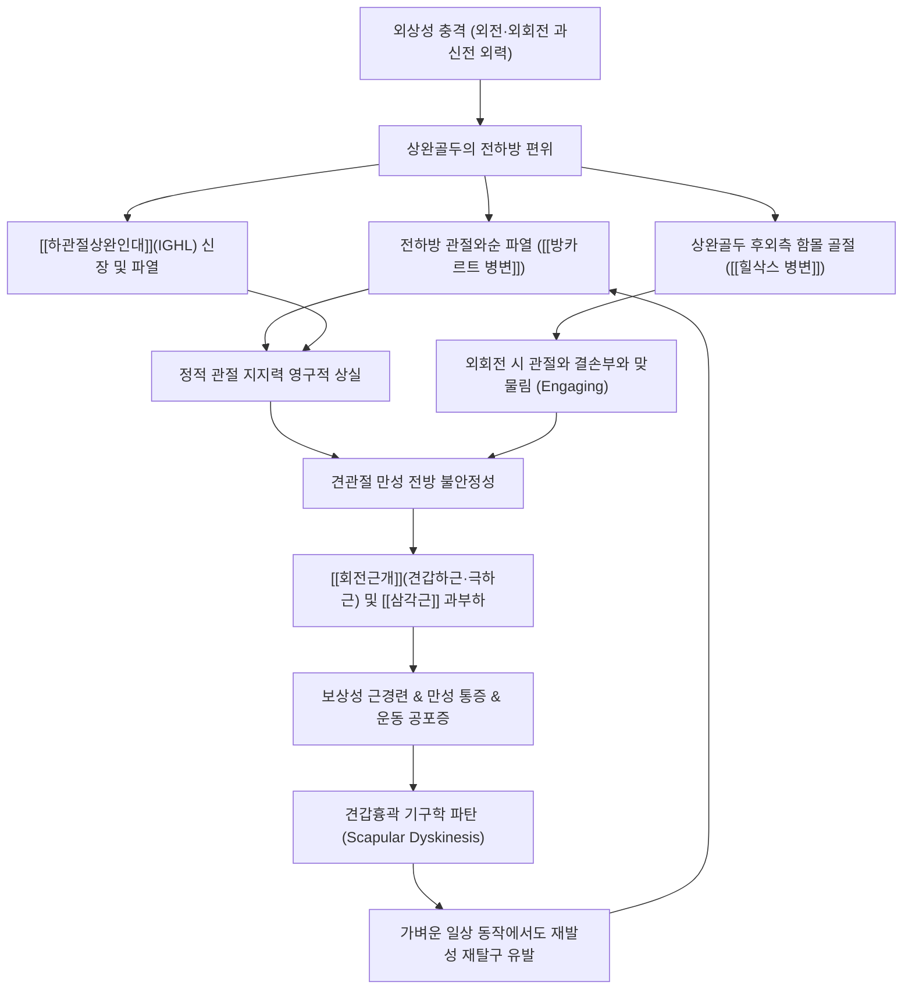

# 🩺 [[어깨 탈구]] (Dislocation of Shoulder / 肩關節脫臼, S43.0)

> **핵심 3줄 요약 (Key Summary)**:
> - 📍 **병소 부위 & 해부·병태생리**: [[상완골]]두가 [[견갑골]]의 관절와(Glenoid fossa)에서 완전히 이탈하는 질환으로, 95% 이상이 **전방 탈구(Anterior dislocation)**이다. 전하방 [[관절와순]] 파열인 [[방카르트 병변]](Bankart lesion)과 상완골두 후외측 함몰 골절인 [[힐삭스 병변]](Hill-Sachs lesion), [[하관절상완인대]](IGHL) 손상이 불안정성의 핵심 병리이다.
> - 🚩 **전형적 임상 양상**: 외상 직후 극심한 통증, 팔을 약간 외전·외회전한 채 반대편 손으로 받치고 있는 특징적 자세, 삼각근 팽륭이 소실되고 견봉이 각지게 돌출되는 **견장 징후(Epaulet deformity / Square shoulder)** 및 관절와 하방의 골두 촉지.
> - 🛠️ **핵심 감별 검사 & 한·양방 다각적 치료 전략**: 외상 초기 방사선(AP, Scapular Y, Axillary view)으로 골절 동반 여부 확인 후 즉각적 도수 정복(커닝햄, 외회전법, 밀치법 등) 시행. 급성기 1~2주 슬링 고정 후 점진적 회전근개·견갑안정화 재활. 침·약침 치료는 근경련 완화와 관절낭 치유 촉진에 유효하다.
> - <font color="#fa7e7e">⚠️ **응급 의뢰 레드플래그 & 악화 요인**: ① 요골동맥 맥박 소실 및 상지 냉감·청색증([[액와동맥]] 손상 의심) ② 삼각근 부위 감각 소실 및 수축 불가([[액와신경]] 손상) ③ 대결절 복합 골절 또는 관절와 골절 동반 ④ 도수 정복 불가 시 즉시 정형외과 응급 수술 의뢰.</font>

---

## 📌 목차
1. [질환 개요 & 해부학적 병태생리](#1-질환-개요--해부학적-병태생리)
2. [병태생리 메커니즘 & 생체역학적 악순환 네트워크](#2-병태생리-메커니즘--생체역학적-악순환-네트워크)
3. [임상 증상 & 이학적 검사(Physical Exam) 알고리즘](#3-임상-증상--이학적-검사physical-exam-알고리즘)
4. [감별 진단 매트릭스 (Differential Diagnosis)](#4-감별-진단-매트릭스-differential-diagnosis)
5. [한의 통합 치료 프로토콜 (침·약침·추나·한약)](#5-한의-통합-치료-프로토콜-침약침추나한약)
6. [양방 치료 & 병용·의뢰 기준 (Conventional Treatment & Referral)](#6-양방-치료--병용의뢰-기준-conventional-treatment--referral)
7. [재활 운동 & 생활습관 티칭 가이드](#7-재활-운동--생활습관-티칭-가이드)
8. [💡 사용자 진료실 핵심 필기 & 임상 노하우 (Melt-In 잔여 심화 집약)](#8--사용자-진료실-핵심-필기--임상-노하우-melt-in-잔여-심화-집약)
9. [출처 및 학술 참고 문헌 (References)](#9-출처-및-학술-참고-문헌-references)

---

## 1. 질환 개요 & 해부학적 병태생리

![[어깨탈구_01_환부실사_견봉돌출변형.jpg|450]]
> [그림 1: ① 환부 실사 — 전방 어깨 탈구로 인한 삼각근 팽륭 소실 및 견봉 돌출(견장 징후, Epaulet deformity). 출처: Wikimedia Commons (CC BY-SA 4.0)]

![[어깨탈구_01_Xray_전방탈구소견.png|450]]
> [그림 2: ② 영상 소견 — 우측 견관절 전후방(AP) X-ray에서 관절와 전하방(오훼돌기 하방)으로 탈구된 상완골두. 출처: Wikimedia Commons (CC BY-SA 4.0)]

![[어깨탈구_01_영상소견_방카르트_힐삭스_병변.jpg|450]]
> [그림 3: ② 영상 소견(병변) — 어깨 탈구 정복 전후 방사선 사진 및 동반된 골성 방카르트(Bankart) 병변과 힐삭스(Hill-Sachs) 함몰 골절 소견. 출처: Wikimedia Commons (CC BY-SA 3.0)]

* **질환 정의 및 분류**:
  * **정의**: [[상완골]]의 골두가 [[견갑골]] 관절와(Glenoid fossa)의 정상적인 관절 접촉면에서 완전히 벗어난 상태. 인체에서 가장 관절 가동 범위(ROM)가 큰 만큼 해부학적으로 가장 불안정하여 **전신 관절 탈구의 약 50%를 차지**할 정도로 호발한다.
  * **탈구 방향에 따른 분류**:
    1. **전방 탈구 (Anterior dislocation)**: 전체 탈구의 **95~97%**를 차지. 팔이 외전(Abduction), 외회전(External rotation), 신전(Extension)된 상태에서 전방으로 가해지는 간접 외력(낙상 시 손을 짚는 동작, 투구 동작 등)에 의해 발생. 상완골두의 최종 위치에 따라 오훼하(Subcoracoid, 최다), 관절와하(Subglenoid), 쇄골하(Subclavicular) 탈구로 나뉜다.
    2. **후방 탈구 (Posterior dislocation)**: 약 **2~4%**. 팔이 내전, 내회전된 상태에서 전방에서 후방으로 가해지는 직접 타격, 또는 **간질 발작(Seizure)이나 감전 사고(Electrical shock)** 시 내회전근(견갑하근, 대흉근, 광배근)의 강력한 불균형 수축으로 발생. 임상 및 단순 X-ray에서 간과되기 쉬워 진단 지연이 잦다.
    3. **하방 탈구 (Inferior dislocation / Luxatio erecta)**: 1% 미만으로 극히 드묾. 팔이 완전 거상된 상태에서 과도한 외력이 가해져 발생하며, 환자는 팔을 머리 위로 올린 채 내리지 못하는 독특한 자세를 취한다. 신경·혈관 손상 빈도가 매우 높다.
* **역학적 특성** (출처: MSD 매뉴얼 전문가용 & Zacchilli et al., [PMID 20194311](https://pubmed.ncbi.nlm.nih.gov/20194311/)):
  * 연간 인구 10만 명당 약 23.9건 발생하며, 남성이 전체의 71.8%를 차지한다.
  * **연령별 쌍봉형(Bimodal) 분포**:
    * **1차 피크 (15~29세)**: 젊은 남성층에서 고에너지 스포츠 손상이나 낙상으로 호발. 관절와순 파열 및 관절낭 이완이 동반되어 **초기 탈구 후 재발률이 70~90%에 달함**.
    * **2차 피크 (60~80세)**: 고령 여성층에서 단순 일상 낙상으로 호발. 골다공증 및 퇴행성 변화로 인해 관절와순 파열보다는 **[[회전근개 파열]](특히 견갑하근 파열) 및 대결절 골절 동반 빈도가 40~60% 이상**으로 급증한다.
* **관련 해부학적 구조물**:
  * **골격 및 관절면**: [[상완골]]두(Humeral head)는 구형인 반면, 관절와(Glenoid)는 골두 표면적의 1/3~1/4에 불과한 얕은 접시 모양(골프공을 골프 티 위에 올려놓은 형태)이다.
  * **정적 안정자 (Static stabilizers)**:
    * **[[관절와순]](Glenoid labrum)**: 섬유연골 테두리로 관절와의 깊이를 50% 이상 깊게 만들어 안정성을 제공.
    * **관절낭 및 관절상완인대(GHL)**: 특히 **하관절상완인대 복합체(IGHLC: Inferior Glenohumeral Ligament Complex)**의 전방 밴드(Anterior band)가 90도 외전 및 외회전 시 전방 전위를 막는 가장 중요한 정적 지지띠이다.
  * **동적 안정자 (Dynamic stabilizers)**:
    * **[[회전근개]](Rotator Cuff)**: [[견갑하근]](Subscapularis - 전방 안정성), [[극상근]](Supraspinatus), [[극하근]](Infraspinatus), [[소원근]](Teres minor). 상완골두를 관절와 중심부로 강하게 압박(Concavity-compression mechanism)하여 안정화.
    * **[[상완이두근]] 장두건(Long head of biceps tendon)**: 상완골두의 상방 및 전방 전위를 억제.
  * **위험 신경 및 혈관**:
    * **[[액와신경]](Axillary nerve)**: 상완골 경부 하방과 사각공(Quadrangular space)을 통과하여 [[삼각근]]과 소원근을 지배. 탈구 시 견인 손상 빈도가 10~40%에 달함.
    * **[[액와동맥]](Axillary artery)**: 고령 환자의 혈관벽 석회화가 동반된 경우 탈구 또는 무리한 정복 시 파열 위험 존재.

---

## 2. 병태생리 메커니즘 & 생체역학적 악순환 네트워크

![[견관절낭_해부도_인대구조.png|450]]
> [그림 4: ③ 관련 해부학적 구조물 — 견관절 관절낭 및 하관절상완인대(IGHL), 관절와순의 지지 구조 도해. 출처: Gray's Anatomy (Public Domain)]



### 1) 해부학적 파괴 기전: 필수 동반 병변
1. **[[방카르트 병변]](Bankart Lesion)**:
   * 상완골두가 전하방으로 빠져나가면서 전하방 관절와순(Labrum)이 관절와 골연골 테두리에서 뜯겨나가는 손상.
   * 관절와순만 찢어지는 섬유성 방카르트(Soft tissue Bankart)와 관절와 골 테두리 골절이 동반되는 **골성 방카르트(Bony Bankart)**로 나뉜다. 골 결손이 20~25%를 초과할 경우 관절경적 봉합술만으로는 재발 위험이 높아 오훼돌기 이전술(Latarjet procedure)이 필요하다.
2. **[[힐삭스 병변]](Hill-Sachs Lesion)**:
   * 탈구된 연약한 상완골두의 후외측 해면골이 단단한 전하방 관절와 테두리와 강하게 충돌하면서 발생하는 압박 골절(Impaction fracture).
   * 전방 탈구의 약 80% 이상에서 관찰되며, 팔을 외전·외회전할 때 이 함몰 부위가 관절와 전방 테두리에 걸리는 현상(Engaging Hill-Sachs)이 발생하면 경미한 외력에도 쉽게 재탈구된다.
3. **인대 및 관절낭 손상**:
   * 하관절상완인대 복합체(IGHLC)의 파열 또는 상완골 부착부 견열 손상(HAGL: Humeral Avulsion of the Glenohumeral Ligament)이 동반되면 전방 지지력이 완전히 붕괴된다.

### 2) 생체역학적 연쇄 반응 (Kinetic Chain & Scapular Dyskinesis)
* 정상적인 견관절 운동에서는 상완골두가 관절와 중앙에 유지되는 '구심화(Centering)'가 정밀하게 작동한다.
* 탈구 후 정적 인대 지지력이 상실되면, 관절을 안정시키기 위해 [[견갑하근]], [[극하근]], [[승모근]], [[전거근]] 등의 동적 근육군이 비정상적으로 과도하게 긴장하게 된다.
* 이로 인해 견갑골이 흉벽에 밀착되지 못하고 익상(Winging)되거나 비대칭적으로 거상되는 **견갑골 이상운동증(Scapular dyskinesis)**이 동반되며, 이는 상완골두를 전방으로 더욱 밀어내는 전단력을 발생시켜 재탈구의 위험을 극대화한다.

---

## 3. 임상 증상 & 이학적 검사(Physical Exam) 알고리즘

### 1) 주소증 및 신경혈관 평가
* **통증 및 운동 불능**: 환자는 극심한 견관절 통증을 호소하며, 팔을 몸에 붙이거나 움직이려 하지 않는다.
* **특징적 자세**: 팔을 약 20~30도 외전 및 외회전 상태로 유지하고, 건측(건강한 쪽) 손으로 환측 팔꿈치나 전완을 조심스럽게 받쳐 든 자세로 내원한다.
* **외관 변형 (Deformity)**:
  * **견장 징후(Epaulet deformity / Square shoulder)**: 둥근 삼각근 윤곽이 상완골두의 이탈로 인해 편평하게 함몰되고, 상부의 [[견봉]](Acromion)이 사각형 어깨 형태로 날카롭게 돌출되어 보인다.
  * **전방 융기**: 오훼돌기 하방 또는 액와부에서 비정상적인 골두 융기부가 만져진다.
* **신경학적 검사 (Axillary Nerve Assessment - 필수 선행)**:
  * **감각 평가**: 삼각근 외측 중앙부(견장 부위, 'Regimental badge area')의 가벼운 촉각 및 핀프릭 감각 저하 여부를 반드시 정복 전후로 확인한다.
  * **운동 평가**: 탈구 상태에서는 능동 거상이 불가능하므로 등척성 삼각근 수축 촉지로 평가하되, 통증이 심하면 정복 후 지연 평가한다.
* **혈관 평가 (Vascular Assessment)**:
  * 요골동맥(Radial artery) 맥박 촉지, 모세혈관 재충혈 시간(Capillary refill time), 상지 피부 온도 및 색조를 확인하여 액와동맥 손상을 배제한다.

### 2) 필수 이학적 검사법 (Physical Examination)

![[shoulder_apprehension_clinical_maneuver.jpg|420]]
> [그림 5: ④ 이학적 검사 시연 실사 — 견관절 90도 외전 및 외회전 상태에서 전방 불안정성을 유발·평가하는 전방 불안 검사(Apprehension Test). 출처: Wikimedia Commons / Orthopaedic Examination Series (CC BY-SA 3.0)]

* **급성기 정복 전 확인 검사**:
  * **더가스 징후(Dugas Test)**: 환측 손을 반대편 어깨에 얹은 상태에서 환측 팔꿈치를 가슴벽에 닿도록 시도. 정상인은 통증 없이 접촉이 가능하나, 전방 탈구 환자는 상완골두의 기계적 걸림과 통증으로 인해 **팔꿈치가 가슴벽에 절대 닿지 않는다(Dugas sign 양성)**.
* **정복 후 및 만성 불안정성 평가 검사 (급성 정복 직후에는 금기, 3~6주 후 시행)**:
  * **[[전방 불안 검사]](Anterior Apprehension Test)**:
    * 환자를 앙와위로 눕히고 검사자는 환자의 어깨를 90도 외전, 팔꿈치를 90도 굴곡시킨 상태에서 서서히 외회전(External rotation)을 가한다.
    * **양성 반응**: 통증보다도 **"어깨가 다시 빠질 것 같다"는 극심한 불안감과 공포(Apprehension)**를 느끼며 저항하거나 몸을 움츠린다. (단순 통증만 호소하는 경우는 충돌증후군 가능성).
  * **[[재배치 검사]](Jobe Relocation Test)**:
    * 불안 검사 양성 위치에서 검사자의 손으로 상완골두 전면을 후방(바닥 쪽)으로 강하게 누르며 안정시킨다.
    * **양성 반응**: 후방 압박 시 불안감과 통증이 즉각 소실되고 외회전 각도가 유의미하게 더 증가한다. 손을 떼었을 때 다시 불안감이 나타나면(Surprise / Release test) 전방 관절와순 파열 확진에 매우 높은 특이도를 가진다.
  * **[[고랑 징후]](Sulcus Sign)**:
    * 팔을 몸 옆에 자연스럽게 내린 상태에서 검사자가 환자의 팔꿈치를 잡고 하방으로 견인. 견봉 하방에 1cm 이상의 피부 함몰(고랑)이 관찰되면 **다방향 불안정성(MDI: Multidirectional Instability)** 또는 하관절낭 이완을 의미.

---

## 4. 감별 진단 매트릭스 (Differential Diagnosis)

| 감별 질환 | 호발 병소 및 원인 | 주소증 차이점 | 특이적 이학적 검사 소견 | 영상 소견 차이 |
| :--- | :--- | :--- | :--- | :--- |
| **[[어깨 탈구]] (본 질환)** | 관절와상완관절 완전 이탈 (전방 95%) | 외상 직후 극심한 통증, 팔 고정, 사각형 어깨 변형 | [[더가스 검사]](Dugas) 양성, 정복 후 [[불안 검사]](Apprehension) 양성 | X-ray상 상완골두가 관절와 밖으로 완전 이탈, Bankart/Hill-Sachs 병변 |
| **[[견봉쇄골관절 탈구]] (AC Separation)** | 견봉쇄골인대 및 오훼쇄골인대 파열 | 어깨 꼭대기(견봉 상부) 국소 통증, 쇄골 외측단 돌출 | 수평 내전 검사(Cross-body adduction) 양성, 피아노 건반 징후(Piano key sign) | 견봉과 쇄골 외측단 사이의 간격 증대 및 쇄골 상방 전위, 관절와 골두는 정상 |
| **[[회전근개 파열]] (급성 외상성)** | 극상근·견갑하근 건 파열 (중장년 호발) | 능동 거상 불가, 수동 거상은 가능(Drop arm), 어깨 변형 없음 | [[낙하 검사]](Drop arm test) 양성, 엠프티 캔 검사 양성, Dugas 음성 | 단순 X-ray 정상 또는 상완골두 상방 전위, MRI상 건 단열 확인 |
| **[[근위 상완골 골절]] (대결절/해부경)** | 골다공증 노인 낙상, 외상 | 광범위한 피하 출혈(에키모시스), 심한 부종, 염발음 | 전 방향 운동 제한, Dugas 검사 음성이나 극심한 골성 통증 | X-ray상 대결절 또는 외과경 골절선 명확, 관절와-골두 접촉 유지 |
| **[[석회성 건염]] 급성 발작** | 극상근건 내 수산화아파타이트 석회 침착 | 외상력 없음, 야간에 갑작스러운 비명 통증, 발열감 | 전 방향 수동 ROM 극심한 통증 제한, 어깨 변형 없음 | X-ray상 회전근개 부위 짙은 방사선 불투과성 석회 침착 음영 |

---

## 5. 한의 통합 치료 프로토콜 (침·약침·추나·한약)

![[어깨탈구_05_술기실사_도수정복술_Cunningham.jpg|400]]
> [그림 6: ⑤ 도수 정복 술기 실사 — 환자를 이완시키고 승모근·삼각근·상완이두근을 마사지하며 가벼운 견인으로 정복하는 커닝햄(Cunningham) 정복 기법. 출처: Wikimedia Commons (CC BY 4.0)]

![[어깨탈구_05_술기실사_견관절_도수평가및가동.jpg|400]]
> [그림 7: ⑥ 한의 술기 실사 — 견관절 아급성기 및 재활 회복기 관절 가동 및 도수 치료 실사. 출처: Wikimedia Commons (Public Domain, US Navy)]

### 1) 응급 정복 기법 (Reduction Techniques — 통증 최소화 비침습 정복)
* **도수 정복 원칙**: 과도한 힘이나 지레 작용(과거 히포크라테스법이나 무리한 코허법)은 상완골 경부 골절, 관절와 골절, 액와신경 마비를 초래하므로 절대 금기.
* **추천 정복법**:
  1. **커닝햄 기법 (Cunningham Technique)** ([PMID 39029266](https://pubmed.ncbi.nlm.nih.gov/39029266/)):
     * 환자를 편안히 앉히고 어깨를 뒤로 젖히게 한 후, 검사자가 환자의 손목을 가볍게 아래로 견인하면서 다른 손으로 환자의 **[[승모근]], [[삼각근]], [[상완이두근]]을 부드럽게 마사지**하여 근경련을 해제한다. 환자가 완전히 이완되면 외력 없이도 골두가 저절로 미끄러져 정복된다. 성공률이 높고 진정제 투여가 불필요하다.
  2. **외회전법 (Hennepin Technique / External Rotation Method)**:
     * 팔꿈치를 90도로 굽히고 몸통에 밀착시킨 후, 수분에 걸쳐 극도로 천천히 외회전만 유도하여 견갑하근 경련을 풀며 자연 정복시키는 가장 안전한 기법.
  3. **밀치법 (Milch Technique)**:
     * 팔을 천천히 외전 및 거상시키며 골두를 엄지손가락으로 관절와 방향으로 살짝 밀어 올리는 방법.

### 2) 침구 치료 (Acupuncture)
* **급성기 (정복 전후 근육 경련 및 통증 제어)**:
  * 정복 전 침 치료는 진정마취제의 훌륭한 대안으로 근긴장을 해소하여 정복을 용이하게 한다(Ackerman et al., [PMID 37833202](https://pubmed.ncbi.nlm.nih.gov/37833202/)).
  * **주요 혈위**: [[견정]](GB21), [[견우]](LI15), [[견료]](TE14), [[노회]](TE13), [[비노]](LI14), [[천종]](SI11), [[곡지]](LI11).
  * **전침 요법 (Electroacupuncture)**:
    * 급성 통증기: 100Hz 고주파 전침으로 게이트 컨트롤 통증 차단(내인성 오피오이드 방출).
    * 회복기: 2Hz 저주파 전침을 견우-견료, 비노-곡지에 자극하여 신경근 촉진 및 위축된 삼각근 활성화.

### 3) 약침 치료 (Pharmacopuncture)
* **치료 목적**: 관절낭 파열부의 급성 무균성 염증 제거, 미세 손상된 인대·관절와순의 섬유아세포 증식 및 조직 재생 촉진.
* **약침 제제 및 주입점**:
  * **급성 염증기 (1~2주)**: [[황련해독탕]] 약침 또는 [[소염약침]]을 관절와 전방 오훼돌기 하방 및 견우혈 심부에 1.0~2.0cc 주입하여 관절강 내 혈종 및 염증 부종 완화.
  * **조직 재생 및 안정화기 (3주 이후)**: [[자하거약침]](Hominis Placenta) 또는 [[신바로약침]]을 파열된 하관절상완인대(IGHLC) 부착부, 견갑하근건, 상완이두근 장두건 부착부에 0.5~1.0cc씩 분할 주입하여 교원질 합성과 인대 장력 회복 도모.

### 4) 추나 치료 (Chuna Manipulation)
* ⚠️ **급성기 정복 직후 절대 금기**: 외전-외회전 결합 동작, 강한 고속저진폭 수기(HVLA), 관절낭 신장 수기는 재탈구를 유발하므로 절대 엄금.
* **아급성기 및 만성기 (고정 해제 후 3~4주차부터)**:
  * **견갑흉곽관절(ST Joint) 가동술**: 환자를 측와위로 눕히고 견갑골 하각과 척추연을 파지하여 상방회전, 후인, 하강 방향으로 부드럽게 가동시켜 견갑상완 리듬(Scapulohumeral rhythm) 정상화.
  * **흉추 신전 가동술**: 흉추 후만을 교정하여 견갑골의 전방 경사를 바로잡고 견봉하 공간 확보.
  * **견관절 경증 축성 견인 및 후하방 글라이딩 (Glenohumeral Posterior-Inferior Gliding)**: 상완골두를 후방 및 하방으로 밀어주어 전방 관절낭에 가해지는 장력을 줄이고 후방 관절낭 유착을 방지.

### 5) 한약 치료 (Herbal Medicine)
* **급성기 (손상 후 1~2주 - 어혈 제거 및 소염 진통)**:
  * [[당귀수산]](當歸鬚散) 가감: 관절강 내 관절와순 파열로 인한 어혈(Hematoma)을 빠르게 흡수시키고 부종을 경감.
  * 처방 구성: 당귀미, 적작약, 오약, 향부자, 소목, 홍화, 도인, 계지, 감초. (열감이 심할 경우 황금, 치자 가미).
* **회복기 및 만성 불안정성기 (3주 이후 - 인대 강화 및 근육 회복)**:
  * [[독활기생탕]](獨活寄生湯) 또는 [[삼기음]](三痺飲) 가감: 손상된 관절낭과 인대의 결합조직을 강화하고 습열 풍한의 침습을 방어.
  * [[보중익기탕]](補中益氣湯) 합 [[사물탕]](四物湯): 상지 무력감, 습관성 재탈구 경향 환자에게 보기보혈(補氣補血)하여 관절 지지력 강화.

---

## 6. 양방 치료 & 병용·의뢰 기준 (Conventional Treatment & Referral)

> 🎯 **이 섹션의 목적**: 견관절 탈구 환자는 응급실 정복 후 NSAIDs 및 근이완제를 처방받아 내원하거나, 만성 재발로 수술을 권유받고 내원하는 경우가 많다. 1차 진료 한의사는 양방 정복술, 약물 요법, 수술 적응증을 명확히 이해하고 협진 및 의뢰 여부를 정밀하게 판단해야 한다.

* **약물 치료 (Medication)**:
  * **계열별 약물 및 처방 관행**:
    * **소염진통제(NSAIDs)**: 정복 직후 격렬한 관절낭 염증 제어를 위해 록소프로펜(Loxoprofen 60mg tid), 아세클로페낙(Aceclofenac 100mg bid) 또는 덱시부프로펜(Dexibuprofen 300mg tid)을 5~7일간 처방. 위장관 보호를 위해 PPI(에소메프라졸 20mg 등) 또는 H2RA 병용.
    * **근이완제(Muscle Relaxants)**: 반사성 근경련(대흉근·삼각근·견갑하근) 억제를 위해 에페리손(Eperisone 50mg tid) 또는 티자니딘(Tizanidine 1~2mg bid) 병용.
    * **절차적 진정 진통제(Procedural Sedation - 응급실 정복 시)**: 환자 긴장도가 극심한 경우 미다졸람(Midazolam 2~5mg IV) + 펜타닐(Fentanyl 50~100mcg IV) 또는 프로포폴을 투여하여 근육을 강제 이완 후 정복.
  * **작용 기전과 한의 치료와의 상호작용**:
    * **인대 치유 지연 문제**: NSAIDs의 장기 투여(2주 초과)는 프로스타글란딘 합성을 억제하여 손상된 관절와순 및 하관절상완인대(IGHLC)의 섬유아세포 증식과 교원질 리모델링을 방해할 수 있다. 따라서 급성기(3~5일) 격통 조절 후에는 NSAIDs를 조기 중단하고, 조직 회복을 돕는 침·약침([[자하거약침]]) 및 보익 한약으로 전환하는 것이 재발 방지에 생체역학적으로 훨씬 유리하다.
* **비약물 시술 (Procedures)**:
  * **관절강 내 국소마취(Intra-articular Lidocaine Injection, IAI)**:
    * 정복 전 견봉 후외측 각 하방 2cm에서 관절강 내로 1% 리도카인 10~20ml를 주입. 전신 진정제에 필적하는 정복 성공률을 나타내며, 호흡 억제나 저혈압 합병증이 없고 시술 후 즉시 귀가가 가능하여 최근 응급의학에서 선호됨.
  * **고정 장치(Immobilization)**:
    * 전통적 내회전 슬링(Sling): 팔을 체간에 붙여 하관절상완인대의 전방 밴드를 이완시킴 (1~2주).
    * 외회전 보조기(External Rotation Brace): 10~30도 외회전 상태로 고정하여 관절와순의 전방 해부학적 유합을 유도하는 기전이나, 착용 불편감으로 환자 순응도가 낮아 특수 적응증에서만 선별 적용.
* **수술·시술 적응증 (Surgical Indication)**:
  * **절대적 수술 적응증**:
    1. **도수 정복 실패(Irreducible dislocation)**: 상완이두근 장두건, 관절낭, 또는 관절와순 조각이 골두와 관절와 사이에 감돈(Interposition)된 경우 즉시 관절절개술 필요.
    2. **심각한 골 결손 및 복합 골절**: 관절와 골 결손(Bony Bankart)이 20~25%를 초과하거나, 대결절 골절이 5mm 이상 전위된 경우.
    3. **혈관 손상 동반**: 액와동맥 파열로 인한 상지 허혈이 동반된 경우 응급 혈관 재건술 필요.
  * **상대적/선택적 수술 적응증**:
    * **고위험군 첫 탈구**: 20세 전후의 젊은 남성 운동선수(축구, 럭비, 유도 등 접촉 스포츠 선수)는 첫 탈구 후 재발률이 80~90%에 달하므로, 첫 탈구라도 관절와순 파열 확인 시 조기 관절경 수술을 적극 고려.
    * **만성 재발성 불안정성**: 일상생활(수면 중 뒤척임, 기지개 등) 중에도 반복적으로 아탈구·탈구가 재발하는 경우.
  * **대표 수술 기법**:
    * **관절경적 방카르트 복원술(Arthroscopic Bankart Repair)**: 봉합 나사못(Suture anchor)을 관절와 테두리에 삽입하여 찢어진 전하방 관절와순과 하관절상완인대를 봉합.
    * **랑플리사주(Remplissage)**: 큰 Hill-Sachs 병변이 있을 때, 극하근건과 후방 관절낭을 골 결손 부위에 메워 넣어 관절와 전방에 걸리지 않도록 방지.
    * **라타젯 수술(Latarjet Procedure / Coracoid Transfer)**: 관절와 골 결손이 심한 경우, 오훼돌기 끝부분을 연합건(Conjoint tendon)과 함께 떼어내어 관절와 전하방 결손부에 나사로 고정하는 골성 둑 재건술.
* **한의 병용 판단 (Combination Therapy)**:
  * **병용 가능 (Synergy)**:
    * 정복 후 급성기(1~3일) NSAIDs/진통제 복용 중이라도 침 치료(전침 100Hz), 당귀수산 투여, 어혈 소염약침 시술을 병용하면 통증 완화 기간을 단축하고 약물 복용 일수를 줄일 수 있다.
  * **주의 (Caution)**:
    * 아스피린, 와파린, NOAC 등 항응고제를 복용 중인 환자에게 심부 약침(견우, 견료 심부 주입) 시술 시 국소 혈종 발생에 유의하여 지혈을 충분히 시행한다.
    * 양방 정형외과에서 관절강 내 스테로이드 주사를 맞은 환자의 경우, 주사 후 최소 2주간은 국소 면역 저하로 인한 감염 방지를 위해 동일 관절강 내 직접 자침 및 심부 약침을 피한다.
  * **절대 금기 (Contraindication)**:
    * 사전 X-ray 촬영 없이 외상 직후의 어깨에 대해 뼈 골절 여부를 확인하지 않고 무리하게 강한 도수 견인이나 추나를 시행하는 행위.
* **양방·전문과 의뢰 기준 (Referral Criteria)**:
  * 🚨 **즉각적 응급실/혈관외과 의뢰 (Red Flags)**:
    * 요골동맥 맥박 촉지 불가, 손끝 모세혈관 재충혈 3초 이상 지연, 상지 청색증 및 급격한 냉감.
    * 액와부 및 흉벽에 급격히 팽창하는 박동성 혈종 관찰 시.
    * 비침습적 도수 정복 2회 시도 후에도 저항으로 인해 정복되지 않을 때.
  * 🏥 **정형외과 전문의 수술 의뢰 기준**:
    * X-ray상 관절와 골 테두리의 명확한 골절편 또는 5mm 이상 상방 전위된 대결절 골절 동반 시.
    * 정복 후 4~6주 이상 경과 후에도 삼각근 완전 위축 및 견장 부위 무감각 지속 시 (액와신경 축삭절단증/신경단열 의심으로 근전도 및 정밀 수술 평가 필요).
    * 3회 이상 재발한 만성 재발성 탈구로 일상생활 및 수면 장애를 겪는 환자.

---

## 7. 재활 운동 & 생활습관 티칭 가이드

![[어깨탈구_07_재활운동_견관절_가동운동.gif|450]]
> [그림 8: ⑦ 재활 운동 실사 — 어깨 탈구 후 관절 가동 범위를 점진적으로 회복하기 위한 단계별 견관절 가동 재활 운동. 출처: NARA / Wikimedia Commons (Public Domain)]

```
[재활 프로토콜 타임라인]
1~2주차: 슬링 고정 & 손목/팔꿈치 가동 & 펜듈럼 운동
3~4주차: 슬링 제거 & 등척성(내회전/외회전) 운동 & 견갑골 셋팅
5~8주차: 세라밴드 저항 운동 & 닫힌 사슬(CKC) 체중지지 & 고유수용감각
9~12주차: 스포츠 동작 복귀 & 플라이오메트릭 & 동적 안정화 완성
```

### 1) 단계별 재활 운동 프로그램
* **1단계: 보호 및 초기 가동기 (1~2주차)**
  * **슬링 고정 (Immobilization)**: 팔을 몸에 붙인 중립 내회전 자세로 슬링 착용. (고령자는 관절 강직 예방을 위해 1주 이내 조기 해제, 30세 미만 젊은 층은 2~3주 안정 권장).
  * **원위부 가동**: 손가락 주먹 쥐기, 손목 신전/굴곡, 팔꿈치 굴곡 운동으로 혈액순환 촉진 및 부종 방지.
  * **코드만 진자 운동 (Codman Pendulum Exercise)**: 상체를 앞으로 90도 숙이고 환측 팔을 힘을 완전히 뺀 채 중력에 의해 시계 방향, 반시계 방향으로 지름 10~20cm 원을 그리며 자연스럽게 흔들어 관절낭 유착 방지.
* **2단계: 등척성 운동 및 견갑 안정화기 (3~4주차)**
  * **등척성 회전근개 수축 (Isometric Rotator Cuff Exercise)**:
    * 팔꿈치를 90도로 접어 옆구리에 붙인 상태에서 벽을 안쪽으로 미는 **등척성 내회전**, 벽을 바깥쪽으로 미는 **등척성 외회전** (관절 움직임 없이 5초 유지, 10회 3세트).
  * **견갑골 세팅 운동 (Scapular Setting)**:
    * 양측 날개뼈를 뒤로 모으고 아래로 끌어내리는(후인 및 하강) 운동을 통해 전거근과 하부 승모근의 기저 긴장도 확립.
* **3단계: 동적 저항 운동 및 닫힌 사슬 운동 (5~8주차)**
  * **세라밴드(Theraband) 회전근개 강화**: 탄력 밴드를 이용한 외회전 및 내회전 운동 점진적 부하 증가.
  * **벽 밀기(Wall Push-up) 및 네발기기 자세 버티기 (Closed Kinetic Chain - CKC)**: 관절면에 가벼운 축성 압박력을 주어 상완골두 구심화 및 고유수용성 감각기(Proprioceptors) 활성화.
* **4단계: 고유수용감각 및 스포츠 복귀 (9~12주차)**
  * 바운싱 패스, 불안정 지지면(보수볼) 푸시업, PNF(고유수용성 신경근 촉진) 패턴 운동.

### 2) 절대 금기 동작 및 일상생활 티칭
* ⛔ **'하이 파이브' 자세 금지 (High-Five Position)**:
  * **90도 이상 외전 + 외회전이 결합된 자세**는 탈구를 유발하는 기전이므로 최소 **3~6개월간 절대 피해야 한다**.
  * 옷을 입을 때: 반드시 **환측 팔을 소매에 먼저 넣고** 건측을 나중에 입는다. (벗을 때는 건측 먼저, 환측 나중에).
  * 수면 자세: 환측 어깨를 깔고 눕는 자세 금지, 등을 대고 누울 때 팔꿈치 아래에 베개를 받쳐 팔이 뒤로 처지지 않도록 지지.

---

## 8. 💡 사용자 진료실 핵심 필기 & 임상 노하우 (Melt-In 잔여 심화 집약)

> [!IMPORTANT]
> **🛡️ 원문 융합(Melt-In) 및 8번 섹션 작성 원칙**:
> - 기존 스텁에 배정되었던 골격을 질환 템플릿 표준 규격에 맞추어 전문 임상 내용으로 완전 개편하였습니다.
> - 본 섹션에는 교과서적 지식을 넘어, 실제 한의 진료실 및 응급 상황에서 즉각 활용할 수 있는 원장님만의 실전 진료 노하우와 문진 팁을 엄선하여 수록합니다.

* **진료실 실전 문진 및 감별 체크리스트**:
  1. **"발생 당시 어깨가 빠졌다가 스스로 들어간 느낌이 있었습니까?"**:
     * 완전 탈구(Dislocation)와 아탈구(Subluxation)를 감별. 아탈구 환자는 일시적인 저림과 힘 빠짐('Dead arm syndrome')만 호소하고 진료실에 걸어 들어오는 경우가 많음.
  2. **"과거에 어깨가 빠진 적이 몇 번이나 있습니까?" (첫 탈구 vs 재발성 탈구)**:
     * 첫 탈구: 골절, 관절와순 파열 등 구조적 손상이 격렬하여 통증이 극심함.
     * 습관성/재발성 탈구: 기지개를 켜거나 옷을 입다가도 빠지며, 통증은 상대적으로 적으나 관절낭이 극도로 늘어나 있어 수술적 봉합이 필요할 가능성이 높음.
  3. **"감전이나 경련(발작)을 겪은 적이 있습니까?"**:
     * 전방 탈구에 익숙해진 시야에서 **후방 탈구(Posterior dislocation)**를 놓치지 않기 위한 핵심 질문. 외회전이 0도 이상 전혀 되지 않으면 반드시 후방 탈구 의심.
* **진료실 손맛 & 시술 노하우**:
  * **커닝햄 정복 시 환자와의 라포 형성**:
    * 환자가 긴장하여 삼각근과 대흉근에 힘을 주면 어떤 도수 정복도 실패한다. 환자에게 눈을 맞추고 천천히 심호흡(복식호흡)을 유도하며, 승모근 상부를 꼬집듯이 쥐어짜며 통증 유발점을 이완시키면 1~2분 내에 환자가 숨을 내쉬는 순간 "툭" 하고 무통으로 골두가 제자리로 미끄러져 들어간다.
  * **침 치료 시 신경 자극 팁**:
    * 액와신경 마비로 삼각근 위축이 진행될 때, [[견료]](TE14)에서 후하방으로 사자하여 사각공(Quadrangular space) 입구를 부드럽게 침첨으로 자극하고 2Hz 연속파 전침을 걸어주면 삼각근 근수축 반응이 빠르게 회복된다.
* **환자 설명 티칭 스크립트**:
  * *"원장님, 뼈 맞추고 나니 하나도 안 아픈데 깁스(슬링) 바로 풀어도 되나요?"*
  * 🗣️ **답변 멘트**: "뼈가 제자리에 들어갔다고 다 나은 것이 아닙니다. 문에 비유하자면, 문짝(상완골두)만 문틀에 맞추어 놓았을 뿐, 찢어진 경첩(관절와순과 인대)은 아직 피가 나고 뜯겨 있는 상태입니다. 지금 팔을 자유롭게 쓰시면 경첩이 덜렁거리는 채로 굳어 평생 기침만 해도 어깨가 빠지는 습관성 탈구가 됩니다. 최소 2주는 경첩이 아물 시간을 주셔야 합니다."

---

## 9. 출처 및 학술 참고 문헌 (References)

1. **대한정형외과학회**. (2020). *정형외과학 제8판*. 최신의학사. 견관절 불안정성 및 탈구 단원 (pp. 715-738).
2. **Zacchilli MA, Owens BD**. (2010). Epidemiology of shoulder dislocations presenting to emergency departments in the United States. *J Bone Joint Surg Am*, 92(3):542-549. [PMID 20194311](https://pubmed.ncbi.nlm.nih.gov/20194311/)
   - **[연구 요약]**: 미국 응급실 데이터를 기반으로 한 견관절 탈구의 대규모 역학 분석. 연간 인구 10만 명당 23.9건 발생, 남성이 71.8%를 차지하며 20대 젊은 남성층에서 최대 피크를 보임. 95% 이상이 전방 탈구임을 입증.
3. **Ugur F, et al**. (2024). Effectiveness of the Cunningham technique for shoulder dislocation reduction and its role in providing analgesia and muscle relaxation as an adjunctive method. *Clinics (Sao Paulo)*, 79:100388. [PMID 39029266](https://pubmed.ncbi.nlm.nih.gov/39029266/)
   - **[연구 요약]**: 견관절 탈구 시 커닝햄(Cunningham) 도수 정복 기법의 임상적 유효성 및 근육 이완·진통 효과 분석. 화학적 진정제 없이 비침습적으로 높은 정복 성공률을 달성함을 규명.
4. **Ackerman K, et al**. (2023). Acupuncture is a feasible alternative to procedural sedation for shoulder reduction in the emergency department. *Am J Emerg Med*, 74:206-208. [PMID 37833202](https://pubmed.ncbi.nlm.nih.gov/37833202/)
   - **[연구 요약]**: 응급실 견관절 정복 시 수면 진정 마취의 안전하고 효과적인 비약물적 대안으로서 침 치료(Acupuncture)의 적용 가능성을 확인한 연구. 근육 긴장도 완화 및 통증 경감으로 정복 성공률 제고.
5. **Kimura K, et al**. (2026). Adjunctive Acupuncture and Moxibustion for Pain Control Due to Recurrent Posterior Shoulder Dislocation in a Female Soccer Player: A Case Report. *Cureus*, 18(2):e103444. [PMID 42005237](https://pubmed.ncbi.nlm.nih.gov/42005237/)
   - **[연구 요약]**: 재발성 어깨 탈구 환자에서 침·뜸 치료가 관절낭 주변 통증 조절 및 관절 기능 회복에 기여함을 보고한 증례 연구.

---

## 관련 노트

- [[방카르트 병변]]
- [[힐삭스 병변]]
- [[SLAP 병변]]
- [[회전근개 파열]]
- [[견관절 충돌증후군]]
- [[유착성 관절낭염]]
- [[상완골]]
- [[견갑골]]
- [[관절와순]]
- [[액와신경]]
- [[당귀수산]]
- [[독활기생탕]]
- [[자하거약침]]
- [[전방 불안 검사]]
- [[재배치 검사]]
- [[더가스 검사]]
