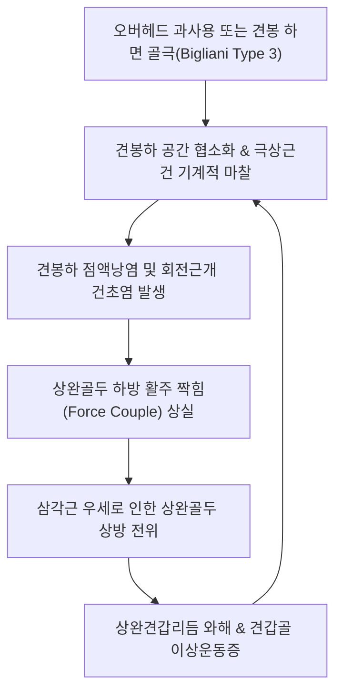

# 🦴 [[어깨충돌 증후군]] (Subacromial Impingement Syndrome)

> **핵심 3줄 요약 (Key Summary)**:
> - 📍 **병소 부위 & 해부·병태생리**: 오구견봉궁(견봉·오구견봉인대)과 상완골두 대결절 사이의 견봉하 공간(Subacromial space)이 협소화되어 극상근건과 견봉하 점액낭이 반복적으로 기계적 마찰·압박되는 질환.
> - 🚩 **전형적 임상 양상**: 팔을 60°~120° 외전할 때 심한 통증이 발생하는 전형적 동통호(Painful arc), 야간통(Nocturnal pain), 삼각근 부착부 방사통, 니어 검사(Neer) 및 호킨스-케네디 검사(Hawkins-Kennedy) 양성.
> - 🛠️ **핵심 검사 & 치료 전략**: Modified Crass position을 활용한 견봉하 공간 직접 노출 및 소염·재생 약침 시술, 상완견갑리듬(Scapulohumeral rhythm) 회복 추나, 회전근개 하방 활주 짝힘(Force couple) 강화.
> - ⚠️ **응급 의뢰 레드플래그**: 낙하 수지 검사(Drop arm test) 양성 및 외상 직후의 전층 회전근개 파열(급성 거상 불능), 액와신경 마비 소견(삼각근 감각 소실), 견관절 내 세균성 화농성 관절염 징후.

---

## 📌 목차
1. [질환 개요 & 해부학적 병태생리](#1-질환-개요--해부학적-병태생리)
2. [병태생리 메커니즘 & 생체역학적 악순환 네트워크](#2-병태생리-메커니즘--생체역학적-악순환-네트워크)
3. [임상 증상 & 이학적 검사(Physical Exam) 알고리즘](#3-임상-증상--이학적-검사physical-exam-알고리즘)
4. [감별 진단 매트릭스 (Differential Diagnosis)](#4-감별-진단-매트릭스-differential-diagnosis)
5. [한의 통합 치료 프로토콜 (침·약침·추나·한약)](#5-한의-통합-치료-프로토콜-침약침추나한약)
6. [양방 치료 & 병용·의뢰 기준 (Conventional Treatment & Referral)](#6-양방-치료--병용의뢰-기준-conventional-treatment--referral)
7. [재활 운동 & 생활습관 티칭 가이드](#7-재활-운동--생활습관-티칭-가이드)
8. [💡 사용자 진료실 핵심 필기 & 임상 노하우 (Melt-In 잔여 심화 집약)](#8--사용자-진료실-핵심-필기--임상-노하우-melt-in-잔여-심화-집약)
9. [출처 및 학술 참고 문헌 (References)](#9-출처-및-학술-참고-문헌-references)

---

## 1. 질환 개요 & 해부학적 병태생리

**[[어깨충돌 증후군]](Subacromial Impingement Syndrome, SIS)**은 견봉(Acromion), 오구견봉인대(Coracoacromial ligament), 오구돌기(Coracoid process)가 형성하는 **오구견봉궁(Coracoacromial arch)**과 상완골두(Humeral head) 대결절 사이의 좁은 '견봉하 공간(Subacromial space)'에서, 상완골 거상 동작 시 [[극상근]](Supraspinatus) 힘줄과 [[견봉하 점액낭]](Subacromial bursa)이 반복적으로 끼이고 압박되어 염증과 마찰성 마모가 발생하는 질환이다.

![[Pasted image 20240208141614.png]]
> [그림 1: ① 병태해부 — 견봉하 공간에서의 충돌 기전 도해. 중립위와 외전위 비교 시 상완골 대결절이 견봉에 접근하며 극상근건을 압박하는 충돌점]

성인 어깨 통증 환자의 약 40~65%를 차지하는 가장 흔한 원인 질환이며, 단순 건염에서 시작하여 방치될 경우 부분 파열을 거쳐 전층 [[회전근개 파열]]로 진행하는 연속적인 병리 스펙트럼의 출발점이다. 팔을 머리 위로 들어 올리는 오버헤드(Overhead) 동작을 반복하는 운동선수(야구 투수, 배구, 수영, 배드민턴)와 직업군(도배사, 미용사, 페인트공)에서 호발하며, 40대 이후 연령 증가에 따른 회전근개 퇴행성 마모 및 견봉 하면의 골극(Bone spur) 형성과 함께 유병률이 급증한다.

![[회전근개증후군_01_영상소견_견봉하충돌_골극_Xray.jpg]]
> [그림 2: ① 영상 소견 — 견봉 하면의 비후성 골극 돌출 및 견봉하 공간 협소화를 보여주는 어깨 X-ray]

---

## 2. 병태생리 메커니즘 & 생체역학적 악순환 네트워크

### 구조적 원인 vs 기능적 짝힘(Force Couple) 와해
1. **구조적 원인 (Structural / Extrinsic Impingement)**:
   - **Bigliani 견봉 형태학적 분류**:
     - 제1형 (Flat, 평평형): 충돌 위험 낮음.
     - 제2형 (Curved, 곡선형): 중간 위험.
     - 제3형 (Hooked, 갈고리형): 견봉 전하방이 갈고리처럼 꺾여 견봉하 공간을 물리적으로 좁히며 전층 파열을 가장 흔히 유발함.
   - 견봉-쇄골 관절([[견봉 쇄골관절염]])의 퇴행성 골극 증식 및 오구견봉인대 비후.
2. **기능적 원인 (Functional / Intrinsic Impingement & 상완견갑리듬 붕괴)**:
   - **회전근개 짝힘(Force Couple)의 와해**: 정상 거상 시 [[삼각근]]이 상완골두를 상방으로 당기면, 회전근개 4총사([[극상근]], [[극하근]], [[소원근]], [[견갑하근]])가 상완골두를 관절와 내로 강하게 압박하고 하방 활주(Inferior glide)시켜야 한다. 회전근개가 약화되면 상완골두가 비정상적으로 상방 전위되어 견봉 하면과 충돌한다.
   - **견갑골 이상운동증(Scapular Dyskinesis)**: [[전거근]]과 [[승모근]] 하부섬유의 약화, [[소흉근]]의 단축으로 인해 팔을 올릴 때 견갑골이 충분히 상방회전(Upward rotation) 및 후방경사(Posterior tilt)되지 못하여 견봉이 상완골두를 덮치게 된다.

![[견봉하충돌_및_극상근파열_MRI.jpg]]
> [그림 3: ① 영상 병태 — 견봉하 충돌 및 극상근건의 고신호강도 비후와 부분 파열을 나타내는 어깨 관상면 MRI]

---

## 3. 임상 증상 & 이학적 검사(Physical Exam) 알고리즘

### 주요 증상
- **동통호 (Painful Arc, 통증호 징후)**: 팔을 옆으로 들어 올릴 때 **60°~120° 외전 구간**에서 견봉하 조직이 가장 강하게 압박되어 극심한 통증이 발생하며, 120°를 넘어서면 대결절이 견봉 밑을 통과하여 통증이 오히려 경감된다.
- **야간통 (Nocturnal Pain)**: 수면 시 환측 어깨를 바닥으로 대고 누울 때 체중 압박으로 통증이 악화되어 수면 장애를 유발한다.
- **삼각근 조면 방사통**: 어깨 꼭대기뿐 아니라 상완 외측의 삼각근 조면(Deltoid tuberosity) 부위로 뻐근하게 통증이 뻗친다.

### 이학적 검사 알고리즘

![[니어검사_3단계_최대굴곡_견봉하충돌_통증유발평가.jpg]]
> [그림 4: ② 이학적 검사 — 환자의 견갑골을 후방 고정하고 최대 굴곡시켜 견봉하 충돌을 유발하는 니어 검사(Neer test) 실사]

![[호킨스검사_2단계_팔꿈치지지_수동내회전_충돌유발.jpg]]
> [그림 5: ② 이학적 검사 — 견관절 및 주관절 90도 굴곡 상태에서 급격한 수동 내회전을 가하는 호킨스-케네디 검사 실사]

![[호킨스검사_3단계_견봉하충돌_통증발생_양성평가.jpg]]
> [그림 6: ② 이학적 검사 — 대결절이 오구견봉인대 하방으로 진입하며 통증이 유발되는 호킨스 검사 양성 반응 평가]

1. **[[니어 검사]](Neer Test)**: 검사자가 견갑골을 고정한 상태에서 환자의 팔을 최대로 내회전(엄지가 아래)시킨 후 전방 거상. 90° 이상에서 견봉 전하방 통증 시 양성.
2. **[[호킨스-케네디 검사]](Hawkins-Kennedy Test)**: 어깨와 팔꿈치를 90° 굴곡 후 급격한 수동 내회전. 대결절이 오구견봉인대 밑으로 미끄러져 들어가며 통증 발생 시 양성 (민감도 최상).
3. **Empty Can / Jobe Test**: 견갑면(30° 외전)에서 엄지를 바닥으로 내리고 하방 저항 외력 부하 시 극상근건 통증 평가.

---

## 4. 감별 진단 매트릭스 (Differential Diagnosis)

| 감별 질환 | 호발 연령 및 기전 | 주요 통증 양상 및 부위 | 핵심 이학적 검사 소견 | 감별 감별 포인트 |
| :--- | :--- | :--- | :--- | :--- |
| **[[어깨충돌 증후군]]** | 30~50대 과사용, 투구·오버헤드 직업군 | 60°~120° 외전 통증호, 삼각근 조면 방사통, 야간통 | **Neer (+)**, **Hawkins (+)**, 수동 ROM 정상 | 수동 거상 시 통증 구간을 지나면 완전 거상 가능 |
| **[[견관절 유착성 관절낭염]](오십견)** | 50대 전후, 당뇨·갑상선 질환 호발 | 전방향의 극심한 운동 제한 및 지속적 둔통 | 능동·수동 ROM 모두 제한 (외회전 > 외전 > 내회전) | 의사가 억지로 올려도 관절 자체가 굳어서 올라가지 않음 |
| **전층 [[회전근개 파열]]** | 50대 이상 퇴행성 또는 낙상 외상 | 팔을 들어 올릴 힘이 전혀 없음, 심한 야간통 | **Drop arm test (+)**, 외회전 래그 징후 (+) | 외전 유지 불능으로 팔이 뚝 떨어짐, 초음파상 결손 |
| **[[견관절 내병변]](SLAP/Bankart)** | 10~30대 스포츠 선수, 던지기 손상 | 심부 관절 내 통증, Clicking, Locking | O'Brien test (+), Crank test (+) | 관절 속 깊은 곳이 쑤시고 기계적 걸림이 주호소 |
| **[[경추 신경근병증]](목 디스크)** | 경추 퇴행성 추간판 탈출 | 목에서 어깨 외측 및 손가락까지 방사통·저림 | Spurling test (+), 어깨 자체 운동은 정상 | 어깨를 움직여도 통증 유발 안 되고 목 동작에 반응 |

---

## 5. 한의 통합 치료 프로토콜 (침·약침·추나·한약)

### 침구 치료 및 Modified Crass Position 정밀 자입

![[Pasted image 20240208143009.png]]
> [그림 7: ③ 한의 시술 — 손을 뒤허리에 얹는 Modified Crass position을 취하여 대결절과 견봉하 점액낭을 전외측으로 노출시키는 임상 자입 실사]

- **Modified Crass Position 자침**:
  - 환자의 손을 뒤허리에 얹고 팔꿈치를 뒤로 신전시키면, 대결절과 극상근건이 견봉 앞쪽으로 돌출됨.
  - 견봉 전외측 모서리 하방의 오목한 틈으로 침첨을 견봉 하면을 향해 비스듬히 자입하여 견봉하 점액낭과 극상근건 부착부에 직접 도달시킴.
- **주요 혈위**: [[견우]](LI15), [[견료]](TE14), [[노회]](TE13), [[천종]](SI11), [[견정]](GB21). 전침 2Hz 저주파를 적용하여 극하근과 소원근의 과긴장을 이완.
- **약침 치료**:
  - 급성 염증기: **황련해독탕 약침** 및 **봉약침**(멜리틴 정제 0.05~0.1ml)을 견봉하 점액낭에 자입하여 무균성 활막염과 부종을 신속 억제.
  - 만성 퇴행기: **신바로 약침** 또는 **자하거 약침**으로 극상근건 미세 손상 치유 및 인대 강화.

### 추나 의학 및 동적 밸런스 회복

![[어깨 추나-20240926180601163.png]]
> [그림 8: ③ 한의 추나 — 상완골두 후하방 활주 및 견갑흉곽관절 상완견갑리듬을 복원하는 관절가동 추나 기법]

- **상완골두 후하방 활주 추나(Glenohumeral Posterior-Inferior Glide)**: 비정상적으로 상방 전위된 상완골두를 관절와 중심부로 복귀시킴.
- **견갑흉곽관절 가동술(Scapulothoracic Mobilization)**: 견갑골의 전인·상방회전을 회복시켜 상완견갑리듬(2:1 비율) 복원.
- **단축 근육 근막이완**: 단축된 [[소흉근]], [[견갑하근]]을 MET(근에너지기법)로 신장.

### 한약 치료 (Herbal Medicine)
- **기체어혈형**: [[서경탕]], [[소경활혈탕]]을 투여하여 관절강 내 미세 순환을 개선하고 야간통 완화.
- **기혈양허 및 만성 마모형**: [[독활기생탕]], [[오적산]] 가감방으로 회전근개 결합조직의 교원질 합성을 촉진.

---

## 6. 양방 치료 & 병용·의뢰 기준 (Conventional Treatment & Referral)

### 양방 치료 프로토콜
- **약물 치료**: 급성기 비스테로이드성 소염진통제(NSAIDs: Aceclofenac 100mg bid, Celecoxib 200mg qd)를 1~2주간 단기 투여하여 점액낭염 제어.
- **견봉하 스테로이드 주사(Subacromial Steroid Injection)**:
  - Triamcinolone 20~40mg 국소 주입 시 단기 통증 완화율이 높으나, 반복 주사 시 회전근개 건 섬유의 위축과 파열 위험을 급격히 증가시키므로 연 2~3회 이내로 엄격히 제한.
- **수술적 치료 (Surgical Indication)**:
  - 3~6개월 이상의 적극적 보존적 치료에도 호전이 없고 Bigliani 제3형 갈고리형 골극으로 인한 구조적 충돌이 지속될 경우, 관절경하 견봉 성형술(Subacromial Decompression & Acromioplasty) 및 오구견봉인대 절제술 시행.

### 한의 병용 및 의뢰 기준
- **병용 주의**: 양방 견봉하 스테로이드 주사 직후 72시간 동안은 국소 감염 예방을 위해 해당 부위 심부 침·약침 시술을 금기하고 원위 취혈 적용.
- **응급 의뢰 트리거 (Red Flags)**:
  1. 외상 후 팔을 90도 외전 상태에서 버티지 못하고 툭 떨어뜨리는 전층 회전근개 급성 파열.
  2. 삼각근 마비 및 어깨 외측 감각 소실(액와신경 손상).
  3. 관절 부위의 발적, 국소 고열 및 전신 발열(화농성 점액낭염 의심).

---

## 7. 재활 운동 & 생활습관 티칭 가이드

1. **상완견갑리듬 회복: Wall Slide & Scapular Setting**
   - 벽을 마주보고 서서 전완을 벽에 대고 천천히 위로 밀어 올리며 견갑골의 상방회전과 전거근 수축을 유도 (10회씩 3세트).
2. **회전근개 외회전/하방 활주 강화: 튜빙 밴드 운동**
   - 팔꿈치를 옆구리에 붙이고 90도 굴곡한 상태에서 세라밴드를 바깥쪽으로 당기는 외회전 등척성/등간성 강화 운동. 상완골두를 아래로 눌러주는 짝힘을 재교육.
3. **소흉근 및 흉추 신전 스트레칭: Doorway Stretch**
   - 문틀에 양 팔꿈치를 대고 체간을 앞으로 전진시켜 단축된 소흉근을 스트레칭. 등이 굽는 [[라운드 숄더]] 교정.
4. **일상생활 주의사항**:
   - 팔을 어깨높이 이상으로 장시간 들고 일하는 환경 개선.
   - 무거운 물건을 옆으로 들어 올리는 동작 제한.

---

## 8. 💡 사용자 진료실 핵심 필기 & 임상 노하우 (Melt-In 잔여 심화 집약)

- **Modified Crass Position의 임상적 결정타**:
  - 견봉하 점액낭에 약침·봉침을 시술할 때는 반드시 환자에게 "손을 뒤허리에 얹는 자세(Modified Crass position)"를 취하게 해야 한다.
  - 이 자세를 취하면 상완골 대결절이 견봉 앞쪽으로 튀어나와 좁았던 견봉하 공간이 전외측으로 활짝 열리게 되며, 견봉 바로 밑으로 약침을 안전하고 정확하게 자입할 수 있다.
- **오십견과의 1초 감별 공식**:
  - 의사가 환자의 팔을 잡고 끝까지 올려줄 때, **끝까지 다 올라가지만 60~120도 구간에서만 아파하면 충돌증후군**이고, **의사가 아무리 힘을 줘도 굳어서 90도 이상 안 올라가면 오십견([[견관절 유착성 관절낭염]])**이다.
- **주변 근육 불균형 동시 치료**:
  - 단순히 어깨만 치료해서는 안 되며, 단축된 [[소흉근]]과 약화된 [[전거근]]을 함께 치료해야 견갑골의 상방회전이 살아나며 충돌이 근본적으로 멈춘다.

---

## 9. 출처 및 학술 참고 문헌 (References)

1. Al Hammadi MI, et al. (2025). Shoulder Impingement Pain Syndrome: Pathophysiology, Diagnosis, and a Review of Current Treatment Strategies. *Cureus*, 17(9):e91543. [PMID 41080250](https://pubmed.ncbi.nlm.nih.gov/41080250/)

2. Gazioglu Turkyilmaz G, et al. (2026). Does adding ultrasound-guided subacromial injection improve clinical outcomes after suprascapular nerve block in chronic subacromial impingement syndrome?: A retrospective cohort study. *Medicine (Baltimore)*, 105(36):e43210. [PMID 42700031](https://pubmed.ncbi.nlm.nih.gov/42700031/)

3. Jin B, et al. (2026). Association Between Postoperative Subacromial Impingement Syndrome and Functional Recovery After Arthroscopic Rotator Cuff Repair in Elderly Patients: A Single-Center Retrospective Study. *Clin Interv Aging*, 21:123-134. [PMID 42038252](https://pubmed.ncbi.nlm.nih.gov/42038252/)

---

## 관련 노트
- [[회전근개 증후군]]
- [[어깨 관절 통증(상완 위쪽)]]
- [[회전근개 파열]]
- [[견관절 유착성 관절낭염]]
- [[SLAP 병변]]
- [[견관절 내병변]]
- [[니어 검사]]
- [[호킨스-케네디 검사]]
