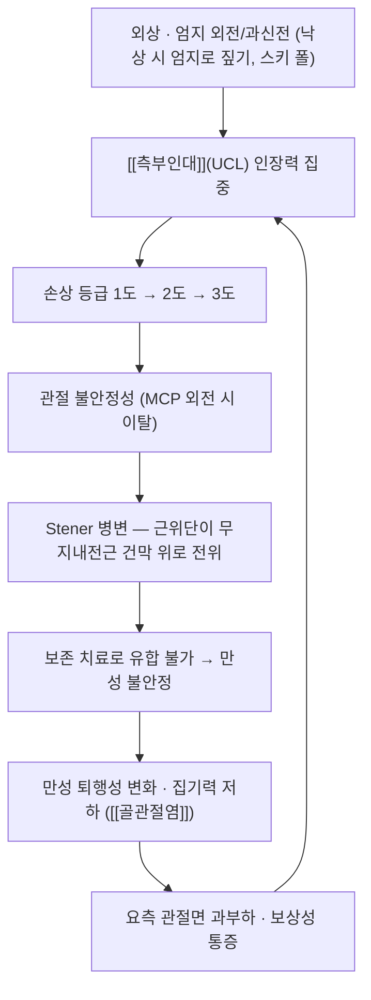

# 🩺 [[엄지손가락 염좌]] (Thumb Sprain / 拇指挫傷, S63.4)

> **핵심 3줄 요약 (Key Summary)**:
> - 📍 **병소 부위 & 해부·병태생리**: **엄지손가락**의 **중수지관절(MCP)** 또는 지간관절(IP)에서 관절 안정성을 담당하는 **[[측부인대]]**가 외상으로 늘어나거나 부분·완전 파열된 상태다. 손상 기전의 대부분은 엄지가 **외전(abduction)·과신전**되며 척측측부인대(UCL)에 인장력이 집중되는 것으로, 낙상 시 엄지로 짚거나 스키 폴을 쥔 채 넘어지는 경우가 대표적이다.
> - 🚩 **전형적 임상 양상**: MCP 관절의 **척측(안쪽) 압통과 종창**, 엄지로 집기(pinch) 힘의 저하, 물건을 쥘 때의 통증. 3도 파열이면 관절의 **불안정성**(외전 스트레스 시 시상면 이탈)이 관찰된다. 손상 정도에 비해 통증이 심하지 않은 경우도 있어 **불안정성 평가를 소홀히 하면 만성화**한다.
> - 🛠️ **핵심 감별 검사 & 한·양방 다각적 치료 전략**: MCP **굴곡 30° 상태에서의 외전 스트레스 검사**(UCL stress test)와 건측 비교가 핵심이며, 압통점 국소마취 후 재평가가 유용하다. 단순 방사선으로 [[골절 후유증|골절]](견열골절)을 먼저 배제하고, 필요 시 초음파·MRI로 Stener 병변을 확인한다. 1~2도는 보존 치료(엄지 고정·냉찜질·[[NSAIDs]]), 3도 및 Stener 병변은 수술 적응증이다. 한의 치료는 [[전침]]·[[약침]]으로 급성기 어혈과 부종을 다스리고, 회복기에는 [[추나 리스팅|추나]]·도수로 관절 가동성을 회복시킨다.
> - ⚠️ **응급 의뢰 레드플래그 & 악화 요인**: ① **Stener 병변**(UCL 근위 파단이 무지건막 위로 전위되어 보존 치료로는 붙지 않는 상태) ② 견열골절이 관절면 15% 이상 침범하거나 전위된 경우 ③ 개방성 손상·감염 징후 ④ 수지의 감각 저하·색 변화(혈관·신경 동반 손상) ⑤ 엄지 MCP의 현저한 불안정성. 위 경우 즉시 **정형외과(수부외과) 의뢰**한다.

---

## 📌 목차
1. [질환 개요 & 해부학적 병태생리](#1-질환-개요--해부학적-병태생리)
2. [병태생리 메커니즘 & 생체역학적 악순환 네트워크](#2-병태생리-메커니즘--생체역학적-악순환-네트워크)
3. [임상 증상 & 이학적 검사(Physical Exam) 알고리즘](#3-임상-증상--이학적-검사physical-exam-알고리즘)
4. [감별 진단 매트릭스 (Differential Diagnosis)](#4-감별-진단-매트릭스-differential-diagnosis)
5. [한의 통합 치료 프로토콜 (침·약침·추나·한약)](#5-한의-통합-치료-프로토콜-침약침추나한약)
6. [양방 치료 & 병용·의뢰 기준 (Conventional Treatment & Referral)](#6-양방-치료--병용의뢰-기준-conventional-treatment--referral)
7. [재활 운동 & 생활습관 티칭 가이드](#7-재활-운동--생활습관-티칭-가이드)
8. [💡 사용자 진료실 핵심 필기 & 임상 노하우 (Melt-In 잔여 심화 집약)](#8--사용자-진료실-핵심-필기--임상-노하우-melt-in-잔여-심화-집약)
9. [출처 및 학술 참고 문헌 (References)](#9-출처-및-학술-참고-문헌-references)

---

## 1. 질환 개요 & 해부학적 병태생리

![[엄지손가락염좌_01_환부실사_수술후엄지.jpg|450]]
> [그림 1: ① 환부 실사 — 엄지 중수지관절 척측측부인대 봉합술 후 모습(수술 흔적과 부종) — Wikimedia Commons, CC BY 3.0]

![[엄지손가락염좌_02_영상소견_엄지Xray_정측면.png|450]]
> [그림 2: ② 영상 소견 — 엄지 정면·측면 단순 방사선. 화살표는 중수지관절을 가리킨다. 견열골절 유무와 관절면 정렬을 먼저 확인한다 — Wikimedia Commons, CC BY-SA 3.0]

* **질환 정의 및 분류**:
  * 외상으로 관절의 안정성을 유지하는 **[[측부인대]] 및 관절 주위 연부조직이 손상**된 것을 염좌(sprain)라 한다. 엄지에서는 **중수지관절(MCP)의 척측측부인대(UCL)** 손상이 가장 흔하고, 요측측부인대(RCL)와 지간관절(IP) 손상도 발생한다.
  * **손상 정도 분류**(질병관리청 국가건강정보포털 「염좌」):
    * **1도** — 인대 자체의 파열은 없고 섬유·주위 조직에 미세 손상. 종창·통증은 있으나 **관절 안정성은 유지**된다.
    * **2도** — 인대의 **부분 파열**. 파열 범위가 적으면 불안정성이 없지만, 많으면 의미 있는 기능을 못 해 불안정성이 생긴다.
    * **3도** — 인대 **완전 파열** 또는 인대가 뼈에 붙는 부위가 떨어져 나간 **견열골절**. 관절 불안정성이 발생하며 외전 스트레스로 **1+ / 2+ / 3+** 등급을 매긴다.
  * **역학**: 염좌는 스포츠 손상의 **10~30%**를 차지하며 발목이 가장 흔하다. 엄지 MCP UCL 손상은 **스키어 엄지(Skier's thumb)**·**게임키퍼 엄지(Gamekeeper's thumb)**로 불리며, 스키·럭비·농구·자전거 낙상 등에서 호발한다.
* **관련 해부학적 구조물**:
  * **골격 및 관절**: 제1중수골 두와 근위지골 저부가 이루는 **중수지관절(MCP)**. 이 관절은 손의 집기(pinch)와 파지(grip)에서 큰 부하를 받는 반면 골성 안정성이 낮아 **연부조직 의존도가 높다**.
  * **근육 및 건**: [[단무지외전근]](APB) · [[무지외전근|장무지외전근]](APL)이 요측에서, **무지내전근(Adductor pollicis)**이 척측에서 관절을 감싼다. UCL은 **무지내전근 건막(adductor aponeurosis)** 아래에 위치하므로, 파단된 근위단이 이 건막 위로 넘어가면 Stener 병변이 된다.
  * **신경 및 혈관**: 수지 감각은 [[정중신경]]과 [[요골신경]]의 분지가, 엄지 두덩 근육의 운동은 [[정중신경]]이 담당한다. 손상 시 **감각·운동 평가를 반드시 병행**한다([[척골신경]]은 엄지에 직접 분포하지 않으나 인접 손상 감별에 필요).

---

## 2. 병태생리 메커니즘 & 생체역학적 악순환 네트워크

![[엄지손가락염좌_02b_병태생리_인대손상정도.jpg|450]]
> [그림 3: ③ 인대 손상의 정도 — 1도(미세 손상) / 2도(부분 파열) / 3도(완전 파열) 단계별 도해 — 질병관리청 국가건강정보포털]

![[엄지손가락염좌_03_해부도해_수지측부인대.jpg|450]]
> [그림 4: ③ 수지염좌 해부 도해 — 근위지골·중위지골, 수장판(volar/palmar plate), 측부인대(collateral ligament)의 관계 — 질병관리청 국가건강정보포털]

![[엄지손가락염좌_03b_해부도해_엄지골구조.png|450]]
> [그림 5: ③ 엄지 골·인대 해부 도해 — 장무지굴근(FPL) 부착부, 근위·원위 지골 지방체, 측부 골간인대(collateral interosseous ligaments)의 관계를 보여준다 — Wikimedia Commons, CC BY 3.0]

### 1) 해부학적 포착 및 압박 기전
* UCL은 MCP 관절의 **척측 안정성을 단독으로 담당**하므로, 파단 시 관절은 외전 방향으로 이탈한다.
* MCP 관절을 **굴곡한 상태**에서 UCL이 최대 긴장되므로, 검사와 고정 모두 **MCP 30° 굴곡 자세**가 기준이 된다. 신전 상태에서는 수장판과 골성 구조가 일부 안정성을 보태 손상이 과소평가될 수 있다.
* 손상 후 인대가 **건막 아래에 정상 위치로 유지되면** 치유 가능성이 있으나, 근위단이 건막 위로 말려 올라가면(Stener) **연부조직이 개재되어 유합을 막는다**.

### 2) 생체역학적 연쇄 반응 (Kinetic Chain)
* 엄지는 **집기(pinch)** 시 강한 축성 부하를 받는다. UCL 기능이 떨어지면 엄지가 불안정해져 **집기력이 저하**되고, 환자는 보상적으로 **요측 관절면에 하중을 재분배**한다.
* 결과적으로 MCP 관절의 **요측·배측 연골 과부하**가 누적되고, 만성 불안정성은 **퇴행관절염([[골관절염]])**으로 이어진다.
* 손목·수근관절의 보상 패턴까지 고려하여 상지 전체를 평가한다([[어깨 탈구]]·[[발목 염좌]] 등 다른 부위 염좌와 동일한 원리).

---

## 3. 임상 증상 & 이학적 검사(Physical Exam) 알고리즘

### 1) 주소증 및 신경학적 증상
* **통증**: MCP 관절 **척측의 국소 압통**. 엄지로 집거나 병뚜껑을 돌리는 등 **집기 동작에서 악화**된다.
* **종창·피하출혈**: 손상 정도에 따라 관절 주위 부종과 자반이 나타난다.
* **불안정성**: 심한 인대 손상 시 MCP가 **외전 스트레스에 이탈**된다. 환자는 "힘이 안 들어간다"고 표현한다.
* **감각·운동**: 수지 감각 저하나 두덩 근육 위축이 동반되면 신경 손상을 의심한다.

### 2) 필수 이학적 검사법 (Physical Examination)

![[엄지손가락염좌_04_이학적검사_측부인대스트레스.jpg|420]]
> [그림 6: ④ 이학적 검사 시연 — 수지 관절에 외력을 가해 인대 파열·관절 벌어짐을 평가하는 스트레스 부하 검사 — 질병관리청 국가건강정보포털]

* **UCL 스트레스 검사 (엄지 MCP 외전 스트레스)**: MCP를 **굴곡 30°**로 유지한 상태에서 엄지를 **척측으로 외전**시켜 요측과 비교한다. **건측 대비 각도 차이**와 **단단한 종점(firm endpoint) 유무**를 본다. 종점이 없고 과도하게 벌어지면 완전 파열을 시사한다.
* **국소마취 후 재평가**: 통증 때문에 근육이 방어(spasm)하고 있으면 실제 불안정성이 과소평가된다. 필요 시 압통점 국소마취 후 다시 평가한다.
* 🎥 시연 영상: **미확보** — 확보 시 이 자리에 채널명·제목을 병기한다.

---

## 4. 감별 진단 매트릭스 (Differential Diagnosis)

| 감별 질환 | 호발 병소 및 원인 | 주소증 차이점 | 특이적 이학적 검사 소견 |
| :--- | :--- | :--- | :--- |
| **엄지손가락 염좌** (본 질환) | MCP **척측** UCL 인장 외상 | 척측 압통, 집기 시 통증 | UCL 스트레스 검사 양성 · 외전 이탈 |
| [[골절 후유증]] — 제1중수골 기저부 골절 (Bennett·Rolando) | 제1중수골 근위 골절 | 관절면 침범, 심한 종창·변형 | 방사선에서 골절선 확인 · 축성 압박통 |
| 견열골절 (UCL 부착부) | UCL 골 부착부 | 염좌와 감별 어려움 | 방사선·CT에서 골편 확인 |
| 수근관절 염좌 · TFCC 손상 | 손목 척측 | 손목 통증, 회전 시 악화 | TFCC 압박 검사 · ulnar grind test |
| 무지 MCP 관절염 | 관절 연골 퇴행 | 서서히 진행, 아침 강직 | 관절면 압통 · 방사선상 관절간격 협소 |
| 드퀘르벵 건초염 | APL·EPB 건초 | 요측 손목 통증, 엄지 신전 시 | Finkelstein 검사 양성 |

---

## 5. 한의 통합 치료 프로토콜 (침·약침·추나·한약)

![[엄지손가락염좌_05_술기실사_수지침시술.jpg|400]]
> [그림 7: ⑤ 술기 실사 — 수지 관절 주위 침 시술 장면 — Wikimedia Commons, CC BY-SA 4.0]

* **침구 치료 (Acupuncture)**:
  * 급성기(0~72시간)에는 **손상 부위 직접 자침을 피하고** 원위 취혈로 통증·부종을 다스린다. 국소 자침은 급성 염증이 가라앉은 뒤 시작한다.
  * 회복기에는 MCP 주위 및 엄지 두덩 근육의 압통점(trigger point) 자침, [[전침]]으로 저주파(2~4Hz) 자극하여 통증 완화와 국소 순환 개선을 도모한다.
* **약침 치료 (Pharmacopuncture)**:
  * 인대 부착부 주위와 관절 주위에 소량 주입하여 국소 소염·조직 재생을 돕는다. **급성기에는 자극이 강한 약침을 피하고** 생리식염수 계열 또는 저농도 자하거 약침을 소량 사용한다.
  * 관절 내 주입은 감염 위험이 있으므로 피하고, 피부 소독을 엄격히 한다.
* **추나 치료 (Chuna Manipulation)**:
  * 급성기에는 **금기**다. 부종·통증이 가라앉은 회복기에 MCP 관절의 **가동(mobilization)**과 수근·전완 근막 이완을 시행한다.
  * 인대가 아직 불안정한 상태에서 강한 관절 가동은 **재파열을 유발**하므로 등급과 시기를 반드시 지킨다.
* **한약 치료 (Herbal Medicine)**:
  * **급성기(어혈·부종·통증)** — 활혈거어·행기소종 방제를 고려한다. [[당귀수산]]은 타박·어혈성 통증에, [[오적산]]은 통증·한랭감 동반 시 응용한다.
  * **회복기(기혈 허약·만성 불안정)** — 인대·근육 재생을 위해 [[독활기생탕]] 등 보간신·강근골 방제를 고려한다.
  * 처방 선택은 어혈·기체·한습 등 **변증**과 환자의 소화 상태(복용 가능성)에 따른다.

---

## 6. 양방 치료 & 병용·의뢰 기준 (Conventional Treatment & Referral)

* **급성기 처치 — PRICE 요법**:
  * 질병관리청 「염좌」 권고는 **손상 직후부터 최소 48시간** 동안 Protection(보호) · Rest(안정) · Ice(냉찜질) · Compression(압박) · Elevation(거상)을 유지하는 것이다. 목적은 염증·통증 감소와 불안정성·저산소증으로 인한 **추가 손상 예방**이다.
  * ⚠️ **급성기에는 온찜질을 피한다** — 온열은 출혈·부종을 증가시킨다. 한의원에서도 급성기 온열 요법·뜸은 신중히 판단한다.
* **약물 치료 (Medication)**:
  * **급성 통증**: [[NSAIDs]]([[이부프로펜]] 등) 단기 사용. 위장관 위험 환자는 [[아세트아미노펜]]으로 대체하거나 위장보호제를 병용한다.
  * **작용 기전과의 관계**: NSAIDs는 프로스타글란딘 합성을 억제해 통증·부종을 줄이지만, **초기 인대 치유 과정의 염증 반응까지 억제**할 수 있어 장기 사용은 권장되지 않는다. 한의 활혈거어제와 병용 시 **출혈 경향·위장 자극**을 함께 살핀다.
* **비약물 시술 (Procedures)**:
  * 엄지 고정(thumb spica 보조기 또는 석고) — 1·2도에서 **4~6주** 유지가 일반적이며, MCP를 굴곡 자세로 고정한다.
  * 필요 시 초음파 유도 주사, 물리치료를 병행한다.
* **수술·시술 적응증 (Surgical Indication)**:
  * **3도 완전 파열**, **Stener 병변**, 관절면을 15% 이상 침범하거나 전위된 견열골절, 보존 치료 실패로 인한 만성 불안정이 적응증이다.
  * 수술은 인대 봉합·재부착(또는 K-wire 고정)으로 시행하며, 이후 단계적 재활이 필수다.
* **한의 병용 판단 (Combination Therapy)**:
  * **병용 가능** — NSAIDs 복용 중이라도 침·약침은 출혈 위험 부위를 피해 병용 가능하다.
  * **주의** — 항응고제·항혈소판제 복용 환자, 당뇨·말초혈관질환 환자는 자침·약침 시 출혈·감염 위험이 높아 주의한다.
  * **금기** — 급성기 관절 내 주사, 불안정 인대에 대한 강한 도수 조작.
* **양방·전문과 의뢰 기준 (Referral Criteria)**:
  * **응급 트리거** — 개방성 손상·감염 징후, 수지 감각 소실·색 변화, 도수 평가상 현저한 불안정성.
  * **전문과** — 정형외과(수부외과): Stener 병변·3도 파열·견열골절·만성 불안정이 의심될 때 즉시 의뢰한다. **임상적으로 UCL 완전 파열이 의심되면 보존 치료를 시도하기 전에 평가를 받는 것이 원칙**이다.

---

## 7. 재활 운동 & 생활습관 티칭 가이드

> ℹ️ 이 섹션의 **재활 운동 실사 이미지 1장은 확보하지 못했다**(2026-09-28). 확보 시 이 자리에 배치하고 캡션을 함께 넣는다.

* **이완 및 스트레칭 (Stretching)**:
  * 고정 기간이 끝난 뒤 **무리한 외전 스트레칭은 금기**다. UCL에 인장력을 다시 주면 치유 조직이 늘어난다.
  * 대신 전완 굴곡근·신전근의 부드러운 이완으로 손목·손의 긴장을 줄인다.
* **강화 및 안정화 운동 (Strengthening)**:
  * **집기(pinch) 강화** — 부드러운 스펀지·점토를 엄지와 검지로 집는 동작부터 시작한다.
  * **무지 두덩 근육 강화** — 엄지와 새끼손가락을 마주 붙이는 동작(opposition)을 저항 없이 반복한다.
  * 진행 단계: **등척성 → 저항 → 기능적 과제**(열쇠 돌리기, 병뚜껑 열기).
* **신경 활주 운동 (Neurodynamics)**:
  * 감각 이상이 동반된 경우 정중신경 활주 운동을 **통증이 악화되지 않는 범위**에서 시행한다.
* **일상생활 자세 티칭 (Ergonomics)**:
  * **낙상 예방** — 계단·빙판에서 엄지로 짚지 않도록 하고, 스키·자전거 시 장갑과 폴 그립을 점검한다.
  * **스마트폰 사용** — 엄지로 화면을 밀어 넘기는 반복 동작은 회복기에 제한한다.
  * **가사·작업** — 병뚜껑, 무거운 봉지 들기 등 엄지에 비틀림이 걸리는 동작을 줄인다.

---

## 8. 💡 사용자 진료실 핵심 필기 & 임상 노하우 (Melt-In 잔여 심화 집약)

> 이 노트는 원래 **스텁(빈 골격)** 상태로 생성되어 **융합(Melt-In)할 기존 필기가 없었다.** 아래는 이번 작성에서 도출된 실전 관찰이다.

* **"염좌"로 오는 환자에서 가장 놓치기 쉬운 것 = 불안정성이다.** 통증이 경미하다고 1도로 단정하지 말고, **MCP 30° 굴곡 상태에서 반드시 건측과 비교**한다. 신전 상태에서 검사하면 수장판이 안정성을 보태 **완전 파열도 안정해 보인다**.
* **엄지 MCP 척측 압통 + 낙상력**이면 UCL 손상을 먼저 의심한다. 단순 방사선에서 골절이 없다고 안심하지 말 것 — **인대는 방사선에 보이지 않는다**.
* **Stener 병변은 한의원에서 판단할 수 없다.** 외전 스트레스에서 종점이 없거나 과도하게 벌어지면 **치료를 시작하기 전에 정형외과 평가를 먼저 받도록 안내**하는 것이 환자에게 이롭다. 이 판단 하나가 "한의원에서 6주 고정했는데 안 나았다"는 결과를 막는다.
* **급성기 72시간은 냉찜질과 고정, 자극적인 국소 자침·온열을 피한다.** 이 시기에 강한 자극을 넣으면 오히려 부종과 통증이 늘어 환자가 이탈한다. **회복기 설계를 미리 설명해 두는 것**이 순응도를 만든다.
* **집기력 회복이 곧 치료 종료 기준이다.** 통증이 없어졌다는 이유로 끝내면 환자는 병뚜껑·열쇠에서 불편을 다시 겪는다. **pinch 강화까지 안내하고 재평가**한다.

---

## 9. 출처 및 학술 참고 문헌 (References)

> 🔗 출처는 클릭 가능한 링크로 적는다. 아래 PMID는 **PubMed에서 직접 조회해 실존을 확인**한 것만 실었다.

1. **질병관리청 국가건강정보포털** — [「염좌」](https://health.kdca.go.kr) (OpenAPI `cntntsSn=5441`)
   * 한국어 환자용 설명 원문(정의·증상·진단 및 검사·치료·PRICE 요법). 엄지 중수지관절 내측부 인대 손상을 염좌의 호발 부위로 명시하고 있다.
2. **Robinson DM, et al. (2023)**. *Acute Thumb Metacarpophalangeal Joint Ulnar Collateral Ligament Injury: Diagnosis, Management, and Return to Sports Considerations*. **Curr Sports Med Rep**. [PMID 37294200](https://pubmed.ncbi.nlm.nih.gov/37294200/)
   * **[연구 요약]**: 급성 엄지 MCP UCL 손상의 진단·치료·복귀 기준을 정리한 최신 종설. 불안정성 등급에 따른 보존/수술 분기를 제시한다.
3. **Lucerna A, et al.** *Stener Lesion*. **StatPearls**. [PMID 31082048](https://pubmed.ncbi.nlm.nih.gov/31082048/)
   * **[연구 요약]**: UCL 근위 파단이 무지내전근 건막 위로 전위되는 Stener 병변의 정의·영상 소견·수술 적응증을 정리했다.
4. **Milner CS, et al. (2015)**. *Gamekeeper's thumb — a treatment-oriented magnetic resonance imaging classification*. **J Hand Surg Am**. [PMID 25300993](https://pubmed.ncbi.nlm.nih.gov/25300993/)
   * **[연구 요약]**: MRI 소견을 치료 방침과 연결한 분류를 제안했다.
5. **Samora JB, et al. (2013)**. *Outcomes after injury to the thumb ulnar collateral ligament — a systematic review*. **Clin J Sport Med**. [PMID 23615487](https://pubmed.ncbi.nlm.nih.gov/23615487/)
   * **[연구 요약]**: 보존 치료와 수술 치료의 결과를 체계적으로 비교한 리뷰.
6. **Pulos N, et al. (2017)**. *Treatment of Ulnar Collateral Ligament Injuries of the Thumb: A Critical Analysis Review*. **JBJS Rev**. [PMID 28248741](https://pubmed.ncbi.nlm.nih.gov/28248741/)
   * **[연구 요약]**: 치료 근거를 비판적으로 분석한 리뷰. 수술 적응증 판단에 참고한다.
7. **Daley D, et al. (2020)**. *Thumb Metacarpophalangeal Ulnar and Radial Collateral Ligament Injuries*. **Clin Sports Med**. [PMID 32115093](https://pubmed.ncbi.nlm.nih.gov/32115093/)
   * **[연구 요약]**: 요측·척측 측부인대 손상을 함께 다룬 개관. 본 노트의 감별 진단 표 근거로 사용했다.
8. **Madan SS, et al. (2014)**. *Injury to ulnar collateral ligament of thumb*. **Orthop Surg**. [PMID 24590986](https://pubmed.ncbi.nlm.nih.gov/24590986/)
    * **[연구 요약]**: 엄지 UCL 손상의 해부·손상 기전·진단·치료를 정리한 개관. 검사와 처치의 기본 원칙을 잡는 데 참고했다.
9. **Anderson D. (2010)**. *Skier's thumb* — **Aust Fam Physician**.
    * **[연구 요약]**: 1차 진료의 시각에서 스키어 엄지의 평가·감별·의뢰 기준을 정리한 실전 지침. 제목이 5단어 미만이라 `pmid_check.py` 는 이 항목을 **검사불가**로 표시한다(사람이 PubMed에서 직접 확인함).
    [PMID 20877752](https://pubmed.ncbi.nlm.nih.gov/20877752/)
    * **[연구 요약]**: 1차 진료의 시각에서 스키어 엄지의 평가·감별·의뢰 기준을 정리한 실전 지침.
10. **Oag EC, et al. (2022)**. *Long-term outcomes following surgical repair of acute injuries of the thumb metacarpophalangeal joint ulnar collateral ligament*. **Hand Surg Rehabil**. [PMID 34864217](https://pubmed.ncbi.nlm.nih.gov/34864217/)
    * **[연구 요약]**: 급성 UCL 손상의 수술적 봉합 후 장기 결과를 보고한 연구. 수술 적응증 상담에 근거로 쓴다.

---

## 관련 노트

- [[측부인대]] · [[무릎 염좌]] · [[발목 염좌]] · [[어깨 탈구]]
- [[전침]] · [[약침]] · [[추나 리스팅]] · [[독활기생탕]] · [[당귀수산]] · [[오적산]]
- [[NSAIDs]] · [[이부프로펜]] · [[아세트아미노펜]]
- [[단무지외전근]] · [[무지외전근]] · [[정중신경]] · [[요골신경]] · [[척골신경]] · [[골관절염]]
