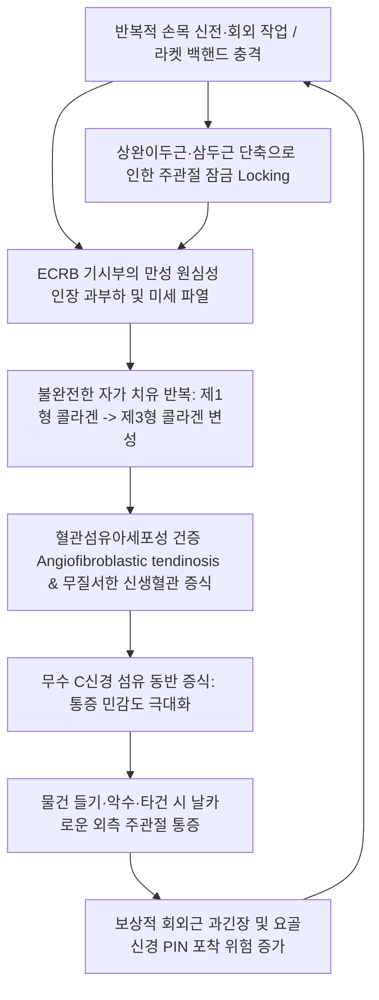

# 외측상과염 (Lateral Epicondylitis / 테니스 엘보)

> **상위 분류**: [[근골격계 질환]] > [[상지 질환]] > [[주관절 질환]]
> **핵심 키워드**: 상완골 외측상과(Lateral epicondyle), [[단요측수근신근]](ECRB), 혈관섬유아세포성 건증(Angiofibroblastic tendinosis), [[코젠 검사]], [[밀 검사]], 침도 감압술, [[요골신경 포착]] 감별

---

## 1. 질환 개요 & 해부학적 병태생리

- **개념 정의**:
  - 외측상과염(Lateral Epicondylitis, Tennis Elbow)은 상완골 외측상과(Lateral Epicondyle)에 공통으로 부착하는 총수근신근건, 특히 **[[단요측수근신근]](Extensor Carpi Radialis Brevis, ECRB)** 기시부의 만성 퇴행성 미세파열 및 혈관섬유아세포성 건증(Angiofibroblastic tendinosis)으로 인해 발생하는 팔꿈치 외측 통증 증후군이다.
- **주관절 외측 총신근건의 해부학적 구조 & 우선순위**:
  - **상완골 외측상과 (Lateral Epicondyle)**: 전완 후면의 수근관절 및 수지 신근들이 공통으로 기시하는 골성 랜드마크.
  - 1) **[[단요측수근신근]](ECRB)**: 외측상과염의 **90% 이상에서 일차적 원인 건**. 요골두 외측면을 지나며 기계적 마찰과 인장력에 가장 취약하다.
  - 2) **[[총지신근]](Extensor Digitorum Communis, EDC)**: 제2~5지 신전을 담당하며 ECRB와 결합하여 기시.
  - 3) **[[척측수근신근]](Extensor Carpi Ulnaris, ECU)**: 손목의 신전 및 척측 편위를 담당.
  - 4) **[[장요측수근신근]](Extensor Carpi Radialis Longus, ECRL)**: 외측상과 상릉에서 기시하여 상대적으로 손상이 적다.
- **영상 및 해부 도해**:
  ![[외측상과염_테니스엘보_해부병태도.jpg|420]]
  > [그림 1: ① 병태생리·영상 — 외측상과염 해부병태도] 상완골(Humerus) 외측상과(Epicondylus Lateralis)에 정지하는 신근건 복합체(Extensors Tendons)의 손상 부위.

---

## 2. 병태생리 메커니즘 & 생체역학적 악순환 네트워크

- **메커니즘 설명**:
  - **염증(Itis)이 아닌 만성 퇴행성 건병증(Osis)**: 급성 염증 세포 침윤은 거의 없으며, 정상적인 제1형 콜라겐이 무질서하고 인장력이 약한 제3형 콜라겐으로 대체되고, 미성숙 혈관과 섬유아세포가 비정상적으로 과다 증식한다(Neovascularization). 신생 혈관망을 따라 무수 C신경 섬유가 함께 자라 들어가 미세한 자극에도 극심한 통증을 유발한다.
  - **상완이두근 및 상완삼두근의 주관절 잠금 (Joint Locking)**: [[상완이두근]]과 [[상완삼두근]]이 만성적으로 단축·긴장되면 주관절의 미세 가동성이 제한되고 관절이 뻣뻣하게 잠기게 되어, 전완 신근군과 외측상과가 모든 충격을 흡수하게 되므로 외측상과 부하가 폭발적으로 증가한다.
  - **관련 해부 구조물**:
    ![[외측상과염_단요측수근신근_손상기전.jpg|540]]
    > [그림 2: ② 관련 해부 구조물 — 외측상과염 발병 기전 3D 도해] 백핸드 스트로크 시 전완 신근군 및 상완골 외측상과 부착부 [[단요측수근신근]](ECRB) 건 기시부의 미세 파열.

---

## 3. 임상 증상 & 이학적 검사(Physical Exam) 알고리즘

### 임상 증상
- **파지 및 신전 시 날카로운 통증**: 커피잔이나 무거운 냄비를 들 때, 문손잡이를 바깥쪽으로 돌릴 때, 걸레나 행주를 비틀어 짤 때, 악수할 때 팔꿈치 바깥쪽이 찌릿하게 아픔.
- **국소 압통 (Pinpoint Tenderness)**: 상완골 외측상과 정점에서 전하방으로 약 1~2cm 떨어진 ECRB 건 기시부를 누르면 펄쩍 뛸 정도의 극심한 압통 호소.
- **너슐 병기 분류 (Nirschl Staging)**:
  - 1단계: 가역적 미세 염증 반응 (활동 후 뻐근함).
  - 2단계 (호발기): 비가역적 건 변성 및 혈관섬유아세포성 증식 (지속적 통증 및 일상 장애).
  - 3단계: 건 조직 전층 파열 및 결손.
  - 4단계: 3단계 병변 + 골극 형성 및 건 석회화 동반.
### 특이적 이학적 검사 알고리즘
1. **[[코젠 검사]](Cozen's Test)**:
   - 주관절을 90° 굴곡하고 전완 회내, 주먹을 쥔 상태에서 검사자의 저항에 맞서 **손목을 위로 신전**시킬 때 외측상과에 격통 발생 (ECRB 능동 수축 유발 검사).
2. **[[밀 검사]](Mill's Test)**:
   - 팔꿈치를 완전히 펴고 전완을 회내시킨 상태에서 **손목을 최대한 수동으로 굴곡**시켜 신근건을 신장시킬 때 외측상과 기시부 통증 유발 (수동 신장 검사).
3. **[[마우슬리 검사]](Maudsley's Test / 중지 신전 검사)**:
   - 팔꿈치를 편 채 **가운데 손가락(제3수지)을 신전**할 때 저항을 주어 통증 유발 여부 확인 ([[단요측수근신근]] 및 [[총지신근]] 분별).

---

## 4. 감별 진단 매트릭스 (Differential Diagnosis)

| 질환명 | 주 병변 부위 | 통증 유발 동작 | 핵심 이학적 검사 | 결정적 감별 포인트 |
| :--- | :--- | :--- | :--- | :--- |
| **외측상과염 (테니스 엘보)** | 외측상과 전하방 1~2cm | 손목 신전, 물건 들기 | Cozen 검사(+), Mill 검사(+) | 외측상과 뼈 자체의 극심한 국소 압통, 건병증 |
| **요골관 증후군 (RTS)** | 외측상과 하방 3~5cm (회외근) | 전완 회외 저항, 중지 신전 | 중지 저항 신전 시 전완 방사통 | PIN 압박 질환, 심부 둔통, 야간 방사통 |
| **상완요골근 증후군** | 전완 외측 상부 근복 | 전완 중립위 주관절 굴곡 | 중립위 굴곡 저항 검사(+) | 상완요골근 TrP 및 요골 경상돌기 견인통 |
| **경추 C6 신경근병증** | 목 ~ 상완 외측 ~ 엄지/검지 | 목 신전·회전 | Spurling 검사(+), 건반사 저하 | 경추부 통증 동반, 피부분절(Dermatome) 감각 저하 |
| **주관절 외측 불안정성 (LUCL)** | 주관절 외측 관절선 | 바닥 짚고 일어설 때 | Pivot-shift 검사(+) | 외측 측부인대 복합체 파열, 관절 빠지는 느낌 |

---

## 5. 한의 통합 치료 프로토콜 (침·약침·추나·한약)

![[외측상과염_주관절_MRI_소견.jpg|450]]
> [그림 3: ③ 치료·시술점 — 상완골 외측상과 ECRB 건 부착부 침도·약침 자입 타겟 MRI 단면 소견] 관상면 T2 강조 영상에서 확인되는 상완골 외측상과 부착부 ECRB 건의 비후 및 고신호강도 건병증 병변을 침도 박리 및 고농도 약침 주입 타겟으로 설정.

### 1) 침도 요법 & 침구 치료 (Acupotomy & Acupuncture)
- **외상과 총신근건 침도 요법 (Acupotomy)**:
  - 외측상과 ECRB 부착부의 만성 변성 건막, 섬유성 반흔 및 골막 유착 부위를 소침도로 미세 절개·박리하여 저품질 신생혈관을 파괴하고 정상 제1형 콜라겐 리모델링 촉진.
- **국소 혈위**: [[곡지]](LI11), [[수삼리]](LI10), 주료(LI12), 수오리(LI13), 척택(LU5).
- **전침 요법**: 곡지-수삼리에 2Hz 저주파 통전을 적용하여 엔돌핀 분비 및 근육 이완 유도.

### 2) 약침 및 봉약침 치료 (Pharmacopuncture)
- **봉약침 (Sweet BV)**: 1:10,000 희석액을 외측상과 기시부 및 곡지, 수삼리에 0.1~0.3cc 주입하여 강력한 항염증 및 혈관 확장 유도.
- **신바로약침 / 중성어혈약침**: 급성기 국소 열감과 부종이 심할 때 어혈을 풀고 미세 순환 촉진.
- ⚠️ **스테로이드 주사의 위험성**: 스테로이드(뼈주사)는 1년 재발률이 54%에 달하고 건 파열을 초래하므로 반복 주사는 금기.

### 3) 추나 요법 & 관절 가동술 (Chuna & Manipulation)
- **상완이두근/삼두근 근막 이완술**: 주관절 락킹을 유발하는 상완이두근 외측연과 상완삼두근 외측두를 도수 이완하여 하완 신근군의 장력을 선제적으로 감압.
- **Mill's Manipulation (밀 조작술)**: 주관절 신전, 전완 회내, 손목 굴곡 상태에서 부드러운 고속-저진폭 추나 조작을 가해 ECRB 반흔 조직 박리.
- **Mulligan MWM**: 통증 없는 외측 활주를 가한 상태에서 환자에게 능동적 그립을 시키는 관절 가동술 적용.

### 4) 한약 처방 (Herbal Medicine)
- **급성 건염 및 기혈어체형**: [[서경탕]](舒經湯), [[당귀수산]](當歸鬚散).
- **만성 건증 및 간신휴허형**: [[독활기생탕]](獨活寄生湯), 보혈영근탕(補血榮筋湯).
- **풍한습비형**: [[오적산]](五積散).

---

## 6. 재활 운동 & 생활습관 티칭 가이드

### 재활 운동
1. **타일러 트위스트 (Tyler Twist with Flexbar)**:
   - 고무 플렉스바를 이용한 ECRB 원심성(Eccentric) 근력 강화 운동 매일 15회씩 3세트 시행 (힘줄 재생의 핵심).
2. **신근군 자가 스트레칭**:
   - 팔꿈치를 펴고 전완을 회내시킨 상태에서 반대 손으로 손등을 아래로 지그시 눌러 15초간 유지.
3. **요골신경 신경가동술 (Nerve Flossing)**:
   - 팔을 뒤로 뻗고 손목을 굴곡시킨 상태에서 고개를 좌우로 움직여 신경 활주 유도.

### 생활습관 지도
- **전완 대항력 보조기 (Counterforce Brace, 테니스 엘보 밴드) 착용**:
  - 외측상과 하방 2~3cm 지점의 신근 근복부를 단단히 압박하여 건 부착부에 가해지는 인장 지렛대를 분산.
  ![[외측상과염_전완보조기_착용실사.jpg|380]]
  > [그림 4: ③ 치료·시술점 — 외측상과염 환자의 전완 대항력 보조기 착용 실사] 외측상과 하방 2~3cm 신근 근복부를 압박하여 부착부 장력을 분산.
- **손잡이 돌리기 및 비틀기 동작 제한**: 걸레 짜기, 드라이버 돌리기, 무거운 프라이팬 한 손으로 들기 금지.

---

## 7. 💡 사용자 진료실 핵심 필기 & 임상 노하우 (Melt-In 잔여 심화 집약)

> [!TIP] **진료실 임상 관찰 포인트**
> 1. **수지신근 vs 수근신근 감별법**:
>    - 환자에게 손가락을 완전히 구부려 주먹을 쥐게 한 뒤 손목 신전 검사를 시행했을 때 여전히 통증이 있다면 **수근신근([[단요측수근신근]])의 순수 손상**으로 확진할 수 있다 (손가락을 굽히면 총지신근의 장력이 배제됨).
> 2. **최근 스테로이드 주사력 확인**:
>    - 최근 3개월 이내에 정형외과에서 뼈주사를 맞은 환자는 건이 매우 취약해져 있으므로 주사 직후 2주간은 강한 침도 시술을 피하고 건 파열에 극도로 주의해야 한다.
> 3. **경추(C5-C6) 사정의 중요성**:
>    - 목 통증, 경추 가동 제한, 상지 신경긴장검사 양성이 동반되면 팔꿈치 국소 치료만으로는 치료 효과가 지속되지 않으므로 반드시 경추 협척과 사각근을 병행 치료해야 한다.

---

## 8. 출처 및 학술 참고 문헌 (References)

1. Coombes BK, Bisset L, Brooks P, Khan A, Vicenzino B. Effect of corticosteroid injection, physiotherapy, or both on clinical outcomes in patients with unilateral lateral epicondylalgia: a randomized controlled trial. *JAMA*. 2013;309(5):461-469. [PMID: 23385272](https://pubmed.ncbi.nlm.nih.gov/23385272/)
   - [연구 요약] 외측상과염 환자에서 스테로이드 주사와 물리치료를 비교한 대규모 RCT로, 스테로이드 주사는 4주 단기 효과는 우수하나 1년째 재발률이 54%(위약/물리치료군 12% 대비)로 급증함을 규명하여 보존적 침/운동 치료 우선 권고.
2. Fernández-Carnero J, et al. Dry needling and manual therapy for lateral epicondylalgia: A multicenter randomized controlled trial. *Clin Rehabil*. 2024;38(8):1063-1079. [PMID: 38676324](https://pubmed.ncbi.nlm.nih.gov/38676324/)
   - [연구 요약] 외측상과염 환자에서 ECRB 기시부 건침(Dry Needling/Acupotomy)과 도수 관절 가동술 병행 시 통증 및 기능점수(PRTEE)가 유의하게 개선(SMD 1.13)됨을 입증한 최신 다기관 RCT.
3. Nirschl RP, Pettrone FA. Tennis elbow. The surgical treatment of lateral epicondylitis. *J Bone Joint Surg Am*. 1979;61(6):832-839. [PMID: 479229](https://pubmed.ncbi.nlm.nih.gov/479229/)
   - [연구 요약] 외측상과염의 본질이 단순 염증이 아니라 ECRB 건 기시부의 혈관섬유아세포성 건증(Angiofibroblastic tendinosis)임을 최초로 규명한 기념비적 고전 논문.
4. Journal of Back and Musculoskeletal Rehabilitation 2026;39(5):1727-1738. [PMID: 42095617](https://pubmed.ncbi.nlm.nih.gov/42095617/)
   - [연구 요약] 요골신경 신경가동술, Mulligan MWM, Maitland 관절가동술 3군 비교 RCT로 편심성 수완신근 운동 병행 시 신경가동군에서 통증 및 악력의 수치상 최대 호전을 보고함.

<!-- 보관 태그(1회용·링크오류, 필요시 복원): 단요측수근신근 -->
