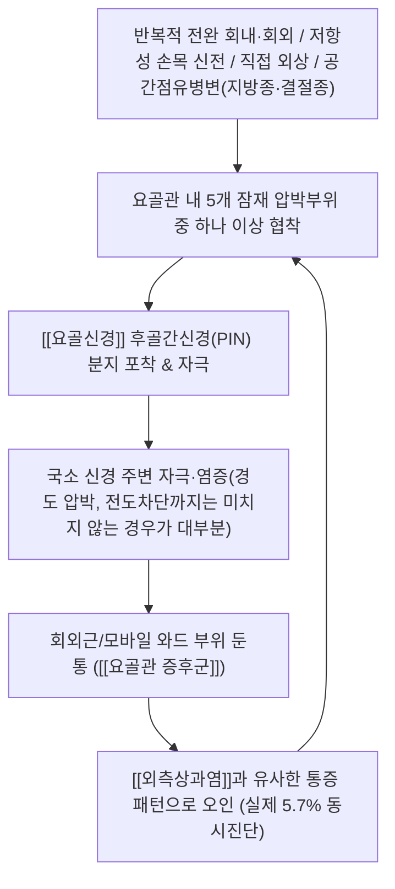

---
aliases:
  - Radial Tunnel Syndrome
  - RTS
  - 요골터널증후군
  - 요골관증후군
  - Posterior Interosseous Nerve Compression
tags:
  - 이론
  - 질환
  - 근골격계
  - 상지
  - 전완부
  - 신경포착
created: 2026-09-22
updated: 2026-09-22
status: complete
title: 요골관 증후군
date: 2026-09-24
출처: "PMID: 18261668"
---
# 🩺 [[요골관 증후군]] (Radial Tunnel Syndrome / 橈骨管症候群, 관련 ICD-10 G56.8)

> **핵심 3줄 요약 (Key Summary)**:
> - 📍 병소 부위 & 해부·병태생리: 요골두-상완골소두 관절부터 [[회외근]] 원위연까지 약 5cm 구간의 요골관(radial tunnel) 내에서 [[요골신경]]의 후골간신경(PIN) 분지가 5개 잠재 부위(관절 전방 섬유대·Leash of Henry·[[단요측수근신근]] 건연·Frohse 궁·회외근 원위연) 중 한 곳 이상에서 압박·자극됨.
> - 🚩 전형적 임상 양상 & 3대 징후: 외측상과 원위 회외근/모바일 와드(mobile wad) 부위의 둔통이 핵심이며, 진성 후골간신경마비(PIN palsy)와 달리 **객관적 운동·감각 결손이 없는 것이 진단적 특징**. [[외측상과염]]과 통증 위치·양상이 겹쳐 오진되기 쉬움(실제 6개월 내 동시 진단율 5.7%).
> - 🛠️ 핵심 감별 검사 & 한·양방 다각적 치료 전략: 요골관 부위 압통(문헌상 97%로 가장 일관된 소견)이 핵심 소견이며 진단 주사(국소마취제±스테로이드) 반응이 가장 실용적인 확진 보조 수단. 보존적 치료(활동 조절·부목·스테로이드 주사)를 우선하고, 반응 없을 시 수술적 감압을 고려.
> - ⚠️ 응급 의뢰 레드플래그 & 악화 요인: 손가락·엄지 신전력의 객관적 약화(finger/thumb drop)가 동반되면 이는 RTS가 아닌 **진성 PIN 마비**를 의미하므로 정형외과/수부외과 의뢰 대상. 반복적 전완 회내·회외 동작(작업·라켓 스포츠)이 주요 악화 요인.

---

## 📌 목차
1. [질환 개요 & 해부학적 병태생리](#1-질환-개요--해부학적-병태생리)
2. [병태생리 메커니즘 & 생체역학적 악순환 네트워크](#2-병태생리-메커니즘--생체역학적-악순환-네트워크)
3. [임상 증상 & 이학적 검사(Physical Exam) 알고리즘](#3-임상-증상--이학적-검사physical-exam-알고리즘)
4. [감별 진단 매트릭스 (Differential Diagnosis)](#4-감별-진단-매트릭스-differential-diagnosis)
5. [한의 통합 치료 프로토콜 (침·약침·추나·한약)](#5-한의-통합-치료-프로토콜-침약침추나한약)
6. [재활 운동 & 생활습관 티칭 가이드](#6-재활-운동--생활습관-티칭-가이드)
7. [💡 사용자 진료실 핵심 필기 & 임상 노하우 (Melt-In 잔여 심화 집약)](#7--사용자-진료실-핵심-필기--임상-노하우-melt-in-잔여-심화-집약)
8. [출처 및 학술 참고 문헌 (References)](#8-출처-및-학술-참고-문헌-references)

---

## 1. 질환 개요 & 해부학적 병태생리

![[요골관증후군_요골관_신경압박_병태생리도해.jpg|450]]
> 출처: Wikimedia Commons, Mangi MD, Zadow S & Lim W (CC BY 4.0)

* **질환 정의 및 역학**:
  * 요골관(radial tunnel: 요골두-상완골소두 관절부터 [[회외근]] 원위연까지 약 5cm 구간) 내에서 [[요골신경]]의 후골간신경(Posterior Interosseous Nerve, PIN) 분지가 압박·자극되어 통증을 유발하는 신경포착 질환. 미국 대규모 보험 데이터베이스(환자 약 9,100만 명, 2010~2019) 분석 결과 **유병률 0.091%, 연간 발생률 0.0091%**이며 평균 발병 연령 약 52세, 여성이 55%를 차지함(Zhang et al., 2023).
  * 진단 후 1년 내 수술적 감압술 시행률은 2.4%에 불과해, 임상에서는 대부분 보존적으로 관리됨(Zhang et al., 2023).
* **[[외측상과염]]과의 실제 중첩**:
  * 같은 코호트에서 RTS 진단 환자 중 **5.7%가 6개월 이내 같은 팔에서 [[외측상과염]] 진단도 함께 받아**, 두 질환이 실제로 자주 공존하거나 오진되는 정도가 대규모 데이터로 정량화됨(Zhang et al., 2023). 통증 위치가 [[외측상과염]]은 상과 자체인 반면 RTS는 상과 원위 4~5cm의 회외근/모바일 와드 부위라는 점이 감별의 핵심.
* **관련 해부학적 구조물**:
  * **골격 및 관절**: 요골두, 상완골소두, 요골-상완골소두 관절(radiocapitellar joint).
  * **근육 및 근막**: [[회외근]](supinator, Frohse 궁을 형성), [[단요측수근신근]](ECRB, 건연이 압박부위 중 하나), [[상완요골근]] 등 모바일 와드(mobile wad) 근육군.
  * **신경 및 혈관**: [[요골신경]]이 상완골 외측상과 근위부에서 표재감각지(superficial radial nerve)와 후골간신경(PIN)으로 분지되며, 요골회귀동맥의 분지(Leash of Henry)가 PIN과 교차.

---

## 2. 병태생리 메커니즘 & 생체역학적 악순환 네트워크

![[요골관증후군_요골신경심지_회외근관통_해부도해.jpg|450]]
> 출처: Gray's Anatomy, Wikimedia Commons (Public domain)

### 1) 해부학적 포착 및 압박 기전 — 5개 잠재 압박 부위
* 사체 10례 해부 연구(Ummel et al., 2019)에서 확인된 요골관 내 5개 잠재적 압박 부위:
  1. 요골두-상완골소두 관절(radiocapitellar joint) 전방의 섬유대(fibrous bands)
  2. 요골회귀혈관 다발(Leash of Henry)
  3. [[단요측수근신근]](ECRB) 건 내측연
  4. Frohse 궁(arcade of Frohse, [[회외근]] 근위연의 섬유성 비후)
  5. [[회외근]] 원위연
  * 해당 연구는 근막-분리(brachioradialis-splitting) 단일 접근법으로 5개 부위 모두에서 PIN을 손상 없이 식별·감압할 수 있음을 실증함(Ummel et al., 2019).
* RTS는 통증 위주(운동·감각 결손 없음)인 반면, 진성 PIN 마비(palsy)는 운동 결손(손가락 신전 약화) 위주라는 것이 핵심 병태생리적 구분점(Tang, 2020; Patterson et al., 2024).

### 2) 생체역학적 연쇄 반응 (Kinetic Chain)
* 반복적 전완 회내·회외 동작(작업·라켓 스포츠 등)과 저항성 손목 신전이 주요 유발 요인으로 문헌상 공통적으로 기술되나, 회내·회외 반복 시 요골관 내압 상승에 대한 구체적 정량 수치의 1차 출처는 이번 조사에서 확인하지 못했습니다(⚠️ 확인 불가).
* 지방종·결절종 등 공간점유병변에 의한 이차성 RTS 사례가 문헌에 보고되나, 발생 빈도에 대한 정량적 메타데이터는 확인하지 못했습니다(⚠️ 확인 불가).

---

## 3. 임상 증상 & 이학적 검사(Physical Exam) 알고리즘

### 1) 주소증 및 신경학적 증상
* **통증 양상**: 외측상과 원위 회외근/모바일 와드 부위의 둔통(dull ache)이 핵심 주소증. 저항성 회외/손목 신전, 반복적 파지 동작으로 악화.
* **감각 이상**: 원칙적으로 객관적 감각 결손이 없는 것이 RTS의 진단적 특징(경한 압박이므로 전도차단까지 이르지 않는 경우가 대부분).
* **운동 장애**: 마찬가지로 객관적 근력 약화가 없는 것이 원칙 — 손가락/엄지 신전력 약화가 동반되면 RTS가 아닌 진성 PIN 마비를 의심해야 함(Patterson et al., 2024).

### 2) 필수 이학적 검사법 (Physical Examination)
* **요골관 부위 압통(tenderness)**: 13개 연구·391개 상지를 종합한 체계적 문헌고찰에서 **381/391례(97%)**에 확인되어, 가장 일관된 단일 이학적 소견으로 보고됨(Hones et al., 2024).
* **진단적 신경 차단(주사)**: 같은 문헌고찰에서 218/295례(74%)에서 진단 목적 요골관 주사가 사용되었고, [[외측상과염]] 주사 치료 실패 후 RTS로 재진단된 경우도 46/295례(16%) 확인됨(Hones et al., 2024). 국소마취제/스테로이드 주사 후 단기 반응이 현재까지 가장 지지되는 진단적 지표라는 데 여러 문헌이 일치함(Hones et al., 2024; Ang et al., 2023).
* **⚠️ 중요 — 정직한 한계 표시**: 임상 교육자료에서 흔히 언급되는 "중지 신전 저항 검사(middle finger test)"나 "저항성 회외 검사"의 정량적 민감도·특이도를 뒷받침하는 검증 가능한 1차 논문은 이번 조사에서 찾지 못했습니다(⚠️ 확인 불가). 오히려 체계적 문헌고찰들은 "RTS 진단에 사용되는 검사법·정의 자체에 상당한 이질성이 존재한다"고 지적하며(Hones et al., 2024), "전통적 임상 검사(예: Maudsley 검사)는 검증된 진단적 근거가 부족하다"고 명시적으로 비판합니다(Ang et al., 2023). [[Tennis elbow test]] 등 [[외측상과염]] 검사와의 직접 비교 연구는 확인하지 못했습니다.

---

## 4. 감별 진단 매트릭스 (Differential Diagnosis)

| 감별 질환 | 호발 병소 및 원인 | 주소증 차이점 | 특이적 이학적 검사 소견 |
| :--- | :--- | :--- | :--- |
| [[요골관 증후군]] (본 질환) | 요골관 내 5개 부위 중 PIN 경도 압박 | 상과 원위 4~5cm 회외근부 둔통, 운동·감각 결손 없음 | 요골관 압통(97%), 진단주사 반응 양성 |
| [[외측상과염]] | ECRB 건 부착부 퇴행성 변화 | 상과 자체의 압통, 저항성 손목신전 시 통증 | [[Tennis elbow test]] 양성 (RTS와 5.7% 동시진단) |
| 진성 PIN 마비(운동마비형) | PIN의 심한 압박(전도차단 수준) | 통증은 경미하고 손가락·엄지 신전 약화(finger drop)가 주 소견 | EMG/NCS 이상(RTS는 이상소견 8.9%에 불과하나 진성 PIN 마비는 이상 소견 뚜렷) |
| 경추성 신경근병증(C7) | 경추 추간공 협착 | 경부 동반 증상, 방사통 분포가 더 근위부까지 | [[스펄링 검사]] 등 경추 유발검사 양성 (⚠️ RTS와의 직접 비교연구는 확인 불가) |
| 요골두-상완골소두 관절병증 | 관절 자체의 퇴행/염증 | 회전 시 관절성 마찰음·제한 동반 가능 | 영상검사(X-ray/MRI)상 관절면 이상 (⚠️ 정량 비교연구 확인 불가) |

---

## 5. 한의 통합 치료 프로토콜 (침·약침·추나·한약)

![[요골관증후군_전완신전근군_침구시술_해부도해.jpg|450]]
> 출처: Gray's Anatomy, Wikimedia Commons (Public domain)

* **침구 치료 (Acupuncture)**:
  * 타겟: [[회외근]] 및 [[단요측수근신근]] 부위 압통점(트리거포인트), Frohse 궁 주변 자침.
  * ⚠️ 정직한 근거 표시: RTS 자체를 대상으로 한 침 치료 연구는 이번 조사에서 전혀 찾지 못했습니다(확인 불가). 다만 해부학적으로 인접한 [[외측상과염]]에 대해서는 수기침이 통증(SMD −0.66)·기능장애(SMD −0.51)·악력(SMD 0.36)에 중등도~소효과를 보인 메타분석이 있으나(Navarro-Santana et al., 2021), 전침은 유의한 효과가 없었고, 이는 RTS가 아닌 외측상과염 대상 연구이므로 RTS에 직접 외삽하는 것은 주의가 필요합니다.
* **약침 치료 (Pharmacopuncture)**:
  * 요골관 압통점(Frohse 궁 주변) 대상 소염·신경활주 개선 목적의 약침을 고려할 수 있으나, RTS 특이적 약침 임상연구는 확인하지 못했습니다(⚠️ 확인 불가).
* **추나 치료 (Chuna Manipulation)**:
  * [[회외근]]·[[상완요골근]] 등 모바일 와드 근막 이완(JS) 수기, 요골두 가동성 평가 후 필요 시 관절가동술.
* **한약 치료 (Herbal Medicine)**:
  * 급성기 국소 어혈·염증 관점에서 활혈거어제, 만성기 기혈 보충 관점에서 보익제를 변증에 따라 고려할 수 있으나, RTS 특이적 한약 임상연구는 확인하지 못했습니다(⚠️ 확인 불가 — 향후 원장님 임상 경험 축적 필요).

---

## 6. 재활 운동 & 생활습관 티칭 가이드

* **이완 및 스트레칭 (Stretching)**: [[회외근]]·[[상완요골근]] 등 모바일 와드 근육군의 정적 스트레칭, 손목 굴곡/전완 회내 자세 스트레칭.
* **강화 및 안정화 운동 (Strengthening)**: 통증 완화 후 점진적 저항성 회외·손목신전 강화 운동.
* **신경 활주 운동 (Neurodynamics)**: 요골신경 슬라이더(slider) 기법(⚠️ RTS 특이적 프로토콜 연구는 확인하지 못함 — 일반 신경가동술 원리 적용).
* **일상생활 자세 티칭 (Ergonomics)**: 반복적 전완 회내·회외 동작(드라이버 사용, 라켓 스포츠, 손목 꺾어 잡는 파지 동작) 빈도·강도 조절, 작업 중 휴식 주기 확보.

---

## 7. 💡 사용자 진료실 핵심 필기 & 임상 노하우 (Melt-In 잔여 심화 집약)

> [!IMPORTANT]
> ⚠️ 내용 검토 필요: 아직 원장님의 진료실 임상 필기가 반영되지 않았습니다. 요골관 증후군 관련 실전 문진·감별·치료 노하우가 있으시면 이 섹션에 추가해 주세요.

* **실전 문진 체크리스트 (제안)**:
  * "[[외측상과염]]으로 치료받았는데 잘 낫지 않는다"는 병력 — 통증 위치가 상과 자체인지, 그보다 원위 4~5cm 회외근부인지 재확인.
  * 반복적 손목 꺾기·회내회외 동작을 요하는 직업/취미 여부 확인(요리사, 목수, 라켓 스포츠 등).
* **치료 순서 및 손맛 노하우**: ⚠️ 원장님 임상 경험 반영 대기.
* **환자 티칭 스크립트**: ⚠️ 원장님 임상 경험 반영 대기.

---

## 8. 출처 및 학술 참고 문헌 (References)

1. **Zhang JY, Manirajan A, Wolf JM. (2023)**. *The Epidemiology of Radial Tunnel Syndrome and Its Overlap With Lateral Epicondylitis*. **Journal of Hand Surgery (Am)**, 48(11), 1172.e1-1172.e7. https://doi.org/10.1016/j.jhsa.2023.03.007
   - **[연구 요약]**: 약 9,100만 명 규모 미국 보험 데이터베이스 분석. RTS 유병률 0.091%·연간 발생률 0.0091%, 평균 연령 52세, 여성 55%. RTS 환자의 5.7%가 6개월 내 동측 외측상과염 진단도 받아 실제 중첩률을 최초로 대규모 정량화.
2. **Patterson JMM, Medina MA, Yang A, Mackinnon SE. (2024)**. *Posterior Interosseous Nerve Compression in the Forearm, AKA Radial Tunnel Syndrome: A Clinical Diagnosis*. **HAND**, 19(2), 228-235. PMID: [36082441](https://pubmed.ncbi.nlm.nih.gov/36082441/)
   - **[연구 요약]**: RTS(통증 위주)와 진성 PIN 마비(운동결손 위주)를 명확히 구분해야 함을 강조. PIN 감압술 15예 후향 연구에서 VAS 6.7→3.3, DASH 46.3→33.6로 유의한 호전(평균 추적 11.9개월).
3. **Tang JB. (2020)**. *Radial tunnel syndrome: definition, distinction and treatments*. **Journal of Hand Surgery (European Volume)**, 45(8), 882-889. https://doi.org/10.1177/1753193420953990
   - **[연구 요약]**: RTS(통증)와 PIN 마비(운동결손)의 정의·구분·치료전략을 포괄적으로 정리한 리뷰.
4. **Ummel JR, Coury JG, Lum ZC, Trzeciak MA. (2019)**. *Transbrachioradialis Approach to the Radial Tunnel: An Anatomic Study of 5 Potential Compression Sites*. **HAND**, 14(3), 329-332. PMID: [29303001](https://pubmed.ncbi.nlm.nih.gov/29303001/)
   - **[연구 요약]**: 사체 10례 해부 연구로 요골관 내 5개 잠재 압박부위(관절 전방섬유대·Leash of Henry·ECRB 건연·Frohse 궁·회외근 원위연)를 확인, 단일 접근법으로 모두 감압 가능함을 실증.
5. **Hones KM, Cueto RJ, Ndjonko LC, et al. (2024)**. *Establishing the diagnosis of radial tunnel syndrome: a systematic review of published clinical series*. **European Journal of Orthopaedic Surgery & Traumatology**, 34(6), 2813-2821. https://doi.org/10.1007/s00590-024-04003-8
   - **[연구 요약]**: 13개 연구·391개 상지 종합 체계적 문헌고찰. 요골관 압통 97%로 가장 일관된 소견, 진단주사 사용 74%, EMG/NCS 이상소견은 8.9%에 불과. 진단 검사법의 상당한 이질성을 지적.
6. **Ang GG, Bolzonello DG, Johnstone BR. (2023)**. *Radial tunnel syndrome: Case report and comprehensive critical review of a compression neuropathy surrounded by controversy*. **HAND**, 18(1_suppl), 146S-153S. PMID: [34284603](https://pubmed.ncbi.nlm.nih.gov/34284603/)
   - **[연구 요약]**: 전통적 임상검사(Maudsley 검사 등)는 검증된 근거가 부족하다고 비판하며, 마취제/스테로이드 진단주사 반응이 가장 지지되는 진단 지표라고 결론.
7. **Marchese J, Coyle K, Cote M, Wolf JM. (2019)**. *Prospective Evaluation of a Single Corticosteroid Injection in Radial Tunnel Syndrome*. **HAND**, 14(6), 741-745. PMID: [29998772](https://pubmed.ncbi.nlm.nih.gov/29998772/)
   - **[연구 요약]**: RTS 40명 전향 연구, PIN 근위부 1회 스테로이드 주사 후 1년 시점 qDASH·VAS 유의 호전(MCID 달성률 57%), 23%는 결국 수술로 전환.
8. **Huisstede B, Miedema HS, van Opstal T, de Ronde MT, Verhaar JA, Koes BW. (2008)**. *Interventions for treating the radial tunnel syndrome: a systematic review of observational studies*. **Journal of Hand Surgery (Am)**, 33(1), 72-78. PMID: 18261668
   - **[연구 요약]**: 수술적 감압술은 효과 있을 가능성을 시사하나 방법론적 질이 낮고, 당시 보존적 치료(물리치료·주사) 연구는 포함기준을 충족하는 것이 전무해 효과가 "unknown"이라 결론.
9. **Sotereanos DG, Varitimidis SE, Giannakopoulos PN, Westkaemper JG. (1999)**. *Results of surgical treatment for radial tunnel syndrome*. **Journal of Hand Surgery (Am)**, 24(3), 566-570. https://doi.org/10.1053/jhsu.1999.0566
   - **[연구 요약]**: 감압술 28명, 평균 추적 28개월. 의사 평가 우수/양호 39%, 환자 자가보고 우수/양호 64%로 평가자 간 괴리 확인. 산재/소송 관련 환자는 결과가 유의하게 나쁨.
10. **Navarro-Santana MJ, Sanchez-Infante J, Gómez-Chiguano GF, Cummings M, Fernández-de-las-Peñas C, Plaza-Manzano G. (2021)**. *Effects of manual acupuncture and electroacupuncture for lateral epicondylalgia of musculoskeletal origin: a systematic review and meta-analysis*. **Acupuncture in Medicine**, 39(5), 405-422. https://doi.org/10.1177/0964528420967364
    - **[연구 요약]**: ⚠️ RTS가 아닌 외측상과염 대상 연구. 수기침이 통증·기능·악력에 중등도~소효과(단기), 전침은 유의한 효과 없음. RTS로 직접 외삽 시 주의 필요.

> ⚠️ 확인 불가/추정 표시 총괄: 요골관 내압 상승 정량수치, middle finger test/저항성 회외검사의 민감도·특이도, Cozen's·Mill's test와의 직접 비교연구, 경추 신경근병증과의 직접 비교연구, RTS 특이적 침·약침·한약 임상연구는 검색 범위 내에서 확인하지 못해 각 섹션에 개별 표시했습니다.
