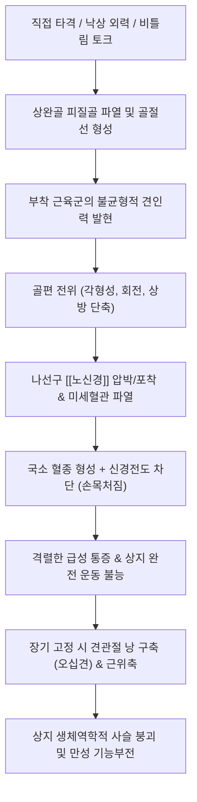

# 🩺 [[위팔 골절]] (상완골 골절 / Humerus Fracture / 肱骨骨折, S42)

> **핵심 3줄 요약 (Key Summary)**:
> - 📍 병소 부위 & 해부·병태생리: [[상완골]]의 근위부(해부경·외과경·대소결절), 간부(골간부 나선구), 원위부(과상부·관절융기). 외력 및 회전력에 의한 골피질 파열과 함께 골간부 나선구의 [[노신경]](요골신경) 포착·단열, 액와신경 및 상완동맥 손상이 핵심 병태생리.
> - 🚩 전형적 임상 양상 & 3대 징후: 상완부의 급성 극통과 가성 관절 운동(abnormal mobility), 골편 마찰음(crepitus), 흉벽 및 상완 내측의 광범위한 Hennequin 반상출혈, 요골신경 마비 시 손목처짐(wrist drop) 및 제1수간 배측 감각 마비.
> - 🛠️ 핵심 감별 검사 & 한·양방 다각적 치료 전략: 단순 방사선(상완골 AP/Lat, 어깨 True AP/Scapular Y view) 및 요골신경 운동·감각 평가. 급성기 정형외과적 안정화(팔걸이/U-슬랩/사르미엔토 보조기/ORIF), 유합기 어혈 제거 및 가골 형성 촉진을 위한 [[당귀수산]], [[자연동]](산골) 투약, 고정 해제기 어깨 굳음증 방지를 위한 코드만 진자 운동 및 경혈 침구·약침 치료.
> - ⚠️ 응급 의뢰 레드플래그: 요골신경 마비(급성 손목처짐), 요골동맥 맥박 소실 및 상지 냉감·청색증(상완동맥 파열 의심), 개방성 골절(골편 노출), 상완/전완 구획증후군(극심한 수동신전통, 무맥, 창백, 감각이상), 불유합/가관절 형성.

---

## 📌 목차
1. [질환 개요 & 해부학적 병태생리](#1-질환-개요--해부학적-병태생리)
2. [병태생리 메커니즘 & 생체역학적 악순환 네트워크](#2-병태생리-메커니즘--생체역학적-악순환-네트워크)
3. [임상 증상 & 이학적 검사(Physical Exam) 알고리즘](#3-임상-증상--이학적-검사physical-exam-알고리즘)
4. [감별 진단 매트릭스 (Differential Diagnosis)](#4-감별-진단-매트릭스-differential-diagnosis)
5. [한의 통합 치료 프로토콜 (침·약침·추나·한약)](#5-한의-통합-치료-프로토콜-침약침추나한약)
6. [양방 치료 & 병용·의뢰 기준 (Conventional Treatment & Referral)](#6-양방-치료--병용의뢰-기준-conventional-treatment--referral)
7. [재활 운동 & 생활습관 티칭 가이드](#7-재활-운동--생활습관-티칭-가이드)
8. [💡 사용자 진료실 핵심 필기 & 임상 노하우 (Melt-In 잔여 심화 집약)](#8--사용자-진료실-핵심-필기--임상-노하우-melt-in-잔여-심화-집약)
9. [출처 및 학술 참고 문헌 (References)](#9-출처-및-학술-참고-문헌-references)

---

## 1. 질환 개요 & 해부학적 병태생리

![[위팔골절_01_병태도해_상완골골절_유형별도해.png|450]]
> [그림 1: ① 상완골의 해부학적 구역 및 골절 병태 도해 — Smart-Servier Medical Art (CC BY 3.0)]

![[위팔골절_01_영상의학_근위부상완골골절_Xray.jpg|380]]
> [그림 2: ② 근위부 상완골 외과경 골절(Neer 2분 골절) 단순 방사선 AP 소견 — Wikimedia Commons (CC BY-SA 4.0)]

![[위팔골절_01_영상의학_상완골간부골절_Xray.jpg|320]]
> [그림 3: ③ 상완골 간부(중간 1/3) 전위 골절 단순 방사선 AP 소견 — Wikimedia Commons (CC BY-SA 3.0)]

* **질환 정의 및 해부학적 분류**:
  * 위팔 골절(상완골 골절, Humerus fracture)은 어깨관절부터 팔꿈치관절까지 이어지는 상지의 유일한 장골인 [[상완골]]의 연속성이 외력에 의해 완전 또는 불완전하게 소실된 상태를 지칭합니다.
  * 해부학적 발생 부위에 따라 크게 3대 영역으로 분류됩니다:
    1. **근위부 상완골 골절 (Proximal humerus fracture)**: 상완골두, 해부경(anatomical neck), 외과경(surgical neck), 대결절(greater tuberosity), 소결절(lesser tuberosity) 부위의 골절. **Neer 분류법**에 따라 전위(골편 전위 > 1cm 또는 각형성 > 45°)된 골편 수에 따라 1-part, 2-part, 3-part, 4-part 골절로 세분합니다.
    2. **상완골 간부 골절 (Humeral shaft / diaphyseal fracture)**: 대흉근 부착부 원위부부터 상완골 과상부(supracondylar ridge) 근위부 사이의 골간부 골절. 횡상, 사상, 나선상, 분쇄 골절로 나뉘며, 특히 원위 1/3 부위의 나선상 골절은 **Holstein-Lewis 골절**이라 하여 [[노신경]] 포착 손상 빈도가 매우 높습니다.
    3. **원위부 상완골 골절 (Distal humerus fracture)**: 과상 골절(supracondylar fracture), 경과 골절(transcondylar), 과간 골절(intercondylar) 등을 포함하며 소아에서는 과상 골절이 상지 골절 중 최다 빈도를 차지합니다.
* **역학 및 호발군**:
  * 전체 골절의 약 5~8%를 차지하며, 이봉형(bimodal) 연령 분포를 보입니다:
    * **고령층(65세 이상)**: 여성에서 호발하며 골다공증이 기저에 있는 상태에서 가벼운 보행 중 넘어짐(FOOSH, Fall On Outstretched Hand)으로 인한 근위부 외과경 골절이 70% 이상을 차지합니다.
    * **청장년층(20~40대)**: 고에너지 외상(교통사고, 추락, 격렬한 스포츠, 팔씨름 등 회전 외력)에 의한 간부 및 원위부 골절이 다발합니다.
* **관련 해부학적 구조물**:
  * **골격 및 관절**: [[상완골]], [[견관절]](관절와상완관절), [[주관절]](완척관절·완요관절).
  * **근육 및 건 구조물**:
    * 근위 골편 제어근: [[극상근]], [[극하근]], 소원근(대결절 외회전·외전 견인), [[견갑하근]](소결절 내회전 견인).
    * 골간 골편 제어근: [[대흉근]](근위 골편 내전·내회전), [[삼각근]](근위 골편 외전), [[상완이두근]] 및 [[상완삼두근]](원위 골편 상방 단축 견인).
  * **신경 및 혈관**:
    * **[[노신경]](요골신경, Radial nerve)**: 상완골 후면의 나선구(spiral/radial groove)에 골막과 직접 밀착하여 주행하므로 간부 골절 시 견인·압박·단열 손상에 가장 취약합니다(11~18% 동반).
    * **[[액와신경]](Axillary nerve)**: 외과경(surgical neck) 후면을 감아 돌며 사각공(quadrilateral space)을 통과하므로 근위부 전위 골절 시 손상 위험.
    * **상완동맥(Brachial artery)**: 원위부 과상 골절 시 전방 전위된 근위 골편에 의해 열상 또는 압박을 받아 허혈성 구획증후군(Volkmann 구축)을 유발할 수 있습니다.

---

## 2. 병태생리 메커니즘 & 생체역학적 악순환 네트워크

![[위팔골절_02_해부도해_요골신경주행_나선구_Gray818.png|300]]
> [그림 4: ④ 상완골 나선구(Radial Groove)를 감아 도는 요골신경 및 심상완동맥의 주행 도해 — Gray's Anatomy Plate 818 (Public Domain)]

### 1) 근육 견인력에 의한 골편 전위 메커니즘
* **대흉근 부착부 상부 골절 (Subcapital / Surgical neck)**:
  * 회전근개([[극상근]], [[극하근]])의 작용으로 근위 골편은 외전 및 외회전되고, 원위 골편은 [[대흉근]]과 광배근의 수축에 의해 내측으로 강하게 견인되어 내전 전위를 일으킵니다.
* **대흉근 부착부와 삼각근 부착부 사이 골절**:
  * 근위 골편은 대흉근의 견인에 의해 내전되고, 원위 골편은 [[삼각근]]의 수축에 의해 외측 및 상방으로 당겨져 전위가 가중됩니다.
* **삼각근 부착부 원위부 골절 (중·하위 1/3)**:
  * 근위 골편은 삼각근에 의해 외전 및 전방 굴곡되며, 원위 골편은 [[상완이두근]], [[상완삼두근]], 상완근의 장력에 의해 근위부로 오버랩되면서 골편 단축(shortening)과 각형성(angulation)을 형성합니다.

### 2) 나선구(Radial Groove)에서의 신경 포착 병태생리
* 상완골 후면의 골간부 중앙에서 원위 1/3 외측 근간중격(lateral intermuscular septum)을 뚫고 전방으로 넘어가는 구역에서 [[노신경]]은 유연성이 극히 제한됩니다.
* 뼈가 부러지는 순간 골편 사이에 끼이거나(entrapment), 예리한 골절면에 찔려 부분/완전 절단되거나(laceration), 골절 치유 과정에서 형성되는 과도한 섬유성 가골(callus)에 의해 지연성 포착을 겪게 됩니다.
* 신경 손상의 대부분(약 70~85%)은 신경내막의 연속성이 유지된 **신경실무율(Neuropraxia)** 또는 **축삭절단(Axonotmesis)** 형태로, 조기에 무리한 수술적 조작을 가하지 않고 적절한 고정과 한의학적 보존 치료를 병행하면 3~4개월에 걸쳐 축삭 재생(1일 약 1mm)이 이루어집니다.

---

## 3. 임상 증상 & 이학적 검사(Physical Exam) 알고리즘

### 1) 전형적 주소증 및 3대 임상 징후
* **상완부 극통 및 압통**: 환측 팔을 건측 손으로 받쳐 든 채 내원하며, 미세한 팔의 흔들림에도 비명에 가까운 통증을 호소합니다.
* **가성 관절 운동(Abnormal Mobility)과 염발음(Crepitus)**: 골간부 골절 시 뼈 중간이 관절처럼 꺾이는 이상 움직임이 육안으로 관찰되며, 부주의한 촉진 시 골편끼리 부딪히는 자갈 긁는 듯한 마찰음이 발생합니다 (⚠️ 통증 악화 및 신경 손상 위험이 있으므로 의도적 유발은 금기).
* **광범위 피하 반상출혈 (Hennequin 징후)**: 골절 후 24~48시간에 걸쳐 골수강과 주변 근육 파열 부위에서 흘러나온 대량의 혈종이 중력을 따라 피하로 이동하여 상완 내측, 겨드랑이, 흉벽 및 팔꿈치 전완까지 넓게 멍이 퍼집니다.

### 2) 필수 신경·혈관 진찰 알고리즘 (Neurovascular Check)
모든 상완골 골절 환자 진료 시 단순 방사선 확인 전에 즉시 다음 신경학적 평가를 수행해야 합니다:

| 신경/혈관 | 검사 수기 (Action) | 정상 소견 | 손상 시 이상 소견 (Red Flag) |
| :--- | :--- | :--- | :--- |
| **[[노신경]] (운동)** | 손목 및 중수수지관절(MCP) 능동 신전 | 손목과 손가락이 위로 젖혀짐 | **손목처짐(Wrist drop)**, 엄지 외전 불가 |
| **[[노신경]] (감각)** | 제1등쪽뼈사이공간(제1지간 배측) 가벼운 촉각 | 정상 촉각 인지 | 합곡 부위 피부 감각 둔마 또는 소실 |
| **[[액와신경]] (근위부)** | 삼각근 외측 부위(Regimental badge) 촉각 | 견봉 하방 5cm 감각 정상 | 견관절 외측 피부 감각 저하/소실 |
| **상완/요골동맥** | 요골동맥 맥박 촉지, 모세혈관 재충혈(CRT) | 맥박 대칭, CRT < 2초 | 맥박 소실, 상지 창백, 냉감, CRT > 3초 |

---

## 4. 감별 진단 매트릭스 (Differential Diagnosis)

| 감별 질환 | 호발 병소 및 손상 기전 | 주소증 및 외형적 특징 | 방사선 및 이학적 검사 감별점 |
| :--- | :--- | :--- | :--- |
| **[[위팔 골절]]** (본 질환) | 상완골 간부/근위부 직간접 외력 | 상완부 중심 변형, 가성 움직임, Hennequin 반상출혈 | 상완골 AP/Lat X-ray상 피질골 골절선 확인 |
| **[[견관절 탈구]]** (전방 탈구) | 어깨 외전·외회전 상태 낙상 | 견봉 돌출, 상완골두 오목 결손(견봉하 공백), 삼각근 평탄화(Epaulet 징후) | True AP상 상완골두가 관절와 전하방 이탈, Dugas 검사 양성 |
| **[[회전근개 파열]]** (대파열) | 고령자 퇴행성 또는 낙상 손상 | 삼각근하 외측 통증, 상지 능동 거상 불능이나 골성 마찰음 없음 | X-ray상 골절선 음성, Drop arm test 양성, 초음파/MRI상 건 파열 |
| **[[주관절 탈구]]** | 팔을 짚고 넘어진 후 팔꿈치 손상 | 주두(Olecranon) 후방 돌출, 팔꿈치 굴곡 고정 변형 | X-ray상 척골 활차절흔이 상완골 활차에서 후방 이탈 |
| **[[상완 신경총 손상]]** | 고에너지 견인 손상, 오토바이 사고 | 골절 변형 없이 상지 전체 감각 저하 및 다발성 신경근 마비 | X-ray 골절선 불일치, 신경전도검사(NCS)상 총 손상 확인 |

---

## 5. 한의 통합 치료 프로토콜 (침·약침·추나·한약)

![[위팔골절_05_정골술기_상완골외과경골절_도수정복술.png|420]]
> [그림 5: ⑤ 상완골 근위부 외과경 골절의 전통 도수정복 정골 술기 — Wikimedia Commons (CC BY-SA 4.0)]

![[위팔골절_05_술기실사_상완상지_침치료.jpg|400]]
> [그림 6: ⑥ 상완 및 상지 신경 포착 부위 경혈 침구 치료 실사 — US Armed Forces Medical Archive (Public Domain)]

### 1) 한의 치료의 단계별 치료 전략
* **제1단계: 급성기 (골절 후 0~2주, 소종지통·활혈거어)**
  * 정형외과적 도수정복 및 초기 외고정(스플린트/슬링)이 완결된 상태에서 병용합니다. 골절부 주변 연부조직 혈종 흡수를 촉진하고 부종과 통증을 제어합니다.
* **제2단계: 가골 형성기 (골절 후 3~6주, 접골속근·신경재생 촉진)**
  * 연골성 가골에서 경성 가골로 골화(ossification)가 진행되는 시기로, 골아세포 분화 촉진 및 요골신경 축삭 재생을 유도합니다.
* **제3단계: 기능 회복 및 관절 가동기 (골절 후 6주 이후, 건골보신·유착해제)**
  * 골유합이 확인된 후 고정보조기를 단계적으로 풀며 견관절·주관절의 구축을 방지하고 근력을 정상화합니다.

### 2) 침구 및 전침 치료 (Acupuncture & Electroacupuncture)
* **경혈 배혈**:
  * 상완 국소 순환 촉진: [[견우]](LI15), [[견료]](TE14), [[비노]](LI14), [[노회]](TE13), [[천정]](TE10).
  * 요골신경 활성화 및 전완 근력 회복: [[수삼리]](LI10), [[곡지]](LI11), [[외관]](TE5), [[수구]](GV26), [[합곡]](LI4).
* **전침 자극 프로토콜**:
  * 요골신경 마비(손목처짐)가 동반된 경우: [[곡지]](LI11) - [[수삼리]](LI10) 및 [[외관]](TE5) - [[합곡]](LI4)에 전침을 연결하여 2Hz 저주파 연속파 또는 소밀파를 20분간 적용합니다. 이는 탈신경된 신근군(extensor muscle group)의 근위축을 지연시키고 신경 영양 인자(BDNF, GDNF) 발현을 유의하게 증가시킵니다.

### 3) 약침 치료 (Pharmacopuncture)
* **신바로약침 / 황련해독탕 약침**: 급성기 골절부 인접 건막 및 견관절 활액포 주위에 주입하여 염증성 사이토카인(IL-1β, TNF-α)을 억제하고 혈종성 부종을 신속히 가라앉힙니다.
* **자하거(인태반) 약침**: 3주 차 이후 가골 형성기 및 요골신경 손상 부위(나선구 외측 연)에 주 2~3회 회당 1.0~2.0cc를 분할 주입하여 말초신경 수초 재생과 골아세포 증식을 촉진합니다.

### 4) 추나 및 정골 요법 (Chuna & Bone-Setting)
* ⚠️ **급성 전위기 고속도 저진폭(HVLA) 교정 추나 절대 금기**: 골편의 재전위 및 신경·혈관 파열을 초래하므로 절대 시행하지 않습니다.
* **가골 완성기 연부조직 근막이완추나 (JS 기법)**: 고정으로 단축된 대흉근, 소흉근, 상완삼두근, 상완근을 부드럽게 이완시키고, 주관절 신전 및 견관절 진자 가동을 점진적으로 유도합니다.

### 5) 단계별 한약 치료 (Herbal Medicine)

| 병기 | 치법 | 처방 구성 | 임상 근거 및 작용 기전 |
| :--- | :--- | :--- | :--- |
| **급성기** (1~2주) | 활혈거어(活血祛瘀) 소종지통(消腫止痛) | [[당귀수산]](當歸鬚散) 합 [[오령산]](五苓散) | 모세혈관 투과성 정상화, 연부조직 혈종 흡수 촉진, 초기 통증 역치 개선 |
| **가골형성기** (3~6주) | 접골속근(接骨續筋) 생골지통(生骨止痛) | 접골단(接骨丹) 또는 [[보허탕]](補虛湯) 가 [[자연동]](산골) 1~2g | 골아세포(osteoblast) 증식 촉진, ALP 활성 증가, 골소주 밀도 향상 |
| **기능회복기** (6주 이후) | 건골보신(健骨補腎) 기혈쌍보(氣血雙補) | [[독활기생탕]](獨活寄生湯) 또는 [[오적산]](五積散) | 관절낭 섬유화 방지, 만성 근위축 회복, 잔여 신경병증성 저림 제거 |

---

## 6. 양방 치료 & 병용·의뢰 기준 (Conventional Treatment & Referral)

![[위팔골절_06_보존치료_팔걸이_ArmSling.jpg|420]]
> [그림 7: ⑦ 비전위성 상완골 골절의 보존적 안정화를 위한 팔걸이(Arm Sling) 고정 실사 — Wikimedia Commons (CC BY-SA 4.0)]

![[위팔골절_06_양방수술_상완골골절_금속판내고정술_ORIF.jpg|300]]
> [그림 8: ⑧ 전위된 상완골 간부 골절에 대한 개방정복 내고정술(ORIF) 술후 단순 방사선 소견 — Wikimedia Commons (CC BY-SA 4.0)]

### 1) 보존적 치료 (Nonsurgical Management)
* **적응증**: 전위가 경미한 Neer 1분 근위부 골절(전체 근위부 골절의 80%), 허용 기준 내의 간부 골절(단축 < 2~3cm, 전방/후방 각형성 < 20°, 내반/외반 각형성 < 30°). 상완골은 하지와 달리 체중을 부하하지 않으며 어깨와 팔꿈치의 큰 가동범위로 다소의 변형 유합을 보상할 수 있어 보존적 치료 성공률이 90%에 달합니다.
* **고정 방법**:
  * 초기(1~2주): 통증 완화 및 부종 감소를 위한 U자형 석고 부목(Coaptation splint) 또는 팔걸이(Sling and swathe).
  * 2~3주 이후: 부종이 빠지면 **사르미엔토 기능성 보조기(Sarmiento functional brace)**로 교체하여 수두증식(hydrostatic pressure) 원리로 근육 수축을 유도하면서 골편을 안정화하고 어깨·팔꿈치 관절 가동을 조기에 시작합니다.

### 2) 수술적 치료 (Surgical Management)
* **수술 적응증**:
  * 절대적: 개방성 골절, 혈관 손상(상완동맥 파열), 구획증후군, 양측 상완골 골절, 부유 주관절(Floating elbow: 전완 골절 동반).
  * 상대적: 폐쇄 도수정복 실패(과도한 전위/각형성), 병적 골절(골종양), 다발성 외상 환자, 보존 치료 중 발생한 이차성 요골신경 마비.
* **수술 술식**:
  * **개방정복 내고정술(ORIF)**: 해부학적 잠김 금속판(Locking compression plate)을 이용해 견고한 내고정을 시행.
  * **골수내정 고정술(IM Nailing)**: 분쇄 골절이나 골다공증성 뼈에서 연부조직 박리를 최소화하며 삽입.
  * **인공관절 치환술**: 고령자의 심한 3-4분 골절이나 상완골두 무혈성 괴사 위험이 높은 경우 역행성 견관절 전치환술(RTSA) 시행.

### 3) 한·양방 병용 판단 기준
* **병용 가능 (적극 권장)**:
  * 정형외과 깁스/보조기 착용 상태에서 한의원에 내원하여 원위부 손가락 쥐기 침치료, 손목 침치료 및 [[당귀수산]], [[자연동]] 한약 복용 병행 (골유합 속도 단축 및 부종 완화).
  * 수술(ORIF) 후 퇴원하여 잔여 통증과 감각 저하 치료를 위한 침구·약침 치료 병용.
* **병용 주의**:
  * NSAIDs 복용 중인 환자: 소화기 궤양 위험이 있으므로 위장보호제 병용 여부를 확인하고 한약 복용 시 식후 30분 간격을 둡니다.
* **절대 금기**:
  * 방사선 검사 없이 골절 가능성이 높은 외상 환자에게 맹목적으로 견인·추나를 가하는 행위.

---

## 7. 재활 운동 & 생활습관 티칭 가이드

![[위팔골절_07_재활운동_코드만_진자운동.jpg|380]]
> [그림 9: ⑨ 고정 기간 중 어깨 관절낭 구축을 방지하는 코드만 진자 운동(Codman Pendulum Exercise) — Wikimedia Commons (Public Domain)]

### 1) 시기별 단계적 재활 프로토콜
* **1단계: 급성 고정기 (0~2주)**
  * **원위부 펌핑 운동**: 깁스나 팔걸이를 한 상태에서 손가락을 힘껏 쥐었다 펴는 주먹 쥐기 운동(Ball squeezing)을 하루 수백 회 시행하여 전완부 근육 펌프 작용으로 림프 및 정맥 순환을 촉진하고 구획내압을 낮춥니다.
  * 목과 견갑골의 가벼운 등척성 수축 운동.
* **2단계: 조기 보호 가동기 (2~6주)**
  * **코드만 진자 운동 (Codman Pendulum Exercise)**: 상체를 앞으로 90도 숙이고 건측 손으로 탁자를 짚은 뒤, 환측 팔을 중력에 의해 축 늘어뜨린 상태에서 몸통의 반동을 이용해 시계 방향, 반시계 방향, 전후, 좌우로 부드럽게 흔들어줍니다. 회전근개의 능동 수축 없이 관절와상완관절낭의 유착을 막는 필수 재활 운동입니다.
  * 팔꿈치와 손목의 능동-보조 가동 운동(AAROM).
* **3단계: 능동 가동 및 근력 강화기 (6주 이후)**
  * 골유합 징후 확인 후 벽 기어오르기(Wall climbing exercise), 도르래 운동(Pulley exercise)을 통해 어깨 능동 가동범위(AROM)를 180도까지 점진 회복합니다.
  * 세라밴드를 이용한 회전근개([[극상근]], [[견갑하근]]) 및 삼각근 저항성 근력 강화.

### 2) 일상생활 티칭 및 환자 안내
* **수면 자세**: 바로 누워 잘 때 환측 팔꿈치 아래에 베개나 접은 타월을 받쳐 팔이 뒤로 처지지 않게 전방 30도 거상 위치를 유지합니다. 절대로 환측 팔을 깔고 옆으로 눕지 않도록 지도합니다.
* **옷 입고 벗기**: 셔츠나 단추 있는 옷을 착용하며, **옷을 입을 때는 다친 팔(환측)부터 넣고, 벗을 때는 안 다친 팔(건측)부터 벗는 원칙**을 철저히 숙지시킵니다.

---

## 8. 💡 사용자 진료실 핵심 필기 & 임상 노하우 (Melt-In 잔여 심화 집약)

* **1차 한의원 내원 시 방사선 확인 전 맹목적 추나 금기**:
  * "넘어져서 팔을 삐끗했다"며 단순 염좌나 타박으로 생각하고 내원하는 환자 중 고령 여성의 경우 단순 낙상에도 상완골 외과경 감입 골절(impacted fracture)이 흔합니다. 심한 압통과 함께 미세한 가동에도 격통이 발생하면 절대로 관절을 돌리거나 추나 치료를 하지 말고, 즉시 정형외과 X-ray(상완골 AP/Lat, True AP)를 의뢰하여 골절 유무를 먼저 확정해야 합니다.
* **'가슴과 팔꿈치까지 멍이 시퍼렇게 내려와요' — Hennequin 징후 안심 티칭**:
  * 골절 후 2~3일 뒤 겨드랑이, 앞가슴, 팔꿈치 아래까지 시퍼렇게 멍이 번져 환자가 "혈관이 터져서 큰일 난 것 아니냐"며 사색이 되어 내원하는 경우가 많습니다. 이는 상완골 골수강 내에서 새어 나온 혈종이 피하 근막면을 따라 중력 방향으로 자연스럽게 흘러내려 배출되는 전형적인 **헤네퀸 징후(Hennequin's sign)**임을 설명하고, [[당귀수산]]을 투약하여 안심시켜 주어야 합니다.
* **요골신경 마비(손목처짐) 동반 시 3개월 골든타임 관리**:
  * 상완골 간부 골절 후 손목이 아래로 덜렁거리며 올라가지 않는 손목처짐(wrist drop)이 관찰되면, 환자가 평생 마비로 남을까 극도로 불안해합니다. 폐쇄성 골절에 동반된 요골신경 마비의 80~90% 이상은 신경실무율로 3~4개월 이내에 자발 회복됩니다. 이 기간 동안 전완 신근군이 늘어난 채 굳지 않도록 콕업 부목(Cock-up splint)을 적용해 손목을 20도 신전 상태로 지지해 주고, 주 3회 침구·전침(2Hz) 치료와 한약 투약을 지속하여 신경 재생을 유도합니다. 만약 3~4개월 후에도 근전도(EMG)상 신경 재생 징후가 전혀 없다면 신경외과/정형외과 탐색술(nerve exploration)을 의뢰합니다.
* **자연동(산골) 법제 및 복용 지침**:
  * 한의원에서 골절 가골 형성을 촉진하기 위해 처방하는 [[자연동]](산골, Pyritum)은 황화철(FeS2) 광물성 약재이므로 반드시 불에 달구어 식초에 담그기를 반복하는 **초단(醋煅) 및 수비(水飛)** 법제가 완벽히 이루어진 정품 규격품을 사용해야 합니다. 법제되지 않은 조품은 중금속 중독 및 위장관 천공을 유발할 수 있으므로 극도로 주의하며, 캡슐화하여 1일 1~2g을 식후 30분에 따뜻한 물과 함께 복용하도록 지도합니다.

---

## 9. 출처 및 학술 참고 문헌 (References)

1. **Attum B, et al. (2023)**. Humerus Fractures Overview. *StatPearls*. [PMID 29489190](https://pubmed.ncbi.nlm.nih.gov/29489190/)

   - [연구 요약]: 상완골 골절의 해부학적 구역별(근위부, 간부, 원위부) 발생 기전, 영상 진단, 보존적 석고/보조기 고정법 및 수술적 내고정술 치료 지침 개요.

2. **Pencle F, et al. (2023)**. Proximal Humerus Fracture. *StatPearls*. [PMID 29262220](https://pubmed.ncbi.nlm.nih.gov/29262220/)

   - [연구 요약]: 근위부 상완골 골절의 Neer 4분 분류 체계, 혈관(액와신경·전상완회선동맥) 합병증 위험성 및 고령자 비전위성 골절의 보존 치료 전략 고찰.

3. **Hope N, et al. (2023)**. Supracondylar Humerus Fractures. *StatPearls*. [PMID 32809768](https://pubmed.ncbi.nlm.nih.gov/32809768/)

   - [연구 요약]: 소아에서 호발하는 상완골 과상 골절의 전위 기전, 상완동맥 및 정중/요골신경 손상 감별, 볼크만 허혈성 구축 예방 관리.

4. **Nam EY, et al. (2023)**. Therapeutic Efficacy of Chinese Patent Medicine Containing Pyrite for Fractures: A Systematic Review and Meta-Analysis. *Medicina (Kaunas)*, 60(1), 64. [PMID 38256337](https://pubmed.ncbi.nlm.nih.gov/38256337/)

   - [연구 요약]: 자연동(산골) 성분을 함유한 한약 제제가 골절 치유 기간 단축, 가골 밀도 증가 및 통증 감소에 미치는 유의한 임상적 효능에 대한 체계적 문헌고찰 및 메타분석.

5. **Hwang JH, et al. (2024)**. Clinical use and efficacy of Chinese patent medicines for external use containing pyritum, a mineral medicine mainly used for oral administration: A systematic review. *Medicine (Baltimore)*, 103(20), e38166. [PMID 38728461](https://pubmed.ncbi.nlm.nih.gov/38728461/)

   - [연구 요약]: 광물성 한약재 자연동의 외용 및 내복 임상 활용, 제형 안전성 및 골절·연부조직 손상 유합 촉진 효능 검증.

6. **Hegeman EM, et al. (2020)**. Incidence and Management of Radial Nerve Palsies in Humeral Shaft Fractures: A Systematic Review. *Cureus*, 12(11), e11490. [PMID 33335819](https://pubmed.ncbi.nlm.nih.gov/33335819/)

   - [연구 요약]: 상완골 간부 골절 시 동반되는 요골신경 마비 발생률(약 11.8%) 및 88% 이상의 자연 회복률, 초기 보존적 경과 관찰의 타당성 규명.

7. **Hendrickx LAM, et al. (2021)**. Radial nerve palsy associated with closed humeral shaft fractures: a systematic review of 1758 patients. *Arch Orthop Trauma Surg*, 141(9), 1579-1588. [PMID 32285189](https://pubmed.ncbi.nlm.nih.gov/32285189/)

   - [연구 요약]: 폐쇄성 상완골 간부 골절 환자 1,758명을 대상으로 한 대규모 메타분석으로, 초기 손상 요골신경 마비의 자연 회복률과 신경 탐색술 적응증 표준화.

8. **Ilyas AM, et al. (2020)**. Radial Nerve Palsy Recovery With Fractures of the Humerus: An Updated Systematic Review. *J Am Acad Orthop Surg*, 28(6), e263-e269. [PMID 31714418](https://pubmed.ncbi.nlm.nih.gov/31714418/)

   - [연구 요약]: 상완골 골절에 동반된 요골신경 손상의 자연 회복 임상 경과, 근전도 추적 검사 시점 및 기능적 보조기 재활 요법 제시.

---

## 관련 노트
- [[상완골]]
- [[노신경]]
- [[액와신경]]
- [[견관절]]
- [[주관절]]
- [[당귀수산]]
- [[오령산]]
- [[독활기생탕]]
- [[오적산]]
- [[자연동]]
- [[두개골 골절]]
- [[코 골절]]
- [[어깨 골절]]
- [[손목 골절]]
