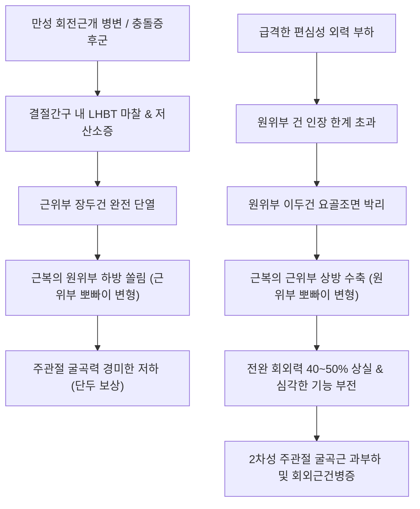

# 🩺 이두근 힘줄 파열 (Biceps Tendon Rupture)

> **상위 분류**: [[근골격계 질환]] > [[상지 질환]] > [[견관절 질환]] / [[주관절 질환]] > [[건병증]]
> **핵심 3줄 요약 (Key Summary)**:
> - 📍 병소 부위 & 해부·병태생리: [[상완이두근]]의 근위부 장두건(Long Head of Biceps Tendon, LHBT) 또는 원위부 건(Distal Biceps Tendon)이 퇴행성 마찰, 회전근개 병변 동반, 혹은 주관절 굴곡 상태에서의 강력한 편심성(Eccentric) 부하로 인해 급성 파열되는 질환.
> - 🚩 전형적 임상 양상: 팔에서 "뚝" 하는 파열음(Pop sound)과 함께 급격한 통증, 근복(Muscle belly)이 한쪽으로 말려 올라가거나 뭉치는 **뽀빠이 징후(Popeye Deformity)**, 전완의 [[회외]](Supination) 및 주관절 [[굴곡]](Flexion) 근력 약화.
> - 🛠️ 핵심 검사 & 치료 전략: 근위부 파열은 보존적 침구·약침·재활로 80~90% 기능 보존 가능하나, 원위부 파열(Hook test 양성)은 회외력 40~50% 상실을 방지하기 위해 2~3주 이내 정형외과적 일차 봉합술(Primary Repair) 응급 전원이 원칙.
> - ⚠️ 응급 의뢰 레드플래그: 주관절 전주와(Antecubital fossa)의 급성 원위부 이두건 완전 파열, 건 견인(Retraction) 및 건막(Lacertus fibrosus) 동반 파열 시 3주 경과 후 근위축 및 비가역적 건 단축 발생하므로 지체 없는 수술 의뢰 필수.

---

## 📌 목차
1. [질환 개요 & 해부학적 병태생리](#1-질환-개요--해부학적-병태생리)
2. [병태생리 메커니즘 & 생체역학적 악순환 네트워크](#2-병태생리-메커니즘--생체역학적-악순환-네트워크)
3. [임상 증상 & 이학적 검사(Physical Exam) 알고리즘](#3-임상-증상--이학적-검사physical-exam-알고리즘)
4. [감별 진단 매트릭스 (Differential Diagnosis)](#4-감별-진단-매트릭스-differential-diagnosis)
5. [한의 통합 치료 프로토콜 (침·약침·추나·한약)](#5-한의-통합-치료-프로토콜-침약침추나한약)
6. [양방 치료 & 병용·의뢰 기준 (Conventional Treatment & Referral)](#6-양방-치료--병용의뢰-기준-conventional-treatment--referral)
7. [재활 운동 & 생활습관 티칭 가이드](#7-재활-운동--생활습관-티칭-가이드)
8. [💡 사용자 진료실 핵심 필기 & 임상 노하우 (Melt-In 잔여 심화 집약)](#8--사용자-진료실-핵심-필기--임상-노하우-melt-in-잔여-심화-집약)
9. [출처 및 학술 참고 문헌 (References)](#9-출처-및-학술-참고-문헌-references)

---

## 1. 질환 개요 & 해부학적 병태생리

### 1.1 개요 및 역학
[[상완이두근]](Biceps brachii) 힘줄 파열은 호발 부위에 따라 크게 **근위부 장두건 파열(Proximal LHBT Rupture)**과 **원위부 건 파열(Distal Biceps Tendon Rupture)**로 명확히 구분된다.
- **근위부 장두 파열 (전체 이두근 파열의 90~95%)**: 주로 50~70대 고령자에서 만성적인 [[회전근개 질환]](특히 [[극상근]], [[견갑하근]] 파열 동반) 및 결절간구(Bicipital groove)의 만성 마찰로 인해 서서히 퇴행된 상태에서 가벼운 일상 활동 중 파열된다. 단두건(Short head)이 오구돌기에 견고히 부착되어 있어 주관절 굴곡력 손실은 10% 미만으로 경미하다.
- **원위부 파열 (전체 파열의 3~10%)**: 주로 30~50대 남성, 운동선수, 육체노동자에서 호발한다. 팔꿈치를 90도 굴곡한 상태에서 무거운 물체를 들다가 갑작스럽게 강한 편심성 신전 부하(Eccentric load)를 받을 때 요골 조면(Radial tuberosity) 부착부에서 건이 완전히 뜯겨 나간다.

![[Biceps_brachii_anatomy.png|450]]
> [그림 1: 상완이두근의 근위부 장두·단두 및 원위부 부착부 해부학적 구조 — Wikimedia Commons]

### 1.2 해부학적 핵심 구조
1. **장두건(Long Head of Biceps Tendon)**: 관절와순 상부(Superior labrum)와 관절상결절에서 기시하여 관절강 내를 주행한 뒤 상완골 결절간구로 진입한다. 횡상완인대와 오구상완인대, 견갑하근 건섬유가 형성하는 활차(Pulley system)의 지지를 받는다.
2. **단두건(Short Head of Biceps Tendon)**: 오구돌기(Coracoid process) 외측에서 오구완근과 함께 총건 형태로 기시하며 파열 빈도가 극히 낮다.
3. **원위부 건(Distal Biceps Tendon)**: 두 근복이 합쳐져 요골 조면(Radial tuberosity)에 정지하며, 일부 섬유는 건막(Lacertus fibrosus)을 형성하여 전완 근막 및 회내근 기시부로 방사된다. 전완의 가장 강력한 **회외근(Supinator)** 역할을 수행한다.

---

## 2. 병태생리 메커니즘 & 생체역학적 악순환 네트워크

### 2.1 파열 발생 기전
- **퇴행성 마모 (근위부)**: 견봉하 충돌 증후군이나 회전근개 파열로 상완골두가 상방 및 전방 전위되면, 결절간구를 지나는 장두건에 지속적인 전단력(Shear stress)과 마찰이 가해진다. 건의 미세혈관 관류가 감소하는 무혈성 구역(Hypovascular zone)에서 건세포 괴사와 점액성 변성이 누적되다가 임계 부하 시 단열된다.
- **급성 편심성 과부하 (원위부)**: 팔꿈치를 굽힌 상태에서 체중 이상의 외력이 팔을 강제로 펴게 할 때, 원위부 이두건에 인장 강도를 초과하는 맹렬한 장력이 걸리며 요골 조면에서 박리(Avulsion)된다.

![[Biceps_brachii_TriggerPoints.jpg|400]]
> [그림 2: 상완이두근의 발통점 및 상완 전면 방사통 양상 — Travell & Simons]

### 2.2 생체역학적 악순환 네트워크

---

## 3. 임상 증상 & 이학적 검사(Physical Exam) 알고리즘

### 3.1 주요 증상 양상
- **파열 순간의 감각**: 팔 위쪽이나 팔꿈치 안쪽에서 "툭" 또는 "뚝" 하는 팝(Pop) 소리가 나며 날카로운 통증 발생.
- **뽀빠이 징후(Popeye Sign)**:
  - **근위부 장두 파열**: 건이 끊어져 상완이두근 근복이 아래쪽(주관절 쪽)으로 쳐지며 공처럼 뭉침.
  - **원위부 건 파열**: 원위 건이 떨어져 근복이 위쪽(어깨/상완 중간)으로 강하게 당겨 올라감.
- **광범위 피하 반상출혈(Ecchymosis)**: 파열 후 24~48시간 이내에 상완 내측부터 주관절, 전완 내측까지 멍과 부종이 광범위하게 퍼짐.
- **근력 저하**: 물건을 들 때보다 문고리를 바깥으로 돌리거나 드라이버를 조이는 전완 [[회외]](Supination) 동작 시 뚜렷한 힘 빠짐 호소.

![[스피드검사_1단계_팔꿈치신전_전완회외_자세세팅.jpg|400]]
> [그림 3: 상완이두근 건 기능 평가를 위한 스피드 검사 세팅 — 자생한방병원 임상술기]

![[스피드검사_2단계_견관절굴곡_하방저항_외력부하.jpg|400]]
> [그림 4: 상완이두근 건 장력 부하 및 근력 평가 — 자생한방병원 임상술기]

![[예가손검사_3단계_회외외회전저항_상완이두근건_탈구및통증평가.jpg|400]]
> [그림 5: 전완 회외 저항을 통한 이두근 장두건 및 횡상완인대 평가 — 자생한방병원 임상술기]

### 3.2 이학적 특수 검사
1. **Hook Test (원위부 파열 진단의 표준, 민감도·특이도 100%에 근접)**:
   - 환자의 팔꿈치를 90도 굴곡하고 전완을 완전히 회외시킨 상태에서, 검사자가 외측에서 집게손가락을 전주와(Antecubital fossa) 외측으로 밀어 넣어 이두건 아래로 손가락을 걸어본다(Hooking).
   - 건이 온전하면 손가락에 팽팽한 삭상 구조물이 단단히 걸리지만, 원위부 건이 파열되면 손가락이 쑥 들어가며 아무것도 걸리지 않는다(양성).
2. **Ludington Test (근위부 장두 파열 평가)**:
   - 환자가 양손을 머리 뒤로 깍지 끼고 상완이두근을 강하게 수축할 때, 양측 이두근 근복의 수축 장력을 촉진한다. 파열된 측은 건의 긴장도가 전혀 느껴지지 않는다.
3. **Biceps Squeeze Test**:
   - 환자의 전완을 가볍게 굴곡·회내한 상태에서 검사자가 상완이두근 근복을 손으로 강하게 압착(Squeeze)한다. 정상인 경우 아킬레스건 압착(심슨 검사)처럼 전완이 반사적으로 회외되지만, 원위 건 완전 파열 시 회외 반응이 소실된다.

---

## 4. 감별 진단 매트릭스 (Differential Diagnosis)

| 감별 질환 | 호발 연령 및 병력 | 뽀빠이 변형 여부 | Hook Test | 회외력 저하율 | 핵심 감별 포인트 |
| :--- | :--- | :--- | :--- | :--- | :--- |
| **근위부 이두건 파열** | 50~70대, 만성 충돌증후군 | **하방 뭉침** (주관절 쪽) | 음성 (정상 건 만져짐) | 10~15% 저하 | 어깨 전방 멍, 경미한 근력 저하, 미용상 고민 |
| **원위부 이두건 파열** | 30~50대, 무거운 물체 급성 부하 | **상방 수축** (어깨 쪽) | **양성 (건 안 걸림)** | **40~50% 심각 저하** | 전주와 결손부 촉지, 3주 내 수술 응급 의뢰 |
| [[이두근건염]] | 전 연령, 투구·오버헤드 과사용 | 없음 | 음성 | 정상 (통증으로 저하) | 결절간구 압통, [[스피드 검사]]·[[예가손 검사]] 양성 |
| [[회전근개 파열]] | 50대 이상, 어깨 외전 곤란 | 없음 | 음성 | 정상 | 팔 외전 유지 불능(Drop arm), 야간통 극심 |
| 전주와 혈종/근파열 | 직달 외상 | 없음 | 음성 | 경미한 저하 | 초음파상 근육 실질 내 혈종, 건 연속성 유지 |

---

## 5. 한의 통합 치료 프로토콜 (침·약침·추나·한약)

근위부 장두건 파열(특히 고령자, 활동량이 적은 환자)은 보존적 치료가 1차 표준이며, 한의 통합 치료를 통해 통증을 신속히 가라앉히고 견관절 및 주관절의 대상성 기능을 극대화한다.

![[어깨탈구_05_술기실사_견관절_도수평가및가동.jpg|400]]
> [그림 6: 견관절 도수 평가 및 관절가동술 — 자생한방병원 임상술기]

![[수부질환_05_수부침치료실사_수지침.jpg|400]]
> [그림 7: 상지 순환 촉진 및 말초 신경 자극을 위한 침치료 실사 — 한의 임상술기]

### 5.1 침구 및 전기자침 치료
- **혈위 선정**: 견우(LI15), 견료(TE14), 비노(LI14), 곡택(PC3), 척택(LU5), 곡지(LI11), 수삼리(LI10).
- **자침 기법**:
  - 급성기 파열 부위 직접 자침은 피하고, 상완이두근 단두(오구돌기 부근)와 상완근, 오구완근, 상완요골근 등 **보상적 협동근(Synergist muscles)**에 0.25×40mm 호침으로 2~4Hz 저주파 전침을 통전하여 근육 단축과 경련을 완화하고 혈종 흡수를 촉진한다.
  - 전주와 혈종 흡수기에는 곡택과 척택 혈위에 사혈 및 부항 요법을 가볍게 병행한다.

### 5.2 약침 치료 (Pharmacopuncture)
- **신바로약침 / 소염약침**: 파열 초기 견관절 결절간구 주변 활액낭염 및 전주와 부종 부위에 1.0~2.0cc를 분할 주입하여 2차성 무균성 염증을 신속 소퇴시킨다.
- **황련해독탕 약침**: 급성 파열 후 48시간 이내 심한 발열감과 혈종 부종이 동반된 경우 적용.
- **자하거(태반) 약침**: 아급성기(2주 이후) 잔여 건 조직의 인장 강도 회복과 만성 연부조직 퇴행 예방을 위해 주 2회 시술.

### 5.3 추나치료 및 관절가동술
- 파열된 장두건의 결손을 보상하기 위해 견갑상완 관절(GH joint)의 전방 불안정성이 유발될 수 있다.
- 견갑골 안정화 기법(Scapular setting), 후방 관절낭 이완 기법, 견봉하 공간 확보를 위한 견관절 하방 활주 기법을 적용한다.
- 주관절 부위는 과도한 저항 운동을 피하고 상완근 및 원회내근의 근막 이완(Myofascial release)을 시행한다.

### 5.4 한약 처방
- **급성 파열기 (어혈 및 종창 제거)**: [[당귀수산]], [[활혈서경탕]] 가감. 조직 손상 부위의 출혈과 부종을 신속히 흡수시키고 극통을 완화한다.
- **회복기 (근건 강화 및 퇴행 보강)**: [[독활기생탕]], [[보중익기탕]] 가미방 (숙지황, 구기자, 우슬, 속단, 골쇄보 등 배합). 힘줄 결손부에 인접한 근막 결합조직의 재생을 유도하고 잔여 근력을 증강한다.

---

## 6. 양방 치료 & 병용·의뢰 기준 (Conventional Treatment & Referral)

### 6.1 보존적 양방 치료
- NSAIDs 처방 및 1~2주간 슬링(Sling)을 이용한 상대적 고정.
- 국소 냉찜질을 통해 초기 48시간 동안 혈종 확대를 억제.

### 6.2 수술적 치료 및 응급 의뢰 기준
- **원위부 이두건 완전 파열**:
  - **무조건적 정형외과 전원 원칙**: 특히 젊은 환자, 육체노동자, 운동선수는 전완 회외력 보존을 위해 **파열 후 2~3주 이내 일차 건 재부착술(Cortical button 및 Suture anchor 고정술)**을 받아야 한다 (PMID 42595082, PMID 42383714).
  - 3주 이상 방치 시 건이 상완 근위부로 단축 및 섬유화되어 자가건/동종건 이식술이 필요해지며 예후가 불량해진다.
- **근위부 장두건 파열의 수술 적응증**:
  - 40세 미만의 젊은 운동선수나 미용상 뽀빠이 변형을 강력히 거부하는 환자.
  - 건고정술(Tenodesis) 또는 건절제술(Tenotomy)을 시행하며, 대개 회전근개 파열 봉합술과 동반 시행된다 (PMID 41067626, PMID 42364225).

---

## 7. 재활 운동 & 생활습관 티칭 가이드

![[어깨탈구_07_재활운동_견관절_가동운동.gif|400]]
> [그림 8: 견관절 및 상지 연부조직 가동성 회복 재활 운동 — 자생한방병원 임상재활]

### 7.1 단계별 재활 프로토콜
1. **1단계 (급성기 1~2주)**:
   - 팔걸이(Sling) 착용 및 무거운 물체 들기 엄격 금지.
   - 손가락 쥐기-펴기(Grip exercise) 및 손목 능동 가동 운동으로 전완 구획 내 정맥 환류 촉진.
2. **2단계 (아급성기 3~4주)**:
   - 진자 운동(Codman exercise) 및 통증이 없는 범위 내에서의 수동적 관절 가동(PROM).
   - 등척성(Isometric) 주관절 굴곡 운동 시작 (통증 유발 없는 30~50% 강도).
3. **3단계 (회복기 5주 이후)**:
   - 밴드(Theraband)를 이용한 전완 회외 및 주관절 굴곡 신장성(Eccentric) 근력 강화 운동.
   - 단두건 및 상완근(Brachialis), 상완요골근(Brachioradialis)을 집중 단련하여 결손된 장두 기능을 대체하도록 유도.

### 7.2 일상생활 티칭
- 근위부 파열 환자에게 "뽀빠이 알통 변형은 영구히 남을 수 있으나, 일상생활 근력은 3~6개월 내에 정상에 가깝게 돌아오므로 안심해도 된다"고 명확히 고지하여 심리적 불안을 해소한다.
- 흡연은 건 재부착 및 결합조직 합성을 심각하게 방해하므로 엄격한 금연 지도.

---

## 8. 💡 사용자 진료실 핵심 필기 & 임상 노하우 (Melt-In 잔여 심화 집약)

### 8.1 진료실 실전 노하우: 근위부 vs 원위부 즉각 판별법
- 환자가 팔에 멍이 시퍼렇게 들고 알통 모양이 이상하다며 뛰어왔을 때, **가장 먼저 할 일은 Hook Test**이다.
- 손가락을 팔꿈치 안쪽(전주와) 힘줄 밑으로 걸어 넣었을 때 팽팽한 줄이 걸리면 99% 근위부 장두 파열이다. 이 경우 환자에게 "수술하지 않고 한의 치료와 재활로 완치할 수 있습니다"라고 안심시키면 된다.
- 반면 손가락이 쑥 들어가고 아무것도 안 걸리면 원위부 파열이다. 이 환자를 붙잡고 침을 놓으며 시간을 끌면 건이 말려 올라가 3주 뒤에는 수술도 어려워진다. **"지금 즉시 정형외과 어깨·팔꿈치 세부전문의를 찾아가 수술을 상담하셔야 합니다"**라고 전원 소견서를 써서 즉시 보내야 한다.

### 8.2 스테로이드 주사 병력 및 플루오로퀴놀론 복용력 확인
- 외상 없이 가볍게 기지개를 켜거나 티셔츠를 입다가 뚝 소리와 함께 파열된 환자들은 문진 시 십중팔구 **어깨 결절간구 부위에 정형외과 뼈주사(트리암시놀론 등 스테로이드)를 2~3회 이상 맞았거나**, 최근 요로감염/호흡기감염으로 **퀴놀론계 항생제(Ciprofloxacin, Levofloxacin)**를 복용한 병력이 있다.
- 건 실질 내 스테로이드 주입은 콜라겐 괴사를 유발하므로, 진료실에서 건초염 환자 치료 시 건 내 직접 침습을 피하고 건초 주변부 치료를 고수해야 하는 강력한 근거이다.

---

## 9. 출처 및 학술 참고 문헌 (References)

1. **Schönweger F et al. (2026)**. Distal biceps tendon repair: immobilization versus early mobilization. A systematic review and meta-analysis. *EFORT Open Rev*. 11(7):849-858. [PMID: 42383714](https://pubmed.ncbi.nlm.nih.gov/42383714/)
   - *[연구 요약]*: 원위부 이두건 파열 수술적 복원술 후 조기 가동군과 고정군의 임상적 예후를 메타분석하여, 조기 가동 프로토콜이 합병증 증가 없이 주관절 가동 범위와 회외 근력 회복 속도를 현저히 개선함을 입증.

2. **Nadeem SM et al. (2026)**. Cortical button and suture anchor fixation for distal biceps tendon repair provide similar clinical outcomes and complication profiles: a systematic review. *J Shoulder Elbow Surg*. :. [PMID: 42595082](https://pubmed.ncbi.nlm.nih.gov/42595082/)
   - *[연구 요약]*: 원위부 이두건 파열 봉합 시 피질골 단추(Cortical button)와 봉합 앵커(Suture anchor) 고정술의 기능적 점수, 재파열률 및 신경 손상 합병증 프로파일을 체계적 문헌고찰로 규명.

3. **Kaya İ et al. (2026)**. Combined subscapularis and supraspinatus tears markedly increase the risk of long head of the biceps tendon pathology. *Acta Orthop Traumatol Turc*. 60(2):. [PMID: 42364225](https://pubmed.ncbi.nlm.nih.gov/42364225/)
   - *[연구 요약]*: 견갑하근과 극상근의 동반 파열이 상완이두근 장두건의 탈구 및 퇴행성 자연 파열 위험도를 유의하게 증가시키는 생체역학적 기전을 밝힘.

4. **Sabelle A et al. (2026)**. Two-year outcomes of non-conservative treatment of the long head of the biceps tendon in the repair of small supraspinatus tears: A multicenter prospective study. *Orthop Traumatol Surg Res*. 112(1):104451. [PMID: 41067626](https://pubmed.ncbi.nlm.nih.gov/41067626/)
   - *[연구 요약]*: 소형 극상근 파열 봉합 시 상완이두근 장두건 병변에 대한 건고정술과 건절제술의 2년 추적 기능적 결과 및 뽀빠이 변형 발생률을 전향적으로 비교 분석.
