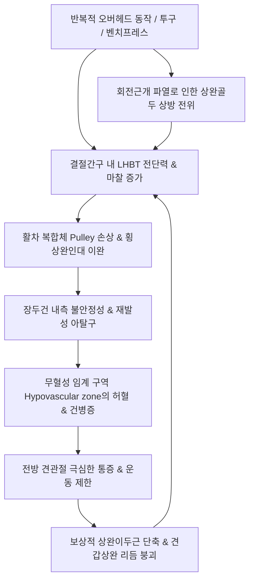

# 이두근건염 (Biceps Tendinopathy)

> **상위 분류**: [[근골격계 질환]] > [[상지 질환]] > [[견관절 질환]] > [[건병증]]
> **핵심 3줄 요약 (Key Summary)**:
> - 📍 병소 부위 & 해부·병태생리: [[상완이두근]] 장두건(Long Head of Biceps Tendon, LHBT)이 관절와순 상부에서 기시하여 상완골 [[결절간구]](Bicipital Groove)를 통과하는 경로에서 기계적 마찰, 전단력, 회전근개 병변 및 충돌에 의해 발생하는 염증 및 만성 퇴행성 건병증.
> - 🚩 전형적 임상 양상 & 3대 징후: 견관절 전방부의 날카로운 국소 압통, 팔을 머리 위로 들어 올리거나 뒤로 젖힐 때 악화, [[스피드 검사]] 및 [[예가손 검사]] 뚜렷한 양성 반응.
> - 🛠️ 핵심 감별 검사 & 한·양방 다각적 치료 전략: 결절간구 건초(Sheath) 타겟 소염/신바로/봉약침(1:30,000) 침윤 및 횡상완인대 침도(Acupotomy) 미세 유착 박리, 견갑상완 리듬 교정 추나 및 신장성(Eccentric) 부하 운동, [[오적산]]·[[대호경간탕]] 처방.
> - ⚠️ 응급 의뢰 레드플래그 & 악화 요인: 건 실질 내 직접 자침/주사 시 건 괴사 및 급성 파열(뽀빠이 변형 Popeye sign) 유발 절대 주의, 급성기 오버헤드 스포츠 및 벤치프레스 엄격 금기.

---

## 📌 목차
1. [질환 개요 & 해부학적 병태생리](#1-질환-개요--해부학적-병태생리)
2. [병태생리 메커니즘 & 생체역학적 악순환 네트워크](#2-병태생리-메커니즘--생체역학적-악순환-네트워크)
3. [임상 증상 & 이학적 검사(Physical Exam) 알고리즘](#3-임상-증상--이학적-검사physical-exam-알고리즘)
4. [감별 진단 매트릭스 (Differential Diagnosis)](#4-감별-진단-매트릭스-differential-diagnosis)
5. [한의 통합 치료 프로토콜 (침·약침·추나·한약)](#5-한의-통합-치료-프로토콜-침약침추나한약)
6. [양방 치료 & 병용·의뢰 기준 (Conventional Treatment & Referral)](#6-양방-치료--병용의뢰-기준-conventional-treatment--referral)
7. [재활 운동 & 생활습관 티칭 가이드](#6-재활-운동--생활습관-티칭-가이드)
8. [💡 사용자 진료실 핵심 필기 & 임상 노하우 (Melt-In 잔여 심화 집약)](#7--사용자-진료실-핵심-필기--임상-노하우-melt-in-잔여-심화-집약)
9. [출처 및 학술 참고 문헌 (References)](#8-출처-및-학술-참고-문헌-references)

---

## 1. 질환 개요 & 해부학적 병태생리

![[Gray327_견관절피막_상완이두근장두건_해부도.png|450]]
> [그림 1: ① 병태생리·영상 — 견관절 피막 내부 상완이두근 장두건의 관절와상결절 부착 및 활주 경로] 견갑골 관절와상결절에서 기원하여 상완골두를 넘어 결절간구로 진입하는 [[상완이두근]] 장두건(LHBT)의 해부학적 구조.

- **개념 정의 및 임상적 의의**:
  - [[이두근건염]](Biceps Tendinitis) 또는 상완이두근 장두건병증(Long Head of Biceps Tendinopathy)은 [[상완이두근]]의 장두건(LHBT)이 관절와순 상부에서 기원하여 상완골두 위를 지나 [[결절간구]](Bicipital Groove)를 통과하는 경로에서 만성적 기계적 부하, 미세 손상, 활액막염 및 퇴행성 변성이 발생하는 질환이다.
  - 상지의 반복적 과사용, 수영·야구 등 오버헤드(Overhead) 스포츠, 중량 부하 작업, 노화에 따른 건 탄성 저하로 인해 전방 견관절 통증과 운동 제한을 초래한다.
- **역학 및 호발 인자**:
  - **호발 연령**: 30~50대의 활동적 연령층 및 60대 이상의 퇴행성 관절 질환군에서 빈발한다.
  - **원발성 vs 속발성**:
    - 원발성 단독 이두근건염은 전체의 5% 미만으로 드물다.
    - **95% 이상은 [[극상근]], [[견갑하근]]을 포함하는 회전근개 질환, 견봉하 충돌 증후군, 상부 관절와순 병변([[SLAP 병변]])과 동반되는 속발성(Secondary) 병태**로 발생한다.
  - **위험 인자**: 상지 거상 반복 작업, 투구 동작, 벤치프레스, 견관절 전방 불안정성, [[대결절]] 및 [[소결절]] 부위 골극 형성.

---

## 2. 병태생리 메커니즘 & 생체역학적 악순환 네트워크

![[Biceps_brachii_TriggerPoints.jpg|480]]
> [그림 2: ② 관련 해부 구조물 — 상완이두근 발통점 및 전방 견관절·주와부 방사통 도해] [[상완이두근]] 근복의 과긴장 및 결절간구 마찰로 인한 전방 어깨와 팔꿈치 주와부 연관통 패턴.

- **해부학적 특수성과 결절간구 활차 기전**:
  - **이두근 활차 (Biceps Pulley)**: 결절간구 입구에서 건의 탈구를 방지하는 복합체로, 오훼상완인대(CHL), 상관절와상완인대(SGHL), 그리고 [[견갑하근]] 상부 섬유 및 [[극상근]] 전방 섬유가 정밀한 건막 띠(Sling)를 형성.
  - **횡상완인대 (Transverse Humeral Ligament)**: [[대결절]]과 [[소결절]] 사이를 덮어 이두근건을 홈 내에 고정.
- **3대 병태생리 메커니즘**:
  1. **마찰 및 전단 응력**: 견관절 외전·외회전 시 장두건이 활차 부위와 강한 전단력을 받으며, 내회전 시 결절간구 내측 벽에 강하게 충돌.
  2. **미세 순환 장애 (Hypovascular Zone)**: 결절간구 입구(기원부 1.5~3cm 원위부)는 혈관 공급이 희박한 임계 구역으로, 만성 허혈에 의해 콜라겐 섬유의 점액성 변성(Tendinosis) 가속화.
  3. **상완골두 상방 전위와의 상호작용**: 회전근개 부전으로 골두가 전상방으로 전위되면 결절간구 입구에서 장두건의 꺾임 각도가 커져 마모와 건초염이 심화됨.

---

## 3. 임상 증상 & 이학적 검사(Physical Exam) 알고리즘

### 주요 임상 증상
- **전방 견관절 통증**: 상완골 결절간구에 국한된 쑤시는 통증으로, 상완 전면 근복 또는 팔꿈치 주와부로 방사.
- **야간통 (Nocturnal Pain)**: 환측 어깨를 바닥에 대고 누울 때 결절간구가 직접 압박되어 수면 장애 유발.
- **운동 유발성 악화**: 팔을 머리 위로 뻗는 동작, 무거운 물건을 들 때, 자동차 뒷좌석으로 손을 뻗을 때, 문손잡이를 강하게 돌리는 전완 회외 동작 시 통증 급증.
- **염발음 및 팝핑 (Clicking & Popping)**: 이두근 활차 파열 시 장두건이 결절간구를 넘나들며 딸깍거리는 소리와 함께 기계적 걸림 감지.

### 단계별 병기 분류 (Habermeyer & Curtis)
- **1기 (급성 건초염)**: 결절간구 활액초의 급성 염증, 부종, 활액 삼출. 휴식 시에도 전방 통증, 가벼운 외력에도 극심한 압통.
- **2기 (만성 건병증)**: 콜라겐 섬유 분절, 건 비후, 점액성 변성, 결절간구 유착. 만성 운동통, 가동범위 제한.
- **3기 (부분 파열/아탈구)**: 건의 세로 갈라짐(Longitudinal split), 활차 파열. 팔을 돌릴 때 기계적 걸림, 근력 저하.
- **4기 (완전 파열)**: 장두건 완전 단열. 뚝 하는 파열감 후 통증 일시 경감, 상완 전면에 특징적 **뽀빠이 변형(Popeye Sign)** 돌출.

### 특이적 이학적 검사 알고리즘
1. **결절간구 국소 압통 (Bicipital Groove Tenderness)**:
   - 견관절을 약 10~15° 내회전시켜 결절간구를 전방 중앙에 노출시킨 후 오훼돌기 외측 1~2cm 부위를 촉진할 때 극심한 압통 확인.
2. **[[스피드 검사]](Speed's Test)**:
   - 주관절 신전, 전완 회외 상태에서 팔을 90° 전방 거상하고 하방 저항을 가할 때 결절간구에 통증 발생 시 양성. (진단 감도 63~90%).
   ![[스피드검사_3단계_결절간구_상완이두근장두건_통증평가.jpg|450]]
   > [그림: 이학적 검사 — 스피드 검사] 견관절 전방 굴곡 저항을 통한 상완이두근 장두건 병변 유발 평가.
3. **[[예가손 검사]](Yergason's Test)**:
   - 팔꿈치 90° 굴곡 상태에서 환자의 전완 저항 회외(Supination) 및 외회전 시 결절간구 통증 및 아탈구 튕김 발생 시 양성.
   ![[예가손검사_3단계_회외외회전저항_상완이두근건_탈구및통증평가.jpg|450]]
   > [그림: 이학적 검사 — 예가손 검사] 전완 저항 회외를 통한 결절간구 내 장두건 통증 및 불안정성 유발 평가.
4. **오브라이언 검사 (O'Brien Test)**:
   - 내회전 굴곡 저항(통증) vs 외회전 굴곡 저항(통증 완화)을 비교하여 [[SLAP 병변]] 동반 여부 감별.

---

## 4. 감별 진단 매트릭스 (Differential Diagnosis)

| 질환명 | 주 통증 부위 | 호발 기전 | 핵심 이학적 검사 | 결정적 감별 포인트 |
| :--- | :--- | :--- | :--- | :--- |
| **[[이두근건염]]** | 상완골 결절간구, 전방 견관절 | 과사용, 오버헤드 충돌 | [[스피드 검사]](+), [[예가손 검사]](+) | 결절간구 명확한 국소 압통, 전완 회외 저항통 |
| **[[회전근개 증후군]] / [[극상근]]건염** | 견봉 외측, 삼각근 부착부 | 퇴행성 건 파열 | Drop arm test(+), Neer/Hawkins(+) | 60~120° 외전 동통호(Painful arc), 야간통 |
| **[[SLAP 병변]]** | 견관절 심부, 후상방 통증 | 투구 선수, 견관절 견인 손상 | O'Brien test(+), Crank test(+) | 던지기 동작 시 심부 클릭킹, 관절와순 파열 소견 |
| **[[견봉하 점액낭염]]** | 견봉 하 외측 | 급성 마찰, 충돌 | Dawbarn 징후(+) | 수동 외전 시 견봉 아래 압통 소실, 삼각근 하부 광범위 부종 |
| **[[유착성 관절낭염]](동결견)** | 견관절 전반 | 특발성, 만성 염증 | 능동/수동 ROM 전방향 제한 | 특히 외회전·후방 내전의 현저한 구축 |
| **[[경추 추간판 탈출증]](C5-C6)** | 목~견갑간부~상완 외측 | 경추 디스크/협착 | [[스펄링 검사]](+), 건반사 저하 | 경추 자세에 따른 방사통, 피부분절 감각 이상 |

---

## 5. 한의 통합 치료 프로토콜 (침·약침·추나·한약)

![[Pasted image 20240124034502.png|450]]
> [그림 3: ③ 치료·시술점 — 상완골 결절간구(Bicipital Groove) 내 상완이두근 장두건초 침도 박리 및 약침 자입 타겟 도해] 결절간구를 통과하는 장두건 주변 활액초(Tendon sheath) 공간을 타겟으로 하는 비절개 침도 박리 및 신바로/봉약침 침윤점.

### 1) 침구 치료 & 침도 요법 (Acupotomy)
- **국소 혈위**: [[견우]](LI15), [[견료]](TE14), 비노(LI14), 거골(LI16), 천천(PC2). 결절간구 압통점(LHBT 주행선)을 따라 15~30° 사자로 건초 주위에 도달하도록 자침. 2Hz 전침 통전.
- **원위 혈위**: [[곡택]](PC3), [[척택]](LU5), [[수삼리]](LI10), [[합곡]](LI4). [[상완이두근]] 근복 내 발통점에 직자하여 근긴장을 즉각 해제.
- **결절간구 침도 박리술 (Acupotomy Stripping)**:
  - 3개월 이상 지속된 만성 유착성 건병증에 0.35×40mm 소평인 침도를 사용하여 상완골을 경도 외회전시킨 상태에서 결절간구 홈과 평행하게 진입, 비후된 횡상완인대 및 건막의 섬유성 유착을 미세 절개·박리하여 건의 활주 공간 회복.

### 2) 약침 및 봉약침 치료 (Pharmacopuncture)
- **소염약침 / 중성어혈약침 (급성기)**: 0.5~1.0cc를 결절간구 건초 내강(Sheath space)에 주입하여 삼출액 흡수와 급성 활막염 억제.
- **봉약침 (Sweet BV, 1:30,000, 만성기)**: 결절간구 주변 및 이두근 활차 외측에 0.1~0.2cc 분할 주입하여 모세혈관 신생 억제 및 강력한 진통·면역 활성화 유도.

### 3) 추나 요법 & 관절 가동술 (Chuna & Manipulation)
- **상완골 후하방 글라이딩 기법**: 상완골두의 전방 전위를 제어하고 후방 관절낭을 이완시켜 전방 결절간구의 충돌 압박을 해소.
- **견갑골 안정화 및 이두근 근막 이완 (MET)**: [[전거근]]과 하부 [[승모근]]을 활성화하여 견갑상완 리듬(Scapulohumeral rhythm) 재건.

### 4) 한약 처방 (Herbal Medicine)
- **급성 종통기 (기혈어체·풍한습)**: [[갈근탕]](葛根湯) 또는 [[오적산]](五積散)에 강황(薑黃), 해동피(海桐皮)를 가미하여 결절간구 수음과 어혈 신속 배출.
- **만성 유착 및 관절통 (간신휴손)**: [[대호경간탕]](大護經肝湯) 또는 [[서경탕]](舒經湯)으로 건·인대 조직의 탄력성 복원.
- **고령 기혈허약형**: [[독활기생탕]](獨活寄生湯) 합 [[쌍화탕]](雙和湯) 가감방.

---

## 6. 양방 치료 & 병용·의뢰 기준 (Conventional Treatment & Referral)

> 🎯 **이 섹션의 목적**: 환자가 **양방약을 이미 복용 중인 경우가 많다.** 한의원 1차 진료에서 양방 치료를 이해하고, 병용 가능·주의·금기를 판단하며, 언제 의뢰할지 결정한다.

* **약물 치료 (Medication)**:
  * 계열별 약물·용량·기간 — 국내 처방 관행 반영.
  * 작용 기전과 한의 치료와의 상호작용.
* **비약물 시술 (Procedures)**:
  * 주사·차단술·물리치료·보조기 등.
* **수술·시술 적응증 (Surgical Indication)**:
  * 언제 수술로 가는가 — 절대·상대 적응증, 수술 후 경과.
* **한의 병용 판단 (Combination Therapy)**:
  * 병용 가능 / 주의 / 금기. 복용 중 환자의 감량 타이밍·반동 현상.
* **양방·전문과 의뢰 기준 (Referral Criteria)**:
  * 응급 의뢰 트리거와 전문과 의뢰 기준(정형외과·신경외과·내과 등).

	(작성 필요)

---

## 7. 재활 운동 & 생활습관 티칭 가이드

### 재활 운동
1. **상완이두근 신장성(Eccentric) 부하 운동**:
   - 팔꿈치를 테이블에 지지하고 덤벨을 쥔 손을 반대 손의 보조로 들어 올린 후, 내릴 때 5초에 걸쳐 천천히 내리는 원심성 운동을 10~15회 3세트 시행 (콜라겐 섬유 재배열 촉진).
2. **후방 관절낭 자가 스트레칭 (Sleeper Stretch)**:
   - 옆으로 누워 환측 어깨를 바닥에 대고 팔을 90° 굴곡한 상태에서 반대 손으로 손목을 아래로 지그시 눌러 내회전 유도.
3. **견갑골 후인 및 하강 운동 (Scapular Retraction)**:
   - 밴드를 당기며 날개뼈를 모으고 아래로 끌어내려 견봉하 공간 확보.

### 생활습관 지도
- **초기 2주간 오버헤드 동작 전면 금지**: 수영(자유형/접영), 테니스 서브, 배드민턴 스매싱, 벤치프레스 등 상완골두를 결절간구 전방으로 밀어내는 동작 중단.
- **무거운 물건 몸에 밀착하여 들기**: 팔을 뻗은 상태에서 무거운 물건을 들어 올리는 행위 엄금.

---

## 8. 💡 사용자 진료실 핵심 필기 & 임상 노하우 (Melt-In 잔여 심화 집약)

> [!TIP] **진료실 임상 관찰 포인트**
> 1. **결절간구 위치 잡기 노하우**:
>    - 환자의 팔을 90° 굴곡시킨 상태에서 전완을 천천히 외회전-내회전시키면, 검사자의 둘째 손가락 끝 아래에서 상완골 두의 결절간구가 좌우로 뚜렷하게 움직이는 골성 랜드마크를 즉각 식별할 수 있다.
> 2. **건 실질 관통 회피 원칙 (Safety Pearls)**:
>    - 약침 및 침도 시술 시 건 실질 내로 직접 강한 압력을 주어 찔러 넣으면 건 섬유의 영구적 파열 위험이 있으므로, 바늘 끝이 뼈 표면(결절간구 바닥)에 닿은 후 살짝 후퇴시켜 활액초(Sheath) 공간에 유효 약액을 확산시키는 수기를 구사한다.
> 3. **뽀빠이 징후(Popeye Sign) 발생 시 환자 안심 티칭**:
>    - 노인 환자에서 장두건이 파열되어 상완 전면에 알통이 불룩 튀어나오는 뽀빠이 변형이 발생했을 때, 환자는 큰 공포를 느끼지만 실제 굴곡 근력 저하는 10~15%에 불과하며 단두(Short head)가 기능을 보상하므로 수술 없이 보존적 한의 치료로 일상 복귀가 가능함을 명확히 설명하여 안심시킨다.

---

## 9. 출처 및 학술 참고 문헌 (References)

1. Curtis W, Price R, Kruger E et al. Long Head of Biceps Tendinopathy: A Scoping Review of Classifications and Proposed Novel Classification System. *Iowa Orthop J*. 2025;45:112-120. [PMID: 40606699](https://pubmed.ncbi.nlm.nih.gov/40606699/)
   - [연구 요약] 상완이두근 장두건병증(LHBT)의 해부학적 구역(관절내, 결절간구내, 결절간구하)별 병태생리 분류 체계를 정립하고, 회전근개 파열 및 전방 충돌과 동반된 기계적 마찰 기전을 규명.
2. McDevitt AW, Young JL, Cleland JA et al. Physical therapy interventions used to treat individuals with biceps tendinopathy: a scoping review. *Braz J Phys Ther*. 2024;28(1):100582. [PMID: 38219522](https://pubmed.ncbi.nlm.nih.gov/38219522/)
   - [연구 요약] 이두근건병증 환자에서 회전근개 안정화 운동, 신장성 부하 운동(Eccentric exercise), 견갑골 운동형상학 교정 및 수기치료의 임상적 유효성과 재활 프로토콜을 체계적으로 고찰.
3. Green B, Roy V, Boulila C et al. Evaluation of clinical and ultrasound-based diagnosis of the long head of the biceps pathologies - a prospective study. *Arch Phys Med Rehabil*. 2026;107(8):1289-1298. [PMID: 42586401](https://pubmed.ncbi.nlm.nih.gov/42586401/)
   - [연구 요약] 이두근 장두건 병변에 대한 이학적 검사(Speed, Yergason)와 고해상도 근골격계 초음파 소견의 진단 일치도 및 동적 아탈구 감별 유용성을 전향적으로 입증.
4. Anil U, Hurley ET, Kingery MT et al. Surgical treatment for long head of the biceps tendinopathy: a network meta-analysis. *J Shoulder Elbow Surg*. 2020;29(6):1289-1296. [PMID: 32037231](https://pubmed.ncbi.nlm.nih.gov/32037231/)
   - [연구 요약] 난치성 이두근 장두건염에서 관절경하 건절술(Tenotomy)과 건고정술(Tenodesis)의 수술 후 통증 완화, 근력 유지, 뽀빠이 변형 발생률을 비교 분석한 네트워크 메타분석 연구.