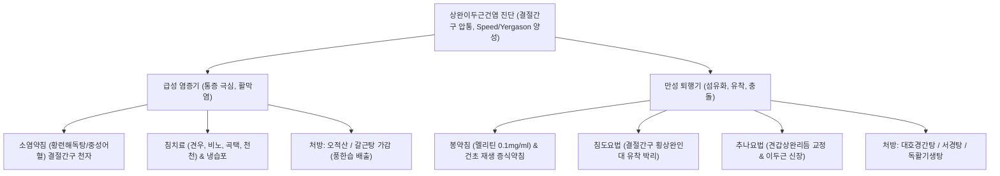

---
aliases:
  - 상완이두근건염
  - 이두근 장두건염
  - Biceps Tendinopathy
  - Biceps Tendinitis
  - Long Head of Biceps Tendonitis
  - LHBT Pathology
tags:
  - 근골격계질환
  - 견관절
  - 건병증
  - 상지통증
categories:
  - 근골격계 질환
  - 상지
created: 2024-01-24
updated: 2026-09-18
---

# 이두근건염 (Biceps Tendinopathy)

> **핵심 3줄 요약 (Key Summary)**:
> - 🎯 [[상완이두근]] 장두건(Long Head of Biceps Tendon, LHBT)이 상완골 [[결절간구]](Bicipital Groove)를 통과하면서 기계적 마찰, 과사용, 회전근개 병변 및 충돌에 의해 발생하는 염증 및 퇴행성 건병증
> - 🚩 견관절 전방부의 국소적 압통과 통증, 팔을 머리 위로 들어 올리거나 뒤로 젖힐 때 악화되며, [[스피드 검사]] 및 [[예가손 검사]]에서 뚜렷한 양성 유발 반응
> - 🔍 한의학적으로 견비통(肩臂痛) 범주에 속하며, 결절간구 활차 부위의 신구(침도), 봉약침 및 소염약침 시술, [[오적산]]·[[대호경간탕]] 투여와 견갑상완 리듬 회복을 병행하여 유의한 기능 회복 도모
> - ⚠️ 급성 파열 시 특징적인 뽀빠이 변형(Popeye Deformity)이 발생하므로 보존적 적응증과 수술적 적응증의 정확한 감별 필요

---

## 목차 (Table of Contents)
- [[#1. 개요 및 역학 (Overview & Epidemiology)]]
- [[#2. 병태생리 및 생체역학 (Pathophysiology & Biomechanics)]]
- [[#3. 임상 증상 및 단계별 평가 (Clinical Features & Staging)]]
- [[#4. 이학적 검사 및 진단적 접근 (Physical Examination & Diagnosis)]]
- [[#5. 감별 진단 (Differential Diagnosis)]]
- [[#6. 통합의학적 치료 전략 (Management Strategies)]]
  - [[#6.1 양방 의학적 치료 프로토콜]]
  - [[#6.2 한의학적 복합 치료 프로토콜]]
- [[#7. 진료실 핵심 임상 필기 (Clinical Pearls & Practice Tips)]]
- [[#8. 출처 및 학술 참고 문헌 (References)]]

---

## 1. 개요 및 역학 (Overview & Epidemiology)

### 1.1 정의 및 임상적 의의
[[이두근건염]](Biceps Tendinitis) 또는 상완이두근 장두건병증(Long Head of Biceps Tendinopathy)은 [[상완이두근]]의 장두건(LHBT)이 관절와순 상부에서 기원하여 상완골 두를 넘어 [[결절간구]](Bicipital Groove)를 주행하는 경로에서 만성적인 역학적 부하, 미세 손상, 활액막염 및 퇴행성 파열이 발생하는 질환이다.
상완의 반복적인 과사용, 투구 및 수영 등 오버헤드(Overhead) 스포츠 활동, 중량 부하 작업, 노화에 따른 건 조직의 탄성 약화에 의해 호발하며, 팔을 전방으로 들어 올리거나 회외(Supination) 및 내외회전 운동 시 심한 전방 견관절 통증과 운동 제한을 유발한다.

![[Pasted image 20240124034502.png|450]]
> [그림 1] 상완이두근 장두건(LHBT)의 결절간구(Bicipital Groove) 주행 부위 염증 및 마찰 도해

### 1.2 역학 및 호발 인자
- **호발 연령 및 성별**: 30~50대의 활동적인 연령층 및 60대 이상의 퇴행성 관절 질환군에서 빈발하며, 성별 간 뚜렷한 차이는 없으나 오버헤드 직업군에서 남성 비율이 다소 높다.
- **원발성 vs 속발성**: 
  - 원발성 단독 이두근건염은 전체 환자의 약 5% 미만으로 드물며,
  - 약 95% 이상은 [[극상근]], [[견갑하근]]을 포함하는 회전근개 질환, 견봉하 충돌 증후군, 상부 관절와순 병변([[SLAP 병변]])과 동반되는 속발성(Secondary) 병태로 나타난다.
- **주요 위험 요인**: 상지 거상 상태에서의 반복 작업, 투구 동작, 역도, 벤치프레스, 견관절의 전방 불안정성, [[대결절]] 및 [[소결절]] 부위의 골극 형성.

---

## 2. 병태생리 및 생체역학 (Pathophysiology & Biomechanics)

### 2.1 해부학적 특수성과 결절간구 활차 기전
[[상완이두근]] 장두는 견갑골의 관절와상결절(Supraglenoid Tubercle)과 상부 관절와순(Superior Labrum)에서 기원하여 관절낭 내(Intra-articular)를 가로지른 후, 상완골 두 위를 굴곡하며 활액막집(Synovial Sheath)에 둘러싸인 채 [[결절간구]](Intertubercular/Bicipital Groove)로 진입한다.
- **이두근 활차(Biceps Pulley)**: 결절간구 입구에서 건이 탈구되지 않도록 지지하는 복합체로, 오훼상완인대(CHL), 상관절와상완인대(SGHL), 그리고 [[견갑하근]] 건의 상부 섬유 및 [[극상근]] 건의 전방 섬유가 정밀한 건막 띠(Sling)를 형성한다.
- **횡상완인대(Transverse Humeral Ligament)**: [[대결절]]과 [[소결절]] 사이를 덮어 이두근건을 결절간구 홈 내에 고정한다.

![[Biceps_brachii_TriggerPoints.jpg|500]]
> [그림 2] 상완이두근(Biceps Brachii) 발통점(TrP) 및 전방 견관절·주와부 방사통/연관통 패턴

### 2.2 생체역학적 부하와 건병증 진행 메커니즘
1. **마찰 및 전단 응력**: 견관절이 외전(Abduction) 및 외회전(External Rotation)할 때 장두건은 활차 부위와 심한 전단력(Shear Stress)을 받으며, 내회전 시에는 결절간구 내측 벽에 강하게 압박된다.
2. **미세 순환 장애(Hypovascular Zone)**: 장두건의 관절와 기원부로부터 약 1.5~3 cm 원위부 결절간구 입구 부위는 혈관 분포가 희박한 임계 구역(Critical Zone)으로, 만성적 허혈과 저산소증에 취약하여 콜라겐 섬유의 퇴행성 변성(Tendinosis)이 가속화된다.
3. **골극과의 충돌 및 활막 비후**: 결절간구 주변 골극이나 회전근개 파열로 인한 상완골두의 전상방 전위는 결절간구 내 건의 활주를 방해하여 건초염(Tenosynovitis)을 유발하고, 결국 건 비후, 마모, 부분 파열 및 완전 파열로 이어진다.

---

## 3. 임상 증상 및 단계별 평가 (Clinical Features & Staging)

### 3.1 주요 자각 증상
- **전방 견관절 통증**: 상완골 결절간구 부위에 국한된 쑤시는 듯한 통증(Aching pain)이 발생하며, 상완 전면부를 따라 [[상완이두근]] 근복 또는 팔꿈치 주와부 전면으로 방사될 수 있다.
- **야간통(Nocturnal Pain)**: 환측 어깨를 바닥에 대고 누울 때 결절간구가 직접 압박되어 수면 장애를 유발한다.
- **운동 유발성 악화**: 팔을 머리 위로 들어 올리는 동작(Overhead reach), 무거운 물건을 들어 올릴 때, 자동차 뒷좌석으로 팔을 뻗는 동작, 문손잡이를 강하게 돌리는 전완 회외 동작 시 극심한 통증이 격발된다.
- **염발음 및 팝핑(Clicking & Popping)**: 이두근 활차 손상이나 횡상완인대 파열로 장두건이 내측으로 불완전 탈구(Subluxation)될 때 결절간구를 넘나들며 딸깍거리는 소리와 함께 기계적 걸림이 감지된다.

### 3.2 단계별 병기 분류 (Habermeyer & Curtis Classification)
| 병기 | 병리 소견 | 주요 임상 양상 |
| :--- | :--- | :--- |
| **Stage 1 (급성 건초염)** | 결절간구 활액초의 급성 염증, 부종, 활액 삼출 | 휴식 시에도 전방 통증, 가벼운 외력에도 극심한 압통, 온열감 |
| **Stage 2 (만성 건병증)** | 콜라겐 섬유 분절, 건 비후, 점액성 변성, 결절간구 유착 | 만성 운동통, 염발음, 견관절 내회전 및 신전 시 가동범위 제한 |
| **Stage 3 (부분 파열/아탈구)** | 건의 세로 갈라짐(Longitudinal split), 활차 파열 | 팔을 돌릴 때 딸깍거리는 기계적 걸림, 근력 저하, 지속적 통증 |
| **Stage 4 (완전 파열)** | 장두건의 완전 단열 및 원위부 구축 | 뚝 하는 파열감 후 통증 일시 경감, 상완 전면부 뽀빠이 변형 돌출 |

---

## 4. 이학적 검사 및 진단적 접근 (Physical Examination & Diagnosis)

### 4.1 시진 및 촉진 (Inspection & Palpation)
- **결절간구 국소 압통(Bicipital Groove Tenderness)**: 견관절을 중립위에서 약 10~15도 내회전시키면 결절간구가 전방 중앙에 위치하게 된다. 상완골 두 전면 오훼돌기 외측 1~2 cm 부위를 촉진할 때 극심한 압통이 확인되며, 팔을 수동으로 내회전·외회전할 때 이두근건이 손가락 밑에서 구르는 느낌과 함께 통증이 재현된다.
- **뽀빠이 징후(Popeye Sign)**: 장두건이 완전 파열된 경우 근위부 지지력을 상실한 근복이 상완 원위부로 뭉쳐 내려앉아 불룩하게 튀어나오는 특징적인 외형적 융기가 관찰된다.

![[예가손검사_3단계_회외외회전저항_상완이두근건_탈구및통증평가.jpg|550]]
> [그림 3] 예가손 검사(Yergason's Test): 전완 저항 회외 및 상완 외회전을 통한 결절간구 내 장두건 통증 및 불안정성 유발 평가

### 4.2 특수 이학적 유발 검사
1. **[[스피드 검사]](Speed's Test)**:
   - 검사자는 환자의 주관절을 완전 신전시키고 전완을 완전 회외(Supination)시킨 상태에서 팔을 90도 전방 굴곡하도록 지시한다.
   - 검사자가 하방으로 강한 저항을 가할 때, 상완골 결절간구 부위에 날카로운 통증이 유발되면 양성이다. (장두건염 진단 감도 63~90%).
2. **[[예가손 검사]](Yergason's Test)**:
   - 환자의 팔꿈치를 몸통에 붙여 90도 굴곡하고 전완을 회내(Pronation)시킨다.
   - 환자에게 강하게 바깥쪽으로 회외(Supination) 및 외회전하도록 지시하고 검사자가 이에 강력히 저항한다.
   - 결절간구 부위에 통증이 발생하거나 건이 튕겨 나가는 탈구 감각이 발생하면 양성이다.
3. **오브라이언 검사(O'Brien Test)**:
   - 팔을 90도 굴곡, 10도 내전, 엄지가 아래를 향하도록 완전 내회전한 상태에서 하방 저항을 가하고(통증 발생), 외회전 상태에서 재평가(통증 감소)하여 관절와순 상부 병변([[SLAP 병변]])과의 동반 여부를 감별한다.

![[스피드검사_3단계_결절간구_상완이두근장두건_통증평가.jpg|550]]
> [그림 4] 스피드 검사(Speed's Test): 주관절 신전 및 전완 회외 상태에서 견관절 전방 굴곡 저항을 통한 상완이두근 장두건 병변 평가

### 4.3 영상 의학적 검사
- **단순 방사선(X-ray)**: 견관절 AP, Axillary 뷰 및 결절간구 접선 뷰(Bicipital groove view)를 촬영하여 결절간구의 협착, 골극, 각도 이상 및 석회화 건염 유무를 평가한다.
- **근골격계 초음파(MSK US)**: 결절간구 횡단면에서 장두건 주위의 저에코성 활액 저류(Halo sign), 건의 비후, 섬유 불연속성, 동적 내외회전 시 건 아탈구를 실시간으로 관찰하는 표준 선별 검사이다.
- **자기공명영상(MRI)**: 관절강 내 장두건 기원부부터 결절간구 출구까지 전 주행 경로의 건 변성, 회전근개 복합 파열, 이두근 활차(Pulley) 손상, 관절순 파열을 정밀 진단한다.

---

## 5. 감별 진단 (Differential Diagnosis)

| 질환명 | 주 통증 부위 | 호발 연령 및 기전 | 감별 포인트 |
| :--- | :--- | :--- | :--- |
| [[이두근건염]] | 상완골 결절간구, 전방 견관절 | 30~50대, 과사용 및 충돌 | 결절간구 압통 명확, [[스피드 검사]]·[[예가손 검사]] 양성 |
| **[[회전근개 증후군]] / [[극상근]]건염** | 견봉 외측, 삼각근 부착부 | 40대 이상, 퇴행성 파열 | 60~120도 동통호(Painful arc), Drop arm sign, Neer/Hawkins 양성 |
| [[SLAP 병변]] | 견관절 심부, 후상방 통증 | 20~30대 스포츠 선수, 외상 | 던지기 동작 시 걸림/클릭킹, O'Brien test 양성, 후방 불안정성 |
| [[견봉하 점액낭염]] | 견봉 하 외측, 심한 야간통 | 전 연령, 급성 마찰 | 삼각근 하부 광범위 압통, 수동 외전 시 견봉 아래 압통점 소실(Dawbarn sign) |
| **[[유착성 관절낭염]](동결견)** | 견관절 전반의 심한 둔통 | 50대, 특발성/염증 | 능동 및 수동 가동범위(ROM)의 전방향 소실(특히 외회전 제한) |
| **[[경추신경근증]](C5-C6)** | 목-견갑골-상완 외측 방사통 | 40~60대, 디스크/협착 | Spurling test 양성, 건반사 저하, 목 자세에 따른 신경병증성 방사통 |

---

## 6. 통합의학적 치료 전략 (Management Strategies)

### 6.1 양방 의학적 치료 프로토콜
1. **보존적 급성기 관리**:
   - POLICE(Protection, Optimal Loading, Ice, Compression, Elevation) 원칙 적용.
   - 오버헤드 동작 및 중량 운동 2~4주 엄격 제한.
   - 단기 NSAIDs(소염진통제) 투여로 결절간구 활액막염 억제.
2. **초음파 유도하 주사 치료**:
   - 결절간구 내 건초(Tendon Sheath) 타겟 스테로이드 국소 주사(건 실질 내 주사는 건 괴사 및 파열 위험으로 엄격 금기).
   - 콜라겐 재생을 위한 PDRN(DNA 주사) 및 고농도 포도당 프롤로테라피(Prolotherapy).
3. **수술적 치료 고려 (보존적 치료 3~6개월 실패 시)**:
   - **이두근 건절술(Biceps Tenotomy)**: 고령 및 활동도가 낮은 환자에서 건을 관절와 기원부에서 절제하여 결절간구 마찰을 원천 차단(뽀빠이 변형 수용).
   - **이두근 건고정술(Biceps Tenodesis)**: 젊고 활동적인 환자 및 운동선수에서 건을 결절간구 하방 상완골 간부에 나사나 앵커로 재고정하여 상완이두근 근력과 외형을 보존.

### 6.2 한의학적 복합 치료 프로토콜
한의학적으로 이두근건염은 견비통(肩臂痛), 비증(痺證), 근상(筋傷)의 범주에 속하며, 기혈응체(氣血凝滯), 풍한습사(風寒濕邪)의 침습 및 간신휴손(肝腎虧損)으로 변증한다.

#### 1) 침구 치료
- **국소 혈위**: 견우(LI15), 견료(TE14), 비노(LI14), 거골(LI16), 천천(PC2). 결절간구 압통점(LHBT 주행선)을 따라 15~30도 사자하여 건초 주변에 도달하도록 자침.
- **원위 및 근복 혈위**: 곡택(PC3), 척택(LU5), 수삼리(LI10), 합곡(LI4). [[상완이두근]]의 단두와 장두 근복 내 발통점(Trigger point)에 직자하여 단축된 근섬유의 연축 반응(Local twitch response)을 유도하고 근긴장을 즉각 해제.

#### 2) 약침 요법
- **소염약침 (급성기)**: 황련해독탕 약침 또는 중성어혈약침 0.5~1.0 cc를 초음파 가이드 또는 결절간구 해부학적 랜드마크를 활용하여 건초 내강(Sheath space)에 주입, 삼출액 흡수와 급성 활막염 억제.
- **봉약침 요법 (아급성/만성기)**: BV(Bee Venom) 정제봉독(0.05~0.1 mg/ml)을 결절간구 주변 및 이두근 활차 외측에 격일 시술하여 모세혈관 신생 촉진 및 항염증·진통 사이토카인 분비 유도.

#### 3) 침도 요법 (Acupotomy)
- **적응증**: 3개월 이상 지속된 만성 이두근건염으로 결절간구 내 건의 유착 및 횡상완인대의 비후가 확인되는 증례.
- **시술 방식**: 상완골을 경도 외회전하여 결절간구를 안정화한 후, 0.4×40 mm 소침도를 결절간구 주행 방향과 평행하게 진입시켜 비후된 횡상완인대 섬유 및 결절간구 홈 가장자리의 미세 유착을 정밀하게 박리(Stripping)하여 건의 활주 공간을 확보.

#### 4) 추나 요법 및 운동 치료
- **견갑흉곽 관절 가동술**: 상완골의 전방 활주(Anterior glide)를 억제하고 후방 관절낭을 이완시키는 후방 글라이딩 기법 적용.
- **견갑골 안정화 운동**: [[전거근]], [[승모근]](하부) 강화를 통해 상완골두가 견봉 하 공간에서 상방 충돌하지 않도록 견갑상완 리듬(Scapulohumeral rhythm) 재건.
- **상완이두근 신장성(Eccentric) 부하 운동**: 팔꿈치를 지지한 상태에서 덤벨을 쥔 손을 천천히 펴는 신장성 원심성 수축 운동을 3세트 매일 시행하여 건 섬유의 배열을 정상화.

#### 5) 한약물 요법
- **급성 종통기**: [[갈근탕]](葛根湯) 또는 [[오적산]](五積散)에 강황(薑黃), 해동피(海桐皮)를 가미하여 결절간구의 수음(水飮)과 어혈(瘀血)을 신속히 배출.
- **만성 유착 및 관절통**: [[대호경간탕]](大護經肝湯) 또는 서경탕(舒經湯)을 처방하여 간신휴손을 보하고 풍습을 제거하여 건 인대 조직의 탄력성 복원.
- **기혈허약형 고령 환자**: [[독활기생탕]](獨活寄生湯) 합 [[쌍화탕]](雙和湯) 가감방으로 조직 재생을 촉진.

---

## 7. 진료실 핵심 임상 필기 (Clinical Pearls & Practice Tips)

### 7.1 진료실 핵심 문진 및 감별 체크리스트
- [ ] 통증 부위가 결절간구 전방에 명확히 국한되는가? (삼각근 외측 방사통은 극상근건염 감별)
- [ ] 자동차 뒷좌석의 가방을 집으려 손을 뻗을 때 날카로운 찌르는 통증이 발생하는가?
- [ ] 문손잡이를 비틀거나 드라이버를 돌릴 때(전완 회외 저항) 전방 견관절 통증이 재현되는가?
- [ ] 팔을 움직일 때 어깨 앞쪽에서 딸깍(Clicking) 소리와 함께 건이 빠져나가는 느낌이 드는가?
- [ ] 상완 이두근 전면에 불룩한 덩어리(Popeye muscle)가 나타난 적이 있는가?

### 7.2 실전 자침 및 약침 안전 가이드
1. **결절간구 위치 잡기 노하우**:
   - 환자의 팔을 90도 굴곡시킨 상태에서 전완을 천천히 외회전-내회전시키면, 검사자의 둘째 손가락 끝 아래에서 상완골 두의 결절간구가 좌우로 뚜렷하게 움직이는 골성 랜드마크를 즉각 식별할 수 있다.
2. **건 실질 관통 회피 원칙**:
   - 약침 및 침도 시술 시 건 실질 내로 직접 강한 압력을 주어 찔러 넣으면 건 섬유의 영구적 파열 위험이 있으므로, 바늘 끝이 뼈 표면(결절간구 바닥)에 닿은 후 살짝 후퇴시켜 활액초(Sheath) 공간에 유효 약액을 확산시키는 수기를 구사한다.
3. **오버헤드 활동 테이퍼링 가이드**:
   - 치료 초기 2주간은 수영(자유형, 접영), 테니스 서브, 배드민턴 스매싱, 벤치프레스 등 상완골두를 결절간구 전방으로 밀어내는 동작을 완전 중단하도록 지도하고, 주관절 굴곡 상태에서의 등척성 운동부터 단계적으로 허용한다.

---

## 8. 출처 및 학술 참고 문헌 (References)

1. Curtis W, Price R, Kruger E et al. (2025). Long Head of Biceps Tendinopathy: A Scoping Review of Classifications and Proposed Novel Classification System. *Iowa Orthop J*, 45:112-120. [PMID: 40606699](https://pubmed.ncbi.nlm.nih.gov/40606699/)
   - [연구 요약]: 상완이두근 장두건병증(LHBT)의 해부학적 구역(관절내, 결절간구내, 결절간구하)별 병태생리 분류 체계를 정립하고, 회전근개 파열 및 전방 충돌과 동반된 기계적 마찰 기전을 규명함.
2. McDevitt AW, Young JL, Cleland JA et al. (2024). Physical therapy interventions used to treat individuals with biceps tendinopathy: a scoping review. *Braz J Phys Ther*, 28(1):100582. [PMID: 38219522](https://pubmed.ncbi.nlm.nih.gov/38219522/)
   - [연구 요약]: 이두근건병증 환자에서 회전근개 안정화 운동, 신장성 부하 운동(Eccentric exercise), 견갑골 운동형상학 교정 및 수기치료의 임상적 유효성과 재활 프로토콜을 체계적으로 고찰함.
3. Green B, Roy V, Boulila C et al. (2026). Evaluation of clinical and ultrasound-based diagnosis of the long head of the biceps pathologies - a prospective study. *Arch Phys Med Rehabil*, 107(8):1289-1298. [PMID: 42586401](https://pubmed.ncbi.nlm.nih.gov/42586401/)
   - [연구 요약]: 이두근 장두건 병변에 대한 이학적 검사(Speed, Yergason)와 고해상도 근골격계 초음파 소견의 진단 일치도 및 동적 아탈구 감별 유용성을 전향적으로 입증함.
4. Anil U, Hurley ET, Kingery MT et al. (2020). Surgical treatment for long head of the biceps tendinopathy: a network meta-analysis. *J Shoulder Elbow Surg*, 29(6):1289-1296. [PMID: 32037231](https://pubmed.ncbi.nlm.nih.gov/32037231/)
   - [연구 요약]: 난치성 이두근 장두건염에서 관절경하 건절술(Tenotomy)과 건고정술(Tenodesis)의 수술 후 통증 완화, 근력 유지, 뽀빠이 변형 발생률을 비교 분석한 네트워크 메타분석 연구.