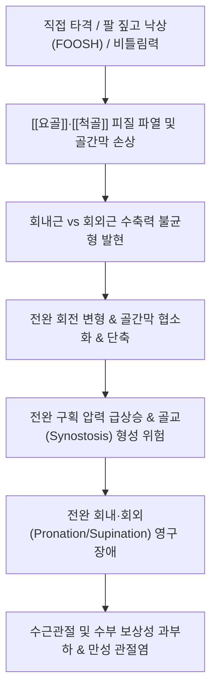

# 🩺 [[전완 중간 골절]] (전완 골간 골절 / Forearm Shaft Fracture / 前臂骨折, S52.3 / S52.4)

> **핵심 3줄 요약 (Key Summary)**:
> - 📍 병소 부위 & 해부·병태생리: 전완부의 두 평행 장골인 [[요골]]과 [[척골]]의 골간부(diaphysis) 및 골간막(interosseous membrane). 양골 동시 골절 외에도 척골 골절+요골두 탈구의 [[몬테지아 골절]](Monteggia), 요골 골절+원위요척관절(DRUJ) 탈구의 [[갈레아치 골절]](Galeazzi) 등 회전 복합체 파열이 핵심 병태.
> - 🚩 전형적 임상 양상 & 3대 징후: 전완부 급성 동통, 부종, 각형성 변형(gross deformity), 회내·회외(pronation/supination) 운동의 완전 소실, 전완 구획증후군 발생 시 극심한 수동 신전통 및 손가락 감각 마비.
> - 🛠️ 핵심 감별 검사 & 한·양방 다각적 치료 전략: 주관절과 수근관절을 모두 포함한 전완 AP/Lateral X-ray. 성인은 전완 회전 기능 보존을 위해 대부분 관혈적 정복 및 금속판 내고정술(ORIF) 시행, 소아는 도수정복 후 장상지 석고 고정. 유합기 어혈 흡수 및 골형성 촉진을 위한 [[당귀수산]], [[자연동]](산골) 투약, 고정 해제 후 회내·회외 관절가동추나 및 침구 치료.
> - ⚠️ 응급 의뢰 레드플래그: 전완 구획증후군(손가락 수동 신전 시 극심한 통증, 긴장성 팽만, 무맥, 창백), 개방성 골절(골편 돌출), 후골간신경(PIN) 또는 정중신경/전골간신경(AIN) 급성 마비(OK 사인 불능), 불유합 및 골교(synostosis) 형성.

---

## 📌 목차
1. [질환 개요 & 해부학적 병태생리](#1-질환-개요--해부학적-병태생리)
2. [병태생리 메커니즘 & 생체역학적 악순환 네트워크](#2-병태생리-메커니즘--생체역학적-악순환-네트워크)
3. [임상 증상 & 이학적 검사(Physical Exam) 알고리즘](#3-임상-증상--이학적-검사physical-exam-알고리즘)
4. [감별 진단 매트릭스 (Differential Diagnosis)](#4-감별-진단-매트릭스-differential-diagnosis)
5. [한의 통합 치료 프로토콜 (침·약침·추나·한약)](#5-한의-통합-치료-프로토콜-침약침추나한약)
6. [양방 치료 & 병용·의뢰 기준 (Conventional Treatment & Referral)](#6-양방-치료--병용의뢰-기준-conventional-treatment--referral)
7. [재활 운동 & 생활습관 티칭 가이드](#7-재활-운동--생활습관-티칭-가이드)
8. [💡 사용자 진료실 핵심 필기 & 임상 노하우 (Melt-In 잔여 심화 집약)](#8--사용자-진료실-핵심-필기--임상-노하우-melt-in-잔여-심화-집약)
9. [출처 및 학술 참고 문헌 (References)](#9-출처-및-학술-참고-문헌-references)

---

## 1. 질환 개요 & 해부학적 병태생리

![[전완중간골절_01_병태도해_전완골골절_도해.png|450]]
> [그림 1: ① 전완부 요골 및 척골 골절의 해부학적 손상 병태 도해 — Smart-Servier Medical Art (CC BY 3.0)]

![[전완중간골절_01_영상의학_전완양골골절_Xray.jpg|320]]
> [그림 2: ② 성인 전완부 양골(요골 및 척골 골간부) 전위 골절 단순 방사선 AP 소견 — Wikimedia Commons (CC BY-SA 3.0)]

![[전완중간골절_01_영상의학_몬테지아골절_Bado분류.jpg|360]]
> [그림 3: ③ 척골 근위부 골절과 요골두 탈구가 동반된 몬테지아(Monteggia) 골절의 Bado 분류 도해 — Wikimedia Commons (CC BY-SA 4.0)]

![[전완중간골절_01_영상의학_갈레아치골절_Xray.jpg|360]]
> [그림 4: ④ 요골 원위 1/3 골절과 원위요척관절(DRUJ) 탈구가 동반된 갈레아치(Galeazzi) 골절 X-ray — Wikimedia Commons (CC BY-SA 4.0)]

* **질환 정의 및 분류**:
  * 전완 중간 골절(전완 골간 골절, Forearm shaft fracture)은 [[요골]](Radius)과 [[척골]](Ulna)의 간부(골간부)에 외력이 가해져 골피질의 연속성이 파괴된 상태를 말합니다.
  * 전완은 단일 뼈가 아닌 요골과 척골이 골간막(IOM)과 근위/원위 요척관절(PRUJ, DRUJ)로 결합된 '하나의 관절 환(Ring)' 구조를 형성하므로, 한 뼈가 부러지거나 전위되면 다른 뼈의 골절이나 관절 탈구가 필연적으로 동반됩니다:
    1. **전완 양골 골절 (Both-bone forearm fracture)**: 요골과 척골 골간부가 동시에 골절된 형태로 성인에서 호발.
    2. **단독 척골 골절 (Nightstick fracture)**: 둔기나 몽둥이를 팔로 막을 때 직접 타격으로 척골 간부만 부러지는 형태.
    3. **몬테지아 골절 (Monteggia fracture-dislocation)**: 척골 근위 1/3 골절 + 근위 요골두(radial head) 탈구. Bado 분류(Type I~IV)로 세분.
    4. **갈레아치 골절 (Galeazzi fracture-dislocation)**: 요골 원위 1/3 골절 + 원위요척관절(DRUJ) 인대 파열 및 척골두 탈구.
* **관련 해부학적 구조물**:
  * **골격 및 관절**: [[요골]], [[척골]], 근위요척관절(PRUJ), 원위요척관절(DRUJ).
  * **근육 및 회전력 생성군**:
    * 회내근군: [[원회내근]](pronator teres, 요골 중간 외측 부착), [[방형회내근]](pronator quadratus, 전완 원위 전면 부착).
    * 회외근군: [[회외근]](supinator), [[상완이두근]](biceps brachii, 요골 조면 부착).
    * 골절 부위가 원회내근 부착부 근위부인지 원위부인지에 따라 골편의 회전 전위 방향이 완전히 달라집니다.
  * **신경 및 혈관**:
    * **정중신경 및 전골간신경(AIN)**: 전완 심부 굴근군 사이를 주행, 무지/示지 원위지절 굴곡 담당.
    * **요골신경 심지(후골간신경, PIN)**: 회외근(Frohse 아케이드)을 통과하며 몬테지아 골절 시 마비 빈발.
    * **척골신경 및 혈관**: 척측수근굴근 하방을 주행.

---

## 2. 병태생리 메커니즘 & 생체역학적 악순환 네트워크

![[전완중간골절_02_해부도해_골간막_5대인대.png|320]]
> [그림 5: ⑤ 요골과 척골을 단단히 결합하는 전완 골간막(Interosseous Membrane)의 5대 인대 구조 해부도 — Wikimedia Commons (CC BY-SA 4.0)]

### 1) 회내근-회외근 힘의 불균형에 의한 골편 전위
* **원회내근 부착부 상부 골절 (근위 1/3 골절)**:
  * 근위 요골 골편은 이두근과 회외근의 강력한 장력으로 인해 **완전 회외(supination) 및 굴곡**됩니다. 반면 원위 요골 골편은 원회내근과 방형회내근에 의해 **회내(pronation)**되어 양 골편 간 심한 회전 불일치가 발생합니다.
* **원회내근 부착부 하부 골절 (중간 1/3 골절)**:
  * 근위 요골 골편은 회외근과 원회내근이 길항하여 **중립위(neutral position)**를 유지하나, 원위 골편은 방형회내근에 의해 회내되고 상완요골근에 의해 근위부로 단축 전위됩니다.
* **골간막(IOM) 협소화와 회전 장애**:
  * 요골과 척골 사이 골간격(interosseous space)이 유지되지 않고 좁아진 채 유합되면 요골이 척골 주위를 회전하는 축(pivot)이 상실되어 회내·회외 운동이 영구적으로 50% 이상 제한됩니다.

---

## 3. 임상 증상 & 이학적 검사(Physical Exam) 알고리즘

### 1) 전형적 주소증 및 신경혈관 진찰
* **전완부 극통 및 각형성 변형**: 전완 중앙이 꺾이거나 부풀어 오른 S자형 변형이 육안 관찰되며 손을 전혀 쓸 수 없습니다.
* **전완 구획증후군 (Compartment Syndrome) 조기 포착 5P 징후**:
  * **Pain out of proportion & Pain on passive stretch**: 손가락을 수동으로 신전시킬 때 전완 심부에서 찢어지는 듯한 극심한 통증 발생 (가장 민감하고 중요한 조기 징후!).
  * **Paresthesia**: 정중신경/척골신경 영역의 저림 및 감각 저하.
  * **Pallor, Pulselessness, Paralysis**: 진행된 후기 허혈 징후(비가역적 근괴사 및 Volkmann 허혈성 구축 임박).
* **신경 기능 평가**:
  * **전골간신경(AIN)**: 엄지와 검지 끝을 맞대는 'OK 사인' 수행 (수지굴근 마비 시 엄지와 검지가 평평하게 맞닿는 Pinch sign 이상 소견).
  * **후골간신경(PIN)**: 손목 굴곡 상태에서 엄지 및 수지 중수수지관절(MCP) 능동 신전 여부 확인.

---

## 4. 감별 진단 매트릭스 (Differential Diagnosis)

| 감별 질환 | 호발 손상 기전 | 핵심 병소 및 변형 양상 | 방사선 및 검사 특징 |
| :--- | :--- | :--- | :--- |
| **[[전완 중간 골절]]** | 직접 타격 / 고에너지 낙상 | 전완부 중앙 각형성, 양골 골간부 전위 | 전완 AP/Lat상 요골·척골 간부 골절선 |
| **[[몬테지아 골절]]** | 주관절 신전 및 전완 과회내 낙상 | 척골 근위부 골절 + 주관절 부종 | X-ray상 요골두-상완골 소두 선(St课堂 line) 이탈 |
| **[[갈레아치 골절]]** | 수근관절 배굴 및 전완 회내 낙상 | 요골 원위부 각형성 + 손목 척골두 돌출 | X-ray상 요골 원위 골절 + DRUJ 관절강 확장(>5mm) |
| **콜레스 골절 ([[손목 골절]])** | 손을 짚고 넘어짐(고령 다발) | 원위 요골 골절, 포크 변형(Dinner-fork) | 관절면 근접(원위 2~3cm 이내) 골절, 배측 전위 |

---

## 5. 한의 통합 치료 프로토콜 (침·약침·추나·한약)

![[전완중간골절_05_정골술기_전완부_부목고정.png|420]]
> [그림 6: ⑥ 전완부 골절의 초기 정형외과적·정골적 정복 및 설탕 집게형(Sugar-tong) 부목 고정 — Wikimedia Commons (CC BY-SA 4.0)]

* **급성기 부목 고정 원칙**: 성인의 완전 전위 양골 골절은 수술이 원칙이나, 소아 불완전 골절(Greenstick)이나 비전위 골절은 주관절 90도 굴곡 상태에서 전완 회전 전위를 막는 Sugar-tong 부목을 적용합니다.
* **침구 및 전침 치료**:
  * 부종 완화 및 신경 포착 해소: [[곡지]](LI11), [[수삼리]](LI10), [[외관]](TE5), [[지구]](TE6), [[척택]](LU5), [[내관]](PC6), [[합곡]](LI4).
  * 후골간신경(PIN) 손상 시: [[곡지]]-수삼리 및 외관-합곡에 2Hz 저주파 전침을 적용하여 신근군 근위축을 방지합니다.
* **약침 치료**: 황련해독탕 약침을 전완 굴근/신근 구획 건간막에 천주하여 국소 구획 부종과 염증을 경감시키고, 아급성기에는 자하거 약침을 투여하여 골막 재생을 돕습니다.
* **한약 치료**:
  * 1~2주: [[당귀수산]](當歸鬚散) 합 [[오령산]](五苓散) (전완부 심부 혈종 흡수 및 구획내압 강하).
  * 3~6주: 접골단(接骨丹) 가 [[자연동]](산골, Pyritum) 1.5g (골간부 피질골 가골 형성 및 가교 촉진).
  * 6주 이후: [[독활기생탕]](獨活寄生湯) (골간막 섬유화 유착 방지 및 전완 회전 관절기능 회복).

---

## 6. 양방 치료 & 병용·의뢰 기준 (Conventional Treatment & Referral)

![[전완중간골절_06_양방수술_전완양골_금속판내고정술_ORIF.jpg|380]]
> [그림 7: ⑦ 전완 양골 골절에 대해 요골과 척골에 각각 해부학적 압박 금속판을 적용한 개방정복 내고정술(ORIF) 술후 X-ray — Wikimedia Commons (CC BY-SA 3.0)]

* **양방 치료 원칙**:
  * 성인의 전완 양골 골절은 **"관절내 골절에 준하여 치료한다"**는 것이 정형외과 원칙입니다. 조금의 각형성(>10°)이나 회전 전위도 심각한 회내·회외 장애를 초래하므로 3.5mm 동적 압박 금속판(DCP 또는 LCP)을 이용한 견고한 내고정술(ORIF)이 표준 치료입니다.
  * 소아의 경우 골개형 능력이 뛰어나 10세 미만에서는 도수정복 후 장상지 석고 붕대 고정으로 우수한 결과를 얻습니다.
* **응급 의뢰 레드플래그**:
  * **전완 구획증후군 의심 시 1초도 지체 없이 즉시 응급실 이송 (응급 근막절개술 Fasciotomy 적응증)**.
  * 몬테지아 또는 갈레아치 복합 골절-탈구 확인 시 정형외과 응급 전원.

---

## 7. 재활 운동 & 생활습관 티칭 가이드

* **고정기 (0~4주)**: 손가락 완전 굴곡 및 완전 신전 운동을 매시간 10회 이상 반복하여 전완 근막 펌프 작용 활성화.
* **가골 완성 후 회전 가동 운동 (6주 이후)**:
  * 팔꿈치를 몸통에 90도로 붙인 상태에서 손바닥을 하늘로 돌리는 회외(Supination)와 땅으로 돌리는 회내(Pronation) 운동을 천천히 능동-보조로 시행.
  * 수건 짜기 운동, 문고리 돌리기 운동, 가벼운 아령을 이용한 전완 회전 제어 운동.

---

## 8. 💡 사용자 진료실 핵심 필기 & 임상 노하우 (Melt-In 잔여 심화 집약)

* **"팔이 부러진 것 같은데 붓기만 조금 있어요" — 구획증후군 골든타임 6시간을 절대 놓치지 말라**:
  * 전완부는 두꺼운 근막으로 둘러싸여 있어 골절 혈종이 외부로 쉽게 빠져나가지 못하고 내부 압력을 급격히 올립니다. 통증이 진통제로 조절되지 않고, 손가락을 살짝 펴주기만 해도 환자가 기겁하며 비명을 지른다면 맥박이 뛰고 있더라도 이미 구획증후군이 진행 중인 것입니다. 부목을 즉시 느슨하게 풀고 환부를 심장 높이로 유지한 채 대학병원 응급실로 직행시켜 근막절개술을 받게 해야 Volkmann 허혈성 구축(평생 손이 갈퀴처럼 굳는 장애)을 막을 수 있습니다.
* **몬테지아/갈레아치 골절의 방사선 촬영 2관절 원칙**:
  * 전완부 뼈를 다쳤을 때는 반드시 **팔꿈치(주관절)와 손목(수근관절)이 방사선 사진 1장에 다 들어가도록** 의뢰해야 합니다. 척골만 부러진 줄 알고 깁스를 했다가 요골두 탈구(몬테지아)를 놓쳐 평생 팔꿈치가 펴지지 않는 의료사고가 발생할 수 있습니다.

---

## 9. 출처 및 학술 참고 문헌 (References)

1. **Rafi V BM, et al. (2023)**. Forearm Fractures. *StatPearls*. [PMID 34662094](https://pubmed.ncbi.nlm.nih.gov/34662094/)

   - [연구 요약]: 전완부 양골 골절의 해부학, 회내근-회외근 전위 기전, 소아 도수정복 및 성인 금속판 내고정술 치료 지침.

2. **Johnson NP, et al. (2023)**. Monteggia Fractures. *StatPearls*. [PMID 29262187](https://pubmed.ncbi.nlm.nih.gov/29262187/)

   - [연구 요약]: 척골 골절과 요골두 탈구가 동반된 몬테지아 골절의 Bado 분류 및 후골간신경 손상 평가.

3. **Johnson NP, et al. (2023)**. Galeazzi Fractures. *StatPearls*. [PMID 29262123](https://pubmed.ncbi.nlm.nih.gov/29262123/)

   - [연구 요약]: 요골 간부 골절 및 원위요척관절(DRUJ) 파열의 역학, 수술적 정복 및 인대 복원 프로토콜.

4. **Stern JM, et al. (2026)**. Forearm Splinting. *StatPearls*. [PMID 29763155](https://pubmed.ncbi.nlm.nih.gov/29763155/)

   - [연구 요약]: 전완 골절 및 연부조직 손상 시 설탕 집게형(Sugar-tong) 및 장상지 부목 고정의 올바른 적용 수기.

5. **Ormiston RV, et al. (2026)**. Fasciotomy. *StatPearls*. [PMID 32310613](https://pubmed.ncbi.nlm.nih.gov/32310613/)

   - [연구 요약]: 전완 골절 후 발생하는 급성 구획증후군의 진단 기준과 응급 전완 근막절개술의 적응증.

6. **Baig MA, et al. (2023)**. Anatomy, Shoulder and Upper Limb, Forearm Ulna. *StatPearls*. [PMID 31613529](https://pubmed.ncbi.nlm.nih.gov/31613529/)

   - [연구 요약]: 척골의 해부학적 지표, 골간막 부착부 및 생체역학적 부하 전달 경로 고찰.

7. **Bair MM, et al. (2023)**. Anatomy, Shoulder and Upper Limb, Forearm Radius. *StatPearls*. [PMID 31356039](https://pubmed.ncbi.nlm.nih.gov/31356039/)

   - [연구 요약]: 요골 골간부의 만곡(radial bow)과 회내·회외 운동 시 생체역학적 기능 분석.

8. **Nam EY, et al. (2023)**. Therapeutic Efficacy of Chinese Patent Medicine Containing Pyrite for Fractures: A Systematic Review and Meta-Analysis. *Medicina (Kaunas)*, 60(1), 64. [PMID 38256337](https://pubmed.ncbi.nlm.nih.gov/38256337/)

   - [연구 요약]: 자연동(산골) 함유 한약 복합 제제의 골절 유합 촉진 및 통증 경감 효과에 대한 체계적 문헌고찰.

---

## 관련 노트
- [[요골]]
- [[척골]]
- [[노신경]]
- [[주관절]]
- [[손목 골절]]
- [[위팔 골절]]
- [[당귀수산]]
- [[오령산]]
- [[자연동]]
- [[독활기생탕]]
