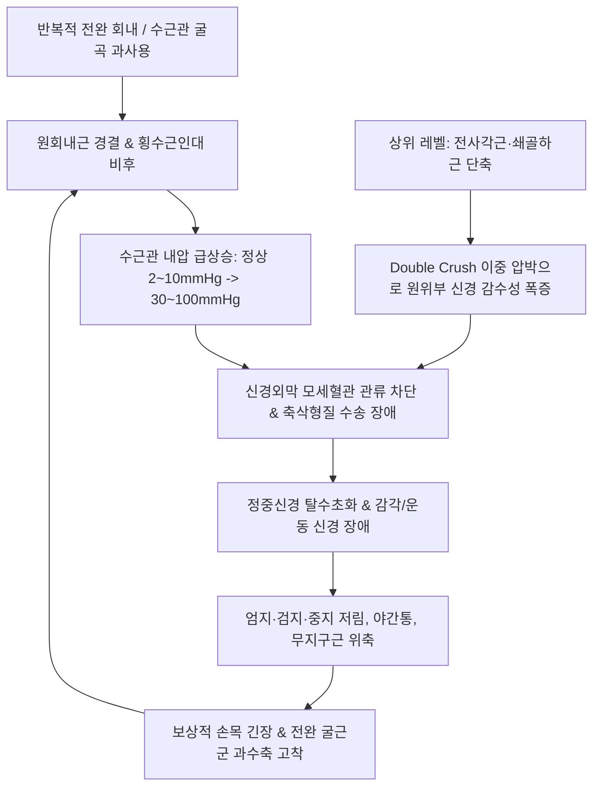

---
aliases:
  - 정중신경 포착 증후군
  - Median Nerve Entrapment
  - 원회내근 증후군
  - Pronator Teres Syndrome
  - 전골간신경 증후군
  - Anterior Interosseous Nerve Syndrome
  - 수근관 증후군
  - 손목터널 증후군
  - Carpal Tunnel Syndrome
tags:
  - 이론
  - 근골격계질환
  - 신경포착
  - 정중신경
  - 상지통증
  - 수근관증후군
categories:
  - 근골격계 질환
  - 상지
created: 2024-01-14
updated: 2026-09-24
title: 정중신경 포착
date: 2026-09-24
출처: "PMID: 41356887"
---

# 정중신경 포착 (Median Nerve Entrapment)

> **상위 분류**: [[근골격계 질환]] > [[상지 질환]] > [[말초신경 포착 증후군]]
> **핵심 3줄 요약 (Key Summary)**:
> - 📍 병소 부위 & 해부·병태생리: [[정중신경]](Median Nerve, C5~T1)이 경흉부 출구부터 주와부, 전완부([[원회내근]], [[천지굴근]], [[전골간신경]]), 수근부([[수근관]], [[횡수근인대]])에 이르는 경로상에서 섬유성 협착 및 근막 유착으로 압박·허혈되는 질환군.
> - 🚩 전형적 임상 양상 & 3대 징후: 요골측 3.5개 수지의 저림 및 작열통, **손바닥 감각 이상 유무로 원회내근 vs 수근관 감별**, 엄지 끝마디 굴곡 장애(Kiloh-Nevin OK sign 결손) 및 무지구근 위축(원숭이손 변형).
> - 🛠️ 핵심 감별 검사 & 한·양방 다각적 치료 전략: 대릉(PC7)·내관(PC6) 및 원회내근 침도(Acupotomy) 비절개 터널 감압술, 황련해독탕/봉약침(1:30,000) 신경막 침윤, 정중신경 글라이딩 재활 추나 및 [[소경활혈탕]]·[[오적산]] 투여.
> - ⚠️ 응급 의뢰 레드플래그 & 악화 요인: 대릉 혈위 수직 직자 시 정중신경 본간 관통 손상(Electric shock) 절대 주의, 척측 치우침 자침 시 척골혈관신경총 손상 주의.

---

## 📌 목차
1. [질환 개요 & 해부학적 병태생리](#1-질환-개요--해부학적-병태생리)
2. [병태생리 메커니즘 & 생체역학적 악순환 네트워크](#2-병태생리-메커니즘--생체역학적-악순환-네트워크)
3. [임상 증상 & 이학적 검사(Physical Exam) 알고리즘](#3-임상-증상--이학적-검사physical-exam-알고리즘)
4. [감별 진단 매트릭스 (Differential Diagnosis)](#4-감별-진단-매트릭스-differential-diagnosis)
5. [한의 통합 치료 프로토콜 (침·약침·추나·한약)](#5-한의-통합-치료-프로토콜-침약침추나한약)
6. [재활 운동 & 생활습관 티칭 가이드](#6-재활-운동--생활습관-티칭-가이드)
7. [💡 사용자 진료실 핵심 필기 & 임상 노하우 (Melt-In 잔여 심화 집약)](#7--사용자-진료실-핵심-필기--임상-노하우-melt-in-잔여-심화-집약)
8. [출처 및 학술 참고 문헌 (References)](#8-출처-및-학술-참고-문헌-references)

---

## 1. 질환 개요 & 해부학적 병태생리

![[Pasted image 20240114215453.png|450]]
> [그림 1: ① 병태생리·영상 — 주관절 및 전완부 정중신경 4대 포착 협착부] 과상돌기·스트루더스 인대, 상완이두근 건막(Lacertus fibrosus), [[원회내근]] 두 갈래 사이, [[천지굴근]](FDS) 건궁 부위의 정중신경 주행 및 포착 부위.

- **개념 정의 및 분류**:
  - [[정중신경 포착]](Median Nerve Entrapment)은 경추 신경근(C5~T1)에서 기원하여 외측속과 내측속이 합류해 형성된 [[정중신경]]이 상지 주행 경로상의 해부학적 협소 공간을 통과하면서 기계적 압박, 허혈, 마찰 및 신경내 미세순환 장애를 겪는 질환군을 총칭한다.
  - 대표적으로 수근부의 [[수근관 증후군]](Carpal Tunnel Syndrome), 근위 전완부의 [[원회내근 증후군]](Pronator Teres Syndrome), 순수 운동마비를 유발하는 [[전골간신경 증후군]](Anterior Interosseous Nerve Syndrome, AINS), 그리고 상부 경흉부 흉곽출구 레벨의 복합 포착이 포함된다.
- **역학적 특성**:
  - **[[수근관 증후군]](CTS)**: 전체 말초신경 포착 질환의 90% 이상을 차지하며 유병률은 3~5%이다. 40~60대 여성에서 남성 대비 3~4배 호발하며 수근부 반복 굴곡·신전 직업군에서 빈발한다.
  - **[[원회내근 증후군]](PTS) 및 [[전골간신경 증후군]](AINS)**: CTS에 비해 드물며, 반복적 전완 회내 및 강한 파지 작업을 수행하는 목수, 투수, 라켓 스포츠 선수에게 다발한다.

---

## 2. 병태생리 메커니즘 & 생체역학적 악순환 네트워크

![[Pasted image 20240114220804.png|450]]
> [그림 2: ② 관련 해부 구조물 — 수근관(Carpal Tunnel) 횡단면 해부학 도해] 횡수근인대(굴근지대), 정중신경(Median nerve), 요측수근굴근건(FCR tendon) 및 9개 굴근건의 공간적 위치 관계.

- **4대 주요 해부학적 포착 관문**:
  1. **상완 원위부 및 주와부**: 과상돌기, 스트루더스 인대, [[상완이두근]] 건막(Lacertus fibrosus).
  2. **근위 전완부 (원회내근 터널)**: [[원회내근]](Pronator teres) 상완두와 척골두 사이 섬유성 터널 및 [[천지굴근]](FDS) 건궁.
  3. **전골간신경(AIN) 분지 부위**: 주관절 원위 5~8cm 골간막 전면에서 갠저 근육(Gantzer's muscle) 등 해부학적 변이 섬유 띠에 의한 압박.
  4. **수근관(Carpal Tunnel)**: 8개 수근골과 견고한 [[횡수근인대]](Transverse carpal ligament) 사이의 협소한 공간에서 9개 굴근건과 함께 통과.
- **다단계 압박 증후군 (Double Crush Syndrome)**:
  - 경추 추간공이나 흉곽출구([[전사각근]], [[쇄골하근]])에서 1차적 미세 압박을 받으면 신경내 축삭 수송이 차단되어, 원위부 주관절이나 수근관의 경미한 물리적 압박에도 통증이 증폭 발현된다.

---

## 3. 임상 증상 & 이학적 검사(Physical Exam) 알고리즘

### 3대 주요 임상 증후군 양상
1. **[[수근관 증후군]](CTS)**:
   - 엄지, 검지, 중지 및 약지 요골측 반쪽의 저림, 찌릿함, 작열통.
   - **수장피지 보존**: 손바닥 중앙 어제부 감각은 정상 유지 (수장피지가 횡수근인대 위를 통과하기 때문).
   - **야간통 및 손털기(Flick sign)**: 수면 중 손목 굴곡으로 내압이 상승하여 잠에서 깨며 손을 털면 호전.
2. **[[원회내근 증후군]](PTS)**:
   - 근위 전완부 전면의 뻐근한 둔통과 함께 **손바닥 어제부를 포함한 1~3.5지 전체의 감각 저하**.
   - 전완 저항 회내 시 통증 악화, 야간통은 드묾.
3. **[[전골간신경 증후군]](AINS)**:
   - **순수 운동 마비**: 피부 감각 이상은 전혀 없음.
   - **킬로-네빈 징후(Kiloh-Nevin sign / OK Sign 결손)**: [[장모지굴근]](FPL)과 [[심지굴근]](FDP) 마비로 엄지-검지 끝마디 굴곡 불능(Tip-to-tip pinch 불가, Pad-to-pad 납작 핀치 형성).

### 특이적 이학적 검사 알고리즘
1. **[[팔렌 검사]](Phalen's Test)**:
   - 양측 손등을 맞대고 손목 90° 굴곡 60초 유지 시 1~3지 저림 유발 (감도 68~88%, 특이도 90%).
   ![[수근관증후군_팔렌검사_이학적검사.jpg|450]]
   > [그림: 이학적 검사 — 팔렌 검사] 수근관 내압을 급상승시켜 정중신경 지배 영역 이상감각을 유발하는 표준 검사.
2. **티넬 징후 (Tinel's Sign)**:
   - 횡수근인대 상부 타진 시 손끝으로 방전통 유발.
3. **수근 압박 검사 (Durkan Test)**:
   - 수근관 중앙을 30초간 직접 압박하여 증상 유발 (감도 87%).
4. **상지 신경긴장검사 1형 (ULTT 1형)**:
   - 견관절 하강·외전 110°, 손목·손가락 신전, 전완 회외, 주관절 신전 시 정중신경 주행선 방사통 재현.
   ![[ULTT_1형_정중신경_신경긴장검사.jpg|450]]
   > [그림: 이학적 검사 — ULTT 1형] 정중신경을 최대로 신장 평가하는 상지 신경동역학 검사.

---

## 4. 감별 진단 매트릭스 (Differential Diagnosis)

| 질환명 | 주 증상 부위 | 감각 이상 구역 | 운동 장애 및 특수 징후 | 결정적 감별 포인트 |
| :--- | :--- | :--- | :--- | :--- |
| **[[수근관 증후군]](CTS)** | 손목, 1~3.5지 장측 | 1~3.5지 장측 (**손바닥 어제부 정상**) | Phalen(+), Durkan(+), 무지구근 위축 | 야간 손털기(Flick sign), 수장피지 보존 |
| **[[원회내근 증후군]](PTS)** | 근위 전완 전면, 손바닥 | 1~3.5지 장측 + **손바닥 어제부 포함** | 전완 회내 저항통, Pronator test(+) | 손바닥까지 먹먹함, 야간통 드묾 |
| **[[전골간신경 증후군]](AINS)** | 근위 전완 심부 통증 | **감각 이상 전혀 없음 (정상)** | **OK sign 결손(Kiloh-Nevin sign)** | 순수 운동마비, 엄지/검지 끝마디 굴곡 불가 |
| **[[경추 추간판 탈출증]](C6-C7)** | 목, 견갑간부, 상지 방사통 | C6(엄지/시지), C7(중지) 분절 | [[스펄링 검사]](+), 건반사 저하 | 경추 자세 관련 방사통, 목 통증 동반 |
| **[[흉곽출구 증후군]](TOS)** | 쇄골하, 액와, 상지 내측 | C8~T1(4~5지) 및 전완 내측 빈발 | Roos test(+), Adson test(+) | 팔을 올리고 있을 때 상지 전체 저림 |

---

## 5. 한의 통합 치료 프로토콜 (침·약침·추나·한약)

![[수근관_단면해부도_횡수근인대_정중신경.jpg|450]]
> [그림 3: ③ 치료·시술점 — 횡수근인대 및 정중신경 주행 부위 대릉·내관 침도 박리 및 약침 자입점 단면도해] [[횡수근인대]] 절개 박리 및 [[정중신경]] 주변 신경외막 감압 목표점.

### 1) 침구 치료 & 침도 요법 (Acupotomy)
- **근위 포착점 감압**:
  - [[전사각근]]·[[쇄골하근]]: 결분(ST12), 기호(ST13) 자침으로 흉곽출구 레벨 선행 감압.
  - [[원회내근]]: [[곡택]](PC3) 하 2~3촌 원회내근 발통점 자침.
  - [[천지굴근]]·[[요측수근굴근]]: 극문(PC4), 간사(PC5) 심자로 전완 전면 근막 긴장 완화.
- **수근관 국소 침구**:
  - [[대릉]](PC7), [[내관]](PC6): 횡수근인대 주행선을 따라 15° 완만하게 사자. 2Hz 전침 통전으로 BDNF/NGF 분비 유도.
- **횡수근인대 침도 감압술 (Acupotomy Decompression)**:
  - 완관절 횡문 원위 1~1.5cm 부위(대릉 원위부)에서 장장근건 요측 안전 진입로를 통해 0.35×40mm 침도로 횡수근인대의 근위 섬유 및 요측수근굴근 건초 유착부를 종축으로 1~2회 미세 절개하여 수근관 내압 즉각 해소.

### 2) 약침 및 봉약침 치료 (Pharmacopuncture)
- **황련해독탕 / 중성어혈약침 (급성기)**: 수근관 및 원회내근 부위에 0.5~1.0cc 주입하여 건막 부종 및 활막염 급속 소퇴.
- **봉약침 (Sweet BV, 1:30,000)**: 내관, 대릉 및 원회내근 발통점에 0.1~0.2cc 분할 주입하여 미세 순환 촉진 및 신경 재생 유도.

### 3) 추나 요법 & 신경 활주술 (Chuna & Nerve Flossing)
- **수근골 가동술**: 주상골과 월상골의 전방 아탈구를 후방으로 밀어 넣어 수근관 용적 확장.
- **정중신경 활주 운동**: 주먹 쥐기 $\rightarrow$ 손가락 펴기 $\rightarrow$ 손목 신전 $\rightarrow$ 엄지 신전 $\rightarrow$ 전완 회외 $\rightarrow$ 반대 손 엄지 신장의 6단계 신경 활주 유도.

### 4) 한약 처방 (Herbal Medicine)
- **급성 종창 및 야간통 심화**: [[오적산]](五積散) 합 [[당귀수산]](當歸鬚散)으로 활혈거어, 수근관 삼출액 배출.
- **만성 저림 및 마목**: [[소경활혈탕]](疎經活血湯)에 [[강활]], [[방풍]], [[모과]]를 가미하여 말초 미세 혈류 촉진.
- **만성 근위축 및 기혈휴손**: [[대호경간탕]](大護經肝湯), [[보양환오탕]](補陽還五湯)으로 신경 재수초화 촉진.

---

## 6. 재활 운동 & 생활습관 티칭 가이드

### 재활 운동
1. **정중신경 자가 글라이딩 (Median Nerve Flossing)**:
   - 팔을 옆으로 뻗고 손목을 젖힌 상태에서 고개를 반대로 젖혔다가 손목을 풀며 고개를 돌리는 동작을 10회씩 3세트 반복.
2. **전완 굴근군 스트레칭**:
   - 팔꿈치를 펴고 손바닥을 전방으로 향하게 한 뒤 반대 손으로 손가락을 몸쪽으로 부드럽게 당겨 20초간 유지.

### 생활습관 지도
- **야간 손목 중립 부목 (Night Splinting)**:
  - 수면 중 손목이 꺾이지 않도록 중립위(0~15° 신전) 부목을 4~8주간 착용하여 관내 압력 상승 차단.
- **작업 환경 개선**: 인체공학적 버티컬 마우스 사용, 키보드 팜레스트 적용, 장시간 손목 굴곡 자세 제한.

---

## 7. 💡 사용자 진료실 핵심 필기 & 임상 노하우 (Melt-In 잔여 심화 집약)

> [!TIP] **진료실 임상 관찰 포인트**
> 1. **수장피지(Palmar Cutaneous Branch) 손바닥 감각 확인**:
>    - 손가락 1~3지는 저린데 **손바닥 두툼한 살(어제부)의 감각은 완전히 정상**이라면 $\rightarrow$ **수근관 증후군(CTS)**.
>    - 손가락뿐만 아니라 **손바닥 어제부 피부까지 먹먹하고 감각이 둔하다면** $\rightarrow$ **원회내근 증후군(PTS) 또는 경추 C6/C7 신경근증**.
> 2. **OK 사인(Kiloh-Nevin) 핀치 모양 확인**:
>    - 감각 저림은 전혀 없는데 단추를 못 잠그거나 종이를 집을 때 엄지와 검지 끝마디를 구부리지 못하고 편평하게 누른다면 $\rightarrow$ **전골간신경 증후군(AINS)** 확진.
> 3. **요측수근굴근(FCR) 과긴장의 연쇄 반응**:
>    - [[요측수근굴근]] 건은 횡수근인대 외측에 매우 밀접하게 주행한다. 손목을 많이 구부려 일하는 환자에서 FCR의 단축과 긴장은 횡수근인대를 팽팽하게 긴장시켜 수근관 내압을 2~3배 폭증시키는 주원인이므로, 반드시 FCR 근복 치료를 병행해야 재발을 방지할 수 있다.
> 4. **자침 및 침도 안전 가이드**:
>    - 대릉(PC7) 혈위에서 수직으로 깊숙이 직자하면 정중신경 본간을 관통할 수 있으므로, 반드시 완만하게 사자하고 찌릿한 방전감이 오면 1~2mm 후퇴해야 한다.
>    - 침도 시술 시 척측으로 과도하게 치우치면 척골신경과 동맥을 침범하므로 반드시 장장근건 바로 요측 경계면을 안전 진입로로 삼아야 한다.

---

## 8. 출처 및 학술 참고 문헌 (References)

1. Nishimaki Y, Kawabata M, Yamazaki A et al. Symptom Improvement in a Patient With Chronic Pronator Teres Syndrome Treated With Ultrasound-Guided Hydrodissection and Manual Therapy: A Case Report. *Cureus*. 2025;17(11):e73812. [PMID: 41356887](https://pubmed.ncbi.nlm.nih.gov/41356887/)
   - [연구 요약] 만성 원회내근 증후군에서 원회내근 상완두-척골두 사이의 정중신경 압박에 대해 초음파 유도하 수액박리술 및 도수 근막 이완 치료의 신경 활주성 회복과 임상 증상 개선을 보고.
2. Akhondi H, Lui F, Varacallo MA. Anterior Interosseous Syndrome. *StatPearls*. 2026. [PMID: 30247831](https://pubmed.ncbi.nlm.nih.gov/30247831/)
   - [연구 요약] 순수 운동신경인 전골간신경(AIN) 포착 시 장모지굴근(FPL)과 심지굴근(FDP) 마비로 인한 특징적인 "OK 사인 소실(Kiloh-Nevin sign)" 병태생리와 수근관 증후군과의 감별 진단을 체계화.
3. Cavalcanti Kußmaul A, Hermann W, Boever J et al. Nerve compression syndromes of the median and radial nerves at the elbow. *Orthopadie (Heidelb)*. 2025;54(4):254-263. [PMID: 40053053](https://pubmed.ncbi.nlm.nih.gov/40053053/)
   - [연구 요약] 주관절 및 근위 전완부에서 발생하는 정중신경 압박 증후군(원회내근 증후군, AIN 증후군)의 다단계 압박(double crush) 역학과 임상 신경학적 평가 지침을 제공.
4. Park JE, Sneag DB, Choi YS et al. Fascicular Involvement of the Median Nerve Trunk in the Upper Arm: Manifestation as Anterior Interosseous Nerve Syndrome With Unique Imaging Features. *Korean J Radiol*. 2024;25(5):472-481. [PMID: 38685735](https://pubmed.ncbi.nlm.nih.gov/38685735/)
   - [연구 요약] 고해상도 MR 신경조영술(MR Neurography)을 통해 상완 정중신경 본간 내 전골간신경 다발(Fascicle)의 선택적 수축성 병변 및 모래시계형 협착(Hourglass constriction) 기전을 규명.