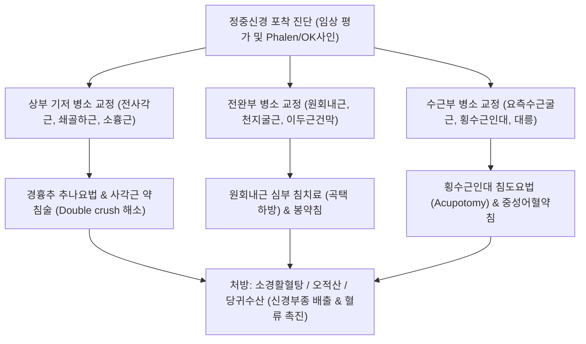

---
aliases:
  - 정중신경 포착 증후군
  - Median Nerve Entrapment
  - 원회내근 증후군
  - Pronator Teres Syndrome
  - 전골간신경 증후군
  - Anterior Interosseous Nerve Syndrome
  - 수근관 증후군
  - 손목터널 증후군
  - Carpal Tunnel Syndrome
tags:
  - 근골격계질환
  - 신경포착
  - 정중신경
  - 상지통증
  - 수근관증후군
categories:
  - 근골격계 질환
  - 상지
created: 2024-01-14
updated: 2026-09-18
---

# 정중신경 포착 (Median Nerve Entrapment)

> **핵심 3줄 요약 (Key Summary)**:
> - 🎯 [[정중신경]](Median Nerve, C5~T1)이 경추 출구부터 액와, 상완, 주관절, 전완, 수근관에 이르는 주행 경로상에서 근육·건막·인대의 비후 및 섬유화로 인해 발생하는 신경 포착성 통증 및 마비 증후군
> - 🚩 주관절 및 전완부 포착([[원회내근 증후군]], [[전골간신경 증후군]])과 수근부 포착([[수근관 증후군]])으로 대별되며, 요골 측 3.5개 수지의 저림, 엄지 대립근 쇠약, 손바닥 감각 이상 및 OK 사인 결손이 특징적
> - 🔍 한의학적으로 비증(痺證), 마목(麻木), 위증(痿證)으로 접근하며, [[전사각근]], [[쇄골하근]], [[원회내근]], [[천지굴근]], [[요측수근굴근]] 및 [[횡수근인대]] 부위의 침도·약침 복합 치료와 [[소경활혈탕]]·[[오적산]] 투여를 통해 신경 감압 및 전도 기능 회복 촉진
> - ⚠️ 수근관 증후군과 근위부 원회내근 증후군의 정확한 감별(수장피지 보존 여부) 및 다단계 포착(Double crush syndrome) 평가가 임상 치료의 핵심

---

## 목차 (Table of Contents)
- [[#1. 개요 및 역학 (Overview & Epidemiology)]]
- [[#2. 해부학 및 부위별 포착 병태생리 (Anatomy & Pathophysiology)]]
  - [[#2.1 정중신경의 주행과 4대 주요 포착 관문]]
  - [[#2.2 다단계 압박 증후군 (Double Crush Syndrome) 기전]]
- [[#3. 3대 주요 임상 증후군 분류 (Major Clinical Syndromes)]]
  - [[#3.1 원회내근 증후군 (Pronator Teres Syndrome)]]
  - [[#3.2 전골간신경 증후군 (Anterior Interosseous Nerve Syndrome, AINS)]]
  - [[#3.3 수근관 증후군 (Carpal Tunnel Syndrome, CTS)]]
- [[#4. 이학적 검사 및 진단적 접근 (Physical Examination & Diagnosis)]]
- [[#5. 감별 진단 (Differential Diagnosis)]]
- [[#6. 통합의학적 치료 전략 (Management Strategies)]]
  - [[#6.1 양방 의학적 치료 프로토콜]]
  - [[#6.2 한의학적 복합 치료 프로토콜]]
- [[#7. 진료실 핵심 임상 필기 (Clinical Pearls & Practice Tips)]]
- [[#8. 출처 및 학술 참고 문헌 (References)]]

---

## 1. 개요 및 역학 (Overview & Epidemiology)

### 1.1 정의 및 임상적 의의
[[정중신경 포착]](Median Nerve Entrapment)은 경추 신경근(C5~T1)에서 기원하여 외측속(Lateral cord)과 내측속(Medial cord)이 합류해 형성된 [[정중신경]]이 상지 주행 경로의 해부학적 협소 공간을 통과하면서 기계적 압박, 허혈, 마찰 및 신경내 미세순환 장애를 겪는 질환군을 총칭한다.
임상적으로 가장 흔한 수근부의 [[수근관 증후군]](Carpal Tunnel Syndrome)을 비롯하여, 근위 전완부의 [[원회내근 증후군]](Pronator Teres Syndrome), 순수 운동마비를 유발하는 [[전골간신경 증후군]](Anterior Interosseous Nerve Syndrome, AINS), 그리고 상부 경흉부 흉곽출구 레벨의 복합 포착이 모두 포함된다.

![[Pasted image 20240114215453.png|500]]
> [그림 1] 주관절 및 전완부 정중신경 4대 포착 협착부: 과상돌기·스트루더스 인대, 상완이두근 건막(Lacertus fibrosus), 원회내근 두 갈래 사이, 천지굴근 건궁(FDS arch)

### 1.2 역학적 특징
- **수근관 증후군(CTS)**: 전체 말초신경 포착 신경병증 중 90% 이상을 차지하며, 유병률은 일반 인구의 3~5%에 달한다. 40~60대 여성에서 남성 대비 3~4배 호발하며, 반복적인 수근부 굴곡·신전 직업군(키보드 작업, 요리사, 조립 라인 근로자, 치과의사) 및 임신, 당뇨, 갑상선 기능저하증 환자에서 호발한다.
- **원회내근 증후군(PTS)** 및 **전골간신경 증후군(AINS)**: CTS에 비해 드물며, 반복적인 전완 회내 및 파지 작업을 수행하는 목수, 투수, 테니스 선수, 라켓 스포츠 선수에게 다발한다.

---

## 2. 해부학 및 부위별 포착 병태생리 (Anatomy & Pathophysiology)

### 2.1 정중신경의 주행과 4대 주요 포착 관문
[[정중신경]]은 상완에서 상완동맥과 나란히 주행하며, 주관절 전면의 주와(Cubital fossa)를 거쳐 전완으로 진입한다.

1. **상완 원위부 및 주와부**:
   - 상완골 내측의 과상돌기(Supracondylar process)와 스트루더스 인대(Ligament of Struthers).
   - [[상완이두근]]의 건막 복합체인 이두근건막(Lacertus fibrosus).
2. **근위 전완부 (원회내근 터널)**:
   - [[원회내근]](Pronator teres)의 상완두(Humeral head)와 척골두(Ulnar head) 사이 섬유성 터널.
   - [[천지굴근]](FDS)의 상완척골두 기원부 건궁(Fibrous arch of FDS).
3. **전골간신경(AIN) 분지 부위**:
   - 주관절 원위 약 5~8 cm 부위에서 분지하여 골간막(Interosseous membrane) 전면을 주행하며, 갠저 부속두(Gantzer's muscle) 등 해부학적 변이 근육이나 비후된 건 섬유 띠에 의해 압박.
4. **수근관(Carpal Tunnel)**:
   - 8개의 수근골 바닥과 상부의 견고한 [[횡수근인대]](굴근지대, Transverse carpal ligament)로 둘러싸인 협소한 공간.
   - 9개의 굴근건([[심지굴근]] 4개, [[천지굴근]] 4개, [[장모지굴근]] 1개)과 함께 1개의 정중신경이 동반 통과하며, 인접한 [[요측수근굴근]](FCR) 건 및 섬유초의 비후가 수근관 내압을 직간접적으로 상승시킨다.

![[Pasted image 20240114220804.png|450]]
> [그림 2] 수근관(Carpal Tunnel) 횡단면 해부학: 횡수근인대(굴근지대), 정중신경(Median nerve), 요측수근굴근건(FCR tendon) 및 9개 굴근건의 공간적 위치 관계

### 2.2 다단계 압박 증후군 (Double Crush Syndrome) 기전
- 정중신경은 상위 레벨인 경추 추간공(C5~T1) 또는 전사각간극([[전사각근]], [[중사각근]]), 쇄골하간극([[쇄골하근]]), 오훼돌기 하부([[소흉근]], [[오훼완근]])에서 1차적인 미세 압박을 받을 경우, 신경내 축삭형질 수송(Axoplasmic transport)이 장애를 받는다.
- 축삭 수송 장애로 인해 원위부 신경막의 대사와 저항력이 급격히 저하되므로, 주관절이나 손목(수근관)의 경미한 물리적 압박에도 증상이 폭발적으로 발현된다.
- 특히 [[전사각근]]과 [[쇄골하근]]의 긴장에 의한 흉곽출구 압박 시에는 정중신경뿐만 아니라 인접한 [[요골신경]]의 흥분이 동반되어 전완 외측 및 수배부의 복합 통증이 병발하는 임상 양상을 보인다.

![[Pasted image 20240114224226.png|480]]
> [그림 3] 전완 굴근군과 신경 구획 관계: 요측수근굴근-횡수근인대 복합체(정중신경 통로) 및 장장근-수근장측인대 복합체(척골신경 통로)

---

## 3. 3대 주요 임상 증후군 분류 (Major Clinical Syndromes)

### 3.1 원회내근 증후군 (Pronator Teres Syndrome)
- **병태생리**: [[원회내근]]의 비후 또는 경결, 이두근건막(Lacertus fibrosus)의 긴장으로 주관절 하방에서 주간 신경이 포착됨.
- **주요 증상**:
  - 근위 전완부 전면의 뻐근하고 둔한 통증 및 압통.
  - 전완을 반복적으로 회내하거나 무거운 물건을 쥘 때 악화.
  - 정중신경 수장피지(Palmar cutaneous branch)가 수근관을 거치지 않고 근위부에서 분지하므로, **손바닥 어제부(Thenar eminence)를 포함한 1~3.5 수지 전체의 감각 저하 및 이상감각**이 나타남. (CTS와의 결정적 차이).
  - 야간통(Nocturnal paresthesia)은 CTS에 비해 흔하지 않음.

### 3.2 전골간신경 증후군 (Anterior Interosseous Nerve Syndrome, AINS)
- **병태생리**: 정중신경에서 분지한 순수 운동신경인 [[전골간신경]](AIN)이 [[원회내근]] 심부, [[천지굴근]] 건궁, 또는 갠저 근육에 의해 선택적으로 포착됨.
- **지배 근육**: [[장모지굴근]](FPL), 제2·3수지 [[심지굴근]](FDP), [[방형회내근]](Pronator quadratus).
- **특징적 임상 양상**:
  - **감각 이상 없음**: 순수 운동신경이므로 피부 감각 결손이 전혀 발생하지 않음.
  - **킬로-네빈 징후(Kiloh-Nevin sign / OK Sign 결손)**: 엄지 끝마디(IP joint) 굴곡력([[장모지굴근]])과 검지 끝마디(DIP joint) 굴곡력([[심지굴근]])이 마비되어, 엄지와 검지로 동그란 원(OK sign)을 만들지 못하고 지복부가 편평하게 맞닿는 핀치 기형(Pincer grasp / Tip-to-tip pinch 불가, Pad-to-pad pinch 형성)을 보임.
  - 전완 심부의 묵직한 통증과 쇠약감 동반.

### 3.3 수근관 증후군 (Carpal Tunnel Syndrome, CTS)
- **병태생리**: 수근관 내압 상승(정상 2~10 mmHg에서 손목 굴곡 시 30~100 mmHg 이상 급상승)으로 인한 신경 허혈 및 탈수초화. [[요측수근굴근]] 및 수근 굴근건군의 과긴장과 단축이 횡수근인대를 당겨 관내 압력을 가중시킴.
- **주요 증상**:
  - 엄지, 검지, 중지 및 약지 요골측 반쪽의 저림, 찌릿함, 작열통(Burning pain).
  - **수장피지 보존**: 손바닥 중앙 어제부 피부 감각은 정상 유지(분지가 횡수근인대 천부를 주행하기 때문).
  - **수면 중 악화(Nocturnal awakening)**: 손목이 굴곡된 자세로 잠들 때 내압이 극대화되어 통증으로 잠에서 깨며, 손을 털면(Flick sign) 일시적으로 증상이 호전됨.
  - 만성 진행 시 무지구근([[단무지외전근]], [[무지대립근]])의 위축(Ape hand deformity)과 단추 채우기, 젓가락질 등 미세 운동 장애 발생.

---

## 4. 이학적 검사 및 진단적 접근 (Physical Examination & Diagnosis)

![[수근관증후군_팔렌검사_이학적검사.jpg|500]]
> [그림 4] 팔렌 검사(Phalen's Test): 양측 손목을 90도 완전 굴곡시켜 수근관 내압을 상승시킴으로써 정중신경 지배 영역(1~3지) 저림 및 이상감각을 유발하는 표준 선별 검사

### 4.1 특수 이학적 유발 검사
1. **[[팔렌 검사]](Phalen's Test)**:
   - 양측 손등을 맞대고 손목을 90도 완전 굴곡한 상태를 60초간 유지.
   - 정중신경 분포 영역(1~3지)에 저림, 찌릿한 방사통이 유발되면 양성 (감도 68~88%, 특이도 90%).
2. **역 팔렌 검사(Reverse Phalen's Test / Prayer Test)**:
   - 기도하는 자세처럼 양 손바닥을 맞대고 손목을 90도 과신전시켜 60초간 유지하여 증상 유발 평가.
3. **틴넬 징후(Tinel's Sign)**:
   - 수근관 전면 횡수근인대 상부 또는 주관절 원회내근 부위를 타진기나 손가락 끝으로 가볍게 두드릴 때 말초 수지로 찌릿하게 전기가 통하는 감각 방사 시 양성.
4. **수근 압박 검사(Durkan's Carpal Compression Test)**:
   - 검사자의 엄지로 환자의 수근관 중앙을 약 30초간 직접 압박하여 증상 유발. (가장 민감도가 높은 검사, 감도 약 87%).
5. **원회내근 유발 검사(Pronator Teres Test)**:
   - 주관절을 90도 굴곡한 상태에서 환자에게 강력한 전완 회내(Pronation)를 지시하고 검사자가 이에 저항함과 동시에 주관절을 천천히 신전시킴.
   - 근위 전완부 통증과 손바닥/수지 저림이 악화되면 원회내근 포착 양성.
6. **킬로-네빈 징후(Kiloh-Nevin Sign)**:
   - 환자에게 엄지와 검지 끝으로 동그라미(OK 사인)를 만들도록 지시. 엄지 IP관절과 검지 DIP관절이 굴곡되지 않고 편평해지면 [[전골간신경 증후군]] 확진.

### 4.2 전기진단 및 영상의학 검사
- **근전도 및 신경전도 검사(EMG/NCS)**:
  - CTS의 경우 손목-손가락 간 감각신경전도속도(SNCV) 지연, 복합근육활동전위(CMAP) 원위 잠복기(Distal latency) 4.2 ms 이상 연장 확인.
  - AINS의 경우 감각신경전도는 정상이나 [[장모지굴근]], [[방형회내근]] 근전도에서 탈신경 전위(Fibrillation, Positive sharp wave) 확인.
- **고해상도 근골격 초음파**:
  - 수근관 입구 레벨에서 정중신경 횡단면적(Cross-Sectional Area, CSA) 10~12 mm² 이상 비대 및 신경 편평화율(Flattening ratio) 증가 시 확진.
  - 원회내근 내 주행 부위의 저에코성 신경 종대 및 동적 압박 실시간 관찰.

---

## 5. 감별 진단 (Differential Diagnosis)

| 질환명 | 주 증상 부위 | 감각 이상 구역 | 운동 장애 및 특수 징후 |
| :--- | :--- | :--- | :--- |
| **[[수근관 증후군]](CTS)** | 손목, 1~3.5지 장측 | 1~3.5지 장측 (어제부 손바닥 제외) | Phalen 양성, 야간 손털기(Flick sign), 무지구근 위축 |
| [[원회내근 증후군]] | 근위 전완 전면, 손바닥 | 1~3.5지 장측 + **손바닥 어제부 포함** | 전완 회내 저항 시 통증 악화, 야간통 드묾 |
| [[전골간신경 증후군]] | 근위 전완 심부 통증 | **감각 이상 전혀 없음 (정상)** | OK sign 결손(Kiloh-Nevin), 엄지/검지 끝마디 굴곡 불가 |
| **[[경추신경근증]](C6-C7)** | 경항부, 견갑간부, 상지 방사통 | C6(엄지/시지), C7(중지) 피부분절 | Spurling test 양성, 이두근/삼두근 건반사 저하, 목 운동 관련 |
| **[[흉곽출구 증후군]](TOS)** | 쇄골하, 액와부, 상지 내측 | C8~T1 신경총(4~5지) 빈발하나 복합 가능 | Wright/Adson test 양성, 팔을 들고 있을 때 상지 전체 저림 |
| [[당뇨병성 말초신경병증]] | 양측 수지 및 족부 말단 | 장갑-양말 형태(Glove-stocking pattern) | 양측 대칭성, 감각 소실 선행, 전신 대사질환 병력 |

---

## 6. 통합의학적 치료 전략 (Management Strategies)

### 6.1 양방 의학적 치료 프로토콜
1. **보존적 단계**:
   - **야간 부목(Night Splinting)**: 손목을 중립위(0~15도 신전)로 고정하는 부목을 4~8주간 착용하여 수근관 내압 억제.
   - 경구 약물: NSAIDs, 비타민 B6, 경구 프레드니솔론 단기 투여.
   - 직업적 교정: 인체공학적 마우스 및 키보드 사용, 전완 회내 반복 작업 제한.
2. **국소 주사 요법**:
   - 초음파 유도하 수근관 내 스테로이드 주사(Triamcinolone 20~40 mg)로 건막 부종 급속 감소.
   - 최근 초음파 유도하 5% 포도당 수액박리술(Hydrodissection)로 신경 유착 박리 및 신경 혈류 회복 도모.
3. **수술적 치료 (3~6개월 보존적 실패, 근위축 진행 시)**:
   - 개방성 또는 관절경하 횡수근인대 절제술(Carpal Tunnel Release, CTR).
   - 원회내근 증후군의 경우 원회내근 건궁 및 이두근건막 유리술.

### 6.2 한의학적 복합 치료 프로토콜
한의학적으로 정중신경 포착은 비증(痺證), 마목(麻木), 근위(筋痿)에 해당하며, 기혈어체(氣血瘀滯), 한습응체(寒濕凝滯), 간신부족(肝腎不足)으로 변증한다.

#### 1) 침구 치료
- **근위 포착점 치료**:
  - [[전사각근]], [[쇄골하근]]: 결분(ST12), 기호(ST13) 부위 자침으로 흉곽출구 레벨 신경 압박 선행 해소.
  - [[원회내근]]: 곡택(PC3) 하 2~3촌 부위 원회내근 압통점 자침.
  - [[천지굴근]], [[요측수근굴근]]: 극문(PC4), 간사(PC5) 혈위에 심자하여 전완 전면 굴근막 긴장 이완.
- **수근관 국소 혈위**:
  - 대릉(PC7), 내관(PC6): 횡수근인대 근위 및 관내 주행선을 따라 15도 사자하여 관내 압력을 감압.
  - 노궁(PC8), 어제(LU10), 합곡(LI4): 무지구근 위축을 예방하고 수지 미세 순환 촉진.
  - 전침 요법(Electro-acupuncture): 내관(PC6)-대릉(PC7) 또는 곡택(PC3)-대릉(PC7)에 2~100 Hz 혼합파를 15~20분간 통전하여 신경 자가 재생 인자(BDNF, NGF) 분비 유도.

#### 2) 약침 요법
- **황련해독탕 및 중성어혈약침**: 급성기 수근관 및 원회내근 부위에 0.5~1.0 cc 주입하여 굴근건초 활막염 및 신경막 부종 억제.
- **봉약침 (멜리틴 성분)**: 만성기 저림 및 무지구근 무력 환자에게 BV(0.05~0.1 mg/ml)를 내관, 대릉 주변 및 원회내근 발통점에 격일 시술하여 강력한 신경 혈류 확장 및 항섬유화 작용 유도.
- **자하거(태반) 약침**: 만성 무지구근 위축 환자의 어제, 대릉 부위에 주입하여 신경 영양 공급 및 근위축 방지.

#### 3) 침도 요법 (Acupotomy - 횡수근인대 및 원회내근 감압)
- **수근관 감압술**: 0.4×40 mm 침도를 사용하여 완관절 횡문 원위 1~1.5 cm 부위(대릉 원위부)에서 횡수근인대의 근위 섬유 및 요측수근굴근 건초 부착부의 비후된 섬유대를 종축으로 미세 절개(Puncturing & Stripping)하여 수근관 내압을 물리적으로 즉각 감압.
- **원회내근 건궁 감압술**: 곡택 하 2촌 원회내근 상완두-척골두 교차점에서 섬유화된 건궁 띠를 횡방향 절개하여 정중신경 통로를 확장.

#### 4) 추나요법 및 도수 신경 활주술 (Nerve Flossing)
- **경추 및 흉곽출구 교정**: C5~T1 분절의 변위 교정 및 쇄골-제1늑골 간극을 넓히는 근막 이완 추나.
- **수근골 가동술**: 주상골(Scaphoid)과 유두골(Capitate), 월상골(Lunate)의 전방 아탈구를 후방으로 밀어 넣어 수근관의 용적을 확보.
- **정중신경 활주 운동(Median Nerve Gliding Exercise)**:
  - 1단계: 주먹 쥐기 $\rightarrow$ 2단계: 손가락 펴기 $\rightarrow$ 3단계: 손목 젖히기 $\rightarrow$ 4단계: 엄지 젖히기 $\rightarrow$ 5단계: 전완 회외 $\rightarrow$ 6단계: 반대 손으로 엄지 신장. 각 단계를 5초씩 하루 3회 시행.

#### 5) 한약물 요법
- **급성 종창 및 야간통 심화**: [[오적산]](五積散) 합 [[당귀수산]](當歸鬚散)으로 활혈거어(活血祛瘀), 통경락(通經絡)하여 수근관 내 삼출액을 흡수.
- **만성 신경통 및 마목(저림)**: [[소경활혈탕]](疎經活血湯) 또는 활락효영단(活絡效靈丹)에 [[강활]], [[방풍]], 모과(木瓜), 상지(桑枝)를 가미하여 상지 말초 혈류를 대폭 개선.
- **만성 근위축 및 기혈휴손**: [[대호경간탕]](大護經肝湯), 보양환오탕(補陽還五湯) 또는 [[황기계지오물탕]](黃芪桂枝五物湯)을 처방하여 손상된 축삭의 재수초화(Remyelination) 촉진.

---

## 7. 진료실 핵심 임상 필기 (Clinical Pearls & Practice Tips)

### 7.1 진료실 감별 3대 체크포인트
1. **수장피지(Palmar Cutaneous Branch) 손바닥 감각 확인**:
   - 손가락 1~3지는 저린데 **손바닥 두툼한 살(어제부)의 감각은 완전히 정상**이라면 $\rightarrow$ **수근관 증후군(CTS)**.
   - 손가락뿐만 아니라 **손바닥 어제부 피부까지 먹먹하고 감각이 둔하다면** $\rightarrow$ **원회내근 증후군(PTS) 또는 경추 C6/C7 신경근증**.
2. **OK 사인(Kiloh-Nevin) 핀치 모양 확인**:
   - 감각 저림은 전혀 없는데 단추를 못 잠그거나 종이를 집을 때 엄지와 검지 끝마디를 구부리지 못하고 편평하게 누른다면 $\rightarrow$ **전골간신경 증후군(AINS)** 확진.
3. **요측수근굴근(FCR) 과긴장의 연쇄 반응**:
   - [[요측수근굴근]] 건은 횡수근인대 외측에 매우 밀접하게 주행한다. 손목을 많이 구부려 일하는 환자에서 FCR의 단축과 긴장은 횡수근인대를 팽팽하게 긴장시켜 수근관 내압을 2~3배 폭증시키는 주원인이므로, 반드시 FCR 근복 치료를 병행해야 재발을 방지할 수 있다.

### 7.2 자침 및 침도 시술 시 안전 가이드
- **내관(PC6) 및 대릉(PC7) 심자 주의**:
  - 장장근건과 요측수근굴근건 사이에 정중신경이 위치하므로, 자침 시 환자가 전기가 통하듯 손끝으로 번개 치는 감각(Electric shock)을 호소하면 바늘 끝이 신경 본간에 접촉한 것이므로 즉시 1~2 mm 후퇴시켜 신경 손상을 방지해야 한다.
- **침도 시술 시 척측 치우침 금기**:
  - 대릉 혈위에서 척측으로 과도하게 접근하면 척골동맥과 척골신경을 침범할 수 있으므로, 반드시 장장근건의 바로 외측(요측) 경계면을 안전 진입로로 삼는다.

---

## 8. 출처 및 학술 참고 문헌 (References)

1. Nishimaki Y, Kawabata M, Yamazaki A et al. (2025). Symptom Improvement in a Patient With Chronic Pronator Teres Syndrome Treated With Ultrasound-Guided Hydrodissection and Manual Therapy: A Case Report. *Cureus*, 17(11):e73812. [PMID: 41356887](https://pubmed.ncbi.nlm.nih.gov/41356887/)
   - [연구 요약]: 만성 원회내근 증후군에서 원회내근 상완두-척골두 사이의 정중신경 압박에 대해 초음파 유도하 수액박리술 및 도수 근막 이완 치료의 신경 활주성 회복과 임상 증상 개선을 보고함.
2. Akhondi H, Lui F, Varacallo MA (2026). Anterior Interosseous Syndrome. *StatPearls*, Treasure Island (FL): StatPearls Publishing. [PMID: 30247831](https://pubmed.ncbi.nlm.nih.gov/30247831/)
   - [연구 요약]: 순수 운동신경인 전골간신경(AIN) 포착 시 장모지굴근(FPL)과 심지굴근(FDP) 2지 마비로 인한 특징적인 "OK 사인 소실(Kiloh-Nevin sign)" 병태생리와 수근관 증후군과의 감별 진단을 체계화함.
3. Cavalcanti Kußmaul A, Hermann W, Boever J et al. (2025). Nerve compression syndromes of the median and radial nerves at the elbow. *Orthopadie (Heidelb)*, 54(4):254-263. [PMID: 40053053](https://pubmed.ncbi.nlm.nih.gov/40053053/)
   - [연구 요약]: 주관절 및 근위 전완부에서 발생하는 정중신경 압박 증후군(원회내근 증후군, AIN 증후군)의 다단계 압박(double crush) 역학과 임상 신경학적 평가 지침을 제공함.
4. Park JE, Sneag DB, Choi YS et al. (2024). Fascicular Involvement of the Median Nerve Trunk in the Upper Arm: Manifestation as Anterior Interosseous Nerve Syndrome With Unique Imaging Features. *Korean J Radiol*, 25(5):472-481. [PMID: 38685735](https://pubmed.ncbi.nlm.nih.gov/38685735/)
   - [연구 요약]: 고해상도 MR 신경조영술(MR Neurography)을 통해 상완 정중신경 본간 내 전골간신경 다발(Fascicle)의 선택적 수축성 병변 및 모래시계형 협착(Hourglass constriction) 기전을 규명함.