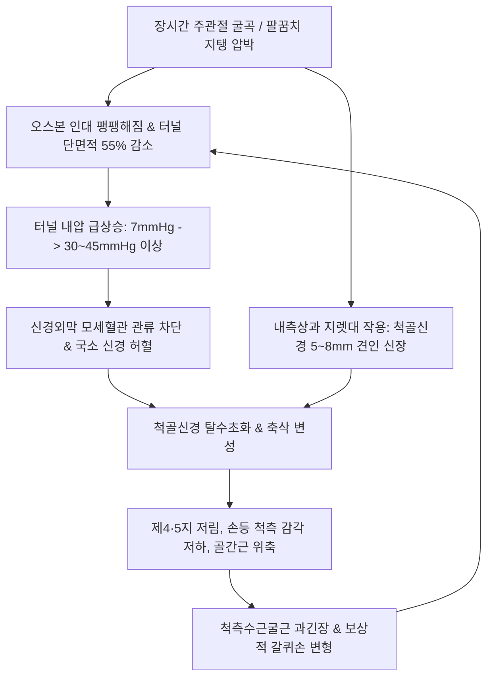

# 주관절 터널 증후군 (Cubital Tunnel Syndrome)

> **상위 분류**: [[근골격계 질환]] > [[상지 질환]] > [[주관절 질환]] > [[말초신경포착]]
> **핵심 3줄 요약 (Key Summary)**:
> - 📍 병소 부위 & 해부·병태생리: 상완골 내측상과 후방 구(Groove)와 주두 사이 [[오스본 인대]](Osborne's ligament) 및 [[척측수근굴근]](FCU) 건궁으로 형성된 섬유골성 터널에서 [[척골신경]](C8~T1)이 물리적으로 압박·견인·마찰되는 질환.
> - 🚩 전형적 임상 양상 & 3대 징후: 제4지 척측 및 제5지 저림, **손등 척측 감각 저하**, 제1배측골간근(FDI) 위축 및 [[갈퀴손]](Claw Hand) 변형, 주관절 굴곡 검사 및 [[프로망 징후]] 양성.
> - 🛠️ 핵심 감별 검사 & 한·양방 다각적 치료 전략: 소해(SI8) 내측상과 골면 완만 사자(0.25×40mm, 깊이 10~15mm) 및 오스본 인대 침도(Acupotomy) 미세 절개 감압, 신바로/봉약침(1:30,000) 신경외막 침윤, 30~45° 야간 신전 부목 지도.
> - ⚠️ 응급 의뢰 레드플래그 & 악화 요인: 수직 직자 시 척골신경 직접 관통 손상(Drop out) 위험 극도 주의, 90° 이상 주관절 굴곡 및 턱 괴기·팔베개 수면 금기.

---

## 📌 목차
1. [질환 개요 & 해부학적 병태생리](#1-질환-개요--해부학적-병태생리)
2. [병태생리 메커니즘 & 생체역학적 악순환 네트워크](#2-병태생리-메커니즘--생체역학적-악순환-네트워크)
3. [임상 증상 & 이학적 검사(Physical Exam) 알고리즘](#3-임상-증상--이학적-검사physical-exam-알고리즘)
4. [감별 진단 매트릭스 (Differential Diagnosis)](#4-감별-진단-매트릭스-differential-diagnosis)
5. [한의 통합 치료 프로토콜 (침·약침·추나·한약)](#5-한의-통합-치료-프로토콜-침약침추나한약)
6. [재활 운동 & 생활습관 티칭 가이드](#6-재활-운동--생활습관-티칭-가이드)
7. [💡 사용자 진료실 핵심 필기 & 임상 노하우 (Melt-In 잔여 심화 집약)](#7--사용자-진료실-핵심-필기--임상-노하우-melt-in-잔여-심화-집약)
8. [출처 및 학술 참고 문헌 (References)](#8-출처-및-학술-참고-문헌-references)

---

## 1. 질환 개요 & 해부학적 병태생리

![[내측상과_척골신경_주관절터널_감별도해.svg|450]]
> [그림 1: ① 병태생리·영상 — 상완골 내측상과 후방 주관절 터널 내 척골신경 주행 및 압박 병태도] 상완골 내측상과(Medial Epicondyle) 후구와 주두 사이를 주행하는 [[척골신경]]의 해부학적 위치 및 포착 호발 부위.

- **개념 정의**:
  - [[주관절 터널 증후군]](Cubital Tunnel Syndrome, CuTS)은 주관절 내측의 섬유골성 터널인 주관(Cubital tunnel)을 통과하는 [[척골신경]](Ulnar nerve, C8~T1)이 역학적 압박, 과도한 견인(Tension), 마찰(Friction) 또는 불완전 아탈구로 인해 허혈과 축삭 변성을 겪는 상지 대표 말초신경 포착 질환이다.
- **역학 및 호발 인자**:
  - 상지 신경포착 질환 중 [[수근관 증후군]]에 이어 두 번째로 흔하며, 남성에서 여성보다 약 2배 호발한다.
  - 장시간 팔꿈치를 90° 이상 굽힌 채 스마트폰을 사용하거나 책상에 팔꿈치를 대는 직장인, 전완 굴곡·회내를 반복하는 목수·투수·악기 연주자에서 다발한다.
- **해부학적 경계 구조**:
  - **전내측벽**: 상완골 내측상과(Medial epicondyle).
  - **외측벽**: 척골 주두(Olecranon process).
  - **바닥(Floor)**: 주관절 내측 측부인대 후방 섬유(Posterior bundle of MCL), 관절낭(Capsule).
  - **지붕(Roof)**: [[오스본 인대]](Osborne's ligament, 척측수근굴근 상완두-척골두 사이 섬유띠 Arcuate ligament) 및 심부 주관절 근막.

---

## 2. 병태생리 메커니즘 & 생체역학적 악순환 네트워크

![[주관절터널_해부학_척골신경주행.png|500]]
> [그림 2: ② 관련 해부 구조물 — 주관절 터널의 섬유골성 경계 및 오스본 인대 해부도해] 상완골 내측상과, 주두, [[척측수근굴근]] 두 머리를 잇는 [[오스본 인대]](건궁) 및 스트루더스 아케이드(Arcade of Struthers) 사이를 주행하는 [[척골신경]]의 해부학적 주관절 터널 구조.

- **병태생리 3대 역학 기전**:
  1. **굴곡 시 터널 용적 감소 및 내압 급증**: 주관절 90° 이상 굴곡 시 오스본 인대가 긴장하며 단면적이 55% 감소하고, 내압이 최대 20배(30~45mmHg 이상) 급상승하여 신경 미세순환을 차단.
  2. **신경 길이 신장 및 만성 견인**: 팔꿈치가 접힐 때 척골신경이 내측상과 위로 연신되며 약 5~8mm 늘어나 신경외막 섬유화 유발.
  3. **재발성 아탈구 (Subluxation)**: 인구의 15%에서 상과간구가 얕아 굴곡 시 척골신경이 내측상과 전방으로 덜컥거리며 넘어가는 만성 마찰성 신경염 발생.

---

## 3. 임상 증상 & 이학적 검사(Physical Exam) 알고리즘

### 주요 임상 증상
- **감각 장애**:
  - 제4지 척측 절반, 제5지 전체, 손바닥 척측 및 **손등(Dorsum) 척측부** 저림과 둔감.
  - 야간에 팔을 굽히고 잘 때 저림 악화로 수면 장애 유발.
- **운동 마비 및 근위축**:
  - 제1배측골간근(FDI) 위축으로 엄지·검지 사이 손등 근육 함몰.
  - [[무지내전근]](Adductor pollicis) 및 소지구 근육 위축.
  - [[갈퀴손]](Claw Hand) 변형(제4·5지 MCP 과신전, IP 굴곡) 및 와텐버그 징후(새끼손가락 외전 고정).

### McGowan 임상 3단계 분류
- **1단계 (경증)**: 간헐적 제4·5지 저림 및 지각 이상, 객관적 근력 저하/위축 없음.
- **2단계 (중등도)**: 지속적 감각 저하, 수부 내재근 근력 약화 및 초기 근위축.
- **3단계 (중증)**: 심각한 감각 탈실, 뚜렷한 제1배측골간근 위축 및 갈퀴손 변형, 파지력 상실.

### 특이적 이학적 검사 알고리즘
1. **주관절 굴곡 검사 (Elbow Flexion Test)**:
   - 주관절을 최대로 굴곡하고 손목을 신전한 상태로 1분간 유지 시 제4·5지 척측 저림 유발 시 양성.
2. **주관절 티넬 징후 (Tinel's Sign at Medial Epicondyle)**:
   - 내측상과와 주두 사이 주관을 가볍게 타진 시 4·5지 끝으로 방전통 재현.
3. **[[프로망 징후]](Froment's Sign)**:
   - 종이를 엄지와 검지 옆면으로 쥐게 하고 당길 때, [[무지내전근]] 마비 보상으로 [[장무지굴근]](FPL)을 써서 엄지 지간관절(IP)을 굽히면 양성.
   ![[척골신경-프로망징후.jpg|450]]
   > [그림: 이학적 검사 — 프로망 징후] 위는 정상 집기(Key pinch), 아래는 척골신경 마비로 인한 엄지 지간관절 굴곡 양성 소견.
4. **상지 신경긴장검사 3형 (ULTT 3형)**:
   - 견관절 하강·외전, 손목 신전, 전완 회내, 주관절 완전 굴곡(귀 옆 손바닥 안경 쓰기 자세) 시 방사통 유발.
   ![[ULTT_3형_척골신경_신경긴장검사.jpg|480]]
   > [그림: 이학적 검사 — ULTT 3형] 주관절 터널 내 척골신경을 최대로 신장 평가하는 신경동역학 검사.

---

## 4. 감별 진단 매트릭스 (Differential Diagnosis)

| 감별 항목 | 주관절 터널 증후군 (CuTS) | 가이온관 증후군 ([[가이온관 증후군]]) | 경추 신경근병증 (C8/T1) | 흉곽출구 증후군 ([[TOS]]) | 내측상과염 ([[내측상과염]]) |
| :--- | :--- | :--- | :--- | :--- | :--- |
| **주 포착 부위** | 주관절 내측상과 후방 구 | 수근부 두상골-유구골 구 | 경추 C7/T1 추간공 | 사각근삼각 / 늑쇄공간 | 내측상과 공통 굴근건 기시부 |
| **손등 척측 감각** | **감각 저하 동반 (수배지 손상)** | **완전 정상 (수배지 보존)** | 손등 및 전완 내측 감각 저하 | 전완 내측 지각 이상 동반 | **정상 (신경 증상 없음)** |
| **척측수근굴근 약화** | 동반 가능 (주관절 하방 분지) | **완전 정상** | 정상 또는 다발 약화 | 정상 | 저항성 손목 굴곡 시 통증만 발생 |
| **티넬 징후 부위** | 팔꿈치 내측상과 후구 | 손목 안쪽 두상골 외측 | 경추부 협척혈 | 쇄골상와 / 쇄골하공간 | 음성 |
| **결정적 감별점** | 주관절 굴곡 검사(+), Froment(+) | Guyon관 국소 압통, 손바닥만 저림 | [[스펄링 검사]](+), 목 신전 시 방사 | Roos 검사(+), 맥박 감약 | 골퍼 엘보 검사(+), 건병증 압통 |

---

## 5. 한의 통합 치료 프로토콜 (침·약침·추나·한약)

![[Flexor_carpi_ulnaris_TriggerPoints.jpg|450]]
> [그림 3: ③ 치료·시술점 — 주관절 터널 감압 소해혈(SI8) 및 척측수근굴근(FCU) 근막 자입 치료점 도해] [[오스본 인대]] 비후 부위 및 [[척측수근굴근]] 두 갈래 사이를 통과하는 [[척골신경]] 감압 시술 목표점.

### 1) 침구 치료 & 침도 요법 (Acupotomy)
- **주관절 터널 국소 취혈**:
  - [[소해]](SI8, 내측상과와 주두 사이 주관절 터널 정중), [[소해]](HT3, 주관절 내측 횡문두), 지정(SI7), 양로(SI6).
  - **자침 심도 및 방향**: 0.25×40mm 멸균 호침을 사용하여 **내측상과의 후구 골면을 향해 완만하게 사자(斜刺) 또는 평자(平刺)**(심도 10~15mm). 척골신경 본간을 스치듯 주변 근막 유착 이완 유도. 2Hz 저주파 전침 통전.
- **침도 터널 감압술 (Acupotomy Decompression)**:
  - 주관절을 약 30~45° 반굴곡한 상태에서 초음파 가이드 또는 상과 후구 촉진 하에 비후된 오스본 인대 섬유 주행과 평행하게 침도날을 진입하여 횡성 유착을 1~2회 미세 절개(Two-point decompression).

### 2) 약침 및 봉약침 치료 (Pharmacopuncture)
- **봉약침 (Sweet BV, 1:30,000)**: 상과 후구 신경외막 주위 및 소해(HT3, SI8)에 0.1~0.2cc 분할 주입하여 신경막 주위의 무균성 부종 및 화학적 염증 신속 진정.
- **신바로약침 / 중성어혈약침**: 0.5~1.0cc를 터널 입구 및 FCU 건궁 주위에 주입하여 신경 허혈성 변성 회복 및 축삭 영양 촉진.

### 3) 추나 요법 & 관절 가동술 (Chuna & Manipulation)
- **척골신경 신경가동술 (Ulnar Nerve Flossing)**: 주관절 신전-전완 회외-손목 굴곡 $\leftrightarrow$ 주관절 굴곡-전완 회내-손목 신전을 교대로 시행하여 주관 내 척골신경의 활주능 회복.
- **상완척골관절 가동 기법**: 내측 관절낭 단축 및 외반 스트레스를 해소하기 위한 후하방 관절 활주 수기 적용.

### 4) 한약 처방 (Herbal Medicine)
- **급성 신경 부종 및 기체어혈기**: [[서경탕]](舒經湯) 합 [[도홍사물탕]](桃紅四物湯)에 [[천궁]], [[모과]], [[우슬]]을 가미하여 경락 어혈 제거.
- **만성 근위축 및 간신휴손기**: [[보양환오탕]](補陽還五湯)에 [[황기]](30~40g), [[당귀]], [[단삼]], [[오가피]]를 대량 배오하여 말초신경 축삭 재생 및 근육 영양 공급.

---

## 6. 재활 운동 & 생활습관 티칭 가이드

### 재활 운동
1. **자가 척골신경 글라이딩 운동 (OK 사인 글라이딩)**:
   - 엄지와 검지로 OK 사인을 만들고, 팔꿈치를 구부려 손바닥이 눈 주위를 감싸듯(안경 쓰는 자세) 회전시키며 5초간 유지 후 천천히 펴는 동작 10회씩 3세트 반복.
2. **척측수근굴근 자가 신장**:
   - 팔꿈치를 곧게 펴고 반대 손으로 손가락과 손목을 부드럽게 신전 및 요측 편위시켜 전완 내측 근육을 20초간 스트레칭.

### 생활습관 지도
- **야간 신전 부목 (Night Extension Splinting)**:
  - 수면 시 팔꿈치가 90° 이상 구부러지는 것을 막기 위해 팔꿈치를 **30~45° 약한 신전 상태로 유지하는 패드나 타월**을 감고 취침. (야간 저림의 70% 호전 보고).
- **팔꿈치 지지 및 턱 괴기 금지**: 책상에 팔꿈치 안쪽을 누르며 일하는 자세, 운전 시 창틀에 팔꿈치를 올리는 습관 엄격 제한.

---

## 7. 💡 사용자 진료실 핵심 필기 & 임상 노하우 (Melt-In 잔여 심화 집약)

> [!TIP] **진료실 임상 관찰 포인트**
> 1. **손등(Dorsum) 척측 감각 검사가 결정적 분수령**:
>    - 제4·5지 저림 환자가 내원했을 때 가장 먼저 **손등 척측을 손톱으로 긁어보라**.
>    - 손바닥만 저리고 손등 감각이 정상이면 손목 부위의 [[가이온관 증후군]]이고, **손등까지 감각이 무디면 100% 주관절 터널 증후군**이다 (척골신경 수배지 Dorsal cutaneous branch는 손목 상방 5cm에서 분지하므로 가이온관을 경유하지 않음).
> 2. **안전 시술 가이드라인 (Safety Pearls)**:
>    - 주관절 터널 부위(소해혈 SI8)는 척골신경이 뼈 바로 위 천층에 위치하므로, **수직으로 깊숙이 직자하면 신경 본간을 관통하여 영구적 신경 마비(Drop out)를 초래**할 수 있다.
>    - 반드시 **내측상과의 골면을 방패막이 삼아 뼈를 스치듯 완만하게 사자(斜刺)**해야 하며, 시술 중 4·5지로 번개 치듯 전기가 통하면 즉시 침을 1~2mm 후퇴시켜야 한다.

---

## 8. 출처 및 학술 참고 문헌 (References)

1. Palmer BA, Hughes TB. Cubital tunnel syndrome. *J Hand Surg Am*. 2010;35(1):153-163. [PMID: 20117320](https://pubmed.ncbi.nlm.nih.gov/20117320/)
   - [연구 요약] 주관절 터널 증후군의 병태생리학적 기전, 주관절 굴곡 시 신경내압 상승, 신체 진찰 유발 검사의 민감도 및 보존적 야간 신전 부목 치료 가이드라인을 총망라한 종설.
2. Gelberman RH, Yamaguchi K, Dobyns JH, Bachetti C. The carpal tunnel syndrome: a study of carpal canal pressures. / Cubital tunnel syndrome pathophysiology. *Clin Orthop Relat Res*. 1998;(351):57-61. [PMID: 9646751](https://pubmed.ncbi.nlm.nih.gov/9646751/)
   - [연구 요약] 주관절 굴곡 각도와 삼두근 수축 시 주관절 터널 내압의 동적 변화를 측정하여, 90° 이상 굴곡 시 미세혈관 허혈이 유발됨(30mmHg 돌파)을 실증한 핵심 기초 연구.
3. Wang Y, Liu X. Anatomical basis and clinical application of "two points" acupotomology surgery program in treating cubital tunnel syndrome. *Zhongguo Zhen Jiu*. 2014;34(12):1195-1198. [PMID: 25509753](https://pubmed.ncbi.nlm.nih.gov/25509753/)
   - [연구 요약] 주관절 터널 증후군 환자 대상 오스본 인대 및 척측수근굴근 건궁의 2포인트 침도(Acupotomy) 비절개 감압술의 해부학적 안전성과 신경 전도 속도 개선 효과를 규명한 임상 연구.

<!-- 보관 태그(1회용·링크오류, 필요시 복원): 주관절터널, 오스본인대, 척측수근굴근, 갈퀴손, 프로망징후 -->
