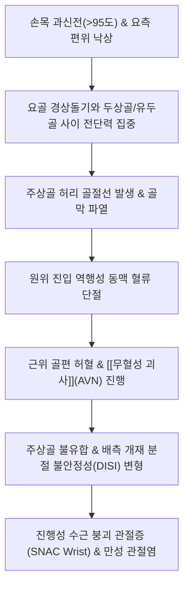

# 🩺 [[주상골 골절]] (Scaphoid Fracture / 舟狀骨骨折, S62.0)

> **핵심 3줄 요약 (Key Summary)**:
> - 📍 병소 부위 & 해부·병태생리: 8개 [[수근골]] 중 근위열 외측에 위치한 주상골(Scaphoid)의 허리(waist, 70%), 근위극(proximal pole, 20%), 원위결절(tubercle, 10%). 요골동맥 분지가 원위부에서 진입하여 근위부로 거슬러 올라가는 **역행성 혈액 공급(retrograde arterial supply)** 구조로 인해 근위극의 [[무혈성 괴사]](AVN) 및 불유합 위험이 극히 높음.
> - 🚩 전형적 임상 양상 & 3대 징후: 손을 짚고 넘어진 후 손목 요측 통증, **해부학적 코담배갑(Anatomical Snuffbox)의 명확한 압통**, 주상골 결절 압통 및 무지 축성 압박통(Axial load test 양성).
> - 🛠️ 핵심 감별 검사 & 한·양방 다각적 치료 전략: 초기 X-ray가 정상이라도 코담배갑 압통 시 **'잠재 골절(Occult fracture)'**로 간주하여 2주간 무지 스파이카 부목(Thumb spica) 고정 후 재촬영 또는 조기 MRI/CT 시행. 비전위 골절은 석고 고정, 전위 골절은 무두 나사(Herbert screw) 경피적 내고정. 유합기 어혈 흡수 및 골아세포 자극을 위한 [[당귀수산]], [[자연동]](산골) 투약, 고정 해제기 수근관절 가동 추나.
> - ⚠️ 응급 의뢰 레드플래그: 주상골 불유합(Nonunion), 근위극의 무혈성 골괴사(AVN), 진행성 주상골 불유합 붕괴 관절증(SNAC wrist: Scaphoid Nonunion Advanced Collapse), 월상골 주위 탈구(Perilunate dislocation) 동반.

---

## 📌 목차
1. [질환 개요 & 해부학적 병태생리](#1-질환-개요--해부학적-병태생리)
2. [병태생리 메커니즘 & 생체역학적 악순환 네트워크](#2-병태생리-메커니즘--생체역학적-악순환-네트워크)
3. [임상 증상 & 이학적 검사(Physical Exam) 알고리즘](#3-임상-증상--이학적-검사physical-exam-알고리즘)
4. [감별 진단 매트릭스 (Differential Diagnosis)](#4-감별-진단-매트릭스-differential-diagnosis)
5. [한의 통합 치료 프로토콜 (침·약침·추나·한약)](#5-한의-통합-치료-프로토콜-침약침추나한약)
6. [양방 치료 & 병용·의뢰 기준 (Conventional Treatment & Referral)](#6-양방-치료--병용의뢰-기준-conventional-treatment--referral)
7. [재활 운동 & 생활습관 티칭 가이드](#7-재활-운동--생활습관-티칭-가이드)
8. [💡 사용자 진료실 핵심 필기 & 임상 노하우 (Melt-In 잔여 심화 집약)](#8--사용자-진료실-핵심-필기--임상-노하우-melt-in-잔여-심화-집약)
9. [출처 및 학술 참고 문헌 (References)](#9-출처-및-학술-참고-문헌-references)

---

## 1. 질환 개요 & 해부학적 병태생리

![[주상골골절_01_병태도해_수근관절_주상골_골절도해.png|450]]
> [그림 1: ① 수근관절 내 주상골(Scaphoid)의 해부학적 위치 및 골절 호발 부위 도해 — Smart-Servier Medical Art (CC BY 3.0)]

![[주상골골절_01_영상의학_주상골허리골절_Xray.png|360]]
> [그림 2: ② 주상골 허리(waist) 부위의 명확한 투과성 골절선 단순 방사선 Scaphoid view 소견 — Wikimedia Commons (CC BY-SA 4.0)]

![[주상골골절_01_영상의학_잠재골절_12일후골절선발현_Xray.jpg|360]]
> [그림 3: ③ 수상 당일 X-ray상 정상이었으나 12일 후 골흡수로 골절선이 뚜렷해진 잠재성 주상골 골절(Occult fracture) — Wikimedia Commons (CC BY-SA 3.0)]

* **질환 정의 및 역학**:
  * 주상골 골절은 8개의 [[수근골]] 골절 중 가장 흔한 질환으로, 전체 수근골 손상의 약 60~70%를 차지합니다.
  * 주로 15~30대의 활동적인 젊은 남성에서 스포츠 손상, 낙상, 교통사고 등으로 호발하며, 노년층에서는 요골 골절(Colles)이 흔한 반면 청장년층에서는 주상골 골절이 다발합니다.
* **해부학적 골절 부위별 분류 (Herbert 분류)**:
  * **허리 골절 (Waist fracture, 약 70%)**: 가장 흔한 부위로 전위 및 혈행 차단 여부에 따라 유합 기간이 결정됩니다.
  * **근위극 골절 (Proximal pole fracture, 약 20%)**: 관절 내에 완전히 둘러싸여 있으며 혈관 진입부의 근위부이므로 혈류 공급이 거의 차단되어 **무혈성 괴사율이 30~50% 이상**에 달합니다.
  * **원위극 및 결절 골절 (Distal tubercle fracture, 약 10%)**: 골막 외 혈류가 풍부하여 보존적 치료로 4~6주 내 양호하게 유합됩니다.
* **독특한 혈액 순환 구조 (Retrograde Vascularity)**:
  * 주상골의 혈액 공급은 약 70~80%가 [[요골동맥]]의 배측 수근 분지(dorsal scaphoid branch)에서 유래하며, 주상골의 **원위 1/3 능선(ridge)을 통해 뼈 속으로 진입한 뒤 근위부로 거슬러 올라가는 역행성 주행**을 합니다.
  * 따라서 골절선이 허리나 근위극을 가로지르면 근위 골편으로 가는 혈류가 즉시 단절되어 허혈성 골괴사(AVN)와 불유합이 초래됩니다.

---

## 2. 병태생리 메커니즘 & 생체역학적 악순환 네트워크

![[주상골골절_02_해부도해_주상골골절_허버트분류.jpg|340]]
> [그림 4: ④ 안정성 및 불안정성 주상골 골절의 허버트(Herbert & Fisher) 분류 체계 도해 — Wikimedia Commons (CC BY-SA 4.0)]

### 1) 역행성 혈관 단절과 허혈성 괴사의 연쇄 반응
* 주상골 표면의 80% 이상이 관절연골로 덮여 있어 골절 치유에 필수적인 골막(periosteum)을 통한 외인성 가골 형성이 원천적으로 불가능합니다.
* 오직 골내 혈관망(endosteal blood supply)에 의존하여 유합이 일어나야 하므로, 골절선 분리 및 혈류 차단은 골세포의 광범위한 괴사를 야기하고 지연 유합(>3개월) 및 불유합(>6개월)으로 직결됩니다.

### 2) 생체역학적 붕괴: SNAC Wrist 메커니즘
* 주상골은 근위 수근열과 원위 수근열을 연결하는 생체역학적 버팀목(strut) 역할을 합니다.
* 불유합이 지속되면 원위 골편은 굴곡되고 근위 골편은 월상골과 함께 배측으로 신전되는 **배측 개재 분절 불안정성(DISI, Dorsal Intercalated Segment Instability)** 변형이 고착됩니다.
* 이로 인해 요골-주상골 관절면에 비정상적인 전단 부하가 가해지며 1단계(요골 경상돌기 관절염) → 2단계(주상골와 전체 관절염) → 3단계(유두골-월상골 관절염)로 진행하는 **SNAC wrist(Scaphoid Nonunion Advanced Collapse)**를 유발하여 손목 관절의 완전 붕괴를 초래합니다.

---

## 3. 임상 증상 & 이학적 검사(Physical Exam) 알고리즘

![[주상골골절_03_이학적검사_해부학적코담배갑_압통촉진부위.jpg|360]]
> [그림 5: ⑤ 장모지신근(EPL)과 단모지신근(EPB)/장모지외전근(APL) 사이 해부학적 코담배갑(Anatomical Snuffbox)의 압통 유발 부위 — Wikimedia Commons (CC BY-SA 4.0)]

### 1) 3대 핵심 이학적 검사법 (Physical Examination)
주상골 골절의 진단에서 다음 3가지 검사가 모두 양성이면 주상골 골절 확률이 90% 이상으로 급상승합니다:

1. **해부학적 코담배갑 압통 (Anatomical Snuffbox Tenderness)**:
   - 무지를 최대한 펴고 벌렸을 때 나타나는 삼각 오목부 바닥을 수직으로 압박.
   - 민감도 90~100%에 달하는 필수 선별 검사.
2. **주상골 결절 압통 (Scaphoid Tubercle Tenderness)**:
   - 손목을 신전시킨 상태에서 손바닥 쪽 요측 수근 굴건(FCR) 외측의 융기부를 엄지손가락으로 촉진.
   - 특이도가 높아 코담배갑 압통의 위양성을 걸러내는 데 유효.
3. **무지 축성 압박 검사 (Scaphoid Axial Compression Test)**:
   - 엄지손가락을 잡고 제1중수골을 따라 주상골 방향으로 축성(longitudinal) 압박력을 가할 때 손목 깊은 곳에서 예리한 통증 유발.

---

## 4. 감별 진단 매트릭스 (Differential Diagnosis)

| 감별 질환 | 호발 병소 및 원인 | 압통 및 통증 부위 | 영상 및 특이 검사 소견 |
| :--- | :--- | :--- | :--- |
| **[[주상골 골절]]** | 손목 과신전 낙상(FOOSH) | **해부학적 코담배갑** 및 결절 | Scaphoid view상 골절선, 초기 음성 시 MRI/CT 필수 |
| **[[드퀘르벵 증후군]]** | 손목 과사용, 산모 다발 | 요골 경상돌기 1구획 건초 | 뼈 자체보다 건 주행부 압통, Finkelstein 검사 양성 |
| **원위 요골 골절 ([[손목 골절]])** | 고령자 낙상 다발 | 요골 원위 골간단부 횡적 압통 | X-ray상 원위 요골 피질 파열 및 배측 전위 |
| **주상월상인대 파열** | 손목 회전 염좌 외상 | 주상월상 관절 간격(코담배갑 내측) | Watson 검사(Scaphoid shift) 양성, Terry-Thomas sign |

---

## 5. 한의 통합 치료 프로토콜 (침·약침·추나·한약)

* **급성기 보존 및 안정화 원칙**:
  * 주상골 골절 의심 시에는 즉시 무지 스파이카 부목(Thumb spica)을 적용하여 엄지와 손목을 안정화한 상태에서 치료를 진행합니다.
* **침구 치료 (Acupuncture)**:
  * 부종 경감 및 미세 순환 촉진: [[양계]](LI5, 코담배갑 중심), [[태연]](LU9), [[열결]](LU7), [[외관]](TE5), [[양지]](TE4), [[합곡]](LI4).
  * 원위부 무지 소퇴양 및 지간혈 자침을 통해 림프 배액을 촉진하고 관절낭 내압을 낮춥니다.
* **약침 치료 (Pharmacopuncture)**:
  * 황련해독탕 약침을 요측 수근 관절막 주위에 미량 주입하여 급성 건초염성 부종을 완화하고, 유합기에는 자하거 약침을 양계·태연 혈위에 투여하여 역행성 혈관 신생(angiogenesis)과 골형성을 자극합니다.
* **단계별 한약 치료 (Herbal Medicine)**:
  * **급성기 (1~2주)**: [[당귀수산]](當歸鬚散) (수근관절 심부 어혈 제거, 국소 미세혈관 혈전 용해 촉진).
  * **골유합기 (3~12주)**: 접골단(接骨丹) 가 [[자연동]](산골, Pyritum) 1~2g 합 [[보허탕]](補虛湯) (골내막 혈류 재개, 골아세포 분화 촉진, 무혈성 괴사 예방).
  * **고정 해제기 (12주 이후)**: [[독활기생탕]](獨活寄生湯) (장기 고정으로 인한 관절낭 섬유화 완화 및 수근관절 운동성 회복).

---

## 6. 양방 치료 & 병용·의뢰 기준 (Conventional Treatment & Referral)

![[주상골골절_06_보존치료_무지스파이카석고고정.jpg|360]]
> [그림 6: ⑥ 주상골 골절의 보존적 치료를 위해 엄지 MP 관절을 포함하여 고정하는 무지 스파이카 석고 붕대(Thumb Spica Cast) — Wikimedia Commons (CC BY-SA 4.0)]

* **보존적 치료 (Nonsurgical Treatment)**:
  * **적응증**: 전위가 없는(< 1mm) 안정성 주상골 허리 골절 및 결절 골절.
  * **방법**: 무지 스파이카 석고(Thumb spica cast)를 6~12주간 착용. 과거 장상지 깁스 논쟁이 있었으나 최근 메타분석에서는 단상지 무지 스파이카로도 동등한 유합률을 보고합니다.
* **수술적 치료 (Surgical Treatment)**:
  * **적응증**: 1mm 이상의 골편 전위, 각형성 변형, 근위극 골절, 불안정성 분쇄 골절, 운동선수의 조기 복귀 요구.
  * **방법**: 경피적 또는 최소침습적 **무두 압박 나사(Herbert screw / Acutrak screw)** 고정술을 시행하여 연골면 손상 없이 골절면 사이에 강력한 압박력을 제공합니다.
* **양방 의뢰 및 레드플래그 기준**:
  * 단순 X-ray가 정상이더라도 코담배갑 압통이 뚜렷하면 "뼈에 이상 없다"고 방치하지 말고, **2주간 무지 스파이카 고정 후 재촬영하거나 즉시 손목 MRI/CT를 촬영하도록 의뢰**합니다.

---

## 7. 재활 운동 & 생활습관 티칭 가이드

* **고정기 (0~6주)**: 노출된 4개 손가락(검지~소지)의 능동 굴곡-신전 및 어깨, 팔꿈치 전 가동범위 운동 매일 실시.
* **고정 해제 후 수근관절 재활 (유합 확인 후)**:
  * 손목 굴곡·신전 및 요골·척골 편위 능동-보조 가동 운동(AAROM).
  * 고무공 쥐기 및 파라핀 온욕 치료를 통한 관절 강직 완화.
  * 무거운 물건 들기 및 손을 짚는 동작은 유합 완료 후 최소 3개월간 제한.

---

## 8. 💡 사용자 진료실 핵심 필기 & 임상 노하우 (Melt-In 잔여 심화 집약)

* **"X-ray는 정상인데 손목 삔 것 맞죠?" — 절대 방심하면 안 되는 잠재 골절(Occult Fracture)**:
  * 넘어지면서 손을 짚고 온 젊은 환자가 손목을 삐었다며 침을 맞으러 왔을 때, 환자의 말을 그대로 믿고 단순 염좌로 치료하면 평생 손목을 망칠 수 있습니다. 반드시 **해부학적 코담배갑(양계혈 부위)**을 꾹 눌러보십시오. 압통이 있다면 비록 정형외과 X-ray에서 '이상 없음' 판정을 받았더라도 뼈에 미세한 실금이 간 **잠재성 주상골 골절**일 가능성이 매우 높습니다. 뼈가 흡수되어 골절선이 뚜렷해지는 데 약 10~14일이 걸리므로, 반드시 무지 스파이카 부목을 대어주고 "2주 뒤 X-ray를 다시 찍거나 지금 바로 MRI를 찍어야 뼈가 썩는 것을 막을 수 있다"고 단호히 티칭해야 합니다.
* **주상골 불유합으로 뼈가 하얗게 죽어가는 무혈성 괴사의 조기 경고**:
  * 골절 후 수개월이 지났는데도 손목 요측의 묵직한 둔통이 지속되고 쥐는 힘(Grip strength)이 떨어진다면 X-ray상 근위 골편의 경화(Sclerosis: 하얗게 변함)를 확인해야 합니다. 이는 역행성 혈류 단절로 뼈가 죽어가는 AVN 징후이며, 방치 시 SNAC wrist로 진행하므로 조기에 혈관부착 골이식술(Vascularized bone graft)을 받도록 수부외과 전문의에게 전원해야 합니다.

---

## 9. 출처 및 학술 참고 문헌 (References)

1. **Hayat Z, et al. (2023)**. Scaphoid Wrist Fracture. *StatPearls*. [PMID 30725592](https://pubmed.ncbi.nlm.nih.gov/30725592/)

   - [연구 요약]: 주상골 골절의 역학, 역행성 혈액 공급 손상 병태생리, 해부학적 코담배갑 검사 및 허버트 나사 고정술 지침.

2. **Hallett Reid S, et al. (2026)**. Anatomy, Shoulder and Upper Limb: Hand Anatomical Snuff Box. *StatPearls*. [PMID 29489241](https://pubmed.ncbi.nlm.nih.gov/29489241/)

   - [연구 요약]: 해부학적 코담배갑의 건 경계(EPL, EPB, APL), 내용물(요골동맥, 표재 요골신경) 및 임상 진단적 가치.

3. **Alghwail S, et al. (2026)**. Effectiveness and Outcomes of Cast Immobilization in Adults With Scaphoid Waist Fractures Compared With Surgical Fixation: A Systematic Review and Meta-Analysis. *Cureus*, 18(2), e78430. [PMID 42226878](https://pubmed.ncbi.nlm.nih.gov/42226878/)

   - [연구 요약]: 성인 주상골 허리 골절에서 석고 고정 보존 치료와 수술적 내고정의 유합률 및 기능적 결과 비교 메타분석.

4. **Hawkins SD, et al. (2026)**. Comparing Conservative and Surgical Treatment of Acute Nondisplaced Fractures of the Scaphoid Based on Fracture Location: A Systematic Review and Meta-Analysis. *J Am Acad Orthop Surg*, 34(3), e154-e163. [PMID 41983461](https://pubmed.ncbi.nlm.nih.gov/41983461/)

   - [연구 요약]: 비전위성 주상골 골절의 해부학적 발생 위치(허리 vs 근위극)에 따른 보존적 치료와 수술적 치료의 유합 성공률 비교.

5. **Bocchino G, et al. (2025)**. Surgical treatment of carpal scaphoid non-union: a systematic review. *Eur J Orthop Surg Traumatol*, 35(1), 45-56. [PMID 40603779](https://pubmed.ncbi.nlm.nih.gov/40603779/)

   - [연구 요약]: 주상골 불유합 및 무혈성 괴사 환자에서 혈관화 골이식술 및 내고정 수술 기법의 임상적 예후 체계적 문헌고찰.

6. **Nam EY, et al. (2023)**. Therapeutic Efficacy of Chinese Patent Medicine Containing Pyrite for Fractures: A Systematic Review and Meta-Analysis. *Medicina (Kaunas)*, 60(1), 64. [PMID 38256337](https://pubmed.ncbi.nlm.nih.gov/38256337/)

   - [연구 요약]: 골절 치유 및 가골 형성을 촉진하는 자연동(산골) 함유 한약 복합 제제의 임상 효능 메타분석.

---

## 관련 노트
- [[수근골]]
- [[손목 골절]]
- [[무혈성 괴사]]
- [[요골]]
- [[당귀수산]]
- [[자연동]]
- [[독활기생탕]]
- [[드퀘르벵 증후군]]
