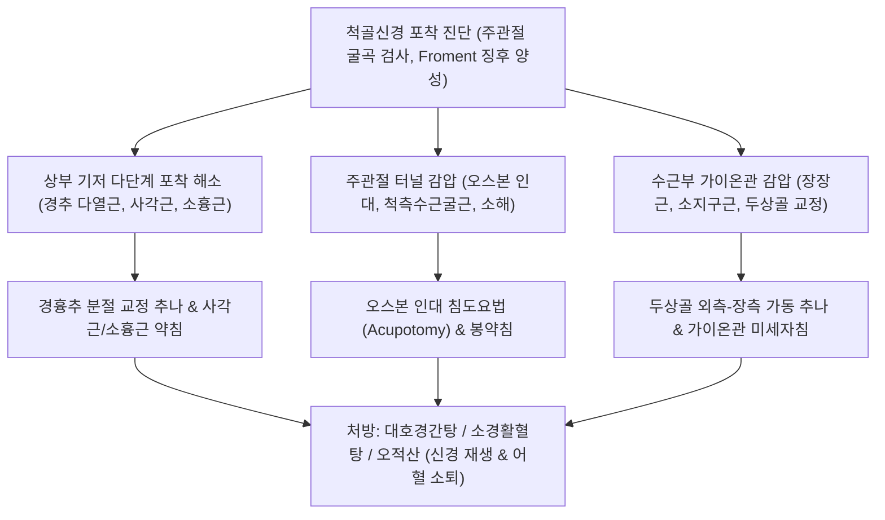

---
aliases:
  - 척골신경 포착 증후군
  - Ulnar Nerve Entrapment
  - 주관절 터널 증후군
  - 팔꿈치 터널 증후군
  - Cubital Tunnel Syndrome
  - 가이온관 증후군
  - 기용관 증후군
  - Guyon Canal Syndrome
  - Ulnar Tunnel Syndrome
tags:
  - 근골격계질환
  - 신경포착
  - 척골신경
  - 상지통증
  - 주관절터널증후군
categories:
  - 근골격계 질환
  - 상지
created: 2024-01-21
updated: 2026-09-18
---

# 척골신경 포착 (Ulnar Nerve Entrapment)

> **핵심 3줄 요약 (Key Summary)**:
> - 🎯 [[척골신경]](Ulnar Nerve, C8~T1)이 상위 경흉추 출구부터 액와, 상완 내측, 주관절 내측 상과 후방([[주관절 터널 증후군]]), 전완 척측, 손목의 가이온관([[가이온관 증후군]])에 이르는 주행 경로에서 근육·인대·골막의 비후 및 마찰로 압박되어 발생하는 신경병증
> - 🚩 손바닥 척측 1.5지 및 손등 척측 2.5지의 저림과 감각 저하, 수지 간근 쇠약으로 인한 바지 주머니 손 넣을 때의 새끼손가락 걸림(Wartenberg 징후), 갈퀴 손(Claw hand) 변형 및 [[프로망 징후]] 양성이 특징적
> - 🔍 한의학적으로 비증(痺證), 마목(麻木), 위증(痿證)으로 다루며, 상부의 [[다열근]], [[전사각근]], [[소흉근]]부터 주관절 [[척측수근굴근]](오스본 인대), 수근부 [[장장근]], [[소지구근]] 및 두상골 변위를 침도·약침·추나로 포괄 교정하고 [[오적산]]·[[소경활혈탕]]을 투여하여 회복 촉진
> - ⚠️ 손에 국한된 순수 척골신경 병증과 전완 내측 피부 감각 이상을 동반하는 내측전완피신경(MABC) 또는 흉곽출구·경추 C8/T1 신경근 손상의 정밀 감별 필수

---

## 목차 (Table of Contents)
- [[#1. 개요 및 역학 (Overview & Epidemiology)]]
- [[#2. 해부학적 주행 및 6대 주요 포착 관문 (Anatomy & Entrapment Sites)]]
  - [[#2.1 척골신경의 해부학적 주행과 분지 구조]]
  - [[#2.2 부위별 6대 포착 호발 관문]]
- [[#3. 주요 임상 증상 및 단계별 변형 (Clinical Features & Staging)]]
  - [[#3.1 감각 및 운동 신경 장애의 특징적 패턴]]
  - [[#3.2 특징적 기능 부전과 기형 징후 (Wartenberg, Claw Hand, 수전증)]]
- [[#4. 이학적 검사 및 진단적 접근 (Physical Examination & Diagnosis)]]
- [[#5. 감별 진단 (Differential Diagnosis)]]
- [[#6. 통합의학적 치료 전략 (Management Strategies)]]
  - [[#6.1 양방 의학적 치료 프로토콜]]
  - [[#6.2 한의학적 복합 치료 프로토콜]]
- [[#7. 진료실 핵심 임상 필기 (Clinical Pearls & Practice Tips)]]
- [[#8. 출처 및 학술 참고 문헌 (References)]]

---

## 1. 개요 및 역학 (Overview & Epidemiology)

### 1.1 정의 및 임상적 의의
[[척골신경 포착]](Ulnar Nerve Entrapment)은 상완신경총 내측속(Medial cord, C8~T1)에서 기원한 [[척골신경]]이 상지 주행 경로의 해부학적 협착 부위에서 외부 압박, 견인력, 마찰 및 허혈성 손상을 받아 발생하는 말초신경 압박 증후군이다.
상지 말초신경 포착 질환 중 [[수근관 증후군]]에 이어 **두 번째로 높은 발생 빈도**를 차지하며, 특히 주관절 내측 상과 후방에서 발생하는 [[주관절 터널 증후군]](Cubital Tunnel Syndrome, CuTS)과 손목 두상골-유구골 구 사이에서 발생하는 [[가이온관 증후군]](Guyon Canal Syndrome, Ulnar Tunnel Syndrome)이 대표적이다.

![[Pasted image 20240121053611.png|500]]
> [그림 1] 척골신경 포착의 임상 양상: 갈퀴 손(Claw hand) 변형 기전 및 가이온관(Guyon's tunnel) 감압과 두상골(Pisiform) 가동 교정 방향

### 1.2 역학 및 호발 요인
- **호발 연령 및 성별**: 30~60대에서 호발하며, 주관절 외반각(Carrying angle)이 크거나 팔꿈치를 구부린 채 턱을 괴는 습관, 장시간 컴퓨터 키보드/마우스 작업자, 전화 통화가 잦은 직업군, 자전거 라이더(Cyclist's palsy)에게 다발한다.
- **다단계 압박(Double Crush) 취약성**: 경추 C8~T1 추간공 주변의 다열근 긴장, 사각근간극([[전사각근]]), 쇄골하간극([[쇄골하근]]), 오훼돌기 하부([[소흉근]])의 단축이 선행할 경우 주관절이나 완관절의 경미한 물리적 부하에도 척골신경 손상이 현저히 가속화된다.

---

## 2. 해부학적 주행 및 6대 주요 포착 관문 (Anatomy & Entrapment Sites)

### 2.1 척골신경의 해부학적 주행과 분지 구조
[[척골신경]]은 상완 근위부에서는 상완동맥의 내측을 따라 주행하다가, 상완 중앙부에서 내측 근간중격(Medial intermuscular septum)을 뚫고 후방 구획으로 이동하여 주관절 내측상과 후방의 척골신경구(Sulcus nervi ulnaris)로 진입한다.

![[Pasted image 20240115200301.png|500]]
> [그림 2] 수부 척골신경의 피부 감각 지배 영역: 장측 1.5지 및 배측 2.5지 분포 영역과 수장피지(Palmar cutaneous branch), 수배피지(Dorsal cutaneous branch) 분지 양상

- **감각 지배의 한계성**: **척골신경의 고유 감각 지배 구역은 오직 손(Hand) 부위에만 국한**된다.
  - **손바닥(Palmar)**: 척측 1.5개 수지(제5지 전체 및 제4지의 척측 반쪽) 및 소지구(Hypothenar) 부위.
  - **손등(Dorsal)**: 척골신경 수배피지(Dorsal cutaneous branch)에 의해 제5지, 제4지, 그리고 제3지의 척측 반쪽을 포함하는 약 2.5개 수지 부위 지배.
  - ⚠️ **전완 내측 피부 감각**: 전완 내측은 척골신경이 아니라 상완신경총 내측속에서 직접 분지하는 **내측전완피신경(Medial Antibrachial Cutaneous Nerve, MABC)**이 전담하므로 감별에 결정적 단서를 제공한다.

### 2.2 부위별 6대 포착 호발 관문
척골신경의 포착은 말초 한 부위의 단독 손상뿐만 아니라 상위 레벨의 동반 긴장에 의해 중첩 발생한다.

1. **C8, T1 경추·흉추 [[다열근]](Multifidus)**:
   - 심부 척추기립근 및 다열근의 과긴장과 단축은 척추간공을 좁히고 후관절을 압박하여 C8, T1 신경근의 축삭 수송을 저해.
2. **[[전사각근]](Anterior Scalene) 및 [[쇄골하근]](Subclavius)**:
   - 사각근간극 및 쇄골-제1늑골 터널에서 하신경간(Lower trunk)을 압박.
3. **[[소흉근]](Pectoralis Minor)**:
   - 오훼돌기 부착부 하방의 흉소간극에서 내측속(Medial cord)을 직접 압박.
4. **[[척측수근굴근]](Flexor Carpi Ulnaris, FCU) 및 오스본 인대(Osborne's Ligament)**:
   - 주관절 터널의 지붕을 형성하는 섬유성 띠인 오스본 인대(오스본 근막)와 FCU 상완두-척골두 사이의 건궁(Arcuate ligament). 주관절 굴곡 시 인대가 팽팽해지며 신경을 강하게 조임.
5. **[[장장근]](Palmaris Longus) 및 굴근지대 복합체**:
   - 완관절 원위부에서 장장근 건이 수근장측인대(Palmar carpal ligament)를 잡아당겨 가이온관 입구의 긴장도를 증가시킴.
6. **[[소지구근]](Hypothenar Muscles) 및 가이온관(Guyon's Canal)**:
   - 두상골(Pisiform)과 유구골 갈고리(Hook of hamate) 사이의 섬유골성 터널로, 자전거 핸들 압박이나 작업성 외상 시 포착.

![[Pasted image 20240114224226.png|480]]
> [그림 3] 전완 원위부 척골신경과 건막 복합체: 장장근 건-수근장측인대 복합체와 척골신경의 해부학적 통로

---

## 3. 주요 임상 증상 및 단계별 변형 (Clinical Features & Staging)

### 3.1 감각 및 운동 신경 장애의 특징적 패턴
- **감각 이상 및 허혈성 통증**:
  - 제4지 척측과 제5지의 저림, 감각 저하, 시림, 찌릿한 이상감각(Paresthesia).
  - 팔꿈치를 90도 이상 굴곡하고 장시간 있을 때(수면 시 팔을 괴거나 전화 통화 시) 증상 급격 악화.
- **골간근 쇠약 및 악력 저하**:
  - 수부 내재근(Intrinsic muscles: 배측 및 장측 [[골간근]], 제3·4 [[충양근]], [[무지내전근]], [[소지구근]])의 위축으로 병뚜껑을 돌리거나 열쇠를 돌리는 힘(Pinch strength) 및 악력(Grip strength) 현저 감퇴.
  - 중수골 사이(특히 1~2 중수골 간 배측 골간근)가 푹 꺼지는 근위축(First dorsal interosseous muscle atrophy).

### 3.2 특징적 기능 부전과 기형 징후
1. **바텐베르크 징후(Wartenberg's Sign)**:
   - 손을 바지 주머니에 넣으려고 할 때 새끼손가락이 주머니 입구에 자꾸 걸리는 현상. 제3장측골간근(소지 내전근)의 마비로 인해 대항근인 소지신근(EDM, 요골신경 지배)의 작용이 우세해져 새끼손가락이 바깥쪽으로 저절로 벌어지는(Abduction) 현상이다.
2. **갈퀴 손 기형(Claw Hand Deformity / Ulnar Claw)**:
   - 제4·5지의 중수수지관절(MCP)은 과신전(Hyperextension)되고 근위·원위 지간관절(PIP, DIP)은 굴곡(Flexion)되는 갈고리 모양 변형. (제3·4 [[충양근]] 및 [[골간근]] 마비로 MCP 신전근인 총지신근이 견제받지 못해 발생).
   - ⚠️ **척골신경 역설(Ulnar Paradox)**: 고위부(팔꿈치) 포착 환자보다 저위부(손목 가이온관) 포착 환자에서 [[심지굴근]](FDP) 기능이 온전히 살아있어 지간관절을 더 강하게 굴곡시키므로, 갈퀴 손 변형이 훨씬 더 심하게 나타나는 역설적 현상.
3. **수전증(Tremor) 및 불수의적 근연축**:
   - 골간근과 무지내전근의 지속적인 허혈 및 불완전 탈신경화(Partial denervation)로 인해 손가락을 펴고 있을 때 미세한 근섬유속성 연축(Fasciculation)이나 손떨림([[수전증]]) 형태의 불수의적 진전이 동반될 수 있다.

---

## 4. 이학적 검사 및 진단적 접근 (Physical Examination & Diagnosis)

![[척골신경-프로망징후.jpg|450]]
> [그림 4] 프로망 징후(Froment's Sign) 검사: 무지내전근 마비 시 장모지굴근(FPL, 정중신경 지배)으로 보상하여 무지 지간관절(IP)이 과굴곡되는 양성 반응

### 4.1 특수 이학적 유발 검사
1. **[[프로망 징후]](Froment's Sign)**:
   - 환자에게 양손의 엄지와 검지 측면으로 종이나 명함을 단단히 쥐고(Key pinch) 있도록 지시한 후, 검사자가 종이를 잡아당긴다.
   - 척골신경이 지배하는 [[무지내전근]](Adductor pollicis)이 마비되면, 환자는 종이를 놓치지 않기 위해 정중신경이 지배하는 [[장모지굴근]](FPL)을 과도하게 수축시켜 **엄지 끝마디(IP 관절)를 갈고리처럼 심하게 구부리게(Flexion) 된다**. (양성).
2. **잔느 징후(Jeanne's Sign)**:
   - 프로망 검사 시 엄지 IP 관절 굴곡과 함께 중수수지관절(MCP)이 과신전되는 현상.
3. **주관절 굴곡 검사(Elbow Flexion Test)**:
   - 환자의 팔꿈치를 최대로 굴곡하고 손목을 신전한 상태로 60초간 유지. 척골신경 주행 부위 압박으로 제4·5지 저림과 통증이 유발되면 양성. (주관절 터널 증후군 표준 선별법).
4. **틴넬 징후(Tinel's Sign)**:
   - 주관절 내측 상과 후방 척골신경구나 가이온관 부위를 손가락 끝으로 가볍게 두드릴 때 제4·5지로 찌릿한 방사통 발생 시 양성.

### 4.2 전기진단 및 영상의학 검사
- **신경전도 검사(NCS)**:
  - 주관절 터널 부위 척골신경 운동신도전도속도(MNCV)가 전완부에 비해 50 m/s 이하 또는 10 m/s 이상 감속, CMAP 복합근육활동전위 진폭 저하 확인.
- **고해상도 근골격 초음파(MSK US)**:
  - 주관절 터널 부위에서 척골신경 횡단면적(CSA)이 10 mm² 이상(정상 6~8 mm²)으로 비대되어 저에코성 신경 부종 소견을 보이며, 주관절 굴곡 시 신경이 내측 상과를 넘어 전방으로 튕겨 나가는 동적 아탈구(Subluxation)를 실시간 관찰.

---

## 5. 감별 진단 (Differential Diagnosis)

| 질환명 | 주 통증 및 감각 저하 구역 | 운동 마비 및 특수 검사 | 감별 핵심 포인트 |
| :--- | :--- | :--- | :--- |
| **[[주관절 터널 증후군]](CuTS)** | 주관절 내측, 수부 4·5지 (장측+배측) | Froment 양성, Wartenberg 양성, 골간근 위축 | 주관절 굴곡 검사 양성, 손등 감각 저하 동반 |
| **[[가이온관 증후군]](Guyon's)** | 손목 척측, 수부 4·5지 장측 | Zone에 따라 운동/감각 선택적 침범 | **손등(Dorsal) 감각 완전 정상 보존** (분지 상부) |
| **[[경추신경근증]](C8-T1)** | 목, 견갑골 하부, 상지 내측 전반 | 수지 굴근 전반 약화, Triceps 반사 저하 | Spurling test 양성, 전완 내측 피부 감각 저하 동반 |
| **[[흉곽출구 증후군]](TOS)** | 쇄골하, 액와, 상지 내측 전반 | 손의 파지력 약화, 레이노 현상 동반 가능 | Adson/Wright 양성, 팔 거상 시 저림 폭증 |
| **내측전완피신경(MABC) 포착** | 전완 내측(안쪽 팔뚝) 피부 표면 | **운동 마비 전혀 없음 (순수 감각신경)** | 손가락 감각은 정상, 전완 내측에만 국한된 감각 이상 |

---

## 6. 통합의학적 치료 전략 (Management Strategies)

### 6.1 양방 의학적 치료 프로토콜
1. **보존적 처치**:
   - **야간 신전 부목(Night Extension Splint)**: 취침 중 팔꿈치가 30~45도 이상 굴곡되지 않도록 패드형 부목 적용(4~8주).
   - 작업 환경 교정: 팔꿈치 받침대 쿠션 사용, 팔꿈치 기대기 금지.
   - 약물 치료: 신경병증성 통증 완화를 위한 가바펜틴, 프레가발린, NSAIDs.
2. **주사 요법**:
   - 초음파 유도하 주관절 터널 내 스테로이드 국소 주사(신경 손상 위험으로 엄격한 주의 요함).
   - 5% 포도당 수액박리술(Hydrodissection)을 통해 신경과 주변 오스본 인대 사이 유착 박리.
3. **수술적 치료 (보존적 치료 실패, 근위축 및 Claw hand 진행 시)**:
   - **단순 감압술(In situ decompression)**: 오스본 인대 및 FCU 건궁 절개.
   - **척골신경 전방 전위술(Anterior transposition)**: 신경 아탈구가 있거나 상과 골극이 심한 경우 피하 또는 근육하로 신경 주행을 전방 이전.

### 6.2 한의학적 복합 치료 프로토콜
한의학에서는 척골신경 포착을 비증(痺證), 완관절풍(腕關節風), 근위(筋痿)로 진단하며, 거풍제습(祛風除濕), 활혈통락(活血通絡), 보익간신(補益肝腎)을 기본 치법으로 삼는다.

#### 1) 침구 치료
- **주관절 터널 국소 혈위**:
  - 소해(HT3), 소해(SI8): 내측 상과와 주두 돌기 사이 척골신경구에 15~30도 사자하여 오스본 인대 주변 근막 긴장 완화.
  - 수삼리(LI10), 곡지(LI11): 대항근 긴장 조절 및 전완 순환 촉진.
- **상부 및 원위 포착점 혈위**:
  - C7~T1 화타협척혈(Hua Tuo Jia Ji): 다열근 심부 자침으로 신경근 출구 감압.
  - 견정(GB21), 천정(SI16), 중부(LU1): 전사각근 및 소흉근 긴장 해제.
  - 양곡(SI5), 완골(SI4), 신문(HT7), 후계(SI3): 가이온관 및 소지구근 긴장 이완.
  - 전침 치료: 소해(HT3)-신문(HT7)에 2~100 Hz 저주파 자극을 통전하여 신경 혈류 증가 유도.

#### 2) 약침 요법
- **중성어혈약침 / 황련해독탕 약침**: 급성 주관절 터널 부종 및 열감 시 신경 주위 활막염 억제(0.5~1.0 cc 주입).
- **봉약침 요법 (Melittin)**: 만성기 저림과 근력 저하 환자에게 BV 0.05~0.1 mg/ml를 주관절 내측 상과 후방 및 두상골 외측에 격일 시술하여 강력한 신경 혈류 촉진 및 신경세포 축삭 재생 촉진.
- **자하거 약침**: 손가락 골간근 위축이 진행된 제1배측 골간근 및 소지구에 직접 주입하여 근위축 방지 및 영양 공급.

#### 3) 침도 요법 (Acupotomy)
- **오스본 인대 및 FCU 건궁 박리술**: 0.4×40 mm 침도를 사용하여 내측 상과 후방 척골신경구 주행선 바로 외측에서 비후된 오스본 섬유대를 종축 절개하여 척골신경 압박을 물리적으로 해제.
- **가이온관 천부 인대 박리술**: 두상골과 유구골 사이를 연결하는 수근장측인대를 미세 절개하여 가이온관 내압 감압.

#### 4) 추나요법 및 도수 기법
- **두상골 가동 기법(Pisiform Mobilization)**:
  - 가이온관이 좁아진 환자는 두상골이 척측 및 배측으로 변위되어 고착되는 경우가 많다.
  - 검사자의 무지구로 두상골을 파지하고 **요측(Radial) 및 장측(Palmar) 방향으로 부드럽게 글라이딩(Gliding)**시켜 가이온관의 단면적을 확장한다.
- **척골신경 활주 운동(Ulnar Nerve Gliding Exercise)**:
  - '오케이 안경' 자세: 엄지와 검지로 원을 만들고 손바닥을 위로 향하게 한 뒤, 팔꿈치를 굽히고 손목을 젖혀 귀 옆으로 가져가 눈에 안경을 씌우듯 거꾸로 가져가는 동작을 천천히 5~10회 반복.

#### 5) 한약물 요법
- **급성 신경 부종 및 야간 저림**: [[오적산]](五積散) 합 [[당귀수산]](當歸鬚散)에 지루(地龍), 우슬(牛膝)을 가미하여 경락 어혈을 뚫고 신경 부종을 배출.
- **만성 신경통 및 마목**: [[소경활혈탕]](疎經活血湯) 또는 서경탕(舒經湯)에 [[강활]], [[독활]], 천궁(川芎), 백작약(白芍藥)을 가미하여 척측 수지의 혈류를 복원.
- **근위축 및 만성 위증(痿證)**: [[대호경간탕]](大護經肝湯) 또는 보양환오탕(補陽還五湯)을 장기 투여하여 척수 및 말초신경의 신경축삭 재수초화 촉진.

---

## 7. 진료실 핵심 임상 필기 (Clinical Pearls & Practice Tips)

### 7.1 진료실 감별 3대 핵심 포인트
1. **손등(Dorsal) 감각 확인을 통한 병변 위치 감별**:
   - 새끼손가락 손바닥뿐만 아니라 **손등(Dorsal aspect)까지 저리고 둔하다면** $\rightarrow$ **주관절 터널 증후군(CuTS)** 또는 상부 경추/흉곽출구 병변. (수배피지는 손목 위 5cm에서 분지하므로).
   - 손바닥 4·5지는 저린데 **손등 감각은 완전히 정상이라면** $\rightarrow$ **가이온관 증후군(Guyon's canal syndrome)**.
2. **전완 안쪽(내측) 감각 이상 동반 시의 경고**:
   - 환자가 4·5지 저림과 함께 **팔뚝 안쪽(전완 내측) 피부까지 저리거나 감각이 둔하다고 호소한다면**, 이는 순수 주관절 척골신경 문제가 아니라 상완신경총 내측속에서 나오는 **내측전완피신경(MABC) 침범이거나 흉곽출구 증후군(TOS), 경추 C8 신경근증이 병발**한 것이므로 상부 치료를 최우선으로 진행해야 한다.
3. **Wartenberg 징후의 임상적 직관성**:
   - 환자에게 "평소 바지 주머니에 손을 쑥 넣을 때 새끼손가락만 밖으로 삐져나와 걸린 적이 있습니까?"라고 문진하면 환자가 무릎을 치며 공감하는 경우가 많으며, 이는 척골신경 마비의 매우 신뢰도 높은 조기 징후이다.

### 7.2 자침 및 침도 시술 시 절대 안전 수칙
- **주관절 척골신경구 직자 엄격 금기**:
  - 내측 상과 후방 척골신경구(소해 혈위)에서 신경 본간을 향해 직자(Perpendicular puncture)하면 비가역적 신경 손상 및 작열통(Causalgia)을 유발할 수 있다.
  - 침 끝은 반드시 신경 주행 방향과 평행하게 사자하거나, 신경 외측 오스본 인대 부착부 골막에 안전하게 접촉시킨다.
- **가이온관 자침 시 척골동맥 박동 확인**:
  - 가이온관 내에서는 척골동맥이 척골신경의 바로 외측(요측)에 밀접하여 주행하므로, 반드시 두상골 외측 척골동맥 박동을 손가락으로 확인한 후 동맥을 외측으로 견인 보호하면서 자침한다.

---

## 8. 출처 및 학술 참고 문헌 (References)

1. Hu T, Zhou H (2026). Geometric and biomechanical perspectives on ulnar nerve compression in cubital tunnel syndrome: pathomechanics and surgical strategies. *Ann Med Surg (Lond)*, 88(1):142-151. [PMID: 41496932](https://pubmed.ncbi.nlm.nih.gov/41496932/)
   - [연구 요약]: 주관절 굴곡 시 주관절 터널 내압 상승(오스본 인대 긴장, 척측수근굴근 두 갈래 간격 협소화)과 척골신경의 신장·견인·마찰 복합 생체역학 메커니즘을 상세히 규명함.
2. Dua A, Gillespie E (2026). Guyon Canal Syndrome. *StatPearls*, Treasure Island (FL): StatPearls Publishing. [PMID: 28613717](https://pubmed.ncbi.nlm.nih.gov/28613717/)
   - [연구 요약]: 두상골과 유두골 구 사이 가이온관(Guyon's canal)의 3개 구역(Zone 1: 혼합, Zone 2: 심부 운동지, Zone 3: 천부 감각지)별 포착 증상과 수근부 직업적 압박 기전을 정립함.
3. Cosentino A, Carlier Y, Rennie WJ et al. (2026). Ultrasound evaluation of the ulnar nerve in cubital tunnel syndrome: anatomy, normal and abnormal findings, and postoperative aspects. *J Ultrason*, 26(104):e51-e60. [PMID: 41924321](https://pubmed.ncbi.nlm.nih.gov/41924321/)
   - [연구 요약]: 주관절 터널 증후군에서 척골신경의 단면적(CSA > 10 mm²) 비대, 신경 부종 및 내측 상과를 넘어가는 동적 아탈구 현상을 초음파로 진단하는 표준화된 기준을 제시함.
4. Tong J, Xu B, Zhang C et al. (2026). Surgical outcome for type I Guyon's canal syndrome with claw hand deformity: a review of 11 patients. *Acta Neurochir (Wien)*, 168(5):135-142. [PMID: 42065727](https://pubmed.ncbi.nlm.nih.gov/42065727/)
   - [연구 요약]: 갈퀴 손 변형을 동반한 제1형 가이온관 증후군 환자에서 감압술 후 수부 내재근 근력 회복과 전기진단학적 예후 지표를 분석함.