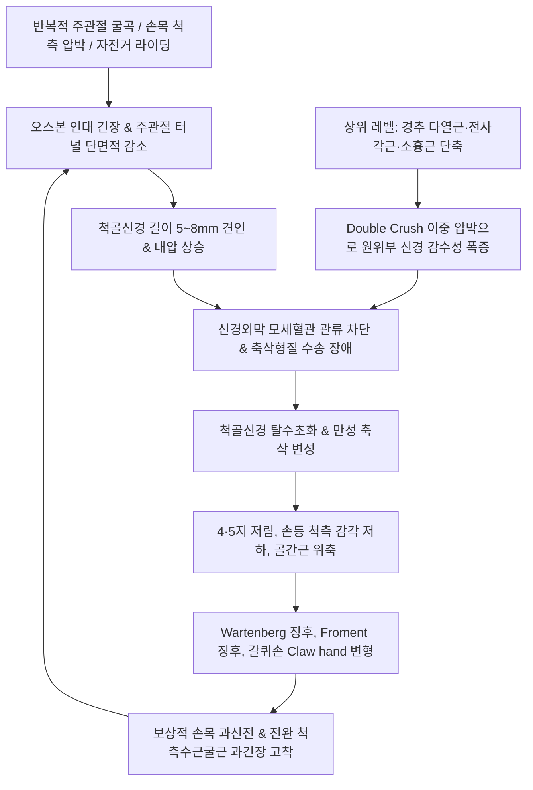

# 척골신경 포착 (Ulnar Nerve Entrapment)

> **상위 분류**: [[근골격계 질환]] > [[상지 질환]] > [[말초신경 포착 증후군]]
> **핵심 3줄 요약 (Key Summary)**:
> - 📍 병소 부위 & 해부·병태생리: [[척골신경]](Ulnar Nerve, C8~T1)이 상위 경흉추 출구부터 액와, 상완 내측, 주관절 내측상과 후구([[주관절 터널 증후군]]), 전완 척측, 손목의 가이온관([[가이온관 증후군]])에 이르는 주행 경로에서 근육·인대·골막의 비후 및 마찰로 압박되어 발생하는 신경병증.
> - 🚩 전형적 임상 양상 & 3대 징후: 손바닥 척측 1.5지 및 손등 척측 2.5지의 저림과 감각 저하, 수지 간근 쇠약으로 인한 바지 주머니 손 넣을 때의 새끼손가락 걸림(Wartenberg 징후), 갈퀴 손(Claw hand) 변형 및 [[프로망 징후]] 양성.
> - 🛠️ 핵심 감별 검사 & 한·양방 다각적 치료 전략: 상부 [[다열근]]·[[전사각근]]·[[소흉근]] 선행 감압, 주관절 [[오스본 인대]](소해 SI8) 및 수근부 가이온관(두상골) 침도·약침(1:30,000 봉약침) 시술, 두상골 요장측 글라이딩 추나 및 [[오적산]]·[[소경활혈탕]] 투여.
> - ⚠️ 응급 의뢰 레드플래그 & 악화 요인: 주관절 척골신경구 수직 직자 시 비가역적 신경 손상(Drop out/Causalgia) 위험 절대 금기, 가이온관 자침 시 외측 척골동맥 박동 확인 필수.

---

## 📌 목차
1. [질환 개요 & 해부학적 병태생리](#1-질환-개요--해부학적-병태생리)
2. [병태생리 메커니즘 & 생체역학적 악순환 네트워크](#2-병태생리-메커니즘--생체역학적-악순환-네트워크)
3. [임상 증상 & 이학적 검사(Physical Exam) 알고리즘](#3-임상-증상--이학적-검사physical-exam-알고리즘)
4. [감별 진단 매트릭스 (Differential Diagnosis)](#4-감별-진단-매트릭스-differential-diagnosis)
5. [한의 통합 치료 프로토콜 (침·약침·추나·한약)](#5-한의-통합-치료-프로토콜-침약침추나한약)
6. [양방 치료 & 병용·의뢰 기준 (Conventional Treatment & Referral)](#6-양방-치료--병용의뢰-기준-conventional-treatment--referral)
7. [재활 운동 & 생활습관 티칭 가이드](#6-재활-운동--생활습관-티칭-가이드)
8. [💡 사용자 진료실 핵심 필기 & 임상 노하우 (Melt-In 잔여 심화 집약)](#7--사용자-진료실-핵심-필기--임상-노하우-melt-in-잔여-심화-집약)
9. [출처 및 학술 참고 문헌 (References)](#8-출처-및-학술-참고-문헌-references)

---

## 1. 질환 개요 & 해부학적 병태생리

![[내측상과_척골신경_주관절터널_감별도해.svg|450]]
> [그림 1: ① 병태생리·영상 — 척골신경의 주행 및 주요 포착 부위(주관절 터널 및 가이온관) 해부도해] 상완골 내측상과 후방 주관절 터널과 수근부 가이온관을 통과하는 [[척골신경]]의 해부학적 주행 및 호발 포착 병소.

- **개념 정의 및 임상적 의의**:
  - [[척골신경 포착]](Ulnar Nerve Entrapment)은 상완신경총 내측속(Medial cord, C8~T1)에서 기원한 [[척골신경]]이 상지 주행 경로의 해부학적 협착 부위에서 외부 압박, 견인력, 마찰 및 허혈성 손상을 받아 발생하는 말초신경 압박 증후군이다.
  - 상지 말초신경 포착 질환 중 [[수근관 증후군]]에 이어 **두 번째로 높은 발생 빈도**를 차지하며, 특히 주관절 내측상과 후방의 [[주관절 터널 증후군]](Cubital Tunnel Syndrome, CuTS)과 손목 두상골-유구골 구 사이의 [[가이온관 증후군]](Guyon Canal Syndrome)이 대표적이다.
- **역학 및 호발 인자**:
  - 30~60대에서 호발하며 주관절 외반각이 크거나 팔꿈치를 구부린 채 턱을 괴는 습관, 컴퓨터 작업자, 전화 통화가 잦은 직업군, 자전거 라이더(Cyclist's palsy)에게 다발한다.
  - **다단계 압박(Double Crush) 취약성**: 경추 C8~T1 추간공 주변의 다열근 긴장, 사각근간극([[전사각근]]), 쇄골하간극([[쇄골하근]]), 오훼돌기 하부([[소흉근]])의 단축이 선행할 경우 주관절이나 완관절의 경미한 물리적 부하에도 척골신경 손상이 현저히 가속화된다.

---

## 2. 병태생리 메커니즘 & 생체역학적 악순환 네트워크

![[척골신경-전완해부-Gray812.png|450]]
> [그림 2: ② 관련 해부 구조물 — 전완 및 수부 척골신경 분지와 척측수근굴근·골간근 지배 해부도] 전완 전면 척측 구획에서 [[척측수근굴근]](FCU)과 [[심지굴근]](FDP)을 지배하고 수부 내재근으로 분지하는 [[척골신경]]의 신경-근육 연계 도해.

- **척골신경 감각 지배의 해부학적 한계성**:
  - **척골신경의 고유 감각 지배 구역은 오직 손(Hand) 부위에만 국한**된다.
    - 손바닥: 척측 1.5개 수지(제5지 전체 및 제4지의 척측 반쪽) 및 소지구(Hypothenar).
    - 손등: 척골신경 수배피지(Dorsal cutaneous branch)에 의해 제5지, 제4지, 제3지 척측 반쪽을 포함하는 약 2.5개 수지.
    - ⚠️ **전완 내측 피부 감각**: 전완 내측은 척골신경이 아니라 상완신경총 내측속에서 직접 분지하는 **내측전완피신경(MABC)**이 전담하므로 감별에 결정적 단서를 제공한다.
- **부위별 6대 포착 호발 관문**:
  1. C8, T1 경추·흉추 [[다열근]](Multifidus).
  2. [[전사각근]](Anterior Scalene) 및 [[쇄골하근]](Subclavius).
  3. [[소흉근]](Pectoralis Minor).
  4. [[척측수근굴근]](FCU) 및 오스본 인대(Osborne's Ligament).
  5. [[장장근]](Palmaris Longus) 및 굴근지대 복합체.
  6. [[소지구근]](Hypothenar Muscles) 및 가이온관(Guyon's Canal).

---

## 3. 임상 증상 & 이학적 검사(Physical Exam) 알고리즘

### 주요 임상 증상
- **감각 이상 및 허혈성 통증**:
  - 제4지 척측과 제5지의 저림, 감각 저하, 시림, 찌릿한 이상감각.
  - 팔꿈치를 90° 이상 굴곡하고 장시간 유지할 때(수면 시 팔베개, 통화 시) 증상 급격 악화.
- **골간근 쇠약 및 악력 저하**:
  - 수부 내재근([[골간근]], [[충양근]], [[무지내전근]], [[소지구근]]) 위축으로 병뚜껑 돌리기, 열쇠 돌리기 핀치력 및 악력 현저 감퇴.
  - 제1배측골간근(FDI) 위축으로 엄지-검지 사이 손등 근육 함몰.
- **특징적 기능 부전 및 기형 징후**:
  1. **바텐베르크 징후(Wartenberg's Sign)**: 손을 바지 주머니에 넣을 때 새끼손가락이 주머니 입구에 걸림 (소지 내전근 마비로 소지신근 외전 우세).
  2. **갈퀴 손 기형(Claw Hand Deformity)**: 제4·5지 중수지관절 과신전 및 지간관절 굴곡.
  3. **척골신경 역설(Ulnar Paradox)**: 고위부(팔꿈치) 포착 환자보다 저위부(손목 가이온관) 포착 환자에서 [[심지굴근]](FDP) 기능이 살아있어 지간관절을 더 강하게 굴곡시키므로 갈퀴 손 변형이 더 심하게 나타남.

### 특이적 이학적 검사 알고리즘
1. **[[프로망 징후]](Froment's Sign)**:
   - 종이를 엄지와 검지 옆면으로 쥐게 하고 당길 때, [[무지내전근]] 마비 보상으로 [[장모지굴근]](FPL)을 써서 엄지 지간관절(IP)을 굽히면 양성.
   ![[척골신경-프로망징후.jpg|450]]
   > [그림: 이학적 검사 — 프로망 징후] 척골신경 지배 무지내전근 마비 시 엄지 지간관절(IP)이 과굴곡되는 보상 반응.
2. **주관절 굴곡 검사 (Elbow Flexion Test)**:
   - 팔꿈치를 최대로 굴곡하고 손목을 신전한 상태로 60초간 유지 시 제4·5지 저림 발생 시 양성.
3. **상지 신경긴장검사 3형 (ULTT 3형)**:
   - 견관절 하강·외전, 손목 신전, 전완 회내, 주관절 완전 굴곡(안경 쓰기 자세) 시 척골신경 방사통 유발.
   ![[ULTT_3형_척골신경_신경긴장검사.jpg|450]]
   > [그림: 이학적 검사 — ULTT 3형] 주관절 터널 내 척골신경을 최대로 신장 평가하는 신경동역학 검사.
4. **티넬 징후 (Tinel's Sign)**:
   - 내측상과 후구 또는 가이온관 부위 타진 시 제4·5지로 전기가 통하는 방사통 발생 시 양성.

---

## 4. 감별 진단 매트릭스 (Differential Diagnosis)

| 질환명 | 주 통증 및 감각 저하 구역 | 운동 마비 및 특수 검사 | 감별 핵심 포인트 |
| :--- | :--- | :--- | :--- |
| **[[주관절 터널 증후군]](CuTS)** | 주관절 내측, 수부 4·5지 (장측+배측) | Froment 양성, Wartenberg 양성, 골간근 위축 | 주관절 굴곡 검사 양성, **손등 감각 저하 동반** |
| **[[가이온관 증후군]](Guyon's)** | 손목 척측, 수부 4·5지 장측 | Zone에 따라 운동/감각 선택적 침범 | **손등(Dorsal) 감각 완전 정상 보존** (분지 상부) |
| **[[경추 추간판 탈출증]](C8-T1)** | 목, 견갑골 하부, 상지 내측 전반 | 수지 굴근 전반 약화, Triceps 반사 저하 | [[스펄링 검사]](+), **전완 내측 피부 감각 저하 동반** |
| **[[흉곽출구 증후군]](TOS)** | 쇄골하, 액와, 상지 내측 전반 | 손의 파지력 약화, 레이노 현상 동반 가능 | Adson/Roos 양성, 팔 거상 시 저림 폭증 |
| **내측전완피신경(MABC) 포착** | 전완 내측(안쪽 팔뚝) 피부 표면 | **운동 마비 전혀 없음 (순수 감각신경)** | 손가락 감각은 정상, 전완 내측에만 국한된 감각 이상 |

---

## 5. 한의 통합 치료 프로토콜 (침·약침·추나·한약)

![[Pasted image 20240121053611.png|450]]
> [그림 3: ③ 치료·시술점 — 주관절 소해혈 및 수근부 가이온관(Guyon's canal) 감압 침도·약침 시술점과 두상골 가동 교정 도해] 내측상과 후구 [[오스본 인대]] 비후 부위 침도 절개 및 두상골(Pisiform) 장측-요측 관절 가동술 적용점.

### 1) 침구 치료 & 침도 요법 (Acupotomy)
- **주관절 터널 국소 침구**:
  - [[소해]](HT3), [[소해]](SI8): 내측 상과와 주두 사이 척골신경구에 15~30° 완만하게 사자하여 오스본 인대 주변 근막 긴장 완화. 2Hz 전침 통전.
- **상부 및 원위 포착점 혈위**:
  - C7~T1 화타협척혈: 다열근 심부 자침으로 신경근 출구 선행 감압.
  - 견정(GB21), 천정(SI16), 중부(LU1): 전사각근 및 소흉근 긴장 해제.
  - 양곡(SI5), 완골(SI4), 신문(HT7), 후계(SI3): 가이온관 및 소지구근 긴장 이완.
- **침도 터널 감압술 (Acupotomy Decompression)**:
  - 0.35×40mm 침도를 사용하여 내측상과 후방 척골신경구 주행선 바로 외측에서 비후된 오스본 섬유대를 종축 절개하여 척골신경 압박을 물리적으로 해제. 가이온관 부위는 수근장측인대를 미세 절개하여 관내 내압을 감압.

### 2) 약침 및 봉약침 치료 (Pharmacopuncture)
- **중성어혈약침 / 신바로약침**: 주관절 내측 상과 후방 및 두상골 외측에 0.5~1.0cc 주입하여 신경막 주위 무균성 부종 및 유착 소퇴.
- **봉약침 (Sweet BV, 1:30,000)**: 신경외막 주변 및 소해(HT3, SI8)에 0.1~0.2cc 분할 주입하여 신경 혈류 확장 및 축삭 재생 촉진.

### 3) 추나 요법 & 도수 관절 가동술 (Chuna & Manipulation)
- **두상골 가동 기법 (Pisiform Mobilization)**:
  - 두상골을 파지하고 **요측(Radial) 및 장측(Palmar) 방향으로 부드럽게 글라이딩(Gliding)**시켜 가이온관의 단면적 확장.
- **척골신경 활주 운동 (OK 안경 글라이딩)**:
  - 엄지와 검지로 원을 만들고 손바닥을 위로 향하게 한 뒤 귀 옆으로 가져가 눈에 안경을 씌우듯 가져가는 동작을 10회씩 3세트 반복.

### 4) 한약 처방 (Herbal Medicine)
- **급성 신경 부종 및 야간 저림**: [[오적산]](五積散) 합 [[당귀수산]](當歸鬚散)에 지룡(地龍), 우슬(牛膝)을 가미하여 경락 어혈을 뚫고 신경 부종을 배출.
- **만성 신경통 및 마목**: [[소경활혈탕]](疎經活血湯) 또는 [[서경탕]](舒經湯)에 [[강활]], [[독활]], 천궁, 백작약을 가미하여 척측 수지의 혈류를 복원.
- **만성 근위축 및 위증**: [[대호경간탕]](大護經肝湯), [[보양환오탕]](補陽還五湯)으로 신경축삭 재수초화 촉진.

---

## 6. 양방 치료 & 병용·의뢰 기준 (Conventional Treatment & Referral)

> 🎯 **이 섹션의 목적**: 환자가 **양방약을 이미 복용 중인 경우가 많다.** 한의원 1차 진료에서 양방 치료를 이해하고, 병용 가능·주의·금기를 판단하며, 언제 의뢰할지 결정한다.

* **약물 치료 (Medication)**:
  * 계열별 약물·용량·기간 — 국내 처방 관행 반영.
  * 작용 기전과 한의 치료와의 상호작용.
* **비약물 시술 (Procedures)**:
  * 주사·차단술·물리치료·보조기 등.
* **수술·시술 적응증 (Surgical Indication)**:
  * 언제 수술로 가는가 — 절대·상대 적응증, 수술 후 경과.
* **한의 병용 판단 (Combination Therapy)**:
  * 병용 가능 / 주의 / 금기. 복용 중 환자의 감량 타이밍·반동 현상.
* **양방·전문과 의뢰 기준 (Referral Criteria)**:
  * 응급 의뢰 트리거와 전문과 의뢰 기준(정형외과·신경외과·내과 등).

	(작성 필요)

---

## 7. 재활 운동 & 생활습관 티칭 가이드

### 재활 운동
1. **자가 척골신경 활주 스트레칭**:
   - 팔꿈치를 펴고 손목을 젖힌 상태에서 고개를 반대쪽으로 갸우뚱 젖혔다가, 팔꿈치를 구부리고 손목을 굽히며 고개를 원위치시키는 신경 활주 운동 매일 10회씩 3세트.
2. **소지 외전근 등척성 운동 및 내재근 강화**:
   - 고무줄을 손가락 사이에 끼우고 손가락을 모으고 펴는 동작을 반복하여 골간근 근위축 방지.

### 생활습관 지도
- **야간 신전 부목 착용**: 팔꿈치를 30~45° 약한 신전 상태로 유지하는 패드 착용 취침.
- **자전거 라이딩 시 핸들 패딩**: 사이클 라이더의 경우 패딩 장갑을 착용하고 핸들을 쥐는 손 위치를 수시로 변경하여 가이온관 압박 예방.

---

## 8. 💡 사용자 진료실 핵심 필기 & 임상 노하우 (Melt-In 잔여 심화 집약)

> [!TIP] **진료실 임상 관찰 포인트**
> 1. **손등(Dorsal) 감각 확인을 통한 병변 위치 감별**:
>    - 새끼손가락 손바닥뿐만 아니라 **손등(Dorsal aspect)까지 저리고 둔하다면** $\rightarrow$ **주관절 터널 증후군(CuTS)** 또는 상부 경추/흉곽출구 병변. (수배피지는 손목 위 5cm에서 분지하므로).
>    - 손바닥 4·5지는 저린데 **손등 감각은 완전히 정상이라면** $\rightarrow$ **가이온관 증후군(Guyon's canal syndrome)**.
> 2. **전완 안쪽(내측) 감각 이상 동반 시의 경고**:
>    - 환자가 4·5지 저림과 함께 **팔뚝 안쪽(전완 내측) 피부까지 저리거나 감각이 둔하다고 호소한다면**, 이는 순수 주관절 척골신경 문제가 아니라 상완신경총 내측속에서 나오는 **내측전완피신경(MABC) 침범이거나 흉곽출구 증후군(TOS), 경추 C8 신경근증이 병발**한 것이므로 상부 치료를 최우선으로 진행해야 한다.
> 3. **Wartenberg 징후의 임상적 직관성**:
>    - 환자에게 "평소 바지 주머니에 손을 쑥 넣을 때 새끼손가락만 밖으로 삐져나와 걸린 적이 있습니까?"라고 문진하면 환자가 무릎을 치며 공감하는 경우가 많으며, 이는 척골신경 마비의 매우 신뢰도 높은 조기 징후이다.
> 4. **자침 및 침도 시술 시 절대 안전 수칙**:
>    - 주관절 터널 부위(소해 SI8)에서 수직으로 깊숙이 직자하면 척골신경 본간을 관통할 수 있으므로, 반드시 완만하게 사자하거나 신경 외측 오스본 인대 부착부 골막에 안전하게 접촉시켜야 한다.
>    - 가이온관 시술 시에는 두상골 외측 척골동맥 박동을 손가락으로 먼저 확인한 후 동맥을 외측으로 견인 보호하면서 자침해야 한다.

---

## 9. 출처 및 학술 참고 문헌 (References)

1. Hu T, Zhou H. Geometric and biomechanical perspectives on ulnar nerve compression in cubital tunnel syndrome: pathomechanics and surgical strategies. *Ann Med Surg (Lond)*. 2026;88(1):142-151. [PMID: 41496932](https://pubmed.ncbi.nlm.nih.gov/41496932/)
   - [연구 요약] 주관절 굴곡 시 주관절 터널 내압 상승(오스본 인대 긴장, 척측수근굴근 두 갈래 간격 협소화)과 척골신경의 신장·견인·마찰 복합 생체역학 메커니즘을 상세히 규명.
2. Dua A, Gillespie E. Guyon Canal Syndrome. *StatPearls*. 2026. [PMID: 28613717](https://pubmed.ncbi.nlm.nih.gov/28613717/)
   - [연구 요약] 두상골과 유두골 구 사이 가이온관(Guyon's canal)의 3개 구역(Zone 1: 혼합, Zone 2: 심부 운동지, Zone 3: 천부 감각지)별 포착 증상과 수근부 직업적 압박 기전을 정립.
3. Cosentino A, Carlier Y, Rennie WJ et al. Ultrasound evaluation of the ulnar nerve in cubital tunnel syndrome: anatomy, normal and abnormal findings, and postoperative aspects. *J Ultrason*. 2026;26(104):e51-e60. [PMID: 41924321](https://pubmed.ncbi.nlm.nih.gov/41924321/)
   - [연구 요약] 주관절 터널 증후군에서 척골신경의 단면적(CSA > 10 mm²) 비대, 신경 부종 및 내측 상과를 넘어가는 동적 아탈구 현상을 초음파로 진단하는 표준화된 기준을 제시.
4. Tong J, Xu B, Zhang C et al. Surgical outcome for type I Guyon's canal syndrome with claw hand deformity: a review of 11 patients. *Acta Neurochir (Wien)*. 2026;168(5):135-142. [PMID: 42065727](https://pubmed.ncbi.nlm.nih.gov/42065727/)
   - [연구 요약] 갈퀴 손 변형을 동반한 제1형 가이온관 증후군 환자에서 감압술 후 수부 내재근 근력 회복과 전기진단학적 예후 지표를 분석.

<!-- 보관 태그(1회용·링크오류, 필요시 복원): 주관절터널증후군 -->
