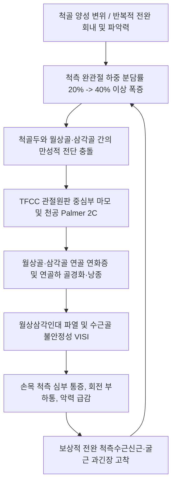

---
aliases:
  - 척골충돌 증후군
  - Ulnar Impaction Syndrome
  - Ulnocarpal Abutment Syndrome
  - 삼각섬유연골복합체 충돌
  - TFCC 충돌 증후군
  - 척골두 충돌 증후군
tags:
  - 이론
  - 근골격계질환
  - 수관절
categories:
  - 근골격계 질환
  - 상지
created: 2024-01-21
updated: 2026-09-24
title: 척골충돌 증후군
date: 2026-09-24
출처: "PMID: 42749318"
---

# 척골충돌 증후군 (Ulnar Impaction Syndrome)

> **상위 분류**: [[근골격계 질환]] > [[상지 질환]] > [[수부 질환]]
> **핵심 3줄 요약 (Key Summary)**:
> - 📍 병소 부위 & 해부·병태생리: 척골이 요골에 비해 상대적으로 길어지는 척골 양성 변위(Positive Ulnar Variance) 또는 과도한 수근부 척측 축성 부하로 인해, 척골두가 [[삼각섬유연골복합체]](TFCC), [[월상골]], [[삼각골]]과 반복적으로 충돌하며 퇴행성 파열과 연골 연화를 일으키는 질환.
> - 🚩 전형적 임상 양상 & 3대 징후: 손목 관절 척골 쪽의 묵직한 심부 통증, 손목을 척측으로 꺾거나 문손잡이·걸레를 비트는 회전 부하 시 극심한 통증과 염발음(Clicking), 척골 소와(Fovea) 부위의 뚜렷한 압통 및 척수근 압박 검사 양성.
> - 🛠️ 핵심 감별 검사 & 한·양방 다각적 치료 전략: 양곡(SI5) 척수근 관절강 및 척골 소와 함요부 침도·약침(황련해독탕, 1:30,000 봉약침) 시술, 원위 요척관절(DRUJ) 배측 변위 교정 추나, 손목 중립 부목 지도 및 [[오적산]]·[[대호경간탕]] 투여.
> - ⚠️ 응급 의뢰 레드플래그 & 악화 요인: 양곡혈 자침 시 척골신경 수배피지 손상 주의, 보존적 치료 실패 및 월상골 광범위 골괴사 진행 시 척골 단축 골절술(USO) 협진 필요.

---

## 📌 목차
1. [질환 개요 & 해부학적 병태생리](#1-질환-개요--해부학적-병태생리)
2. [병태생리 메커니즘 & 생체역학적 악순환 네트워크](#2-병태생리-메커니즘--생체역학적-악순환-네트워크)
3. [임상 증상 & 이학적 검사(Physical Exam) 알고리즘](#3-임상-증상--이학적-검사physical-exam-알고리즘)
4. [감별 진단 매트릭스 (Differential Diagnosis)](#4-감별-진단-매트릭스-differential-diagnosis)
5. [한의 통합 치료 프로토콜 (침·약침·추나·한약)](#5-한의-통합-치료-프로토콜-침약침추나한약)
6. [재활 운동 & 생활습관 티칭 가이드](#6-재활-운동--생활습관-티칭-가이드)
7. [💡 사용자 진료실 핵심 필기 & 임상 노하우 (Melt-In 잔여 심화 집약)](#7--사용자-진료실-핵심-필기--임상-노하우-melt-in-잔여-심화-집약)
8. [출처 및 학술 참고 문헌 (References)](#8-출처-및-학술-참고-문헌-references)

---

## 1. 질환 개요 & 해부학적 병태생리

![[손목 기능성 통증-20240914224646447.png|450]]
> [그림 1: ① 병태생리·영상 — 손목 척측 통증의 호발 부위와 삼각섬유연골복합체(TFCC) 손상 및 척골 충돌 발생 영역] 척골두와 월상골·삼각골 사이 척측 완관절의 압박 호발 부위.

- **개념 정의 및 임상적 의의**:
  - [[척골충돌 증후군]](Ulnar Impaction Syndrome / Ulnocarpal Abutment Syndrome)은 원위 척골두(Ulnar head)와 척측 수근골인 [[월상골]](Lunate) 및 [[삼각골]](Triquetrum) 사이에 과도한 생체역학적 축성 부하(Axial load)가 지속되어, 중간에 완충 역할을 하는 [[삼각섬유연골복합체]](TFCC)의 마모 및 관절 연골의 퇴행성 마모, 연골하 골경화, 골낭종 형성을 초래하는 진행성 퇴행성 관절 질환이다.
  - 손목의 척골 쪽 통증(Ulnar-sided wrist pain)을 유발하는 가장 대표적인 원인 질환 중 하나이며, 문손잡이를 돌리거나 수건을 짜는 동작, 바닥을 손으로 짚고 일어나는 동작 등 손목을 비틀고 척측 편위(Ulnar deviation)시키는 일상적 동작에서 극심한 통증을 유발한다.
- **역학 및 호발 요인**:
  - **선천적 vs 후천적 척골 양성 변위**:
    - 선천적: 골성 성장에 의해 선천적으로 척골이 요골보다 2mm 이상 길게 형성된 척골 양성 변위(Positive ulnar variance) 환자.
    - 후천적: 원위 요골 골절(Colles fracture) 후 요골 단축 유합, 소아 성장판 조기 폐쇄, 원위 요척관절(DRUJ)의 불안정성.
  - **직업 및 스포츠 요인**: 라켓 스포츠(테니스, 배드민턴), 골프, 체조, 중량 리프팅 선수, 전완의 반복적인 회내(Pronation) 및 강한 파지력을 사용하는 육체 노동자에게 다발한다.

---

## 2. 병태생리 메커니즘 & 생체역학적 악순환 네트워크

![[수근부_신전건_구획_해부도해_Wrist_extensor_compartments.png|450]]
> [그림 2: ② 관련 해부 구조물 — 수근부 배측 신전건 구획과 척골두 해부도] 제6구획의 [[척측수근신근]](ECU) 건초와 원위 요척관절(DRUJ) 및 TFCC의 인접 해부학적 관계.

- **척골 양성 변위와 TFCC 복합체 손상 메커니즘**:
  - 정상적인 손목 관절(Neutral variance)에서는 손목을 통해 전달되는 축성 하중의 약 80%는 원위 요골이 담당하고, 나머지 20%만이 척골두와 TFCC를 통해 전달된다.
  - 척골이 요골보다 2.5mm 길어지면(Positive variance), 척측 완관절에 가해지는 하중 분담률이 **40% 이상으로 2배 폭증**한다.
  - 전완이 회내(Pronation)되거나 물건을 꽉 쥘 때(Power grip) 척골은 기능적으로 1~2mm 더 원위부로 전위(Dynamic positive variance)되어 충돌 압력이 극대화된다.
- **Palmer Type II 퇴행성 병기 분류**:
  - Class II-A: TFCC 관절원판 중심부 마모 및 비후 (천공 없음).
  - Class II-B: TFCC 관절원판 마모 + 월상골/삼각골 연골 연화증.
  - Class II-C: **TFCC 관절원판 중심부 완전 천공** + 골 연골 연화.
  - Class II-D: TFCC 천공 + 월상삼각인대(LT ligament) 완전 파열.
  - Class II-E: 척수근 관절 전반의 진행성 골관절염, 골극 형성.

---

## 3. 임상 증상 & 이학적 검사(Physical Exam) 알고리즘

### 주요 임상 증상
- **손목 관절 척골 쪽의 심부 통증**: 척골두와 수근골 사이, 특히 척골 소와(Fovea) 및 척측 완관절 부위에 묵직하고 쑤시는 통증 지속.
- **손목 비틀기 및 회전 부하 시 악화**:
  - 문손잡이를 돌릴 때, 젖은 수건을 짤 때(전완 회내 + 척측 편위).
  - 프라이팬이나 무거운 주전자를 한 손으로 들어 올릴 때.
  - 바닥에 손바닥을 짚고 일어설 때 완관절 과신전 및 축성 압박으로 통증 급증.
- **기계적 마찰음 (Clicking / Snapping)**: 전완 회내-회외 시 척골두가 TFCC 손상 부위나 월상골과 마찰하며 딱딱거리는 염발음과 걸림 감각 발생.
- **악력 저하 (Grip Strength Loss)**: 통증으로 인해 물건을 쥐는 힘이 반대측 대비 30~50% 이상 감소.

### 특이적 이학적 검사 알고리즘
1. **척수근 압박 검사 (Ulnocarpal Stress Test)**:
   - 손목을 최대로 척측 편위(Ulnar deviation)시킨 상태에서 축성 압박력(Axial compression)을 가하며 전완을 회내-회외 회전시킬 때 통증이나 염발음 발생 시 양성.
2. **척골 소와 징후 (Ulnar Fovea Sign)**:
   - 척골 경상돌기와 [[척측수근굴근]](FCU) 건 사이의 오목한 연부조직 함요부(Fovea)를 깊게 압박할 때 날카로운 통증 호소 시 양성 (감도 95%, 특이도 86%).
3. **피아노 건 징후 (Piano Key Test)**:
   - 돌출된 원위 척골두를 아래로 눌렀다 놓을 때 탄발적으로 튀어 오르면 원위 요척관절(DRUJ) 인대 파열 및 불안정성 시사.

---

## 4. 감별 진단 매트릭스 (Differential Diagnosis)

| 질환명 | 주 통증 부위 | 호발 기전 및 특징 | 감별 검사 포인트 |
| :--- | :--- | :--- | :--- |
| **[[척골충돌 증후군]]** | 척골두-월상골 사이 척측 관절 | 척골 양성 변위, 손목 비틀기/짚기 악화 | Ulnocarpal stress test 양성, X-ray 양성 변위 |
| **급성 외상성 [[TFCC 손상]]** | 척골 소와 함요부 | 손 짚고 넘어짐(FOOSH 손상), 젊은 층 | Ulnar fovea sign 양성, 척골 변위 없을 수 있음 |
| **[[척측수근신근]] 건초염** | 제6신전구획(척골두 등쪽) | 손목 과다 굴곡/신전 반복, 스윙 운동 | ECU 저항 신전/척측편위 시 통증, 건 주위 부종 |
| **[[척측수근굴근]] 건염** | 손목 안쪽 두상골 부착부 | 손목 굴곡 및 척측 편위 과사용 | 두상골 국소 압통, FCU 저항 굴곡 시 통증 |
| **월상삼각 해리(LT Dissociation)** | 월상골-삼각골 사이 | 손목 과신전 외상, 수근골 불안정 | Reagan's ballottement test 양성, VISI 변형 |
| **[[가이온관 증후군]]** | 손목 척측 손바닥, 4·5지 | 척골신경 압박, 자전거 라이더 | 4·5지 저림, 감각 저하, Froment sign 양성 |

---

## 5. 한의 통합 치료 프로토콜 (침·약침·추나·한약)

![[Extensor_carpi_ulnaris_TriggerPoints.jpg|450]]
> [그림 3: ③ 치료·시술점 — 척골충돌 증후군 척측 손목 관절면 감압 양곡혈 및 척측수근신근(ECU) 발통점 침구·약침 시술점 도해] 척수근 관절강 및 [[척측수근신근]] 건막 긴장 해소를 표적하는 취혈 목표점.

### 1) 침구 치료 & 침도 요법 (Acupotomy)
- **국소 혈위**:
  - [[양곡]](SI5): 척골 경상돌기와 삼각골 사이 함요부로, 척수근 관절낭 직상방에 위치하여 TFCC 염증을 해소하는 핵심 요혈.
  - [[양지]](TE4), [[외관]](TE5): 완관절 배측 안정화 및 상지 삼초경 순환 촉진.
  - [[후계]](SI3), [[완골]](SI4): 소장경의 원혈과 유혈로 척측 완관절 건막 긴장 해제.
- **원위 및 근육 혈위**: [[척측수근신근]](ECU) 및 [[척측수근굴근]](FCU) 근복 내 압통점에 자침하여 전완 척측 근육의 강직성 구축 이완.
- **침도 터널 감압술**: 만성 척골충돌로 인해 원위 요척관절 척측 지대 및 관절낭의 섬유화 유착이 심한 경우, 0.35×40mm 침도로 양곡 혈위에서 척골두 외측 관절낭 섬유대를 따라 종축으로 미세 절개·박리하여 관절낭 내압을 감압.

### 2) 약침 및 봉약침 치료 (Pharmacopuncture)
- **중성어혈약침 / 황련해독탕 약침**: 급성기 척골 소와 및 척수근 관절낭 내로 0.5cc 주입하여 관절강 내 활액막염과 부종 신속 억제.
- **봉약침 (Sweet BV, 1:30,000)**: 만성기 퇴행성 마모 단계에서 정제봉독(0.05mg/ml)을 양곡 혈위 및 척골두 주변 인대에 주입하여 혈류 촉진, 사이토카인 조절 및 섬유연골 치유 촉진.
- **녹용 및 자하거 약침**: 월상골 연골 연화증 및 골수 부종이 동반된 만성 환자에게 관절 주변 주입하여 골기질 재생 촉진.

### 3) 추나 요법 & 수근골 가동술 (Chuna & Manipulation)
- **원위 요척관절(DRUJ) 교정술**: 손목을 가볍게 견인한 상태에서, 돌출된 척골두를 손바닥 쪽(Palmar glide)으로 밀어 넣고 요골두를 배측(Dorsal glide)으로 교차 유도하여 척골두의 배측 아탈구 변위 정렬.
- **삼각골-월상골 축성 견인 추나**: 수근골을 장축 방향으로 견인하여 척골두와 월상골 사이의 관절 간격을 일시적으로 벌려주고 활액 순환 촉진.

### 4) 한약 처방 (Herbal Medicine)
- **급성 종통기**: [[오적산]](五積散) 또는 [[당귀수산]](當歸鬚散)에 유향, 몰약, 도인을 가미하여 척측 관절 내 미세 출혈과 어혈 흡수.
- **만성 퇴행성 골비**: [[대호경간탕]](大護經肝湯) 또는 [[독활기생탕]](獨活寄生湯)에 속단, 보골지, 골쇄보를 가미하여 연골 기질과 인대의 결합력 강화.

---

## 6. 재활 운동 & 생활습관 티칭 가이드

### 재활 운동
1. **원위 요척관절 안정화 등척성 회내-회외 운동**:
   - 팔꿈치를 90° 구부리고 손에 망치나 가벼운 막대를 쥔 상태에서 전완 회내 및 회외 방향으로 5초간 등척성 버티기 10회 3세트.
2. **척측수근신근 원심성 강화 훈련**:
   - 덤벨을 쥐고 손목을 척측 편위시켰다가 천천히 제자리로 돌아오는 동작을 통해 힘줄 탄력성 복원.

### 생활습관 지도
- **바닥 짚기 금지 (Knuckle 푸시)**:
  - 손바닥으로 바닥을 짚고 일어나는 행위는 척골두에 체중의 수십 배에 달하는 전단 압력을 가하므로, 반드시 주먹을 쥐고 너클(Knuckle)로 짚거나 의자 팔걸이를 잡도록 지도.
- **수근부 보호 부목 착용**: 초기 4~6주간 손목의 척측 편위를 제한하는 맞춤형 손목 스트랩 또는 부목 착용.

---

## 7. 💡 사용자 진료실 핵심 필기 & 임상 노하우 (Melt-In 잔여 심화 집약)

> [!TIP] **진료실 임상 관찰 포인트**
> 1. **문손잡이 회전통(Twisting pain)의 확인**:
>    - 환자가 "손잡이를 비틀거나 걸레를 짤 때 새끼손가락 쪽 손목이 빠개지듯 아프다"고 하면 1순위로 척골충돌 증후군과 TFCC 손상을 의심한다.
> 2. **단순 X-ray의 척골 변위 육안 확인**:
>    - 손목 PA 방사선 사진에서 요골 관절면과 척골두 관절면의 수평선을 그어 척골이 요골보다 2mm 이상 길게 튀어나와 있다면 척골충돌 증후군의 구조적 취약성을 90% 이상 확진할 수 있다.
> 3. **안전 시술 가이드라인**:
>    - 양곡(SI5) 혈위 자침 시 척골두 주변을 횡단하는 척골신경 수배피지(Dorsal branch)를 주의해야 하며, 4·5지 손등으로 찌릿한 방전통이 나타나면 즉시 침을 1~2mm 후퇴시켜야 한다.
> 4. **수술 전원 기준**:
>    - 3개월 이상의 적극적인 한의 복합 보존 치료에도 불구하고 파지력이 계속 떨어지고, MRI상 월상골의 광범위한 낭종성 골괴사 또는 월상삼각인대 완전 파열로 인한 수근골 불안정성이 진행되는 경우 정형외과 척골 단축술(USO) 협진을 적극 고려한다.

---

## 8. 출처 및 학술 참고 문헌 (References)

1. Asian Pacific Wrist Association Specialist Guideline Group. Guidelines for the Diagnosis and Treatment of Ulnar Impaction Syndrome. *Zhongguo Xiu Fu Chong Jian Wai Ke Za Zhi*. 2026;40(9):1025-1033. [PMID: 42749318](https://pubmed.ncbi.nlm.nih.gov/42749318/)
   - [연구 요약] 척골충돌 증후군의 병태생리, 척골 양성 변위의 영상의학적 측정 기준, 관절경적 TFCC 절제술 및 척골 단축 골절술의 단계별 치료 가이드라인을 정립.
2. Nabeshima K, Matsuura Y, Yamazaki T et al. Influence of Dynamic Factors on Ulnar Impaction Syndrome: An Axial Compression Test Using Fresh-Frozen Cadavers. *J Hand Surg Am*. 2026;51(9):871-879. [PMID: 41931084](https://pubmed.ncbi.nlm.nih.gov/41931084/)
   - [연구 요약] 사체 연구를 통해 전완 회내 및 파지력 작용 시 척골의 동적 원위 전위가 척수근 관절 접촉압을 급격히 증가시키는 생체역학적 기전을 정량적으로 증명.
3. Wan Y, Zhang J, Li Y. Research status and clinical progress of ulnar shortening osteotomy for ulnar impaction syndrome. *Zhongguo Xiu Fu Chong Jian Wai Ke Za Zhi*. 2026;40(9):1142-1148. [PMID: 42749333](https://pubmed.ncbi.nlm.nih.gov/42749333/)
   - [연구 요약] 난치성 척골충돌 증후군에서 척골 단축 골절술의 하중 감압 효과, 골유합률, 원위 요척관절 안정성 및 장기 임상 예후를 종합 분석.

<!-- 보관 태그(1회용·링크오류, 필요시 복원): 척측손목통증, TFCC -->
