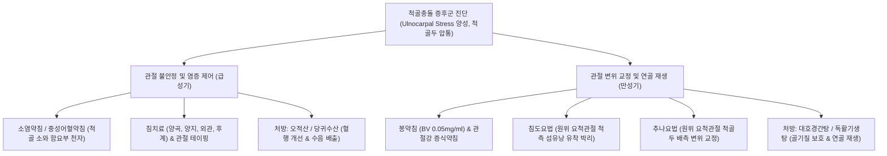

---
aliases:
  - 척골충돌 증후군
  - Ulnar Impaction Syndrome
  - Ulnocarpal Abutment Syndrome
  - 삼각섬유연골복합체 충돌
  - TFCC 충돌 증후군
  - 척골두 충돌 증후군
tags:
  - 근골격계질환
  - 수관절
  - 척측손목통증
  - TFCC
categories:
  - 근골격계 질환
  - 상지
created: 2024-01-21
updated: 2026-09-18
---

# 척골충돌 증후군 (Ulnar Impaction Syndrome)

> **핵심 3줄 요약 (Key Summary)**:
> - 🎯 척골이 요골에 비해 상대적으로 길어지는 척골 양성 변위(Positive Ulnar Variance) 또는 과도한 수근부 척측 축성 부하로 인해, 척골두가 [[삼각섬유연골복합체]](TFCC), [[월상골]], [[삼각골]]과 반복적으로 충돌하며 퇴행성 파열과 연골 연화를 일으키는 질환
> - 🚩 손목 관절 척골 쪽의 묵직한 통증, 손목을 척측으로 꺾거나 문손잡이·걸레를 비트는 회전 부하 시 극심한 통증과 염발음(Clicking), 척골두 부위의 뚜렷한 압통 및 척수근 압박 검사 양성
> - 🔍 한의학적으로 비증(痺證), 완관절풍(腕關節風)으로 보며, 원위 요척관절 및 수근간 관절의 변위를 교정하는 추나요법, TFCC 척측 함요부 봉약침·소염약침, [[오적산]]·[[대호경간탕]] 투여를 통해 척측 수근부 부하 분산 및 관절 연골 보호
> - ⚠️ 보존적 한의 치료에 반응하지 않고 척골 양성 변위가 극심하여 진행성 월상골 연골 결손이 동반된 경우 척골 단축 골절술(Ulnar Shortening Osteotomy) 등 외과적 협진 감별 필요

---

## 목차 (Table of Contents)
- [[#1. 개요 및 역학 (Overview & Epidemiology)]]
- [[#2. 병태생리 및 생체역학적 충돌 기전 (Pathophysiology & Biomechanics)]]
  - [[#2.1 척골 양성 변위와 TFCC 복합체 손상]]
  - [[#2.2 Palmer Type II 퇴행성 병기 분류]]
- [[#3. 임상 증상 및 특징적 통증 패턴 (Clinical Features)]]
- [[#4. 이학적 검사 및 영상의학적 진단 (Physical Examination & Diagnosis)]]
- [[#5. 감별 진단 (Differential Diagnosis)]]
- [[#6. 통합의학적 치료 전략 (Management Strategies)]]
  - [[#6.1 양방 의학적 치료 프로토콜]]
  - [[#6.2 한의학적 복합 치료 프로토콜]]
- [[#7. 진료실 핵심 임상 필기 (Clinical Pearls & Practice Tips)]]
- [[#8. 출처 및 학술 참고 문헌 (References)]]

---

## 1. 개요 및 역학 (Overview & Epidemiology)

### 1.1 정의 및 임상적 의의
[[척골충돌 증후군]](Ulnar Impaction Syndrome / Ulnocarpal Abutment Syndrome)은 원위 척골두(Ulnar head)와 척측 수근골인 [[월상골]](Lunate) 및 [[삼각골]](Triquetrum) 사이에 과도한 생체역학적 축성 부하(Axial load)가 지속되어, 중간에 완충 역할을 하는 [[삼각섬유연골복합체]](Triangular Fibrocartilage Complex, TFCC)의 마모 및 관절 연골의 퇴행성 마모, 연골하 골경화, 골낭종 형성을 초래하는 진행성 퇴행성 관절 질환이다.
손목의 척골 쪽 통증(Ulnar-sided wrist pain)을 유발하는 가장 대표적인 원인 질환 중 하나이며, 문손잡이를 돌리거나 수건을 짜는 동작, 바닥을 손으로 짚고 일어나는 동작 등 손목을 비틀고 척측 편위(Ulnar deviation)시키는 일상적 동작에서 극심한 통증을 유발한다.

![[손목 기능성 통증-20240914224646447.png|450]]
> [그림 1] 손목 척측 통증의 호발 부위: 삼각섬유연골복합체(TFCC) 손상 및 척골 충돌 발생 영역

### 1.2 역학 및 호발 요인
- **선천적 vs 후천적 척골 양성 변위**:
  - **선천적**: 골성 성장에 의해 선천적으로 척골이 요골보다 2 mm 이상 길게 형성된 척골 양성 변위(Positive ulnar variance) 환자.
  - **후천적**: 원위 요골 골절(Colles fracture) 후 요골 단축 유합, 소아 성장판 조기 폐쇄, 원위 요척관절(DRUJ)의 불안정성.
- **직업 및 스포츠 요인**: 라켓 스포츠(테니스, 배드민턴), 골프, 체조, 중량 리프팅 선수, 전완의 반복적인 회내(Pronation) 및 강한 파지력을 사용하는 육체 노동자에게 다발한다.

---

## 2. 병태생리 및 생체역학적 충돌 기전 (Pathophysiology & Biomechanics)

### 2.1 척골 양성 변위와 TFCC 복합체 손상
정상적인 손목 관절(Neutral variance)에서는 손목을 통해 전달되는 축성 하중의 약 **80%는 원위 요골**이 담당하고, 나머지 **20%만이 척골두와 TFCC**를 통해 전달된다.
- **변위에 따른 하중 변화**:
  - 척골이 요골보다 2.5 mm 길어지면(Positive variance), 척측 완관절에 가해지는 하중 분담률이 **40% 이상으로 2배 폭증**한다.
  - 반대로 전완이 회내(Pronation)되거나 물건을 꽉 쥘 때(Power grip) 척골은 기능적으로 1~2 mm 더 원위부로 전위(Dynamic positive variance)되어 충돌 압력이 극대화된다.
- **조직 파괴 연쇄 반응**:
  - 척골두의 과도한 압박 $\rightarrow$ TFCC 관절원판(Articular disc)의 만성 마모 및 천공(Central perforation) $\rightarrow$ 월상골간 인대(Lunotriquetral ligament) 손상 $\rightarrow$ 월상골 척측 근위부 및 삼각골 요측의 연골 연화, 연골 결손, 연골하 골경화(Subchondral sclerosis) 및 골낭종 형성.

![[수근부_신전건_구획_해부도해_Wrist_extensor_compartments.png|450]]
> [그림 2] 수근부 배측 신전건 구획과 척골두: 제6구획의 [[척측수근신근]](ECU) 건초와 원위 요척관절 및 TFCC의 인접 해부학

### 2.2 Palmer Type II 퇴행성 병기 분류 (Palmer Classification)
| 병기 | 병리 소견 | 주요 임상 양상 |
| :--- | :--- | :--- |
| **Class II-A** | TFCC 관절원판 중심부의 마모 및 비후 (천공 없음) | 손목 척측의 가벼운 둔통, 척측 편위 시 뻐근함 |
| **Class II-B** | TFCC 관절원판 마모 + 월상골/삼각골 연골 연화증 | 비틀기 동작 시 뚜렷한 통증, 척골 소와 압통 |
| **Class II-C** | **TFCC 관절원판 중심부 완전 천공** + 골 연골 연화 | 염발음(Clicking), 파지력 저하, 운동통 심화 |
| **Class II-D** | TFCC 천공 + 월상삼각인대(LT ligament) 완전 파열 | 월상골-삼각골 불안정성(VISI 변형 위험), 마찰음 |
| **Class II-E** | 척수근 관절 전반의 진행성 골관절염, 골극 형성 | 만성 가동범위 제한, 관절 강직, 지속적 휴식통 |

---

## 3. 임상 증상 및 특징적 통증 패턴 (Clinical Features)

### 3.1 주요 자각 증상
- **손목 관절 척골 쪽의 심부 통증**: 척골두와 수근골 사이, 특히 손목 등쪽-안쪽의 척골 소와(Fovea) 및 척측 완관절 부위에 묵직하고 쑤시는 통증이 지속된다.
- **손목 비틀기 및 회전 부하 시 악화**:
  - 문손잡이를 돌릴 때, 젖은 걸레나 수건을 짤 때(전완 회내 + 척측 편위).
  - 프라이팬이나 무거운 주전자를 한 손으로 들어 올릴 때.
  - 바닥에 손바닥을 짚고 일어설 때 완관절 과신전 및 축성 압박으로 통증 급증.
- **기계적 마찰음(Clicking / Snapping)**: 전완을 회내-회외 회전할 때 척골두가 TFCC 손상 부위나 월상골과 마찰하면서 딱딱거리는 염발음과 걸림 감각이 발생한다.
- **악력 저하(Grip Strength Loss)**: 척측 통증으로 인해 물건을 쥐는 힘이 반대측 대비 30~50% 이상 감소한다.

---

## 4. 이학적 검사 및 영상의학적 진단 (Physical Examination & Diagnosis)

![[Extensor_carpi_ulnaris_TriggerPoints.jpg|500]]
> [그림 3] 척측 손목 통증의 감별 타겟: [[척측수근신근]](ECU) 발통점(TrP) 및 척측 손목 관절면으로의 방사통/연관통 패턴

### 4.1 특수 이학적 유발 검사
1. **척수근 압박 검사(Ulnocarpal Stress Test)**:
   - 환자의 팔꿈치를 책상에 지지하고 손목을 최대로 척측 편위(Ulnar deviation)시킨 상태에서, 수근부에 축성 압박력(Axial compression)을 가하며 전완을 능동적·수동적으로 회내-회외 회전시킨다.
   - 척골두와 월상골 사이에서 심한 통증이나 염발음이 유발되면 양성이다.
2. **척골 소와 징후(Ulnar Fovea Sign)**:
   - 척골 경상돌기(Ulnar styloid)와 [[척측수근굴근]](FCU) 건 사이의 오목한 연부조직 함요부(Fovea)를 검사자의 엄지로 깊게 압박한다.
   - 환자가 깜짝 놀랄 정도의 날카로운 통증을 호소하면 TFCC 기저부 파열 및 척골 충돌 양성(감도 95%, 특이도 86%).
3. **피아노 건 징후(Piano Key Test)**:
   - 전완을 회내시킨 상태에서 돌출된 원위 척골두를 피아노 건반을 누르듯 아래로 압박했다가 놓을 때, 척골두가 탄발적으로 튀어 오르며 통증이 유발되면 원위 요척관절(DRUJ) 인대 파열 및 불안정성을 시사한다.

### 4.2 영상의학적 평가
- **단순 방사선 검사(Standard PA View)**:
  - 어깨 90도 외전, 팔꿈치 90도 굴곡, 전완 중립위 상태의 정확한 손목 PA 뷰를 촬영하여 척골 양성 변위(Ulnar Variance > +2 mm)를 측정한다.
  - 전완 회내-그립 뷰(Pronated-grip view)를 추가 촬영하여 동적 척골 전위 상태를 평가한다.
  - 만성 환자에서는 월상골 척측 근위부의 골경화(Sclerosis), 낭종성 변화, 삼각골의 퇴행성 골극이 관찰된다.
- **자기공명영상(MRI / MR Arthrography)**:
  - TFCC 관절원판 중심부의 불연속성(Perforation), 월상삼각인대(LT ligament) 파열, 월상골과 척골두의 연골하 골수 부종(Bone marrow edema)을 확진한다.

---

## 5. 감별 진단 (Differential Diagnosis)

| 질환명 | 주 통증 부위 | 호발 기전 및 특징 | 감별 검사 포인트 |
| :--- | :--- | :--- | :--- |
| [[척골충돌 증후군]] | 척골두-월상골 사이 척측 관절 | 척골 양성 변위, 손목 비틀기/짚기 악화 | Ulnocarpal stress test 양성, X-ray 양성 변위 |
| **급성 외상성 [[TFCC 손상]]** | 척골 소와 함요부 | 손 짚고 넘어짐(FOOSH 손상), 젊은 층 | Ulnar fovea sign 양성, 척골 변위 없을 수 있음 |
| **[[척측수근신근]] 건초염** | 제6신전구획(척골두 등쪽) | 손목 과다 굴곡/신전 반복, 스윙 운동 | ECU 저항 신전/척측편위 시 통증, 건 주위 부종 |
| **[[척측수근굴근]] 건염** | 손목 안쪽 두상골 부착부 | 손목 굴곡 및 척측 편위 과사용 | 두상골 국소 압통, FCU 저항 굴곡 시 통증 |
| **월상삼각 해리(LT Dissociation)** | 월상골-삼각골 사이 | 손목 과신전 외상, 수근골 불안정 | Reagan's ballottement test 양성, VISI 변형 |
| [[가이온관 증후군]] | 손목 척측 손바닥, 4·5지 | 척골신경 압박, 자전거 라이더 | 4·5지 저림, 감각 저하, Froment sign 양성 |

---

## 6. 통합의학적 치료 전략 (Management Strategies)

### 6.1 양방 의학적 치료 프로토콜
1. **1차 보존적 치료 (3~6개월)**:
   - **수근부 고정**: 손목을 중립위에 고정하는 맞춤형 부목(Wrist splint) 또는 척측 편위 제한 테이핑 4~6주 적용.
   - 소염진통제(NSAIDs) 투여 및 비틀기 작업 금기.
   - 초음파 유도하 TFCC 척수근 관절강 내 스테로이드 국소 주사(급성 통증 조절 목적, 연골 파괴 방지를 위해 연 2~3회 이내로 제한).
2. **수술적 치료 고려 (보존적 치료 실패, 구조적 골 충돌 지속 시)**:
   - **관절경하 TFCC 변연절제술(Wafer Procedure)**: 척골 변위가 2 mm 미만인 경우 관절경으로 척골두 원위 연골 2~3 mm를 깎아내어 감압.
   - **척골 단축 골절술(Ulnar Shortening Osteotomy, USO)**: 척골 간부(Shaft)를 2~4 mm 절제하고 금속판으로 고정하여 척골의 길이를 요골과 같거나 약간 짧게(Neutral 또는 Negative) 교정함으로써 척측 하중을 원천적으로 차단.

### 6.2 한의학적 복합 치료 프로토콜
한의학적으로 척골충돌 증후군은 비증(痺證), 완관절통(腕關節痛), 골비(骨痺)의 범주에 속하며, 어혈조락(瘀血阻絡), 풍한습비(風寒濕痺), 간신휴손(肝腎虧損)으로 변증한다.

#### 1) 침구 치료
- **국소 혈위**:
  - 양곡(SI5): 척골 경상돌기와 삼각골 사이 함요부로, 척수근 관절낭 직상방에 위치하여 TFCC 염증을 해소하는 요혈.
  - 양지(TE4), 외관(TE5): 완관절 배측 안정화 및 상지 삼초경 순환 촉진.
  - 후계(SI3), 완골(SI4): 소장경의 원혈과 유혈로 척측 완관절 건막 긴장 해제.
- **근육 혈위**: [[척측수근신근]](ECU) 및 [[척측수근굴근]](FCU) 근복 내 압통점에 자침하여 전완 척측 근육의 강직성 구축을 이완.

#### 2) 약침 요법
- **중성어혈약침 및 황련해독탕 약침**: 급성기 척골 소와(Fovea) 및 척수근 관절낭 내로 0.5 cc 주입하여 관절강 내 활액막염과 부종을 신속 억제.
- **봉약침 요법 (Bee Venom)**: 만성기 퇴행성 마모 단계에서 정제봉독(0.05 mg/ml)을 양곡(SI5) 혈위 및 척골두 주변 인대에 주입하여 혈류 촉진, 사이토카인 조절 및 섬유연골 치유 촉진.
- **녹용 및 자하거 약침**: 월상골 연골 연화증 및 골수 부종이 동반된 만성 환자에게 관절 주변 주입하여 골기질 재생 촉진.

#### 3) 침도 요법 (Acupotomy)
- **적응증**: 만성 척골충돌로 인해 원위 요척관절 척측 지대 및 관절낭의 섬유화 유착이 심하고 전완 회전 가동범위 제한이 현저한 경우.
- **시술 방식**: 0.4×40 mm 침도를 사용하여 척골 경상돌기 원위부 양곡 혈위에서 척골두 외측 관절낭 섬유대를 따라 종축으로 미세 절개·박리(Stripping)하여 관절낭 내 내압을 줄이고 회전 활주성을 복원.

#### 4) 추나요법 및 수근골 가동술
- **원위 요척관절(DRUJ) 교정술**:
  - 환자의 손목을 가볍게 견인한 상태에서, 돌출된 척골두를 손바닥 쪽(Palmar glide)으로 밀어 넣고 요골두를 배측(Dorsal glide)으로 교차 유도하여 척골두의 배측 아탈구 변위를 정렬.
- **삼각골-월상골 축성 견인 추나**: 수근골을 장축 방향으로 견인하여 척골두와 월상골 사이의 관절 간격을 일시적으로 벌려주고 활액 순환을 촉진.

#### 5) 한약물 요법
- **급성 종통기**: [[오적산]](五積散) 또는 [[당귀수산]](當歸鬚散)에 유향(乳香), 몰약(沒藥), 도인(桃仁)을 가미하여 척측 관절 내 미세 출혈과 어혈을 흡수.
- **만성 퇴행성 골비(骨痺)**: [[대호경간탕]](大護經肝湯) 또는 [[독활기생탕]](獨活寄生湯)에 속단(續斷), 보골지(補骨脂), 골쇄보(骨碎補)를 가미하여 연골 기질과 인대의 결합력을 강화.

---

## 7. 진료실 핵심 임상 필기 (Clinical Pearls & Practice Tips)

### 7.1 진료실 감별 3대 원칙
1. **문손잡이 회전통(Twisting pain)의 확인**:
   - 환자가 "손잡이를 비틀거나 걸레를 짤 때 새끼손가락 쪽 손목이 빠개지듯 아프다"고 하면 1순위로 척골충돌 증후군과 TFCC 손상을 의심한다.
2. **단순 X-ray의 척골 변위 육안 확인**:
   - 손목 PA 방사선 사진에서 요골 관절면과 척골두 관절면의 수평선을 그어 척골이 요골보다 2 mm 이상 길게 튀어나와 있다면 척골충돌 증후군의 구조적 취약성을 90% 이상 확진할 수 있다.
3. **바닥 짚기 금기 지도(Weight-bearing Avoidance)**:
   - 환자에게 손바닥으로 바닥을 짚고 일어나는 행위는 척골두에 체중의 수십 배에 달하는 전단 압력을 가하므로, 반드시 주먹을 쥐고 너클(Knuckle)로 짚거나 의자 팔걸이를 잡도록 생활 지도를 철저히 해야 한다.

### 7.2 안전 시술 및 수술 전원 기준
- **양곡(SI5) 혈위 자침 시 척골신경 배측지 주의**:
  - 척골두 주변에는 척골신경의 수배피지(Dorsal branch)가 횡단하므로, 자침 중 환자가 4·5지 손등으로 찌릿한 전기 통증을 느끼면 즉시 침을 1~2 mm 빼거나 각도를 조절해야 신경염을 방지할 수 있다.
- **수술 협진 권고 기준**:
  - 3개월 이상의 적극적인 한의 복합 보존 치료에도 불구하고 파지력이 계속 떨어지고, MRI상 월상골의 광범위한 낭종성 골괴사 또는 월상삼각인대 완전 파열로 인한 수근골 불안정성이 진행되는 경우 정형외과 척골 단축술(USO) 협진을 적극 고려한다.

---

## 8. 출처 및 학술 참고 문헌 (References)

1. Asian Pacific Wrist Association Specialist Guideline Group On Diagnosis And Treatment Of Ulnar Impaction Syndrome (2026). Guidelines for the Diagnosis and Treatment of Ulnar Impaction Syndrome (2024). *Zhongguo Xiu Fu Chong Jian Wai Ke Za Zhi*, 40(9):1025-1033. [PMID: 42749318](https://pubmed.ncbi.nlm.nih.gov/42749318/)
   - [연구 요약]: 척골충돌 증후군의 병태생리, 척골 양성 변위의 영상의학적 측정 기준, 관절경적 TFCC 절제술 및 척골 단축 골절술의 단계별 치료 가이드라인을 정립함.
2. Nabeshima K, Matsuura Y, Yamazaki T et al. (2026). Influence of Dynamic Factors on Ulnar Impaction Syndrome: An Axial Compression Test Using Fresh-Frozen Cadavers. *J Hand Surg Am*, 51(9):871-879. [PMID: 41931084](https://pubmed.ncbi.nlm.nih.gov/41931084/)
   - [연구 요약]: 사체 연구를 통해 전완 회내 및 파지력 작용 시 척골의 동적 원위 전위가 척수근 관절 접촉압을 급격히 증가시키는 생체역학적 기전을 정량적으로 증명함.
3. Wan Y, Zhang J, Li Y (2026). Research status and clinical progress of ulnar shortening osteotomy for ulnar impaction syndrome. *Zhongguo Xiu Fu Chong Jian Wai Ke Za Zhi*, 40(9):1142-1148. [PMID: 42749333](https://pubmed.ncbi.nlm.nih.gov/42749333/)
   - [연구 요약]: 난치성 척골충돌 증후군에서 척골 단축 골절술의 하중 감압 효과, 골유합률, 원위 요척관절 안정성 및 장기 임상 예후를 종합 분석함.