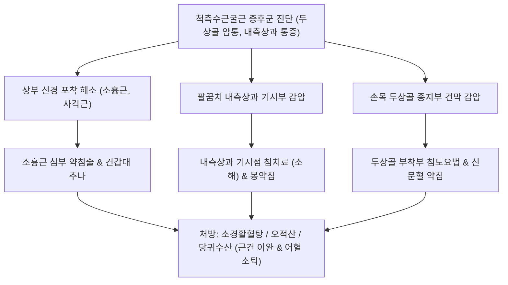

---
aliases:
  - 척측수근굴근 증후군
  - FCU 증후군
  - FCU Syndrome
  - Flexor Carpi Ulnaris Tendinopathy
  - 척측수근굴근건염
  - 두상골 건초염
  - Pisiform Tendinitis
tags:
  - 근골격계질환
  - 전완통증
  - 수관절
  - 주관절
  - 건병증
categories:
  - 근골격계 질환
  - 상지
created: 2024-01-21
updated: 2026-09-18
---

# 척측수근굴근 증후군 (Flexor Carpi Ulnaris Syndrome)

> **핵심 3줄 요약 (Key Summary)**:
> - 🎯 [[척측수근굴근]](Flexor Carpi Ulnaris, FCU)의 만성 과긴장과 단축으로 인해 근위부 상완골 내측상과 부착부([[골퍼 엘보]])와 원위부 종지부인 [[두상골]](Pisiform) 골막 및 힘줄 견인점에 염증, 미세 손상 및 통증이 발생하는 건병증
> - 🚩 손목 안쪽 두상골 부위의 국소적 압통과 부종, 팔꿈치 내측 통증, 손목의 저항성 굴곡 및 척측 편위 시 통증 악화, 인접한 [[척골신경]]의 기계적 자극으로 인한 4·5지 이상감각 동반 가능
> - 🔍 한의학적으로 근상(筋傷), 비증(痺證)으로 다루며, 상부의 [[소흉근]] 포착 해소와 함께 내측상과 및 두상골 골막 부착부의 소염약침·봉약침, 침도요법을 통한 힘줄 견인점 이완, [[소경활혈탕]]·[[오적산]] 투여를 통해 신속한 회복 도모
> - ⚠️ 두상골 부착부 통증은 가이온관 증후군, 두상삼각 관절염, 삼각섬유연골복합체(TFCC) 손상과의 정밀 감별 진단 필요

---

## 목차 (Table of Contents)
- [[#1. 개요 및 해부학 (Overview & Anatomy)]]
- [[#2. 병태생리 및 2대 주요 통증 영역 (Pathophysiology & Clinical Patterns)]]
  - [[#2.1 척측수근굴근의 생체역학과 힘줄 견인점 형성]]
  - [[#2.2 1) 상완골 골퍼 엘보 연계 팔꿈치 내측 통증]]
  - [[#2.3 2) 두상골 골막 자극성 손목 내측 통증]]
- [[#3. 임상 증상 및 특징 (Clinical Features)]]
- [[#4. 이학적 검사 및 진단적 접근 (Physical Examination & Diagnosis)]]
- [[#5. 감별 진단 (Differential Diagnosis)]]
- [[#6. 통합의학적 치료 전략 (Management Strategies)]]
  - [[#6.1 양방 의학적 치료 프로토콜]]
  - [[#6.2 한의학적 복합 치료 프로토콜]]
- [[#7. 진료실 핵심 임상 필기 (Clinical Pearls & Practice Tips)]]
- [[#8. 출처 및 학술 참고 문헌 (References)]]

---

## 1. 개요 및 해부학 (Overview & Anatomy)

### 1.1 정의 및 임상적 의의
[[척측수근굴근 증후군]](Flexor Carpi Ulnaris Syndrome)은 전완 전면 척측의 가장 천층을 주행하는 강력한 손목 굴곡 및 척측 편위 근육인 [[척측수근굴근]](FCU)이 과도한 사용이나 반복적 부하로 인해 과긴장 및 단축되면서 발생하는 근건 복합체 질환이다.
근위부로는 상완골 내측상과의 공통 굴근건 기시부에 골막 자극성 염증을 유발하여 내측상과염([[골퍼 엘보]])의 주원인이 되며, 원위부로는 종자골인 [[두상골]](Pisiform)과 유구골, 제5중수골 저부로 이어지는 건 부착부에 견인성 건염 및 골막염을 초래하여 손목 내측의 통증과 저림을 유발한다.

![[Flexor_carpi_ulnaris_anatomy.png|450]]
> [그림 1] 척측수근굴근(Flexor Carpi Ulnaris)의 해부학적 구조: 상완골 내측상과 기시부와 주두 기시부, 그리고 원위부 두상골(Pisiform) 종지부의 전완 척측 주행 경로

### 1.2 해부학적 연결성과 신경 관계
- **기시부(Origin)**:
  - 상완두(Humeral head): 상완골 내측상과의 공통굴근건.
  - 척골두(Ulnar head): 척골 주두(Olecranon)의 내측면 및 척골 후면 경계 근막.
  - 두 갈래 사이로 [[척골신경]](Ulnar nerve)이 통과하여 주관절 터널(Cubital tunnel)의 바닥과 외측 벽을 형성한다.
- **정지부(Insertion)**:
  - 주요 정지부는 손목의 종자골인 [[두상골]](Pisiform)이다.
  - 두상골로부터 두상유구인대(Pisohamate ligament)를 통해 유구골 갈고리로, 두상중수골인대(Pisometacarpal ligament)를 통해 제5중수골 저부로 연결되어 굴곡력을 전달한다.
- **신경 지배**: 전완 굴근군 중 유일하게 정중신경이 아닌 **[[척골신경]](C8~T1)**의 직접 지배를 받는다.

---

## 2. 병태생리 및 2대 주요 통증 영역 (Pathophysiology & Clinical Patterns)

### 2.1 척측수근굴근의 생체역학과 힘줄 견인점 형성
[[척측수근굴근]]은 손목을 굴곡(Flexion)시키면서 동시에 척측으로 편위(Ulnar deviation)시키는 가장 강력한 근육이다.
골프 스윙 임팩트 시 클럽헤드가 지면을 치는 뒤땅 타격, 라켓 스포츠의 강력한 탑스핀 및 서브, 무거운 물건을 손목을 젖히고 받쳐 드는 작업, 타자 작업 시 손목을 안쪽으로 꺾고 있는 자세 등에서 FCU에 강력한 편심성(Eccentric) 및 등장성 수축 부하가 걸린다.
근육의 지속적 단축은 근복 내 발통점(Trigger point)을 만들고, 양 말단 부착부의 골막-건 접합부(Enthesis)에 강력한 기계적 견인력(Traction force)을 지속적으로 가해 미세 열상, 활액초 부종 및 건병증을 유발한다.

![[Flexor_carpi_ulnaris_TriggerPoints.jpg|450]]
> [그림 2] 척측수근굴근(FCU)의 발통점(TrP)과 통증 방사 패턴: 전완 척측을 따라 원위부 두상골 및 손목 척측 장측면으로 집중되는 연관통 영역

### 2.2 1) 상완골 골퍼 엘보 연계 팔꿈치 내측 통증
- FCU의 상완두 기시부인 내측상과 골막에 지속적인 인장력이 전달되어 건막 부종과 골막염 발생.
- [[원회내근]], [[요측수근굴근]]과 함께 공통 굴근건의 퇴행성 변화를 유발하며, 내측상과 바로 앞쪽 및 아래쪽의 극심한 압통을 형성한다.
- FCU의 두 갈래(상완두와 척골두) 사이 건궁(Arcuate ligament)이 팽팽해지면 그 밑을 지나는 [[척골신경]]을 압박하여 주관절 터널 증후군을 병발시킨다.

### 2.3 2) 두상골 골막 자극성 손목 내측 통증
- 원위부 종지점인 [[두상골]] 주변 힘줄 견인점에 염증성 삼출액이 고이고 건초가 비후됨.
- 두상골은 종자골로서 완관절 움직임에 따라 미세하게 활주해야 하나, FCU의 과긴장으로 인해 두상골이 근위부 및 척측으로 강하게 견인되어 고착(Immobilization)된다.
- 두상골의 고착은 인접한 가이온관(Guyon's canal)의 입구를 좁히고 두상골 바로 외측을 통과하는 [[척골신경]]과 척골동맥을 물리적으로 자극하여 손목의 염증성 통증뿐만 아니라 4·5지 저림과 이상감각을 동반 유발한다.

![[내측상과_공통굴근건_해부도.png|450]]
> [그림 3] 상완골 내측상과 공통 굴근건 부착부: 척측수근굴근의 상완 기시부와 주관절 내측 인대 복합체

---

## 3. 임상 증상 및 특징 (Clinical Features)

### 3.1 주요 자각 증상
- **두상골 부위의 국소 압통과 붓기**: 손목 안쪽 손바닥 기저부의 볼록 튀어나온 뼈인 [[두상골]] 직상방을 누를 때 찌릿하고 날카로운 통증이 발생하며, 건초 주위의 열감과 경미한 부종이 확인된다.
- **팔꿈치 안쪽의 둔통**: 주관절 내측상과 부위가 묵직하고 쑤시며, 손목을 굴곡하거나 걸레를 짤 때 팔꿈치 안쪽으로 찌르는 듯한 통증이 방사된다.
- **저항 운동 시 통증 격발**: 손목을 안쪽으로 구부리거나 새끼손가락 쪽으로 꺾을 때(척측 편위) 두상골과 팔꿈치 내측에서 동시에 통증이 격발된다.
- **수지 저림 동반**: FCU 단축으로 주관절 터널이나 가이온관이 압박되는 경우, 약지와 새끼손가락의 저림, 시림, 둔한 감각이 동반될 수 있다.

---

## 4. 이학적 검사 및 진단적 접근 (Physical Examination & Diagnosis)

![[golfers_elbow_test_step2_wrist_flexion_resistance.jpg|500]]
> [그림 4] 골퍼 엘보 및 척측수근굴근 저항 검사: 주관절 신전 및 전완 회외 상태에서 환자의 손목 굴곡에 저항을 가하여 내측상과 및 FCU 건병증을 유발하는 평가법

### 4.1 특수 이학적 유발 검사
1. **FCU 저항 굴곡-척측 편위 검사(Resisted Wrist Flexion & Ulnar Deviation Test)**:
   - 검사자는 환자의 주관절을 90도 굴곡하고 전완을 회외시킨 상태에서, 환자에게 손목을 굴곡하면서 동시에 척측으로 편위시키도록 지시하고 이에 강하게 저항한다.
   - 두상골 부착부 또는 내측상과 기시부에 날카로운 통증이 유발되면 양성이다.
2. **골퍼 엘보 검사(Golfer's Elbow Test)**:
   - 환자의 주관절을 완전 신전시키고 전완을 회외시킨 상태에서 손목을 수동으로 과신전시킬 때 내측상과 및 FCU 기시부에 통증이 유발되면 양성.
3. **두상골 가동 및 압박 검사(Pisiform Shear & Grind Test)**:
   - 검사자의 엄지와 검지로 환자의 두상골을 잡고 전후좌우로 강하게 흔들거나 삼각골 쪽으로 압박을 가할 때 심한 통증이나 마찰음이 발생하면 두상골 건염 및 두상삼각 관절염 양성.
4. **[[소흉근]] 압통점 평가(Pectoralis Minor Palpation)**:
   - 오훼돌기 하방 2~3 cm 소흉근 근복을 촉진할 때 심한 압통과 함께 상지 내측으로 연관통이 방사되는지 확인하여 상위 신경 포착 연계를 선별.

### 4.2 영상의학적 검사
- **단순 방사선(X-ray)**: 수근부 Carpal tunnel view 및 Oblique view를 통해 두상골 주변의 석회화 건염(Calcific tendinitis) 유무, 두상골 골절, 두상삼각 관절의 골관절염을 확인한다.
- **근골격계 초음파(US)**: FCU 건의 원위부 두상골 부착부 횡단면 및 종단면에서 건의 비후, 저에코성 건 실질 파열, 건초 삼출액, 파워 도플러상 혈류 증가 소견을 명확히 확인한다.

---

## 5. 감별 진단 (Differential Diagnosis)

| 질환명 | 주 통증 부위 | 호발 기전 및 특징 | 감별 핵심 포인트 |
| :--- | :--- | :--- | :--- |
| [[척측수근굴근 증후군]] | 손목 안쪽 두상골 부착부 & 내측상과 | FCU 과긴장, 저항 굴곡/척측편위 통증 | 두상골 골막 압통, FCU 수축 시 통증 유발 |
| [[가이온관 증후군]] | 손목 척측 손바닥, 4·5지 | 척골신경의 순수 압박 신경병증 | 4·5지 감각 저하/저림 위주, Froment sign 양성 |
| **두상삼각 관절염(Pisotriquetral OA)** | 두상골-삼각골 사이 관절면 | 퇴행성 관절염, 두상골 압박 시 통증 | Pisiform grind test 양성, X-ray 관절강 협착 |
| [[척골충돌 증후군]] / [[TFCC 손상]] | 손목 등쪽-척측, 척골두 소와 | 척골 양성 변위, 손목 비틀기 악화 | Ulnocarpal stress test 양성, Ulnar fovea sign 양성 |
| **[[골퍼 엘보]](내측상과염)** | 팔꿈치 내측상과 직하방 | 공통 굴근건 기시부 과사용 | 내측상과 국소 압통, 손목 신전 스트레칭 통증 |

---

## 6. 통합의학적 치료 전략 (Management Strategies)

### 6.1 양방 의학적 치료 프로토콜
1. **보존적 단계**:
   - 수근부 중립위 부목(Wrist splint) 2~4주 착용하여 FCU 긴장 완화.
   - NSAIDs 투여 및 테니스, 골프, 웨이트 트레이닝 중단.
   - 체외충격파 치료(ESWT): 내측상과 기시부 및 두상골 건 부착부에 저에너지 충격파 적용.
2. **국소 주사 요법**:
   - 초음파 유도하 두상골 주위 건초 내 스테로이드 또는 PDRN 주사. (척골신경 및 척골동맥이 바로 외측에 인접하므로 혈관/신경 손상에 극도의 주의 필요).
3. **수술적 치료 (보존적 치료 6개월 실패 시)**:
   - 두상골 절제술(Pisiformectomy): 난치성 두상삼각 관절염 및 건 부착부 파열 시 두상골을 적출하고 FCU 건을 삼각골에 재고정.

### 6.2 한의학적 복합 치료 프로토콜
한의학적으로 척측수근굴근 증후군은 근상(筋傷), 비증(痺證), 완통(腕痛)의 범주에 속하며, 기체어혈(氣滯瘀血), 풍한습비(風寒濕痺), 경락어조(經絡瘀阻)로 변증한다.

#### 1) 침구 치료
- **국소 혈위**:
  - 신문(HT7): 두상골 바로 요측 함요부로 심경의 원혈이며 두상골 건초 부종을 해소.
  - 음극(HT6), 통리(HT5): FCU 건의 요측 경계선을 따라 사자하여 건초 유착 해제.
  - 소해(HT3): 상완골 내측상과 전하방 함요부로 FCU 기시부 긴장을 해소하는 특효혈.
- **원위 및 연계 혈위**:
  - 중부(LU1), 기호(ST13): [[소흉근]] 압통점에 자침하여 상완신경총 및 척골신경의 상위 긴장도를 선행 해소.
  - 극문(PC4), 곡택(PC3): 전완 굴근막 전체의 장력을 조절.

#### 2) 약침 요법
- **중성어혈약침 및 황련해독탕 약침**: 두상골 주위 건초 및 내측상과 골막 부착부에 0.5 cc 주입하여 급성 건초염과 미세 어혈 흡수.
- **봉약침 요법 (Bee Venom)**: 만성 건병증 및 석회화 환자에게 BV(0.05 mg/ml)를 두상골 원위부와 내측상과에 격일 시술하여 모세혈관 증식 촉진 및 건 섬유 재생 유도.

#### 3) 침도 요법 (Acupotomy)
- **적응증**: 3개월 이상 지속된 만성 두상골 건염 및 내측상과염으로 건막의 섬유성 경결과 비후가 고착된 증례.
- **시술 방식**: 0.4×40 mm 침도를 사용하여 두상골 근위부 FCU 부착부 골막 경계면을 따라 종축으로 미세 박리하여 힘줄 견인점(Traction point)의 장력을 물리적으로 해제.

#### 4) 추나요법 및 도수 기법
- **두상골 가동 기법(Pisiform Mobilization)**: FCU 단축으로 인해 근위부 및 척측으로 당겨진 두상골을 파지하여 요측(Radial) 및 원위부(Distal)로 부드럽게 글라이딩시켜 관절 가동성 회복.
- **FCU 근막 신장 이완술**: 주관절을 신전하고 완관절을 과신전 및 요측 편위시킨 상태에서 FCU 근복을 횡단 방향으로 마사지하여 단축된 근절(Sarcomere)을 연장.

#### 5) 한약물 요법
- **급성기 염증 및 통증**: [[당귀수산]](當歸鬚散) 또는 [[오적산]](五積散)에 강황(薑黃), 천궁(川芎)을 가미하여 어혈을 몰아내고 활맥(活脈) 통락.
- **만성 근건 경결 및 통증**: [[소경활혈탕]](疎經活血湯) 또는 [[갈근탕]](葛根湯) 가미방으로 전완 굴근막의 경직을 풀고 기혈 순환 촉진.
- **허증 및 노인성 퇴행**: [[대호경간탕]](大護經肝湯) 또는 속단, 두충, 구척을 가미한 삼기음(三痺飮) 투여.

---

## 7. 진료실 핵심 임상 필기 (Clinical Pearls & Practice Tips)

### 7.1 원장실 핵심 감별 및 치료 팁
1. **소흉근(Pectoralis Minor) 치료 필수 원칙**:
   - FCU는 [[척골신경]]의 지배를 받으며, 척골신경은 오훼돌기 아래 [[소흉근]] 밑을 통과한다. 팔꿈치 안쪽이나 두상골 부착부 치료만으로 호전되지 않는 난치성 환자는 100% 소흉근의 과긴장으로 척골신경이 자극받아 FCU 근육이 반사성 과긴장을 유지하는 상태이므로, 반드시 **오훼돌기 하방 소흉근 압통점을 침/약침으로 선행 치료**해야 완치된다.
2. **두상골 외측 척골동맥 박동 확인**:
   - 두상골 부착부에 침도나 약침을 시술할 때 두상골 바로 외측에 척골동맥이 지나가므로, 시술 전 반드시 맥박을 짚어 혈관 위치를 확인하고 혈관을 엄지손톱으로 외측으로 밀어 젖힌 상태에서 두상골 골면에 안전하게 안착시켜야 한다.
3. **골프 및 웨이트 트레이닝 티칭**:
   - 골프 스윙 시 오른손잡이 기준 왼손 FCU는 임팩트 시 뒤땅 충격을 흡수하며, 오른손 FCU는 릴리스 시 과도하게 손목을 꺾을 때 손상된다. 치료 기간 동안 그립을 너무 꽉 쥐지 않도록 지도하고 손목 스트랩 착용을 권고한다.

---

## 8. 출처 및 학술 참고 문헌 (References)

1. Lung BE, Siwiec RM (2024). Anatomy, Shoulder and Upper Limb, Forearm Flexor Carpi Ulnaris Muscle. *StatPearls*, Treasure Island (FL): StatPearls Publishing. [PMID: 30252307](https://pubmed.ncbi.nlm.nih.gov/30252307/)
   - [연구 요약]: 척측수근굴근(FCU)의 해부학적 기시·정지부 변이, 척골신경과의 터널 형성 관계, 두상골 골막 부착부의 생체역학적 기능과 임상적 건병증 병태생리를 종합 기술함.
2. Becciolini M, Pivec C, Riegler G (2024). Ultrasonography of the ulnar nerve loop in relation to the flexor carpi ulnaris tendon. *J Ultrason*, 24(99):e185-e192. [PMID: 39619260](https://pubmed.ncbi.nlm.nih.gov/39619260/)
   - [연구 요약]: 고해상도 초음파를 통해 원위부 척측수근굴근 건과 척골신경 루프 사이의 해부학적 상관관계를 규명하고, FCU 건초염 시 척골신경에 가해지는 기계적 압박 소견을 분석함.
3. Borthakur D, Ganapathy A, Ansari MA et al. (2024). Accessory Flexor Carpi Ulnaris Muscle in Humans: A Rare Anatomical Case with Clinical Considerations. *Prague Med Rep*, 125(2):145-152. [PMID: 38761050](https://pubmed.ncbi.nlm.nih.gov/38761050/)
   - [연구 요약]: 부가적 척측수근굴근(Accessory FCU) 변이가 가이온관 및 주관절 터널 내압 상승과 만성 전완 척측 통증에 미치는 임상적 기전을 보고함.