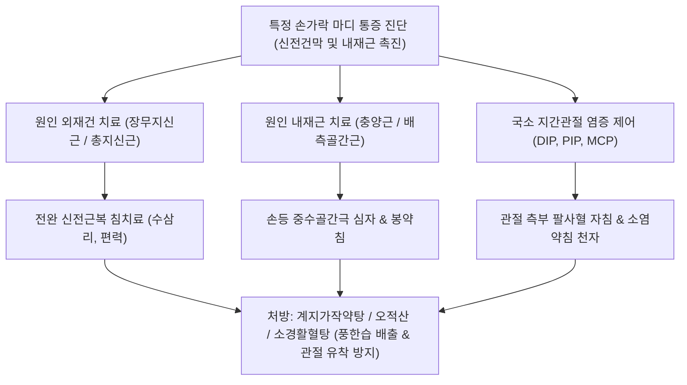

---
aliases:
  - 특정 손가락 마디의 통증
  - 손가락 관절통
  - Isolated Finger Joint Pain
  - 수지 지간관절 통증
  - 수지 관절염
  - 수지 내재근 증후군
  - 손가락 힘줄염
tags:
  - 근골격계질환
  - 수부통증
  - 손가락관절
  - 건초염
  - 내재근
categories:
  - 근골격계 질환
  - 상지
created: 2024-01-21
updated: 2026-09-18
---

# 특정 손가락 마디의 통증 (Isolated Finger Joint Pain)

> **핵심 3줄 요약 (Key Summary)**:
> - 🎯 단일 수지의 특정 관절(DIP, PIP, MCP, 엄지 IP)에 국한되어 발생하는 통증으로, 외재성 건([[총지신근]], [[장무지신근]], 수지 굴근건)의 분절적 긴장과 함께 수부 내재근([[충양근]], [[배측골간근]], [[장측골간근]])의 과굴곡 및 비대칭적 과부하로 인한 건막염 및 미세 염증
> - 🚩 특정 손가락 마디의 부종, 조조강직, 굴곡-신전 시 뻣뻣함 및 통증, 지간관절 측부 인대 압통, 엄지 IP 관절 신전건 통증 및 MCP 배부 압통 발현
> - 🔍 한의학적으로 비증(痺證), 완수마목(腕手麻木)으로 보며, 해당 수지의 신전건막·충양근·골간근 발통점에 대한 미세자침 및 소염약침, 관절강내 활액 순환을 위한 온침 및 봉약침, [[계지가작약탕]]·[[오적산]] 투여를 통해 신속한 염증 소퇴와 관절 가동성 회복 도모
> - ⚠️ 단일 관절 통증이라 하더라도 류마티스 관절염(대칭성 다발성), 건선성 관절염(소시지 손가락, Dactylitis), 방아쇠 수지(A1 도르래 탄발음), 헤버덴/부샤르 골관절염과의 정밀 감별 필수

---

## 목차 (Table of Contents)
- [[#1. 개요 및 역학 (Overview & Epidemiology)]]
- [[#2. 병태생리 및 수지 내재근·외재건 역학 (Pathophysiology & Biomechanics)]]
  - [[#2.1 외재건과 내재근의 협동 작용 메커니즘]]
  - [[#2.2 관절 부위별 2대 주요 통증 패턴]]
- [[#3. 임상 증상 및 특징적 패턴 (Clinical Features)]]
- [[#4. 이학적 검사 및 진단적 접근 (Physical Examination & Diagnosis)]]
- [[#5. 감별 진단 (Differential Diagnosis)]]
- [[#6. 통합의학적 치료 전략 (Management Strategies)]]
  - [[#6.1 양방 의학적 치료 프로토콜]]
  - [[#6.2 한의학적 복합 치료 프로토콜]]
- [[#7. 진료실 핵심 임상 필기 (Clinical Pearls & Practice Tips)]]
- [[#8. 출처 및 학술 참고 문헌 (References)]]

---

## 1. 개요 및 역학 (Overview & Epidemiology)

### 1.1 정의 및 임상적 의의
[[특정 손가락 마디의 통증]](Isolated Finger Joint Pain)은 전신적 관절염과 달리, 단 1개의 손가락 마디(원위 지간관절 DIP, 근위 지간관절 PIP, 중수수지관절 MCP, 또는 엄지 지간관절 IP)에 국소적으로 발생하여 환자에게 심한 불편감을 주는 임상 증후군이다.
4개의 손가락(2~5지)은 전완부의 공통 근육인 [[총지신근]](Extensor Digitorum Communis, EDC)과 천지·[[심지굴근]]에 의해 포괄적인 지배를 받으나, **유독 한 손가락에서만 독립된 통증이 발생하는 기전에는 해당 손가락에만 독립적으로 작용하는 수부 내재근([[충양근]], [[배측골간근]], [[장측골간근]])의 불균형적 과긴장과 미세 손상이 핵심적으로 개입**한다.

![[Intrinsic_muscles_of_hand_anatomy.jpg|550]]
> [그림 1] 수부 내재근(Intrinsic Muscles of Hand)의 4개 층별 해부학: 천층의 충양근(Lumbricals), 모지구근 및 소지구근, 그리고 심층의 배측 골간근(Dorsal interossei)과 장측 골간근(Palmar interossei)

### 1.2 호발 요인 및 유발 동작
- **호발 직업군**: 스마트폰을 한 손가락으로 장시간 스와이프하는 사용자, 악기 연주자(피아노, 바이올린, 플루트), 정밀 수공예가, 미용사, 치과의사, 타이핑 작업자.
- **기계적 유발 인자**: 손가락 끝으로 강하게 누르는 동작, 손가락이 뒤로 꺾이거나 강하게 비틀리는 미세 손상, 병뚜껑을 비틀어 여는 과부하, 펜을 너무 세게 쥐는 필기 습관.

---

## 2. 병태생리 및 수지 내재근·외재건 역학 (Pathophysiology & Biomechanics)

### 2.1 외재건과 내재근의 협동 작용 메커니즘
손가락의 섬세한 움직임은 전완에서 내려오는 외재건(Extrinsic tendons)과 손바닥 및 중수골 사이에 위치한 내재근(Intrinsic muscles)의 정밀한 삼각 결합 시스템(Extensor Hood Mechanism)에 의해 조절된다.
- **내재근의 고유 역할**:
  - **[[충양근]](Lumbricals)**: [[심지굴근]](FDP) 건에서 기원하여 신전건막의 요측 외측대(Lateral band)에 부착된다. MCP 관절을 굴곡시키면서 동시에 PIP 및 DIP 관절을 신전시키는 독특한 작용을 한다.
  - **[[배측골간근]](Dorsal Interossei)**: 중수골 사이에서 기원하여 수지를 외전(Abduction)시키고 신전건막을 지지한다.
  - **[[장측골간근]](Palmar Interossei)**: 수지를 내전(Adduction)시키며 신전건막을 조절한다.
- **단일 마디 손상 메커니즘**:
  - 특정 손가락을 과도하게 구부리거나 비틀면 해당 수지의 충양근 및 골간근 섬유가 비대칭적으로 과긴장하여 경결(Knot)이 발생한다.
  - 이로 인해 신전건막(Extensor hood)의 외측대와 중앙 슬립(Central slip)에 전달되는 장력의 균형이 깨지며, 건막이 관절낭 및 골막과 마찰되어 미세 손상과 근섬유 재배열 부전(Fiber crossing/overlapping), 무균성 염증성 부종이 발생한다.

![[Lumbricales_hand_anatomy.png|450]]
> [그림 2] 심지굴근 건에서 기원하여 신전건막으로 이어지는 4개의 충양근(Lumbrical muscles): 단일 수지의 PIP/DIP 신전 조절 핵심 구조

### 2.2 관절 부위별 2대 주요 통증 패턴
1. **엄지 IP 관절 배부 통증 및 2~5지 PIP·DIP 관절 배부 통증**:
   - 손가락을 강하게 쥐거나 구부리는 과굴곡(Hyperflexion) 동작 시 관절 등쪽(Dorsal aspect)을 가로지르는 신전건(Extensor tendon)이 팽팽하게 당겨지며 미세 파열과 건막염 발생.
   - **엄지 IP 관절**: [[장무지신근]](Extensor Pollicis Longus, EPL) 건이 주된 손상 부위.
   - **2~5지 PIP·DIP 관절**: [[총지신근]](EDC)의 중앙 슬립 및 외측대 종지부 손상.
2. **MCP 관절 배부 통증**:
   - 손가락 뿌리 관절 등쪽의 통증으로, 주먹을 쥘 때 뼈마디가 쑤시고 튀어나온 부위가 아픔.
   - **엄지 MCP 관절**: [[단무지신근]](EPB) 및 [[단무지외전근]](APB) 긴장과 연계되며, 흔히 손목의 [[드퀘르벵 증후군]]과 연쇄적으로 동반 발생.
   - **2~5지 MCP 관절**: 신전건의 시상번들(Sagittal band) 손상 또는 골간근 건 부착부 염증.

![[Dorsal_interossei_hand_anatomy.png|450]]
> [그림 3] 4개의 배측 골간근(Dorsal interossei): 중수골 사이 공간에 위치하며 MCP 관절 안정화 및 수지 외전을 담당하는 내재근

---

## 3. 임상 증상 및 특징적 패턴 (Clinical Features)

### 3.1 주요 자각 증상
- **국소화된 관절통**: 여러 손가락이 아닌 오직 1개의 손가락, 특정 마디(DIP, PIP 또는 MCP)에만 국한된 날카로운 압통과 둔통.
- **동작통(Motion Pain)**:
  - 손가락을 완전히 펴거나 끝까지 구부릴 때 해당 마디 배부 또는 측부에서 찌르는 통증 발생.
  - 가방을 손가락 끝으로 걸어 들 때, 캔 뚜껑을 딸 때, 스마트폰을 쥐고 터치할 때 악화.
- **조조강직 및 관절 뻣뻣함**: 아침에 일어났을 때 해당 손가락 마디가 굳어 잘 쥐어지지 않다가, 따뜻한 물에 담그거나 몇 번 움직이면 부드러워짐 (단, 류마티스와 달리 30분 이내에 호전).
- **국소 종창 및 온열감**: 관절 주위 연부조직이 약간 붓고 두터워진 느낌이 들며 가벼운 압박에도 예민한 통증 호소.

---

## 4. 이학적 검사 및 진단적 접근 (Physical Examination & Diagnosis)

### 4.1 시진 및 촉진 (Inspection & Palpation)
- **신전건 및 신전건막 배부 촉진**: 환자의 손가락 관절 등쪽 신전건 주행선을 손가락 끝으로 정밀하게 굴려가며 압박할 때 국소적인 압통 결절이나 마찰음(Crepitus) 확인.
- **수부 내재근 발통점 촉진**:
  - 손바닥 쪽 충양근(심지굴근 건 요측) 및 손등 쪽 중수골 사이 골간근(Interosseous space)을 양측에서 집어 올리듯 압박(Pincer palpation)하여, 해당 수지 마디로 방사되는 통증 재현 여부 확인.
- **측부 인대 안정성 검사(Stress Test)**: 지간관절을 20~30도 굴곡한 상태에서 내반(Varus) 및 외반(Valgus) 스트레스를 가해 측부 인대 염좌 및 불안정성을 감별.

### 4.2 영상의학적 검사
- **단순 방사선(X-ray)**: Hand AP, Oblique, Lateral 뷰를 통해 관절강 협착, 골극(Heberden/Bouchard nodes), 골 미란(Erosion), 관절내 골편 유무를 확인하여 골관절염 및 류마티스 관절염 감별.
- **고해상도 초음파(MSK US)**: 15~22 MHz 고주파 프로브로 지간관절 배측 신전건막의 비후, 저에코성 활액 삼출액, 파워 도플러상 신생 혈관 증식 및 A1/A2 도르래 비후를 실시간 정밀 평가.

---

## 5. 감별 진단 (Differential Diagnosis)

| 질환명 | 주 침범 관절 | 발병 양상 및 원인 | 감별 특징 및 징후 |
| :--- | :--- | :--- | :--- |
| [[특정 손가락 마디의 통증]] | 단일 수지 DIP, PIP, MCP | 내재근 불균형, 과굴곡 손상 | 단일 관절 국한, 신전건/골간근 압통, X-ray 정상 |
| **[[방아쇠 수지]](Trigger Finger)** | MCP 장측 (A1 도르래) | 굴근건과 도르래의 마찰 비후 | 손가락 굴곡 시 딸깍(Snapping) 걸림 및 방아쇠 현상 |
| **퇴행성 골관절염(Heberden/Bouchard)** | DIP(헤버덴), PIP(부샤르) | 연골 마모, 뼈의 골극 형성 | 단단한 골성 결절 돌출, 50대 이상 호발, X-ray 협착 |
| **[[류마티스 관절염]](RA)** | 양측 대칭성 MCP, PIP | 자가면역성 활막염 | 대칭성 다발성 관절염, 조조강직 1시간 이상, RF/Anti-CCP 양성 |
| **건선성 관절염(PsA)** | DIP 관절 및 손가락 전체 | 척추관절염 계열 면역 질환 | 손가락 전체가 소시지처럼 붓는 손가락염(Dactylitis), 조갑 병변 |
| **통풍성 관절염(Gout)** | 단일 관절 (주로 족부이나 수지 가능) | 요산염 결정 침착 급성 발작 | 극심한 발적, 종창, 작열통, 혈청 요산 상승 |

---

## 6. 통합의학적 치료 전략 (Management Strategies)

### 6.1 양방 의학적 치료 프로토콜
1. **보존적 단계**:
   - 알루미늄 핑거 부목(Finger splint)을 이용하여 해당 관절을 1~2주간 야간 또는 활동 시 고정.
   - 경구 소염진통제(NSAIDs) 1~2주 단기 투여.
   - 온열 파라핀욕(Paraffin wax bath)을 통한 미세 순환 증진 및 강직 완화.
2. **국소 주사 요법**:
   - 초음파 유도하 신전건초 주위 또는 지간관절강 내 저용량 트리암시놀론(5~10 mg) 주사 (지간관절은 공간이 협소하고 피부 위축 위험이 높아 극소량 주입).
   - 5% 포도당을 이용한 내재근-신전건막 수액박리술(Hydrodissection).

### 6.2 한의학적 복합 치료 프로토콜
한의학적으로 단일 수지 관절통은 비증(痺證), 완수통(腕手痛), 근급(筋急)에 속하며, 풍한습비(風寒濕痺), 담어저락(痰瘀阻絡), 간신부족(肝腎不足)으로 변증한다.

#### 1) 침구 치료
- **원인 외재건 치료**:
  - 엄지 손가락: [[장무지신근]](EPL)의 주행선인 양계(LI5), 편력(LI6), 온류(LI7) 자침.
  - 2~5지: [[총지신근]](EDC) 근복인 곡지(LI11), 수삼리(LI10), 외관(TE5) 자침으로 손가락으로 내려가는 건 장력 해제.
- **수부 내재근 심자 (핵심 치료)**:
  - 중수골 사이 손등의 팔사혈(EX-UE9)을 통해 [[배측골간근]] 및 [[충양근]] 부착부로 0.25×30 mm 호침을 15~20 mm 깊이로 직자하여 근섬유 경결을 직접 해소.
- **국소 지간관절 자침**:
  - 통증 관절의 양측 측부 인대 함요부에 0.20×15 mm 미세침으로 천자(사자 3~5 mm)한 후 미세 온침(Moxibustion) 또는 적외선 조사로 국소 활액 순환 촉진.

#### 2) 약침 요법
- **중성어혈약침 및 황련해독탕 약침**: 관절낭 주변 및 신전건막 부위에 0.2~0.3 cc 극소량 주입하여 급성 건초 부종과 무균성 활막염 억제.
- **봉약침 요법 (Bee Venom)**: 만성 결절 및 관절 강직 환자에게 정제봉독(0.02~0.05 mg/ml)을 팔사혈 및 관절 측부에 0.1 cc씩 분주하여 항염증 사이토카인 분비 및 섬유화 조직 연화.

#### 3) 추나요법 및 관절 가동술
- **수지 지간관절 축성 견인 가동술(Axial Traction & Mobilization)**:
  - 검사자가 환자의 통증 마디 근위부를 안정화하고 원위부를 부드럽게 장축 방향으로 견인하면서 미세한 굴곡-신전 및 회전 글라이딩을 시행하여 관절강 내 음압 형성 및 활액막 영양 공급.
- **신전건막 횡마찰 마사지(Cyriax Friction)**: 관절 배측 신전건막을 횡단 방향으로 부드럽게 압박 마사지하여 콜라겐 섬유의 유착을 분리.

#### 4) 한약물 요법
- **급성 종통 및 근육 경련**: [[계지가작약탕]](桂枝加芍藥湯)에 갈근, 위령선을 가미하여 근막의 과긴장을 즉각 해소하고 진통 효과 발휘.
- **냉증 및 만성 비증**: [[오적산]](五積散) 또는 오두탕(烏頭湯) 가감방으로 관절 내 풍한습사를 몰아내고 혈류 촉진.
- **기혈허약 및 관절 퇴행**: [[대호경간탕]](大護經肝湯) 또는 황기계지오물탕(黃芪桂枝五物湯)을 처방하여 수지 말초 모세혈관 순환을 극대화.

---

## 7. 진료실 핵심 임상 필기 (Clinical Pearls & Practice Tips)

### 7.1 진료실 3대 감별 및 접근 원칙
1. **손가락 하나만 아픈 환자는 손등 뼈 사이(중수골간극)를 먼저 누를 것**:
   - 손가락 끝마디가 아프다고 해서 끝마디만 치료하면 낫지 않는다. 100% 손등의 중수골 사이(골간근)나 손바닥(충양근)에 쌀알 같은 단단한 압통 매듭이 숨어 있다. 이 내재근 결결을 침이나 약침으로 풀어주면 손가락 마디 통증이 그 자리에서 50% 이상 즉각 소실된다.
2. **엄지 IP 관절 통증과 손목 드퀘르벵의 연계**:
   - 엄지 끝마디(IP)가 아픈 환자는 거의 대부분 손목의 [[장무지신근]] 또는 제1신전구획([[단무지신근]], [[장무지외전근]])의 긴장을 동반하므로, 반드시 손목 건초 부위를 함께 촉진하여 연계 치료해야 한다.
3. **손가락 관절 침치료 시 출혈 예방 요령**:
   - 수지는 모세혈관망이 매우 풍부하여 자침 후 피하 혈종이 잘 생긴다. 0.20 mm 이하의 얇은 침을 사용하고 발침 즉시 마른 솜으로 1분 이상 압박 지혈하도록 지도한다.

---

## 8. 출처 및 학술 참고 문헌 (References)

1. Yoon Y, Lam KHS, Suryadi T et al. (2026). Atypical Trigger Finger Associated With Proximal Flexor Digitorum Superficialis Dynamic Instability Diagnosed With Ultrasound and Treated With Hydrodissection: A Case Report. *Cureus*, 18(7):e88319. [PMID: 42670493](https://pubmed.ncbi.nlm.nih.gov/42670493/)
   - [연구 요약]: 단일 수지 관절 통증 및 걸림 증상에서 근위부 천지굴근 건의 동적 불안정성을 고해상도 초음파로 진단하고 초음파 유도하 수액박리술을 통해 성공적으로 치료한 증례 보고.
2. Khamnon N, Buttagat V, Punyanitya S et al. (2026). Effects of cassava wax immersion on pain, pressure pain threshold, and upper extremity function among patients with trigger finger. *Hong Kong Physiother J*, 46(2):115-124. [PMID: 42688482](https://pubmed.ncbi.nlm.nih.gov/42688482/)
   - [연구 요약]: 수지 지간관절 및 건초 질환 환자에서 온열 왁스 요법이 관절 통증 역치 상승, 수부 가동성 회복 및 악력 증진에 미치는 유의한 임상 효과를 무작위 대조군 연구로 입증함.
3. AlBahlal A, Gabr M, Alsubhi MN et al. (2026). Efficacy of Subcutaneous Kenacort Injection for Trigger Finger: A Retrospective Analysis. *Plast Reconstr Surg Glob Open*, 14(8):e6112. [PMID: 42677307](https://pubmed.ncbi.nlm.nih.gov/42677307/)
   - [연구 요약]: 수지 굴근건초 및 지간관절 부위의 국소 코르티코스테로이드 주사 시 피하 조직 위축을 방지하면서 염증을 제어하는 주입 깊이 및 임상 성공률을 후향적으로 분석함.
