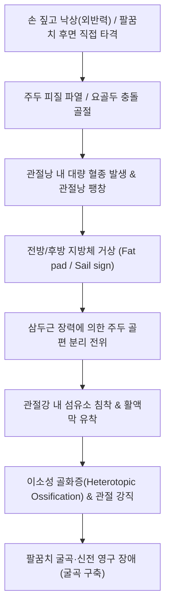

# 🩺 [[팔꿈치 골절]] (주관절 골절 / Elbow Fracture / 肘關節骨折, S52.0 / S52.1)

> **핵심 3줄 요약 (Key Summary)**:
> - 📍 병소 부위 & 해부·병태생리: [[주관절]]을 구성하는 척골 주두(Olecranon), 요골두(Radial head), 구상돌기(Coronoid process) 및 상완골 과상부. 삼두근 건의 장력에 의한 주두골 분리 전위, 관절와 활차 연골 손상, 주관절 불행 3징(Terrible Triad: 탈구+요골두+구상돌기 파열) 및 관절낭 섬유화에 따른 관절 강직이 핵심 병태.
> - 🚩 전형적 임상 양상 & 3대 징후: 팔꿈치 관절의 급성 종창과 극통, **능동 신전(Active extension) 완전 불능**(주두 골절 시 삼두근 부착부 분리), 외측 요골두 압통 및 회내·회외 제한, 측면 X-ray상 지방체 징후(Fat pad sign / Sail sign).
> - 🛠️ 핵심 감별 검사 & 한·양방 다각적 치료 전략: 주관절 AP/Lateral/Oblique 방사선 소견. 주두 전위 골절은 장력대 강선고정술(TBW), 비전위 요골두 골절은 초단기(1주 이내) 부목 후 조기 가동 운동. 급성기 혈종 제거를 위한 [[당귀수산]], [[오령산]], 가골 형성 촉진을 위한 [[자연동]](산골) 투약, 고정 해제 후 팔꿈치 굳음증 방지를 위한 주관절 관절가동추나 및 침구 치료.
> - ⚠️ 응급 의뢰 레드플래그: 주관절 완전 신전 불능 및 개방성 골절, 척골신경 급성 마비(제4-5지 저림, 골간근 위축), 상완동맥 압박/파열 및 전완 구획증후군(Volkmann 구축 위험), 주관절 불행 3징(Terrible Triad), 심각한 이소성 골화증(Heterotopic ossification).

---

## 📌 목차
1. [질환 개요 & 해부학적 병태생리](#1-질환-개요--해부학적-병태생리)
2. [병태생리 메커니즘 & 생체역학적 악순환 네트워크](#2-병태생리-메커니즘--생체역학적-악순환-네트워크)
3. [임상 증상 & 이학적 검사(Physical Exam) 알고리즘](#3-임상-증상--이학적-검사physical-exam-알고리즘)
4. [감별 진단 매트릭스 (Differential Diagnosis)](#4-감별-진단-매트릭스-differential-diagnosis)
5. [한의 통합 치료 프로토콜 (침·약침·추나·한약)](#5-한의-통합-치료-프로토콜-침약침추나한약)
6. [양방 치료 & 병용·의뢰 기준 (Conventional Treatment & Referral)](#6-양방-치료--병용의뢰-기준-conventional-treatment--referral)
7. [재활 운동 & 생활습관 티칭 가이드](#7-재활-운동--생활습관-티칭-가이드)
8. [💡 사용자 진료실 핵심 필기 & 임상 노하우 (Melt-In 잔여 심화 집약)](#8--사용자-진료실-핵심-필기--임상-노하우-melt-in-잔여-심화-집약)
9. [출처 및 학술 참고 문헌 (References)](#9-출처-및-학술-참고-문헌-references)

---

## 1. 질환 개요 & 해부학적 병태생리

![[팔꿈치골절_01_병태도해_주관절외측_골관절해부도.png|450]]
> [그림 1: ① 주관절 외측면의 골성 관절 및 외측측부인대(LCL) 복합체 해부 도해 — Smart-Servier Medical Art (CC BY 3.0)]

![[팔꿈치골절_01_영상의학_주두골절_Xray.jpg|340]]
> [그림 2: ② 삼두근 건의 장력에 의해 근위부로 전위된 척골 주두골 골절(Olecranon fracture) 측면 X-ray — Wikimedia Commons (CC BY-SA 4.0)]

![[팔꿈치골절_01_영상의학_요골두골절_FatPadSign_돛징후.png|360]]
> [그림 3: ③ 단순 방사선상 골절선이 뚜렷하지 않으나 관절 내 혈종으로 전후방 지방체가 팽창된 돛 징후(Fat pad sign / Sail sign) — Wikimedia Commons (CC BY-SA 4.0)]

![[팔꿈치골절_01_영상의학_요골두골절_Mason3기_전위골절.jpg|360]]
> [그림 4: ④ 요골두의 심한 분쇄 및 전위가 관찰되는 Mason Type III 요골두 골절 X-ray — Wikimedia Commons (CC BY-SA 4.0)]

* **질환 정의 및 해부학적 분류**:
  * 팔꿈치 골절(주관절 골절, Elbow fracture)은 [[상완골]] 원위부, [[척골]] 근위부(주두 및 구상돌기), [[요골]] 근위부(요골두 및 요골경)의 3대 골성 구조물에 발생하는 골절을 총칭합니다.
  * 골절 부위별 핵심 분류:
    1. **요골두 및 경부 골절 (Radial head and neck fracture, 성인 주관절 골절의 33%)**: 손을 짚고 넘어질 때(FOOSH) 상완골 소두(capitellum)에 요골두가 강하게 부딪혀 발생. **Mason 분류**(I형: 비전위, II형: 2mm 이상 전위된 단일 골편, III형: 분쇄 골절, IV형: 주관절 탈구 동반).
    2. **주두골 골절 (Olecranon fracture, 약 20%)**: 팔꿈치 후면 직접 타격 또는 삼두근의 급격한 편심성 수축으로 발생. Mayo 분류로 안정성/전위/분쇄 평가.
    3. **구상돌기 골절 (Coronoid fracture)**: 주관절의 전방 안정성을 담당하는 핵심 보루로, 주관절 후방 탈구 시 동반되며 **Terrible Triad(팔꿈치 탈구 + 요골두 골절 + 구상돌기 골절)**의 핵심 축.
* **관련 해부학적 구조물**:
  * **골격 및 관절**: 완척관절(Humeroulnar, 굴신 운동 경첩), 완요관절(Humeroradial, 회전 및 부하 전달), 근위요척관절(PRUJ, 전완 회내·회외).
  * **근육 및 인대**:
    * [[상완삼두근]](주두 부착, 강력한 신전력 및 골편 견인).
    * [[상완근]](구상돌기 부착, 굴곡력).
    * 내측측부인대(MCL, 외반 스트레스 저항), 외측척측측부인대(LUCL, 회전 후외측 불안정성 방지).
  * **신경 및 혈관**:
    * **[[척골신경]](Ulnar nerve)**: 내상과 후방의 주관절 터널(Cubital tunnel)을 통과하므로 주두 골절 및 내측 손상 시 견인·마비 위험.
    * **[[정중신경]] 및 상완동맥**: 주관절 전면 주관절와를 지나가며 과상 골절 및 전방 탈구 시 손상에 취약.

---

## 2. 병태생리 메커니즘 & 생체역학적 악순환 네트워크

### 1) 관절내 혈종과 돛 징후(Sail Sign / Fat Pad Sign)
* 정상 주관절의 측면 X-ray에서는 주관절낭의 전방 지방체만 얇게 관찰되고 후방 지방체는 주두와 깊은 곳에 숨어 보이지 않습니다.
* 골절이 발생하면 관절낭 내부로 5~10ml 이상의 혈종(hemarthrosis)이 차오르면서 전방 지방체를 돛단배의 돛 모양으로 들어 올리고(Sail sign), 평소 보이지 않던 **후방 지방체(posterior fat pad)**를 관절와 밖으로 밀어내 뚜렷하게 관찰되도록 만듭니다.
* 따라서 X-ray상 명확한 골절선이 보이지 않더라도 **후방 지방체 징후가 양성이면 90% 이상 관절 내 잠재 골절(주로 요골두 골절)**이 존재함을 확진할 수 있습니다.

### 2) 주관절 강직(Stiffness)과 이소성 골화증의 병태생리
* 팔꿈치는 인체 관절 중 **외상 후 관절 강직(Contracture)이 가장 빈발하는 관절**입니다.
* 관절낭이 전후방으로 매우 얇고 신전성이 적은 반면, 혈종 흡수가 지연되면 섬유모세포 증식과 콜라겐 교차결합이 급격히 일어나 3주 이상의 석고 고정만으로도 영구적인 신전 제한(굴곡 구축)이 남게 됩니다.
* 또한 심한 연부조직 파열과 혈종은 상완근 심부 조직에서 뼈가 자라나는 **이소성 골화증(Heterotopic ossification)**을 유발하여 주관절을 완전 골성 유합 상태로 굳혀버릴 수 있습니다.

---

## 3. 임상 증상 & 이학적 검사(Physical Exam) 알고리즘

### 1) 부위별 핵심 임상 증상
* **주두골 골절**: 팔꿈치 뒤쪽이 심하게 부어오르고 멍이 들며, **삼두근이 주두를 당기지 못하므로 환자가 팔꿈치를 스스로 펴는 능동 신전(Active extension against gravity)이 완전히 소실**됩니다.
* **요골두 골절**: 팔꿈치 외측(Humeroradial joint)에 국한된 극심한 압통이 있으며, 굴곡·신전보다 **전완의 능동/수동 회내 및 회외(Pronation/Supination) 동작 시 비명과 함께 회전 제한**이 발생합니다.

### 2) 필수 신경학적 진찰
* **[[척골신경]] 진찰**: 제5지와 제4지 척측의 감각 둔마 여부 확인, 손가락 벌리기(골간근) 근력 평가.
* **정중신경 및 전골간신경(AIN)**: 원위 지절 굴곡 능력(OK 사인) 확인.

---

## 4. 감별 진단 매트릭스 (Differential Diagnosis)

| 감별 질환 | 호발 병소 및 기전 | 핵심 신체 진찰 소견 | 영상 소견 감별점 |
| :--- | :--- | :--- | :--- |
| **[[팔꿈치 골절]] (주두/요골두)** | 팔꿈치 직타 / FOOSH 외반 | 외측 요골두 압통, 주두 신전 불능 | X-ray상 골절선, 후방 지방체 징후(Sail sign) 양성 |
| **주관절 후방 탈구** | 과신전 낙상 고에너지 외상 | 주두 돌출, 팔꿈치 굴곡위 고정 | 완척관절 활차 완전 분리 이탈 |
| **테니스 엘보 ([[외측상과염]])** | 만성 과사용, 미세 손상 | 외측상과 건 부착부 압통 (외상력 없음) | X-ray 골절선 없음, Cozen 검사 양성, 방사선 음성 |
| **주두 점액낭염** | 만성 마찰, 통풍, 세균 감염 | 주두 뒤 물혹처럼 말랑말랑한 종창 | 관절 내 삼출액이 아닌 피하 낭종, 골절선 없음 |

---

## 5. 한의 통합 치료 프로토콜 (침·약침·추나·한약)

![[팔꿈치골절_05_술기실사_주관절_경혈침치료.jpg|400]]
> [그림 5: ⑤ 주관절 외측 요골두 및 관절막 연부조직 긴장 완화를 위한 경혈 침구 치료 실사 — Wikimedia Commons (CC BY-SA 3.0)]

* **치료 원칙**: 주관절은 고정이 길어지면 굳어버리므로, 안정성 골절의 경우 조기 고정 해제(1주 이내) 후 한의학적 보존 치료로 관절 가동성을 확보하는 것이 핵심입니다.
* **침구 및 전침 치료**:
  * 부종 완화 및 관절 순환 촉진: [[곡지]](LI11), [[척택]](LU5), [[소해]](HT3), [[천정]](TE10), [[수삼리]](LI10), [[외관]](TE5), [[합곡]](LI4).
  * 주관절 굴신근 건막 긴장 완화를 위해 상완삼두근 및 상완근 TrP에 심자(深刺) 후 2Hz 저주파 전침을 병용하여 섬유성 유착을 예방합니다.
* **약침 치료**: 황련해독탕 약침 또는 신바로약침을 주관절 외측 활액막 주위에 미량 천주하여 관절내 혈종성 염증을 조기 억제합니다.
* **단계별 한약 치료**:
  * **급성기 (1~2주)**: [[당귀수산]](當歸鬚散) 합 [[오령산]](五苓散) (관절내 대량 혈종 흡수 촉진, 관절내압 강하, Sail sign 조기 해소).
  * **가골형성기 (3~6주)**: 접골단(接骨丹) 가 [[자연동]](산골) 1.5g (골편 유합 촉진 및 골절선 가교).
  * **관절가동기 (6주 이후)**: [[독활기생탕]](獨活寄生湯) (관절낭 섬유화 방지 및 만성 굴곡 구축 후유증 예방).

---

## 6. 양방 치료 & 병용·의뢰 기준 (Conventional Treatment & Referral)

![[팔꿈치골절_06_양방수술_주두골절_장력대강선고정술_TBW.jpg|450]]
> [그림 6: ⑥ 삼두근의 분리 견인력을 압박력으로 전환시키는 주두골 골절의 표준 수술법: 장력대 강선고정술(Tension Band Wiring) 술전·술후 X-ray — Wikimedia Commons (CC BY-SA 4.0)]

* **양방 치료 원칙**:
  * **주두골 골절**: 관절면 전위가 2mm 이상인 경우 거의 100% 수술 대상입니다. K-강선과 금속 와이어를 이용한 **장력대 강선고정술(Tension Band Wiring, TBW)**을 시행하여 삼두근이 수축할 때 생기는 신전 장력을 오히려 골절면을 맞붙이는 압박력으로 전환시켜 조기 관절 가동을 가능케 합니다.
  * **요골두 골절 (Mason 1형 비전위)**: 깁스를 2주 이상 하지 않고, 팔걸이를 3~5일간 착용한 뒤 즉시 통증이 허용하는 범위 내에서 조기 관절 운동을 시작합니다.
  * **요골두 분쇄 골절 (Mason 3~4형)**: 골편 정복이 불가능할 경우 요골두 절제술 또는 인공 요골두 치환술(Radial head arthroplasty) 시행.
* **응급 의뢰 및 전원 기준**:
  * 능동 신전이 완전 불가능한 주두 골절 (TBW 수술 의뢰).
  * 팔꿈치 후방 탈구가 동반된 복합 손상(Terrible triad 의심 시 응급실 전원).

---

## 7. 재활 운동 & 생활습관 티칭 가이드

* **조기 가동 원칙 (Golden Rule: Move early)**:
  * 비전위 요골두 골절 환자에게 "뼈 붙을 때까지 4주 동안 깁스하고 꼼짝 마세요"라고 티칭하면 평생 팔이 다 펴지지 않는 비극이 발생합니다.
  * 수상 3~5일 후 부기가 가라앉으면 팔걸이를 풀고 하루 5회 이상 팔꿈치 능동 굴곡-신전 및 손바닥 뒤집기(회내/회외) 운동을 부드럽게 시작하도록 지도합니다.
* **굴곡 구축 방지 스트레칭**:
  * 테이블에 팔을 올려놓고 가벼운 무게(500ml 물병)를 손에 쥐어 중력에 의해 팔꿈치가 자연스럽게 펴지도록 하는 저부하 지속 신장 운동(LLPS)을 지도합니다.

---

## 8. 💡 사용자 진료실 핵심 필기 & 임상 노하우 (Melt-In 잔여 심화 집약)

* **X-ray에서 뼈가 멀쩡해 보여도 '돛 징후(Sail sign)'가 보이면 깁스하라**:
  * 넘어진 후 팔꿈치 외측이 아프다는 환자의 단순 방사선 사진을 볼 때, 뼈만 훑어보지 말고 **팔꿈치 앞뒤의 검은 음영(지방체)**을 반드시 살피십시오. 정상적인 앞쪽 지방체가 돛단배의 삼각 돛 모양으로 불룩 솟아 있거나 뒤쪽 지방체가 검게 드러나 있다면, 눈에 보이지 않는 요골두의 미세 관절내 골절(Mason 1형)이 100% 존재한다는 증거입니다. 이를 놓치고 무리하게 도수치료를 하면 관절 내 출혈이 악화되어 관절이 굳어버립니다.
* **팔꿈치 골절 후 절대 무리하게 꺾지 말라 (이소성 골화증 경고)**:
  * 깁스를 풀고 팔이 다 안 펴진다고 해서 환자의 팔을 붙잡고 강제로 꺾는 과격한 도수치료나 무리한 마사지는 절대 금기입니다. 주관절 주변 손상된 근육과 골막에 미세 파열을 다시 일으켜 피가 차고 뼈 조직이 근육 속에서 자라나는 **이소성 골화증(Heterotopic ossification)**을 유발하여 팔꿈치가 돌처럼 굳어버릴 수 있습니다. 반드시 온찜질과 함께 환자 스스로 힘으로 펴는 능동 보조 운동으로 서서히 가동범위를 늘려가야 합니다.

---

## 9. 출처 및 학술 참고 문헌 (References)

1. **Waseem M, et al. (2025)**. Elbow Fractures Overview. *StatPearls*. [PMID 28723005](https://pubmed.ncbi.nlm.nih.gov/28723005/)

   - [연구 요약]: 주관절 골절의 해부학적 구역별(주두, 요골두, 상완골 원위부) 발생 기전, 지방체 돛 징후(Sail sign)의 진단적 가치 및 합병증 관리.

2. **Sullivan CW, et al. (2023)**. Olecranon Fracture. *StatPearls*. [PMID 30725980](https://pubmed.ncbi.nlm.nih.gov/30725980/)

   - [연구 요약]: 주두골 골절의 Mayo 분류 체계, 삼두근 장력 전위 기전 및 장력대 강선고정술(TBW) 수술 기법.

3. **Stevens KA, et al. (2023)**. Terrible Triad of the Elbow. *StatPearls*. [PMID 36943993](https://pubmed.ncbi.nlm.nih.gov/36943993/)

   - [연구 요약]: 주관절 후방 탈구, 요골두 골절 및 구상돌기 골절이 동반된 주관절 불행 3징의 병태역학 및 재건 수술 원칙.

4. **Liman MNP, et al. (2024)**. Elbow Trauma. *StatPearls*. [PMID 31194385](https://pubmed.ncbi.nlm.nih.gov/31194385/)

   - [연구 요약]: 급성 주관절 외상 환자의 방사선 선별 평가, 척골신경 및 상완동맥 혈관 손상 진찰 프로토콜.

5. **Elsenosy AM, et al. (2025)**. Radial Head Arthroplasty Versus Open Reduction and Internal Fixation for Mason Type III and IV Fractures: A Systematic Review and Meta-Analysis. *Cureus*, 17(1), e76140. [PMID 41281115](https://pubmed.ncbi.nlm.nih.gov/41281115/)

   - [연구 요약]: 분쇄된 Mason 3~4형 요골두 골절에서 인공 요골두 치환술과 관혈적 정복 내고정술(ORIF)의 임상적 예후 비교 메타분석.

6. **Nam EY, et al. (2023)**. Therapeutic Efficacy of Chinese Patent Medicine Containing Pyrite for Fractures: A Systematic Review and Meta-Analysis. *Medicina (Kaunas)*, 60(1), 64. [PMID 38256337](https://pubmed.ncbi.nlm.nih.gov/38256337/)

   - [연구 요약]: 골절 치유 및 가골 형성을 촉진하는 자연동(산골) 함유 한약 복합 제제의 임상 효능 메타분석.

---

## 관련 노트
- [[주관절]]
- [[요골]]
- [[척골]]
- [[노신경]]
- [[위팔 골절]]
- [[전완 중간 골절]]
- [[당귀수산]]
- [[오령산]]
- [[자연동]]
- [[독활기생탕]]
