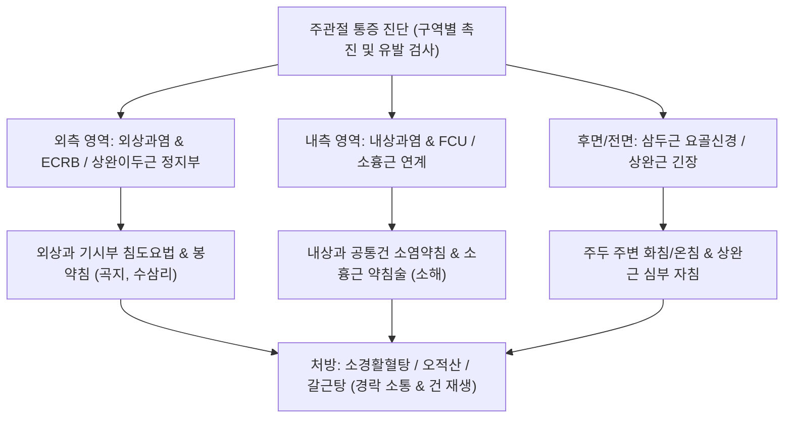

---
aliases:
  - 팔꿈치 관절 주변 통증
  - 주관절 통증
  - Elbow Pain
  - 주관절 주변 통증 증후군
  - 팔꿈치 통증 감별 진단
  - 상과염 및 주관절 건병증
tags:
  - 근골격계질환
  - 주관절
  - 팔꿈치통증
  - 테니스엘보
  - 골퍼엘보
  - 건병증
categories:
  - 근골격계 질환
  - 상지
created: 2024-01-21
updated: 2026-09-18
---

# 팔꿈치 관절 주변 통증 (Pericubital Elbow Pain)

> **핵심 3줄 요약 (Key Summary)**:
> - 🎯 주관절을 형성하는 상완골, 요골, 척골의 3개 관절 복합체 및 주위 근건 단위의 과사용, 견인 손상, 골막염 및 신경 포착으로 인해 발생하는 4대 해부학적 구역(외측, 내측, 후면, 전면)별 포괄적 주관절 통증 증후군
> - 🚩 외측의 외상과염([[테니스 엘보]]), 내측의 내상과염([[골퍼 엘보]]) 및 [[척골신경]] 자극, 후면의 [[상완삼두근]] 건병증 및 주두 점액낭염, 전면의 [[상완이두근]] 및 [[상완근]] 건막염의 뚜렷한 구역별 압통 및 유발 검사 양성
> - 🔍 한의학적으로 주통(肘痛), 비증(痺證), 근상(筋傷)으로 분류하며, 상과 골막 부착부와 근건 이행부의 침도·봉약침 복합 치료, 상부 [[소흉근]] 및 경추 분절 교정 추나, [[오적산]]·[[소경활혈탕]] 투여를 통해 기혈 순환 촉진 및 건 조직 재생 유도
> - ⚠️ 단순 과사용성 건염 외에도 요골관 증후군(PIN 포착), 주관절 터널 증후군, 박리성 골연골염(OCD), 내측측부인대(MCL) 파열과의 정밀 감별 필수

---

## 목차 (Table of Contents)
- [[#1. 개요 및 역학 (Overview & Epidemiology)]]
- [[#2. 병태생리 및 4대 구역별 해부학적 분석 (Pathophysiology & Regional Anatomy)]]
  - [[#2.1 1) 팔꿈치 외측 통증 (외측상과염, 테니스 엘보)]]
  - [[#2.2 2) 팔꿈치 내측 통증 (내측상과염, 골퍼 엘보)]]
  - [[#2.3 3) 팔꿈치 후면 통증 (주두 점액낭염, 삼두근 건병증)]]
  - [[#2.4 4) 팔꿈치 전면 통증 (상완근, 이두근 정지부 건염)]]
- [[#3. 임상 증상 및 구역별 특징 (Clinical Features)]]
- [[#4. 이학적 검사 및 진단적 접근 (Physical Examination & Diagnosis)]]
- [[#5. 구역별 종합 감별 진단 (Differential Diagnosis)]]
- [[#6. 통합의학적 치료 전략 (Management Strategies)]]
  - [[#6.1 양방 의학적 치료 프로토콜]]
  - [[#6.2 한의학적 복합 치료 프로토콜]]
- [[#7. 진료실 핵심 임상 필기 (Clinical Pearls & Practice Tips)]]
- [[#8. 출처 및 학술 참고 문헌 (References)]]

---

## 1. 개요 및 역학 (Overview & Epidemiology)

### 1.1 정의 및 임상적 의의
[[팔꿈치 관절 주변 통증]](Pericubital Elbow Pain)은 상완척골 관절(Humeroulnar joint), 상완요골 관절(Humeroradial joint), 근위 요척 관절(Proximal radioulnar joint)의 3개 관절 복합체와 이를 둘러싼 건(Tendon), 인대(Ligament), 점액낭(Bursa), 그리고 인접 신경(요골·정중·척골신경)의 병리적 변화로 인해 발생하는 통증을 총칭한다.
일반적으로 근육은 뼈에 닿는 정지부(Insertion)가 손상되기 쉬우나, 테니스 백스트로크의 편심성 충격이나 골프 스윙 시 클럽이 지면을 치는 뒤땅 충격, 반복적인 망치질 등에서는 **기시부(Origin)인 상완골 외상과 및 내상과 골막에 극심한 과부하**가 집중되어 만성 골막염 및 건병증을 유발한다.

![[외측상과염_테니스엘보_해부병태도.jpg|500]]
> [그림 1] 팔꿈치 외측 통증의 주원인: 상완골 외상과(Lateral epicondyle) 공통 신전건 부착부의 미세 파열 및 혈관섬유모세포성 건병증 병태도해

### 1.2 역학적 특징
- **발생 빈도**: 성인 인구의 약 1~3%가 매년 주관절 통증을 경험하며, 그중 **외측상과염([[테니스 엘보]])이 전체의 약 70~80%**로 가장 흔하고, **내측상과염([[골퍼 엘보]])이 약 10~15%**, 후면 및 전면 병변이 나머지를 차지한다.
- **호발 연령**: 35~55세의 중장년층에서 호발하며, 스포츠 동호인뿐만 아니라 요리사, 목수, 컴퓨터 사용자, 주부 등 반복적 상지 노동자에게 다발한다.

---

## 2. 병태생리 및 4대 구역별 해부학적 분석 (Pathophysiology & Regional Anatomy)

### 2.1 1) 팔꿈치 외측 통증 (외측상과염, 테니스 엘보)
- **주요 침범 구조물**: [[단요측수근신근]](Extensor Carpi Radialis Brevis, ECRB) 기시부가 90% 이상 침범되며, 인접한 [[총지신근]](EDC), [[척측수근신근]](ECU) 기시부가 동반 침범된다.
- **병태생리**: 테니스 백핸드나 손목을 젖힌 상태에서의 반복 파지 작업 시 ECRB의 등장성 및 편심성 수축으로 인해 외상과 골막 부착부에 미세 열상(Microtear)과 불완전한 혈관섬유모세포성 과형성(Angiofibroblastic hyperplasia)이 초래된다.
- **오금 외측 통증 연계**: [[상완이두근]]의 요골 조면(Radial tuberosity) 정지부 건염 및 요골두 활액낭의 자극이 동반되어 주관절 오금 외측의 뻐근한 압통을 유발한다.

![[외측상과염_단요측수근신근_손상기전.jpg|500]]
> [그림 2] 단요측수근신근(ECRB)의 상완골 외상과 부착부 손상 기전: 라켓 백스트로크 및 손목 신전 부하 시 골막-건 접합부에 가해지는 전단 인장력

### 2.2 2) 팔꿈치 내측 통증 (내측상과염, 골퍼 엘보)
- **주요 침범 구조물**: [[척측수근굴근]](FCU), [[원회내근]](PT), [[요측수근굴근]](FCR)이 합류하는 공통 굴근건(Common flexor tendon).
- **병태생리**: 골프 스윙의 다운스윙 및 임팩트, 야구 투구의 가속기 동안 발생하는 극심한 외반 스트레스(Valgus stress)와 반복적인 손목 굴곡으로 내상과 골막에 미세 파열 발생.
- **신경학적 연계**: 내측상과 바로 후방 척골신경구로 주행하는 [[척골신경]]이 인접 활막 부종이나 FCU 두 갈래 사이 건궁에 의해 압박받아 4·5지 저림을 동반할 수 있으며, 상위 [[소흉근]]의 단축이 내측 통증을 증폭시킨다.

![[내측상과염_골퍼엘보_3D_병태해부도.jpg|500]]
> [그림 3] 상완골 내측상과염(골퍼 엘보)의 3D 병태해부도: 공통 굴근건 기시부의 만성 인장력으로 인한 건막 파열 및 염증 영역

### 2.3 3) 팔꿈치 후면 통증 (주두 점액낭염, 삼두근 건병증)
- **주두 점액낭염(Olecranon Bursitis)**: 주두 돌기 직상방의 피하 점액낭이 책상에 팔꿈치를 기대거나 직접 타박을 받아 활액 삼출액이 고여 거위알처럼 불룩하게 부어오르는 질환.
- **[[상완삼두근]] 건병증**: 중량 벤치프레스나 팔굽혀펴기, 강한 투척 동작 시 주두 부착부에 견인성 건염 발생.
- **신경학적 허혈**: 상완삼두근 외측두와 내측두 사이를 비스듬히 횡단하는 [[요골신경]]이 근육 과긴장으로 포착되면 주두 후면부의 뻐근한 허혈성 통증과 전완 배측 방사통이 유발된다.

### 2.4 4) 팔꿈치 앞면 통증 (상완근, 이두근 정지부 건염)
- **[[상완이두근]] 원위 건염**: 주와(Cubital fossa) 심부 요골 조면 부착부의 염증으로 전완 저항 회외 시 극심한 통증.
- **[[상완근]](Brachialis) 긴장**: 척골 조면(Ulnar tuberosity)에 부착하여 순수 주관절 굴곡을 담당하는 심부 근육으로, 팔을 구부린 상태로 무거운 짐을 장시간 나를 때 과긴장하여 팔꿈치 오금 정중앙 심부의 묵직한 통증을 유발한다.

---

## 3. 임상 증상 및 구역별 특징 (Clinical Features)

| 구역 | 대표 질환 | 주 통증 유발 동작 | 특징적 촉진 및 방사통 부위 |
| :--- | :--- | :--- | :--- |
| **외측** | [[테니스 엘보]], 요골관 증후군 | 문손잡이 돌리기, 커피잔 들기, 키보드 타이핑 | 외상과 1 cm 원위부 ECRB 압통, 전완 배측 방사통 |
| **내측** | [[골퍼 엘보]], 척골신경염 | 걸레 짜기, 물건 당기기, 골프 스윙 임팩트 | 내상과 전하방 압통, 4·5지 저림 동반 가능 |
| **후면** | 주두 점액낭염, 삼두근건염 | 팔꿈치로 바닥 짚기, 팔굽혀펴기, 턱 괴기 | 주두 돌기 부종, 삼두근 건 부착부 압통 |
| **전면** | 상완근/이두근건염, 회내근증후군 | 무거운 상자 들어 올리기, 드라이버 돌리기 | 주와 심부 압통, 전완 전면부 둔통 |

---

## 4. 이학적 검사 및 진단적 접근 (Physical Examination & Diagnosis)

![[golfers_elbow_test_step2_wrist_flexion_resistance.jpg|500]]
> [그림 4] 내측상과염 및 전완 굴근군 평가를 위한 저항 굴곡 검사

### 4.1 특수 이학적 유발 검사
1. **코젠 검사(Cozen's Test - 외측상과염)**:
   - 환자의 주관절을 90도 굴곡하고 전완을 회내시킨 상태에서 주먹을 쥐고 손목을 신전(Dorsiflexion) 및 요측 편위하도록 지시하고, 검사자가 손등에 강한 하방 저항을 가한다.
   - 외상과 부위에 날카로운 통증이 유발되면 양성이다.
2. **밀스 검사(Mill's Test - 외측상과염 스트레칭)**:
   - 검사자가 환자의 팔꿈치를 완전 신전시키고 전완을 완전 회내한 상태에서 손목을 강제로 완전 굴곡시킨다.
   - 외상과 부위에 팽팽한 견인통이 재현되면 양성.
3. **골퍼 엘보 검사(Golfer's Elbow Test - 내측상과염)**:
   - 환자의 주관절을 완전 신전하고 전완을 회외시킨 상태에서 손목을 수동으로 과신전시키거나, 환자의 능동 손목 굴곡에 검사자가 저항을 가할 때 내상과에 통증 발생 시 양성.
4. **저항성 중지 신전 검사(Maudsley's Test)**:
   - 환자의 제3수지(중지) 신전에 대해 검사자가 저항을 가할 때 외상과에 통증이 발생하면 ECRB 및 총지신근 건염, 또는 요골관 증후군(PIN 포착)을 강력히 시사.

### 4.2 영상의학적 검사
- **단순 방사선(X-ray)**: 주관절 AP, Lateral, Oblique 뷰를 통해 상과 주변의 석회화 건염(Calcification), 박리성 골연골염(OCD), 관절내 유리체(Loose body), 주두 골극을 확인.
- **근골격계 초음파(US)**: 외상과 및 내상과 공통건의 비후, 건 실질 내 저에코성 파열(Hypoechoic defect), 골막 피질 불규칙성(Cortical irregularity), 파워 도플러상 신생 혈관 증식을 100% 실시간 확인하는 표준 검사법.

---

## 5. 구역별 종합 감별 진단 (Differential Diagnosis)

| 질환명 | 주 통증 부위 | 호발 기전 및 특징 | 감별 포인트 |
| :--- | :--- | :--- | :--- |
| **[[테니스 엘보]](외측상과염)** | 상완골 외상과 직하방 | 손목 신전근 과사용, Cozen 양성 | 외상과 골막 압통 명확, 손목 신전 저항 시 악화 |
| **[[요골신경 포착]](요골관 증후군)** | 외상과 하방 3~4 cm (회외근) | 후골간신경(PIN)의 기계적 압박 | 외상과 자체보다 전완 근복부 압통, 야간통 심화 |
| **[[골퍼 엘보]](내측상과염)** | 상완골 내측상과 전하방 | 손목 굴근/원회내근 과사용 | 내상과 골막 압통, 손목 굴곡 저항 시 악화 |
| [[주관절 터널 증후군]] | 내측상과 후방 척골신경구 | 척골신경 압박, 주관절 굴곡 악화 | 4·5지 저림, Froment 징후 양성, 수포부 Tinel 양성 |
| **주두 점액낭염(Bursitis)** | 팔꿈치 맨 끝 주두 돌기 | 반복 마찰, 감염, 직접 타박 | 거위알 모양의 파동성 종창, 관절 운동 자체는 보존 |
| **내측측부인대(MCL) 파열** | 주관절 내측 관절선 | 투수, 강한 외반 스트레스 외상 | Valgus stress test 양성, Milking maneuver 양성 |

---

## 6. 통합의학적 치료 전략 (Management Strategies)

### 6.1 양방 의학적 치료 프로토콜
1. **보존적 급성기 처치**:
   - 상지 활동 제한, 과도한 쥐기 동작 및 비틀기 중단.
   - 전완 밴드(Counterforce brace) 착용: 외상과 하방 2~3 cm 근복에 착용하여 상과 부착부로 전달되는 인장력 분산.
   - 경구 NSAIDs 1~2주 단기 투여.
2. **재생 주사 요법 및 물리치료**:
   - 체외충격파 치료(ESWT): 주 1회, 2000~3000회 저에너지 초점형 또는 방사형 충격파로 건 섬유 신생 혈관 생성 촉진.
   - 자가혈소판풍부혈장(PRP) 또는 PDRN 주사: 만성 난치성 건병증 부위에 주입하여 콜라겐 조직 재생 유도.
   - (주의) 국소 스테로이드 주사는 단기 진통 효과는 우수하나 장기적으로 건 파열 및 재발률을 높이므로 극도로 제한.
3. **수술적 치료 고려 (보존적 치료 6~12개월 실패 시)**:
   - 니르슐 술식(Nirschl procedure): 외상과 변성된 ECRB 건 조직 절제 및 상과 피질골 천공술.

### 6.2 한의학적 복합 치료 프로토콜
한의학적으로 팔꿈치 관절 주변 통증은 주통(肘痛), 비증(痺證), 근상(筋傷)의 범주에 속하며, 어혈조락(瘀血阻絡), 풍한습비(風寒濕痺), 간신휴손(肝腎虧損)으로 변증한다.

#### 1) 침구 치료
- **외측 통증 혈위**: 곡지(LI11), 수삼리(LI10), 주료(LI12), 수오리(LI13), 척택(LU5). 외상과 골막 부착부에 15도 사자로 골막을 살짝 자극하여 국소 충혈 반응 유도.
- **내측 통증 혈위**: 소해(HT3), 소해(SI8), 곡택(PC3), 극문(PC4). 내측상과 공통 굴근건 부착부 및 전완 전면 굴근막 자침.
- **후면 및 전면 혈위**: 청랭연(TE10), 천정(TE11), 비노(LI14). [[상완삼두근]] 근복 발통점과 [[상완근]] 외측 경계면에 심자하여 신경 포착 및 근경직 해소.
- **화침 및 전침 요법**: 만성 난치성 외상과염 부착부에 화침(Fire needle) 또는 2~100 Hz 저주파 전침을 15분간 적용하여 섬유화된 건 조직의 자가 치유 기전 활성화.

#### 2) 약침 요법
- **봉약침 요법 (Bee Venom - 주관절 표준 치료)**:
  - BV(0.05~0.1 mg/ml)를 외상과 및 내상과 공통건 부착부, 그리고 근건 이행부에 0.1 cc씩 분주.
  - 강력한 멜리틴 항염증 작용과 미세 순환 증식 효과로 만성 건병증의 재수초화 및 건 재생 촉진.
- **중성어혈약침 및 황련해독탕 약침**: 급성 발열성 주두 점액낭염 및 급성 상과염 부종에 적용하여 삼출액 흡수.

#### 3) 침도 요법 (Acupotomy - 만성 상과염 표준 시술)
- **적응증**: 3개월 이상 지속된 만성 외측상과염 및 내측상과염으로 골막 부착부의 비후된 섬유성 반흔 및 유착이 확인되는 증례.
- **시술 방식**: 0.4×40 mm 침도를 사용하여 상완골 외상과 또는 내상과 골막 경계면에서 비후된 건 섬유대를 골면과 평행하게 종축 박리(Stripping & Peeling)하여 병변부의 비정상적 기계적 장력을 즉각 감압.

#### 4) 추나요법 및 관절 가동술
- **주관절 가동술(Mobilization with Movement, MWM)**:
  - 멀리건 기법: 검사자가 환자의 상완골을 고정한 채 주관절 근위 전완부를 외측 또는 내측으로 수직 글라이딩(Lateral glide)을 가한 상태에서 환자에게 통증 없는 손목 신전/굴곡을 반복하도록 유도.
- **경추 및 흉곽출구 연계 교정**: C5~T1 경추 분절 교정 및 [[소흉근]] 이완 추나를 통해 상완신경총 축삭 수송을 정상화.

#### 5) 한약물 요법
- **급성 종통 및 근육 경련**: [[갈근탕]](葛根湯) 또는 [[당귀수산]](當歸鬚散)에 지루(地龍), 강황(薑黃)을 가미하여 기혈 응체를 신속히 해소.
- **만성 풍한습비 및 혈액순환 장애**: [[소경활혈탕]](疎經活血湯) 또는 [[오적산]](五積散) 가미방으로 주관절 주위 경락을 소통시키고 진통 유도.
- **만성 퇴행성 건병증 및 허증**: [[대호경간탕]](大護經肝湯) 또는 [[독활기생탕]](獨活寄生湯)을 장기 투여하여 간신을 보하고 힘줄과 뼈의 재생력 복원.

---

## 7. 진료실 핵심 임상 필기 (Clinical Pearls & Practice Tips)

### 7.1 진료실 구역별 3대 실전 진료 팁
1. **외측상과염 치료 시 상완이두근 정지부 동시 확인**:
   - 테니스 엘보 환자 중 외상과만 치료해서 잘 낫지 않는 환자는 십중팔구 팔꿈치 오금 바깥쪽의 [[상완이두근]] 요골조면 정지부에 건염이 동반되어 있다. 이두근 정지점과 ECRB 근복을 함께 풀어주어야 완치된다.
2. **내측상과염 치료 시 소흉근(Pectoralis Minor) 선행 치료**:
   - 팔꿈치 안쪽이 아픈 골퍼 엘보 환자는 대다수 라운드 숄더와 함께 [[소흉근]]이 심하게 단축되어 있다. 소흉근 아래를 지나는 척골신경이 자극받으면 내측상과 굴근군이 지속적으로 긴장하므로, **소흉근 압통점 약침 시술이 필수**이다.
3. **주두 점액낭염 감염 감별(Infection Rule-out)**:
   - 팔꿈치 뒤쪽이 물혹처럼 부풀어 올랐을 때 피부 발적, 심한 열감, 오한이 동반되면 화농성 점액낭염(Septic bursitis)이므로 즉시 천자 배액 및 양방 항생제 투여를 의뢰해야 하며, 무균성일 경우 압박 붕대 고정과 소염약침으로 안전하게 치료한다.

---

## 8. 출처 및 학술 참고 문헌 (References)

1. Yin J, Tang G, Zhao B et al. (2026). Efficacy evaluation of acupuncture combined with manipulation for lateral epicondylitis: a meta-analysis. *Front Med (Lausanne)*, 13:1356782. [PMID: 42723768](https://pubmed.ncbi.nlm.nih.gov/42723768/)
   - [연구 요약]: 외측상과염 환자를 대상으로 침 치료와 도수 교정(추나요법) 병행 시의 통증 감소(VAS), 악력 회복 및 재발률 억제 효과를 체계적으로 평가한 최신 메타분석 연구.
2. Cha JM, Yoon SY, Kim YW et al. (2026). Comparative Effectiveness of Focused Versus Radial Extracorporeal Shockwave Therapy and Leukocyte-Poor Versus Leukocyte-Rich Platelet-Rich Plasma for Lateral Epicondylitis: A Network Meta-Analysis. *J Clin Med*, 15(17):5890. [PMID: 42739684](https://pubmed.ncbi.nlm.nih.gov/42739684/)
   - [연구 요약]: 주관절 외상과 건병증에서 체외충격파(ESWT)와 혈소판풍부혈장(PRP) 요법의 임상적 유효성, 건 섬유 재형성 및 기능 회복도를 비교 분석한 네트워크 메타분석.
3. Milanesi EA, Andersen MF, Siesing-Mejer B et al. (2026). [Lateral epicondylitis]. *Ugeskr Laeger*, 188(32):V02260114. [PMID: 42563697](https://pubmed.ncbi.nlm.nih.gov/42563697/)
   - [연구 요약]: 테니스 엘보의 생체역학적 기전, 요골관 증후군과의 감별 진단, 단계별 보존 치료 및 비수술적 재생 치료 가이드라인을 제공한 임상 가이드.