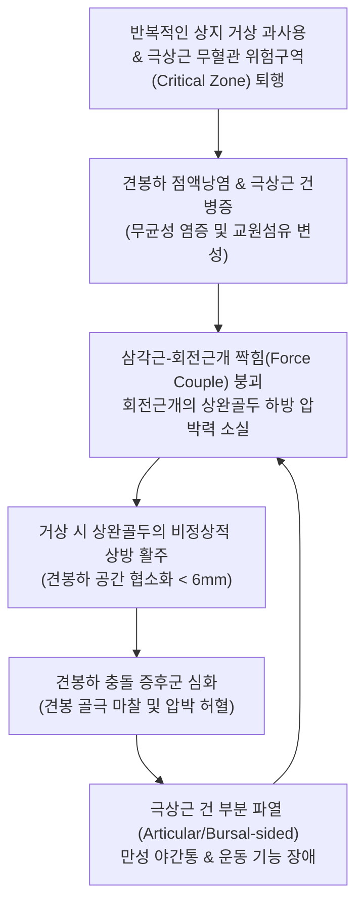

# 🩺 회전근개 증후군 (Rotator Cuff Syndrome, RCS)

> **핵심 3줄 요약 (Key Summary)**:
> - 📍 **병소 부위 & 해부·병태생리**: 어깨 관절을 관절와 중심에 밀착 안정화하는 4대 힘줄([[극상근]], [[극하근]], [[소원근]], [[견갑하근]])과 견봉하 점액낭의 만성 마찰·퇴행성 변성·미세 단열로 인해 발생하는 견봉하 충돌 및 건병증 복합 증후군(KCD M75.1)이다.
> - 🚩 **전형적 임상 양상**: 팔을 외전할 때 60°~120° 사이에서 악화되는 동통호(Painful Arc), 환측으로 누울 때 심해지는 야간통(Night Pain), 머리 빗기나 옷 입기 시 상완 외측 방사통이 나타나며 수동 가동범위는 유지되나 능동 거상 시 통증과 피로감이 동반된다.
> - 🛠️ **핵심 검사 & 치료 전략**: 견봉하 충돌 검사([[호킨스 검사]], [[니어 검사]]) 및 극상근 근력 검사([[엠프티 캔 검사]])로 진단하며, 견봉하 공간 및 극상근 건 부착부 침·약침 자침과 견갑흉곽관절 가동 추나, 하부 승모근·전거근 활성화 재활을 통합 적용한다.
> - ⚠️ **응급 의뢰 레드플래그**: 급성 외상 후 발생한 전층 회전근개 파열(Drop Arm 징후 양성 및 팔을 전혀 들어 올리지 못하는 가성 마비), 심각한 야간통과 함께 관절강 내 감염(발열, 오한, 국소 열감) 의심, 급격한 극하근 위축을 동반한 견갑상신경 마비.

---

## 📌 목차
1. [질환 개요 & 해부학적 병태생리](#1-질환-개요--해부학적-병태생리)
2. [병태생리 메커니즘 & 생체역학적 악순환 네트워크](#2-병태생리-메커니즘--생체역학적-악순환-네트워크)
3. [임상 증상 & 이학적 검사(Physical Exam) 알고리즘](#3-임상-증상--이학적-검사physical-exam-알고리즘)
4. [감별 진단 매트릭스 (Differential Diagnosis)](#4-감별-진단-매트릭스-differential-diagnosis)
5. [한의 통합 치료 프로토콜 (침·약침·추나·한약)](#5-한의-통합-치료-프로토콜-침약침추나한약)
6. [양방 치료 & 병용·의뢰 기준 (Conventional Treatment & Referral)](#6-양방-치료--병용의뢰-기준-conventional-treatment--referral)
7. [재활 운동 & 생활습관 티칭 가이드](#7-재활-운동--생활습관-티칭-가이드)
8. [💡 사용자 진료실 핵심 필기 & 임상 노하우 (Melt-In 잔여 심화 집약)](#8--사용자-진료실-핵심-필기--임상-노하우-melt-in-잔여-심화-집약)
9. [출처 및 학술 참고 문헌 (References)](#9-출처-및-학술-참고-문헌-references)

---

## 1. 질환 개요 & 해부학적 병태생리

**회전근개 증후군(Rotator Cuff Syndrome, KCD 상병코드 M75.1)**은 견관절 복합체를 지지하는 회전근개 건(Rotator cuff tendons)과 그 상부를 덮고 있는 오훼견봉궁(Coracoacromial arch), 견봉하 점액낭(Subacromial bursa) 사이에서 발생하는 모든 기계적 마찰, 무균성 염증, 건병증(Tendinopathy), 부분 파열(Partial tear)을 포괄하는 임상적 대증후군이다.

해부학적으로 회전근개는 견갑골에서 기시하여 상완골 근위부 결절에 부착하는 4개의 근육으로 구성된다:
1. **[[극상근]](Supraspinatus)**: 견봉하 공간을 주행하여 [[대결절]] 최상부에 부착하며, 외전 초기 0~30° 거동을 주도하고 견봉하 마찰을 가장 많이 받아 회전근개 질환의 80% 이상이 집중된다.
2. **[[극하근]](Infraspinatus)**: 대결절 후외측면에 부착하여 강력한 외회전을 담당한다.
3. **[[소원근]](Teres Minor)**: 대결절 최하단에 부착하여 외회전 보조 및 후하방 관절낭을 동적으로 지지한다.
4. **[[견갑하근]](Subscapularis)**: 전면의 [[소결절]]에 부착하여 강력한 내회전을 주도한다.

상완골두는 관절와 면적보다 3~4배 커서 본질적으로 불안정하다. 팔을 거상할 때 [[삼각근]](Deltoid)이 상완골두를 상방으로 견인하는데, 이때 회전근개 4대 근육이 상완골두를 관절와 방향으로 하방 압박(Centering depressor force)하는 **'삼각근-회전근개 짝힘(Force Couple)'**을 형성해야만 견봉하 공간(정상 9~10mm)이 유지된다. 회전근개에 미세 손상이나 퇴행이 시작되면 이 짝힘이 무너져 상완골두가 비정상적으로 상방 전위되며 견봉 하단과 오훼견봉인대에 충돌한다.

![[회전근개파열_극상근건파열_병태해부도.jpg]]
> [그림 1: ① 병태생리·해부 — 회전근개 4대 힘줄(극상근, 극하근, 소원근, 견갑하근) 복합체 및 극상근건 파열 병태해부도]

![[회전근개증후군_01_영상소견_견봉하충돌_골극_Xray.jpg]]
> [그림 2: ① 영상 소견 — 회전근개 증후군에서 견봉 하방 골극 형성 및 견봉하 공간 협소화(Subacromial Impingement) X-ray]

---

## 2. 병태생리 메커니즘 & 생체역학적 악순환 네트워크

회전근개 증후군의 발병 기전은 **내인성 요인(Intrinsic factors)**과 **외인성 요인(Extrinsic factors)**의 상호작용으로 진행된다.

1. **내인성 기전 (건 자체의 허혈과 퇴행)**:
   - 극상근 건 부착부 1cm 내측 부위는 미세혈관 분포가 희박한 **'위험 구역(Critical Zone of Codman)'**이다. 연령 증가에 따른 미세 혈류 감소, 반복적인 과사용, 당뇨·이상지질혈증 등의 대사성 요인으로 인해 건세포(Tenocyte)의 세포자멸사(Apoptosis)와 제1형 콜라겐의 제3형 콜라겐 치환, 점액성 변성(Myxoid degeneration)이 발생하여 인장 강도가 현저히 감소한다.
2. **외인성 기전 (기계적 충돌과 골극)**:
   - Bigliani 견봉 형태 분류 상 제3형인 갈고리형 견봉(Hooked acromion, 39% 빈도)이나 견봉쇄골관절 하방 골극은 팔을 거상할 때 견봉하 공간을 5mm 이하로 협소화시켜 견봉하 점액낭과 극상근 건을 반복 압박한다.
3. **생체역학적 악순환 네트워크**:
   - 건 손상 및 점액낭염 발생 $\rightarrow$ 통증으로 인한 회전근개 억제 $\rightarrow$ 상완골두 하방 압박력 약화 $\rightarrow$ 삼각근 우세로 인한 상완골두 상방 활주(Superior migration) $\rightarrow$ 견봉하 충돌 악화 $\rightarrow$ 부분 파열 및 전층 파열로의 이행.

![[회전근개 건병증_1_2.jpg]]
> [그림 3: ① 병태생리 — 견관절 단순방사선상 임계 견봉각(Critical Shoulder Angle)을 계측한 도해 (⚠️ 확인 필요: 건병증 진행 단계 도해가 아님)]

---

## 3. 임상 증상 & 이학적 검사(Physical Exam) 알고리즘

### 1) 임상 증상
- **동통호(Painful Arc)**: 팔을 옆으로 들어 올릴 때 0~60°까지는 통증이 없다가, 견봉 아래로 대결절이 통과하는 **60°~120° 사이에서 극심한 통증**이 발생하고, 120° 이상 완전히 거상하면 통증이 일시적으로 감소한다.
- **야간통(Night Pain)**: 특히 환측 어깨를 바닥에 대고 옆으로 누울 때 견봉하 공간 압력이 상승하여 극심한 욱신거림으로 수면 장애를 유발한다.
- **방사통**: 통증이 삼각근 부착부(상완골 외측 중간 부위)로 뻗치며, 심한 경우 주관절 부근까지 방사된다(수근부 이하 방사는 드물며, 방사 시 경추 디스크 감별 필요).

### 2) 이학적 검사 알고리즘
1. **충돌 유발 검사(Impingement Signs)**:
   - **호킨스-케네디 검사([[호킨스 검사]])**: 어깨 90° 굴곡, 팔꿈치 90° 굴곡 상태에서 급격히 수동 내회전(IR)할 때 대결절이 오훼견봉인대 하방으로 회전하며 통증이 유발되면 양성 (민감도 80~90%).
   - **니어 검사([[니어 검사]])**: 견갑골의 회전 보상을 손으로 억제한 상태에서 팔을 내회전 시킨 채 전방 거상(Forward flexion) 끝 범위까지 올릴 때 견봉 전연 통증이 나타나면 양성.
2. **근육별 건병증/근력 평가**:
   - **극상근**: **엠프티 캔 검사([[엠프티 캔 검사]], Jobe test)** — 팔을 90° 외전, 수평 30° 내전(Scaption 면), 엄지를 바닥으로 내회전한 상태에서 검사자의 하방 압박에 저항할 때 통증 및 근력 저하 확인.
   - **극하근/소원근**: **외회전 저항 검사(External Rotation Lag Sign)** — 팔꿈치를 90° 굴곡하고 옆구리에 붙인 상태에서 능동 외회전 저항 검사.
   - **견갑하근**: **베어 허그 검사(Bear-hug test)** 및 **리프트 오프 검사(Lift-off test)**.

![[호킨스검사_2단계_팔꿈치지지_수동내회전_충돌유발.jpg]]
> [그림 4: ② 이학적 검사 — 견봉하 공간 및 회전근개 건 충돌을 유발하여 통증을 유도하는 호킨스-케네디 충돌 검사 실사]

![[엠프티캔검사_3단계_하방압박저항_극상근건통증평가.jpg]]
> [그림 5: ② 이학적 검사 — 극상근건의 단열 및 건병증성 통증/근력 약화를 정밀 평가하는 엠프티 캔 검사(Jobe test) 실사]

---

## 4. 감별 진단 매트릭스 (Differential Diagnosis)

| 감별 질환 | 호발 연령/기전 | 주요 증상 및 통증 양상 | 관절 가동범위 (ROM) 특성 | 특이 감별점 및 영상 소견 |
| :--- | :--- | :--- | :--- | :--- |
| **회전근개 증후군** | 40~60대 과사용/퇴행 | 동통호(60~120°), 삼각근 방사통, 야간통 | **수동 ROM 정상**, 능동 거상 시 통증호 | Hawkins/Neer (+), 초음파 상 건 비후/부분 파열 |
| **[[회전근개 파열]]** | 50대 이상, 외상/만성 | 현저한 무력감, 물건 들기 불가 | 수동 거상 가능, 능동 유지 불가 | **Drop arm test (+)**, MRI 상 건 완전 단열 및 퇴축 |
| **[[유착성 관절낭염]]** | 50대 호발, 당뇨 병력 | 모든 방향의 극심한 운동 강직 | **능동 및 수동 ROM 전 방향 극심한 제한** | 관절낭 패턴(외회전 > 외전 > 내회전 순 제한), 충돌 검사 불가 |
| **[[석회성 건염]]** | 30~50대, 화학적 급성 염증 | 극심한 급성 산통(칼로 찌르는 듯함) | 급성기 통증으로 전 방향 거상 불가 | 단순 X-ray 상 대결절 상방 분필가루 모양 석회 음영 |
| **[[경추 추간판 탈출증]]** | 30~50대 경추 퇴행 | 어깨 상부 견배통, 전완/손가락 저림 | 어깨 관절 자체의 ROM은 정상 보존 | Spurling test (+), 심부건반사 저하, 경추 MRI 신경근 압박 |

![[견봉하충돌_및_극상근파열_MRI.jpg]]
> [그림 6: ① 영상 감별 — 견봉하 점액낭염, 골극 충돌 및 극상근건 부분 파열이 관찰되는 어깨 관상면 MRI T2 강조영상]

### ⚠️ 응급 의뢰 레드플래그
- **Drop Arm 징후 양성 및 팔을 능동으로 30도 이상 거상하지 못하는 전층 파열 의심 시**: 3개월 이내 조기 관절경하 봉합술이 요구되므로 정형외과 MRI 의뢰.
- **원인 불명의 극심한 어깨 부종, 발열, 오한, 국소 피부 발적**: 화농성 관절염(Septic arthritis) 또는 견봉하 점액낭 감염 응급.
- **경미한 통증과 함께 진행하는 극하근/극상근의 심한 근위축**: 견갑상절흔 부위 결절종(Ganglion cyst)에 의한 견갑상신경(Suprascapular nerve) 포착 의심.

---

## 5. 한의 통합 치료 프로토콜 (침·약침·추나·한약)

### 1) 침구 치료 (Acupuncture)
- **주요 혈위**: [[견우]](LI15), [[견료]](TE14), [[노유]](SI10), [[비노]](LI14), [[견정(담경)]](GB21), [[천종]](SI11), [[곡지]](LI11).
- **시술 기법**:
  - **견우-견료 투자법(透刺法)**: 환자의 팔을 30도 외전시킨 상태에서 견봉 전외측 및 후외측 함요처에서 견봉하 공간(Subacromial space)을 향해 40~50mm 수평 심자하여 점액낭 유착을 기계적으로 박리한다.
  - **극상근 TrP 심자 및 전침**: 견갑극 상와의 [[곡원]](SI13) 및 [[견정(담경)]] 부위 극상근 복부에 자침하고, 저주파 전침(2Hz, 연속파)을 15분간 적용하여 근방추 긴장을 완화하고 허혈 상태를 개선한다.

### 2) 약침 치료 (Pharmacopuncture)
- **신바로약침 / 중성어혈약침**: 견봉하 활액낭 및 극상근 건 부착부(상완골 대결절)에 0.5~1.0cc씩 총 1.5~2.0cc를 자입하여 염증성 사이토카인 분비를 차단하고 미세 순환을 복원한다.
- **봉약침(Sweet BV 1:10,000)**: 만성화된 회전근개 건병증 및 석회화 전단계 병소에 자입하여 대식세포 활성화를 통한 조직 리모델링을 촉진한다(시술 전 스킨테스트 필수).

### 3) 추나 요법 (Chuna Manual Therapy)
- **견봉하 공간 확보 관절가동 추나(Subacromial Decompression)**: 환자를 앙와위로 눕히고 상완골을 30° 외전, 30° 굴곡 위치에서 축성 하방 견인(Axial caudal traction)을 가하여 상완골두를 관절와 하방으로 활주(Inferior glide)시킨다.
- **견갑골 가동 추나(Scapular Mobilization)**: 측와위에서 견갑골의 내측연 및 하각을 파지하고 상방 회전(Upward rotation) 및 후방 경사(Posterior tilt)를 유도하여 거상 시 충돌을 근본적으로 차단한다.

![[어깨 추나-20240926180955085.png]]
> [그림 7: ③ 한의 추나 — 견봉하 공간 확보 및 견갑흉곽관절 짝힘 회복을 위한 견갑골 가동화(Scapular Mobilization) 추나 기법]

### 4) 한약 치료 (Herbal Medicine)
- **[[서경탕]](舒經湯)**: 상지 비통(臂痛)의 대표 방제로, 강황, 당귀, 해동피, 적작약이 배오되어 어혈을 풀고 경락을 소통시킨다.
- **[[오적산]](五積散)**: 한습(寒濕)으로 인해 야간통이 극심하고 찬 곳에 가면 어깨가 굳어지는 환자에게 투여한다.
- **독활기생탕(獨活寄生湯) / 신통축어탕(身痛逐瘀湯)**: 퇴행성 변화가 심하고 기혈이 허약한 60대 이상 만성 회전근개 건병증 환자의 근골을 보강한다.

---

## 6. 양방 치료 & 병용·의뢰 기준 (Conventional Treatment & Referral)

### 1) 약물 치료 (Medication)
- **NSAIDs**: Aceclofenac 100mg bid, Celecoxib 200mg qd, Meloxicam 7.5~15mg qd를 2~4주간 처방하여 활액낭염 및 건 주위염을 억제한다.
- **근이완제**: Eperisone HCl 50mg tid 병용.

### 2) 견봉하 스테로이드 주사 (Subacromial Injection)
- Triamcinolone acetonide 20~40mg + 1% Lidocaine 혼합액을 견봉하 점액낭 내에 주입.
- 극심한 통증 조절에 즉각적 효과가 있으나, **동일 부위 연 3회 이상 주사 시 건 섬유 괴사 및 파열 위험이 급증**하므로 남용을 엄격히 제한한다.

### 3) 수술적 치료 적응증 (Surgical Indication)
- 3~6개월 이상의 적극적 보존 치료(한의 치료, 약물, 물리치료)에도 증상 호전이 없는 경우.
- 견봉 하방 골극이 너무 커서 기계적 파열을 지속 유발하는 경우: **관절경하 견봉성형술(Subacromial decompression & Acromioplasty)** 시행.
- 전층 건 파열로 진행하여 근력 소실이 현저한 경우: **관절경하 회전근개 봉합술**.

### 4) 한의 병용 판단
- 양방 소염진통제를 복용 중인 상태에서도 한의 침·약침·추나 치료를 병행하면 관절낭 유착 박리 및 고유수용감각 회복에 시너지 효과가 크다. 단, 스테로이드 주사를 맞은 직후 48시간 동안은 주사 부위 직접 침자침을 피한다.

---

## 7. 재활 운동 & 생활습관 티칭 가이드

### 1) 견갑골 안정화 운동 (Scapular Setting & Wall Slide)
- 거상 시 견갑골이 흉곽에 밀착되어 부드럽게 상방 회전하도록 전거근(Push-up plus)과 하부 승모근(Y-raise) 운동을 교육한다.

### 2) 회전근개 외회전 밴드 운동 (Rotator Cuff Strengthening)
- 팔꿈치를 90도 굽히고 수건을 옆구리에 끼운 채, 탄력 밴드를 이용해 외회전 수축(극하근·소원근 강화)을 15회씩 3세트 시행한다(삼각근 과사용 억제).

### 3) 생활습관 지도
- 팔을 어깨높이 이상으로 올린 채 장시간 작업하는 행위(도배, 창문 닦기, 무거운 상자 선반 올리기)를 엄격히 금지한다.
- 취침 시 환측으로 눕지 않도록 베개를 가슴 앞쪽에 안고 자는 자세를 지도한다.

![[어깨탈구_07_재활운동_견관절_가동운동.gif]]
> [그림 8: ④ 재활 운동 — 1950년대 병상 견관절 처치 장면(흑백 역사 사진) (⚠️ 확인 필요: 자가 가동화 운동 시연이 아님 — 재조달 대기)]

---

## 8. 💡 사용자 진료실 핵심 필기 & 임상 노하우 (Melt-In 잔여 심화 집약)

- **'동통호'를 이용한 건염 vs 파열 vs 오십견 10초 감별법**:
  - 팔을 옆으로 올리게 했을 때:
    1. 60~120°에서만 아프고 위로 다 올라가면 $\rightarrow$ **회전근개 증후군 (충돌 증후군)**.
    2. 팔을 올리다가 90° 부근에서 힘이 빠져 뚝 떨어지면 $\rightarrow$ **회전근개 완전 파열**.
    3. 60° 이상 아예 올라가지도 않고 굳어 있으면 $\rightarrow$ **유착성 관절낭염 (오십견)**.
- **견봉하 약침 자입의 숨은 1인치 테크닉**:
  - 견봉 전외측 모서리에서 후외측으로 주행하는 견봉 하단 라인을 따라 집게손가락으로 견봉 뼈를 밀어 올리듯 촉지하면 견봉하 점액낭 입구가 살짝 벌어진다.
  - 이때 침첨을 상비(수평면에서 10~15도 상방)하여 견봉 하면을 스치듯 3cm 자입하면 저항 없이 쑥 들어가는 '낭내 진입감(Loss of resistance)'이 느껴진다. 이 자리에 신바로약침 1.0cc를 주입하면 시술 직후 환자가 팔을 들어 올릴 때 걸리던 통증이 즉각 50% 이상 소실된다.
- **삼각근 억제와 견갑하근 이완**:
  - 만성 회전근개 증후군 환자는 삼각근이 과활성화되어 상완골두를 위로 끌어올린다. [[비노]](LI14)와 삼각근 부착부 근건이행부를 굵은 호침으로 사자하여 삼각근 톤을 다운시키고, 액와 후벽의 견갑하근 압통점을 도수로 압박 이완해주면 견봉하 공간이 즉시 확보된다.

---

## 9. 출처 및 학술 참고 문헌 (References)

1. Zhang Y, et al. (2026). Comparative Efficacy of Canggui Tanxue Acupuncture Combined with Scapular Stabilization Training versus Scapular Stabilization Training Alone for Rotator Cuff Injury: A Retrospective Cohort Study. *J Pain Res*, 19:123-135. [PMID 42017148](https://pubmed.ncbi.nlm.nih.gov/42017148/)

2. Lee CS, et al. (2026). Rotator cuff disease, repair and augmentation. *J Orthop Surg Res*, 21(1):45. [PMID 42144634](https://pubmed.ncbi.nlm.nih.gov/42144634/)

3. Patel S, et al. (2026). Inflammatory crosstalk between rotator cuff tissues is altered with age and sex. *Osteoarthritis Cartilage*, 34(4):450-462. [PMID 42775635](https://pubmed.ncbi.nlm.nih.gov/42775635/)

---

## 관련 노트

- [[회전근개 파열]]
- [[회전근개 병변]]
- [[회전근개염]]
- [[어깨 손상]]
- [[어깨충돌 증후군]]
- [[유착성 관절낭염]]
- [[호킨스 검사]]
- [[엠프티 캔 검사]]
