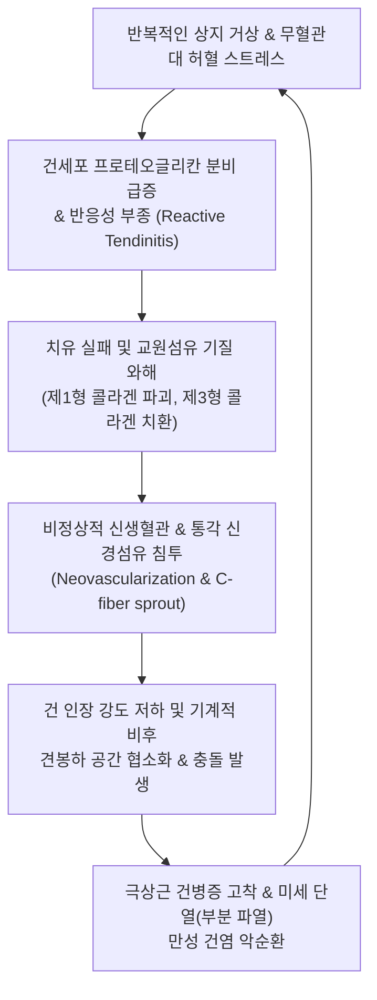

# 🩺 회전근개염 (Rotator Cuff Tendinitis / Tendinopathy)

> **핵심 3줄 요약 (Key Summary)**:
> - 📍 **병소 부위 & 해부·병태생리**: 회전근개 4대 힘줄(주로 [[극상근]] 건 부착부 1cm 내측 무혈관 위험구역)의 과사용 및 미세 손상으로 인해 발생하는 급·만성 무균성 힘줄 염증 및 콜라겐 섬유 변성(건병증, Tendinopathy) 질환이다.
> - 🚩 **전형적 임상 양상**: 팔을 옆으로 올리거나 뒤로 돌릴 때 상완골 [[대결절]] 부위의 국소 압통과 욱신거리는 통증이 특징적이며, 파열과 달리 근력 약화보다는 능동 거상 시 통증 저항이 주된 장애 원인이다.
> - 🛠️ **핵심 검사 & 치료 전략**: 니어 검사([[니어 검사]]), 풀 캔 검사([[풀 캔 검사]]) 및 근골격계 초음파(저에코성 건 비후)로 확진하며, 건 부착부 침·약침 자침(신바로·봉약침) 및 후하방 활주 추나, 건 회복을 위한 점진적 편심성(Eccentric) 저항 운동을 병행한다.
> - ⚠️ **응급 의뢰 레드플래그**: 단순 건염으로 진단되었으나 통증 양상이 급격히 악화되어 팔을 전혀 들어 올리지 못하는 가성 마비(급성 전층 파열로의 진행), 대결절 부위 극심한 발적과 야간 발열을 동반한 화농성 건막염 의심, 견관절의 비외상성 병적 골절 의심 소견.

---

## 📌 목차
1. [질환 개요 & 해부학적 병태생리](#1-질환-개요--해부학적-병태생리)
2. [병태생리 메커니즘 & 생체역학적 악순환 네트워크](#2-병태생리-메커니즘--생체역학적-악순환-네트워크)
3. [임상 증상 & 이학적 검사(Physical Exam) 알고리즘](#3-임상-증상--이학적-검사physical-exam-알고리즘)
4. [감별 진단 매트릭스 (Differential Diagnosis)](#4-감별-진단-매트릭스-differential-diagnosis)
5. [한의 통합 치료 프로토콜 (침·약침·추나·한약)](#5-한의-통합-치료-프로토콜-침약침추나한약)
6. [양방 치료 & 병용·의뢰 기준 (Conventional Treatment & Referral)](#6-양방-치료--병용의뢰-기준-conventional-treatment--referral)
7. [재활 운동 & 생활습관 티칭 가이드](#7-재활-운동--생활습관-티칭-가이드)
8. [💡 사용자 진료실 핵심 필기 & 임상 노하우 (Melt-In 잔여 심화 집약)](#8--사용자-진료실-핵심-필기--임상-노하우-melt-in-잔여-심화-집약)
9. [출처 및 학술 참고 문헌 (References)](#9-출처-및-학술-참고-문헌-references)

---

## 1. 질환 개요 & 해부학적 병태생리

**회전근개염(Rotator Cuff Tendinitis)**은 회전근개를 이루는 4대 근육 중 주로 **[[극상근]](Supraspinatus)** 건, 드물게 [[극하근]](Infraspinatus)이나 [[견갑하근]](Subscapularis) 건에 발생하는 염증성·퇴행성 질환이다. 과거에는 단순한 급성 염증(Tendinitis)으로 보았으나, 현대 의학에서는 반복적인 미세 손상과 치유 실패가 누적되어 교원섬유의 점액성 변성, 건세포의 기질 파괴, 비정상적 신생혈관(Neovascularization) 증식을 특징으로 하는 **'회전근개 건병증(Rotator Cuff Tendinopathy)'**의 연속선상으로 파악한다.

해부학적으로 극상근 건이 상완골 대결절(Greater tubercle)에 부착하기 직전 1cm 내측 부위는 미세혈관 문합이 취약한 **'무혈관성 위험 구역(Critical Zone)'**이다. 팔을 내전한 휴식 상태에서는 상완골두가 이 부위를 압박하여 생리적 허혈(Wringing-out effect)이 발생하며, 팔을 60°~120° 외전할 때는 오훼견봉인대 및 견봉 전연 하방에 기계적으로 마찰된다. 여기에 하이드록시아파타이트(Hydroxyapatite) 칼슘 결정이 침착되면 급성 산통을 유발하는 **[[석회성 건염]](Calcific Tendinitis)**으로 발전한다.

![[회전근개염_01_영상소견_석회성건염_Xray.jpg]]
> [그림 1: ① 영상 소견 — 회전근개(극상근건) 부착부에 칼슘 침착이 동반된 석회성 건염(Calcific Tendinitis) 단순 방사선 X-ray]

![[회전근개증후군_01_초음파소견_극상근건_부분파열.jpg]]
> [그림 2: ① 초음파 소견 — 극상근 힘줄 부착부의 저에코성 건 비후 및 관절면측 미세 균열 초음파 소견]

---

## 2. 병태생리 메커니즘 & 생체역학적 악순환 네트워크

회전근개염의 병태생리는 **'반응성 건병증(Reactive tendinopathy)'**에서 **'건 파탄 및 퇴행성 건병증(Degenerative tendinopathy)'**으로 이어지는 3단계 모델(Cook & Purdam Continuum Model)을 따른다.

1. **급성 과부하 및 반응성 건병증**:
   - 익숙하지 않은 반복적 상지 거상 작업(도배, 테니스 서브) 직후 건세포가 비후되고 친수성 프로테오글리칸(Proteoglycan) 분비가 급증하여 힘줄이 붓고 두꺼워진다(부종성 건염).
2. **건 치유 실패 및 기질 와해**:
   - 부하가 지속되면 정상적인 정렬을 가진 제1형 콜라겐이 파괴되고, 인장 강도가 약한 제3형 콜라겐 및 비정상적 탄성 섬유로 대체된다.
3. **무혈관 영역의 신경-혈관 증식과 통증 악순환**:
   - 허혈 조직을 치유하기 위해 비정상적인 미세 신생혈관(Neovessels)이 자라 들어가는데, 이때 자유신경종말(C-fiber)이 함께 침투하여 신경 펩타이드(Substance P, CGRP)를 분비, 비정상적인 만성 통증 과민성을 유발한다.

![[회전근개 건병증_2_3.jpg]]
> [그림 3: ① 병태생리 — 회전근개 건 섬유의 배열 와해, 점액성 변성 및 신생혈관 증식(Neovascularization) 병태 도해]

---

## 3. 임상 증상 & 이학적 검사(Physical Exam) 알고리즘

### 1) 임상 증상
- **상완골 대결절 국소 압통**: 견봉 전외측 하방 1~2cm 부위를 촉진할 때 뚜렷한 압통이 확인된다.
- **동통호(Painful Arc) 및 마찰감(Crepitus)**: 외전 60~120° 구간에서 찌릿한 통증이 발생하며, 견봉 하단에서 미세한 마찰음이 촉지된다.
- **파열과의 차이**: 물건을 들 때 통증으로 주저하지만, 지탱했을 때 팔이 뚝 떨어지지 않고 저항력을 유지한다.

### 2) 이학적 검사 알고리즘
1. **니어 검사([[니어 검사]])**: 팔을 내회전한 상태에서 견갑골을 고정하고 수동 전방 거상 시 견봉 하단 통증 유발 확인.
2. **풀 캔 검사([[풀 캔 검사]], Full Can Test)**: 엄지를 위로 향하게 외회전한 상태에서 90° 외전, 30° 수평 내전 위치에서 하방 저항을 가한다. 엠프티 캔 검사에 비해 견봉하 충돌 통증을 줄이면서 극상근 건 자체의 염증성 순수 근력을 평가하기에 최적화된 검사법이다.
3. **패트 검사(Patte test) & 뿔 징후(Hornblower's sign)**: 90도 외전 및 외회전 저항 검사로 극하근 및 소원근 건염 여부를 감별한다.

![[니어검사_2단계_견갑골보상억제_전방굴곡거상.jpg]]
> [그림 4: ② 이학적 검사 — 극상근건 및 견봉하 점액낭의 염증성 압통을 유발하는 니어(Neer) 충돌 검사 실사]

![[풀캔검사_보충_엄지상방외회전_극상근근력평가.jpg]]
> [그림 5: ② 이학적 검사 — 통증 유발을 최소화하면서 극상근건의 염증과 근력을 감별 평가하는 풀 캔 검사(Full can test) 실사]

---

## 4. 감별 진단 매트릭스 (Differential Diagnosis)

| 감별 질환 | 호발 연령/기전 | 주요 증상 및 통증 부위 | 이학적 검사 특징 | 단순 방사선 / 초음파 소견 |
| :--- | :--- | :--- | :--- | :--- |
| **회전근개염** | 30~50대 과사용 | 대결절 국소 통증, 동통호 | Full can (+), Neer (+), 근력 유지 | 초음파 상 건 비후, 저에코성 병변, 건 단열 없음 |
| **[[석회성 건염]]** | 30~50대 대사/허혈 | 야간 극심한 산통(응급실 내원 빈발) | 미세한 움직임에도 극심한 통증 | 단순 X-ray 상 대결절 상방 분필가루 모양 석회화 |
| **[[회전근개 파열]]** | 50대 이상 만성/외상 | 현저한 위약감, 야간통 | Drop arm sign (+), 근력 저하 현저 | 초음파/MRI 상 건의 전층 또는 부분 결손 확인 |
| **상완이두근 장두건염** | 20~40대 투구/반복 굴곡 | 결절간구(Bicipital groove) 전면 통증 | Speed test (+), Yergason test (+) | 초음파 상 결절간구 내 이두건 주위 삼출액 |
| **[[어깨충돌 증후군]]** | 40대 이상 골극/마찰 | 견봉 전외측 마찰 통증 | Hawkins-Kennedy (+), Neer (+) | X-ray 상 갈고리형 견봉, 견봉하 골극 |

![[회전근개파열_근골격계초음파_소견.jpg]]
> [그림 6: ① 영상 감별 — 회전근개 단순 건염과 감별해야 할 극상근건 전층 파열 근골격계 초음파 소견]

### ⚠️ 응급 의뢰 레드플래그
- **석회성 건염 급성 흡수기(Resorptive phase)로 인한 조절되지 않는 극심한 통증**: 경구 진통제로 제어되지 않을 시 양방 정형외과 초음파 유도하 세척술(Barbotage) 의뢰.
- **건염 치료 중 갑작스러운 '뚝' 소리와 함께 발생한 가성 마비**: 건병증 기저 상태에서 발생한 급성 파열.
- **국소 발열감과 발적을 동반한 관절강 내 감염 의심 징후**.

---

## 5. 한의 통합 치료 프로토콜 (침·약침·추나·한약)

### 1) 침구 치료 (Acupuncture)
- **주요 혈위**: [[견우]](LI15), [[견료]](TE14), [[노유]](SI10), [[비노]](LI14), [[곡원]](SI13), [[천종]](SI11), [[곡지]](LI11), [[양릉천]](GB34).
- **시술 기법**:
  - **대결절 극상근 부착부 자침**: 팔을 열중쉬어 자세(Crass 자세)로 하여 대결절을 전방으로 노출시킨 후, 0.30×40mm 호침으로 극상근 건 부착부에 골막 자극(Periosteal stimulation) 자침을 시행한다.
  - 근건이행부 TrP에 저주파 전침(2Hz, Mixed)을 15분간 적용하여 콜라겐 섬유의 리모델링을 촉진한다.

### 2) 약침 치료 (Pharmacopuncture)
- **신바로약침**: 극상근 건 주위 조직 및 견봉하 공간에 1.0~1.5cc 주입하여 건염 매개 염증 물질(COX-2, PGE2)을 억제한다.
- **봉약침(Sweet BV 1:20,000)**: 만성 퇴행성 건병증 부위에 주입하여 혈류 공급을 유도하고 섬유아세포(Fibroblast)의 콜라겐 생성을 자극한다.

### 3) 추나 요법 (Chuna Manual Therapy)
- **견관절 후하방 활주 관절가동 추나(Posterior-Inferior Glide)**: 견봉하 공간을 넓혀 힘줄의 압박을 해소하기 위해 상완골두를 후하방으로 부드럽게 밀어주는 가동술을 적용한다.
- **견갑흉곽관절 가동화**: 흉곽 위에서 견갑골의 활주성을 개선하여 거상 시 힘줄에 가해지는 장력을 분산시킨다.

![[어깨 추나-20240926181054832.png]]
> [그림 7: ③ 한의 추나 — 회전근개 힘줄의 과긴장 완화 및 견관절 후하방 활주 회복을 위한 관절가동 추나 기법]

### 4) 한약 치료 (Herbal Medicine)
- **급성 건염기**: **[[갈근탕]](葛根湯)** 또는 **[[소경활혈탕]](疎經活血湯)**을 투여하여 국소 풍한습(風寒濕)을 소산시키고 혈행 장애를 해소한다.
- **만성 건병증기**: **[[서경탕]](舒經湯)**에 오약, 지각, 강황을 가미하여 기혈 순환을 도모한다.

---

## 6. 양방 치료 & 병용·의뢰 기준 (Conventional Treatment & Referral)

### 1) 약물 치료 및 물리치료
- **소염진통제(NSAIDs)**: Meloxicam 7.5~15mg qd, Aceclofenac 100mg bid를 1~2주간 단기 사용하여 급성 염증을 조절한다.
- **체외충격파 치료(ESWT)**: 만성 건병증 및 석회성 건염에 방사형(Radial) 또는 초점형(Focused) 충격파를 주 1회, 3~5회 적용하여 신생혈관 형성을 자극한다.

### 2) 주사 요법
- **견봉하 스테로이드 주사**: 통증이 극심할 때 1회성으로 사용될 수 있으나, 건 자체의 교원질을 약화시키므로 건 내 직접 주사는 금기이다.
- **PDRN / 증식치료(Prolotherapy)**: 건 섬유 증식 유도.

### 3) 수술 적응증
- 6개월 이상의 비수술적 치료(한의 치료, 약물, ESWT)에도 건병증이 악화되거나 골극 마찰이 심한 경우 관절경하 감압술을 고려한다.

---

## 7. 재활 운동 & 생활습관 티칭 가이드

### 1) 무통 범위 내 등척성 수축 (Isometric Exercise)
- 통증이 심한 급성기에는 팔을 움직이지 않고 벽을 밀거나 수건을 옆구리에 낀 채 버티는 등척성 외회전 운동(45초 유지, 5회 반복)을 통해 중추성 진통 효과(Isometric-induced hypoalgesia)를 유도한다.

### 2) 점진적 편심성 저항 운동 (Eccentric Loading)
- 증상이 완화된 아급성기부터는 탄력 밴드를 이용해 팔을 천천히 내리면서 버티는 편심성 수축 운동을 시행하여 건의 인장 강도를 회복시킨다.

### 3) 생활습관 지도
- 통증이 완전히 소퇴할 때까지 팔을 어깨높이 위로 들어 올리는 과사용을 일시적으로 중단한다.

![[어깨탈구_05_술기실사_견관절_도수가동치료.gif]]
> [그림 8: ④ 재활 운동 — 회전근개 건염 회복기 건의 편심성 부하 적응 및 가동성 회복을 위한 도수 수동 가동화 운동]

---

## 8. 💡 사용자 진료실 핵심 필기 & 임상 노하우 (Melt-In 잔여 심화 집약)

- **크라스 자세(Modified Crass Position)를 활용한 대결절 직침법**:
  - 환자의 손을 등 뒤 허리에 대게(열중쉬어 자세) 하면 견봉 하방에 숨어있던 극상근 건 부착부가 전외측으로 약 1.5cm 돌출되어 노출된다.
  - 이 상태에서 대결절 결절간구 바로 외측의 극상근 부착부를 손가락으로 촉진하고, 수직으로 2.5~3cm 직자하여 골막을 가볍게 톡 치는 유침을 시행하면 건병증 병소에 직접적인 기계적 자극을 주어 섬유아세포 활성을 즉각적으로 유도할 수 있다.
- **등척성 운동의 즉각적 진통 기전(Hypoalgesia) 활용**:
  - 건염 환자에게 아프다고 팔을 전혀 안 쓰게 하면 건이 더 약해진다.
  - 진료실에서 진료 후 즉시 환자의 팔꿈치를 90도 굽히고 의사의 손을 외회전 방향으로 70% 힘으로 45초간 밀게 하는 등척성 수축을 3회 지도하면, 척수 수준에서 통증 억제 기전이 작동하여 치료실 문을 나설 때 어깨 통증이 30% 이상 즉시 감소함을 환자가 스스로 느낀다.
- **석회성 건염의 병기별 치료 원칙**:
  - 단순 방사선 상 석회의 경계가 명확하고 분필가루처럼 단단해 보이면(형성기) 보존적 한의 치료와 체외충격파가 주효하다.
  - 반면 석회의 경계가 흐려지고 구름처럼 퍼지면서 쥐어짜는 듯한 통증이 발생하면(흡수기), 이는 자가 흡수 과정이므로 무리한 자침을 피하고 아이싱과 소염 약침으로 통증을 안정시키는 것이 핵심이다.

---

## 9. 출처 및 학술 참고 문헌 (References)

1. Clausen MB, et al. (2026). Changes in Pain-Related Fear Predict Shoulder Disability in Rotator Cuff Tendinopathy With Resistance Exercise. *Phys Ther*, 106(2):pzaf012. [PMID 42538792](https://pubmed.ncbi.nlm.nih.gov/42538792/)

2. Littlewood C, et al. (2026). Adherence to Exercise Intervention Including Pain Threshold, Exercise and Physiotherapy Sessions for Patients With Chronic Rotator Cuff Tendinopathy. *Clin Rehabil*, 40(1):55-67. [PMID 42457108](https://pubmed.ncbi.nlm.nih.gov/42457108/)

3. Gupta TP, et al. (2026). Asymptomatic Rotator Cuff Tendinopathy in Elderly Diabetics: Is Routine Magnetic Resonance Imaging Evaluation of the Shoulder Warranted?. *Malays Orthop J*, 20(1):30-40. [PMID 42078981](https://pubmed.ncbi.nlm.nih.gov/42078981/)

---

## 관련 노트

- [[회전근개 증후군]]
- [[회전근개 파열]]
- [[회전근개 병변]]
- [[어깨 손상]]
- [[석회성 건염]]
- [[어깨충돌 증후군]]
- [[니어 검사]]
- [[풀 캔 검사]]
