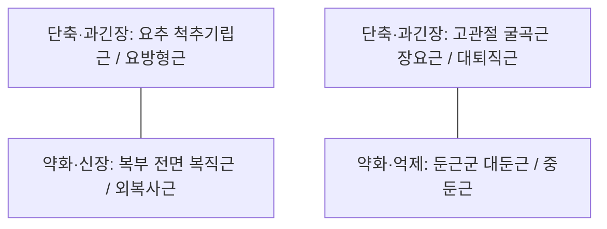

---
aliases:
  - Anterior pelvic tilt
  - APT
  - 골반전방경사
tags:
  - 생체역학
  - 자세이상
  - 하지교차증후군
  - 요통
  - 골반교정
---

# 골반 전방경사 (Anterior Pelvic Tilt, APT)

> 핵심 요약 (Key Summary):
> 전상장골극(ASIS)이 후상장골극(PSIS)에 비해 수평면 기준 전하방으로 10도 이상 과도하게 기울어진 시상면 정렬 이상.
> 얀다(Janda)의 하지교차증후군(Lower Crossed Syndrome)의 핵심 축으로, 고관절 굴곡근군([[장요근]], [[대퇴직근]]) 및 요부 신전근군([[척추기립근]])의 단축과 둔근군([[대둔근]]) 및 복근군([[복직근]], [[외복사근]])의 상호억제성 약화가 결합.
> 요추 전만(Lordosis) 증가, 요추 후관절 증후군, 척추 전방전위증, 천장관절 증후군, 대퇴골 내회전 및 슬관절 과신전(Genu recurvatum)을 유발하는 구조적 원인.

---

## 1. 정의 및 생체역학적 기준 (Biomechanics)

* **정상 시상면 정렬 기준**:
  * 시상면(Sagittal plane) 상에서 전상장골극(ASIS)과 치골결합(Pubic symphysis)은 수직선 상에 일치해야 합니다.
  * ASIS와 후상장골극(PSIS)을 잇는 기준선은 수평면 대비 약 7~10도의 전방 기울기를 이루는 것이 정상 생리적 범위입니다.
* **골반 전방경사 병태**:
  * 골반의 전방 기울기 각도가 10~15도 이상으로 과도하게 증가하여 골반 입구(Pelvic inlet)가 앞쪽 아래를 향하는 상태.
  * 이에 대한 보상 작용으로 요추 추체는 전방으로 활주하며 요추 전만각(Lordotic angle)이 급격히 증가합니다.

---

## 2. 근육 불균형 패턴 (하지교차증후군, Lower Crossed Syndrome)

블라디미르 얀다(Vladimir Janda) 교수의 상호억제(Reciprocal inhibition) 모델에 기반한 대각선 교차 패턴:

1. **단축 및 과긴장 근육군 (Hypertonic / Shortened)**:
   * 고관절 굴곡근: [[장요근]](Iliopsoas), [[대퇴직근]](Rectus femoris), [[대퇴근막장근]](TFL).
   * 척추 신전근: [[척추기립근]](Erector spinae), [[요방형근]](Quadratus lumborum).
2. **약화 및 신장 억제 근육군 (Inhibited / Weakened)**:
   * 골반 후방경사 근육: [[대둔근]](Gluteus maximus), [[햄스트링]](Hamstrings).
   * 체간 안정화 복근: [[복직근]](Rectus abdominis), [[내복사근]](Internal oblique), [[외복사근]](External oblique), [[복횡근]](Transversus abdominis).

---

## 3. 임상 증상 및 이차적 연쇄 병리 (Kinetic Chain Pathology)

* **요추 후관절 증후군 (Facet Joint Syndrome)**:
  * 요추 전만이 가중되면서 하부 요추(L4-L5, L5-S1)의 후관절 관절돌기 사이 압박력이 급증하여 신전 시 요통 악화.
* **척추 전방전위증 (Spondylolisthesis)**:
  * 요추 전방 활주력이 증가하여 협부(Pars interarticularis) 피로 골절 및 척추체 전방 전위 위험 상승.
* **고관절 전방 충돌 (FAI)**:
  * 골반 전방경사로 비구(Acetabulum)가 전하방을 덮으면서 고관절 굴곡 시 비구순과 대퇴골두 경부의 조기 충돌([[고관절 충돌증후군]]) 유발.
* **슬관절 과신전 (Back Knee / Genu Recurvatum)**:
  * 대퇴골이 전하방으로 기울어지면서 체중심선이 무릎 관절 전방으로 이동, 무릎이 뒤로 꺾이며 후방 관절낭 및 십자인대 스트레스 가중.

---

## 4. 진단 및 평가 (Assessment)

* **토마스 검사 (Thomas Test)**:
  * 환자를 침대 끝에 걸터앉히고 한쪽 무릎을 가슴으로 당겼을 때, 반대측 허벅지가 침대에서 뜨거나(장요근 단축) 무릎이 90도 이상 펴지는지(대퇴직근 단축) 평가.
* **벽 밀착 검사 (Wall Test)**:
  * 벽에 머리, 등, 엉덩이, 발뒤꿈치를 대고 섰을 때 요추부 뒤쪽 공간에 손바닥 하나가 아닌 주먹이 들어갈 정도로 전만이 심한지 확인.
* **골반 방사선 검사 (Standing Lateral Pelvis & L-spine X-ray)**:
  * 골반 입사각(Pelvic Incidence, PI), 골반경사각(Pelvic Tilt, PT), 천골경사각(Sacral Slope, SS) 계측.

---

## 5. 한의 치료 및 추나 재활 프로토콜

* **추나치료 (Chuna Manual Therapy)**:
  * 골반 후방회전 가동기법(Pelvic posterior rotation technique)을 적용하여 장골의 전방 변위를 교정.
  * 복와의 고관절 신전 및 장요근 이완 추나, 앙와위 복부 근막 이완술.
* **침구 및 약침 치료**:
  * 과긴장 근육 침자: [[장요근]](오복혈 취혈), [[대퇴직근]], [[요방형근]], 척추 L4~S1 협척혈(EX-B2) 및 신수(BL23).
  * 둔근 활성화 침자: 환도(GB30), 질변(BL54) 자침으로 대둔근과 중둔근의 신경-근 활성 복구.
* **환자 운동 티칭 (Rehabilitation Exercise)**:
  * 장요근 런지 스트레칭(Kneeling hip flexor stretch).
  * 둔근 활성화 운동: 글루트 브릿지(Glute bridge), 클램쉘(Clamshell).
  * 코어 복근 강화: 데드버그(Deadbug), 플랭크 시 골반 후방경사 큐잉.

---

## 6. 📚 출처 및 학술 연구 요약 (References)

1. Janda, V. (1996). "Evaluation of muscle imbalances in clinical practice." *Functional Rehabilitation of Sports and Musculoskeletal Disorders*, 97-112.
   - [연구 요약] 만성 요통 환자에서 고관절 굴곡근 단축과 둔근 약화가 만드는 하지교차증후군 메커니즘을 규명하고 상호억제 기전의 교정 필요성을 정립.
2. Herrington, L. (2011). "Assessment of the degree of pelvic tilt within a normal asymptomatic population." *Manual Therapy*, 16(6), 646-648.
   - [연구 요약] 무증상 건강 성인 남성의 85%, 여성의 75%에서 일정 수준의 골반 전방경사가 관찰되며, 12도 이상의 과도한 경사각이 병리적 역학 변화를 초래함을 통계적으로 증명.
