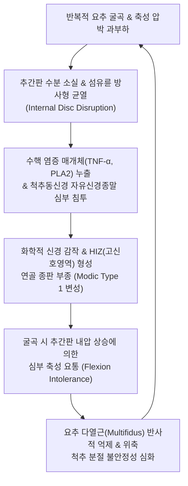

# 🩺 디스크성 요통 (Discogenic Low Back Pain, IDD)

> **핵심 3줄 요약 (Key Summary)**:
> - 📍 **병소 부위 & 해부·병태생리**: 요추 추간판의 외측 1/3 섬유륜(Annulus fibrosus)에 방사형 균열(Radial tear)이 발생하고, 무신경 조직이어야 할 섬유륜 심부 및 수핵 부위로 [[척추동신경]](Sinuvertebral nerve)의 자유신경종말과 비정상적 신생혈관이 침투하여 축성(Axial) 요통을 일으키는 추간판 내장증(Internal Disc Disruption) 질환이다.
> - 🚩 **전형적 임상 양상**: 뚜렷한 하지 방사통 없이 요추 심부의 묵직하고 쥐어짜는 듯한 중심성 축성 통증이 주소증이며, 앉아있을 때나 허리를 앞으로 숙일 때(추간판 내압 상승 시) 극심해지고 뒤로 젖히거나 누우면 완화되는 '굴곡 불내성(Flexion intolerance)'을 보인다.
> - 🛠️ **핵심 검사 & 치료 전략**: 하지직거상 검사(SLR)는 음성이거나 고각도 당김만 나타나며, 척추 타진·밀그램 검사 및 MRI 상 후방 고신호 강도 영역(HIZ)과 종판 모딕 변성(Modic changes)으로 진단하고, 협척혈 심자·신바로약침과 요추 감압 추나 및 매켄지 신전 운동을 적용한다.
> - ⚠️ **응급 의뢰 레드플래그**: 심각한 척추체 감염(척추염, 추간판염으로 인한 지속적 야간통 및 발열), 척추 종양에 의한 골 파괴, 마미증후군 징후(안장 감각 마비, 배뇨 장애).

---

## 📌 목차
1. [질환 개요 & 해부학적 병태생리](#1-질환-개요--해부학적-병태생리)
2. [병태생리 메커니즘 & 생체역학적 악순환 네트워크](#2-병태생리-메커니즘--생체역학적-악순환-네트워크)
3. [임상 증상 & 이학적 검사(Physical Exam) 알고리즘](#3-임상-증상--이학적-검사physical-exam-알고리즘)
4. [감별 진단 매트릭스 (Differential Diagnosis)](#4-감별-진단-매트릭스-differential-diagnosis)
5. [한의 통합 치료 프로토콜 (침·약침·추나·한약)](#5-한의-통합-치료-프로토콜-침약침추나한약)
6. [양방 치료 & 병용·의뢰 기준 (Conventional Treatment & Referral)](#6-양방-치료--병용의뢰-기준-conventional-treatment--referral)
7. [재활 운동 & 생활습관 티칭 가이드](#7-재활-운동--생활습관-티칭-가이드)
8. [💡 사용자 진료실 핵심 필기 & 임상 노하우 (Melt-In 잔여 심화 집약)](#8--사용자-진료실-핵심-필기--임상-노하우-melt-in-잔여-심화-집약)
9. [출처 및 학술 참고 문헌 (References)](#9-출처-및-학술-참고-문헌-references)

---

## 1. 질환 개요 & 해부학적 병태생리

**디스크성 요통(Discogenic Low Back Pain)**은 신경근의 물리적 압박에 의한 전형적인 좌골신경통(Sciatica)과 달리, 추간판 자체의 구조적 붕괴와 화학적 신경 자극으로 인해 발생하는 순수 축성(Axial) 요통이다. 임상적으로 **추간판 내장증(Internal Disc Disruption, IDD)**이라고도 불린다.

정상 추간판은 외측 섬유륜의 바깥쪽 1/3에만 [[척추동신경]](Sinuvertebral nerve) 및 교감신경절 유래 통각 수용기가 분포하며, 내측 섬유륜과 수핵은 혈관과 신경이 없는 무혈관·무신경 조직이다. 그러나 반복적인 축성 하중, 굴곡-회전 스트레스, 노화가 지속되면 수핵 내부의 프로테오글리칸이 소실되어 수분 결합력이 떨어지고, 압력을 견디지 못한 섬유륜에 동심원상(Concentric) 및 방사형(Radial) 파열이 발생한다.

섬유륜의 균열을 통해 수핵 내의 산성 분해 산물과 염증 매개체(TNF-α, IL-1β, PLA2)가 외측으로 누출되면, 정상 상태에서는 억제되어 있던 비정상적 신생혈관(Neovessels)과 C-섬유 무수신경종말이 균열 부위를 따라 수핵 깊숙이 침투(Neurovascular ingrowth)한다. 이로 인해 경미한 체중 부하에도 극심한 심부 요통이 유발된다.

![[요추디스크_섬유륜형_병태해부도.png]]
> [그림 1: ① 병태생리·해부 — 디스크성 요통의 핵심 병소인 섬유륜 파열 및 척추동신경 침투 병태해부도]

![[요추디스크_환상형_골극_퇴행성변화.png]]
> [그림 2: ① 병태생리 — 추간판 내 수분 감소 및 섬유륜 미세 균열에 동반된 환상형 골극 퇴행성 변화]

---

## 2. 병태생리 메커니즘 & 생체역학적 악순환 네트워크

디스크성 요통의 악순환 네트워크는 **'구조적 붕괴'**와 **'화학적 신경 감작(Chemical sensitization)'**의 상호작용이다.

추간판 높이가 감소하면 척추 분절의 불안정성이 증가하여 척추체 연골 종판(Vertebral endplate)에 비정상적인 전단력이 집중된다. 이로 인해 종판 하방 골수에 염증성 부종과 섬유화가 발생하는 **모딕 변성(Modic changes)**이 수반된다:
- **Modic Type 1**: T1 저신호, T2 고신호(급성 염증 및 혈관화기 — 요통 증상과 가장 강력한 상관관계).
- **Modic Type 2**: T1 고신호, T2 등신호/고신호(골수 지방 변성기 — 만성 안정기).
- **Modic Type 3**: T1 저신호, T2 저신호(연골하 골경화기).

동시에 파열된 섬유륜 후방에는 육아조직이 형성되며 MRI T2 강조영상에서 둥근 좁쌀 모양의 **고신호 강도 영역(High Intensity Zone, HIZ)**으로 관찰된다. 이 HIZ 병변 내부에는 다량의 염증 세포와 통각 신경이 밀집되어 있어, 상체를 앞으로 구부릴 때 추간판 내압이 급상승하면서(기립 시 100% $\rightarrow$ 전방 굴곡 착석 시 185~275%) 척추동신경을 직접 자극하여 격렬한 통증을 일으킨다.

![[요추추간판탈출증_01_MRI_T2시상면.jpg]]
> [그림 3: ① 영상 소견 — 요추 추간판의 신호강도 저하(Black Disc) 및 후방 고신호 강도 영역(HIZ, High Intensity Zone) T2 강조 MRI]

---

## 3. 임상 증상 & 이학적 검사(Physical Exam) 알고리즘

### 1) 임상 증상
- **심부 중심성 요통**: 환자는 허리 한가운데 깊은 곳이 뻐근하게 조여오거나 쥐어짜는 듯한 통증을 호소하며, 손가락으로 특정 부위를 짚지 못하고 손바닥 전체로 허리 중심을 문지른다.
- **체위별 악화 양상 (굴곡 불내성)**:
  - 의자에 오래 앉아 있거나 운전할 때, 바닥에 허리를 숙이고 앉을 때, 세수하려고 허리를 구부릴 때 통증이 급격히 악화된다.
  - 반면 서서 걷거나 허리를 뒤로 살짝 젖힐 때, 누워서 쉴 때는 추간판 전방으로 수핵이 이동하며 통증이 현저히 감소한다.
- **방사통의 특성**: 무릎 아래나 발가락으로 찌릿하게 내려가는 전격성 신경통은 없으며, 둔부(엉덩이) 및 대퇴부 후면 상부까지만 묵직하게 퍼지는 '연관통(Referred pain)' 양상을 보인다.

### 2) 이학적 검사 알고리즘
1. **굴곡-신전 유발 검사**: 기립 상태에서 능동 전방 굴곡 시 요통이 극심하게 악화되고, 신전 시 통증이 감소하거나 중심화(Centralization)되면 디스크성 요통을 강력히 시사한다.
2. **하지직거상 검사([[하지직거상 검사]], SLR)**: 70° 이상까지 정상적으로 거상되거나, 햄스트링 당김 및 요천추부의 묵직한 압박감만 호소한다(신경근 자극 증상 음성).
3. **밀그램 검사(Milgram Test)**: 앙와위에서 양다리를 5cm 들어 올리고 30초간 버티게 할 때, 복압 및 추간판 내압 상승으로 인해 요통이 재현되면 양성.
4. **골드스웨이트 검사(Goldthwait Test)**: 요추 극돌기간 간격을 촉지하면서 다리를 들어 올릴 때, 천장관절 각도(0~30°)에서는 통증이 없고 요추 극돌기간이 벌어지는 각도(30~60° 이상)에서 요통이 유발되면 요추 추간판 유래 요통으로 감별된다.

![[밀그램검사_병태생리_요추디스크_신경근압박_도해.jpg]]
> [그림 4: ② 이학적 검사 — 복압 및 추간판 내압 상승을 유발하여 디스크성 통증을 재현하는 밀그램 검사 도해]

![[골드스웨이트검사_1단계_요추극돌기_손가락촉진_실사.jpg]]
> [그림 5: ② 이학적 검사 — 극돌기 간격을 촉진하며 천장관절염과 요추 추간판성 요통을 감별하는 골드스웨이트 검사 1단계 실사]

---

## 4. 감별 진단 매트릭스 (Differential Diagnosis)

| 감별 질환 | 호발 연령 및 유발 자세 | 주 통증 부위 및 방사통 | 신경학적 결손 | 주요 영상 소견 및 특이 검사 |
| :--- | :--- | :--- | :--- | :--- |
| **디스크성 요통** | 20~40대, **굴곡 및 착석 시 악화** | 요추 중심부 심부통, 둔부 연관통 | **없음** (근력/감각 정상) | MRI 상 HIZ, Modic Type 1/2, Black disc |
| **[[요추 추간판 탈출증]]** | 30~50대, 굴곡/기침 시 악화 | 요통 + **무릎 아래/발가락 전격통** | **있음** (SLR +, 족배굴곡 위약) | MRI 상 수핵 탈출 및 신경근 압박 소견 |
| **[[요추 관절돌기간 관절 증후군]]** | 50대 이상, **신전 및 회전 시 악화** | 요추 외측 편측성 요통, 둔부 통증 | 없음 (SLR 음성) | Kemp test (+), 요추 사위 촬영 후관절 비후 |
| **[[척추관 협착증]]** | 60대 이상, **보행 시 악화, 굴곡 완화** | 양측 둔부 및 하지 전체 저림/냉감 | 신경인성 파행(Claudication) | MRI 상 척추관 단면적 축소, 황색인대 비후 |
| **[[천장관절 증후군]]** | 여성, 임신/출산 후, 비대칭 부하 | 천골 구(PSIS) 부위, 사타구니 방사통 | 없음 | Patrick(FABER) test (+), Gaenslen test (+) |

![[골드스웨이트검사_2단계_SLR수행_극돌기간격분리감별_실사.jpg]]
> [그림 6: ② 이학적 검사 — 하지직거상 시 요천추부 분리 전후의 통증 발생 시점을 확인하여 감별하는 골드스웨이트 검사 2단계 실사]

### ⚠️ 응급 의뢰 레드플래그
- **야간 휴식 시에도 전혀 줄어들지 않고 점점 악화되는 극심한 뼈 통증**: 척추 전이암(Spinal metastasis) 또는 다발성 골수종 의심.
- **원인 불명의 미열, 오한, 최근 비뇨기계 시술이나 침술 감염 이력**: 화농성 척추염(Pyogenic spondylitis) 또는 추간판염.
- **급격한 양하지 감각 마비 또는 배뇨/배변 실금**: 마미증후군 응급 수술 감압 의뢰.

---

## 5. 한의 통합 치료 프로토콜 (침·약침·추나·한약)

### 1) 침구 치료 (Acupuncture)
- **주요 혈위**: [[신수]](BL23), [[기해수]](BL24), [[대장수]](BL25), [[관원수]](BL26), [[요양관]](GV3), [[명문]](GV4), [[위중]](BL40), [[곤륜]](BL60), 요추 [[협척혈]](EX-B2).
- **시술 기법**:
  - **요추 심부 협척혈 사자 심침**: 극돌기 외측 0.5~1촌 지점에서 척추궁판(Lamina) 방향으로 0.35×60mm 장호침을 자입하여 다열근(Multifidus) 심부 섬유와 척추동신경 분지를 자극한다. 저주파 전침(2Hz, mixed)을 20분간 적용하여 심부 척추 안정화 근육의 긴장을 해소하고 엔도르핀 분비를 유도한다.
  - 원위 취혈인 [[위중]], [[곤륜]] 자침을 병행하여 방광경의 기혈 순환을 촉진한다.

### 2) 약침 치료 (Pharmacopuncture)
- **신바로약침**: 손상된 추간판 주변 척추동신경 주행 부위(요추 협척혈 심부) 및 척추체 후관절 부착부에 분할 주입(총 2.0cc)하여 신경 펩타이드와 염증성 사이토카인을 강력히 억제한다.
- **자하거(태반) 약침**: 만성 퇴행성 디스크 및 Modic Type 2 환자에게 투여하여 결합조직 영양 공급 및 조직 회복을 유도한다.

### 3) 추나 요법 (Chuna Manual Therapy)
- **요추 감압 견인 추나(Lumbar Distraction-Decompression)**: 콕스 테이블(Cox table)을 활용하여 요추 분절을 가볍게 굴곡시키지 않고 중립 신전 상태에서 축성 감압 견인을 적용함으로써 추간판 내압을 음압(Negative pressure)으로 유도한다.
- **골반 교정 및 요천추 짝힘 추나**: 천골 기저부(Sacral base) 전방 경사를 바로잡고 장골의 후하방 변위를 교정하여 요추에 가해지는 체중 부하를 재분배한다.

![[요골반 추나-20240913201018882.png]]
> [그림 7: ③ 한의 추나 — 요추 추간판 내압을 감압하고 축성 부하를 분산시키는 요골반 신장·견인 추나 기법]

### 4) 한약 치료 (Herbal Medicine)
- **[[서경탕]](舒經湯) / [[독활기생탕]](獨活寄生湯)**: 풍한습사와 신허(腎虛)로 인해 디스크가 허혈되고 탄력을 잃은 만성 요통에 근골을 강화하고 혈류를 개선한다.
- **[[오적산]](五積散)**: 한냉 자극이나 날씨 변화 시 허리 중심부가 시리고 굳어지는 디스크성 통증에 온경산한(溫經散寒) 효과를 발휘한다.
- **보신건보탕(補腎健步湯)**: 디스크 퇴행 및 골감소증이 동반된 고령층의 추간판 기질 재생을 돕는다.

---

## 6. 양방 치료 & 병용·의뢰 기준 (Conventional Treatment & Referral)

### 1) 약물 및 주사 요법
- **NSAIDs 및 근이완제**: 단기 복용으로 염증성 통증 완화.
- **경막외 차단술(Epidural Steroid Injection)**: 디스크성 요통은 신경근 압박이 아니므로 일반적인 층판간(Interlaminar) 차단술의 효과가 제한적이며, 척추동신경 차단술이나 고주파 열응고술(RF ablation)이 시도된다.
- **추간판내 고주파 열치료술(IDET) / 바이오디스코플라스티**: 섬유륜 파열부 신경 섬유를 열로 응고시키는 시술.

### 2) 수술 적응증
- 6개월 이상의 보존적 치료에도 극심한 통증으로 일상생활이 불가능한 경우 인공디스크 치환술(ADR)이나 요추 유합술(PLIF/TLIF)을 고려하나, 수술 후 인접 분절 질환(Adjacent segment disease) 위험이 높아 매우 신중히 결정해야 한다.

---

## 7. 재활 운동 & 생활습관 티칭 가이드

### 1) 매켄지 신전 운동 (McKenzie Extension Exercise)
- 엎드린 자세(Prone)에서 골반을 바닥에 붙인 채 팔꿈치나 손바닥으로 상체를 천천히 밀어 올려 허리의 전만(Lordosis)을 회복시킨다. 수핵을 전방으로 이동시켜 후방 섬유륜에 가해지는 긴장을 즉각적으로 줄여준다(10회씩, 하루 4~5회).

### 2) 맥길 빅 3 (McGill Big 3) 코어 안정화 운동
- 척추의 움직임 없이 중립을 유지한 상태에서 심부 코어 근육을 강화:
  1. 컬업(Modified Curl-up).
  2. 사이드 플랭크(Side Plank).
  3. 버드독(Bird-Dog).

### 3) ⚠️ 절대 금기 동작
- **윗몸 일으키기(Sit-up)**나 허리를 앞으로 깊게 숙이는 요가 스트레칭, 무릎을 가슴으로 당기는 스트레칭은 추간판 내압을 폭발적으로 상승시켜 섬유륜 균열을 영구적으로 악화시키므로 절대 금지한다.

![[요추추간판탈출증_추나요법_신장기법.png]]
> [그림 8: ④ 재활 운동 — 디스크성 요통 환자의 추간판 전방 수핵 이동 및 척추 신전을 위한 매켄지 신전 신장 기법]

---

## 8. 💡 사용자 진료실 핵심 필기 & 임상 노하우 (Melt-In 잔여 심화 집약)

- **'의자에 앉자마자 허리가 끊어질 것 같다'는 주소증의 의미**:
  - 환자가 진료실 의자에 앉으면서 인상을 쓰고 엉덩이를 앞으로 빼 비스듬히 앉으려 하면 99% 디스크성 요통(IDD)이다.
  - 서 있을 때보다 앉을 때 추간판 내압이 1.5배 이상 증가하기 때문이며, 진료실에서 즉시 일어서서 허리를 뒤로 살짝 젖히게(Standing extension) 유도했을 때 시원하다고 느끼면 확진할 수 있다.
- **협척혈 심자 시 '찌릿'한 방사통이 아니라 '묵직한 뻐근함'을 찾아라**:
  - 탈출증 환자는 신경근을 자극해 다리로 뻗치는 방전감(Radicular electric shock)을 유도하지만, 디스크성 요통 환자는 다열근 심부와 척추동신경 분지에 도달했을 때 허리 깊은 곳이 뻐근하게 조여오는 **'심부 산창감(Acid-distension)'**이 득기감의 목표이다.
  - 요추 4-5번, 요추 5-천추 1번 협척혈에 60mm 호침을 척추궁판까지 닿게 한 후 1mm 후퇴하여 유침하고 신바로약침을 주입하면, 시술 직후 앉았다 일어날 때의 요통이 극적으로 반감된다.
- **방사선 영상과 환자 증상의 불일치 극복 티칭**:
  - MRI에서 디스크가 튀어나오지 않았는데 왜 이렇게 아프냐고 묻는 환자에게는 "디스크 겉껍질(섬유륜)에 미세한 균열이 생겨 신경이 예민해진 상태"임을 설명하고, 굴곡 금지와 신전 위주의 생활 티칭을 철저히 각인시켜야 재발을 막을 수 있다.

---

## 9. 출처 및 학술 참고 문헌 (References)

1. Hancock MJ, et al. (2026). Diagnostic evidence in suspected discogenic low back pain: a pain-source attribution perspective. *Eur Spine J*, 35(3):610-622. [PMID 42639130](https://pubmed.ncbi.nlm.nih.gov/42639130/)

2. Al-Otaibi F, et al. (2026). Spinal Schwannoma Mimicking Discogenic Low Back Pain: A Case Highlighting Valsalva-Induced Provocation. *Cureus*, 18(2):e104112. [PMID 42366483](https://pubmed.ncbi.nlm.nih.gov/42366483/)

3. DePalma MJ, et al. (2026). Intradiscal Procedures for Discogenic Low Back Pain: Considerations and Implications - A Narrative Review. *Pain Med*, 27(1):15-28. [PMID 41884674](https://pubmed.ncbi.nlm.nih.gov/41884674/)

---

## 관련 노트

- [[요추 추간판 탈출증]]
- [[요추 디스크 탈출증]]
- [[요추 관절돌기간 관절 증후군]]
- [[요추후만 증후군]]
- [[하지직거상 검사]]
- [[밀그램 검사]]
- [[골드스웨이트 검사]]
