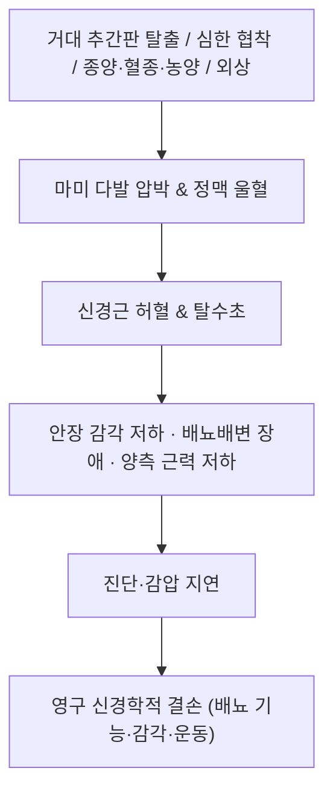

---
aliases:
  - 마미증후군
  - 마미 증후군
  - Cauda Equina Syndrome
  - CES
  - 마미총 증후군
  - Cauda equina
tags:
  - 이론
  - 질환
  - 근골격계
  - 요추부
  - 응급
  - 레드플래그
  - 신경
categories:
  - 근골격계 질환
  - 요추부
title: 마미증후군
date: 2026-09-24
출처: "PMID: 34862914"
---
# 🩺 [[마미증후군]] (Cauda Equina Syndrome, 馬尾症候群)

> **핵심 3줄 요약 (Key Summary)**:
> - 📍 병소 부위 & 해부·병태생리: 척수원추 아래 요추·천추 신경근 다발(마미)이 [[요추 추간판 탈출증]]·[[척추관 협착증]]·종양·혈종·외상 등으로 **광범위하게 압박**되어 다발성 신경근 기능이 상실되는 응급 병태다.
> - 🚩 전형적 임상 양상 & 3대 징후: ① 회음부·안장(saddle) 감각 저하 ② 배뇨·배변 기능 장애(잔뇨 증가·무통성 요폐·변실금) ③ 양측 또는 진행성 하지 근력 저하·[[신경인성 파행]] 악화. 좌골통은 흔하지만 **양측성·야간 통증·안장 감각 저하**가 결합되면 경고 신호다.
> - 🛠️ 핵심 감별 검사 & 한·양방 치료 전략: [[SLR test]]·[[Slump test]] 등 신경긴장 검사와 항문 괄약근 긴장도·회음부 감각·배뇨후 잔뇨 확인 후, **응급 전 요추 MRI + 신경외과 협진**. 한의 치료(침·약침·추나)는 응급 감별이 끝난 뒤 회복기 보조에 한정한다.
> - ⚠️ 절대 원칙: 안장 감각 저하 + 배뇨·배변 장애 + 진행성 근력 저하 조합은 **한의원에서 치료를 이어가지 않고 즉시 응급 의뢰**한다. 척추 수기·심부 약침·강한 신연은 응급 감별 전 절대 금기다.

---

## 📌 목차
1. [질환 개요 & 해부학적 병태생리](#1-질환-개요--해부학적-병태생리)
2. [병태생리 메커니즘 & 악화 네트워크](#2-병태생리-메커니즘--악화-네트워크)
3. [임상 증상 & 이학적 검사 알고리즘](#3-임상-증상--이학적-검사-알고리즘)
4. [감별 진단 매트릭스](#4-감별-진단-매트릭스)
5. [응급 처리 & 한의 회복기 프로토콜](#5-응급-처리--한의-회복기-프로토콜)
6. [재활 운동 & 생활습관 티칭 가이드](#6-재활-운동--생활습관-티칭-가이드)
7. [💡 진료실 핵심 필기 & 임상 노하우](#7--진료실-핵심-필기--임상-노하우)
8. [출처 및 학술 참고 문헌 (References)](#8-출처-및-학술-참고-문헌-references)

> [!warning] 이미지 미수록 표기 (2026-09-24)
> 질환 노트 필수 3종 이미지(질환 일러스트 / 요추부 해부·신경 도해 / 시술·검사 사진)는 **첨부 파일의 시각 검증 후 수록 원칙**에 따라 본 회차에서는 미수록 상태다. 파일명만 보고 추측 매칭(Blind Linking)으로 채우지 않았다 — 첨부 확보 시 별도 회차에서 추가한다.

---

## 1. 질환 개요 & 해부학적 병태생리

* **질환 정의 및 분류**:
  * 정의: 척수원추(conus medullaris) 이하에서 요추·천추 신경근이 다발(馬尾, cauda equina)을 이루는 구간이 압박되어 **다발성 신경근 증상(운동·감각·자율신경)** 이 동시에 나타나는 증후군이다.
  * 국제적으로 통용되는 분류(정의·분류 표준화 제안): ① **의심(CES-suspected)** — 증상은 있으나 요폐·실금 없음 ② **불완전(CES-incomplete)** — 양측 좌골통·감각 변화·배뇨 기능 변화(잔뇨 증가) 있으나 무통성 요폐·실금은 없음 ③ **요폐/실금 동반(CES-retention)** — 무통성 요폐·무의식적 실금, 안장 감각 저하, 항문 괄약근 긴장 저하 [PMID: 34862914](https://pubmed.ncbi.nlm.nih.gov/34862914/).
  * 응급성: 발생부터 진단·감압까지의 지연이 영구 신경학적 결손과 직결될 수 있어, 요추 질환 진료에서 **가장 우선 배제해야 하는 레드플래그** 중 하나다.
* **관련 해부학적 구조물**:
  * **골격 및 척추관**: 요추·천추의 [[척추관 협착증]]성 협착, 추간판 탈출·골절·전위.
  * **신경**: 마미를 이루는 요추·천추 신경근 — 안장 감각(S2~S4), 방광·직장 기능(부교감 S2~S4 / 교감 T11~L2), 하지 근력(L2~S1).
  * **혈관·공간**: 경막외 정맥총, 경막외 공간(혈종·농양 시 급성 압박).

---

## 2. 병태생리 메커니즘 & 악화 네트워크

### 1) 압박 및 허혈 기전
* 광범위·고압력 압박은 신경근의 정맥 환류를 먼저 차단해 **허혈성 손상**을 유발하고, 지속되면 탈수초·축삭 손상으로 진행한다.
* 자율신경 섬유(특히 부교감 배뇨 조절)는 손상에 취약해 **요폐가 운동마비보다 먼저** 나타날 수 있다.

### 2) 악화 요인
* 지연된 진단(요통으로만 치료 지속), 과도한 진통제로 증상 차폐, 시술 후 경막외 출혈·감염 등이 악화를 촉진한다.

---

## 3. 임상 증상 & 이학적 검사 알고리즘

### 1) 주소증 및 신경학적 증상
* **감각**: 회음부·성기·안장 부위 감각 저하 또는 무감각(가장 특이적), 양측 하지 저림.
* **운동**: 양측 또는 편측 진행성 근력 저하(보행 불가·계단 하강 곤란), 심부건반사 저하·소실.
* **자율신경**: 잔뇨 증가, 배뇨 시작 곤란, 무통성 요폐, 변실금·변비, 성기능 저하.

### 2) 필수 확인 항목 (문진 + 최소 검사)
* **문진 3문항**: "소변을 시원하게 보시나요? 화장실에 다녀온 뒤에도 남은 느낌이 있나요?", "회음부·항문 주위가 저리거나 감각이 둔한가요?", "다리 힘이 갑자기 빠지는 느낌이 있나요?"
* **배뇨후 잔뇨(PVR) 측정**: 잔뇨 증가는 객관적 경고 지표다.
* **항문 괄약근 긴장도·회음부 감각 검사**: 안장 감각 저하와 괄약근 긴장 저하를 확인한다.
* [[SLR test]]·[[Slump test]]: 신경근 긴장·방사통 유발 여부를 보조적으로 평가하나, **음성이 마미증후군을 배제하지 않는다.**
* 레드플래그 접근: 국제 레드플래그 프레임워크는 마미증후군 관련 소견을 **영상 검사로 즉시 확인해야 하는 항목**으로 분류한다 [PMID: 32438853](https://pubmed.ncbi.nlm.nih.gov/32438853/). 마미증후군 레드플래그 자체의 진단 정확도는 완전하지 않아 **임상 조합 + MRI** 가 표준이다 [PMID: 31132655](https://pubmed.ncbi.nlm.nih.gov/31132655/).

---

## 4. 감별 진단 매트릭스

| 감별 질환 | 호발 병소 및 원인 | 주소증 차이점 | 특이적 소견 |
| :--- | :--- | :--- | :--- |
| [[마미증후군]] (본 질환) | 요추·천추 마미 다발 압박 | 안장 감각 저하 + 배뇨·배변 장애 + 양측 증상 | 잔뇨 증가, 항문 괄약근 긴장 저하 |
| [[신경인성 파행]] | 중앙 척추관·신경근 압박 | 자세 의존성 파행, 전립선 자세에서 완화 | 보행거리·자세 이력, 안장 감각 정상 |
| 척수원추 증후군 | 척수원추 병변 | 대칭적·조기 배뇨 장애, 통증 경미 | 하지 반사 항진 등 상위운동신경원 징후 |
| 경막외 종양·혈종·농양 | 경막외 공간 점유 | 야간 통증, 발열·체중감소·암 병력 | MRI·혈액검사(CRP·ESR) 이상 |
| 대동맥류·대동맥 박리 | 혈관 | 급성 허리·복부 통증, 맥박·혈압 이상 | 혈관 응급 감별 |

---

## 5. 응급 처리 & 한의 회복기 프로토콜

* **응급 처리(1차)**:
  * 즉시 **전 요추 MRI**(가능하면 조영) + 배뇨 기능 평가(PVR).
  * 신경외과·정형외과 **응급 협진** 의뢰, 이동 시 척추 안정 유지.
  * 의심 단계(CES-suspected)라도 안장 감각 저하·배뇨 변화가 있으면 **당일 영상 확인이 원칙**이다.
* **한의 진료 위치(2차)**:
  * 급성기: 시술 금지. 응급 의뢰가 유일한 한의원의 역할이다.
  * 회복기(감압 후 잔여 통증·감각 이상·보행 저하): 침·[[약침]]·추나를 **신경외과 추적 일정과 병행**해 통증·기능 축으로 사용한다. 추나는 신경학적 결손이 안정된 이후, 영상 소견과 수술 부위를 확인한 뒤 저강도부터 시행한다.
  * 한약: 회복기 기혈 허손·어혈 잔류 변증에 따라 보익·활혈 위주로 접근하고, 항응고제 복용 여부를 반드시 확인한다.

---

## 6. 재활 운동 & 생활습관 티칭 가이드

* **회복기 보행 재훈련**: 보행거리·무통 보행시간을 기록하며 점진적으로 늘린다 — 굴곡 기반 자전거·수중 보행부터 시작하는 편이 안전하다.
* **체간 안정화**: 다열근·복횡근 저강도 활성화, 통증 유발 동작(과신전)은 회피한다.
* **방광 기능 관리**: 배뇨 일지·잔뇨 추적은 신경외과·비뇨기과와 공유한다.
* **생활 티칭**: 장시간 앉기·운전 중단, 변비 예방(복압 상승 회피), 낙상 예방 환경 정리.
* **추적 원칙**: 신경학적 결손이 남은 환자는 **자가 재활만으로 관리하지 않고** 정기적 신경학적 평가를 유지한다.

---

## 7. 💡 진료실 핵심 필기 & 임상 노하우

* **요추 환자 초진 루틴에 고정할 3문항**: 배뇨(잔뇨·시작 곤란), 안장 감각(회음부 저림), 양측성 여부 — 이 세 가지를 **첫 방문 기록에 남기는 습관**이 응급 감별의 실질적 방어선이다.
* **"허리가 아프다"와 "다리가 저리다"의 구분보다 우선되는 질문**: 기능 변화(소변·대변·성기 감각)는 통증 강도와 무관하게 먼저 묻는다.
* **시술 전 금기 스크리닝**: 심부 약침·강한 신연·추력 수기 전에 위 3문항 + 잔뇨 이력을 확인하고, 의심되면 **오늘 시술을 미루는 판단**이 합법적 진료다.
* **환자 설명 스크립트**: "허리 디스크가 커져서 신경 다발을 한꺼번에 누르면, 다리 힘보다 먼저 소변·대변 조절 기능이 나빠질 수 있습니다. 이 경우는 한의원 치료를 이어가는 상황이 아니라, 오늘 바로 큰 병원에서 MRI를 찍고 신경외과 진료를 받으셔야 합니다."
* **기록 팁**: '안장 감각 정상 / 잔뇨 이슈 없음 / 양측 증상 없음'을 명시적으로 남겨 두면 악화 시 경과 판단에 도움이 된다.
* **문헌 태도**: 개별 레드플래그의 민감도·특이도는 충분하지 않다 — **한 가지 소견만으로 배제하지도, 확진하지도 않는다.**

---

## 8. 출처 및 학술 참고 문헌 (References)

1. **Long B, Koyfman A, Gottlieb M.** Evaluation and Management of Cauda Equina Syndrome. *The American Journal of Medicine*. 2021;134(12):1483-1489. [PMID: 34473966](https://pubmed.ncbi.nlm.nih.gov/34473966/)
   - [연구 요약] 마미증후군의 병태생리·임상 평가·영상 전략·응급 처치를 정리한 종설로, 배뇨 기능과 안장 감각 평가의 우선순위를 강조한다.
2. **Hoeritzauer I, et al.** Cauda equina syndrome — a practical guide to definition and classification. *International Orthopaedics*. 2022;46(2):165-169. [PMID: 34862914](https://pubmed.ncbi.nlm.nih.gov/34862914/)
   - [연구 요약] 의심·불완전·요폐/실금 동반의 3단 분류를 제안해 진단·연구 정의의 혼선을 줄이려 한 실무 지침 논문이다.
3. **Finucane L, et al.** International Framework for Red Flags for Potential Serious Spinal Pathologies. *JOSPT*. 2020;50(7):350-372. [PMID: 32438853](https://pubmed.ncbi.nlm.nih.gov/32438853/)
   - [연구 요약] 요추 진료에서 마미증후군 등 중증 병리를 시사하는 레드플래그를 정리하고, 해당 소견 시 즉시 영상·전문의 평가로 전환할 것을 권고한다.
4. **Ijaz A, et al.** What is the diagnostic accuracy of red flags related to cauda equina syndrome when compared to MRI? A systematic review. *Musculoskeletal Science & Practice*. 2019;42():125-133. [PMID: 31132655](https://pubmed.ncbi.nlm.nih.gov/31132655/)
   - [연구 요약] 개별 레드플래그의 진단 정확도가 일관되지 않아 **증상 조합과 MRI가 표준**이라는 결론을 제시한 체계적 고찰이다.
5. **2026-09-24 심층리뷰 1번**(Integrative Medicine Research 2026;15(3 Part A):101323, [PMID: 42099446](https://pubmed.ncbi.nlm.nih.gov/42099446/)) — 요추 척추관 협착증 약침 시험의 안전성 관리 항목에서 마미증후군 징후 시 즉시 영상·외과 협진 원칙이 확인됐다. [연구 요약] 약침군에서 중대 이상반응은 0건이었으나, 적신호 환자는 시험 이전에 배제해야 하는 대상임을 명시했다.

---

## 🔗 함께 보기

- [[척추관 협착증]] · [[신경인성 파행]] · [[요추 추간판 탈출증]] · [[좌골신경통]] · [[만성 요통]] · [[허리 통증]]
- 검사: [[SLR test]] · [[Slump test]] · [[신경전도검사]]
- 중재: [[약침]] · [[전침]] · [[도수치료]] · [[걷기 운동]]
- 관련 리뷰: [[2026-09-24_통합의학약리학_심층리뷰]] 1번 · [[2026-09-24_통합의학약리학_개념학습]]
