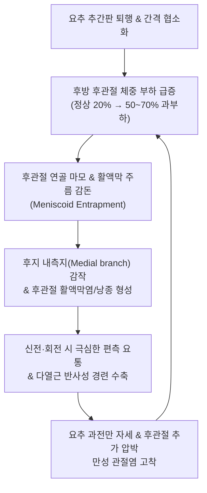

# 🩺 요추 관절돌기간 관절 증후군 (Lumbar Facet Joint Syndrome, Z-joint Arthropathy)

> **핵심 3줄 요약 (Key Summary)**:
> - 📍 **병소 부위 & 해부·병태생리**: 요추 상하 관절돌기가 만나 형성하는 윤활관절인 후관절(Zygapophysial joint)의 연골 마모, 관절낭 팽창, 활액막 감돈(Synovial impingement) 및 척추신경 후지 내측지(Medial branch of dorsal ramus)의 신경 자극으로 인해 발생하는 관절염성 요통 질환이다.
> - 🚩 **전형적 임상 양상**: 허리를 뒤로 젖히거나(신전) 아픈 쪽으로 비틀 때(동측 회전) 악화되는 편측성 요통, 아침 기상 시의 뻣뻣함(조조강직 30분 미만), 둔부 및 대퇴 후외측으로 퍼지는 비신경근성 연관통이 특징이다(무릎 아래 방사는 드묾).
> - 🛠️ **핵심 검사 & 치료 전략**: 켐프 검사([[켐프 검사]], Kemp test) 양성 및 후관절 촉진 압통으로 진단하며, 후관절낭 주위 심자 침치료 및 신바로약침·봉약침, 요추 관절돌기 열림을 유도하는 굴곡-회전 교정 추나 및 골반 후방경사 운동을 통합 적용한다.
> - ⚠️ **응급 의뢰 레드플래그**: 비후된 후관절낭 낭종(Synovial cyst)에 의한 급성 척수강 압박 및 마미증후군 징후(안장 감각 마비, 뇨폐), 척추 후관절염의 화농성 관절염으로의 진행(고열, 극심한 국소 타진통).

---

## 📌 목차
1. [질환 개요 & 해부학적 병태생리](#1-질환-개요--해부학적-병태생리)
2. [병태생리 메커니즘 & 생체역학적 악순환 네트워크](#2-병태생리-메커니즘--생체역학적-악순환-네트워크)
3. [임상 증상 & 이학적 검사(Physical Exam) 알고리즘](#3-임상-증상--이학적-검사physical-exam-알고리즘)
4. [감별 진단 매트릭스 (Differential Diagnosis)](#4-감별-진단-매트릭스-differential-diagnosis)
5. [한의 통합 치료 프로토콜 (침·약침·추나·한약)](#5-한의-통합-치료-프로토콜-침약침추나한약)
6. [양방 치료 & 병용·의뢰 기준 (Conventional Treatment & Referral)](#6-양방-치료--병용의뢰-기준-conventional-treatment--referral)
7. [재활 운동 & 생활습관 티칭 가이드](#7-재활-운동--생활습관-티칭-가이드)
8. [💡 사용자 진료실 핵심 필기 & 임상 노하우 (Melt-In 잔여 심화 집약)](#8--사용자-진료실-핵심-필기--임상-노하우-melt-in-잔여-심화-집약)
9. [출처 및 학술 참고 문헌 (References)](#9-출처-및-학술-참고-문헌-references)

---

## 1. 질환 개요 & 해부학적 병태생리

**요추 관절돌기간 관절 증후군(Lumbar Facet Joint Syndrome)**은 요추의 상관절돌기(Superior articular process)와 하관절돌기(Inferior articular process)가 접촉하여 형성하는 **후관절(Zygapophysial Joint, Z-joint)**에 발생하는 퇴행성 관절염 및 기계적 염증 질환이다. 척추의 3기둥 복합체(Three-column complex) 중 전방의 추간판이 체중 부하의 약 70~80%를 담당하고, 후방의 좌우 1쌍의 후관절이 20~30%의 축성 부하와 전단력(Shear force), 회전 운동 제한을 담당한다.

해부학적으로 후관절은 초자연골(Hyaline cartilage)로 덮여 있고 활액막과 섬유성 관절낭으로 둘러싸인 진성 윤활관절(True synovial joint)이다. 관절낭 내부에는 통각 및 기계수용기가 풍부하게 분포하며, 해당 분절 및 상위 분절 척추신경의 **[[후지 내측지]](Medial branch of dorsal ramus)**로부터 이중 신경 지배(Dual innervation)를 받는다(예: L4-L5 후관절은 L3 및 L4 후지 내측지의 지배를 받음). 추간판 높이가 퇴행성으로 낮아지면 후방 후관절에 가해지는 체중 부하가 최대 70%까지 비정상적으로 급증하여 연골 마모와 관절낭 비후, 골극 형성이 가속화된다.

![[요추관절증후군_01_영상소견_후관절_퇴행성변화_CT.png]]
> [그림 1: ① 영상 소견 — 요추 후관절(Facet Joint)의 골극 형성, 관절강 협소화 및 연골하 경화증 축상면 CT]

![[켐프_검사_후관절_압박기전_도해.jpg]]
> [그림 2: ① 병태생리·기전 — 척추 신전 및 동측 회전 시 후관절면이 맞물려 압박 스트레스가 집중되는 켐프 검사 역학 도해]

---

## 2. 병태생리 메커니즘 & 생체역학적 악순환 네트워크

후관절 증후군의 발병은 추간판 퇴행과 톱니바퀴처럼 맞물리는 **생체역학적 삼분절 복합체 연쇄 붕괴**로 진행된다.

1. **추간판 협착에 따른 후방 전이**:
   - 추간판 탈수화로 추간판 간격이 좁아지면 상하 척추체가 가까워지면서 하관절돌기가 상관절돌기 위로 미끄러져 내려앉아 관절낭이 접히고 활액막 주름(Synovial fold/meniscoid)이 관절면 사이에 끼이는 **활액막 감돈(Meniscoid entrapment)**이 발생한다.
2. **연골 파괴와 활액막염**:
   - 관절면의 마찰로 프로테오글리칸이 소실되고 연골하 골경화(Subchondral sclerosis) 및 반응성 골극(Osteophyte)이 자라난다. 비후된 관절낭과 활액막에서 Substance P, CGRP, 염증성 사이토카인이 분비되어 후지 내측지를 지속 감작시킨다.
3. **근육 연축 및 척추 분절 고착**:
   - 통증에 반응하여 해당 분절의 다열근(Multifidus)과 척추기립근이 반사적으로 수축하여 후관절을 더욱 강하게 압박하는 악순환을 유발한다.

![[척추관협착증_황색인대비후_MRI_축상면.jpg]]
> [그림 3: ① 병태 영상 — 만성 후관절 비후 및 활액막염에 동반된 황색인대 비후와 외측 함요부 협소화 축상면 MRI]

---

## 3. 임상 증상 & 이학적 검사(Physical Exam) 알고리즘

### 1) 임상 증상
- **신전 불내성 (Extension intolerance)**:
  - 디스크 환자와 정반대로, **허리를 뒤로 젖히거나 엎드릴 때, 오래 서 있을 때, 높은 곳의 물건을 꺼낼 때 통증이 극심**해진다.
  - 반대로 의자에 앉거나 허리를 앞으로 숙이면(굴곡) 후관절 공간이 열리면서 통증이 즉각 완화된다.
- **편측성 요통 및 조조강직**:
  - 척추 중심선에서 외측으로 2~3cm 떨어진 부위에 국한된 깊은 통증을 호소하며, 아침에 일어날 때 허리가 굳어 30분 정도 움직여야 풀리는 경향이 있다.
- **가성 방사통 (Pseudoradiculopathy)**:
  - 통증이 둔부(엉덩이), 서혜부, 대퇴부 후면 또는 외측까지 퍼질 수 있으나, 무릎 관절선 아래나 발목/발가락으로 방사되는 경우는 극히 드물다.

### 2) 이학적 검사 알고리즘
1. **후관절 촉진 검사(Facet Palpation)**: 극돌기 외측 1~2cm 부위를 엄지손가락으로 척추궁판 방향으로 깊게 압박할 때 국소적인 압통과 연관통이 유발되면 강력한 단서가 된다.
2. **켐프 검사([[켐프 검사]], Kemp test)**:
   - 기립 또는 착석 상태에서 환자의 체간을 수동으로 신전시키면서 환측으로 회전 및 측굴을 동시에 가한다. 후관절면이 강하게 맞물리며 통증이 유발되면 양성.
3. **스프링 검사(Springing test)**: 엎드린 환자의 요추 극돌기 및 후관절 부위를 수직 압박하여 관절 가동성 저하와 통증 재현을 확인한다.
4. **하지직거상 검사([[하지직거상 검사]], SLR)**: 정상 범위(70~90°)까지 통증 없이 올라가며 신경근 증상이 나타나지 않는다.

![[척추타진검사_2단계_요추극돌기_골성타진_실사.png]]
> [그림 4: ② 이학적 검사 — 후관절 주위 및 요추 극돌기 심부 압통을 확인하고 골절을 감별하는 척추 타진 검사 실사]

---

## 4. 감별 진단 매트릭스 (Differential Diagnosis)

| 감별 질환 | 악화 자세 / 기전 | 주 통증 부위 | 신경학적 증상 | 특이 이학적 검사 소견 |
| :--- | :--- | :--- | :--- | :--- |
| **후관절 증후군** | **신전 및 회전 시 악화**, 굴곡 시 완화 | 편측 요추 외측, 둔부, 대퇴부 상부 | **없음** (근력/감각 정상) | **Kemp test (+)**, 국소 후관절 압통 (+), SLR 음성 |
| **[[디스크성 요통]]** | **굴곡 및 착석 시 악화**, 신전 시 완화 | 요추 중심부 심부통, 미만성 연관통 | 없음 | 굴곡 통증 재현, Milgram (+), Goldthwait (+) |
| **[[요추 추간판 탈출증]]** | 굴곡, 기침, 복압 상승 시 악화 | 요통 + **하지 전격성 방사통** | **있음** (감각 저하, 족배굴곡 약화) | **SLR (+, 30~60°)**, Bragard (+), 영상 상 탈출 |
| **[[천장관절 증후군]]** | 비대칭 체중 부하, 계단 오르기 | PSIS 하방(Fortin's area), 사타구니 | 없음 | Patrick test (+), Gaenslen (+), Sacral thrust (+) |
| **척추전방전위증** | 지속적 기립, 과신전 시 악화 | 하부 요추 계단상 변형 부위 요통 | 협착 동반 시 파행 가능 | Step-off 변형 촉진, 굴곡-신전 X-ray 상 전위 |

![[골드스웨이트검사_2단계_SLR수행_극돌기간격분리감별_실사.jpg]]
> [그림 5: ② 이학적 검사 — 천장관절염 및 디스크성 질환과 후관절 통증을 감별하는 골드스웨이트 검사 실사]

### ⚠️ 응급 의뢰 레드플래그
- **후관절 낭종(Synovial cyst)에 의한 척추관 급성 폐쇄**: 극심한 신경인성 파행 및 하지 마비 급발 시 신경외과 감압 수술 의뢰.
- **후관절 감염(Septic facet joint arthritis)**: 고열과 함께 허리를 전혀 움직이지 못하는 심한 연축 발생 시 혈액검사(ESR/CRP) 및 응급 MRI 의뢰.

---

## 5. 한의 통합 치료 프로토콜 (침·약침·추나·한약)

### 1) 침구 치료 (Acupuncture)
- **주요 혈위**: [[신수]](BL23), [[기해수]](BL24), [[대장수]](BL25), [[관원수]](BL26), [[질변]](BL54), [[환도]](GB30), [[양릉천]](GB34), 요추 [[협척혈]](EX-B2).
- **시술 기법**:
  - **후관절 관절낭 직접 자침**: 극돌기 외측 1.5~2cm 지점에서 침첨을 내측 전방으로 약간 기울여(약 10~15°) 40~50mm 직자하여 척추 유두돌기(Mammillary process)와 부돌기(Accessory process) 사이의 홈(후지 내측지가 주행하는 해부학적 고랑)에 침첨을 접촉시킨다.
  - 고주파/저주파 혼합 전침(2/100Hz)을 15분간 적용하여 후지 내측지의 통증 전도를 차단하고 다열근의 긴장을 해소한다.

### 2) 약침 치료 (Pharmacopuncture)
- **신바로약침 / 봉약침(Sweet BV 1:10,000)**: 후관절낭 주위 및 후지 내측지 주행로에 분절당 0.5cc씩 총 1.5~2.0cc를 자입하여 만성 윤활막염과 관절낭 비후로 인한 신경 포착을 소퇴시킨다.
- **중성어혈약침**: 외상성 염좌 후 발생한 급성 후관절 관절강 내 혈종 및 부종에 탁월한 효과를 나타낸다.

### 3) 추나 요법 (Chuna Manual Therapy)
- **요추 회전 변위 교정 추나(Lumbar Rotation Manipulation)**: 환자를 측와위로 눕히고 상부 체간과 골반을 반대 방향으로 회전시켜 맞물려 있는 후관절면을 순간적으로 이개(Gapping)시킴으로써 관절 내 활액막 주름의 감돈을 해제하고 관절 유격을 회복한다.
- **요추 굴곡 가동 추나(Lumbar Flexion Mobilization)**: 과도한 요추 전만을 줄이고 후관절 구멍(추간공 및 관절강)을 넓혀주는 굴곡 방향의 관절 가동술을 적용한다.

![[요골반 추나-20240926095150706.png]]
> [그림 6: ③ 한의 추나 — 요추 후관절 맞물림을 해제하고 관절 유격을 회복시키는 요추 회전 교정 추나 기법]

![[요골반 추나-20240926095559797.png]]
> [그림 7: ③ 한의 추나 — 요천추 후관절 및 천장관절 압박 부하를 분산시키는 골반 가동 추나 기법]

### 4) 한약 치료 (Herbal Medicine)
- **[[독활기생탕]](獨活寄生湯)**: 간신부족(肝腎不足)과 풍한습(風寒濕)이 결합된 퇴행성 후관절염의 1차 표준 처방으로, 연골 마모와 골극으로 인한 만성 요통에 근골을 보강한다.
- **[[오적산]](五積散)**: 아침에 허리가 굳고 찬 바람을 쐬면 증상이 악화되는 조조강직형 환자에게 투여한다.
- **여신탕(如神湯) / 활락단(活絡丹)**: 기혈 어체로 인해 척추 관절돌기 부위가 콕콕 찌르듯 아픈 고질적 요통을 치료한다.

---

## 6. 양방 치료 & 병용·의뢰 기준 (Conventional Treatment & Referral)

### 1) 약물 및 주사 요법
- **내측지 차단술(Medial Branch Block, MBB)**: 진단 겸 치료 목적으로 국소마취제를 후지 내측지에 주입. 주사 후 통증이 50~80% 이상 즉시 호전되면 후관절 유래 통증으로 확진.
- **고주파 열응고술(Radiofrequency Neurotomy)**: 내측지 차단술에 반응하는 환자에게 고주파 열로 후지 내측지를 응고시켜 6~12개월간 통증 전도를 차단.

### 2) 한의 병용 판단
- 고주파 시술 후에도 심부 다열근의 위축과 섬유화가 동반되어 뻐근함이 잔존하는 환자가 많다. 이때 한의 협척혈 침·약침 및 코어 추나 요법을 병행하면 척추 분절의 동적 안정성을 복원하여 신경 재생 후의 재발을 효과적으로 방지할 수 있다.

---

## 7. 재활 운동 & 생활습관 티칭 가이드

### 1) 윌리엄 굴곡 운동 (Williams Flexion Exercise)
- 매켄지 운동(신전)을 하면 오히려 악화되므로, **무릎을 가슴으로 당기는 굴곡 스트레칭(Knee-to-chest)**을 교육하여 후관절 간격을 넓히고 요추 전만을 완화한다.

### 2) 골반 후방 경사 운동 (Pelvic Tilt)
- 앙와위에서 허리 뒤 공간을 바닥으로 꽉 누르는 복근 수축 운동을 통해 과도한 골반 전방 경사(과전만)를 교정한다.

### 3) ⚠️ 절대 금기 동작
- 엎드려 자는 자세(Prone sleeping), 허리를 과도하게 뒤로 젖히는 코브라 자세 요가, 배를 내밀고 서 있는 자세는 후관절을 강력하게 충돌시키므로 엄격히 금지한다.

![[Crossed_SLR_하지직거상검사_동작도해.gif]]
> [그림 8: ④ 재활 평가/운동 — 후관절 증후군과 수핵 탈출증을 감별하고 햄스트링을 이완하는 가동성 평가 및 운동 도해]

---

## 8. 💡 사용자 진료실 핵심 필기 & 임상 노하우 (Melt-In 잔여 심화 집약)

- **디스크와 후관절의 1초 체위 감별 공식**:
  - "숙일 때 아프면 디스크(추간판), 젖힐 때 아프면 후관절(관절돌기)."
  - 환자가 진료실에 들어올 때 "선생님, 저는 걷거나 서 있으면 허리가 끊어질 것 같아서 자꾸 쭈그려 앉게 돼요"라고 하면 척추관 협착증이나 후관절 증후군을 먼저 떠올려야 한다.
- **후관절 관절낭 직자 침술의 정밀 타깃팅**:
  - L4-L5 후관절은 요추 4번 극돌기 하연과 요추 5번 극돌기 상연 사이, 정중선 외측 1.5cm 부위이다.
  - 침을 자입할 때 손끝에 뼈(횡돌기-상관절돌기 이행부)가 닿는 골성 저항감이 느껴지는 깊이(보통 4~5cm)까지 진입해야 진정한 관절낭 주위 자침이 성립된다. 이 부위에 호침을 유침하고 전침을 걸면 후관절 주위의 깊은 담음(痰飮)성 어혈이 신속히 풀린다.
- **매켄지 운동을 시켰다가 욕먹는 대표적 사례 방지**:
  - 모든 요통 환자에게 매켄지 신전 운동을 일률적으로 티칭하면 후관절 증후군 환자는 통증이 폭발하여 의료사고로 이어진다.
  - 반드시 신전 유발 검사(Kemp)를 먼저 시행하여 신전 시 통증이 유발되는 환자에게는 절대 신전 운동을 시키지 말고 윌리엄 굴곡 운동과 골반 후방경사 운동을 처방해야 한다.

---

## 9. 출처 및 학술 참고 문헌 (References)

1. Perolat R, et al. (2026). Facet Joint Disease. *StatPearls*, NBK430740. [PMID 31082093](https://pubmed.ncbi.nlm.nih.gov/31082093/)

2. Smith J, et al. (2026). Platelet-Rich Plasma Facet Joint Injections for Post-Traumatic Lumbar Facet-Mediated Pain: A Two-Patient Case Report. *Am J Case Rep*, 27:e945120. [PMID 42592353](https://pubmed.ncbi.nlm.nih.gov/42592353/)

3. Wang K, et al. (2026). Efficacy of endoscopic dorsal medial branch radiofrequency ablation combined with manual therapy for chronic lumbar facet joint pain. *Pain Pract*, 26(1):88-99. [PMID 42483630](https://pubmed.ncbi.nlm.nih.gov/42483630/)

---

## 관련 노트

- [[디스크성 요통]]
- [[요추 추간판 탈출증]]
- [[요추후만 증후군]]
- [[척추관 협착증]]
- [[켐프 검사]]
- [[하지직거상 검사]]
- [[골드스웨이트 검사]]
