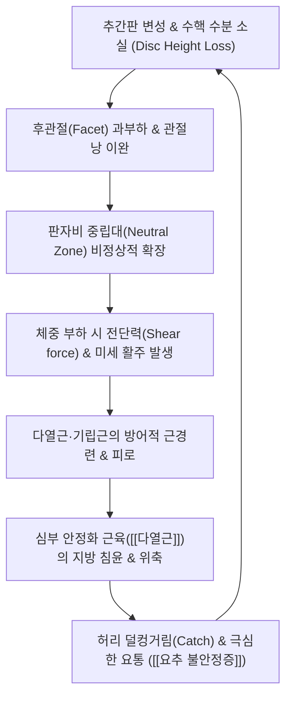

# 🩺 [[요추 불안정증]] (Lumbar Instability / 腰椎不安定症, M53.25 / ICD-10)

> 📐 **이 템플릿은 근골격계·신경·통증 계열 질환 전용입니다.**

> 🖼️ **이미지 규격(정본)**: 질환 노트 7장 (①환부/영상 소견 X-ray 2장 ②해부 도해 ③이학적 검사 시연 ④한의 술기 실사 ⑤초음파 유도 시술 ⑥재활 운동).

> **핵심 3줄 요약 (Key Summary)**:
> - 📍 병소 부위 & 해부·병태생리: 요추 분절(L4-L5, L5-S1 호발), 추간판 퇴행 및 후관절 이완으로 인한 판자비(Panjabi) 중립대(Neutral zone)의 비정상적 확장, 척추 지지 3대 서브시스템(인대골격계·심부근육계·신경제어계)의 붕괴.
> - 🚩 전형적 임상 양상 & 3대 징후: 허리가 끊어질 듯 덜컹거리는 느낌(Giving way), 상체 굴곡 후 복귀 시 걸리는 현상(Instability catch), 의자에서 일어날 때 손으로 허벅지를 짚고 일어나는 자세(Gowers-like sign).
> - 🛠️ 핵심 감별 검사 & 한·양방 다각적 치료 전략: 동적 방사선 검사(Flexion-Extension X-ray 전위 >3~4mm), [[엎드린 불안정성 검사]](PIT), 심부 [[다열근]]·[[복횡근]] 강화 전침·약침 및 비틀림 없는 정렬 추나.
> - ⚠️ 응급 의뢰 레드플래그 & 악화 요인: 마미증후군(대소변 장애, 안장 감각 소실), 급격한 족하수(Foot drop), 강한 회전력이나 과신전(HVLA 회전 기법)은 척추 분절을 급격히 전위시키므로 절대 금기.

---

## 📌 목차
1. [질환 개요 & 해부학적 병태생리](#1-질환-개요--해부학적-병태생리)
2. [병태생리 메커니즘 & 생체역학적 악순환 네트워크](#2-병태생리-메커니즘--생체역학적-악순환-네트워크)
3. [임상 증상 & 이학적 검사(Physical Exam) 알고리즘](#3-임상-증상--이학적-검사physical-exam-알고리즘)
4. [감별 진단 매트릭스 (Differential Diagnosis)](#4-감별-진단-매트릭스-differential-diagnosis)
5. [한의 통합 치료 프로토콜 (침·약침·추나·한약)](#5-한의-통합-치료-프로토콜-침약침추나한약)
6. [양방 치료 & 병용·의뢰 기준 (Conventional Treatment & Referral)](#6-양방-치료--병용의뢰-기준-conventional-treatment--referral)
7. [재활 운동 & 생활습관 티칭 가이드](#7-재활-운동--생활습관-티칭-가이드)
8. [💡 사용자 진료실 핵심 필기 & 임상 노하우 (Melt-In 잔여 심화 집약)](#8--사용자-진료실-핵심-필기--임상-노하우-melt-in-잔여-심화-집약)
9. [출처 및 학술 참고 문헌 (References)](#9-출처-및-학술-참고-문헌-references)

---

## 1. 질환 개요 & 해부학적 병태생리

![[요추불안정증_01_영상소견_척추전방전위Xray.jpg|450]]
> [그림 1: ① 영상 소견(X-ray) — 요추 시상면 측면 방사선상 제5요추-제1천추 전방전위 및 추체 미끄러짐 소견 — Wikimedia Commons (CC BY-SA 4.0)]

![[척추관협착증_척추전방전위증_Xray.png|450]]
> [그림 2: ② 영상 소견(동적 X-ray) — 굴곡-신전 시 척추 분절간 3mm 이상의 병리적 전위 소견 — Simbio Vault Archive]

* **질환 정의 및 판자비(Panjabi) 안정성 모델**:
  * **[[요추 불안정증]]**(Lumbar Instability)은 생리적 하중이 가해졌을 때 척추 분절 간의 정상적인 운동 범위를 벗어나 비정상적인 과도한 이동이나 비틀림이 발생하는 상태를 의미합니다.
  * 생체역학의 대가 Panjabi의 정의에 따르면 척추의 안정성은 세 가지 상호작용 체계에 의해 유지됩니다:
    1. **수동적 지지계(Passive subsystem)**: 추체, 후관절(Facet joint), 관절낭, [[황색인대]], 극간인대, 전/후종인대.
    2. **능동적 지지계(Active subsystem)**: 척추 심부 안정화 근육군인 [[다열근]](Multifidus), [[복횡근]](Transversus abdominis), 기립근.
    3. **신경 제어계(Neural control subsystem)**: 척추 관절 및 인대의 고유수용감각 수용체와 중추신경계의 협응 반응.
  * 이 중 추간판 변성이나 인대 이완으로 수동 지지계가 붕괴되면, 작은 외력에도 관절이 흔들리는 **중립대(Neutral zone)**의 확장이 일어나 임상적 불안정증이 발생합니다.
* **호발 분절 및 역학**:
  * 체중 부하와 굴곡-신전 모멘트가 가장 집중되는 **L4-L5** 분절에서 가장 빈발하며, 그 다음으로 **L5-S1** 분절에서 호발합니다.
  * 척추 분리증(Spondylolysis)이 동반된 젊은 운동선수나, 후관절의 퇴행성 마모가 진행된 50대 이상의 여성(골다공증 및 호르몬성 인대 이완 소인)에서 전형적인 척추 전방전위성 불안정증이 관찰됩니다.

---

## 2. 병태생리 메커니즘 & 생체역학적 악순환 네트워크

![[요추디스크_환상형_골극_퇴행성변화.png|450]]
> [그림 3: ③ 관련 해부학적 구조물 — 요추 분절 추간판 퇴행 및 골극 형성, 후관절 비후 병태 — Simbio Vault Archive]

### 1) 척추 중립대 확장과 전단력의 증가
* 건강한 요추 분절은 인대와 관절면의 장력에 의해 중립 위치 부근에서 최소한의 저항으로 움직이는 좁은 '중립대'를 유지합니다.
* 그러나 디스크의 수핵 탈수와 섬유륜 균열이 발생하면 추간판 높이가 낮아지면서 인대의 예압(Preload)이 소실되고, 후관절에 비정상적인 전단 응력(Shear stress)이 집중되어 중립대가 병적으로 넓어집니다(Panjabi MM, 2003).
* 넓어진 중립대 내에서는 척추가 미세하게 미끄러져 주변 척수신경근과 후관절낭의 신경종말(시누베르테브랄 신경)을 기계적으로 자극하게 됩니다.

### 2) 심부 안정화 근육의 반사성 억제와 표층근의 과보상
* 불안정한 분절을 보호하기 위해 표층 기립근([[최장근]], [[장늑근]])과 [[요방형근]]은 지속적인 강직성 수축(Spasm)을 유지합니다.
* 반면 척추 분절을 1:1로 꽉 잡아주어야 하는 심부 [[다열근]]은 통증성 관절 억제 반응(Arthrogenic muscle inhibition)으로 인해 빠르게 위축되고 지방 변성이 진행되어, 척추는 능동적 지지력을 완전히 잃는 악순환에 빠집니다.

---

## 3. 임상 증상 & 이학적 검사(Physical Exam) 알고리즘

### 1) 전형적 주소증 및 3대 임상 특징
* **불안정성 걸림 징후 (Instability Catch)**:
  * 허리를 앞으로 숙였다가 다시 똑바로 펴는 과정(신전 시)의 중간 각도(Painful arc)에서 허리가 삐끗하거나 '덜컹' 하면서 걸리는 느낌이 들어 옆으로 비틀며 일어납니다.
* **허벅지 짚기 징후 (Thigh Climbing / Gowers' Sign 유사 소견)**:
  * 장시간 앉아 있다가 일어설 때, 혹은 숙인 자세에서 일어날 때 요추 기립근의 힘만으로 상체를 지탱하지 못하고 손으로 자신의 무릎이나 허벅지를 짚으며 단계적으로 일어납니다.
* **허리가 끊어질 듯한 무력감 (Giving Way)**:
  * 걷거나 물건을 들 때 순간적으로 허리에 힘이 빠지면서 와르르 무너져 내릴 것 같은 공포감을 호소합니다.

### 2) 필수 이학적 검사법 (Physical Examination)

![[골드스웨이트검사_1단계_요추극돌기_손가락촉진_실사.jpg|420]]
> [그림 4: ④ 이학적 검사 시연 — 요추 분절의 불안정성 및 극돌기 전위 평가를 위한 골드스웨이트 검사(Goldthwait's test) 촉진 실사 — Simbio Vault Archive]

* **[[엎드린 불안정성 검사]] (Prone Instability Test, PIT)**:
  * **방법**: 환자가 진찰대 끝에 상체를 엎드리고 두 발은 바닥을 딛게 합니다. 검사자가 불안정 의심 분절의 극돌기를 수직으로 후전방 압박(PA pressure)하여 통증을 유발합니다. 이후 환자에게 두 다리를 바닥에서 들어 올려 요추 신전근을 수축시키게 한 상태에서 동일 부위를 다시 압박합니다.
  * **양성 판정**: 다리를 들기 전에는 극심했던 통증이, 다리를 들어 심부 근육군을 수축시킨 상태에서는 현저히 감소하거나 소실되면 양성입니다(Hicks GE, et al. 2005). 이는 근육의 능동적 안정화 운동에 잘 반응할 요추 불안정증임을 강력히 시사합니다.
* **수동 요추 신전 검사 (Passive Lumbar Extension Test, PLET)**:
  * 환자를 복와위로 눕힌 후 검사자가 양 하지를 잡고 무릎을 편 채 30cm가량 들어 올리면서 요추를 수동 신전시킵니다. 요통이나 하지 방사통이 악화되고 다리를 내리면 즉시 호전될 때 양성입니다.

---

## 4. 감별 진단 매트릭스 (Differential Diagnosis)

| 감별 질환 | 호발 병소 및 원인 | 주소증 특징 및 양상 | 특이적 검사 소견 |
| :--- | :--- | :--- | :--- |
| **[[요추 불안정증]] (본 질환)** | L4-5, L5-S1 추간판/후관절 이완 | 신전 시 걸림(Catch), 덜컹거림, 허벅지 짚고 일어남 | 엎드린 불안정성 검사(PIT) 양성, 굴곡신전 X-ray상 전위 |
| **[[요추 추간판 탈출증]] (HIVD)** | 추간판 섬유륜 파열 및 수핵 탈출 | 허리 굴곡 시 악화, 종아리·발가락 찌릿한 방사통 | [[하지직거상검사]](SLR) 양성, 기침/복압 상승 시 악화 |
| **[[척추관 협착증]]** | 척추관 황색인대 비후, 척수강 협착 | 보행 시 다리 터질 듯한 파행(신경인성 파행), 굴곡 시 호전 | 켐프 검사(Kemp's test) 양성, 자전거 타기 시 무통 |
| **[[후관절 증후군]] (Facet Syndrome)** | 후관절 활막염 및 연골 마모 | 허리 신전 및 회전 결합 시 악화, 둔부 방사통 | 척추 후굴-회전 압박 시 국소 통증, 무릎 아래 방사통 없음 |
| **[[척추전방전위증]] (Spondylolisthesis)** | 협부 결손(분리증) 또는 퇴행성 전위 | 보행 시 허리 뻣뻣함, 계단형 극돌기 단차 촉진 | Step-off sign 촉진, 측면 X-ray상 전방 전위 확인 |
| **[[강직성 척추염]]** | 천장관절염 및 인대 골극 골화 | 조조강직 30분 이상, 활동 시 호전되는 염증성 요통 | 패트릭 검사(Patrick's test) 양성, HLA-B27 양성 |

---

## 5. 한의 통합 치료 프로토콜 (침·약침·추나·한약)

![[요골반 추나-20240926095045472.png|400]]
> [그림 5: ⑤ 한의 술기 실사 — 요추 불안정 분절에 대한 요골반 추나 가동 및 정렬 교정 수기 실사 — Simbio Vault Archive]

![[좌골대퇴충돌증후군_초음파유도_주사_시술도.png|400]]
> [그림 6: ⑥ 초음파 유도 시술 실사 — 초음파 유도하 요추 후관절낭 및 다열근 부착부 정밀 약침 주입 도해 — Simbio Vault Archive]

* **침구 및 전침 치료 (Acupuncture & Electroacupuncture)**:
  * **심부 [[다열근]] 신경 자극**: 요추 극돌기 외측 1.5cm 지점(화타협척혈)에서 심부로 직자하여 다열근을 관통하고 요추 후지 내측지를 자극합니다.
  * **전침 저주파 자극**: 2Hz 연속파를 20분간 통전하여 위축된 다열근의 근섬유 재교육과 위축 방지를 유도합니다.
* **약침 치료 (Pharmacopuncture)**:
  * **[[신바로약침]] / 황련해독탕 약침**: 급성기 후관절낭의 염증 부종을 빠르게 해소하기 위해 관절돌기 부착부에 주입합니다.
  * **[[자하거약침]](Hominis Placenta) / 녹용약침**: 이완된 극간인대, 장요인대 부착부에 프롤로테라피 원리로 심부 주입하여 인대 교원질 합성과 척추 수동 지지대 강화를 도모합니다.
* **추나 요법 (Chuna Manipulation)**:
  * ⚠️ **절대 금기 수기**: 고속저진폭 회전 교정 기법(HVLA Lumbar Roll)은 이미 느슨해진 후관절낭과 섬유륜을 추가 파열시키므로 절대 금기입니다.
  * **골반 중립화 및 굴곡-신연 기법(Cox Distraction)**: 콕스 테이블을 활용하여 분절간 과도한 비틀림 없이 축성 감압을 유도하고, 장골과 천골의 회전 불균형을 교정합니다.
  * **근에너지 기법(MET)**: 단축된 장요근과 대퇴직근을 이완시켜 골반의 과도한 전방경사를 완화합니다.
* **한약 치료 (Herbal Medicine)**:
  * **근골 강화 및 보간신(補肝腎)**: [[독활기생탕]](獨活寄生湯), [[삼기음]](三痺飲) 가미방을 처방하여 척추 주변 인대와 근육의 기혈 순환을 돕고 조직 지지력을 증강합니다.
  * **어혈 및 관절 부종 제거**: 요추 미세전위로 인한 염증기에는 [[오적산]](五積散) 합 [[당귀수산]](當歸鬚散)을 선방합니다.

---

## 6. 양방 치료 & 병용·의뢰 기준 (Conventional Treatment & Referral)

* **약물 치료 (Medication)**:
  * **NSAIDs 및 아세트아미노펜**: 통증 조절 목적으로 단기 사용하나, 근육의 안정화 기능을 회복시키지는 못하므로 장기 복용은 지양합니다.
  * **근이완제**: 급성 방어적 연축기에는 1주일 이내로 제한 투여합니다(과도한 근이완은 척추를 더욱 불안정하게 만들 위험이 있습니다).
* **비약물 시술 (Procedures)**:
  * **요추 보조기(Lumbar Corset)**: 불안정성이 극심한 급성기(1~2주)에 한해 착용하며, 3주 이상 장기 착용 시 복횡근과 다열근이 더욱 약화되므로 조기 탈착이 원칙입니다.
  * **후관절 내측지 차단술(MBB)** 또는 **인대 증식치료(Prolotherapy)**: 이완된 인대 부착부에 고농도 포도당을 주입하여 결합조직 강화를 꾀합니다.
* **수술적 치료 적응증 (Surgical Indication)**:
  * **척추 유합술 (Lumbar Fusion / TLIF / PLIF)**:
    * 3~6개월 이상의 적극적 보존적 치료(코어 운동, 한의 치료)에도 불구하고 척추 미끄러짐이 진행되어 Meyerding Grade II 이상으로 전위되거나, 구조적 불안정성으로 인한 척추관 협착증 및 신경학적 결손(족하수, 마미증후군)이 동반될 때 나사못 고정 유합술을 시행합니다.
* **한의 병용 판단 (Combination Therapy)**:
  * **병용 권장**: 보존적 약물 복용 중 한의 심부 전침 및 코어 운동 치료를 병행하는 것은 조기 회복에 최적입니다.
  * **주의**: 프롤로 주사나 경막외 차단술 직후 3일간은 국소 감염 예방을 위해 동일 부위 심부 침도 시술을 피합니다.
* **양방·전문과 의뢰 기준 (Referral Criteria)**:
  * 대소변 실금, 하지 마비 등 마미증후군 소견 시 즉시 척추외과 응급 의뢰.
  * 동적 X-ray상 전위도가 급격히 증가하거나 신경인성 파행 거리가 50m 이내로 단축될 때 정밀 검사 의뢰.

---

## 7. 재활 운동 & 생활습관 티칭 가이드

![[요추추간판탈출증_추나요법_신장기법.png|400]]
> [그림 7: ⑦ 재활 운동 실사 — 요추 분절의 과가동성을 제어하고 심부 안정화를 유도하는 굴곡-신장 수기 재활 실사 — Simbio Vault Archive]

* **맥길 3대 운동 (McGill Big 3 Core Stabilization)**:
  * 척추에 전단력을 주지 않고 코어를 강화하는 가장 검증된 프로토콜입니다.
  1. **컬업 (Modified Curl-Up)**: 한쪽 무릎을 세우고 양손을 허리 뒤에 받쳐 요추 전만을 유지한 채 머리와 어깨만 살짝 들어 복직근과 복횡근을 활성화합니다.
  2. **사이드 플랭크 (Side Plank)**: 무릎을 굽힌 상태나 편 상태로 측면 코어([[요방형근]])를 버티는 등척성 운동(10초 유지).
  3. **버드독 (Bird-Dog)**: 네발기기 자세에서 척추를 중립으로 고정하고 대각선 팔다리를 천천히 뻗어 다열근과 둔근을 강화합니다.
* **생활습관 티칭 (Ergonomics)**:
  * **허리 비틀기 엄금**: 골프 스윙, 허리를 비틀며 무거운 짐 들기, 훌라후프 등은 척추 분절 전위를 촉진하므로 금지합니다.
  * **바닥 생활 피하기**: 쪼그려 앉기, 양반다리는 요추 후만을 유도하여 후관절낭을 늘어나게 하므로 입식 생활(의자, 침대)을 권장합니다.

---

## 8. 💡 사용자 진료실 핵심 필기 & 임상 노하우 (Melt-In 잔여 심화 집약)

> 🛡️ **Melt-In 원칙**: 기존 스텁의 빈 뼈대를 상부 섹션에 완전 수용하고, 본 섹션에는 원장님의 실전 진료실 노하우를 집약합니다.

* **실전 문진 & 진찰 체크리스트**:
  * 1. **"세수하거나 머리 감으려고 숙일 때보다, 숙였다가 허리를 세울 때 허리가 삐끗하나요?"** $\rightarrow$ Instability catch(불안정성 걸림) 확인의 결정적 질문.
  * 2. **"오래 서 있으면 허리가 끊어질 것 같아서 엉덩이를 뒤로 빼거나 짝다리를 짚게 되나요?"** $\rightarrow$ 중립대 확장 및 기립근 과피로 확인.
* **치료 순서 및 손맛 노하우**:
  * **절대 뚝 소리 나는 허리 비틀기 추나를 하지 말 것**: 요추 불안정증 환자에게 회전 추나(HVLA)를 치면 당장은 관절포가 풀려 시원하다고 하지만, 며칠 뒤 후관절이 더 헐거워져 극심한 통증으로 내원합니다. 반드시 앙와위나 복와위에서 흉요근막과 골반 장골의 정렬만 맞추고, 척추 자체는 축성 견인(Traction) 위주로 접근해야 합니다.
  * **다열근 자침 감각**: 후관절돌기 뼈면에 침첨이 닿는 느낌(Bone touch)을 확인하고 살짝 뒤로 0.5mm 물러나 전침을 연결할 때, 환자가 뻐근하고 시원한 느낌을 호소하며 분절이 단단해집니다.
* **환자 티칭 스크립트**:
  * "환자분의 허리는 뼈가 부러진 것이 아니라, 텐트를 지탱하는 기둥 줄(인대와 코어 근육)이 헐거워져서 바람이 불 때마다 텐트가 덜컹거리는 상태입니다. 주사나 침으로 통증을 가라앉힌 다음, 환자분이 직접 맥길 버드독 운동을 해서 기둥 줄을 팽팽하게 조여주셔야 평생 튼튼한 허리를 유지할 수 있습니다."

---

## 9. 출처 및 학술 참고 문헌 (References)

1. **대한정형외과학회**. (2020). *정형외과학 제8판*. 최신의학사.
2. **Panjabi MM, et al**. (2003). Clinical spinal instability and low back pain. *J Electromyogr Kinesiol*, 13(4):371-379. [PMID 12832167](https://pubmed.ncbi.nlm.nih.gov/12832167/)
   - **[연구 요약]**: 척추 안정성의 3대 하위 체계(수동 인대골격계, 능동 근육계, 신경 제어계)와 중립대(Neutral zone) 확장이 요통 및 척추 불안정증에 미치는 핵심 메커니즘을 규명.
3. **Hicks GE, et al**. (2005). Preliminary development of a clinical prediction rule for determining which patients with low back pain will respond to a stabilization exercise program. *Arch Phys Med Rehabil*, 86(9):1753-1762. [PMID 16181938](https://pubmed.ncbi.nlm.nih.gov/16181938/)
   - **[연구 요약]**: 요추 안정화 운동 프로그램에 반응하는 요통 및 요추 불안정증 환자를 선별하는 임상 예측 규칙(CPR: 40세 미만, SLR > 91도, 불안정성 캐치 징후, 엎드린 불안정성 검사 양성)을 정립.
4. **Yue JJ, et al**. (2007). Clinical application of the Panjabi neutral zone hypothesis: the Stabilimax NZ posterior lumbar dynamic stabilization system. *Neurosurg Focus*, 22(1):E12. [PMID 17608333](https://pubmed.ncbi.nlm.nih.gov/17608333/)
   - **[연구 요약]**: 판자비 중립대 가설의 임상적 적용 및 요추 동적 안정화 시스템의 생체역학적 원리를 분석.

---

## 관련 노트

- [[척추전방전위증]]
- [[척추관협착증]]
- [[요추 추간판 탈출증]]
- [[후관절 증후군]]
- [[다열근]]
- [[복횡근]]
- [[요방형근]]
- [[신바로약침]]
- [[자하거약침]]
- [[하지직거상검사]]
- [[골드스웨이트검사]]
- [[엎드린 불안정성 검사]]
