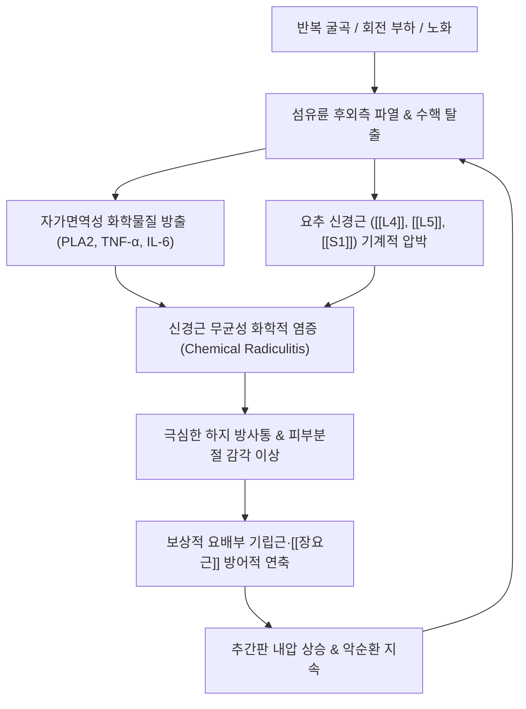

# 🩺 [[요추 추간판 탈출증]] (Lumbar Disc Herniation, M51.2)

> **핵심 3줄 요약 (Key Summary)**:
> - 📍 병소 부위 & 해부·병태생리: 요추 추간판의 섬유륜(Annulus fibrosus) 파열 및 수핵(Nucleus pulposus) 후외측 탈출로 인해 [[L4]], [[L5]], [[S1]] 신경근에 기계적 압박과 화학적 염증 반응(TNF-α, PLA2)이 유발되는 질환.
> - 🚩 전형적 임상 양상 & 3대 징후: 기침·복압 상승 시 악화되는 요통, 편측 둔부에서 하퇴·족부로 뻗치는 전격성 방사통, [[하지직거상 검사]](SLR) 양성 및 신경근 지배 근력 약화(족배굴곡·족저굴곡 곤란).
> - 🛠️ 핵심 감별 검사 & 한·양방 다각적 치료 전략: SLR 및 Crossed SLR, Bragard 검사로 신경근 압박 확진 후, 신바로·봉약침 [[약침 치료]], 방사통 경로 침전기 자극, 콕스 테이블 및 Leg-over 신장 [[추나요법]], 매켄지 신전 운동 지도.
> - ⚠️ 응급 의뢰 레드플래그 & 악화 요인: 마미증후군(대소변 실금/요폐, 안장 감각 상실), 급격한 족하수(Foot drop) 발생 시 48시간 이내 응급 척추 감압 수술 의뢰 필수; 무분별한 허리 굴곡 스트레칭은 수핵 탈출을 가속하므로 절대 금기.

---

## 📌 목차
1. [질환 개요 & 해부학적 병태생리](#1-질환-개요--해부학적-병태생리)
2. [병태생리 메커니즘 & 생체역학적 악순환 네트워크](#2-병태생리-메커니즘--생체역학적-악순환-네트워크)
3. [임상 증상 & 이학적 검사(Physical Exam) 알고리즘](#3-임상-증상--이학적-검사physical-exam-알고리즘)
4. [감별 진단 매트릭스 (Differential Diagnosis)](#4-감별-진단-매트릭스-differential-diagnosis)
5. [한의 통합 치료 프로토콜 (침·약침·추나·한약)](#5-한의-통합-치료-프로토콜-침약침추나한약)
6. [양방 치료 & 병용·의뢰 기준 (Conventional Treatment & Referral)](#6-양방-치료--병용의뢰-기준-conventional-treatment--referral)
7. [재활 운동 & 생활습관 티칭 가이드](#7-재활-운동--생활습관-티칭-가이드)
8. [💡 사용자 진료실 핵심 필기 & 임상 노하우 (Melt-In 잔여 심화 집약)](#8--사용자-진료실-핵심-필기--임상-노하우-melt-in-잔여-심화-집약)
9. [출처 및 학술 참고 문헌 (References)](#9-출처-및-학술-참고-문헌-references)

---

## 1. 질환 개요 & 해부학적 병태생리

![[요추디스크_수핵탈출_MRI_및_탈출형태.png|450]]
> [그림 1: ① 요추 디스크 수핵 탈출 모식도 및 MRI 소견 — 수핵의 후외측 탈출로 인한 신경근 압박 및 시상면 T2 강조영상 병변 — 출처: Wikimedia Commons (CC BY-SA 4.0)]

![[요추디스크_섬유륜형_병태해부도.png|450]]
> [그림 2: ② 요추 디스크 섬유륜형 병태해부도 — 섬유륜의 방사형 파열 및 주변 신경 혈관 반응 — 출처: Wikimedia Commons (CC BY 4.0)]

* **추간판의 3대 해부학적 구조**:
  * **수핵 (Nucleus Pulposus)**: 디스크 중앙의 친수성 프로테오글리칸(Proteoglycan)과 Type II 콜라겐 중심의 젤라틴성 완충 조직으로, 수직 압축력을 흡수·분산함.
  * **섬유륜 (Annulus Fibrosus)**: 수핵을 동심원상으로 감싸는 Type I 콜라겐 섬유 다발로, 척추 전단력에 저항함. 후외측은 후종인대 지지가 얇아 파열에 가장 취약함.
  * **연골 종판 (Cartilaginous Endplate)**: 척추체와 수핵 사이의 무혈관성 영양 공급 통로.
* **탈출 형태 및 병기 분류**:
  * **팽륜 (Bulging)**: 섬유륜이 파열되지 않고 정상 범위를 3mm 이상 전반적으로 벗어남.
  * **돌출 (Protrusion)**: 섬유륜 내측 섬유가 파열되었으나 외측 층은 유지됨.
  * **탈출 (Extrusion)**: 섬유륜 전층이 파열되어 수핵이 경막외강으로 삐져나옴.
  * **격리 (Sequestration)**: 탈출된 수핵 덩어리가 본체와 분리되어 척추관 위아래로 유주함.

---

## 2. 병태생리 메커니즘 & 생체역학적 악순환 네트워크

![[요추디스크_전방돌출_연연골_limbus_vertebra.png|450]]
> [그림 3: ③ 요추 디스크 전방 돌출 연연골(Limbus vertebra) 도해 및 단순 방사선 X-선 소견 — 출처: Gray's Anatomy (Public Domain)]

![[요추디스크_수직형_쉬모를결절_Schmorl_node.png|450]]
> [그림 4: ④ 수핵의 수직형 탈출 쉬모를 결절(Schmorl's node) 도해 및 척추체 단면 소견 — 출처: Wikimedia Commons (CC BY-SA 3.0)]

### 1) 화학적 신경근염 vs 기계적 압박
* 단순 물리적 압박은 감각 저하를 일으킬 뿐 극심한 작열통은 유발하지 않음.
* 무혈관 조직이었던 수핵이 경막외강에 노출되면 면역계가 이를 항원으로 인식하여 대식세포가 침윤하고, 인지질가수분해효소 A2(PLA2), TNF-α, PGE2를 분비하여 **격렬한 화학적 신경근염**을 촉발함.

### 2) 굴곡과 신전의 생체역학적 차이
* **요추 신전 (Extension)**: 후관절이 맞물리고 추체 전방이 벌어지며 디스크 내부에 **음압(Negative pressure)**이 형성되어 수핵이 전방 중심부로 정복되는 흡인력 발생.
* **요추 굴곡 (Flexion)**: 추체 전방이 좁아지며 디스크 내부에 **강력한 양압(Positive pressure)**이 형성되어 수핵을 후외측 파열부로 밀어내므로 굴곡 운동은 절대 금기.

---

## 3. 임상 증상 & 이학적 검사(Physical Exam) 알고리즘

### 1) 주소증 및 신경학적 분절별 감별
* **요통 및 편측 하지 방사통 (Sciatica)**: 둔부에서 시작하여 허벅지 뒤/옆, 종아리, 발등/발바닥까지 전기가 통하듯 찌릿하게 뻗침.
* **발살바 징후 (Valsalva Sign)**: 기침, 재채기, 배변 시 복압 상승으로 정맥총 압력이 증가하여 방사통 폭발.

| 이환 신경근 | 주 탈출 부위 | 감각 이상 구역 | 근력 약화 지표 (Motor Deficit) | 건반사 변화 (Reflex) |
| :--- | :--- | :--- | :--- | :--- |
| **[[L4]] 신경근** | L3-L4 디스크 | 대퇴 전면, 하퇴 내측면 | [[대퇴사두근]] 약화 (슬관절 신전 곤란, 주저앉음) | 슬개건 반사 감소 |
| **[[L5]] 신경근** (최호발) | L4-L5 디스크 | 하퇴 외측, 발등, 엄지발가락(제1지) | [[전경골근]], 장무지신근 약화 (**발뒤꿈치 보행 불능**, 족하수) | 건반사 변화 거의 없음 |
| **[[S1]] 신경근** (호발) | L5-S1 디스크 | 종아리 후면, 발 외측연, 새끼발가락 | 비복근, 가자미근 약화 (**발끝 까치발 보행 불능**) | 아킬레스건 반사 소실 |

### 2) 필수 이학적 검사법

![[요추추간판탈출증_04_SLR검사.jpg|420]]
> [그림 5: ⑤ 하지직거상 검사(SLR Test) — 30~70° 거상 시 환측 하지 방사통 유발 평가 — 출처: Simbio Clinical Archive]

![[요추신경총_분지도해_장골하복신경_음부대퇴신경.png|420]]
> [그림 6: ⑥ 요추 신경총(Lumbar Plexus) 분지도해 — 상하부 요추 신경근 주행 및 피부분절 — 출처: Gray's Anatomy (Public Domain)]

* **[[하지직거상 검사]](SLR Test)**: 앙와위에서 다리를 들어 올릴 때 30°~70° 사이에서 환측 하퇴부 방사통 재현 시 양성.
* **건측 하지직거상 검사 ([[Crossed Straight Leg Raise Test]])**: 반대측(건측) 다리를 들 때 환측에 방사통이 유발되는 소견으로, 대형/중앙 수핵 탈출을 시사하는 극히 특이도 높은 검사(특이도 > 90%).
* **[[브라가드 검사]](Bragard Test)**: SLR 양성 각도에서 다리를 약간 내리고 발목을 족배굴곡시킬 때 방사통이 재발하면 진성 신경근 압박 확인.
* **[[슬럼프 검사]](Slump Test)**: 좌위에서 경추·흉요추를 굴곡하고 무릎을 펴며 족배굴곡할 때 신경 경막을 신장하여 미세 탈출 감별.

---

## 4. 감별 진단 매트릭스 (Differential Diagnosis)

| 감별 질환 | 호발 연령 및 병력 | 통증 악화/완화 자세 | 신경학적 결손 및 이학적 검사 | 영상 특징 |
| :--- | :--- | :--- | :--- | :--- |
| **[[요추 추간판 탈출증]]** | 20~50대 활동기 | **허리 굴곡, 앉기, 기침 시 악화** / 보행 시 완화 | [[하지직거상 검사]] 양성, 분절성 근력 약화 | MRI 상 디스크 탈출 및 신경근 압박 |
| **[[척추관 협착증]]** | 60대 이상 고령층 | **허리 신전, 보행 시 악화** / 허리 굴곡(쇼핑카트) 시 완화 | 간헐적 파행(NIC), SLR 음성 | 척추관 단면적 협소, 황색인대 비후 |
| **[[이상근 증후군]]** | 전 연령, 둔부 타박/좌식 | 고관절 내회전, 장시간 좌식 시 악화 | FAIR 검사 양성, 척추 검사 음성 | 요추 MRI 정상, 이상근 비대 |
| **[[후관절 증후군]]** | 50대 이상, 요추 과신전 | **허리 신전 및 회전 시 악화** / 굴곡 시 완화 | 방사통이 무릎 이하로 내려가지 않음 | 후관절 비후 및 골관절염 소견 |

---

## 5. 한의 통합 치료 프로토콜 (침·약침·추나·한약)

![[요추추간판탈출증_추나요법_신장기법.png|450]]
> [그림 8: ⑧ 요추 추간판 탈출증 환자를 위한 축성 신장 및 Leg-over 감압 추나 기법 — 출처: Simbio Clinical Archive]

* **침구 및 전침 치료 (JAMA Intern Med 2024 근거)**:
  * **방사통 주행 경로별 배혈**:
    * **L5 신경근 (외측형)**: [[환도(GB30)]], [[풍시(GB31)]], [[양릉천(GB34)]], [[현종(GB39)]] 심자침 통전.
    * **S1 신경근 (후측형)**: [[질변(BL54)]], [[위중(BL40)]], [[승산(BL57)]], [[곤륜(BL60)]] 방광경 라인 심자 및 염전.
  * **전침 통전**: 협척혈-환도 간에 2~100Hz 혼합파 통전으로 내인성 오피오이드 분비 촉진.
* **약침 치료 (Pharmacopuncture)**:
  * **신바로약침**: 요추 화타협척혈 및 신경근 출구부에 1.0~2.0cc 주입하여 신경 재생 촉진 및 염증성 사이토카인(TNF-α, COX-2) 억제.
  * **봉약침(BV)**: 멜리틴 성분을 통한 화학적 신경근염 부종 완화 (알레르기 피부 반응 시험 필수).
* **추나요법 (Chuna Manipulation)**:
  * **축성 신장 기법 (Traction & Distraction)**: 척추체 간격을 넓혀 후종인대를 긴장시키고 디스크 내 음압을 유도하여 수핵 흡인 유도.
  * **Leg-over 신장 기법**: 측와위에서 요천추부 다열근과 장요근의 심부 긴장을 해제하고 추간공 개대.
  * **주의**: 급성 탈출기에는 고속저진폭(HVLA) 회전 교정을 피하고 부드러운 가동 및 신장 위주 적용.
* **한약 치료 (Herbal Medicine)**:
  * **급성 염증기**: [[서경탕]](舒經湯), [[당귀수산]](當歸鬚散)으로 어혈 제거 및 신경근 부종 감소.
  * **만성 퇴행기**: [[독활기생탕]](獨活寄生湯), 청파전(신바로)으로 연골 기질 보강 및 신경 축삭 재생 촉진.

---

## 6. 양방 치료 & 병용·의뢰 기준 (Conventional Treatment & Referral)

### 1) 양방 약물 치료
* **1차 소염진통제**: Celecoxib 200mg qd~bid, Meloxicam 7.5~15mg qd, 또는 Pelubiprofen 30mg tid.
* **신경병증성 통증 약물**: Pregabalin 75mg bid (초기 75mg 취침 전 시작 후 점증), 또는 Gabapentin 300mg tid.
* **급성기 단기 경구 스테로이드**: Methylprednisolone Medrol Dosepack (6일간 점감 투여) — 급성 화학적 신경근염 단기 소염.
* **근이완제**: Eperisone HCl 50mg tid.

### 2) 주사 및 수술적 처치
* **경막외 스테로이드 주입술 (Epidural Steroid Injection, ESI)**:
  * C-arm 투시하에 추간공(Transforaminal) 또는 후궁간(Interlaminar) 접근으로 덱사메타손/트리암시놀론을 주입하여 신경근 부종을 일시적으로 차단. (연 3회 이내 제한)
* **경막외 신경성형술 (Racz Catheter Neuroplasty)**: 미세 카테터를 꼬리뼈를 통해 진입시켜 경막외강의 섬유성 유착을 물리적으로 박리하고 약제 주입.
* **수술적 치료**:
  * 현미경하 추간판 절제술(Microdiscectomy) 또는 양방향 내시경 척추 수술(BESS/PELD).

### 3) 한·양방 병용 시 주의사항
* 진통소염제 복용 중인 환자에게 활혈거어 한약 병용 시 위점막 자극 및 출혈 위험을 평가하여 소화기 보호제(백출, 감초 등) 배오.
* 경막외 주사 후 감염 예방을 위해 최소 48시간 동안 동일 척추 분절의 침/약침/침도 시술 유예.

### 4) 응급 전원 및 상급병원 의뢰 기준 (레드플래그)
* **[[마미증후군]](Cauda Equina Syndrome)**:
  * 배뇨 장애(요폐, 급박뇨, 요실금), 대변실금.
  * 회음부 및 항문 주위의 감각 마비(Saddle anesthesia).
* **진행성 운동 마비**:
  * 족관절 족배굴곡/족저굴곡 근력 3등급(항중력 불가) 이하 급격 저하, 족하수(Foot drop).
  * 위 징후 발견 시 신경의 비가역적 손상을 방지하기 위해 **48시간 이내 긴급 응급 수술**이 가능한 척추외과로 즉시 전원 의뢰.

---

## 7. 재활 운동 & 생활습관 티칭 가이드

* **맥켄지(McKenzie) 신전 운동 (Extension Exercise)**:
  * 엎드린 상태에서 골반을 베드에 붙이고 팔꿈치로 상체를 받쳐 요추 전만을 유지(Prone on elbows).
  * 디스크 전방 음압을 형성하여 수핵의 중심부 정복을 유도함.
* **절대 금기 운동**:
  * 윗몸 일으키기(Sit-up), 서서 허리 굽혀 발끝 닿기, 누워서 양다리 들기(Leg raise) 등은 디스크 내압을 폭증시켜 섬유륜 파열을 악화시키므로 엄격히 금지.
* **일상생활 관리**:
  * 바닥에 양반다리로 앉는 좌식 생활을 피하고 요추 지지대가 있는 의자 사용.
  * 물건을 들 때는 무릎을 굽히고 물건을 몸에 밀착시켜 하체 힘으로 기립.

---

## 8. 💡 사용자 진료실 핵심 필기 & 임상 노하우 (Melt-In 잔여 심화 집약)

### 1) 요추 분절 신경 포착 감별 요령 (원문 필기 정밀 집약)
* **장골능 [[상둔피신경]] 과민성**: 장골능 외측을 압진하여 심한 압통이 촉지되면 상부 요추 분절의 불안정성 및 디스크 연관통 강력 시사.
* **서혜부 따끔거림 및 저림**: [[장골하복신경]](T12-L1), [[장골서혜신경]](L1) 포착 의심.
* **생식기, 고환 및 성교통**: [[음부대퇴신경]](L1-L2) 음부가지 포착 의심.
* **허벅지 전외측 타는 듯한 작열통**: [[외측대퇴피부신경]](L2-L3) 포착 ([[이상감각성 대퇴신경통]], Meralgia Paresthetica).
* **보행 시 무릎 힘풀림 및 내전 장애**: [[대퇴신경]](L2-L4), [[폐쇄신경]](L2-L4) 마비 감별.
* **무릎 안쪽 및 하퇴 내측 찌릿함**: [[복재신경]](Saphenous nerve) 포착 감별.

### 2) MRI 레벨보다 실시간 방사통 경로를 우선하라
* 영상 상 L4-L5 디스크가 튀어나왔더라도 환자가 하퇴 외측(L5)이 아닌 아킬레스건과 발바닥(S1)으로 통증을 호소한다면, 실제 임상적 주범은 L5-S1의 동반 돌출 또는 S1 신경근 포착이다.
* 치료점(침·약침)을 잡을 때는 항상 영상 판독지보다 **환자가 손가락으로 가리키는 방사통 궤적**을 최우선으로 삼는다.

---

## 9. 📚 출처 및 학술 참고 문헌 (References)

* **Deyo RA, Mirza SK.** (2016). CLINICAL PRACTICE. Herniated Lumbar Intervertebral Disk. *N Engl J Med*, 374(18):1763-1772.
  * [PubMed 링크 (PMID: 27144851)](https://pubmed.ncbi.nlm.nih.gov/27144851/)
  * `[연구 요약]`: 요추 추간판 탈출증의 병태생리와 임상 가이드라인을 집대성한 리뷰로, 신경근 압박 환자의 대다수에서 탈출 수핵이 대식세포 포식 작용으로 자가 흡수(Resorption)되므로 마미증후군이 없는 한 조기 보존적 요법이 우선 표준임을 규명.
* **Tang L, et al.** (2024). Acupuncture for Chronic Sciatica From Herniated Disk: A Randomized Clinical Trial. *JAMA Intern Med*, 184(12):1417-1424.
  * [PubMed 링크 (PMID: 39401008)](https://pubmed.ncbi.nlm.nih.gov/39401008/)
  * `[연구 요약]`: 요추 추간판 탈출증 유래 만성 좌골통 환자 220명을 대상으로 4주간 10회 침 치료를 시행한 다기관 RCT로, 가짜 침 대비 하지 통증 VAS −16.0mm, 기능 장애 지수(ODI) −8.1점의 유의한 개선 및 52주간 효과 유지를 입증함.
* **Kreiner DS, Hwang SW, Easa JE et al.** (2014). An Evidence-Based Clinical Guideline for the Diagnosis and Treatment of Lumbar Disc Herniation With Radiculopathy. *Spine J*, 14(1):180-191.
  * [PubMed 링크 (PMID: 24239490)](https://pubmed.ncbi.nlm.nih.gov/24239490/)
  * `[연구 요약]`: 북미척추학회(NASS)의 요추 신경근병증 진료 지침으로, 하지직거상 검사(SLR)의 민감도와 교차 직거상 검사(Crossed SLR)의 높은 특이도를 확립하고 보존적 치료 알고리즘 제시.
* **Chen Y, et al.** (2026). Efficacy of Governor Vessel-Based Acupuncture, Alone or in Combination with Other Therapies, for Acute Lumbar Disc Herniation: A Systematic Review and Meta-Analysis. *J Pain Res*, 19:341-356.
  * [PubMed 링크 (PMID: 41773272)](https://pubmed.ncbi.nlm.nih.gov/41773272/)
  * `[연구 요약]`: 급성 요추 추간판 탈출증 환자를 대상으로 독맥 및 협척혈 기반 침 치료를 단독 또는 양방 통상 치료와 병용했을 때 통증 강도(VAS) 및 요추 기능 장애 지수(ODI)를 유의하게 개선함을 입증한 메타분석.
