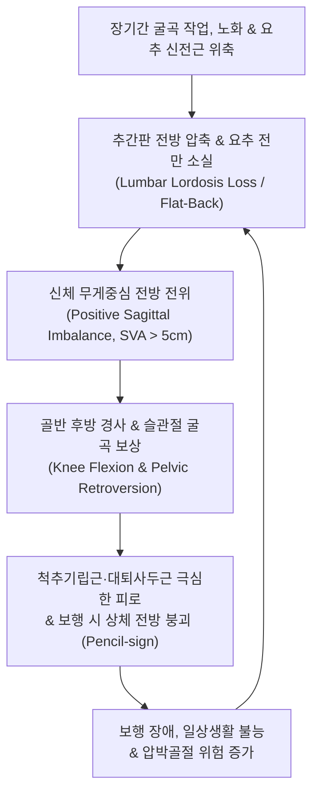

# 🩺 요추후만 증후군 (Lumbar Kyphosis Syndrome, Flat-Back Syndrome)

> **핵심 3줄 요약 (Key Summary)**:
> - 📍 **병소 부위 & 해부·병태생리**: 정상적인 요추의 전만곡(Lumbar lordosis, 40°~60°)이 소실되고 편평화 또는 후만 변형(Flat-back/Kyphosis)되어 신체의 중력 중심선(C7 plumb line)이 천골 전방으로 전위되는 퇴행성 시상면 불균형(Sagittal imbalance) 증후군이다.
> - 🚩 **전형적 임상 양상**: 기립 및 보행 시 상체가 자꾸 앞으로 쏠려 걷기가 힘들고(주저앉음), 이를 보상하기 위해 무릎과 고관절을 구부리고 걷는 '보상적 굴곡 보행', 장시간 서 있을 때 극심한 기립근·둔근 피로성 요통이 발생한다.
> - 🛠️ **핵심 검사 & 치료 전략**: 전척추 기립 측면 방사선(C7 SVA > 50mm, 골반 지수 불일치 PI-LL > 10°) 및 토마스 검사로 진단하며, 단축된 장요근·햄스트링 이완 침술, 신바로약침, 요추 전만 회복 추나 및 척추 기립근·대둔근 신전 강화 재활을 통합 적용한다.
> - ⚠️ **응급 의뢰 레드플래그**: 골다공증성 다발성 척추 압박골절로 인한 급격한 척추 붕괴 및 신경 마비, 시상면 불균형의 급속한 악화로 인한 보행 완전 불능, 하지 마비 및 배뇨 장애(마미증후군 동반).

---

## 📌 목차
1. [질환 개요 & 해부학적 병태생리](#1-질환-개요--해부학적-병태생리)
2. [병태생리 메커니즘 & 생체역학적 악순환 네트워크](#2-병태생리-메커니즘--생체역학적-악순환-네트워크)
3. [임상 증상 & 이학적 검사(Physical Exam) 알고리즘](#3-임상-증상--이학적-검사physical-exam-알고리즘)
4. [감별 진단 매트릭스 (Differential Diagnosis)](#4-감별-진단-매트릭스-differential-diagnosis)
5. [한의 통합 치료 프로토콜 (침·약침·추나·한약)](#5-한의-통합-치료-프로토콜-침약침추나한약)
6. [양방 치료 & 병용·의뢰 기준 (Conventional Treatment & Referral)](#6-양방-치료--병용의뢰-기준-conventional-treatment--referral)
7. [재활 운동 & 생활습관 티칭 가이드](#7-재활-운동--생활습관-티칭-가이드)
8. [💡 사용자 진료실 핵심 필기 & 임상 노하우 (Melt-In 잔여 심화 집약)](#8--사용자-진료실-핵심-필기--임상-노하우-melt-in-잔여-심화-집약)
9. [출처 및 학술 참고 문헌 (References)](#9-출처-및-학술-참고-문헌-references)

---

## 1. 질환 개요 & 해부학적 병태생리

**요추후만 증후군(Lumbar Kyphosis Syndrome)** 또는 **퇴행성 요추 편평등 증후군(Degenerative Flat-back Syndrome)**은 요추의 고유한 생리적 전만(Lordosis)이 소실되어 일자허리 또는 후만(Kyphosis)으로 변형되는 척추 정렬 질환이다. 인체의 척추는 경추 전만, 흉추 후만, 요추 전만의 S자 곡선을 유지함으로써 직립 보행 시 발생하는 지면 반발력과 체중 부하를 용수철처럼 분산한다.

정상 성인의 요추 전만각(Lumbar Lordosis, LL)은 약 40°~60°이며, 골반 형태를 나타내는 **골반 입사각(Pelvic Incidence, PI)**과 밀접한 비례 관계(이상적인 $LL = PI \pm 9^\circ$)를 갖는다. 그러나 평생 쪼그려 앉아 일하는 농경·가사 노동 습관, 노인성 척추 다열근 및 기립근의 광범위한 지방 침윤(Fatty degeneration), 추간판 전방부의 퇴행성 높이 감소, 다발성 골다공증성 압박골절 등이 누적되면 요추 전만이 붕괴한다.

요추 전만이 소실되면 두개골과 상체의 중심선(C7 plumb line)이 골반과 발뒤꿈치보다 앞쪽으로 이동하는 **양성 시상면 수직 축(Positive Sagittal Vertical Axis, SVA > 50mm)** 불균형이 초래된다.

![[요추후만증후군_01_영상소견_요추전만소실_측면Xray.jpg]]
> [그림 1: ① 영상 소견 — 요추 정상 전만각 소실 및 척추 시상면 불균형이 관찰되는 요추 전척추 기립 측면 X-ray]

![[거북목_흉추후만_자세성체형변형_임상사진.png]]
> [그림 2: ① 임상 소견 — 요추 후만증 환자에서 나타나는 체간의 전방 기울임 및 무릎 굴곡 보상 체형 변형 임상 사진]

---

## 2. 병태생리 메커니즘 & 생체역학적 악순환 네트워크

요추후만증의 생체역학적 진행은 **'시상면 불균형 $\rightarrow$ 하지 보상 기전 $\rightarrow$ 에너지 고갈'**의 연쇄 반응이다.

1. **상체의 전방 쏠림과 기립근의 과부하**:
   - 상체가 전방으로 기울어지면 지렛대 원리에 의해 상체를 바로 세우기 위해 후방의 척추기립근과 다열근에 수배의 신장 수축력이 요구된다. 이로 인해 만성적인 허혈성 근막통증과 근육의 섬유화·지방 변성이 급속히 진행된다.
2. **보상적 하지 관절 굴곡 (Pelvic & Lower Limb Compensation)**:
   - 전방으로 쓰러지는 신체 중심을 뒤로 끌어당기기 위해 인체는 세 가지 보상 기전을 가동한다:
     1. **골반 후방 경사(Pelvic retroversion)**: 골반을 뒤로 눕혀 골반 경사각(Pelvic Tilt, PT)을 증가시킨다.
     2. **고관절 과신전(Hip hyperextension)**.
     3. **슬관절 굴곡(Knee flexion)**: 무릎을 구부려 무게중심을 낮추고 후방으로 이동시킨다.
3. **악순환의 고착**:
   - 무릎과 고관절을 구부리고 걷게 되면서 대퇴사두근과 햄스트링에 극심한 피로가 누적되고, 보행 거리가 급감하며, 장요근 구축이 심화되어 다시 척추를 앞으로 끌어당기는 악순환이 완성된다.

![[골다공증_척추압박골절_및_척추후만_병태도해.jpg]]
> [그림 3: ① 병태생리 — 추간판 전방 압축 및 척추체 전방 쐐기형 압박골절로 인한 요추 후만 가속화 병태 도해]

---

## 3. 임상 증상 & 이학적 검사(Physical Exam) 알고리즘

### 1) 임상 증상
- **주저앉음 증상 (Difficulty standing upright)**: 아침에 일어났을 때는 비교적 똑바로 설 수 있으나, 10~20분만 서 있거나 걸으면 상체가 점점 앞으로 구부러져 손으로 허벅지를 짚거나 유모차, 보행기에 기대어야만 걸을 수 있다.
- **물건 들기 및 설거지 불능**: 싱크대나 조리대 앞에서 일할 때 한쪽 팔꿈치를 싱크대에 기대고 허리를 지탱해야 한다.
- **언덕길·계단 보행 곤란**: 평지보다 오르막길이나 계단을 오를 때 상체 전방 경사가 심해져 극심한 통증과 호흡 곤란을 호소한다.

### 2) 이학적 검사 알고리즘
1. **시상면 불균형 시진 (Plumb-line test)**: C7 극돌기에서 추를 늘어뜨렸을 때 추가 천골 후상연보다 5cm 이상 전방에 위치하는지 확인한다.
2. **신전 보상 검사**: 환자를 진료대에 엎드리게(Prone) 했을 때 흉복부가 바닥에 완전히 닿는지, 아니면 골반이 뜨고 요추 후만이 고정되어 있는지(유연성 vs 강직성 후만 감별) 평가한다.
3. **토마스 검사([[토마스 검사]], Thomas Test)**: 고관절 굴곡근 및 장요근의 구축 여부를 확인한다.
4. **트렌델렌버그 검사([[트렌델렌버그 검사]])**: 보행 시 골반 후방 경사와 외전근 약화로 인한 골반 동요를 평가한다.

![[토마스검사_2단계_한쪽무릎가슴당김_골반후방회전.jpg]]
> [그림 4: ② 이학적 검사 — 요추 후만 및 골반 후방 경사에 동반된 고관절 굴곡근/장요근 구축을 평가하는 토마스 검사 실사]

![[트렌델렌버그_2단계_양성반응_반대측골반하강_실사.jpg]]
> [그림 5: ② 이학적 검사 — 시상면 불균형에 따른 중둔근 약화 및 보행 시 골반 불안정성을 평가하는 트렌델렌버그 검사 실사]

---

## 4. 감별 진단 매트릭스 (Differential Diagnosis)

| 감별 질환 | 호발 연령 및 성별 | 주 증상 및 보행 특성 | 척추 시상면 X-ray 소견 | 신경 증상 동반 여부 |
| :--- | :--- | :--- | :--- | :--- |
| **요추후만 증후군** | 60대 이상 여성 호발 | **걸을수록 상체가 앞으로 꺾임**, 무릎 굴곡 보행 | **요추 전만 소실**, C7 SVA > 50mm, PI-LL > 10° | 드묾 (근피로성 요통 위주) |
| **[[척추관 협착증]]** | 60대 이상 남녀 | **보행 시 다리 저림·파행**, 쭈그려 앉으면 완화 | 척추관 단면적 감소, 척추 전만은 비교적 보존 | **신경인성 파행 현저** |
| **강직성 척추염** | 20~40대 젊은 남성 | 아침 기상 시 극심한 강직, 운동 시 완화 | 대나무 척추(Bamboo spine), 천장관절 융합 | HLA-B27 양성, 전신 관절염 |
| **골다공증성 압박골절** | 70대 이상 골다공증 환자 | 사소한 기침이나 낙상 후 급성 극심한 요통 | 척추체 전방 쐐기형(Wedge) 붕괴 | 국소 골성 타진통 극심 |
| **파킨슨병 자세 이상** | 고령자 | 체간 전굴증(Camptocormia), 안정시 진전 | 앙와위 시 후만 완전히 소실(근긴장 이상) | 가면 얼굴, 보행 동결, 서동증 |

![[나클라스_검사_2단계_골반고정_최대슬관절굴곡.jpg]]
> [그림 6: ② 이학적 검사 — 대퇴사두근 구축 및 상부 요추 신경근 병증을 감별하는 나클라스 검사 실사]

### ⚠️ 응급 의뢰 레드플래그
- **다발성 척추 붕괴 및 진행성 신경 마비**: 척추체 압박골절이 연쇄적으로 발생하여 척추관을 침범하고 하지 근력 저하가 발생하는 경우 경피적 척추성형술(Vertebroplasty) 또는 수술적 교정 의뢰.
- **갑작스러운 보행 장애를 동반한 대소변 장애**: 척수 원추 또는 마미 신경총 압박.

---

## 5. 한의 통합 치료 프로토콜 (침·약침·추나·한약)

### 1) 침구 치료 (Acupuncture)
- **주요 혈위**: [[명문]](GV4), [[요양관]](GV3), [[신수]](BL23), [[기해수]](BL24), [[대장수]](BL25), [[차료]](BL32), [[환도]](GB30), [[위중]](BL40), [[승산]](BL57).
- **시술 기법**:
  - **위축된 요추 다열근·기립근 강화 전침**: 척추 극돌기 양측 협척혈에 0.35×60mm 장호침을 자입하여 다열근 심부에 도달시킨 후, 저주파 전침(2Hz, 연속파)을 20분간 적용하여 근위축을 방지하고 근단백질 합성을 촉진한다.
  - **단축된 장요근 및 햄스트링 이완 자침**: 고관절 전면의 충문(SP11), 거료(GB29) 및 후면의 은문(BL37)에 자침하여 골반을 전방으로 당기는 단축성 근긴장을 해제한다.

### 2) 약침 치료 (Pharmacopuncture)
- **신바로약침 / 자하거(태반) 약침**: 척추 기립근 건 부착부 및 후관절 주위에 분절당 0.5cc씩 총 2.0~3.0cc를 자입하여 만성 허혈성 근섬유증을 억제하고 근육 세포 재생을 촉진한다.
- **녹용약침**: 퇴행성 골감소증 및 척추 기립근 무력증이 극심한 고령 환자에게 척추극간인대 및 협척혈에 심자하여 골밀도 유지와 근력 강화를 유도한다.

### 3) 추나 요법 (Chuna Manual Therapy)
- **요추 신전 유도 앙와위 추나(Supine Lumbar Extension Mobilization)**: 환자의 요추 후만 정점 하부에 둥근 폼롤러나 추나 베개를 받치고, 술자가 양 무릎을 굴곡시킨 상태에서 골반을 전방 경사 방향으로 부드럽게 가동하여 요추 전만각을 물리적으로 회복시킨다.
- **장요근 및 대퇴직근 신장 추나(Psoas Post-Isometric Relaxation)**: 복와위 또는 토마스 자세에서 단축된 장요근을 P.I.R 기법으로 신장하여 골반 후방 경사를 해제한다.

![[요골반 추나-20240926101424770.png]]
> [그림 7: ③ 한의 추나 — 요추 전만각 회복 및 골반 전방 경사 복원을 유도하는 앙와위 요골반 추나 교정 기법]

### 4) 한약 치료 (Herbal Medicine)
- **[[독활기생탕]](獨活寄生湯)**: 기혈양허(氣血兩虛)와 간신부족으로 척추가 굽어지고 다리에 힘이 빠지는 퇴행성 요추 질환의 대표 처방.
- **보중익기탕(補中益氣湯) 합 가미귀비탕**: 비위 기허로 인해 체간을 똑바로 세우지 못하는 중기하함(中氣下陷)형 요추후만증 환자의 체간 지지력을 보강한다.
- **보신건보탕(補腎健步湯)**: 숙지황, 두충, 우슬, 구척 등을 배오하여 척추 골기질과 근육을 동시에 보강한다.

---

## 6. 양방 치료 & 병용·의뢰 기준 (Conventional Treatment & Referral)

### 1) 보존적 치료 및 보조기
- **척추 신전 보조기(Extension Braces / TLSO)**: 기립 시 상체 전방 쏠림을 보조기 지지력으로 방어하여 기립근의 과도한 피로를 줄여준다.

### 2) 수술적 치료 적응증 (Surgical Indication)
- 보존적 치료에도 불구하고 SVA > 100mm, 골반 지수 불일치 PI-LL > 20° 이상으로 상체가 완전히 앞으로 꺾여 50미터 이상 보행이 불가능한 경우.
- 척추경 절골술(Pedicle Subtraction Osteotomy, PSO) 또는 3분절 절골술 및 장분절 척추 유합술(T10-Pelvis Fusion)을 통해 시상면 균형을 수술적으로 재건한다(고난도 척추 기형 수술).

---

## 7. 재활 운동 & 생활습관 티칭 가이드

### 1) 복와위 요추 신전 운동 (Prone Cobra / Bird-Dog)
- 엎드린 상태에서 배에 힘을 주고 상체와 가슴을 바닥에서 5~10cm 들어 올려 견갑골을 모으고 요추 기립근을 등척성으로 수축한다(10초 유지, 10회 반복).

### 2) 장요근 및 햄스트링 런지 스트레칭 (Lunge Stretch)
- 한쪽 다리를 앞으로 내밀고 반대쪽 고관절을 뒤로 신전시켜 단축된 고관절 굴곡근을 충분히 늘려 골반의 전방 회전을 돕는다.

### 3) ⚠️ 생활습관 교정
- 쪼그려 앉아 일하는 밭일, 바닥에 허리를 구부리고 걸레질하는 가사 노동을 전면 중단하고 의자 생활과 입식 식탁 사용으로 즉시 전환해야 한다.

![[요골반 추나-20240926095045472.png]]
> [그림 8: ④ 재활 추나/운동 — 요추 기립근 및 둔근 강화를 유도하여 척추 시상면 균형을 재건하는 도수 재활 기법]

---

## 8. 💡 사용자 진료실 핵심 필기 & 임상 노하우 (Melt-In 잔여 심화 집약)

- **'유모차를 밀면 날아갈 것 같다'는 할머니의 호소 분석**:
  - 환자가 "평소에는 5분도 못 걷는데 시장 유모차나 카트를 잡고 밀면 1시간도 걸을 수 있다"고 하면 이는 척추관 협착증의 신경인성 파행 증상이기도 하지만, 본질적으로는 상체의 무게중심(C7 plumb line)을 카트에 지지하여 **기립근의 에너지 소모를 대신 떠맡아주기 때문**이다.
  - 즉, 이 환자는 신경 감압뿐만 아니라 요추 전만 회복과 기립근 피로 완화 치료(다열근 침·녹용약침)를 반드시 병행해야 지팡이나 유모차 없이 자립 보행이 가능해진다.
- **앙와위 롤러 베개 기법의 즉각적 효과**:
  - 진료실 치료대에 환자를 바로 눕히고 요추 3-4번 부위 아래에 직경 10~15cm의 단단한 원통형 추나 베개를 받쳐놓은 채 15분간 협척혈 전침 치료를 시행하면, 체중에 의해 굳어있던 요추 전방 종인대와 추간판 전방부가 자연스럽게 신장되면서 시상면 교정 효과가 극대화된다.
- **장요근 침 치료를 빼놓지 마라**:
  - 요추 후만증 환자는 요추 기립근만 치료해서는 절대 펴지지 않는다.
  - 전방에서 골반을 강력하게 굴곡 구축시키고 있는 장요근TrP(서혜인대 하방 및 하복부 ASIS 내측 깊은 곳)를 찾아 소염 약침을 주입하고 스트레칭을 병행해야 골반이 중립으로 돌아오며 허리가 펴진다.

---

## 9. 출처 및 학술 참고 문헌 (References)

1. Ekenros L, et al. (2025). Load-dependent increase in lumbar kyphosis is associated with posterior pelvic tilt during deadlift. *Eur Spine J*, 34(12):3210-3220. [PMID 41195113](https://pubmed.ncbi.nlm.nih.gov/41195113/)

2. Cho W, et al. (2025). Two-stage spinal osteotomy combined with lateral lumbar interbody fusion for lumbar kyphosis: illustrative case. *J Neurosurg Case Lessons*, 9(1):CASE24512. [PMID 39715546](https://pubmed.ncbi.nlm.nih.gov/39715546/)

3. Zhao Y, et al. (2025). A novel pre-contoured V-shaped rod in one-level pedicle subtraction osteotomy for the treatment of rigid lumbar kyphosis caused by ankylosing spondylitis: technical note and case series. *Neurosurg Rev*, 48(1):305. [PMID 40615813](https://pubmed.ncbi.nlm.nih.gov/40615813/)

---

## 관련 노트

- [[디스크성 요통]]
- [[요추 추간판 탈출증]]
- [[요추 관절돌기간 관절 증후군]]
- [[척추관 협착증]]
- [[토마스 검사]]
- [[트렌델렌버그 검사]]
