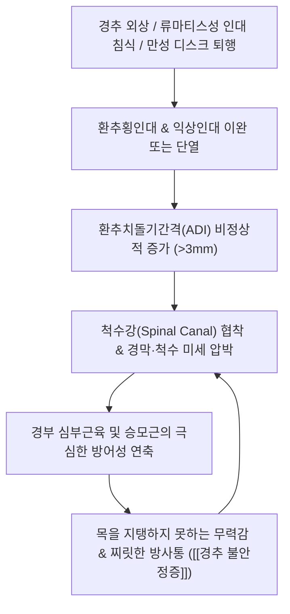

# 🩺 [[경추 불안정증]] (Cervical Instability / 頸椎不安定症, M53.22 / ICD-10)

> 📐 **이 템플릿은 근골격계·신경·통증 계열 질환 전용입니다.**

> 🖼️ **이미지 규격(정본)**: 질환 노트 7장 (①환부/손상기전도해 ②영상 소견 ③해부 도해 환축추인대 ④이학적 검사 시연 ⑤한의 술기 경추추나 ⑥초음파 유도 시술 ⑦재활 운동).

> **핵심 3줄 요약 (Key Summary)**:
> - 📍 병소 부위 & 해부·병태생리: 상위 경추(C1-C2 환축추 관절) 및 중하위 경추 분절, 환추횡인대(Transverse ligament)·익상인대(Alar ligament) 파열 또는 퇴행성 인대 이완으로 인한 생리적 가동 범위를 벗어난 비정상적 과가동성(Hypermobility).
> - 🚩 전형적 임상 양상 & 3대 징후: 머리를 손으로 받치지 않으면 지탱하기 힘든 무력감(Need to support head with hands), 고개를 숙일 때 목에 걸리는 통증 및 이물감, 사지로 찌릿하게 뻗치는 척수 압박 징후([[레르미트 징후]]).
> - 🛠️ 핵심 감별 검사 & 한·양방 다각적 치료 전략: 샤프-퍼서 검사(Sharp-Purser Test), 익상인대 스트레스 검사, 개구부(Open-mouth) 및 굴곡-신전 동적 방사선 검사(ADI > 3mm), 경추 경혈 호침 및 등척성 경추 심부 안정화.
> - ⚠️ 응급 의뢰 레드플래그 & 악화 요인: 척수병증(Myelopathy) 징후(보행 실조, 대소변 장애, 바빈스키 양성), 류마티스 관절염 및 다운증후군 환자. **급격한 회전 및 신전 도수치료(HVLA)는 척수 압박 및 뇌간 손상을 유발하므로 절대 금기**.

---

## 📌 목차
1. [질환 개요 & 해부학적 병태생리](#1-질환-개요--해부학적-병태생리)
2. [병태생리 메커니즘 & 생체역학적 악순환 네트워크](#2-병태생리-메커니즘--생체역학적-악순환-네트워크)
3. [임상 증상 & 이학적 검사(Physical Exam) 알고리즘](#3-임상-증상--이학적-검사physical-exam-알고리즘)
4. [감별 진단 매트릭스 (Differential Diagnosis)](#4-감별-진단-매트릭스-differential-diagnosis)
5. [한의 통합 치료 프로토콜 (침·약침·추나·한약)](#5-한의-통합-치료-프로토콜-침약침추나한약)
6. [양방 치료 & 병용·의뢰 기준 (Conventional Treatment & Referral)](#6-양방-치료--병용의뢰-기준-conventional-treatment--referral)
7. [재활 운동 & 생활습관 티칭 가이드](#7-재활-운동--생활습관-티칭-가이드)
8. [💡 사용자 진료실 핵심 필기 & 임상 노하우 (Melt-In 잔여 심화 집약)](#8--사용자-진료실-핵심-필기--임상-노하우-melt-in-잔여-심화-집약)
9. [출처 및 학술 참고 문헌 (References)](#9-출처-및-학술-참고-문헌-references)

---

## 1. 질환 개요 & 해부학적 병태생리

![[편타손상_경추_과신전_과굴곡_기전도해.png|450]]
> [그림 1: ① 손상 기전 및 환부 도해 — 교통사고 편타 손상(Whiplash) 시 경추의 급격한 과신전-과굴곡으로 인한 인대 파열 및 불안정성 발생 기전 — Simbio Vault Archive]

![[경추_추간공_해부도_Gray95.png|450]]
> [그림 2: ② 해부학적 구조물 — 경추 척추골 분절 및 추간공, 신경근 주행 해부 — Gray's Anatomy (Public Domain)]

* **질환 정의 및 분류**:
  * **[[경추 불안정증]]**(Cervical Instability)은 경추의 수동적 지지 인대와 후관절이 손상되거나 이완되어, 정상적인 자세 유지나 일상적 움직임 시에도 척추 분절이 과도하게 흔들리거나 어긋나는 병리적 상태입니다.
  * 크게 두 가지로 분류됩니다:
    1. **상위 경추 불안정증(Upper Cervical Instability / Craniocervical Instability)**: C0-C1(후두골-환추) 또는 C1-C2(환축추) 분절의 인대 손상으로 발생하며, 뇌간 및 척수 연수 이행부를 직접 압박할 수 있어 가장 치명적입니다(Mintken PE, et al. 2008).
    2. **하위 경추 불안정증(Subaxial Cervical Instability)**: C3-C7 분절에서 추간판 변성이나 외상으로 인해 분절간 전위(Spondylolisthesis)가 발생하는 형태입니다.
* **관련 해부학적 구조물**:
  * **환추횡인대 (Transverse ligament of atlas)**: 제1경추(환추)의 내측 결절을 가로질러 제2경추(축추)의 치돌기(Dens/Odontoid process)를 전방 활주하지 못하도록 단단히 고정하는 가장 강력한 인대입니다.
  * **익상인대 (Alar ligaments)**: 치돌기 첨부에서 후두과(Occipital condyle)로 주행하며, 두경부의 과도한 회전과 측굴을 제한합니다.
  * **척수 및 추골동맥**: 불안정성으로 인해 환추가 전방 전위되면 척수강이 좁아져 척수(Spinal cord)를 직접 압박하거나, 횡돌기공을 지나는 [[추골동맥]](Vertebral artery)을 견인하여 뇌간 허혈을 초래합니다.

---

## 2. 병태생리 메커니즘 & 생체역학적 악순환 네트워크

![[경추불안정증_02_해부도해_환축추인대구조_Gray307.png|450]]
> [그림 3: ③ 관련 해부학적 구조물 — 상경추 안정성의 핵심인 환추횡인대, 덮개막(Membrana tectoria), 익상인대 해부 도해 — Gray's Anatomy Fig 307 (Public Domain)]

### 1) 환추치돌기간격(ADI) 확장과 척수 압박 기전
* 정상 성인의 경우 전방 굴곡 시에도 환추 전궁 후면과 치돌기 전면 사이의 간격(Atlantodental Interval, ADI)은 **3mm 이하**로 유지됩니다(소아는 4~5mm 이하).
* 환추횡인대가 파열되거나 류마티스 관절염의 판누스(Pannus)에 의해 미식되면(Bayer E, et al. 2021), 굴곡 시 환추가 앞으로 미끄러지면서 치돌기가 척수강 후방을 침범하여 ADI가 3mm를 초과하게 됩니다.
* 이로 인해 척수가 압박받으면 보행 시 다리가 뻣뻣해지고 균형을 잡지 못하는 척수증(Cervical myelopathy)이 발현됩니다.

### 2) 결합조직 질환 및 전신성 인대 이완
* 교통사고로 인한 편타손상 외에도, 전신 결합조직 질환(엘러스-단로스 증후군, 마르판 증후군)이나 다운증후군 환자는 선천적인 인대 결손으로 경추 불안정증 위험이 매우 높습니다.

---

## 3. 임상 증상 & 이학적 검사(Physical Exam) 알고리즘

### 1) 특징적 주소증 및 신경학적 징후
* **두부 지지 징후 (Head Supporting Sign)**:
  * 목에 힘이 들어가지 않아 머리의 무게(약 5kg)를 감당하기 힘들고, 앉아 있을 때 턱을 손으로 괴거나 양손으로 머리를 잡고 있어야 편안함을 느낍니다.
* **이물감 및 연하곤란 (Globus Sensation)**:
  * 상위 경추가 전방 전위되면서 인두 후벽을 압박하여 목에 무언가 걸려 있는 듯한 이물감이나 침 삼키기 곤란을 호소합니다.
* **신경학적 전격통 (Electric Shock-like Sensation)**:
  * 고개를 앞으로 숙일 때 척수를 따라 등과 팔다리로 전기가 흐르는 듯한 찌릿한 충격이 방사됩니다([[레르미트 징후]]).

### 2) 필수 이학적 검사법 (Physical Examination)

![[레르미트징후_2단계_경추최대굴곡_척수전격통_실사.png|420]]
> [그림 4: ④ 이학적 검사 시연 — 경추 굴곡 시 척수 압박 여부를 확인하는 레르미트 검사(Lhermitte's sign) 실사 — Simbio Vault Archive]

* **샤프-퍼서 검사 (Sharp-Purser Test)**:
  * **방법**: 환자를 좌위에 앉히고 목을 약간 굴곡시킵니다. 검사자는 한 손의 엄지손가락으로 제2경추(축추) 극돌기를 후방에서 단단히 고정하고, 다른 손바닥을 환자의 이마에 대고 머리를 뒤쪽으로 부드럽게 밀어줍니다.
  * **양성 판정**: 전방 전위되어 있던 환추가 뒤로 정복되면서 "덜컹(Clunk)" 하는 느낌과 함께 환자의 신경 압박 증상이 즉시 완화되면 양성입니다(Mintken PE, et al. 2008). 상위 경추 불안정증의 대표적 선별 검사입니다.
* **익상인대 스트레스 검사 (Alar Ligament Test)**:
  * 검사자가 C2 극돌기를 파지한 상태에서 환자의 머리를 수동으로 측굴시킵니다. 정상이라면 머리를 기울이는 즉시 C2 극돌기가 반대쪽으로 회전해야 합니다. 회전 지연이 있거나 움직임이 없으면 익상인대 손상을 의미합니다.
* **경추 척수병증 선별 검사**:
  * 호프만 징후(Hoffmann's reflex), 바빈스키 징후(Babinski sign), 족간대(Clonus) 검사를 시행하여 상위 운동신경원 병변 여부를 확인합니다.

---

## 4. 감별 진단 매트릭스 (Differential Diagnosis)

| 감별 질환 | 호발 병소 및 원인 | 주소증 차이점 | 특이적 검사 소견 |
| :--- | :--- | :--- | :--- |
| **[[경추 불안정증]] (본 질환)** | C1-C2 인대 이완, 분절 과가동성 | 두부 지지 필요, 굴곡 시 덜컹거림, 찌릿함 | 샤프-퍼서 검사 양성, 굴곡-신전 X-ray상 전위 |
| **[[경추 추간판 탈출증]] (경추 디스크)** | 추간판 섬유륜 파열, 신경근 압박 | 기침/신전 시 악화, 팔·손가락 저림 | 스펄링 검사(Spurling's test) 양성, 건반사 저하 |
| **[[경추 척수증]] (Cervical Myelopathy)** | 척추관 협착에 의한 척수 실질 압박 | 젓가락질/단추 잠그기 장애, 보행 비틀거림 | 호프만 반사 양성, 족간대 양성, 건반사 항진 |
| **[[경추성 두통]] (Cervicogenic Headache)** | C1-C3 후관절염, 대후두신경 포착 | 목 뒤에서 시작하여 한쪽 관자놀이로 방사 | C1-C3 관절 압통, 목 운동 범위 제한 |
| **[[편타손상 증후군]] (WAD)** | 교통사고 가속-감속 외상 | 경추 전반의 근육통, 두통, 피로감 | 초기 인대 염좌 소견, 신경학적 결손 없음 |
| **경부 염좌 (Cervical Sprain)** | 단순 근육 및 인대 미세 손상 | 국소 근육 압통, 스트레칭 시 통증 | 방사선 검사상 정렬 정상, 불안정성 징후 음성 |

---

## 5. 한의 통합 치료 프로토콜 (침·약침·추나·한약)

![[경추 추나-20240920064200222.png|400]]
> [그림 5: ⑤ 한의 술기 실사 — 경추 불안정 분절에 대한 비침습적 등척성 안정화 추나 수기 실사 — Simbio Vault Archive]

![[PNP_Fig_Occipital_Injection.png|400]]
> [그림 6: ⑥ 초음파 유도 시술 실사 — 초음파 유도하 상경추 후관절 및 인대 부착부 정밀 약침 주입 도해 — Simbio Vault Archive]

* **침구 치료 (Acupuncture)**:
  * ⚠️ **경추 심부 직자 주의**: 상위 경추 불안정증 환자는 인대가 이완되어 연수 및 척수 손상 위험이 있으므로, 풍지·천주혈 자침 시 안전한 깊이(15~20mm 이내)와 외측 각도를 엄수합니다.
  * **원위 취혈 및 경근 자극**: [[후계]](SI3), [[신맥]](BL62)을 배합하여 독맥과 방광경의 기운을 소통시키고, 승모근 및 견갑거근의 방어적 근경련을 해소합니다.
* **약침 치료 (Pharmacopuncture)**:
  * **[[자하거약침]](Hominis Placenta) / 녹용약침**: 이완된 극간인대, 항인대 부착부에 프롤로테라피 원리로 미세 주입하여 인대 결합조직의 재생과 강화를 유도합니다.
  * **신바로약침**: 경추 후관절의 만성 무균성 염증을 억제하여 관절성 통증을 완화합니다.
* **추나 요법 (Chuna Manipulation)**:
  * ⛔ **절대 금기: 고속저진폭 회전 스러스트(HVLA)**: 목을 비틀며 뚝 소리를 내는 회전 교정 기법은 불완전한 인대를 완전히 파열시켜 사지 마비나 뇌간 허혈을 초래할 수 있으므로 **절대 엄금**합니다.
  * **등척성 안정화 추나(Post-Isometric Relaxation)**: 환자가 미세한 힘으로 저항하게 하고 검사자는 버텨주는 방식으로 경추 심부 굴곡근과 신전근의 능동적 장력을 회복시킵니다.
  * **흉추 교정 추나**: 굳어 있는 상부 흉추(T1-T4)의 가동성을 확보하여 경추 분절에 집중되는 과부하를 분산시킵니다.
* **한약 치료 (Herbal Medicine)**:
  * **보간신 강근골(補肝腎 强筋骨)**: [[독활기생탕]](獨活寄生湯), [[삼기음]](三痺飲), [[녹용보골탕]](鹿茸補骨湯)을 투여하여 약화된 인대와 연골 조직의 결합력을 증진합니다.
  * **어혈 및 신경 흥분 완화**: 외상 직후에는 [[당귀수산]](當歸鬚散)에 속단, 두충, 구척을 가미하여 손상 조직 치유를 촉진합니다.

---

## 6. 양방 치료 & 병용·의뢰 기준 (Conventional Treatment & Referral)

* **보존적 치료 및 경추 칼라(Cervical Collar)**:
  * 급성 불안정기나 심한 통증기에는 필라델피아 보조기(Philadelphia collar) 또는 미네르바 보조기를 착용하여 경추의 이상 움직임을 강제로 제한합니다(단, 2주 이상 지속 시 근위축을 초래하므로 단계적 탈착 필요).
* **수술적 치료 적응증 (Surgical Indication)**:
  * **후두-경추 유합술 (Occipitocervical Fusion / C1-C2 Fusion — Harms Technique)**:
    * ADI가 5~6mm 이상으로 심각하게 전위된 경우.
    * 척수 압박으로 인한 진행성 척수증(보행 실조, 대소변 장애, 상지 근위축)이 확인될 때.
    * 외상성 골절(치돌기 골절 Type II)로 인한 구조적 파탄이 있을 때 나사못 고정 유합술을 시행합니다.
* **한의 병용 판단 (Combination Therapy)**:
  * 경증의 인대 이완성 불안정증은 한의 침·약침 치료 및 심부 코어 안정화 운동을 병용하여 수술 없이 호전되는 경우가 많습니다.
  * 그러나 척수병증 징후가 확인된 환자는 한의 단독 치료를 고집하지 않고 즉시 척추신경외과와 협진합니다.
* **양방·전문과 의뢰 기준 (Referral Criteria)**:
  * **즉시 대학병원 척추신경외과 응급 의뢰**:
    * 손의 정밀 동작(단추 잠그기, 젓가락질)이 불가능해지거나 보행 시 술 취한 듯 비틀거리는 척수병증 증상 발생 시.
    * 경추 외상 후 극심한 연하곤란, 뇌신경 마비 증상이 동반될 때.

---

## 7. 재활 운동 & 생활습관 티칭 가이드

![[경추견인검사_1단계_후두하파지_포지셔닝.jpg|400]]
> [그림 7: ⑦ 재활 운동 실사 — 경추 심부 안정화 및 중립 지지 재활 실사 — Simbio Vault Archive]

* **경추 등척성 안정화 운동 (Cervical Isometric Stabilization)**:
  * 목을 전혀 움직이지 않고 손바닥으로 이마, 뒤통수, 좌우 관자놀이를 누르며 목 근육은 이에 저항하여 버티는 등척성 운동(10초 유지, 10회 반복). 척추 분절에 전단력을 주지 않고 능동적 안정성을 확보합니다.
* **심부 경추 굴곡근 재교육 (Deep Neck Flexor Training)**:
  * 앙와위에서 혈압계 커프를 목 뒤에 대고 20mmHg에서 22, 24, 26, 28, 30mmHg까지 천천히 턱을 당겨 커프를 누르는 훈련(Craniocervical Flexion Test 프로토콜)을 시행합니다.
* **생활습관 티칭 (Ergonomics)**:
  * 엎드려서 책이나 스마트폰을 보는 자세, 턱을 앞으로 빼는 자세는 인대를 더욱 늘어나게 하므로 엄금합니다.
  * 롤러코스터, 범퍼카 등 충격이 가해지는 놀이기구 탑승을 금지합니다.

---

## 8. 💡 사용자 진료실 핵심 필기 & 임상 노하우 (Melt-In 잔여 심화 집약)

> 🛡️ **Melt-In 원칙**: 기존 스텁의 빈 뼈대를 상부 섹션에 완전 수용하고, 본 섹션에는 원장님의 실전 진료실 노하우를 집약합니다.

* **실전 문진 & 진찰 체크리스트**:
  * 1. **"앉아 있을 때 목을 지탱하기 힘들어 손으로 턱이나 머리를 괴고 계시나요?"** $\rightarrow$ 인대 지지력 상실의 가장 대표적인 시각적 단서.
  * 2. **"고개를 앞으로 푹 숙일 때 등이나 다리로 찌릿한 전기가 통하나요?"** $\rightarrow$ 척수 압박(레르미트 징후) 확인.
  * 3. **"단추를 잠그거나 젓가락질을 할 때 손이 둔해진 느낌이 있나요?"** $\rightarrow$ 척수병증(Myelopathy) 조기 감별.
* **치료 순서 및 손맛 노하우**:
  * **절대 목을 비트는 추나를 하지 말 것**: 경추 불안정증 환자가 "목을 꺾어주면 시원하다"고 요구하더라도 절대로 회전 추나(HVLA)를 시행해서는 안 됩니다. 이미 헐거워진 인대가 추가 파열되어 의료사고로 직결될 수 있습니다.
  * **상부 흉추와 견갑골 먼저 치료**: 경추를 직접 건드리지 말고, T1-T4 흉추의 신전 가동성을 회복시키고 능형근과 견갑거근의 긴장을 풀어주면 경추로 전달되는 기계적 부하가 50% 이상 즉시 감소합니다.
* **환자 티칭 스크립트**:
  * "환자분의 목은 인대가 헐거워진 상태입니다. 목을 우두둑 꺾으면 시원하게 느껴지지만, 실제로는 고무줄을 더 늘려놓는 위험한 행동입니다. 이제부터는 목을 꺾지 마시고, 턱을 살짝 당겨 목의 기둥 근육을 굳건히 세우는 등척성 운동을 하셔야 목이 안전해집니다."

---

## 9. 출처 및 학술 참고 문헌 (References)

1. **대한정형외과학회**. (2020). *정형외과학 제8판*. 최신의학사.
2. **Mintken PE, et al**. (2008). Upper cervical ligament testing in a patient with os odontoideum presenting with headaches. *J Orthop Sports Phys Ther*, 38(8):465-475. [PMID 18678962](https://pubmed.ncbi.nlm.nih.gov/18678962/)
   - **[연구 요약]**: 상위 경추 불안정증(치돌기 이상 및 인대 이완) 환자에서 상위 경추 인대 검사(Sharp-Purser, 익상인대 검사)의 임상적 적용 및 도수치료 위험성을 보고한 핵심 연구.
3. **Bayer E, et al**. (2021). Atlantoaxial instability in a patient with neck pain and rheumatoid arthritis. *J Spinal Cord Med*, 44(6):978-982. [PMID 30874488](https://pubmed.ncbi.nlm.nih.gov/30874488/)
   - **[연구 요약]**: 류마티스 관절염 및 경부 통증 환자에서 발생하는 환축추 불안정증(AAI)의 조기 진단 기준과 척수 압박 위험성을 분석.
4. **Lyons C, et al**. (2018). Atlantoaxial Instability in a Patient with Neck Pain and Ankylosing Spondylitis. *Mil Med*, 183(9-10):e654-e657. [PMID 29590445](https://pubmed.ncbi.nlm.nih.gov/29590445/)
   - **[연구 요약]**: 염증성 척추 질환에서 나타나는 환축추 불안정증의 임상적 징후 및 경추 신경학적 합병증 선별 프로토콜을 제시.

---

## 관련 노트

- [[경추성 어지럼증]]
- [[경추 추간판 탈출증]]
- [[경추 척수증]]
- [[편타손상 증후군]]
- [[후두하근군]]
- [[레르미트 징후]]
- [[추골동맥]]
- [[자하거약침]]
- [[독활기생탕]]
- [[후계]]
- [[신맥]]
