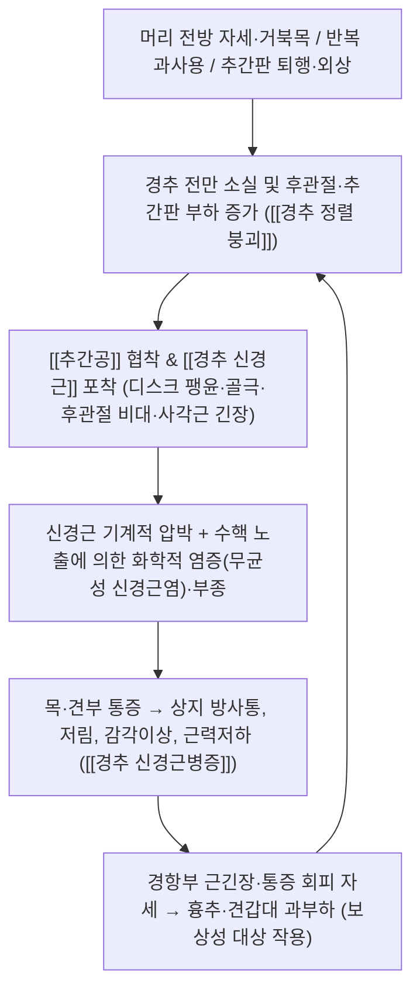

# 🩺 [[경추 신경근병증]] (Cervical Radiculopathy / 頸椎 神經根病症, ICD-10 M54.1 / KCD M54.1)

> **핵심 3줄 요약 (Key Summary)**:
> - 📍 병소 부위 & 해부·병태생리: 경추 추간판(주로 C5–C6, C6–C7 분절)의 퇴행·팽윤·탈출, [[후관절]] 및 [[Luschka 관절]](uncinate joint)의 골극성 비대가 [[추간공]](neural foramen)을 좁혀 [[경추 신경근]](cervical nerve root)을 기계적으로 압박하고, 노출된 수핵 성분이 유발하는 화학적 신경근염(무균성 염증)이 병태의 양대 축을 이룬다.
> - 🚩 전형적 임상 양상 & 3대 징후: ① 목·견부 통증에서 시작해 상지로 뻗치는 **방사통**, ② 피부분절(dermatome)을 따라가는 **저림·감각이상**, ③ 근육분절(myotome)에 대응하는 **근력저하·심부건반사 감소**(예: C6 — 이두근/완요골근 반사 감소, C7 — 삼두근 반사 감소). 머리 신전·회전 시 통증이 증가하는 자세성 악화가 특징적이다.
> - 🛠️ 핵심 감별 검사 & 한·양방 다각적 치료 전략: [[Spurling 검사]](경추 압박·회전 유발검사), [[신경근 견인검사]](상지 거상 완화 징후 / Bakody sign), [[ULNT]](상지신경긴장검사), 감각·근력·반사·근위축의 신경학적 4대 평가. 한방에서는 경항부 [[협척혈]]·[[풍지]](GB20)·[[견정]](GB21)·[[후계]](SI3)·[[외관]](TE5) 중심 침·전침, 경항부 및 견갑대 [[약침]] 시술, 경추 신연·흉추 교정 [[추나]], 급성기 [[활혈거어제]](갈근탕/신통축어탕 계열)와 만성기 [[보익제]](독활기생탕/팔진탕 계열)를 병기한다.
> - ⚠️ 응급 의뢰 레드플래그 & 악화 요인: 진행성 사지 근력저하, 보행실조, 대소변 기능장애, [[Hoffmann 징후]]·Babinski 양성 등 **척수병증(myelopathy) 시사 소견**, 외상 후 골절·인대 불안정, 발열·야간통·암 병력(감염/종양), 그리고 회전성 수기 전 현훈·복시·구음장애(척추기저동맥 허혈 의심)는 절대 금기·즉시 의뢰 대상이다.

---

## 📌 목차
1. [질환 개요 & 해부학적 병태생리](#1-질환-개요--해부학적-병태생리)
2. [병태생리 메커니즘 & 생체역학적 악순환 네트워크](#2-병태생리-메커니즘--생체역학적-악순환-네트워크)
3. [임상 증상 & 이학적 검사(Physical Exam) 알고리즘](#3-임상-증상--이학적-검사physical-exam-알고리즘)
4. [감별 진단 매트릭스 (Differential Diagnosis)](#4-감별-진단-매트릭스-differential-diagnosis)
5. [한의 통합 치료 프로토콜 (침·약침·추나·한약)](#5-한의-통합-치료-프로토콜-침약침추나한약)
6. [재활 운동 & 생활습관 티칭 가이드](#6-재활-운동--생활습관-티칭-가이드)
7. [💡 사용자 진료실 핵심 필기 & 임상 노하우 (Melt-In 잔여 심화 집약)](#7--사용자-진료실-핵심-필기--임상-노하우-melt-in-잔여-심화-집약)
8. [출처 및 학술 참고 문헌 (References)](#8-출처-및-학술-참고-문헌-references)

---

## 1. 질환 개요 & 해부학적 병태생리
![[경추 신경근병증_1.jpg|540]]

> [그림 1: ① 병태생리·영상 — 경추 신경근병증_1]

* **질환 정의 및 분류**:
  * **정의**: 경추 신경근이 추간공 및 그 주변부에서 압박·자극되어, 해당 신경근이 지배하는 **피부분절(감각)·근육분절(운동)·심부건반사** 영역에 통증, 저림, 감각이상, 근력저하가 나타나는 질환이다.
  * **용어 구분 (중요)**: [[신경근성 통증]](radicular pain)은 "통증"이 주 증상인 상태, [[신경근병증]](radiculopathy)은 여기에 **신경학적 결손**(감각 저하, 근력 약화, 반사 소실)이 동반된 상태로 구분한다. 임상에서는 두 양상이 혼재하는 경우가 많아 "경추 신경근통/신경근병증(cervical radicular pain / radiculopathy)"이라는 표현이 함께 쓰인다(Peene & Cohen, 2023에서도 병태·진단·치료를 'cervical radicular pain'이라는 상위 개념으로 개괄한다).
  * **호발 부위**: 추간판 병변은 통상 **C5–C6, C6–C7** 분절에서 흔하며, 이에 따라 **C7 신경근 침범이 가장 흔하고 그다음이 C6**로 기술된다(교과서적 기술). 즉 C6–C7 디스크 병변 → C7 신경근, C5–C6 디스크 병변 → C6 신경근 침범 패턴이 전형적이다.
  * **역학·호발군**: 정확한 발생률·유병률·성별비에 대한 수치는 본 노트에서 인용한 문헌 범위에서 **확인하지 못함(근거 미확인)**. 다만 중년 이후 퇴행성 변화가 시작되는 연령대와, 장시간 앉아서 모니터·스마트폰을 보는 **머리 전방 자세(거북목)** 직업군에서 증상 호소가 잦다는 것이 임상적 관찰이다.
  * **경과**: 다수의 경추 신경근병증은 보존적 치료로 수주~수개월 내 호전되는 경과를 보이는 것으로 기술되나, 개별 예후 인자와 정확한 회복률 수치는 **근거 미확인**이며, 신경학적 결손의 진행 여부가 치료 방향 결정의 핵심이다.

* **관련 해부학적 구조물**:
  * **골격 및 관절**: [[경추]](C1–C7), [[추간판]](annulus fibrosus + nucleus pulposus), [[후관절]](facet joint, zygapophyseal joint), [[Luschka 관절]](uncovertebral joint, C3–C7에 존재). 후관절 비대와 Luschka 관절 골극은 추간공을 **전·후방에서 동시에 좁히는** 대표적 구조물이다. 추간공은 전방으로 추간판·Luschka 관절, 후방으로 후관절이 경계를 이루므로 이 두 구조의 퇴행이 곧 신경근 포착의 직접 원인이 된다.
  * **근육 및 근막**: [[사각근]](전·중사각근 — 상완신경총 및 쇄골하동맥 통과), [[흉쇄유돌근]], [[상부 승모근]], [[견갑거근]], [[경장근]]·[[두장근]](심부 경부 굴곡근) 및 [[다열근]]. 임상적으로 **상부 승모근·견갑거근·사각근의 과긴장/단축**과 **심부 경부 굴곡근의 약화**가 동반되는 불균형이 흔하다.
  * **신경 및 혈관**: [[경추 신경근]](C5–T1), [[후근신경절]](DRG), [[상완신경총]], [[척추동맥]](추간공 외측을 주행하며 경추 회전 시 손상 위험 — 회전 수기 금기 판단의 핵심).

---

## 2. 병태생리 메커니즘 & 생체역학적 악순환 네트워크

![[경추 신경근병증_3_1.jpg|540]]
> [그림 2: ② 관련 해부 구조물 — Cervical vertebrae lateral.png]

### 1) 해부학적 포착 및 압박 기전
* **추간공성( foraminal ) 압박**: 추간판 후외측 팽윤·탈출, Luschka 관절 골극(전방), 후관절 비대(후방)가 조합되어 추간공 단면적을 감소시킨다. 신경근은 추간공 내에서 **후근신경절(DRG)** 부위가 가장 취약하다.
* **화학적 염증 기전**: 단순한 물리적 압박만으로는 통증 강도를 설명하기 어렵고, **수핵 성분의 노출에 따른 염증성 매개물질(TNF-α, IL-1β, PGE2 등) 분비**가 신경근의 과흥분(핵심 감작)을 유발한다는 기전이 정설로 받아들여진다. 개별 사이토카인의 정량적 수치 및 인체 내 농도는 본 노트 인용 문헌에서 **확인하지 못함(근거 미확인)**.
* **동적 포착**: [[사각근]](특히 중사각근) 긴장과 늑골–쇄골 간격 협소는 [[상완신경총]] 하부 신경근(C8–T1) 자극을 유발할 수 있어, [[흉곽출구증후군]]과의 감별이 필요하다.

### 2) 생체역학적 연쇄 반응 (Kinetic Chain)
* 경추 전만이 소실되면 머리 무게의 지지점이 전방으로 이동해 **후관절 및 추간판 후방부 부하가 증가**한다.
* 통증 회피를 위해 상부 승모근이 지속적으로 머리를 당기게 되면 **견갑 안정화 근육(하부 승모근·전거근)의 억제**가 동반되고, 이는 흉추 과후만과 견갑 전방 경사를 악화시켜 다시 경추 부하를 키우는 **자기강화 악순환**을 만든다.
* 흉추 가동성 저하 → 경추 과가동성 보상 → 후관절 자극이라는 상·하위 분절 연쇄 패턴도 치료 포인트(흉추 교정 추나, 흉추 신전 운동)로 중요하다.

---

## 3. 임상 증상 & 이학적 검사(Physical Exam) 알고리즘

### 1) 주소증 및 신경학적 증상
* **감각 이상 (Dermatome)**: 해당 신경근 피부분절에 따른 저림, 이상감각, 통각 저하 또는 과민. 환자는 "목에서 어깨를 지나 팔·손까지 전기가 흐르거나 벌레가 기어가는 느낌"으로 표현하는 경우가 많다.
* **운동 장애 (Myotome)**: 근력 약화, 미세운동 저하(단추 잠그기, 젓가락질), 오래되면 근위축. 삼두근·이두근 반사 저하 및 소실.
* **자세성 양상**: 머리를 병변 측으로 신전·회전할 때 통증 악화, **환측 팔을 머리 위로 올려 머리에 얹으면 통증이 완화**되는 자세(견인 완화 기전).

**[피부분절·근육분절 대응표 — 교과서적 기술]**

| 신경근 | 감각(피부분절) | 운동(근육분절) | 심부건반사 |
| :--- | :--- | :--- | :--- |
| C5 | 어깨·상완 외측 | 삼각근, 이두근 | 이두근 반사 |
| **C6** | 전완 요측, **엄지** | 이두근, 완요골근, 수근 신근 | **완요골근(상완요골근) 반사** |
| **C7** | **중지** | 삼두근, 수근 굴근 | **삼두근 반사** |
| C8 | 전완 척측, 약지·소지 | 수지 굴근, 수내근 | (반사 변화 적음) |
| T1 | 상완 내측 | 수내근, 골간근 | — |

> 감각 분포는 개인차·겹침이 흔하므로 반드시 **감각 + 근력 + 반사 + 유발검사**를 조합해 판단한다.

### 2) 필수 이학적 검사법 (Physical Examination)
* **[[Spurling 검사]] (경추 압박–회전 유발검사)**: 머리를 병변 측으로 측굴·신전한 상태에서 수직 압력을 가해 추간공을 좁혀 방사통을 재현한다. **특이도가 비교적 높아** 신경근성 통증 확인에 핵심적으로 쓰인다. 단, 민감도·특이도의 정확한 수치는 **근거 미확인**이며, 급성기 강한 압박은 증상 악화를 유발할 수 있어 강도 조절이 필요하다.
* **[[신경근 견인검사]] / 상지 거상 완화 징후 (Bakody sign)**: 환측 손을 머리 위로 올려 머리에 얹었을 때 상지 방사통이 감소하면 신경근 압박을 시사한다. 어깨 관절 질환(회전근개)에서는 오히려 통증이 증가하므로 감별에 유용하다.
* **[[ULNT]](상지신경긴장검사, Upper Limb Neurodynamic Test)**: 견갑하강 → 견관절 외전 → 전완 회외 → 수근 신전 → 경추 반대측 측굴의 순서로 신경계 긴장을 누적시켜 증상 재현 여부를 본다. 신경근 병변뿐 아니라 말초신경 포착에서도 양성반응이 나올 수 있어 **가양성/가음성 감별**이 필수다.
* **[[척수병증 감별 검사]](중추 적신호 선별)**: [[Hoffmann 징후]], Babinski 징후, 심부건반사 항진, 보행 이상, 대소변 기능 변화를 반드시 확인한다. 이 중 하나라도 양성이면 경추 신경근병증이 아니라 **[[경추 척수병증]]** 가능성을 우선 고려하고 정밀영상(MRI)·전문의 의뢰로 전환한다.
* **[[Adson 검사]] / [[Allen 검사]]**: 흉곽출구증후군 감별. 요골동맥 맥박 소실 및 증상 재현 여부를 확인한다.
* **보조 평가**: 경추 능동·수동 ROM, 후관절 압박검사, 견갑대 및 흉추 가동성 평가, 악력계(grip dynamometry)를 통한 좌우 차이 비교.

---

## 4. 감별 진단 매트릭스 (Differential Diagnosis)

| 감별 질환 | 호발 병소 및 원인 | 주소증 차이점 | 특이적 이학적 검사 소견 |
| :--- | :--- | :--- | :--- |
| [[경추 신경근병증]] (본 질환) | 추간공 내 신경근 압박(디스크·골극·후관절 비대), 사각근 긴장 | 피부분절을 따르는 방사통 + 감각·근력·반사의 **분절성 결손** | [[Spurling 검사]] 양성, [[신경근 견인검사]] 완화, ULNT 양성 |
| [[경추 척수병증]] (Myelopathy) | 척수 자체 압박(중심성 디스크, 후종인대 골화, 척추관 협착) | 양손 미세운동 저하, 보행 장애, 하지 강직, 대소변 장애 | [[Hoffmann 징후]]·Babinski 양성, 반사 항진, Lhermitte 징후 |
| [[흉곽출구증후군]] | 사각근·늑쇄간격·소흉근에 의한 신경혈관 압박 | 상지 전체의 무거움·부종·냉감, 자세 의존성 | [[Adson 검사]]·[[Allen 검사]] 양성, 사각근·소흉근 긴장 |
| [[수근관증후군]] | 완와부 정중신경 압박 | **손목 이하** 수지(엄지~약지 요측) 저림, 야간 악화 | Tinel·Phalen 검사 양성, 경추 유발검사 음성 |
| [[주관 증후군]] / 척골신경 포착 | 주관·구와부 척골신경 압박 | 약지·소지 저림, 수내근 위축 | Froment 징후, 주관 Tinel 양성, 경추 분절과 불일치 |
| [[회전근개 질환]]·[[어깨 충돌증후군]] | 견관절 자체 병변 | 어깨 국소 통증, 특정 각도(외전 60~120도) 통증 | Neer·Hawkins 검사 양성, 견봉하 주사 반응, 경추 검사 음성 |
| [[근막통증후군]] / 중부 승모근·견갑거근 TP | 근막 트리거포인트 | 압통점 자극 시 국소연축 + 연관통(방사통과 구분 필요) | TP 압박 시 재현, 신경학적 결손 없음, Spurling 음성 |

---

## 5. 한의 통합 치료 프로토콜 (침·약침·추나·한약)

![[경추 신경근병증_4.jpg|540]]
> [그림 3: ③ 치료·시술점 — (A) Graphical illustration of the artificial <b>cervical</b> disc (M6-C artificial <b>cervical</b> disc, Spinal Kinetics]

> 원칙: **신경학적 결손의 진행성 악화 · 레드플래그 소견이 없음이 확인된 후** 보존적 통합 치료를 진행한다. 급성기에는 염증·근긴장 완화, 아급성기 이후에는 관절 가동성 회복과 심부 안정화 근 강화로 축을 옮긴다.

* **침구 치료 (Acupuncture)**:
  * **국소(경항·견갑대)**: [[풍지]](GB20), [[천주]](BL10), [[견정]](GB21), [[견정]] 주위 아시혈, [[대추]](GV14), [[견중수]](SI15), 경항부 [[협척혈]](C4–C7 협척).
  * **원위(신경근별 배혈)**: [[후계]](SI3)·[[외관]](TE5)·[[중저]](TE3) — 경항·상지 방사통의 대표 원위 배혈. 척골측(약지·소지) 증상에는 [[중저]](TE3)와 [[양릉천]](GB34) 계열을 가미하기도 한다.
  * **변증 가미**: 풍한습비(風寒濕痺) → [[합곡]](LI4)·[[곡지]](LI11)·[[족삼리]](ST36), 기혈허(氣血虛) → [[족삼리]](ST36)·[[삼음교]](SP6), 어혈(瘀血) → [[혈해]](SP10)·[[태충]](LR3).
  * **전침(Electroacupuncture)**: 협척혈–견정, 후계–외관 배합에 2~10 Hz 저주파 또는 2/100 Hz 교대 자극을 20분 전후 적용. 통증 완화와 근긴장 이완을 목표로 하며, 강도는 환자가 견딜 수 있는 **가벼운 회복성 자극**으로 유지한다.
  * 약침·전침의 구체적 유효율 수치는 본 노트 인용 문헌 범위에서 **확인하지 못함(근거 미확인)**.

* **약침 치료 (Pharmacopuncture)**:
  * **경항부 시술점**: 경추 협척혈 주변 심부 다열근·경장근 층, 상부 승모근·견갑거근·사각근 단축부 및 압통점(TP), 건륭(肩上) 및 견갑 상각 내측연.
  * **상지 시술점**: 견우(SI15)·견료(TE14) 주변, 상완 외측–전완 피부분절상 방사통 경로를 따라 분절별로 배치.
  * **선택 약침**: 근육 긴장·염증 완화 목적의 [[자하거 약침]]·[[신바로 약침]] 계열, 봉독 계열([[봉약침]])은 과민반응·아나필락시스 병력 확인 후 신중 적용. 자침 깊이와 각도는 경추 심부 구조(척추동맥·척수) 회피를 위해 **직경 방향·깊이를 반드시 제한**한다.
  * 약침의 시술 용량·농도·주기 표준 프로토콜의 정량 기준은 **근거 미확인**이며, 환자별 반응에 따라 조정한다.

* **추나 치료 (Chuna Manipulation)**:
  * **경추 신연 추나(견인 요법)**: 앙와위 또는 좌위에서 경항부 굴곡–신연 상태를 유지하여 추간공 및 후관절 압력을 감소시킨다.
  * **후관절 가동(Mobilization)**: 분절별 미세 움직임을 이용한 저속·저진폭 가동으로 관절낭 유연성 회복.
  * **흉추 교정**: 흉추 신전 가동성 회복(흉추 신전 추나) → 경추 보상성 과가동 감소.
  * **근막 이완(JS 기법 등)**: 상부 승모근·견갑거근·사각근의 근막 이완 후 관절 가동을 적용한다.
  * **금기 수기**: 급성 외상성 골절·인대 파열, 경추 불안정(류마티스 관절염, 다운증후군 등), 척수병증 의심, 척추기저동맥 허혈 의심(현훈·복시·구음장애·실조), 항응고제 복용 중 강한 심부 자극 — **회전성 고속 교정(high-velocity rotation)은 회피**한다.

* **한약 치료 (Herbal Medicine)**:
  * **급성기(어혈·염증 우세, 통증 심함)**: [[갈근탕]](葛根湯)·[[계지가갈근탕]](桂枝加葛根湯)으로 경항부 긴장 완화, [[신통축어탕]](身痛逐瘀湯)·[[복원활혈탕]](復元活血湯) 등 [[활혈거어제]]로 어혈·염증 제거.
  * **아급성·만성기(기혈허·풍한습)**: [[독활기생탕]](獨活寄生湯)으로 신경·근골 영양, [[팔진탕]](八珍湯)·[[십전대보탕]] 등 [[보익제]]로 기혈 보충, [[황기계지오물탕]](黃耆桂枝五物湯)으로 말초 순환 개선.
  * **변증 포인트**: 한습(寒濕) — 거습온경(祛濕溫經), 기체(氣滯) — 소간이기(疏肝理氣), 어혈 — 활혈화어(活血化瘀).
  * 처방 선택별 임상 결과 수치·비교 연구는 본 노트 인용 문헌 범위에서 **확인하지 못함(근거 미확인)**.

* **양방 치료와의 역할 분담(참고)**:
  * **보존적 치료**: 약물(NSAIDs, 신경병성 통증 조절제), 물리치료, 경막외 스테로이드 주사 등 중재적 치료, 신경근 차단 등이 시행된다(Peene & Cohen, 2023에서 치료 전략 전반을 개괄).
  * **수술적 치료**: 보존적 치료에 반응하지 않는 난치성 통증, 진행성 신경학적 결손, 척수 압박 동반 시 고려된다. 경추통에서 수술의 적응증과 근거 수준, 보존적 치료와의 비교는 여전히 논쟁적이라는 점이 Redaelli & Stephan (2024)의 검토 주제이다.
  * **협진 기준**: 레드플래그 소견 또는 6~8주 이상 보존적 치료에도 의미 있는 호전이 없는 진행성 근력저하 시 즉시 영상검사 및 전문의 협진.

---

## 6. 재활 운동 & 생활습관 티칭 가이드

* **이완 및 스트레칭 (Stretching)**
  * [[상부 승모근]] 스트레칭: 앉은 자세에서 머리를 반대측으로 측굴, 손으로 가벼운 보조를 준 뒤 20~30초 유지 × 3세트.
  * [[견갑거근]] 스트레칭: 머리를 병변 반대측 회전 + 하방 주시, 견갑을 하방 고정.
  * [[사각근]] 이완: 흡기 시 늑골 상방 확장 → 호기 시 어깨 이완을 유도하는 호흡–이완 조합(강한 압박 금지).
  * [[흉근]]·[[광배근]] 이완: 견갑 전방 경사와 흉추 후만을 줄여 경추 부하를 간접 감소.

* **강화 및 안정화 운동 (Strengthening)**
  * **심부 경부 굴곡근 강화(Cranio-cervical flexion)**: 턱을 살짝 당겨 후두하부를 펴는 미세 굴곡 운동 — 천천히 10초 유지 × 10회, 경추 심부 안정화의 핵심.
  * **견갑 안정화**: 하부 승모근(Y·T 자세), 전거근(벽 밀기 플러스), 능형근 강화로 견갑대 위치 교정.
  * 주의: 초기부터 강한 등척성 저항·무거운 중량은 통증을 유발할 수 있어 **무통 범위 내 저강도**로 시작한다.

* **신경 활주 운동 (Neurodynamics)**
  * **정중신경 활주(median nerve slider)**: 팔꿈치·손목·고개 움직임을 교대로 하여 신경 자체의 긴장은 유지하지 않고 **미끄러짐(sliding)만** 유도한다.
  * **척골신경 활주**: C8–T1 증상, 주관–경추 감별 시 활용.
  * 원칙: 통증이 증가하지 않는 범위에서 하루 여러 회 짧게. 신경을 끝까지 당겨 유지하는 **tensioner 기법은 급성기에 회피**.

* **일상생활 자세 티칭 (Ergonomics)**
  * **모니터**: 눈높이와 화면 상단을 맞추고, 화면 거리 50~70 cm, 키보드는 팔꿈치 90도·어깨 이완 상태.
  * **스마트폰**: 가능한 눈높이까지 올려 사용(고개 숙임 최소화), 장시간 사용 시 20~30분마다 목·어깨 이완.
  * **수면**: 너무 높거나 낮은 베개를 피하고, 바로 누운 자세에서 경추 전만을 유지하는 높이(대략 어깨 폭 고려)로 조절. 엎드려 자는 자세는 경추 회전을 유발하므로 회피 권장.
  * **운반·작업**: 무거운 물건을 몸에서 멀리 들지 않기, 머리 위 작업 시 발판 사용.

---

## 7. 💡 사용자 진료실 핵심 필기 & 임상 노하우 (Melt-In 잔여 심화 집약)

> [!IMPORTANT]
> 상부 1~6번 섹션에는 질환의 정의, 해부·병태생리, 증상, 이학적 검사, 치료 프로토콜, 재활 티칭 등 기본 원문을 모두 융합(Melt-In)하였다. 본 섹션에는 상부에 다 담기지 않은 **진료실 실전 고유 노하우와 감별 직관**만을 집약한다.

* **상부 섹션에 미처 다 담지 못한 고유 원문 필기**:
  * "목이 아프다"는 환자 중 상당수는 **경추 자체보다 견갑거근·상부 승모근·흉추 강직**이 주 원인이다. 따라서 경항부만 보지 않고 **견갑대–흉추–호흡 패턴**을 한 세트로 평가하는 습관이 필요하다.
  * 상지 저림 환자에서 **증상의 분절 위치**를 손끝 단위로 확인하면 신경근 레벨 추정 정확도가 크게 올라간다(엄지=요측 C6, 중지=C7, 약지·소지=척측 C8/T1).
  * 어깨 자체 병변과 겹치는 경우가 많아, **경추 유발검사와 견관절 검사(Neer·Hawkins)** 를 반드시 함께 시행한다.

* **진료실 실전 감별 & 치료 노하우**:

  * **1. 실전 문진 체크리스트 (내원 즉시 확인 순서)**
    1. 통증의 시작 양상 — 급성 외상/무거운 물건을 든 후 발생 vs 서서히 시작(퇴행성).
    2. 방사통의 **정확한 도달 부위**(팔꿈치까지? 손끝까지? 어느 손가락?).
    3. **머리 움직임·기침·재채기** 시 악화 여부(추간공 압력 변화 시사).
    4. **팔을 머리 위로 올리면 편해지는지**(Bakody 양성 → 신경근 압박 쪽).
    5. 양손 미세운동(단추·젓가락), 보행 불편, 대소변 변화 — **척수병증 선별 필수 질문**.
    6. 야간통·체중감소·발열·암 병력 — 감염/종양 레드플래그.
    7. 직업·자세 이력(모니터 높이, 하루 스마트폰 시간).
    8. 치료 반응 이력(약물·주사·물리치료 경험과 반응).

  * **2. 치료 순서 및 손맛 노하우**
    * **자침 순서**: 원위 취혈([[후계]]·[[외관]])을 먼저 자침하고, 이후 경항부 협척혈·견정으로 넘어간다. 원위 자침 후 **경추 능동 ROM을 재평가**하면 즉각적 가동성 개선 여부를 확인할 수 있다.
    * **약침 각도·깊이**: 경항부 심부는 반드시 **골성 표지(극돌기)를 촉지한 뒤 외측으로 이동**하여 자침하고, 직경 방향·깊이를 제한한다. 사각근 시술 시에는 **쇄골 상연과 흉쇄유돌근 후연이 만나는 지점의 얕은 층**부터 접근하여 심부 혈관·신경총 손상을 회피한다.
    * **추나 적용 체위**: 급성기에는 좌위 회전 교정보다 **앙와위 경추 굴곡–신연**이 안전하고 반응이 좋다. 흉추 교정을 먼저 하고 경추를 나중에 다루면 경항부 근긴장이 상대적으로 줄어 수기 반응이 향상된다.
    * **전침 세팅**: 통증 우세 시 2 Hz 중심, 근긴장·경직 우세 시 2/100 Hz 교대. 자극은 "시원하게 저리는" 정도에서 멈추고 통증 유발 강도는 피한다.
    * **치료 간격**: 급성기 주 2~3회, 호전 후 주 1회로 이행하며, **자가 운동 수행 여부**를 매 방문 확인해 운동 없이는 치료 효과 유지가 어렵다는 점을 환자에게 명확히 전달한다.

  * **3. 환자 티칭 스크립트 (재발 방지 설명 멘트)**
    * "목 디스크에서 나온 신경이 팔로 내려가면서 저림이 생긴 상태입니다. 신경은 눌리는 것보다 **주변 염증과 근육 긴장**에 더 민감하므로, 염증을 줄이는 치료와 함께 목·어깨 근육을 편하게 쓰는 습관이 같이 가야 합니다."
    * "고개를 숙이는 자세는 목뼈에 머리 무게의 몇 배 부담을 줍니다. 모니터는 **눈높이**에, 스마트폰은 **눈높이까지 올려서** 보시고, 20~30분마다 한 번씩 목을 뒤로 살짝 젖히고 어깨를 내려주세요."
    * "엎드려 자거나 베개가 너무 높으면 밤새 목이 회전된 상태가 됩니다. 바로 누웠을 때 **목이 살짝 앞으로 볼록한 곡선**이 유지되는 베개 높이가 좋습니다."
    * "힘들게 버티는 것보다 **아프지 않은 범위에서 조금씩 자주** 하는 것이 회복에 유리합니다. 저림이 팔·손으로 점점 더 내려오거나, 힘이 빠지거나, 걷기가 어려워지면 즉시 다시 오세요."
    * "치료로 통증이 줄어도 신경과 근육이 회복되는 데는 시간이 걸립니다. 좋아졌다고 갑자기 무리한 운동이나 장시간 고개 숙임 작업을 하면 재발이 흔합니다."

---

## 8. 출처 및 학술 참고 문헌 (References)

1. **대한정형외과학회 / 척추신경외과학회 교과서**.
   - 본 노트의 피부분절·근육분절 대응, 추간공 해부, 호발 분절(C5–C6, C6–C7 및 C7 > C6 침범 경향) 등은 해당 교과서적 기술에 근거한다.

2. **Peene L, Cohen SP (2023)**. *Cervical radicular pain*. **Pain Pract**. PMID: 37272250
   - **[연구 요약]**: 경추 신경근성 통증(radicular pain)의 정의·병태생리·진단적 접근 및 치료 전략 전반을 개괄한 종합 리뷰. 보존적 치료, 중재적 치료(주사 요법 등), 수술적 치료 옵션을 함께 다루며, 신경근 압박과 염증 기전의 상호작용 및 임상적 의사결정의 개요를 제공한다. (세부 수치·프로토콜의 정확한 내용은 원문 확인 필요)

3. **Redaelli A, Stephan SR (2024)**. *Is neck pain treatable with surgery?* **Eur Spine J**. PMID: 38191741
   - **[연구 요약]**: 경추통(및 연관된 신경근병증)에 대한 **수술적 치료의 적응증과 근거**를 검토한 논문. 보존적 치료와의 비교, 수술 적응 결정에서 신경학적 결손·난치성 통증의 중요성을 논의하며, 경추통에서 수술 치료의 역할이 여전히 논쟁적임을 시사한다. (개별 결과 지표·합병증률 수치는 원문 확인 필요)

---

> [!NOTE]
> **근거 표기 원칙**: 본 노트에서 "근거 미확인"으로 표시한 항목은 인용 문헌(PMID 37272250, 38191741) 및 교과서적 기술 범위에서 정량적 근거를 확인하지 못한 내용이다. 진료 적용 시 최신 원문 및 임상 지침을 재확인할 것.

<!-- 보관 태그(1회용·링크오류, 필요시 복원): Spurling -->
