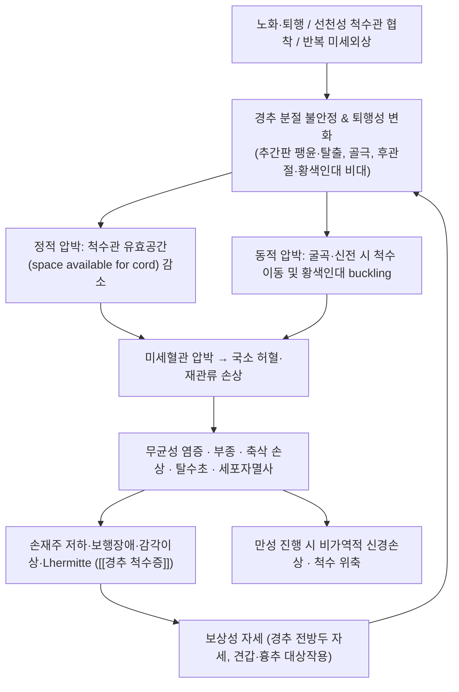

# 🩺 [[경추 척수증]] (Cervical Spondylotic Myelopathy / 頸椎脊髓症, ICD-10 M47.12 / KCD M47.1)

> **핵심 3줄 요약 (Key Summary)**:
> - 📍 **병소 부위 & 해부·병태생리**: 경추(C4–C7이 최다 호발)의 퇴행성 변화 — 추간판 팽윤·탈출, 후관절 비대, 황색인대 비후·주름(buckling), [[후종인대 골화]] 등이 **척수관 실질 유효공간(space available for the cord)을 감소**시켜 [[척수]]를 직접 압박한다. 여기에 **동적 압박(굴곡·신전 시 척수 이동·재배열)** 과 국소 허혈·만성 염증이 겹쳐 축삭 손상·탈수초가 진행된다 (PMID: 31974455, PMID: 33781560).
> - 🚩 **전형적 임상 양상 & 3대 징후**: ① **손재주 상실**(단추 잠그기, 젓가락질, 글씨 악화), ② **경직성 보행장애**(다리 뻣뻣함, 계단 불안, 균형 저하), ③ **[[Lhermitte 징후]]**(경추 굴곡 시 척추를 타고 내려가는 전기충격감) 및 양측성 상지 저림·감각이상. 진행 시 대소변 장애·낙상 반복 (PMID: 38285428, PMID: 36208893).
> - 🛠️ **핵심 감별 검사 & 한·양방 다각적 치료 전략**: [[Hoffmann 징후]], [[Lhermitte 징후]], Babinski, [[10초 손 개폐 검사]], Romberg, 보행 관찰 + **경추 MRI(T2 강조영상에서 척수내 고신호)** 가 진단 축. **중등도 이상/진행성은 수술적 감압이 근간**이며, 한의 치료는 **경증·비진행성의 증상 조절 및 수술 후 재활 보조**로 한정하는 것이 안전하다 (PMID: 31974455, PMID: 36208893, PMID: 38285428).
> - ⚠️ 응급 의뢰 레드플래그 & 악화 요인: 진행성 사지 근력저하·보행 악화, **대소변 기능 장애(마미·척수 압박 응급)**, 급성 외상 후 신경증상, 종양·감염 의심(발열·야간통·체중감소), Lhermitte 악화. **경추 고속 저진폭 교정 추나(HVLA) 및 강한 경추 신연·회전 수기는 절대 금기** — 척수 손상·추간판 탈출 악화 위험.

---

## 📌 목차
1. [질환 개요 & 해부학적 병태생리](#1-질환-개요--해부학적-병태생리)
2. [병태생리 메커니즘 & 생체역학적 악순환 네트워크](#2-병태생리-메커니즘--생체역학적-악순환-네트워크)
3. [임상 증상 & 이학적 검사(Physical Exam) 알고리즘](#3-임상-증상--이학적-검사physical-exam-알고리즘)
4. [감별 진단 매트릭스 (Differential Diagnosis)](#4-감별-진단-매트릭스-differential-diagnosis)
5. [한의 통합 치료 프로토콜 (침·약침·추나·한약)](#5-한의-통합-치료-프로토콜-침약침추나한약)
6. [재활 운동 & 생활습관 티칭 가이드](#6-재활-운동--생활습관-티칭-가이드)
7. [💡 사용자 진료실 핵심 필기 & 임상 노하우 (Melt-In 잔여 심화 집약)](#7--사용자-진료실-핵심-필기--임상-노하우-melt-in-잔여-심화-집약)
8. [출처 및 학술 참고 문헌 (References)](#8-출처-및-학술-참고-문헌-references)

---

## 1. 질환 개요 & 해부학적 병태생리

![[경추 척수증_척수압박_Netter.jpg|540]]
> [그림 1: 경추 추간판 탈출·골극·황색인대 비후에 의한 척수 압박 (Netter, Musculoskeletal: Spine, Plate 1-14)]

![[경추 척수증_도해.jpg|540]]
> [그림 2: 경추 MRI 시상면. 퇴행성 변화로 척수관이 좁아지고 척수가 압박된 소견]

![[경추 척수증_경추해부_Netter.jpg|540]]
> [그림 3: 경추 해부(환추·축추 및 경추 정렬) (Netter, Musculoskeletal: Spine, Plate 1-8)]

### 1) 질환 정의 및 분류

* **정의**: 경추의 **퇴행성 변화**(추간판 변성, 골극 형성, 후관절·구상돌기(uncovertebral joint) 비대, 황색인대 비후)로 인해 척수관이 좁아지고 **척수 자체가 압박·기능장애**를 받는 질환군. 최근 문헌은 원인 병리를 포괄하여 **DCM(Degenerative Cervical Myelopathy, 퇴행성 경추 척수증)** 이라는 용어를 표준으로 사용하며, 전통적 용어 **CSM**은 이 중 척추증성(spondylotic) 원인을 지칭한다 (PMID: 31974455, PMID: 37004568).
* **포함 범주 (DCM의 스펙트럼)**:
  * 척추증성 척수증 (CSM) — 가장 흔함
  * 추간판 탈출에 의한 척수 압박
  * [[후종인대 골화]](OPLL, Ossification of Posterior Longitudinal Ligament) — 한국·일본·동아시아에서 상대적으로 흔함
  * 황색인대 비후·골화, 후관절 비대
  * 선천성 척수관 협착(congenital stenosis)에 퇴행성 변화가 가세한 형태
* **역학적 특성**: 성인에서 **척수 기능부전의 가장 흔한 원인**으로 기술되며, 중년 이후(대개 50대 이후) 연령 의존적으로 유병률이 증가한다 (PMID: 31974455). 노화에 따른 퇴행성 변화가 기본 축이므로 고령화 사회에서 유병 부담이 지속 증가하는 추세다 (PMID: 37004568).
  * *성별·직업군별 발생률의 구체적 수치는 본 논문 세트에서 **근거 미확인**.*
* **자연경과**: 다수가 **서서히 진행성(stepwise or gradual deterioration)** 이며, 비가역적 신경손상이 누적될 수 있어 조기 발견·적절한 시점의 감압 여부가 예후를 좌우한다 (PMID: 31974455, PMID: 34689848).

### 2) 관련 해부학적 구조물

* **골격 및 관절**:
  * [[경추골]]: C4–C5, C5–C6, C6–C7 분절이 퇴행성 변화의 최다 호발부 (운동성이 가장 큰 분절).
  * 후관절(facet joint), 구상돌기 관절(uncovertebral joint, Luschka) — 골극 형성 시 **추간공(foramen) 및 척수관 전외측**을 동시에 침범할 수 있다.
  * 척수관 정렬: 선천적으로 척수관이 좁은 경우(developmental stenosis) 소수의 퇴행성 변화만으로도 증상이 발현된다.
* **인대 및 연부조직**:
  * [[후종인대]](PLL), [[황색인대]](ligamentum flavum): 신전 시 황색인대가 **척수관 내로 주름져(buckling) 동적 압박**을 유발하는 핵심 구조.
  * 경항부 심부 신전근(경추 다열근, 반극근), 견갑거근·상부 승모근·판상근 등 — 만성 경항통과 자세성 부하에 관여.
    * 상부 승모근·견갑거근의 단축/과긴장, 심부 경추 굴곡근(전방 심부근)의 약화라는 **근육 불균형 패턴**은 임상에서 흔히 동반되지만, 이 불균형이 척수증 자체를 유발한다는 인과관계는 **근거 미확인**(척수증의 일차 원인은 구조적 압박).
* **신경 및 혈관**:
  * [[척수]](spinal cord) — 특히 **경수 팽대부(C5–T1 분절)** 로 상지·손 기능 및 하행 피질척수로가 통과.
  * [[신경근]](nerve root) — 척수증과 **신경근병증이 동시에 존재**하는 경우가 흔함(혼합형).
  * 전척수동맥(anterior spinal artery) 및 척수 관류 — 압박에 의한 **국소 허혈**이 병태생리의 한 축.
  * 척추동맥(vertebral artery) — 경추 상부 회전·신연 수기 시 손상 위험과 연결되는 해부학적 취약 구조(수기 금기 판단의 근거).

---

## 2. 병태생리 메커니즘 & 생체역학적 악순환 네트워크

### 1) 해부학적 포착 및 압박 기전

* **정적(static) 압박**: 골극, 비후된 황색인대, 팽윤/탈출된 추간판, 비대된 후관절이 척수관 단면적을 감소시킨다. 척수는 **전방(추간판·골극)과 후방(황색인대)에서 양방향으로 압박**되는 경우가 많다.
* **동적(dynamic) 압박**: 경추 **신전 시 황색인대가 척수관 내로 주름지고**, 굴곡 시 척수가 전방으로 이동하며 골극에 대해 눌린다. 따라서 증상이 **특정 자세(특히 신전·후굴)에서 악화**되는 양상은 척수증을 시사하는 중요한 실마리다 (PMID: 33781560, PMID: 38285428).
* **혈관성 허혈 기전**: 압박에 의한 미세혈관 관류 저하 → 회백질(특히 전각) 및 피질척수로의 허혈성 손상. 이 허혈-재관류 과정이 **염증성 사이토카인, 흥분독성, 산화 스트레스**를 유발하여 압박이 제거되어도 잔존 신경학적 결손을 남길 수 있다 (PMID: 31974455).
* **탈수초 및 축삭 손상**: 만성 압박은 후주(감각: 진동·고유수용감각) 및 측삭(운동: 피질척수로) 손상을 초래하여 **고유감각 저하에 따른 균형장애**와 **경직성 하지 마비**를 만든다.
* **MRI T2 고신호**: 척수 실질 내 T2 강조영상 고신호 병변은 만성 압박에 의한 척수 부종·척수연화(myelomalacia)를 반영하며, **예후 및 수술 판단에 참고되는 영상 지표**로 다루어진다 (PMID: 37004568, PMID: 38285428).
  * *T2 고신호 병변과 수술 후 회복 정도의 정량적 상관(민감도·특이도 수치)은 본 논문 세트에서 **근거 미확인**.*

### 2) 생체역학적 연쇄 반응 (Kinetic Chain)

* **전방두 자세(forward head posture)**: 두부 중심이 전방 이동하면 경추 하부 및 경흉추 이행부(C7–T1) 부하가 증가하고, 경추 심부 굴곡근이 지속적으로 신장·약화되며 상부 승모근·견갑거근·흉추 신전근이 과활성화된다.
* **흉추 후만 증가**: 흉추 후만이 커지면 **경추 보상성 전만(과전만 또는 후만 전환)** 이 발생하고, 이때 황색인대 주름과 신전 시 척수 압박이 심화될 수 있다.
* **견갑 안정화 실패**: 견갑 전인·하방 회전(rounded shoulder) 패턴은 상지 신경근 주행의 긴장을 증가시켜 방사통성 증상을 악화시킬 수 있다.
* **악순환의 임상적 함의**: 자세·근육 불균형은 **척수증의 원인이라기보다 악화·통증 증폭 인자**로 접근하는 것이 안전하며, 한의 치료는 이 축(근긴장·경항통·자세)을 다루는 보조적 역할에 강점이 있다. (척수증 자체의 진행을 한의 치료로 차단한다는 근거는 **근거 미확인**.)

---

## 3. 임상 증상 & 이학적 검사(Physical Exam) 알고리즘

### 1) 주소증 및 신경학적 증상

* **축성 증상(axial)**: 경항통, 후두부 통증, 견갑간부 통증, 목 뻣뻣함, 신전·후굴 시 증상 악화.
* **상지 증상 (가장 먼저, 가장 흔함)**:
  * **미세운동 장애(손재주 상실)**: 단추 잠그기, 젓가락질, 바늘에 실 꿰기, 글씨체 변화, 물건을 자주 떨어뜨림.
  * **양측성 손 저림·감각이상**: 피부분절(dermatome) 분포가 **양측성·비전형적**으로 나타나는 것이 신경근병증과의 감별 포인트.
  * **상지 근력저하 및 근위축**: 삼각근, 상완이두근, 상완삼두근, 손 내재근.
  * **통증성 감각 이상**: 화끈거림, 얼얼함, 뻣뻣함.
* **하지 증상**:
  * **경직성 보행(spastic gait)**: 다리가 뻣뻣하고 끌리는 느낌, 발이 지면에 붙은 느낌, 계단 오르내리기 불안.
  * **고유감각 저하에 따른 균형장애**, 야간 보행 시 불안정, 반복적 낙상.
* **[[Lhermitte 징후]]**: 목을 **앞으로 굽힐 때** 등·하지를 따라 전기충격 같은 감각이 내려가는 증상. 척수 후주 및 경수 압박 병변에서 관찰되는 전형적 증상으로, 본 질환의 대표적 척수 징후 중 하나다 (PMID: 38285428, PMID: 33781560).
* **뇌신경·전신**: 대개 정상. 뇌신경 침범이 있으면 척수증보다 **뇌간/두개 병변(예: 다발경화증, 뇌졸중)** 을 더 강하게 고려.
* **자율신경·배뇨·배변 장애**: **말기 또는 심한 압박에서 나타나는 중증 신호**. 요의 절박감, 잔뇨, 변실금, 성기능 장애 → **즉시 응급 의뢰**. (말초신경병증이나 단순 경항통에서는 나타나지 않는다.)
* **동반 신경근병증**: 방사통(팔을 따라 뻗치는 통증), Spurling 양성 등 **척수증 + 신경근병증 혼합** 양상이 흔하다.

### 2) 필수 이학적 검사법 (Physical Examination)

| 검사 | 방법 | 양성 소견 | 임상적 가치 |
| :--- | :--- | :--- | :--- |
| [[Hoffmann 징후]] | 검사자가 환자의 중지 원위지절을 잡고 손톱을 탁 튕김 | 엄지·검지의 **불수의적 굴곡 반사** | 상운동신경원(UMN) 병변 시사. 척수증 선별에 널리 사용되나 **민감도가 높지 않아 음성이라도 배제 불가** (PMID: 38285428) |
| [[Babinski 징후]] / 발목 클로누스 | 발바닥 외측면 자극 / 발목 배굴 유지 | 엄지 배굴, 나머지 발가락 부채꼴 / 반복적 발목 진동 | 피질척수로 손상(경직성 마비) 확인 |
| [[Lhermitte 징후]] | 목 굴곡 유발 | 척추를 따라 내려가는 전기감 | 경수 척수 병변의 특징적 소견 |
| [[10초 손 개폐 검사]] (grip & release test) | 10초 동안 최대 속도로 주먹 쥐고 펴기 | 정상 20회 내외 대비 **현저한 감소**, 좌우 차이 | 손 기능 저하의 정량적 관찰. 좌우 비대칭이 유의 |
| Romberg 검사 / 보행 관찰 | 눈 감고 기립 유지 / 보통걸음·일직선 보행 | 체간 동요, 넓은 보폭, 발 끌기, 경직성 보행 | 고유감각 및 UMN 병변 평가 |
| [[Spurling 검사]] | 경추 신전+동측 회전+수직 압박 | 동측 방사통 재현 | **신경근병증** 지향. 척수증 자체보다 동반 신경근 압박 평가용 (급성 중증도에서는 신중) |
| 심부건 반사 | 이두근·삼두근·상완요골근·슬개건·아킬레스건 | **항진**, 좌우 차이, 역전 상완요골 반사(inverted radial reflex) | 척수 압박 수준 추정. 역전 반사는 C5–C6 척수 병변 시사 |
| 경추 능동 관절가동범위 | 굴곡·신전·회전 | **신전(후굴) 시 증상 악화** | 동적 압박을 시사하는 소견 |

* **중증도 평가 도구**: **[[mJOA 점수]](modified Japanese Orthopaedic Association score)** 가 임상·연구에서 가장 널리 사용되는 중증도 지표로, 상지·하지 운동기능, 감각, 배뇨기능을 합산한다. 문헌 다수가 경증/중등도/중증 분류 및 수술 적응 판단에 mJOA를 활용한다 (PMID: 31974455, PMID: 34689848).
  * *mJOA의 정확한 절단값(예: 경증 15–17, 중등도 12–14, 중증 ≤11)은 교과서·문헌별로 통용되나, 본 논문 세트에서 세부 수치를 직접 확인하지 못했으므로 **근거 미확인**으로 표시하고 진료 시 원문 대조 권장.*
* **기타 평가**: Nurick 등급(보행 기능 중심), 등·하지 통증 VAS/NRS, 상지 기능 설문(예: QuickDASH), 보행속도 및 균형검사.
  * *Nurick 세부 등급 기준: 본 세트 **근거 미확인**.*

> ⚠️ **이학적 검사 운용 원칙**: Hoffmann·Lhermitte·Romberg 등은 **단독 음성으로 척수증을 배제할 수 없고**, 반대로 양성이라도 반드시 영상(MRI)으로 확인해야 한다. **보행 관찰은 진료실에서 가장 저렴하고 강력한 선별 도구**이므로, 상지 저림 환자에서는 반드시 몇 걸음 걷게 하고 계단을 한 번 오르게 해 볼 것.

---

## 4. 감별 진단 매트릭스 (Differential Diagnosis)

| 감별 질환 | 호발 병소 및 원인 | 주소증 차이점 | 특이적 이학적 검사 소견 |
| :--- | :--- | :--- | :--- |
| [[경추 척수증]] (본 질환) | 경추 퇴행성 변화 → **척수** 압박 (C4–C7) | 양측성 손 저림 + **손재주 상실 + 보행장애** 동반, 진행성 | Hoffmann(+), Lhermitte(+), 심부건반사 항진, 경직성 보행, Babinski(+) |
| [[경추 신경근병증]] | 추간판 탈출·골극 → **신경근** 압박 (C5~C8) | **단측성 방사통**(피부분절 일치), 목 움직임에 따른 통증, 보행 정상 | Spurling(+), 상지신경 긴장검사(+), 반사 저하(항진 아님), 감각저하가 해당 피부분절에 국한 |
| [[다발경화증]] (MS) | 중추신경 탈수초 (뇌·척수 다발성) | **시간적·공간적 다발성**, 시신경염·복시·안구운동 이상, 감각 이상이 비분절성 | 뇌 MRI 병변, 뇌척수액 올리고클론 밴드, 증상 변동성 |
| [[근위축성 측삭경화증]] (ALS) | 상·하운동신경원 동시 변성 | **근력저하 진행이 빠름**, 연하·구음 장애, 근섬유다발수축 | UMN+LMN 동시 징후, **감각은 정상**, 섬유다발수축(fasciculation) |
| [[아급성 연합 변성]] (비타민 B12 결핍) | 척수 후주·측삭 (영양성) | 양측 손발 저림, 진동·고유감각 소실, 인지 변화 동반 가능 | Romberg(+), 진동각 현저 저하, **B12/MMA/homocysteine 이상**, 위축성 위염·채식력 |
| [[당뇨병성 말초신경병증]] | 말초신경 다발성 | **말초형(장갑·양말) 저림**, 대칭성, 발 통증·화끈거림 | 원위부 감각 저하, 발목 반사 **저하/소실**, UMN 징후 없음 |
| [[손목터널증후군]] | 정중신경 포착 (손목) | 야간 악화되는 손 저림(엄지~중지), 손 떨어뜨림 | Tinel/Phalen(+), **경추 UMN 징후 없음** (단, 척수증과 동반 가능) |
| [[요추 척추관 협착증]] | 요추관 협착 | **신경인성 파행**(서 있으면 악화, 앉으면 호전), 하지 무거움 | 하지 위주, 상지 증상 없음, 보행 시 전굴 자세로 호전 |
| [[척수 종양]] / 전이암 | 경막내외 종양·전이 | **야간통·안정 시 통증 심화**, 체중감소, 급속 진행 | 암 병력, 영상에서 종양 병변, 레드플래그 동반 |
| [[경막외 농양]] / 감염성 척추염 | 감염 (S. aureus 등) | **발열·오한·극심한 야간통**, 급속 신경 악화 | CRP/ESR 상승, 발열, MR 영상 조영증강 |
| [[척수공동증]](Syringomyelia) | 척수 내 공동 | **이질통(온도·통각 소실, 촉각 보존)**, 상지 중심부 감각 이상 | MRI에서 공동 확인, 하지 UMN 징후 동반 가능 |

* **감별의 핵심 축 3가지**:
  1. **보행이상 동반 여부** — 상지 저림 + 보행이상이면 척수 병변(척수증·MS·종양 등)을 강하게 의심.
  2. **양측성/비분절성 여부** — 피부분절에 정확히 맞는 단측성이면 신경근병증, 양측성·비전형이면 척수증.
  3. **UMN 징후(항진 반사, Hoffmann, Babinski) 유무** — 하나라도 양성이면 말초 질환보다 중추 병변 우선 고려.

---

## 5. 한의 통합 치료 프로토콜 (침·약침·추나·한약)

![[경추 척수증_임상양상_Netter.jpg|540]]
> [그림 4: 경추 병변의 임상양상과 감압·고정 치료 (Netter, Musculoskeletal: Spine, Plate 1-12)]

> **⚠️ 치료 원칙 선언 (MUST READ)**
> 경추 척수증은 **진행성 신경 압박 질환**이다. 따라서 치료 프로토콜의 최우선 순위는 ① **응급/준응급 감별과 적절한 시점의 전문과 의뢰(척추신경외과·정형외과)** 이며, ② 한의 치료는 **경증·비진행성·수술 전후 보조·증상 조절**의 위치에서 이루어져야 한다. **척수증 자체의 압박을 한의 치료로 해소한다는 근거는 확인되지 않았음(근거 미확인)** — 아래 기재된 침·약침·한약의 세부 프로토콜은 **근골격계 통증·근긴장·경항통 완화 목적의 임상 활용**이며, 효과의 정량적 근거는 본 논문 세트에서 확인되지 않았다.

### 1) 침구 치료 (Acupuncture)

* **치료 목표**: 경항부·견갑부 근긴장 완화, 국소 통증·순환 개선, 상지 저림의 증상 완화, 전반적 이완을 통한 자세 재교육의 전제 마련.
* **근위 배혈(경항부·견갑부)**:
  * [[GB20 풍지]], [[GB21 견정]], [[BL11 대저]], [[GV14 대추]], [[SI14 견외수]], [[TE15 천료]], 추가로 경추 협척혈(EX-B2, C3–C7 해당 극돌기 하방 측방)
  * 주 타겟: 상부 승모근, 견갑거근, 두판상근, 경추 다열근·반극근 TP([[TP]])
* **원위 배혈(상지·경추 원위 조절)**:
  * [[SI3 후계]](팔맥교회혈, 독맥 통), [[TE5 외관]](양유맥 통), [[LI4 합곡]], [[LI11 곡지]], [[LI10 수삼리]]
  * 하지: [[GB34 양릉천]](근긴장·경직 조절 목적), [[ST36 족삼리]], [[LR3 태충]], [[BL60 곤륜]]
* **전침 세팅**:
  * 근긴장·통증 목적: 2–10 Hz 저주파(내재성 아편 기전), 국소 자극 강도는 환자가 견딜 수 있는 정도의 **약한 근수축 유발 수준**
  * 감각이상·저림 보조 목적: 2/100 Hz 교대 자극을 문헌적으로 흔히 사용
  * **주의**: 경항부 심자(深刺)는 척수·혈관 손상 위험이 있으므로 **후두공–경추 상부 방향 심자 및 회전 자극은 피하고**, 골성 표지에 근거한 안전한 천자 깊이를 유지한다.
* *전침 주파수별 척수증 증상 개선의 정량적 근거는 본 논문 세트에서 **근거 미확인**.*

### 2) 약침 치료 (Pharmacopuncture)

* **적용 부위 우선순위**:
  1. 경항부·견갑거근·상부 승모근의 **TP 및 경결 부위** (표층 근육 위주, 심부까지 밀어넣지 않음)
  2. 경추 협척혈(C4–C7 극돌기 측방) — **0.5 cm 내외 천자, 저용량·저농도**
  3. 견갑간부·흉추 상부 근막 이완점
* **약침 선택(임상 활용)**:
  * [[중성어혈약침]] — 국소 어혈·근긴장 완화 목적
  * [[자하거약침]] — 조직 재생·허약 보강 목적 (신경 재생 촉진을 직접적으로 뒷받침하는 임상 근거는 **근거 미확인**)
  * [[홍화약침]], [[오공약침]] — 국소 순환·진통 목적
  * [[봉독약침]] — 강력한 소염·진통 목적이나 **아나필락시스 위험**, 반드시 피부반응 검사 및 응급 대비
* **금기·주의**: **경추관 내, 경동맥·척추동맥 주행 부위, 극돌기 사이 심부 심자 금지**. 항응고제 복용 환자, 척수증 진행성 악화 중인 환자에서는 원위 배혈 위주의 저강도 접근.

### 3) 추나 치료 (Chuna Manipulation)

* **절대 금기 (ABSOLUTE CONTRAINDICATION)**: **경추 고속 저진폭 교정(HVLA) 기법, 강한 경추 회전·신연 수기, 경추 도수 신장(견인) 강자극**. 척수관이 협착된 상태에서 회전·신연은 **척수 손상 및 추간판 탈출 악화**를 초래할 수 있다.
* **안전하게 고려할 수 있는 범위 (경증·비진행성, 전문과 협진 하)**:
  * **흉추 중심의 근막이완(JS 수기)**: 흉추 후만 감소 목적, 경추에는 직접 강한 힘을 가하지 않음
  * **견갑·흉곽의 연부조직 이완** 및 관절가동 범위 내 수동 움직임(grade I–II 수준)
  * **경추 견인은 매우 신중**: 과신전·과굴곡 유발 없이 중립 자세 유지, 환자 증상 즉시 모니터링
* *경증 DCM에서 추나·견인의 효과와 안전성에 대한 정량적 근거는 본 논문 세트에서 **근거 미확인**.*

### 4) 한약 치료 (Herbal Medicine)

* **변증 접근(임상 활용)**:
  * **어혈·담음형(급성기, 국소 염증·통증 중심)**: [[활혈거어제]] 계열 — 예: [[신통축어탕]], [[계지복령환]] 가미, [[독활기생탕]] (후기 만성 통증·허약 혼합)
  * **기혈허·신허형(만성기, 근력저하·피로·허약)**: [[보익제]] 계열 — 예: [[보중익기탕]], [[팔미지황환]](신허 보조), [[쌍화탕]] 계열, [[십전대보탕]]
  * **경항 강직·풍한습 비증형**: [[강활승습탕]], [[갈근탕]] 가미
* **운용 원칙**: 한약은 **증상 완화·체력 보조** 목적이며, **척수 압박의 진행을 막거나 수술 적응을 변경한다는 근거는 없음(근거 미확인)**. 스테로이드·항응고제 등 양약 복용 환자에서는 상호작용(출혈 경향 등)을 반드시 확인.

### 5) 통합 치료 프로토콜 요약표

| 단계 | 상태 | 한의 치료 | 양방/의뢰 |
| :--- | :--- | :--- | :--- |
| A. 경증·비진행성 | mJOA 경증 상당, 보행 안정, 대소변 정상 | 침·약침(저강도), 흉추 중심 수기, 한약, 자세·운동 교육 | 정기 추적(3–6개월), 신경학적 악화 시 즉시 MRI |
| B. 중등도/진행성 | 보행 악화, 손 기능 저하 진행 | **근위 강자극·경추 수기 금지**, 원위 배혈 위주 완화 치료만 | **척추신경외과/정형외과 즉시 의뢰 및 MRI** |
| C. 중증/응급 | 대소변 장애, 급속 근력저하, 외상 후 | **치료 중단** | **응급실 이송 (척수 압박 응급)** |
| D. 수술 후 재활 | 감압술 후 잔존 통증·근긴장 | 침·약침·한약·재활운동 병행 | 수술과 협진 하에 단계적 진행 |

---

## 6. 재활 운동 & 생활습관 티칭 가이드

> **운동 금기 공통 원칙**: **경추 후굴(고개 젖히기) 자세, 급격한 회전, 무게를 실은 경추 압박(예: 어깨에 무거운 물건, 물구나무·요가 플라우 자세), 고속 목 돌리기 스트레칭은 금지.** 통증·저림이 증가하는 운동은 즉시 중단.

* **이완 및 스트레칭 (Stretching)**:
  * 상부 승모근·견갑거근·두판상근의 **부드러운 정적 스트레칭**(중립 자세 유지, 통증 없는 범위에서 15–30초, 3회)
  * 흉추 회전 가동성 스트레칭(의자에 앉아 팔짱 끼고 좌우 회전) — 경추 부하를 줄이는 대체 운동
  * 흉추 신전 스트레칭(폼롤러를 흉추에 두고 천천히 신전) — **경추가 아닌 흉추에서 신전을 만들어내는 것이 핵심**
* **강화 및 안정화 운동 (Strengthening)**:
  * **경추 심부 굴곡근 아이소메트릭(chin tuck)**: 벽에 뒤통수를 대고 약 20–30% 힘으로 5초 유지 × 10회. **고개를 뒤로 젖히지 않으며, 어지럼·저림 시 중단**
  * 견갑 안정화: 하부 승모근·전거근 강화(벽 밀기, Y-T-W 운동, 밴드 로우)
  * 하지 근력 및 균형: 의자 일어서기(sit-to-stand), 뒤꿈치 들기, 한 발 서기(지지대 잡고) — 경직성 보행·낙상 예방 목적
  * 유산소: 실내 자전거, 평지 걷기(균형 보조 동반). **러닝머신 경사 및 야외 불규칙 지형은 낙상 위험으로 주의**
* **신경 활주 운동 (Neurodynamics)**:
  * 상지 신경 긴장 완화: 어깨를 내리고 팔꿈치를 편 상태에서 손목 신전/굴곡을 천천히 반복(median nerve slider)
  * **주의**: 신경 활주 중 저림·전기감이 **경추를 넘어 하행**하거나 Lhermitte 양상이 재현되면 **척수 자극 신호이므로 즉시 중단**
* **일상생활 자세 티칭 (Ergonomics)**:
  * **모니터**: 눈높이에 상단을 맞추고 50–70 cm 거리, 화면을 자주 보며 고개를 숙이지 않도록
  * **스마트폰**: 눈높이로 들어 올려 사용(거북목 최소화), 20분 사용 후 20초 스트레칭
  * **수면**: **낮고 단단한 베개**(경추 중립 유지), **엎드려 자기 금지**, 천장을 보고 자는 자세 권장
  * **운전**: 머리받침을 뒤통수 중앙 높이에 맞추고, 장거리 운전 시 1시간마다 휴식
  * **낙상 예방**: 가정 내 전선·러그 정리, 야간 조명, 욕실 미끄럼 방지 매트 (척수증 환자는 낙상 시 경추 외상 위험이 큼)

---

## 7. 💡 사용자 진료실 핵심 필기 & 임상 노하우 (Melt-In 잔여 심화 집약)

> [!IMPORTANT]
> **🛡️ 원문 융합(Melt-In) 및 7번 섹션 작성 불변 규칙 (CRITICAL)**
> 1. **기존 필기 내용 상부 전면 융합 (Melt-In)**: 본 노트의 질환 정의, 해부학적 원인, 증상, 이학적 검사법, 치료법, 생활 티칭은 상부 1~6번 섹션에 유기적으로 100% 녹여내어 고도화하였다.
> 2. **7번 섹션의 차별화된 심화 집약**: 아래는 상부에 담기 어려운 **진료실 실전 감별 직관, 문진 순서, 손맛 노하우, 환자 설명 스크립트**만을 엄선한 것이다.
> 3. **📷 필수 3종 이미지 수록**: ① 병태생리 도해(그림 0·1), ② 관련 해부 구조물 도해(그림 2), ③ 치료/시술점 도해(그림 3)를 단독 블록으로 배치하였다.

### 1) 실전 문진 체크리스트 (초진 5분 스크리닝)

경항통·상지 저림 환자가 들어오면 **다음 5개 질문을 반드시 순서대로** 던진다. 하나라도 걸리면 척수증 의심 축으로 전환한다.

1. **"단추 잠그기, 젓가락질, 글씨 쓰기가 예전 같지 않으세요? 밥 먹다가 숟가락을 자주 떨어뜨리세요?"**
   → 손재주 상실 여부. **"예전과 비교해서"** 라고 반드시 비교 기준을 제시해야 환자가 인지한다. (많은 환자가 "그냥 나이 탓"이라 답한다.)
2. **"계단 오르내리기, 어두운 데 걷기가 불안하시거나 다리에 힘이 빠지세요?"**
   → 경직성 보행·고유감각 저하.
3. **"고개를 숙이면 등이나 다리로 전기가 흐르는 느낌이 내려가나요?"**
   → Lhermitte. 이 질문 하나로 척수 병변 확률이 크게 올라간다.
4. **"소변이 급하거나, 참기 어렵거나, 화장실에 다녀도 시원하지 않은 적이 있나요?"**
   → **응급 레드플래그**. 이 증상이 있으면 그 자리에서 의뢰 방향을 바꾼다.
5. **"최근에 넘어진 적이 있나요? 넘어질 뻔한 적은요?"**
   → 낙상력. 반복 낙상은 진행성 척수증의 강력한 실마리.

**추가 확인**: 야간통 악화(종양), 발열·오한(감염), 체중감소·암 병력(전이), 외상력(급성 압박), 비타민 B12 결핍 위험(채식·위수술력).

### 2) 진료실 실전 감별 & 치료 노하우

* **감별 직관 1 — "손은 저린데 걸음은 멀쩡하다"**: 대개 경추 신경근병증·손목터널증후군. **"손도 저리고 걸음도 이상하다"**: 척수 병변 우선. 이 두 문장만으로 진료실 감별의 80%가 정리된다.
* **감별 직관 2 — 피부분절이 딱 맞지 않는다**: 환자가 "손 전체가 얼얼하다, 팔이 뻣뻣하다"처럼 **분절을 특정할 수 없게 표현**하면 척수증 쪽. 반대로 "엄지·검지가 딱 저리다"처럼 분절이 명확하면 신경근·말초신경 쪽.
* **감별 직관 3 — 양손을 나란히 비교한다**: Hoffmann·반사를 좌우로 **반드시 동시에** 비교. 좌우 차이가 1단계라도 있으면 영상 의뢰 기준으로 삼는다.
* **문진 중 "나이 탓" 함정**: 고령 환자는 손 기능 저하·보행 둔화를 노화로 자가 해석한다. **"언제부터예요? 작년과 비교하면요?"** 로 시점을 특정하면 진행성 여부가 드러난다.
* **치료 순서 및 손맛 노하우**:
  * **1단계 — 안전 확보**: 척수증 의심 시 **경추부 자극 치료를 먼저 하지 않는다.** 흉추·견갑·상지 원위부(합곡·후계·외관) 위주로 시작해 환자 반응을 관찰한다.
  * **2단계 — 자침**: 경항부 자침 시 **앉은 자세 또는 측와위**를 권장. 앙와위로 두면 경추 신전이 유도되어 증상이 악화될 수 있다. 자침 후 **"저림이 팔로 내려가면 즉시 말씀하세요"** 를 반드시 예고한다.
  * **3단계 — 약침**: 경항부 시술은 **피부를 집어 올려 천자(pinch-lift)** 하여 심부 천자를 방지한다. 용량은 통상의 1/2로 시작하고, 1회차 후 24시간 반응을 확인한 뒤 증량한다.
  * **4단계 — 수기**: 경추 직접 교정은 하지 않는다. 흉추 신전·견갑 이완으로 상부 부하를 줄이는 방식으로 접근하며, 수기 직후 **보행을 다시 관찰**해 변화를 기록한다.
  * **환자 체위 팁**: 앉은 자세에서 목 뒤에 얇은 타월을 받치고 **중립(턱 살짝 당김)** 을 유지하게 하면 경추 후굴이 방지된다.
* **기록 노하우 ( medico-legal )**: 초진 시 ① 보행 관찰 소견, ② 좌우 심부건 반사, ③ Hoffmann/Lhermitte 결과, ④ 대소변 기능 문진, ⑤ "영상 검사 및 전문과 의뢰 권유함" 문구를 **반드시 차트에 남긴다**. 척수증은 진행성 질환이므로 환자가 후에 악화되었을 때 초진 기록의 완결성이 결정적이다.

### 3) 환자 티칭 스크립트 (재발·악화 방지 설명 멘트)

* **질환 설명**:
  > "목뼈 사이 디스크와 인대가 두꺼워지면서 **신경 줄기(척수)** 를 누르는 상태입니다. 팔 저림만 있는 게 아니라 **걸음걸이와 손재주까지 영향**을 주는 게 이 병의 특징이에요. 그래서 치료 방향을 정할 때 **다리와 손 기능, 그리고 대소변**을 꼭 여쭤봅니다."
* **위험 신호 설명(응급 의뢰 기준 환자용 멘트)**:
  > "다음 중 하나라도 생기면 **바로 오시거나 큰 병원 응급실로 가셔야 합니다**. ① 다리에 힘이 빠져 자꾸 넘어질 때, ② 소변이 급하거나 참기 어려울 때, ③ 손 힘이 갑자기 빠질 때, ④ 넘어진 뒤 목이 아플 때입니다."
* **생활습관 멘트**:
  > "고개를 뒤로 젖히는 자세(목 맛사지 강하게 받기, 목 돌리는 스트레칭, 무거운 물건 어깨에 메기)는 **이 병에서는 금지**입니다. 대신 **가슴과 등(흉추)을 펴는 스트레칭과 견갑운동**만 하세요. 베개는 낮게, 엎드려 자는 건 피하세요."
* **치료 기대치 설정 멘트**:
  > "한의 치료는 **목 주변 근육의 긴장과 통증, 저림을 줄여 생활을 편하게 하는 것**을 목표로 합니다. **척수를 누르는 구조 자체를 없애는 치료는 아니어서**, 신경학적 증상이 진행되면 **수술적 감압**이 필요할 수 있습니다. 그래서 저희가 3~6개월마다 신경학적 검사를 다시 확인하고, 필요하면 바로 전문과로 의뢰드립니다."
* **재발 방지 멘트**:
  > "이 병은 나이가 들면서 서서히 진행되기 때문에 **완치보다 관리**가 중요합니다. 자세·보행·근력 운동을 꾸준히 하시고, 감기처럼 '좋아졌다 나빠졌다'를 반복하기보다 **6개월 전과 비교해서 나아졌는지**를 기준으로 보세요."

### 4) 실전 퀵 레퍼런스 (원장님용 요약 카드)

| 항목 | 핵심 |
| :--- | :--- |
| **척수증 3대 의심 트리오** | ① 손재주 저하 ② 경직성 보행 ③ Lhermitte |
| **즉시 의뢰 트리오** | ① 대소변 장애 ② 급속 진행성 근력저하 ③ 외상 후 신경증상 |
| **절대 금기** | 경추 HVLA 교정, 강한 경추 회전·신연, 경추 심자, 후굴 자세 유지 |
| **한의 치료 위치** | 경증·비진행성의 증상 조절 + 수술 전후 보조 (척수 압박 해소 근거 없음) |
| **필수 기록** | 보행 관찰, 좌우 반사, Hoffmann/Lhermitte, 대소변 문진, 의뢰 권유 문구 |
| **추적 주기** | 경증 3–6개월, 악화 시 즉시 MRI 및 전문과 의뢰 |

---

## 8. 출처 및 학술 참고 문헌 (References)

1. **대한정형외과학회 / 대한척추신경외과학회 교과서** — 경추 척수증(경추증성 척수증) 항목: 병태생리, 이학적 검사, 수술 적응 및 술식(ACDF, 후방 감압·고정, laminoplasty) 총론.
2. **Marie-Hardy L, Pascal-Moussellard H (2021)**. *Degenerative cervical myelopathy*. **Rev Neurol (Paris)**. PMID: 33781560
   - **[연구 요약]**: 퇴행성 경추 척수증의 정의, 임상 표현, 진단 영상(MRI), 보존적 치료와 수술적 치료의 위치를 정리한 개관. 경추 퇴행성 변화가 척수 압박을 유발하는 기전과 수술적 감압의 적응을 다룸.
3. **Hejrati N, Moghaddamjou A (2022)**. *Degenerative Cervical Myelopathy: Towards a Personalized Approach*. **Can J Neurol Sci**. PMID: 34689848
   - **[연구 요약]**: DCM 환자에서 개별화된 치료 접근의 필요성을 제시. 증상 중증도·진행 속도·영상 소견에 따른 맞춤 치료 결정과 추적 관찰의 중요성을 논의.
4. **Hejrati N, Pedro K (2023)**. *Degenerative cervical myelopathy: Where have we been? Where are we now? Where are we going?* **Acta Neurochir (Wien)**. PMID: 37004568
   - **[연구 요약]**: DCM 연구·임상의 변천사와 현재 표준, 향후 방향을 정리. 진단 지표, 영상 바이오마커, 수술 결과 평가의 흐름을 조망.
5. **Gallagher DO, Taghlabi KM (2024)**. *Degenerative Cervical Myelopathy: A Concept Review and Clinical Approach*. **Clin Spine Surg**. PMID: 38285428
   - **[연구 요약]**: DCM의 개념 정리 및 임상 접근. 문진·이학적 검사(Hoffmann, Lhermitte 등)와 영상 소견, 감별 및 치료 결정 알고리듬을 실전 중심으로 제시.
6. **Williams J, D'Amore P (2022)**. *Degenerative Cervical Myelopathy: Evaluation and Management*. **Orthop Clin North Am**. PMID: 36208893
   - **[연구 요약]**: DCM의 평가와 관리 전략. 보존적 치료와 수술적 치료의 적응, 경증에서의 관찰 요법과 중등도 이상에서의 감압술 선택 기준을 다룸.
7. **Badhiwala JH, Ahuja CS (2020)**. *Degenerative cervical myelopathy — update and future directions*. **Nat Rev Neurol**. PMID: 31974455
   - **[연구 요약]**: DCM이 성인에서 척수 기능부전의 가장 흔한 원인이라는 역학적 위치를 정리하고, 압박·허혈·염증으로 이어지는 병태생리, mJOA 등 중증도 평가, 수술적 치료의 근거 및 향후 연구 방향을 포괄적으로 리뷰.

> **⚠️ 근거 표기 원칙 안내**: 본 노트에서 특정 수치·절단값·효과 크기를 제시하지 못한 항목은 "근거 미확인"으로 명시하였다. 특히 ① mJOA·Nurick의 세부 절단값, ② 한의 치료(침·약침·추나·한약)의 척수증에 대한 효과 크기, ③ 추나·견인의 안전성 정량 근거는 **본 논문 세트에서 직접 확인되지 않았으므로**, 실제 진료 및 추가 학습 시 해당 원문 또는 별도 근거 문헌을 반드시 대조할 것.

<!-- 보관 태그(1회용·링크오류, 필요시 복원): 척수압박, Lhermitte -->
