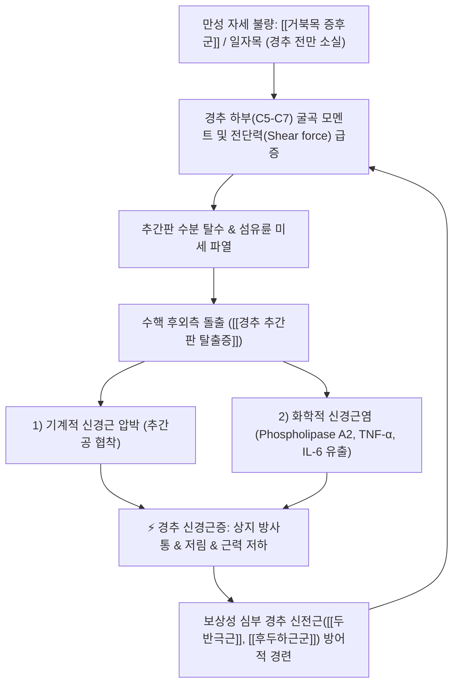

# 🩺 [[경추 추간판 탈출증]] (Cervical Disc Herniation / 頸椎 椎間板 脫出症, M50)

> **핵심 3줄 요약 (Key Summary)**:
> - 📍 병소 부위 & 해부·병태생리: 경추 C4-C5, C5-C6, C6-C7 추간판의 퇴행성 섬유륜 균열로 수핵이 후외측으로 탈출하여 주행하는 경추 척수신경근(C5, C6, C7, C8)을 물리적으로 압박하고 화학적 신경근염을 유발.
> - 🚩 전형적 임상 양상 & 3대 징후: 경항부 통증, 특정 피부분절을 따르는 상지 방사통 및 찌릿한 저림, 상완이두근/삼두근/수근신근의 근력 약화 및 건반사 감소.
> - 🛠️ 핵심 감별 검사 & 한·양방 다각적 치료 전략: [[스펄링 검사]](축성 압박) 및 [[경추 견인 검사]], 경추 MRI, 침·약침(경추 후관절/화타협척혈 수압박리)·추나(경추 신연 가동기법)·한약(서경탕, 활혈거어) 보존적 치료.
> - ⚠️ 응급 의뢰 레드플래그 & 악화 요인: 하지 강직성 마비·보행 실조·배뇨 장애 동반([[경추 척수증]] 의심) 또는 상지 운동 마비 급진행 시 즉시 척추신경외과 수술 의뢰, 과도한 경추 회전 스러스트 추나 금기.

---

## 📌 목차
1. [질환 개요 & 해부학적 병태생리](#1-질환-개요--해부학적-병태생리)
2. [병태생리 메커니즘 & 생체역학적 악순환 네트워크](#2-병태생리-메커니즘--생체역학적-악순환-네트워크)
3. [임상 증상 & 이학적 검사(Physical Exam) 알고리즘](#3-임상-증상--이학적-검사physical-exam-알고리즘)
4. [감별 진단 매트릭스 (Differential Diagnosis)](#4-감별-진단-매트릭스-differential-diagnosis)
5. [한의 통합 치료 프로토콜 (침·약침·추나·한약)](#5-한의-통합-치료-프로토콜-침약침추나한약)
6. [재활 운동 & 생활습관 티칭 가이드](#6-재활-운동--생활습관-티칭-가이드)
7. [💡 사용자 진료실 핵심 필기 & 임상 노하우 (Melt-In 잔여 심화 집약)](#7--사용자-진료실-핵심-필기--임상-노하우-melt-in-잔여-심화-집약)
8. [출처 및 학술 참고 문헌 (References)](#8-출처-및-학술-참고-문헌-references)

---

## 1. 질환 개요 & 해부학적 병태생리

![[추간판탈출_신경근압박_도해.png|450]]
> [그림 1: ① 경추 추간판의 섬유륜 파열과 수핵 탈출에 의한 후외측 척수신경근(Nerve root) 압박 및 국소 무균성 염증 메디컬 일러스트]

* **질환 정의 및 분절별 호발 부위**:
  * 경추 추간판(디스크) 내부의 수핵(Nucleus pulposus)이 노화, 외상, 불량한 자세로 인해 찢어진 섬유륜(Annulus fibrosus) 틈으로 탈출하여 후외측 추간공을 지나는 경추 신경근이나 척수를 압박하는 질환.
  * **C5-C6 추간판 (C6 신경근 압박)**: 전체의 약 35~40%로 최다 호발 (상완 외측, 엄지·검지 방사통).
  * **C6-C7 추간판 (C7 신경근 압박)**: 전체의 약 35~40%로 최다 호발 (중지 방사통, 상완삼두근 약화).
  * **C4-C5 추간판 (C5 신경근 압박)**: 약 10~15% (어깨 외측 삼각근 부위 방사통).
  * **C7-T1 추간판 (C8 신경근 압박)**: 약 5~10% (넷째·다섯째 손가락 방사통, 수내재근 약화).
* **관련 해부학적 구조물**:
  * **골격 및 관절**: C1~C7 경추골, 루슈카 관절(Uncovertebral joint, 구추관절), 경추 후관절(Facet joint).
  * **인대**: 전종인대(ALL), 후종인대(PLL, 중심부는 두껍고 외측은 얇아 후외측 탈출 호발).
  * **신경**: 경추 척수(Spinal cord) 및 C5~C8 척수신경근(Spinal nerve root).
  * **근육**: [[경장근]], [[두장근]], [[판상근]], [[두반극근]], [[전사각근]], [[중사각근]], [[견갑거근]], [[승모근]].

---

## 2. 병태생리 메커니즘 & 생체역학적 악순환 네트워크

![[경추_C6_C7_디스크탈출_MRI.jpg|400]]
> [그림 2: ② 경추 시상면 T2 MRI 상 C6-C7 분절 추간판의 뚜렷한 후방 탈출과 경막낭 압박 소견]

### 1) 이중 손상 메커니즘 (기계적 압박 + 화학적 신경근염)
* 탈출된 수핵은 단순히 물리적으로 신경근을 누르는 것(Mechanical compression)에 그치지 않음.
* 혈관과 림프관이 없는 무균 조직인 수핵이 섬유륜 밖으로 노출되면 체내 면역계는 이를 이물질로 인식하여 급격한 자가면역성 염증 반응을 일으킴.
* 수핵 내부의 고농도 포스포리파아제 A2($PLA_2$), TNF-$\alpha$, 인터루킨-6 등 염증성 사이토카인이 신경근 막을 침식하며 심한 부종과 통각수용기 과민화를 초래하여, 스치기만 해도 타는 듯한 신경병증성 방사통을 유발함.

### 2) 생체역학적 연쇄 반응 (경추 역학의 파탄)
* 정상 경추는 C자형 전만 곡선으로 머리 무게(약 5kg)를 지탱하나, 고개가 15도 앞으로 숙여지면 12kg, 30도 숙여지면 18kg, 60도 숙여지면 27kg의 하중이 C5~C7 분절 디스크에 집중됨.
* 이로 인해 심부 굴곡근인 [[경장근]]과 [[두장근]]은 억제되고, 표재성 신전근([[상부승모근]], [[견갑거근]], [[두판상근]])만 과도하게 동원되는 상부교차증후군이 고착화됨.

---

## 3. 임상 증상 & 이학적 검사(Physical Exam) 알고리즘

![[상지_경추신경근_피부분절도해.png|420]]
> [그림 3: ③ 경추 척수신경근별 고유 지배 감각 피부분절(Dermatome: C4, C5, C6, C7, C8, T1) 도해]

### 1) 분절별 임상 신경학적 평가 매트릭스
* **C5 신경근 (C4-C5 디스크)**:
  * 감각: 어깨 외측 삼각근 부위.
  * 운동: 견관절 외전(삼각근), 주관절 굴곡([[상완이두근]]).
  * 반사: 상완이두근 반사(Biceps reflex) 저하.
* **C6 신경근 (C5-C6 디스크)**:
  * 감각: 전완 외측, 엄지 및 검지 손가락.
  * 운동: 손목 신전([[장요측수근신근]], [[단요측수근신근]]), 주관절 굴곡.
  * 반사: 완골근 반사(Brachioradialis reflex) 저하.
* **C7 신경근 (C6-C7 디스크, 최다 호발)**:
  * 감각: 셋째 손가락(중지) 및 손등 중앙.
  * 운동: 주관절 신전([[상완삼두근]]), 손목 굴곡([[요측수근굴근]]), 손가락 신전.
  * 반사: 상완삼두근 반사(Triceps reflex) 저하.
* **C8 신경근 (C7-T1 디스크)**:
  * 감각: 넷째·다섯째 손가락(환지, 소지) 및 전완 내측.
  * 운동: 손가락 굴곡 및 파지력, 손가락 내전/외전(골간근).
  * 반사: 특이 건반사 없음.

### 2) 필수 이학적 검사 알고리즘
* **[[스펄링 검사]](Spurling's Test)**:
  * 환자의 목을 환측으로 측굴 및 약간 신전시킨 후 검사자가 정수리를 수직으로 아래로 강하게 압박.
  * 양성: 추간공이 좁아지며 환측 상지로 찌릿하게 뻗치는 방사통이 즉각 유발됨(특이도 90% 이상).
* **[[경추 견인 검사]](Cervical Distraction Test)**:
  * 누워있는 환자의 턱과 후두부를 잡고 머리를 축성 방향으로 위로 천천히 당김(약 10~15kg 힘).
  * 양성: 추간공이 넓어지며 기존의 목 통증과 팔 저림이 즉각 완화됨.
* **어깨 외전 검사(Bakody's Sign)**:
  * 환자가 아픈 쪽 손을 머리 위(정수리)에 얹었을 때 팔 저림이 줄어들면 경추 디스크 양성 시사(상완신경총 견인 완화).

---

## 4. 감별 진단 매트릭스 (Differential Diagnosis)

| 감별 질환 | 호발 병소 및 기전 | 주소증 차이점 | 핵심 감별 이학적 검사 |
| :--- | :--- | :--- | :--- |
| [[경추 추간판 탈출증]] (본 질환) | C5~C7 경추 신경근 압박 | 단일 피부분절 상지 방사통, 목 움직임 시 악화 | [[스펄링 검사]] 양성, [[경추 견인 검사]] 호전 |
| [[흉곽출구 증후군]] (TOS) | 사각근/늑쇄/소흉근 간극 상완신경총 압박 | C8~T1 4-5지 저림, 머리 위로 팔 거상 시 악화 | [[애드슨 검사]], [[라이트 검사]], [[루스 검사]] 양성 |
| [[수근관 증후군]] (손목터널) | 손목 횡수근인대 하부 정중신경 포착 | 1~3.5지 손가락 끝 저림, 손목 이하 국한 | [[팔렌 검사]](Phalen), [[틴넬 징후]](Tinel) 양성 |
| [[회전근개 파열]] | 견관절 극상근건 건병증/파열 | 팔꿈치 이하 방사통 없음, 어깨 외전 시 국소 통증 | [[Neer test]], [[Hawkins test]], [[Empty can test]] 양성 |
| [[경추 척수증]] (Myelopathy) | 경추 척수(Central cord) 압박 | 단추 채우기 불능, 걸을 때 비틀거림, 대소변 장애 | 호프만 징후(Hoffmann's) 양성, 슬개건반사 항진 |

---

## 5. 한의 통합 치료 프로토콜 (침·약침·추나·한약)

* **침구 및 전침 치료 (Acupuncture)**:
  * **타겟 경혈**: C5~C7 화타협척혈(EX-B2), 풍지(GB20), 견정(GB21), 천종(SI11), 곡지(LI11), 수삼리(LI10), 합곡(LI4).
  * **전침 요법**: 이환된 척추분절 협척혈과 상지 방사통 경로 혈자리에 2~100Hz 혼합파 전침 자극 $\rightarrow$ 신경근 주위 엔도르핀 분비 및 근막 이완.
* **약침 치료 (Pharmacopuncture)**:
  * **수압박리술(Hydrodissection)**: C5~C7 경추 신경근 추간공 외측 출구 및 경추 후관절 부위에 신바로약침, 중성어혈약침, 또는 황련해독탕 약침 주입 $\rightarrow$ 탈출된 수핵 주변의 무균성 화학 염증 세척 및 유착 박리.
* **추나 치료 (Chuna Manipulation)**:
  * **경추 신연 가동기법**: 환자를 앙와위로 눕힌 후 후두부를 부드럽게 견인하며 분절별 간격을 넓혀주는 수기법.
  * **경추 관절가동추나**: 척추의 굴곡-신전-측굴 가동범위를 회복시키는 완만한 관절 가동술 (단, 회전 스러스트는 금기).
  * **근막이완추나(JS)**: 과긴장된 [[견갑거근]], [[상부승모근]], [[전사각근]]의 근막 압박 이완.
* **한약 치료 (Herbal Medicine)**:
  * **급성기 어혈·신경염**: [[서경탕]](상지 경락 소통, 강활·방풍·당귀·적작약), [[당귀수산]].
  * **만성기 근골 퇴행·간신부족**: [[독활기생탕]], [[오적산]], [[신바로한약]](우슬, 방풍, 구척, 두충 $\rightarrow$ 디스크 연골 보호 및 신경 재생 촉진).

---

## 6. 재활 운동 & 생활습관 티칭 가이드

* **맥켄지 신전 운동 (McKenzie Extension Exercise)**:
  * 척추를 바로 세우고 턱을 뒤로 당긴(Chin-tuck) 상태에서 고개를 천천히 뒤로 젖히는 운동.
  * 후방으로 밀려난 수핵을 앞쪽으로 이동시키는 중심화 현상(Centralization) 유도 (단, 팔 저림이 악화되면 즉시 중단).
* **심부 경추 굴곡근 강화 (Deep Neck Flexor Strengthening)**:
  * 수건을 말아 목 뒤에 받치고 턱을 가슴 쪽으로 당기며 머리로 바닥을 지그시 누르는 등척성 운동(10초 유지, 10회 반복).
* **수면 및 작업 환경 교정**:
  * C자 커브를 지지하는 경추 베개 사용(베개 높이는 6~8cm 적정).
  * 컴퓨터 모니터를 눈높이에 맞추고 스마트폰을 숙여서 보지 않는 자세 교정 필수.

---

## 7. 💡 사용자 진료실 핵심 필기 & 임상 노하우 (Melt-In 잔여 심화 집약)

* **진료실 실전 감별 직관 팁 (스펄링 vs 경추 견인)**:
  * 환자가 문을 열고 들어올 때 아픈 쪽 팔을 머리 위에 얹고 들어오는 자세(Bakody sign)를 취하고 있다면 90% 이상 경추 디스크 환자임.
  * [[스펄링 검사]] 시 환측으로 목을 돌리고 누를 때 팔로 전기가 찌릿하게 통하는 통증이 재현되고, 반대로 머리를 위로 가볍게 들어 올렸을 때 "어? 시원하면서 팔 저린 게 싹 가시네요!"라고 말하면 99% 확진임.
* **절대 놓치지 말아야 할 레드플래그 (마엘로파시 감별)**:
  * 경추 디스크 환자를 진찰할 때는 반드시 손가락으로 젓가락질이나 단추 채우기가 잘 되는지 물어보고, 진찰대 위에서 일자 걸음(Tandem gait)을 시켜보아야 함.
  * 손의 정밀 동작 장애와 술 취한 듯 비틀거리는 보행 실조, [[호프만 징후]] 양성이 나타나면 단순 신경근증이 아닌 척수 본체가 눌리는 **[[경추 척수증]](Cervical Myelopathy)**이므로 비수술적 한의 치료만 고집하지 말고 지체 없이 상급병원 수술 의뢰를 해야 함.
* **약침 시술 손맛 팁**:
  * 경추 후관절 및 척추기저부 자침 시에는 반드시 경동맥과 추골동맥 주행을 촉진하여 맥박을 확인한 후, 추골 극돌기 외측 1~1.5cm 화타협척혈 라인에서 척추뼈 후궁(Lamina)을 향해 안전한 각도로 진침해야 함.

---

## 8. 출처 및 학술 참고 문헌 (References)

1. **Bono CM, Ghiselli G, Gilbert TJ, et al. (2011)**. *An evidence-based clinical guideline for the diagnosis and treatment of cervical radiculopathy from degenerative disorders*. **The Spine Journal**, 11(1), 64-72. [PMID: 21146784](https://pubmed.ncbi.nlm.nih.gov/21146784/)
   - **[연구 요약]**: 북미척추학회(NASS) 공식 임상 가이드라인으로 스펄링 검사와 경추 견인 검사의 진단적 정확도 및 영상의학적 MRI의 역할, 보존적 치료의 1차 적용 원칙을 체계적으로 수립.
2. **Wang C, Wang X, et al. (2024)**. *Efficacy and Safety of Acupuncture in the Treatment of Radicular Cervical Spondylosis: A Systematic Review and Meta-Analysis*. **Combinatorial Chemistry & High Throughput Screening**, 27(12), 1845-1856. [PMID: 37957858](https://pubmed.ncbi.nlm.nih.gov/37957858/)
   - **[연구 요약]**: 경추 신경근증 환자를 대상으로 한 RCT 메타분석을 통해 협척혈 전침 치료가 기존 약물 치료 대비 통증 척도(VAS)와 경추 기능 장애 지수(NDI)를 유의하게 개선하고 재발률을 낮춤을 규명.
3. **Yang X, et al. (2020)**. *Meta-analysis of the therapeutic effect of acupuncture and chiropractic on cervical spondylosis radiculopathy*. **World Journal of Acupuncture - Moxibustion**, 30(1), 58-64. [PMID: 32000386](https://pubmed.ncbi.nlm.nih.gov/32000386/)
   - **[연구 요약]**: 침 치료와 추나(신연 및 관절 가동술) 병용 요법이 단독 요법 대비 경추 신경근 압박 해소 및 임상적 총유효율을 극대화함을 메타분석으로 입증.
