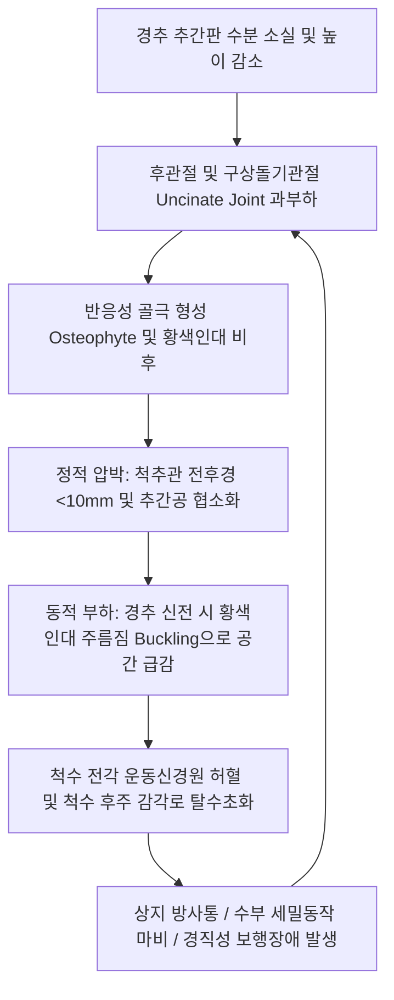

# 🩺 [[경추 협착]] (Cervical Spinal Stenosis)

> **핵심 3줄 요약 (Key Summary)**:
> - 📍 병소 부위 & 해부·병태생리: 경추 중앙 척추관(Spinal Canal) 또는 외측 신경근관·추간공(Intervertebral Foramen)이 퇴행성 골극, 황색인대(Ligamentum flavum) 비후, 추간판 팽윤 및 후관절 비대로 좁아져 경수(Cervical spinal cord) 또는 경추 신경근(Cervical nerve root)을 기계적·허혈성으로 압박하는 만성 질환.
> - 🚩 전형적 임상 양상: 목·어깨의 만성 뻐근함, 팔과 손가락으로 뻗치는 방사통 및 감각 둔마, 손의 미세 운동 실조(단추 잠그기·젓가락질 둔화), 보행 시 다리가 뻣뻣하고 휘청거리는 경직성 보행 장애(Spastic gait).
> - 🛠️ 핵심 감별 검사 & 한·양방 다각적 치료 전략: Spurling 검사(신경근 압박), 경추 견인 검사(Distraction test), Hoffmann 반사 및 Babinski(척수 압박), 경추 MRI(T2 고신호 및 파블로비츠비 Pavlov's ratio <0.8). 경추 협척혈·[[풍지]](GB20)·[[견정]](GB21) 침구 치료, 소염·신경재생 약침(신바로·자하거), 부드러운 경추 신연 추나(HVLA 금기).
> - ⚠️ 응급 의뢰 레드플래그: 급격한 보행 불능 및 낙상 반복, 대소변 조절 장애(방광·직장 마비), 진행성 수부 내재근 마비 및 악력 급감 동반 경수증(Myelopathy) 소견 시 응급 신경외과 수술 의뢰. 경추 급성 회전·강한 신전 추나 절대 금기.

---

## 📌 목차
1. [질환 개요 & 해부학적 병태생리](#1-질환-개요--해부학적-병태생리)
2. [병태생리 메커니즘 & 생체역학적 악순환 네트워크](#2-병태생리-메커니즘--생체역학적-악순환-네트워크)
3. [임상 증상 & 이학적 검사(Physical Exam) 알고리즘](#3-임상-증상--이학적-검사physical-exam-알고리즘)
4. [감별 진단 매트릭스 (Differential Diagnosis)](#4-감별-진단-매트릭스-differential-diagnosis)
5. [한의 통합 치료 프로토콜 (침·약침·추나·한약)](#5-한의-통합-치료-프로토콜-침약침추나한약)
6. [양방 치료 & 병용·의뢰 기준 (Conventional Treatment & Referral)](#6-양방-치료--병용의뢰-기준-conventional-treatment--referral)
7. [재활 운동 & 생활습관 티칭 가이드](#7-재활-운동--생활습관-티칭-가이드)
8. [💡 사용자 진료실 핵심 필기 & 임상 노하우 (Melt-In 잔여 심화 집약)](#8--사용자-진료실-핵심-필기--임상-노하우-melt-in-잔여-심화-집약)
9. [출처 및 학술 참고 문헌 (References)](#9-출처-및-학술-참고-문헌-references)

---

## 1. 질환 개요 & 해부학적 병태생리

![[경추협착_01_경추척추관협착_MRI.jpg|480]]
> [그림 1: ① 질환/병태생리 영상 — 경추 척추관 협착증 시상면 MRI] 경추 중하부(C4-C6)에서 퇴행성 추간판 돌출과 황색인대 비후로 인해 척수관이 현저히 좁아지고 척수가 압박받는 소견.

* **질환 정의 및 개념**:
  * 경추 협착(Cervical Spinal Stenosis)은 경추부의 척추관(Spinal canal), 외측 함요부(Lateral recess), 또는 추간공(Neural foramen)의 내경이 선천적 발육 부전이나 후천적 퇴행성 변화로 인해 좁아져 척수(Spinal cord)나 신경근(Nerve root)이 압박을 받는 상태를 말한다.
  * 요추관 협착증이 신경인성 간헐적 파행(하지 증상)을 주 증상으로 하는 반면, 경추 협착증은 **경추 신경근병증(Radiculopathy)**과 중추신경인 척수가 직접 눌리는 **[[경추 척수증]](Cervical Spondylotic Myelopathy, CSM / DCM)**을 동시에 또는 순차적으로 유발할 수 있어 임상적 예후가 훨씬 엄중하다([Hejrati N, 2023](https://pubmed.ncbi.nlm.nih.gov/37004568/)).
* **해부학적 구획과 정상치 기준**:
  * **중앙 척추관 전후경 (AP Canal Diameter)**:
    * 정상: 성인 기준 17~18 mm.
    * 상대적 협착(Relative Stenosis): 10~13 mm.
    * 절대적 협착(Absolute Stenosis): **10 mm 미만** (척수 압박 및 허혈 위험 급증).
  * **파블로비츠 비 (Pavlov-Torg Ratio)**:
    * 단순 측면 X-ray에서 척추관 전후경 / 척추체 전후경의 비율. 0.82 미만일 경우 선천적 경추관 협착증으로 진단.
  * **추간공(Intervertebral Foramen) 및 구상돌기관절(Luschka joint)**:
    * 경추 특유의 구상돌기관절의 퇴행성 골극(Uncinate osteophyte) 비대는 전외측에서 신경근을 포착하는 가장 흔한 원인임([Zhang H, 2026](https://pubmed.ncbi.nlm.nih.gov/42098683/)).

---

## 2. 병태생리 메커니즘 & 생체역학적 악순환 네트워크

![[경추협착_01_추간공협착_Xray_사위상.jpg|480]]
> [그림 2: ② 관련 해부 구조물 — 경추 사위상(Oblique view) X-ray 추간공 협착] 구상돌기관절 및 후관절 골극으로 인해 신경근이 빠져나오는 추간공이 좁아진 소견.

### 1) 정적 압박과 동적 인자의 복합 작용 (Dynamic Factor)
* **신전-굴곡 운동에 따른 용적 변화**:
  * 경추를 **신전(Extension)**할 때 황색인대가 안쪽으로 접혀 들어가며(Buckling) 척추관 내경이 10~15% 추가 감소하고 척수가 앞뒤에서 집게처럼 짓눌림(Pincer mechanism).
  * 경추를 **굴곡(Flexion)**할 때는 척수관 길이는 늘어나나 척수가 팽팽하게 신장(Tension)되어 전방 추체 골극에 문질러지는 미세 손상 발생.
* **미세혈관 관류 장애**:
  * 전척수동맥(Anterior spinal artery) 및 정맥총의 만성 압박으로 척수 중심부 회백질의 허혈성 괴사 및 낭성 변성 초래([Chikuda H, 2026](https://pubmed.ncbi.nlm.nih.gov/42560484/)).

---

## 3. 임상 증상 & 이학적 검사(Physical Exam) 알고리즘

![[경추견인검사_2단계_축성견인_수기시행.jpg|480]]
> [그림 3: ③ 이학적 검사 — 경추 축성 견인 검사(Distraction Test)] 시술자가 환자의 턱과 후두골을 잡고 상방으로 부드럽게 견인할 때 추간공이 넓어지며 상지 방사통이 소퇴되는지 확인.

### 1) 단계별 임상 증상
* **1단계 (경추 국소통 및 신경근 자극기)**:
  * 목 뒤쪽, 승모근, 견갑간부의 만성적 뻐근함.
  * 기침이나 재채기, 목을 뒤로 젖힐 때 팔이나 손가락으로 찌릿한 전기 통증 방사.
* **2단계 (수부 정밀 기능 저하 - Myelopathy Hand)**:
  * 단추 잠그기, 셔츠 단추 채우기, 젓가락질이 서툴러지고 손글씨가 삐뚤어짐.
  * 10초 손 개폐 검사(10-second grip and release test): 10초 동안 주먹을 쥐었다 펴는 동작이 20회 미만으로 저하.
* **3단계 (경직성 보행 장애 및 괄약근 장애)**:
  * 다리가 뻣뻣하여 계단을 내려올 때 난간을 잡아야 함, 밤에 걸을 때 휘청거리는 술 취한 듯한 보행(Ataxic gait).

### 2) 필수 이학적 검사 알고리즘
* **1단계: 신경근 압박 검사**:
  * **[[스퍼링 검사]](Spurling's Test)**: 환자의 목을 환측으로 회전 및 측굴 후 하방 압박 $\rightarrow$ 상지 방사통 재현 시 추간공 협착 양성.
  * **경추 견인 검사(Distraction Test)**: 턱과 후두골을 상방 견인 시 통증 호전 양성.
* **2단계: 척수 압박 징후 (Upper Motor Neuron Signs)**:
  * **[[호프만 반사]](Hoffmann's Sign)**: 중지 손톱을 튕겼을 때 엄지와 검지가 불수의적으로 모여 굴곡되면 경수 압박 양성.
  * **[[바빈스키 징후]](Babinski Reflex)**: 발바닥 외측을 긁을 때 족지 신전 반응.
  * **족간대(Ankle Clonus)**: 발목을 급격히 배굴시킬 때 3회 이상의 연속적 경련성 떨림.

---

## 4. 감별 진단 매트릭스 (Differential Diagnosis)

| 감별 질환 | 주요 병소 및 손상 신경 | 주소증 및 신경학적 특성 | 결정적 검사 소견 |
| :--- | :--- | :--- | :--- |
| **[[경추 협착]]** | 경추관 및 추간공 ([[척수]] & 신경근) | 목 신전 시 악화, 상지 방사통 + 하지 경직성 보행장애 | **Spurling(+), Hoffmann(+), MRI 척추관 <10mm** |
| **[[경추 추간판 탈출증]]** | 단일 분절 추간판 ([[경추신경근]]) | 급성 발병, 단일 피부분절 방사통, 하지 보행장애 없음 | MRI 상 국소 수핵 탈출, Hoffmann(-) |
| **[[요추관 협착증]]** | 요추관 ([[마미총]] & 요천추 신경근) | 하지 파행(보행 시 악화, 전굴 시 호전), 상지 증상 전무 | 쇼핑카트 징후(+), 상지 반사 정상 |
| **근위축성 측삭경화증 (ALS)** | 척수 전각 및 피질척수로 | 통증이나 감각 이상 없이 사지 근위축과 근섬유다발수축 | 감각 정상, 진행성 운동신경원 마비, EMG 이상 |
| **[[수근관 증후군]]** | 손목 수근관 ([[정중신경]]) | 1~3수지 장측 저림, 야간 플릭 징후 | Phalen(+), 목 움직임과 무관, 하지 정상 |

---

## 5. 한의 통합 치료 프로토콜 (침·약침·추나·한약)

![[경추 추나-20240920065624673.png|480]]
> [그림 4: ④ 한의 치료 술기 실사 — 경추 후두하 신연 및 근막 이완 추나] 경추의 급격한 회전을 배제하고 후두골과 경추 분절을 종축으로 부드럽게 신연하여 추간공 공간을 확보하는 안전한 추나 기법.

### 1) 침구 치료 & 경추 협척혈 전침 요법
* **취혈 프로토콜**:
  * **심부 협척혈(Huatuojiaji)**: 병변 분절 경추 C4-C7 협척혈에 0.30×40mm 호침으로 척추관 외측 및 후관절을 향해 사자(15~20mm).
  * **원위 및 근막 혈위**: [[풍지]](GB20), [[견정]](GB21), [[천주]](BL10), [[대저]](BL11), [[곡지]](LI11), [[후계]](SI3), [[외관]](TE5).
* **전침 자극 파형**:
  * 협척혈 쌍에 **2/100Hz 혼합파(Dense-disperse wave)**를 20분간 통전하여 척추 주위 심부 다열근의 과긴장을 풀고 경막 외 미세정맥 환류를 촉진.

### 2) 약침 요법 (Pharmacopuncture)
* **제제 처방**:
  * **신바로 약침**: 후관절 및 황색인대 주변 만성 퇴행성 염증 흡수 및 신경 보호 작용.
  * **자하거(인태반) 약침**: 척수 혈류 저하 및 만성 신경근 축삭 퇴행 환자의 신경 영양 공급.
* **자입 방법**:
  * 경추 신경근 출구 주변에 초음파 가이드 또는 정밀 해부학적 지표 하에 0.5~1.0cc 분할 주입 (혈관 흡인 테스트 필수).

### 3) 안전한 경추 신연 추나 (Spine Decompression Chuna)
* **절대 금기 사항**:
  * **경추 고속 저진폭 교정(HVLA thrust) 및 과도한 경추 신전·회전 수기 절대 금기** (척수가 좁아진 상태에서 급격한 비틀림은 영구적 척수 손상이나 사지 마비를 유발할 수 있음).
* **적용 기법**:
  * 후두하근 이완 수기(Suboccipital release) 및 경추 축성 장축 신연(Axial traction)으로 후관절 압박을 줄이고 추간공 유효 면적 증대.

### 4) 한약 치료 (변증 시치)
* **간신부족·골퇴행형(肝腎不足型)**: 만성 경추통, 하지 무력, 고령 $\rightarrow$ [[독활기생탕]](獨活寄生湯), [[보간탕]](補肝湯).
* **기체어혈·경맥폐색형(氣滯瘀血型)**: 완고한 상지 방사통, 야간 작열감 $\rightarrow$ [[신통축어탕]](身痛逐瘀湯), [[서경탕]](舒經湯).
* **담어조락형(痰瘀阻絡型)**: 손가락 마비, 둔마, 젓가락질 둔화 $\rightarrow$ [[반하백출천마탕]](半夏白朮天麻湯) 합 [[도홍사물탕]](桃紅四物湯).

---

## 6. 양방 치료 & 병용·의뢰 기준 (Conventional Treatment & Referral)

* **보존적 약물 요법**:
  * 신경병증 통증 조절제: 프레가발린(Pregabalin 75~150mg bid), 가바펜틴.
  * 소염진통제(NSAIDs) 및 근이완제(Eperisone) 병용.
* **경막외 신경차단술 (Cervical Epidural Injection)**:
  * 방사통이 극심한 경우 C-arm 유도하 추간공 경유 경막외 스테로이드 주사(TFESI) 시행. (혈관 내 오주입 시 척수 경색 위험이 있어 숙련된 전문의 시술 필요).
* **수술적 치료 적응증 (Surgical Indication)**:
  * **절대적 적응증**: 중등도 이상의 경추 척수증(CSM), 조호바 점수(JOA score) 12점 이하, 진행성 하지 마비 및 보행 장애, 괄약근 장애.
  * **수술 기법**: 전방 경추 유합술(ACDF), 경추 인공디스크 치환술(ADR), 또는 다분절 협착 시 후방 경추 추궁성형술(Laminoplasty) 및 감압술([Chikuda H, 2026](https://pubmed.ncbi.nlm.nih.gov/42560484/)).
* **한의 병용 및 의뢰 기준**:
  * 경증의 신경근형 협착증은 한의 치료 6~8주간 적극 보존 치료.
  * 단추 잠그기 불능, 발바닥 감각 먹먹함 및 계단 보행 장애 발견 즉시 척수증으로 간주하고 신경외과/정형외과 MRI 의뢰.

---

## 7. 재활 운동 & 생활습관 티칭 가이드

![[편타손상_경추_과신전_과굴곡_기전도해.png|480]]
> [그림 5: ⑤ 생활습관 티칭 — 경추 과신전 및 충격 방지 도해] 목을 뒤로 과도하게 젖히는 동작에서 척추관 내경이 급격히 좁아지는 생체역학적 기전을 방지하는 교육.

![[상지_경추신경근_피부분절도해.png|480]]
> [그림 6: ⑥ 신경학적 피부분절 도해 — 경추 신경근 지배 영역] C5~T1 신경근 손상에 따른 감각 둔마 및 자가 진단 피부분절 지도.

### 1) 경추 중립 및 심부 굴근 강화 운동 (Deep Neck Flexor Training)
* **턱 당기기 운동 (Chin-Tuck Exercise)**:
  * 시선을 정면에 두고 손가락으로 턱을 뒤로 가볍게 밀어 넣으며 귀와 어깨 라인이 일치하도록 정렬. 경추 전만을 회복시키고 추간공을 넓혀주는 핵심 운동(10초 유지, 하루 20회).
* **경추 등척성 강화 운동 (Isometric Cervical Exercise)**:
  * 머리를 손으로 앞, 뒤, 좌, 우에서 밀며 목 근육은 버티는 등척성 수축 훈련.

### 2) 일상생활 금기 동작 및 수면 환경
* **절대 금기 동작**:
  * **목을 뒤로 젖히고 천장이나 하늘을 오래 바라보는 동작**(도배 작업, 미용실 샴푸대, 과도한 경추 신전 스트레칭)은 황색인대를 접히게 하여 척수를 급격히 압박하므로 절대 금지.
* **베개 높이 조절**:
  * 너무 높거나 너무 낮은 베개를 피하고, 경추 C커브를 지지하면서 목이 수평선과 평행을 이루는 6~8cm 높이의 경추 전용 베개 사용.

---

## 8. 💡 사용자 진료실 핵심 필기 & 임상 노하우 (Melt-In 잔여 심화 집약)

> [!TIP] **진료실 임상 진단 & 감별 노하우**
> 1. **"손이 어둔하다"는 호소를 단순 노화로 넘기지 말 것**:
>    - 60대 이상 환자가 "요즘 손가락에 힘이 없고 단추 잠그기나 젓가락질이 자꾸 삐뚤어진다", "다리에 힘이 빠져서 스펀지 위를 걷는 것 같다"고 호소하면 십중팔구 경추 협착에 의한 경수증(CSM)이다. 바로 진료실에서 **10초 손 개폐 검사**와 **Hoffmann 반사**를 확인하라([Hejrati N, 2023](https://pubmed.ncbi.nlm.nih.gov/37004568/)).
> 2. **추나 시술 시의 철칙**:
>    - 척추관이 좁아진 경추 협착증 환자에게 "뚝" 소리가 나는 고속 회전 교정(HVLA)을 시행하면 척수 압박이 순간적으로 극대화되어 사지 마비가 발생하는 치명적 의료사고로 이어질 수 있다. 경추 협착 환자에게는 오직 **부드러운 후두하근 이완과 장축 신연(Traction)**만을 적용해야 한다.
> 3. **풍지(GB20)혈 자침의 두통·방사통 완화 효과**:
>    - 경추 협착 환자는 상부 경추 근육군이 보상성으로 극도로 수축되어 있다. 풍지혈과 천주혈을 향해 침첨을 반대측 안와 방향으로 15~20mm 사자하여 후두하삼각 근육을 이완시켜 주면 뇌척수액 순환과 척추기저동맥 혈류가 개선되어 상지 저림과 경항통이 현저히 호전된다.

---

## 9. 출처 및 학술 참고 문헌 (References)

1. Chikuda H. Clinical evolution in the treatment of degenerative cervical myelopathy in Japan: excellence born from necessity. *Int Orthop*. 2026;50(9):1845-1854. [PMID: 42560484](https://pubmed.ncbi.nlm.nih.gov/42560484/)
   - [연구 요약]: 퇴행성 경추 척수증(DCM) 및 경추 척추관 협착증의 병태생리, 보존적 관리의 한계점과 최소 침습적 경추 후방 추궁성형술(Laminoplasty)의 최신 임상 발전 고찰.
2. Zhang H, et al. Biomechanical assessment of endoscopic cross-over top decompression in cervical spinal stenosis: a finite element analysis. *BMC Musculoskelet Disord*. 2026;27(1):412. [PMID: 42098683](https://pubmed.ncbi.nlm.nih.gov/42098683/)
   - [연구 요약]: 경추 척추관 협착증 환자의 유한요소 생체역학 모델을 통해 내시경적 감압술 및 후관절 보존이 경추 분절 안정성에 미치는 역학적 영향 분석.
3. Hejrati N, et al. Degenerative cervical myelopathy: Where have we been? Where are we now? Where are we going? *Acta Neurochir (Wien)*. 2023;165(5):1153-1162. [PMID: 37004568](https://pubmed.ncbi.nlm.nih.gov/37004568/)
   - [연구 요약]: 경추 협착에 의한 경수증(CSM/DCM)의 국제 임상 가이드라인, 조기 신경학적 평가 지표(JOA score, 10초 검사) 및 보존 치료 대 수술적 치료의 전환 기준 제시.
