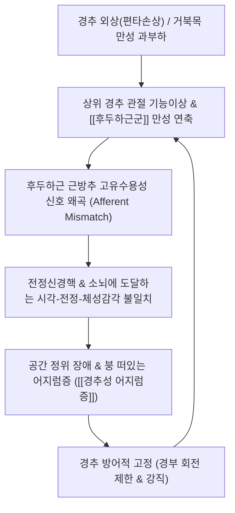

# 🩺 [[경추성 어지럼증]] (Cervicogenic Dizziness / 頸性眩暈, M53.0 / ICD-10)

> 📐 **이 템플릿은 근골격계·신경·통증 계열 질환 전용입니다.**

> 🖼️ **이미지 규격(정본)**: 질환 노트 7장 (①환부/뇌혈류 임상도해 ②영상 소견 MRI ③해부 도해 후두하근 ④이학적 검사 시연 ⑤한의 술기 경추추나 ⑥초음파 유도 후두신경 주입 ⑦재활 운동).

> **핵심 3줄 요약 (Key Summary)**:
> - 📍 병소 부위 & 해부·병태생리: 상위 경추(C1-C3 분절) 및 심부 [[후두하근군]](대후두직근, 소후두직근, 상두사근, 하두사근)의 고밀도 근방추 이상 감각 유입, 경추-전정핵(Cervico-ocular / Cervicocollic reflex) 고유수용감각 불일치.
> - 🚩 전형적 임상 양상 & 3대 징후: 경부 통증 또는 경추 움직임에 의해 유발/악화되는 비회전성 동요감(Dizziness/Lightheadedness, 술 취한 듯 비틀거림), 뒷목 강직 및 후두통, 회전성 회전감(True spinning vertigo)의 부재.
> - 🛠️ 핵심 감별 검사 & 한·양방 다각적 치료 전략: 경부 비틀림 안진 검사(Neck Torsion Nystagmus Test), 두경부 감별 검사, 전정 질환([[이석증]], [[메니에르병]]) 배제, [[후두하근]] 침·약침([[자하거약침]]) 및 상경추 가동 추나.
> - ⚠️ 응급 의뢰 레드플래그 & 악화 요인: 뇌간 및 소뇌 허혈(5D-3N: Dizziness, Diplopia, Dysarthria, Dysphagia, Drop attack, Nausea, Numbness, Nystagmus), 추골동맥 박리(VAD) 의심 시 즉시 3차 신경과/응급실 의뢰.

---

## 📌 목차
1. [질환 개요 & 해부학적 병태생리](#1-질환-개요--해부학적-병태생리)
2. [병태생리 메커니즘 & 생체역학적 악순환 네트워크](#2-병태생리-메커니즘--생체역학적-악순환-네트워크)
3. [임상 증상 & 이학적 검사(Physical Exam) 알고리즘](#3-임상-증상--이학적-검사physical-exam-알고리즘)
4. [감별 진단 매트릭스 (Differential Diagnosis)](#4-감별-진단-매트릭스-differential-diagnosis)
5. [한의 통합 치료 프로토콜 (침·약침·추나·한약)](#5-한의-통합-치료-프로토콜-침약침추나한약)
6. [양방 치료 & 병용·의뢰 기준 (Conventional Treatment & Referral)](#6-양방-치료--병용의뢰-기준-conventional-treatment--referral)
7. [재활 운동 & 생활습관 티칭 가이드](#7-재활-운동--생활습관-티칭-가이드)
8. [💡 사용자 진료실 핵심 필기 & 임상 노하우 (Melt-In 잔여 심화 집약)](#8--사용자-진료실-핵심-필기--임상-노하우-melt-in-잔여-심화-집약)
9. [출처 및 학술 참고 문헌 (References)](#9-출처-및-학술-참고-문헌-references)

---

## 1. 질환 개요 & 해부학적 병태생리

![[청강의감26_16_현훈_뇌_공급부족.jpg|450]]
> [그림 1: ① 환부 및 병태 소견 — 상위 경추의 기계적 압박 및 근긴장으로 인한 척추뇌기저동맥 순환 장애와 현훈 병태 — Simbio Vault Archive]

![[경추_C6_C7_디스크탈출_MRI.jpg|450]]
> [그림 2: ② 영상 소견(경추 MRI) — 경추 분절 퇴행성 추간판 탈출 및 신경근 압박 소견 — Simbio Vault Archive]

* **질환 정의 및 개념의 변천**:
  * **[[경추성 어지럼증]]**(Cervicogenic Dizziness)은 경추부의 기능 부전이나 통증성 병변으로 인해 비정상적인 체성감각(Somatosensory) 정보가 뇌간의 전정신경핵으로 전달되어 발생하는 주관적인 공간 지각 장애 및 어지럼증을 말합니다(Treleaven J, et al. 2024).
  * 과거에는 단순히 추골동맥(Vertebral artery)의 혈류 압박에 의한 척추뇌저동맥 순환부전(VBI)으로만 설명하였으나, 현대 신경과학에 따르면 상위 경추 심부 근육군(후두하근)의 고밀도 근방추(Muscle spindle)에서 뇌간으로 올라가는 고유수용감각 신호 왜곡이 주된 기전임이 밝혀졌습니다.
* **관련 해부학적 구조물**:
  * **상위 경추 분절**: 후두골-환추(C0-C1), 환축추(C1-C2) 관절은 경추 전체 회전 운동의 50%를 담당하는 핵심 관절입니다.
  * **후두하근 삼각 (Suboccipital triangle)**: [[대후두직근]], [[상두사근]], [[하두사근]]으로 구성되며, 인체 내에서 근육 1g당 근방추 밀도가 가장 높은 부위입니다(외안근과 맞먹는 수준).
  * **신경 및 혈관 연결망**: C1~C3 척수신경의 후지는 전정신경핵(Vestibular nucleus), 척수로 삼차신경핵과 광범위하게 시냅스를 형성(경추-삼차신경핵 복합체)하여 두통, 안구 운동 장애, 균형 장애를 동시에 유발합니다.

---

## 2. 병태생리 메커니즘 & 생체역학적 악순환 네트워크

![[후두하근-20240914193517231.png|450]]
> [그림 3: ③ 관련 해부학적 구조물 — 후두하근군(대후두직근, 소후두직근, 두사근)과 대후두신경 주행 해부 도해 — Simbio Vault Archive]

### 1) 감각 불일치 모델 (Sensory Mismatch Hypothesis)
* 인체가 공간에서 중심을 잡기 위해서는 세 가지 정보가 완벽히 일치해야 합니다: ① 내이의 전정계(귀) ② 시각계(눈) ③ 경추 심부의 체성감각계(목).
* 상위 경추의 관절염, 편타손상, 일자목/거북목으로 인해 후두하근이 굳어지면, 실제 머리의 회전 위치와 다른 잘못된 고유수용성 신호가 뇌간 전정핵으로 입력됩니다.
* 뇌는 눈과 귀에서 들어오는 신호와 목에서 들어오는 신호가 어긋나자 이를 '균형 상실'로 인지하여 주관적인 동요감, 멀미, 멍한 느낌(Brain fog)을 유발합니다(Reiley AS, et al. 2017).

### 2) 경추 반사 경로(Cervical Reflexes) 장애
* 정상 상태에서는 고개를 돌릴 때 안구를 반대쪽으로 이동시켜 시야를 고정하는 **경안반사(Cervico-ocular reflex, COR)**가 작동합니다.
* 경추성 어지럼증 환자에서는 COR의 억제 또는 과흥분이 일어나, 고개를 돌릴 때 시야가 흔들리는 진동시(Oscillopsia)나 초점 맞추기 어려움을 겪게 됩니다.

---

## 3. 임상 증상 & 이학적 검사(Physical Exam) 알고리즘

### 1) 전형적 주소증 및 임상 양상
* **어지럼증의 성상**:
  * 천장이 뱅뱅 도는 회전성 현훈(Spinning vertigo)이 아니라, **스펀지 위를 걷는 듯한 느낌, 배를 탄 듯 붕 뜨는 느낌(Floating sensation), 멍하고 머리가 맑지 않음(Lightheadedness)**을 호소합니다.
* **경부 유발성**:
  * 어지럼증이 목의 특정 움직임(고개 젖히기, 운전 시 후방 주시, 모니터 좌우 회전)이나 장시간 고정된 자세 후에 유발되거나 악화됩니다.
* **동반 증상**:
  * 후두통, 경추부 강직, 견배통, 어깨 결림, 가벼운 구역감, 시각 피로.

### 2) 필수 이학적 검사법 (Physical Examination)

![[추골동맥검사_1단계_경추신전외회전_실사.png|420]]
> [그림 4: ④ 이학적 검사 시연 — 추골동맥 뇌기저부 순환 부전 및 위험 신호 감별을 위한 추골동맥 검사(Vertebrobasilar Test) 실사 — Simbio Vault Archive]

* **경부 비틀림 안진 검사 (Smooth Pursuit Neck Torsion Test, SPNT)**:
  * 머리는 고정한 채 몸통을 좌우로 45도 회전시켜 경추의 고유수용감각 수용체만을 순수하게 자극합니다. 몸통을 돌렸을 때 안진이 발생하거나 추종 안구 운동 속도가 떨어지고 어지럼증이 재현되면 양성입니다.
* **두경부 분리 검사 (Head-Neck Differentiation Test)**:
  * 회전의자에 환자를 앉히고, 머리와 몸통을 동시에 회전시킬 때(전정계+경추계 자극)와 머리를 잡고 몸통만 회전시킬 때(순수 경추계 자극)를 비교하여, 몸통만 돌릴 때 어지럼증이 발생하면 경추성 어지럼증으로 확진합니다.
* **추골동맥 검사 (Vertebral Artery Test / DeKleyn's Test)**:
  * 환자를 앙와위로 눕히고 경추를 신전 및 회전시킨 상태에서 30초간 유지합니다. 뇌간 허혈 증상(안진, 구음장애, 시야 결손, 실신)이 유발되면 추골동맥 협착 소견으로 도수 교정의 절대 금기입니다.

---

## 4. 감별 진단 매트릭스 (Differential Diagnosis)

| 감별 질환 | 호발 원인 및 병태 | 어지럼증 성상 | 감별 핵심 소견 & 이학적 검사 |
| :--- | :--- | :--- | :--- |
| **[[경추성 어지럼증]] (본 질환)** | 상위 경추 관절염, [[후두하근]] 긴장, 고유감각 오류 | 붕 뜨는 느낌, 동요감, 목 통증과 연동 | SPNT 양성, 딕스-홀파이크 음성, 이과적 정상 |
| **[[양성 발작성 두위 현훈]] (이석증, BPPV)** | 반고리관 내 이석(Otoconia) 탈락 | 1분 미만의 격렬한 회전성 현훈, 자세 변경 시 급발 | 딕스-홀파이크 검사(Dix-Hallpike) 시 회전성 안진 |
| **[[메니에르병]]** | 내이 내임파수종(Endolymphatic hydrops) | 수 시간 지속되는 회전성 어지럼, 변동성 난청 | 청력 저하, 이명, 이충만감 3대 징후 동반 |
| **[[전정신경염]] (Vestibular Neuritis)** | 전정신경의 바이러스 감염 | 수일간 지속되는 극심한 회전성 어지럼과 구토 | 자발 안진, 두부충동검사(Head impulse) 양성 |
| **척추뇌저동맥 순환부전 (VBI / 뇌간 뇌졸중)** | 추골동맥 동맥경화, 뇌간/소뇌 경색 (응급) | 지속적 어지럼, 복시, 구음장애, 연하곤란, 사지위약 | 5D-3N 징후, 소뇌성 운동실조(Ataxia) 동반 |
| **기립성 저혈압** | 자율신경계 혈압 조절 부전 | 일어설 때 눈앞이 캄캄해짐(Blackout) | 기립 시 수축기 혈압 20mmHg 이상 하강 |

---

## 5. 한의 통합 치료 프로토콜 (침·약침·추나·한약)

![[경추 추나-20240920061855744.png|400]]
> [그림 5: ⑤ 한의 술기 실사 — 후두하근 긴장 완화 및 상경추 기능부전 정상화를 위한 경추 추나 가동 수기 실사 — Simbio Vault Archive]

![[PNP_Fig_Occipital_Injection.png|400]]
> [그림 6: ⑥ 초음파 유도 시술 실사 — 후두하근막 및 대후두신경 주변 초음파 유도 약침 주입 도해 — Simbio Vault Archive]

* **침구 치료 (Acupuncture)**:
  * **주요 혈위**: [[풍지]](GB20), [[천주]](BL10), [[완골]](GB12), [[백회]](GV20), [[후계]](SI3).
  * **후두하근 정밀 자침**: 풍지와 천주에서 반대측 안와 방향으로 15~25mm 사자하여 C1-C2 후궁 주변의 단축된 후두하근 섬유를 직접 자극, 비정상적 근방추 과흥분을 리셋합니다.
* **약침 치료 (Pharmacopuncture)**:
  * **[[자하거약침]](Hominis Placenta) / 신바로약침**: 경추 후관절낭 및 인대 이완 부위에 0.5~1.0cc 분할 주입하여 만성 미세염증을 억제하고 신경근 혈류를 개선합니다.
  * **황련해독탕 약침**: 편타손상 급성기 열감과 자율신경 항진이 동반된 환자에게 유효합니다.
* **추나 요법 (Chuna Manipulation)**:
  * **후두하근 억제 기법 (Suboccipital Muscle Inhibition)**: 환자를 앙와위로 눕히고 양손 손끝으로 후두골 능선 바로 아래 후두하근을 접촉하여 부드러운 수직 압박과 미세 견인을 3~5분간 가해 근긴장을 완화합니다.
  * **상경추 관절 가동술 (C0-C1 Distraction & C1-C2 Gentle Mobilization)**: 급격한 비틀림(HVLA) 없이 부드러운 횡방향 글라이딩으로 관절 유착을 풉니다.
* **한약 치료 (Herbal Medicine)**:
  * **담훈(痰暈) 및 기혈부족(氣血不足)**: [[반하백출천마탕]](半夏白朮天麻湯), [[택사탕]](澤瀉湯)을 처방하여 수분 정체(수독, 담음)를 제거하고 내이·뇌 순환을 촉진합니다.
  * **풍한습비 및 어혈(風寒濕痺·瘀血)**: [[오약순기산]](烏藥順氣散), [[갈근탕]](葛根湯) 가미방으로 뒷목의 굳은 근육을 풀고 뇌혈류를 개선합니다.

---

## 6. 양방 치료 & 병용·의뢰 기준 (Conventional Treatment & Referral)

* **약물 치료 (Medication)**:
  * **전정 억제제(Vestibular Suppressants)**: 디멘히드리네이트, 디아제팜 등은 초기 극심한 어지럼증에 단기 사용하나, 장기 복용 시 중추 전정 보상 작용(Vestibular compensation)을 억제하므로 3~5일 이내 사용으로 제한합니다.
  * **근이완제 및 항우울제**: 경추부 긴장 해소를 위해 에페리손, 만성 동요감으로 인한 불안증에 SSRI 계열 약물이 처방되기도 합니다.
* **물리치료 및 전정재활치료 (VRT)**:
  * 경추 통증 치료와 병행하여 시선 고정 훈련(Gaze stabilization) 및 동요감 둔감화 훈련을 시행합니다.
* **한의 병용 판단 (Combination Therapy)**:
  * 전정 억제제를 복용 중인 환자라도 침 치료와 후두하근 이완 추나를 병행하면 약물 의존도를 빠르게 줄이고 뇌 순환을 정상화할 수 있습니다.
* **양방·전문과 의뢰 기준 (Referral Criteria)**:
  * **즉시 3차 신경과/응급실 의뢰**:
    * 복시, 안면 마비, 발음 어눌함, 연하 곤란, 보행 실조 등 뇌간 뇌졸중 의심 징후 동반 시.
    * 벼락치듯 시작된 극심한 후두통과 함께 어지럼증이 발생하여 추골동맥 박리가 의심될 때.

---

## 7. 재활 운동 & 생활습관 티칭 가이드

![[경추견인검사_2단계_축성견인_수기시행.jpg|400]]
> [그림 7: ⑦ 재활 운동 실사 — 경추 감압 및 자가 견인 재활 실사 — Simbio Vault Archive]

* **친 턱 운동 (Chin-Tuck Exercise — 경추 심부 굴곡근 강화)**:
  * 턱을 목젖 쪽으로 당겨 뒷목을 길게 늘이는 동작으로, 후두하근을 스트레칭하고 전방의 [[경장근]](Longus colli)을 강화하여 거북목 자세를 교정합니다. (10초 유지, 10회 반복).
* **시선 고정 경부 회전 훈련 (Gaze Stability Exercise)**:
  * 엄지손가락을 눈앞 30cm에 두고 시선은 손톱에 고정한 채 고개를 천천히 좌우로 30도씩 돌립니다. 경안반사(COR)를 재조정하여 고개를 돌릴 때의 어지럼증을 둔감화합니다.
* **생활습관 티칭 (Ergonomics)**:
  * 스마트폰이나 모니터를 눈높이로 올려 고개가 앞으로 꺾이지 않도록 합니다.
  * 높은 베개 사용을 금하고 경추 C자 커브를 받쳐주는 낮은 베개를 사용합니다.

---

## 8. 💡 사용자 진료실 핵심 필기 & 임상 노하우 (Melt-In 잔여 심화 집약)

> 🛡️ **Melt-In 원칙**: 기존 스텁의 빈 뼈대를 상부 섹션에 완전 수용하고, 본 섹션에는 원장님의 실전 진료실 노하우를 집약합니다.

* **실전 문진 & 진찰 체크리스트**:
  * 1. **"천장이 뱅뱅 도나요, 아니면 배를 탄 것처럼 붕 뜨고 흔들리나요?"** $\rightarrow$ 이석증(빙글빙글 회전) vs 경추성 어지럼증(비회전성 동요감)의 1차 즉각 감별.
  * 2. **"귀에서 삐- 소리가 나거나 귀가 꽉 찬 느낌이 있나요?"** $\rightarrow$ 메니에르병 및 이과적 전정 질환 배제 질문.
  * 3. **"어지러울 때 말이 어눌해지거나 물건이 두 개로 보이나요?"** $\rightarrow$ 뇌간 뇌졸중(Red Flag) 선별 질문.
* **치료 순서 및 손맛 노하우**:
  * **후두하근 압박 시 환자의 안구 움직임 관찰**: 풍지혈 부근을 지그시 눌렀을 때 "어? 눈앞이 흔들리고 어지러워요"라고 반응하는 환자가 전형적인 경추성 어지럼증입니다. 이때 바로 강하게 누르지 말고 압박 강도를 30% 줄여 3분간 지속 허혈성 압박(Ischemic compression)을 유지하면 환자가 "눈이 번쩍 뜨이고 머리가 맑아진다"고 합니다.
  * **침 치료 시 득기 감각**: 후두하 삼각에 자침할 때 침첨이 후두골 하연 골막에 살짝 닿는 묵직한 득기감(De-qi)을 얻어야 뇌간 전정핵의 과흥분이 빠르게 진정됩니다.
* **환자 티칭 스크립트**:
  * "환자분의 어지럼증은 귀의 이석증이나 뇌질환이 아니라, 목의 센서(고유수용감각기)가 고장 난 것입니다. 비행기로 치면 계기판 센서에 먼지가 끼어 똑바로 날고 있는데도 기울어졌다고 비행기가 착각하는 것과 같습니다. 목의 굳은 근육 센서를 침과 추나로 청소해주면 어지럼증이 깨끗이 사라집니다."

---

## 9. 출처 및 학술 참고 문헌 (References)

1. **대한정형외과학회**. (2020). *정형외과학 제8판*. 최신의학사.
2. **Treleaven J, et al**. (2024). The Role of the Cervical Spine in Dizziness. *J Neurol Phys Ther*, 48(4):185-194. [PMID 39146225](https://pubmed.ncbi.nlm.nih.gov/39146225/)
   - **[연구 요약]**: 경추 심부 고유수용감각 신경 경로와 전정신경계 간의 상호작용 및 경추성 어지럼증의 임상적 병태생리를 규명.
3. **Reiley AS, et al**. (2017). How to diagnose cervicogenic dizziness. *Arch Physiother*, 7:12. [PMID 29340206](https://pubmed.ncbi.nlm.nih.gov/29340206/)
   - **[연구 요약]**: 경추성 어지럼증의 임상 진단 알고리즘, 배제 진단 기준(BPPV, 전정신경염 감별) 및 경부 비틀림 검사의 진단적 가치를 제시한 종합 종설.

---

## 관련 노트

- [[경추 불안정증]]
- [[경추 추간판 탈출증]]
- [[후두하근군]]
- [[풍지]]
- [[천주]]
- [[대후두신경]]
- [[양성 발작성 두위 현훈]]
- [[메니에르병]]
- [[전정신경염]]
- [[자하거약침]]
- [[추골동맥]]
- [[반하백출천마탕]]
