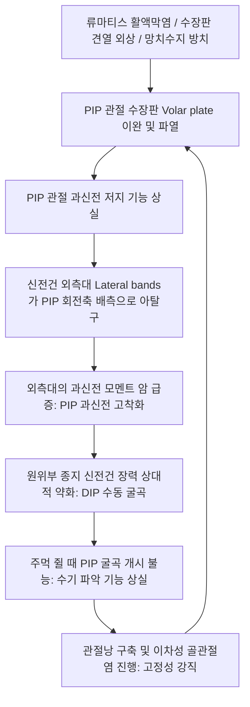

# 🖐️ [[백조목 변형]] (Swan-Neck Deformity)

> **핵심 3줄 요약 (Key Summary)**:
> - 📍 병소 부위 & 해부·병태생리: 손가락 수지관절에서 **근위지간관절(PIP joint)의 과신전(Hyperextension)**과 **원위지간관절(DIP joint)의 굴곡(Flexion)**이 복합된 특징적 손가락 기형. 수장판(Volar plate)의 이완·파열, 측부인대 파열, 또는 [[심지굴근]](FDP)·단추구멍 기전 불균형으로 인해 신전건 외측대(Lateral bands)가 PIP 관절 회전축 배측으로 비생리적 아탈구되어 발생.
> - 🚩 전형적 임상 양상: 손가락이 백조의 목처럼 굽어지는 변형, 손가락을 구부려 주먹을 쥐기 어려운 심각한 굴곡 장애(Loss of grasp), 초기에는 수동 정복 가능하나 만성화 시 PIP 관절 관절염 및 관절 강직(Fixed contracture) 진행.
> - 🛠️ 핵심 감별 검사 & 한·양방 다각적 치료 전략: Nalebuff 분류(1~4형), intrinsic-plus test (Bunnell-Littler test), 단순 방사선(X-ray). [[팔사]](EX-UE9)·[[합곡]](LI4)·[[양계]](LI5) 전침, 수부 내재근 이완 추나, 소염·어혈 약침, 은환 보조기(Silver ring splint) 처방.
> - ⚠️ 응급 의뢰 레드플래그: 고정성 강직(Nalebuff Type 4), 류마티스성 활액막염에 의한 수지 굴근건 급성 파열, 극심한 관절 파괴 동반 시 관절 고정술/성형술 정형외과 의뢰.

---

## 📌 목차
1. [질환 개요 & 해부학적 병태생리](#1-질환-개요--해부학적-병태생리)
2. [병태생리 메커니즘 & 생체역학적 악순환 네트워크](#2-병태생리-메커니즘--생체역학적-악순환-네트워크)
3. [임상 증상 & 이학적 검사(Physical Exam) 알고리즘](#3-임상-증상--이학적-검사physical-exam-알고리즘)
4. [감별 진단 매트릭스 (Differential Diagnosis)](#4-감별-진단-매트릭스-differential-diagnosis)
5. [한의 통합 치료 프로토콜 (침·약침·추나·한약)](#5-한의-통합-치료-프로토콜-침약침추나한약)
6. [양방 치료 & 병용·의뢰 기준 (Conventional Treatment & Referral)](#6-양방-치료--병용의뢰-기준-conventional-treatment--referral)
7. [재활 운동 & 생활습관 티칭 가이드](#7-재활-운동--생활습관-티칭-가이드)
8. [💡 사용자 진료실 핵심 필기 & 임상 노하우 (Melt-In 잔여 심화 집약)](#8--사용자-진료실-핵심-필기--임상-노하우-melt-in-잔여-심화-집약)
9. [출처 및 학술 참고 문헌 (References)](#9-출처-및-학술-참고-문헌-references)

---

## 1. 질환 개요 & 해부학적 병태생리

![[백조목변형_01_환부실사_류마티스수지.jpg|480]]
> [그림 1: ① 질환/병태생리 임상 실사 — 류마티스 관절염 환자의 백조목 변형] 제2~4수지 근위지간관절(PIP)의 병적 과신전과 원위지간관절(DIP)의 굴곡 구축 소견.

* **질환 정의 및 개념**:
  * 백조목 변형(Swan-Neck Deformity)은 수지(손가락)의 **근위지간관절(Proximal Interphalangeal, PIP)이 과신전**되고, **원위지간관절(Distal Interphalangeal, DIP)이 굴곡**되는 3차원적 수지 변형 장애이다.
  * 단독 외상(망치수지 방치, 수장판 파열)으로 발생하기도 하지만, 대부분 **[[류마티스 관절염]](Rheumatoid Arthritis, RA)**, 전신성 홍반성 루푸스(SLE), 또는 뇌성마비와 같은 중추신경계 경직 질환의 합병증으로 발생한다([Pfanner S, 2025](https://pubmed.ncbi.nlm.nih.gov/39521583/)).
* **해부학적 기전과 구조적 붕괴**:
  * **수장판(Volar Plate)의 파열 또는 신장**:
    * 정상 상태에서는 PIP 관절 바닥의 섬유연골성 수장판이 관절의 과신전을 기계적으로 저지함.
    * 류마티스성 만성 활액막염으로 수장판과 보조 측부인대가 파괴되면 PIP 과신전이 통제 불능이 됨.
  * **신전건 외측대(Lateral Bands)의 배측 전위(Dorsal Subluxation)**:
    * PIP 관절이 과신전되면 양측으로 주행해야 할 외측대가 PIP 관절 굴곡-신전 회전축의 **배측(Dorsal)으로 튀어 올라감**.
    * 이로 인해 외측대의 장력이 PIP 관절 과신전을 더욱 강화하는 반면, DIP 관절 종지부의 신전건은 느슨해져 DIP 굴곡 기형이 유발됨([Lim JX, 2025](https://pubmed.ncbi.nlm.nih.gov/39521587/)).

---

## 2. 병태생리 메커니즘 & 생체역학적 악순환 네트워크

![[백조목변형_01_수지변형_도해.png|480]]
> [그림 2: ② 관련 해부 구조물 — 백조목 변형의 건 장력 불균형 도해] PIP 수장판 파열로 외측대가 배측으로 탈구되어 PIP 과신전과 DIP 굴곡이 고착되는 생체역학적 악순환 모식도.

### 1) Nalebuff 분류 체계 (Stages of Severity)
* **Type 1**: 모든 자세에서 PIP 관절의 능동적·수동적 굴곡이 완전히 가능한 유연한 초기 상태.
* **Type 2**: 중수수지관절(MCP)을 굴곡시키면 PIP가 굴곡되나, MCP를 신전하면 내재근 구축으로 PIP 굴곡이 제한되는 상태 (Intrinsic tightness).
* **Type 3**: MCP 자세와 무관하게 PIP 관절 굴곡이 제한되나, X-ray상 관절면 파괴는 없는 상태.
* **Type 4**: PIP 관절의 심각한 관절염, 골 파괴 및 완전 고정성 강직 상태([Nakayama M, 2025](https://pubmed.ncbi.nlm.nih.gov/39860324/)).

---

## 3. 임상 증상 & 이학적 검사(Physical Exam) 알고리즘

![[류마티스관절염_척측편위_단추구멍변형_임상.jpg|480]]
> [그림 3: ③ 이학적 검사 및 감별 — 류마티스 수지 변형 임상 양상] 류마티스 관절염에서 동반되는 MCP 척측 편위, 단추구멍 변형 및 백조목 변형의 수부 임상 소견.

### 1) 주요 임상 증상
* **파악 장애 (Loss of Grasp)**:
  * 정상적으로 주먹을 쥘 때는 PIP 관절이 먼저 구부러져야 하나, 외측대가 배측에 걸려 있어 **손가락을 굽히지 못하고 헛도는 스냅(Snapping) 현상** 발생.
* **통증 및 부종**:
  * 초기에는 관절염에 의한 국소 활액막 열감과 종창, 진행 시 건 마찰통.
* **외관상 백조목 모양 기형**: 수지의 심미적 손상 및 일상생활 자가 관리 저하.

### 2) 필수 이학적 검사법
* **버넬-리틀러 검사 (Bunnell-Littler / Intrinsic Tightness Test)**:
  * 1단계: 검사자가 MCP 관절을 신전시킨 상태에서 PIP 관절의 수동 굴곡 각도 측정.
  * 2단계: MCP 관절을 굴곡시킨 상태에서 PIP 관절의 수동 굴곡 각도 측정.
  * **판정**: MCP 굴곡 시 PIP가 잘 구부러지지만 MCP 신전 시 PIP가 전혀 구부러지지 않는다면 **내재근 구축(Intrinsic muscle tightness)**에 의한 백조목 변형으로 확진.
* **수장판 안정성 평가**: PIP 관절을 신전 방향으로 부드럽게 밀었을 때 0도 이상 과도하게 꺾이는 과신전성(Hyperextensibility) 확인.

---

## 4. 감별 진단 매트릭스 (Differential Diagnosis)

| 감별 질환 | PIP 관절 상태 | DIP 관절 상태 | 원인 병리 및 기전 |
| :--- | :--- | :--- | :--- |
| **[[백조목 변형]]** | **과신전 (Hyperextension)** | **굴곡 (Flexion)** | 수장판 파열, 외측대 배측 탈구, 내재근 구축 |
| **[[단추구멍 변형]](Boutonniere)** | **굴곡 (Flexion)** | **과신전 (Hyperextension)** | 중앙 건단(Central slip) 파열, 외측대 장측 탈구 |
| **[[망치 수지]](Mallet Finger)** | 정상 (또는 보상적 과신전) | **굴곡 (Flexion)** | DIP 신전건 종지부 단순 단열/견열 골절 |
| **방아쇠 수지 (Trigger Finger)** | 일시적 굴곡 고정 | 정상 | A1 도르래 협착, 건 결절 걸림 |
| **뒤퓌트랑 구축 (Dupuytren)** | 굴곡 구축 (신전 불능) | 굴곡 구축 | 수장 건막의 결절성 섬유화 단축 |

---

## 5. 한의 통합 치료 프로토콜 (침·약침·추나·한약)

![[수부질환_05_수부침치료실사_수지침.jpg|480]]
> [그림 4: ④ 한의 치료 술기 실사 — 수부 경혈 및 지간관절 침구 치료] 팔사, 합곡 및 병변 지간관절 주변에 미세 호침을 자입하여 활액막 염증을 흡수하고 굴근건 활주를 유도하는 시술.

### 1) 침구 치료 & 미세 전침 요법
* **핵심 혈위 선혈**:
  * **국소 수부 혈위**: [[팔사]](EX-UE9, 지간 관절 사이), [[합곡]](LI4), [[중저]](TE3), [[후계]](SI3), [[노궁]](PC8).
  * **전완 근막 혈위**: [[외관]](TE5), [[내관]](PC6), [[수삼리]](LI10).
* **미세 전침 자극**:
  * 병변 수지의 팔사혈과 중저혈에 **2Hz 저주파 펄스**를 15분간 통전하여 골간근(Interossei) 및 충양근(Lumbricals)의 과도한 경직을 완화.

### 2) 약침 요법 (Pharmacopuncture)
* **제제 처방**:
  * **황련해독탕 약침 / 봉약침(Sweet BV)**: 류마티스성 활액막염 및 관절 종창이 심한 급성기에 PIP 관절낭 측면에 0.1~0.2cc 미량 주입.
  * **신바로 약침 / 자하거 약침**: 만성 인대 이완 및 건 조직 영양 공급을 위해 수장판 주변 결합조직에 주입.

### 3) 수부 관절가동 추나 & 건 글라이딩 기법
* **외측대 정복 글라이딩 수기**:
  * PIP 관절을 가볍게 굴곡시킨 상태에서 배측으로 탈구된 외측대를 수평-장측 방향으로 부드럽게 쓸어내리는 근막 이완 수기 적용.
* **내재근 신장 수기**: MCP 관절을 신전한 상태에서 PIP 및 DIP를 동시에 굴곡시키는 스트레칭을 통해 단축된 골간근 이완.

### 4) 한약물 요법
* **풍한습비·관절종통형(風寒濕痺型)**: 관절 조조강직, 부종 $\rightarrow$ [[대강활탕]](大羌活湯), [[계지작약지모탕]](桂枝芍藥知母湯).
* **담어호결·관절기형형(痰瘀互結型)**: 수지 변형 고착, 골극 $\rightarrow$ [[신통축어탕]](身痛逐瘀湯) 합 [[이진탕]](二陳湯).
* **간신부족·기혈양허형(肝腎不足型)**: 만성 관절 파괴, 무력 $\rightarrow$ [[독활기생탕]](獨活寄生湯).

---

## 6. 양방 치료 & 병용·의뢰 기준 (Conventional Treatment & Referral)

* **보존적 치료 및 스플린트 (Splinting)**:
  * **은환 보조기 (Silver Ring Splint)**: PIP 관절의 과신전만 차단하고 굴곡은 자유롭게 허용하는 8자형 링 보조기로 Type 1~2에서 매우 효과적.
* **류마티스 내과 약물 치료 병용**:
  * DMARDs(Methotrexate) 및 생물학적 제제(TNF-alpha 저해제) 복용 환자의 경우 약물 유지를 기본으로 한의 침구 보존 치료 병용.
* **수술적 치료 적응증 (Surgical Indication)**:
  * **연부조직 재건술**: 외측대 장측 이전술(Lateral band relocation), 나선사선인대 재건술(SOR reconstruction) - Type 1~2.
  * **관절 성형술 및 고정술(Arthrodesis)**: 관절 파괴가 비가역적인 Type 3~4 환자에서 PIP 관절을 기능적 각도(30~40도 굴곡위)로 영구 고정.
* **정형외과 의뢰 기준**:
  * 은환 보조기 착용에도 PIP 굴곡이 전혀 되지 않는 Type 3 이상 고정성 강직.

---

## 7. 재활 운동 & 생활습관 티칭 가이드

![[손목과사용증후군_07_손목신전스트레칭.jpg|480]]
> [그림 5: ⑤ 재활 운동 — 전완 및 수부 신근 스트레칭] 손가락 건의 긴장을 완화하고 균형 잡힌 신전-굴곡 장력을 회복하는 자가 스트레칭.

![[손목과사용증후군_07_수부스트레칭.jpg|480]]
> [그림 6: ⑥ 재활 운동 — 수지 내재근 글라이딩 자가 운동] 손가락 마디를 단계별로 굽히며 외측대의 정상 궤도 회복을 유도하는 능동 운동.

### 1) 수지 자가 재활 운동 프로토콜
* **능동 보조 PIP 굴곡 운동**:
  * 반대쪽 손으로 MCP 관절을 90도 굽힌 채 고정하고, 아픈 손가락의 PIP 관절만 스스로 구부리는 연습을 10회 3세트 반복.
* **점토 쥐기 훈련 (Theraputty Exercise)**:
  * 부드러운 치료용 점토를 손가락 끝으로 쥐었다 펴며 지굴근의 협응력 재교육.

### 2) 보조기 착용 및 일상 수칙
* **은환 보조기 착용**: 작업 및 일상생활 중 PIP 과신전이 일어나는 동작을 억제하여 외측대의 배측 유착을 예방.
* **온수욕 마사지**: 기상 직후 38~40도 미온수에 손을 10분간 담그며 관절 강직 완화 후 운동 시작.

---

## 8. 💡 사용자 진료실 핵심 필기 & 임상 노하우 (Melt-In 잔여 심화 집약)

> [!TIP] **진료실 임상 진단 & 티칭 노하우**
> 1. **초기 가동성 평가(Type 1 vs Type 3)가 치료 성패를 가른다**:
>    - 환자가 손가락이 꺾여서 왔을 때 검사자의 손으로 PIP를 살짝 밀었을 때 굴곡이 쉽게 된다면(Type 1) 침 치료와 보조기만으로 정상 기능을 100% 회복할 수 있다. 하지만 이미 딱딱하게 굳어 꿈쩍도 안 한다면(Type 3~4) 침 치료로 호전되기 어려우며 수술적 고정술을 고려해야 함을 솔직하게 고지해야 한다([Pfanner S, 2025](https://pubmed.ncbi.nlm.nih.gov/39521583/)).
> 2. **망치수지(Mallet Finger)의 나비효과 경고**:
>    - 손가락 끝을 다친 망치수지 환자가 "손끝만 살짝 쳐졌는데 그냥 살지 뭐" 하고 부목을 풀고 방치하면, 몇 달 뒤 손가락 중간 마디가 위로 꺾이며 백조목 변형으로 악화된다. DIP 신전건 단열 환자에게 백조목 변형으로의 진행 위험을 반드시 경고하고 6~8주 연속 부목 고정을 철저히 지키도록 해야 한다.
> 3. **골간근 압통점 자침의 드라마틱한 효과**:
>    - 백조목 변형 환자의 손등 뼈 사이(골간근 부위, 중저·팔사 혈 부근)를 꾹 눌러보면 극심한 압통 띠가 만져진다. 이곳에 0.20mm 얇은 침으로 자침하여 내재근 경직을 풀어주면 뻣뻣했던 손가락이 부드럽게 쥐어지는 즉각적인 관절 가동성 개선을 환자가 직접 체감한다.

---

## 9. 출처 및 학술 참고 문헌 (References)

1. Pfanner S, et al. Swan-Neck and Boutonniere Deformity in Rheumatoid Hand. *Hand Clin*. 2025;41(1):55-67. [PMID: 39521583](https://pubmed.ncbi.nlm.nih.gov/39521583/)
   - [연구 요약]: 류마티스 수부 병변에서 백조목 변형과 단추구멍 변형의 생체역학적 대조 기전, Nalebuff 병기별 비수술적 보조기 및 수술적 재건술의 체계적 치료 알고리즘.
2. Lim JX, et al. Assessment of Progressive Hand and Wrist Deformities in the Rheumatoid Patient. *Hand Clin*. 2025;41(1):21-33. [PMID: 39521587](https://pubmed.ncbi.nlm.nih.gov/39521587/)
   - [연구 요약]: 류마티스 관절염 환자에서 수지 신전건 및 수장판의 진행성 파괴 양상, 초기 기능적 평가와 조기 중재의 중요성 분석.
3. Nakayama M, et al. Trends in Rheumatoid Hand Surgery: Indications, Techniques, and Outcomes. *J Clin Med*. 2025;14(2):380. [PMID: 39860324](https://pubmed.ncbi.nlm.nih.gov/39860324/)
   - [연구 요약]: 현대 생물학적 제제 시대의 류마티스 수부 변형 수술 트렌드, 관절 보존술과 인공관절 치환술 및 기능 회복 결과 추적 조사.
