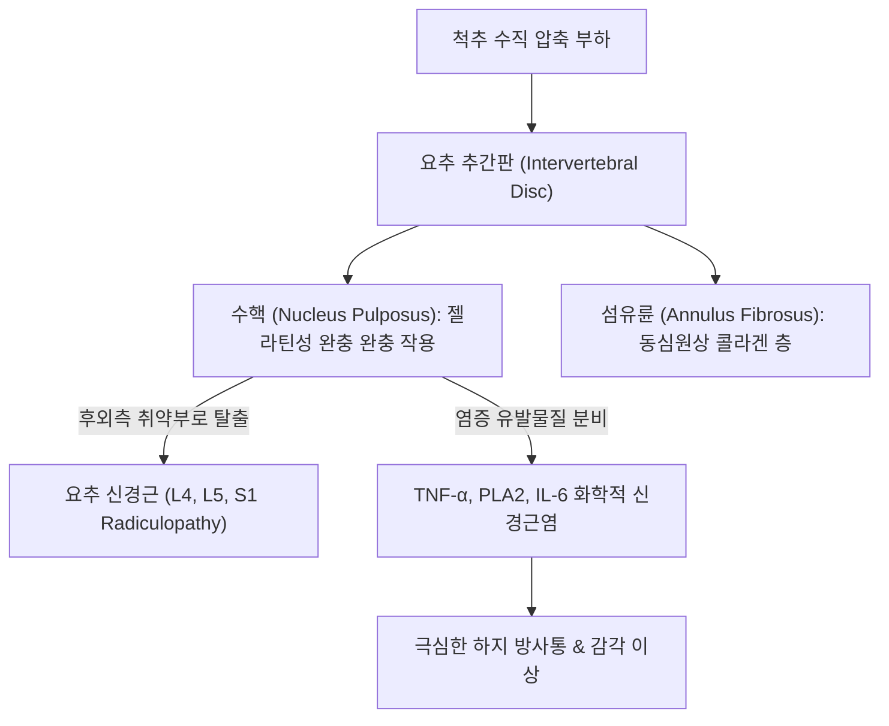

---
aliases:
  - 척추 추간판 탈출증
  - 요추 추간판 탈출증
  - 디스크
  - 추간판 탈출증
  - Lumbar Disc Herniation
  - LDH
---
# 🩺 [[요추 추간판 탈출증]] (Lumbar Disc Herniation, LDH)

> **핵심 요약 (Key Summary)**:
> 🎯 정의: 요추 추간판의 윤상인대(섬유륜)가 파열되거나 퇴행성 마모로 수핵(Nucleus Pulposus)이 탈출하여 요추 신경근이나 마미총을 자극·압박하는 질환.
> 🚩 핵심 기전: 기계적 압박 자체보다 탈출된 수핵 물질이 유발하는 화학적 염증 반응(TNF-α, 인지질가수분해효소 A2)이 극심한 방사통의 본질이며, 주로 [[L5]] 및 [[S1]] 신경근 분절에서 호발.
> 🔍 주소증: 기침이나 복압 상승 시 격화되는 요통, 편측 둔부 및 대퇴 후외측에서 하퇴·족부로 뻗치는 찌릿한 방사통, [[하지직거상 검사]](SLR) 양성 및 발가락 신전/족저굴곡 근력 저하.
> ⚠️ 운동 역학: 요추 신전은 후관절을 닫고 추체 간격을 넓혀 디스크 내 음압을 유도해 수핵 정복을 돕지만, 무분별한 굴곡 운동은 양압을 형성하여 섬유륜 파열과 탈출을 가속하므로 금기.

![[요추디스크_수핵탈출_MRI_및_탈출형태.png|420]]
> [그림 1: 요추 디스크 수핵 탈출 모식도 및 MRI 소견 - 수핵의 후외측 탈출로 인한 요추 신경근 압박 및 시상면 T2 강조영상에서의 추간판 탈출 병변]

---

## 📌 목차
1. [기본 정보 및 정의](#1-기본-정보-및-정의)
2. [원인 및 발병 기전](#2-원인-및-발병-기전)
3. [임상 증상 및 단계별 진행](#3-임상-증상-및-단계별-진행)
4. [진단 및 감별 진단](#4-진단-및-감별-진단)
5. [현대의학적 치료 및 약물 요법](#5-현대의학적-치료-및-약물-요법)
6. [한의학적 진단 및 복합 치료 전략](#6-한의학적-진단-및-복합-치료-전략)
7. [임상 다빈도 의안 및 치료 프로토콜](#7-임상-다빈도-의안-및-치료-프로토콜)
8. [출처 및 현대 학술 연구 요약 (References)](#8-출처-및-현대-학술-연구-요약-references)

---

## 1. 기본 정보 및 정의

### (1) 요추 추간판(Intervertebral Disc)의 해부학적 구조
* **수핵 (Nucleus Pulposus)**: 디스크 중앙에 위치한 친수성 프로테오글리칸(Proteoglycan)과 Type II 콜라겐 중심의 젤라틴성 수핵으로, 척추에 가해지는 수직 압축력을 유압식으로 흡수·분산함.
* **섬유륜 (Annulus Fibrosus)**: 수핵을 양파 껍질처럼 동심원상으로 감싸는 질긴 Type I 콜라겐 섬유 다발로, 척추의 회전 및 전단력에 저항함. 후외측 부위는 후종인대의 지지가 약하고 섬유층이 얇아 파열에 가장 취약함.
* **연골 종판 (Cartilaginous Endplate)**: 척추체와 수핵 사이에 위치하여 추체 골수강으로부터 수핵으로 포도당 및 산소를 확산 공급하는 무혈관성 영양 공급 통로.

---

## 2. 원인 및 발병 기전

### (1) 화학적 신경근염 (Chemical Radiculitis) vs 기계적 압박
* **화학적 염증 반응이 통증의 핵심**: 단순한 물리적 신경근 압박만으로는 저림과 무감각만 유발될 뿐 극심한 작열통이나 전격통은 발생하지 않음.
* **수핵 물질의 자가면역원성**: 혈관망과 차단되어 있던 수핵의 프로테오글리칸과 세포외 기질이 섬유륜 파열로 경막외강에 노출되면, 체내 면역계가 이를 항원으로 인식하여 대식세포 침윤과 함께 인지질가수분해효소 A2(Phospholipase A2), TNF-α, 프로스타글란딘 E2(PGE2)를 폭발적으로 방출하여 격렬한 신경근염을 촉발함.

### (2) 신전 운동과 굴곡 운동의 생체역학
* **신전 운동의 이점**:
  * 요추를 신전(Extension)시키면 후관절의 압력이 증가하여 후관절이 닫히고, 전방 추체 사이 간격이 벌어지면서 디스크 내부 전방에 음압(Negative Pressure)이 형성됨.
  * 음압에 의해 후방으로 밀려났던 수핵이 전방 중심부로 정복(Reduction)되는 기계적 흡인력이 발생함.
* **굴곡 운동의 위험성**:
  * 요추를 전방으로 굴곡(Flexion)하면 추체 전방 간격이 좁아지고 후방 간격이 넓어지며 디스크 내부에 강력한 양압(Positive Pressure)이 형성됨.
  * 양압으로 인해 수핵이 후외측 파열부로 더욱 강하게 밀려나가 섬유륜 파열과 신경근 압박이 악화됨.
  * 따라서 요추 변위 및 디스크 탈출 상태를 고려하지 않은 무분별한 굴곡 스트레칭(예: 윗몸 일으키기, 서서 발끝 닿기)은 절대 금기임.

### (3) 디스크 퇴행과 척추관 협착증의 연계 기전
* 추간판 탈출이 만성화되어 디스크 내부 수분과 수핵 부피가 감소하면(Degenerative Disc Disease), 디스크가 완충해야 할 하중이 후방 척추경과 후관절로 전이됨.
* 과부하를 받은 후관절과 척추체 연골에 비정상적인 골극(Osteophyte)이 형성되고 황색인대가 보상성으로 두꺼워지면서 점차 척추관이 좁아지는 [[척추관 협착증]]으로 진행됨.
* 또한 고관절 굴곡근([[장요근]])이나 표면 척추기립근이 과긴장·단축되면 요추 전만 이상과 척추 수직 압박력이 더욱 증가하여 협착증으로의 악화 속도가 가속화됨.

![[요추디스크_섬유륜형_병태해부도.png|420]]
> [그림 2: 요추 디스크 섬유륜형 병태해부도 - 섬유륜의 방사형 파열 및 주변 신경 혈관 반응]

### (4) 추간판 탈출의 해부학적 분류
* **1) 섬유륜형 (Annular Tear Type)**:
  * 허리를 삐끗하며 급성으로 섬유륜 외측 신경(동척추신경)이 자극되어 극심한 요통과 하지 방사 패턴이 급작스럽게 나타남.
* **2) 수핵형 (Nuclear Herniation Type)**:
  * 장시간 운전, 좌식 생활, 반복된 무거운 노동 후 점진적으로 수핵이 이동하여 발생하는 만성 진행성 패턴.
* **3) 탈출 방향별 분류**:
  * **후외측 탈출 (Posterolateral)**: 가장 호발(90% 이상). 후종인대 외측의 가장 취약한 부위를 뚫고 나와 하위 주행 신경근(Traversing nerve root)을 압박.
  * **중앙부 후방 탈출 (Central Posterior)**: 척추관 중앙으로 탈출하여 양측 하지 방사통 및 심한 경우 마미총(Cauda equina)을 압박하여 배뇨·배변 장애 유발.
  * **전방 돌출 (Anterior Protrusion & Limbus Vertebra)**: 추체 전방 골구조가 약해지며 전방으로 탈출. 중부 흉추나 상부 요추에서 척추 종말판이 마모되어 전상방 골편이 분리되는 연연골(Limbus vertebra) 형성.
  * **수직형 탈출 (Vertical Herniation & Schmorl's Node)**: 연령 증가나 골밀도 저하로 종판이 파열되어 수핵이 척추체 뼈 속으로 파고 들어간 쉬모를 결절(Schmorl's node).
  * **환상형 골극 (Ring Apophysis Osteophyte)**: 추체 퇴행화로 상하 골극이 융합되어 디스크 가동성이 상실되는 형태.

![[요추디스크_전방돌출_연연골_limbus_vertebra.png|450]]
> [그림 3: 요추 디스크 전방 돌출 연연골(Limbus vertebra) 도해 및 단순 방사선 X-선 영상 소견]

![[요추디스크_수직형_쉬모를결절_Schmorl_node.png|450]]
> [그림 4: 수핵의 수직형 탈출 쉬모를 결절(Schmorl's node) 도해 및 척추체 단면 소견]

---

## 3. 임상 증상 및 단계별 진행

### (1) 주소증 및 방사통의 특징
* **요통 및 편측 하지 방사통 (Sciatica)**: 둔부에서 시작하여 허벅지 뒤쪽/외측, 종아리, 발등 또는 발바닥까지 전기가 통하듯 찌릿하게 뻗치는 좌골신경통.
* **복압 상승 시 악화 (Valsalva Sign)**: 기침, 재채기, 배변 시 복압이 상승하면서 경막외 정맥총 내압이 올라가 디스크를 뒤로 밀어 방사통이 급격히 유발됨.
* **통증 회피 자세 (Sciatic Scoliosis)**: 신경근 압박을 피하기 위해 환자가 무의식적으로 통증 반대쪽으로 허리를 기울이는 방어적 측만 자세.

### (2) 신경근(Nerve Root) 분절별 임상 증상 감별

| 이환 신경근 | 주 탈출 부위 | 감각 이상 구역 | 근력 약화 지표 (Motor Deficit) | 건반사 변화 (Reflex) |
| :--- | :--- | :--- | :--- | :--- |
| **[[L4]] 신경근** | L3-L4 디스크 | 대퇴 전면 및 하퇴 내측면, 무릎 안쪽 | [[대퇴사두근]] 약화 (슬관절 신전 곤란, 주저앉음) | 슬개건 반사 (Patellar) 감소 |
| **[[L5]] 신경근** (최호발) | L4-L5 디스크 | 하퇴 외측, 발등, 엄지발가락(제1지) | [[전경골근]], 장무지신근 약화 (**발뒤꿈치 보행 불능**, Foot drop) | 건반사 변화 거의 없음 |
| **[[S1]] 신경근** (호발) | L5-S1 디스크 | 종아리 후면, 발 외측연, 새끼발가락(제5지), 발바닥 | 비복근, 가자미근 약화 (**발끝 보행/까치발 불능**) | 아킬레스건 반사 (Achilles) 소실 |

---

## 4. 진단 및 감별 진단

### (1) 특이적 이학적 유발 검사
* **[[하지직거상 검사]](SLR Test, Straight Leg Raising Test)**:
  * 앙와위에서 무릎을 편 채 다리를 서서히 들어 올릴 때 30°~70° 사이에서 환측 하퇴부로 뻗치는 방사통이 재현되면 양성.
  * **건측 하지직거상 검사 (Crossed SLR)**: 반대쪽(정상) 다리를 들어 올릴 때 환측 다리에 방사통이 유발되는 현상으로, 거대 수핵 탈출이나 중앙 탈출을 시사하는 극히 특이도 높은 소견(특이도 > 90%).
* **[[브라가드 검사]](Bragard Test)**:
  * SLR 검사에서 통증이 나타난 각도에서 다리를 살짝 내린 뒤, 발목을 급격히 족배굴곡(Dorsiflexion)시킬 때 통증이 다시 유발되면 진성 좌골신경근 병증 확인.
* **[[슬럼프 검사]](Slump Test)**:
  * 환자를 앉힌 채 목과 흉요추를 구부리고 무릎을 펴며 발목을 젖힐 때 척수 경막의 긴장도를 극대화하여 신경근 압박을 유발하는 민감도 높은 검사.
* **[[대퇴신경 신장 검사]](Reverse SLR / Femoral Nerve Stretch Test)**:
  * 복와위에서 무릎을 90° 굴곡한 뒤 고관절을 신전시킬 때 대퇴 전면부로 방사통이 발생하면 상부 요추([[L2]], [[L3]], [[L4]]) 신경근 병증 진단.

![[요추신경총_분지도해_장골하복신경_음부대퇴신경.png|420]]
> [그림 5: 요추 신경총(Lumbar Plexus) 분지도해 - 척추 분절별 신경 주행과 장골하복, 장골서혜, 음부대퇴, 외측대퇴피, 복재, 폐쇄, 대퇴신경]

### (2) 요추 분절 신경 포착 감별 요령 (진료실 핵심 팁)
* **장골능 [[상둔피신경]] 과민성**: 장골능 외측을 압진하여 심한 압통이 촉지되면 상부 요추 분절의 불안정성 및 디스크 연관통 강력 시사.
* **서혜부 따끔거림 및 저림**: [[장골하복신경]](T12-L1), [[장골서혜신경]](L1) 포착 의심.
* **생식기, 고환 및 성교통**: [[음부대퇴신경]](L1-L2) 음부가지 포착 의심.
* **허벅지 전외측 타는 듯한 작열통**: [[외측대퇴피부신경]](L2-L3) 포착 ([[이상감각성 대퇴신경통]], Meralgia Paresthetica).
* **보행 시 무릎 힘풀림 및 내전 장애**: [[대퇴신경]](L2-L4), [[폐쇄신경]](L2-L4) 마비 감별.
* **무릎 안쪽 및 하퇴 내측 찌릿함**: [[복재신경]](Saphenous nerve) 포착 감별.

### (3) 영상 의학적 진단
* **MRI 검사 (표준 확진 진단)**:
  * T2 시상면 및 축상면 영상에서 탈출의 단계(팽륜 Bulging $\rightarrow$ 돌출 Protrusion $\rightarrow$ 탈출 Extrusion $\rightarrow$ 격리 Sequestration) 정밀 평가.
  * 신경근의 압박(Abutment, Compression, Deviation) 및 신경공 협착 정도 확인.
* **단순 X-선 (X-ray)**: 추간판 간격 협소화, 척추 불안정성(굴곡-신전 뷰), 골극 형성 및 척추 측만 상태 확인.

### (4) 핵심 감별 진단 표

| 감별 질환 | 호발 연령 및 병력 | 통증 악화/완화 자세 | 신경학적 결손 및 이학적 검사 | 영상 특징 |
| :--- | :--- | :--- | :--- | :--- |
| **[[요추 추간판 탈출증]]** | 20~50대 활동기 | **허리 굴곡, 앉기, 기침 시 악화** / 보행 시 완화 | [[하지직거상 검사]] 양성, 분절성 근력 약화 | MRI 상 디스크 탈출 및 신경근 압박 |
| **[[척추관 협착증]]** | 60대 이상 고령층 | **허리 신전, 보행 시 악화** / 허리 굴곡(쇼핑카트) 시 완화 | 간헐적 파행(NIC), SLR 음성 | 척추관 단면적 협소, 황색인대 비후 |
| **[[이상근 증후군]]** | 전 연령, 둔부 타박/좌식 | 고관절 내회전, 장시간 좌식 시 악화 | FAIR 검사 양성, 좌골신경 압박, 척추 검사 음성 | 요추 MRI 정상, 이상근 비대 |
| **[[후관절 증후군]]** | 50대 이상, 요추 과신전 | **허리 신전 및 회전 시 악화** / 굴곡 시 완화 | 방사통이 무릎 이하로 내려가지 않음 (연관통) | 후관절 비후 및 골관절염 소견 |

---

## 5. 현대의학적 치료 및 약물 요법

### (1) 보존적 치료 (초기 4~6주 우선 원칙)
* **약물 치료**:
  * 급성 염증 조절: [[세레콕시브]], [[록소프로펜]], [[이부프로펜]] 등 경구 NSAIDs.
  * 신경병증성 전격통 완화: [[프레가발린]](Lyrica), [[가바펜틴]](Neurontin).
  * 근육 연축 완화: 에페리손 등 근이완제 병용.
* **경막외 신경차단술 (Epidural Steroid Injection, ESI)**:
  * C-arm 투시하에 탈출된 신경근 주변으로 스테로이드와 국소마취제를 주입하여 급성 부종과 화학적 신경근염을 일시적으로 차단.

### (2) 수술적 치료 (적응증 엄격 적용)
* **절대적 응급 수술 적응증 (마미증후군, Cauda Equina Syndrome)**:
  * 방광 및 장 괄약근 조절 상실(요실금, 요폐, 대변실금), 회음부 안장 감각 소실(Saddle anesthesia), 진행성 족하수(Foot drop). 48시간 이내 긴급 감압술 필수.
* **선택적 수술**: 6~12주간의 체계적인 한의/양방 보존적 치료에도 극심한 통증이 지속되거나 운동 마비가 진행되는 경우 미세현미경하 디스크 절제술(Microdiscectomy) 또는 내시경 디스크 절제술(PELD/BESS) 시행.

---

## 6. 한의학적 진단 및 복합 치료 전략

### (1) 한의학적 병인 및 변증
* **기체혈어(氣滯血瘀)**: 무거운 물건을 들거나 허리를 삐끗한 후 어혈이 락맥을 막아 허리를 굽히거나 펴지 못하고 밤에 칼로 베는 듯 찌르는 통증.
* **한습저락(寒濕阻絡)**: 비를 맞거나 찬 바닥에 오래 누워 한습 사기가 허리와 다리로 침습하여 허리가 무겁고 시리며 날씨가 흐리면 악화.
* **간신휴허(肝腎虧虛)**: 만성 퇴행성 디스크로 간혈과 신정이 마르고 골격이 약화되어 척추를 지탱하지 못하고 다리가 가늘어지며 무력해짐.

### (2) 다각적 한의 임상 시술 전략
* **약침 요법 (Pharmacopuncture)**:
  * **신바로 약침**: 자생 한방병원 핵심 제제(청파전 유래)로 요추 화타협척혈 및 신경근 출구부에 주입하여 신경 재생 촉진 및 COX-2/iNOS 염증 억제.
  * **봉약침(BV)**: 멜리틴 성분을 통한 강력한 면역 조절 및 신경근 부종 감소 작용. 급성기 방사통 경감에 탁월.
* **침구 및 전침 치료**:
  * 주요 혈자리: 요양관, 신수, 대장수, 관원수, 화타협척혈, 환도, 지변, 위중, 양릉천, 현종, 곤륜.
  * 전침(Electroacupuncture): 협척혈과 환도-위중 간에 2~100Hz 혼합파를 통전하여 내인성 오피오이드(엔돌핀) 분비 촉진 및 좌골신경 흥분성 억제.
* **침도 요법 (Acupotomy)**: 요추 후관절낭 비후 및 요천추 인대(장요인대, 극간인대)의 섬유성 유착을 미세 박리하여 추간공 내압 감압.
* **처방 배오**:
  * 급성 염증 및 어혈기: [[서경탕]], [[당귀수산]], 활락단 가감.
  * 한습 및 척추 관절염: [[오적산]], 대강활탕.
  * 만성 퇴행 및 신경근 영양: [[독활기생탕]], 양혈장근건보환, 청파전.

### (3) 추나 요법 (Chuna Manual Therapy) & 척추 신장 기법
* **추력 기법 (High-Velocity Low-Amplitude, HVLA)**:
  * 추간판 수분이 적은 고령층이나 만성 퇴행성 환자에서 척추 후관절의 비정상적 가동 제한을 순간적인 추력으로 해제.
  * **분절별 회전 및 신전 자세 조절**: 교정 시 **요추 4번 분절은 회전 자세**, **요추 5번 분절은 신전 자세**로 위치시켜 관절낭을 보호하며 정렬.
* **신장 기법 및 견인 요법 (Stretching & Traction)**:
  * 추체와 추체 사이 간격을 늘려주어 후종인대를 긴장시키고 디스크 내부에 강력한 음압을 형성하여 수핵을 중심부로 빨아들이는 효과 발휘.
  * **Leg-over 신장 기법**: 측와위에서 골반과 대퇴부를 지렛대로 활용하여 요천추부 다열근과 장요근의 심부 긴장을 해제하고 신경공을 개대함.

![[요추추간판탈출증_추나요법_신장기법.png|450]]
> [그림 6: 요추 추간판 탈출증 추나요법 - 그림 3-112 신장 기법(어깨와 대전자 반대 방향 스트레칭) 및 그림 3-113 Leg-over 신장 기법 실사]

---

## 7. 임상 다빈도 의안 및 치료 프로토콜

### (1) 진료실 핵심 문진 체크리스트 & 응급 감별
* [ ] **마미증후군 Red Flags 확인**: 대소변 보기가 힘들거나 조절이 안 됩니까? 사타구니와 엉덩이 안쪽 감각이 무뎌졌습니까? (양성 시 즉각 응급 MRI 의뢰).
* [ ] **기침/재채기 방사통 유발 여부**: 기침할 때 다리로 전기가 찌릿 흐릅니까? (발살바 징후 양성 시 수핵 탈출 강력 시사).
* [ ] **보행 형태 확인**: 발뒤꿈치로 걸어보세요(L5 검사), 까치발로 서보세요(S1 검사). 족하수가 관찰되는가?

### (2) 단계별 한의 치료 및 재활 프로토콜
* **1단계: 급성 염증 통증 완화기 (1~2주차)**
  * **절대 안정 및 매켄지(McKenzie) 복와위 신전 자세**: 엎드려 누운 자세에서 통증이 없는 한도 내에서 팔꿈치로 상체를 받치며 요추 전만 유지.
  * 일체 굴곡 운동(스트레칭, 허리 굽히기) 절대 금지.
  * 화타협척혈 및 환도 혈 봉약침/신바로약침 (주 3회) + [[서경탕]] 또는 [[오적산]] 투약.
* **2단계: 신경 재생 및 척추 관절 정렬기 (3~6주차)**
  * 요추 간헐적 견인 치료 및 굴곡-신전 추나요법, Leg-over 신장 기법 적용.
  * 좌골신경 주행 경로(환도, 위중, 곤륜) 전침 치료 병행.
  * 침도요법으로 요천추 접합부 심부 인대 유착 박리.
* **3단계: 코어 강화 및 재발 방지기 (7~12주차)**
  * 맥켄지 신전 신장 운동 및 버드독(Bird-dog), 플랭크(Plank) 등 척추 중립 상태 코어 등척성 운동 지도.
  * [[독활기생탕]] 복용으로 척추 연골 및 신정(腎精) 보강.

---

## 8. 출처 및 현대 학술 연구 요약 (References)

* Deyo RA, Mirza SK. CLINICAL PRACTICE. Herniated Lumbar Intervertebral Disk. *N Engl J Med*. 2016;374(18):1763-1772.
  * [PMID: 27144851](https://pubmed.ncbi.nlm.nih.gov/27144851/)
  * [연구 요약] 요추 추간판 탈출증의 병태생리, 자연 경과 및 임상 지침을 총망라한 뉴잉글랜드 저널 오브 메디신(NEJM) 리뷰로, 신경근 압박 환자의 대다수에서 탈출된 수핵이 대식세포 포식 작용에 의해 자가 흡수(Resorption)되므로 마미증후군이 없는 한 조기 보존적 요법이 최선의 표준 치료임을 규명.
* Kreiner DS, Hwang SW, Easa JE, et al. North American Spine Society. An evidence-based clinical guideline for the diagnosis and treatment of lumbar disc herniation with radiculopathy. *Spine J*. 2014;14(1):180-191.
  * [PMID: 24239490](https://pubmed.ncbi.nlm.nih.gov/24239490/)
  * [연구 요약] 북미척추학회(NASS)의 요추 신경근병증 진료 지침으로, 하지직거상 검사(SLR)의 높은 민감도와 교차 직거상 검사(Crossed SLR)의 높은 특이도를 입증하고 보존적 약물/물리 치료와 주사 요법의 단계적 적용 알고리즘을 확립.
* Chen Y, et al. Efficacy of Governor Vessel-Based Acupuncture, Alone or in Combination with Other Therapies, for Acute Lumbar Disc Herniation: A Systematic Review and Meta-Analysis. *J Pain Res*. 2026;19:341-356.
  * [PMID: 41773272](https://pubmed.ncbi.nlm.nih.gov/41773272/)
  * [연구 요약] 급성 요추 추간판 탈출증 환자를 대상으로 독맥(Governor Vessel) 및 협척혈 기반 침 치료를 단독 또는 양방 통상 치료와 병용했을 때 통증 강도(VAS) 및 요추 기능 장애 지수(Oswestry Disability Index, ODI)를 유의하게 개선하고 진통제 복용량을 현저히 줄임을 입증한 최신 체계적 문헌고찰 및 메타분석.
