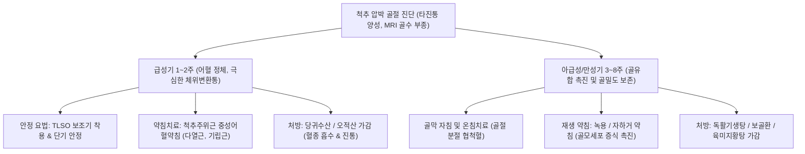

---
aliases:
  - 척추 압박 골절
  - 골다공증성 척추압박골절
  - Vertebral Compression Fracture
  - OVCF
  - 척추체 압박골절
  - 척추 골절
tags:
  - 이론
  - 근골격계질환
  - 척추질환
  - 골다공증
  - 골절
categories:
  - 근골격계 질환
  - 척추
created: 2024-01-21
updated: 2026-09-18
title: 척추 압박 골절
date: 2026-09-18
출처: "PMID: 42412248"
---

# 척추 압박 골절 (Vertebral Compression Fracture)

> **핵심 3줄 요약 (Key Summary)**:
> - 🎯 골다공증, 노화, 폐경 및 경미한 외상(낙상, 엉덩방아, 기침 등)으로 인해 척추체 전방 및 중앙부가 수직 축성 압박력을 견디지 못하고 찌그러지며 주저앉는 골다공증성 골절
> - 🚩 체위 변경 시(누웠다 일어날 때, 침대에서 돌아누울 때) 극심하게 악화되는 흉요추부 통증, 척추 극돌기 직접 타진 시 날카로운 골성 압통([[타진 검사]]), 진행성 척추 후만 변형(Kyphosis) 및 신장 감소 발현
> - 🔍 한의학적으로 골절(骨折), 요통(腰痛), 골위(骨痿)로 분류하며, 급성기 침상 안정 및 통증 제어를 위한 [[당귀수산]]·[[오적산]], 골유합 촉진 및 골밀도 보존을 위한 보골환·[[독활기생탕]] 투여와 척추주위근 소염약침·골막 자침 병행
> - ⚠️ 신경학적 결손(대소변 장애, 하지 마비) 동반 여부, 방사선상 척추체 후벽 붕괴(Burst fracture) 및 악성 종양성 병적 골절과의 감별 필수

---

## 목차 (Table of Contents)
- [[#1. 개요 및 역학 (Overview & Epidemiology)]]
- [[#2. 병태생리 및 척추체 붕괴 기전 (Pathophysiology & Biomechanics)]]
  - [[#2.1 골다공증과 척추체 주저앉음 메커니즘]]
  - [[#2.2 형태학적 골절 분류 (Genant Classification)]]
- [[#3. 임상 증상 및 특징적 통증 패턴 (Clinical Features)]]
- [[#4. 이학적 검사 및 영상의학적 진단 (Physical Examination & Diagnosis)]]
  - [[#4.1 척추 타진 검사 (Percussion Test)]]
  - [[#4.2 X-ray 및 MRI 신구 골절 감별]]
- [[#5. 감별 진단 (Differential Diagnosis)]]
- [[#6. 통합의학적 치료 전략 (Management Strategies)]]
  - [[#6.1 양방 의학적 치료 프로토콜 (보존 요법 & 척추성형술)]]
  - [[#6.2 한의학적 복합 치료 프로토콜 (골유합 & 보골 요법)]]
- [[#7. 진료실 핵심 임상 필기 (Clinical Pearls & Practice Tips)]]
- [[#8. 출처 및 학술 참고 문헌 (References)]]

---

## 1. 개요 및 역학 (Overview & Epidemiology)

### 1.1 정의 및 임상적 의의
[[척추 압박 골절]](Vertebral Compression Fracture, VCF)은 척추체를 구성하는 해면골(Cancellous bone)의 골소주(Trabeculae)가 골다공증이나 종양 등으로 인해 약화되어, 가벼운 외상(넘어짐, 엉덩방아, 무거운 물건 들기, 심한 기침 등)이나 심지어 일상적인 체중 부하만으로도 척추체 높이가 주저앉으며 발생하는 골절이다.
골다공증성 골절 중 가장 높은 발생 빈도를 보이며, 특히 운동성이 큰 흉추와 지지력이 큰 요추가 만나는 **흉요추 이행부(Thoracolumbar junction, T11~L2)**에서 70% 이상 집중 발생한다.

![[골다공증_척추압박골절_및_척추후만_병태도해.jpg|500]]
> [그림 1] 골다공증성 척추 압박 골절(OVCF)의 병태도해: 척추체 전방 쐐기형 압박 골절(Wedge deformity) 및 진행성 흉요추 후만 변형 기전

### 1.2 역학 및 호발 위험 인자
- **호발 연령 및 성별**: 65세 이상 고령자, 특히 폐경 후 여성에서 남성 대비 3~4배 이상 다발한다. 80세 이상 여성의 약 40% 이상에서 최소 1개 이상의 척추 압박 골절 병력을 가진다.
- **주요 위험 요인**: 골다공증(T-score ≤ -2.5), 조기 폐경, 장기 코르티코스테로이드 복용 환자, 비타민 D 결핍, 척추주위근([[다열근]], [[척추기립근]])의 근감소증(Sarcopenia), 과거 낙상 병력.
- **연쇄 골절 위험(Fracture Cascade)**: 한 분절의 척추 압박 골절이 발생하면 척추의 생체역학적 축이 전방으로 기울어(Kyphosis), 인접 상하 척추체에 3~5배의 하중이 추가 집중되어 1년 이내에 2차 골절이 발생할 위험이 5배 이상 급증한다.

---

## 2. 병태생리 및 척추체 붕괴 기전 (Pathophysiology & Biomechanics)

### 2.1 골다공증과 척추체 주저앉음 메커니즘
정상 척추체는 수평 및 수직 골소주가 격자 구조를 이루어 강력한 축성 하중을 분산한다. 그러나 골다공증이 진행되면 에스트로겐 결핍과 파골세포 활성화로 인해 수평 골소주가 먼저 소실되어 기둥 역할을 하는 수직 골소주가 좌굴(Buckling)된다.
- **전주(Anterior Column) 취약성**: 척추의 3열 지지 구조 중 전방 척추체는 굴곡 시 압박력을 주로 받는다. 일상 동작에서 몸을 앞으로 숙일 때 척추체 전방부에 축성 압박 하중이 집중되므로, 후방 피질골보다 전방 피질골이 먼저 찌그러지는 쐐기형 변형(Wedge fracture)이 가장 흔하게 발생한다.

### 2.2 형태학적 골절 분류 (Genant Semi-Quantitative Classification)
| 분류 형태 | 병태해부학적 특징 | 주 발생 기전 |
| :--- | :--- | :--- |
| **쐐기형(Wedge)** | 척추체 전방 높이만 20% 이상 감소, 후방 높이 보존 | 몸을 앞으로 숙이거나 기침할 때 전방 압박력 집중 |
| **양오목형(Biconcave)** | 척추체 중앙부 높이가 상하 연골 종판 붕괴로 감소 | 수핵의 압박에 의해 약해진 종판이 척추체 중앙으로 함입 |
| **압착형(Crush)** | 척추체 전방, 중앙, 후방 높이가 전체적으로 고르게 주저앉음 | 강한 수직 추락 손상(엉덩방아) 또는 중증 골다공증 |

---

## 3. 임상 증상 및 특징적 통증 패턴 (Clinical Features)

### 3.1 특징적 통증 양상
- **체위 변경 시 극심한 통증(Positional Pain)**:
  - 가만히 누워 안정을 취할 때는 통증이 완만하지만, **누웠다 일어날 때, 침대에서 옆으로 돌아누울 때(Rolling over), 앉았다 일어설 때** 골절편이 미세하게 흔들리며 날카로운 통증이 격발된다.
- **척추 정중선 통증 및 방사통**:
  - 골절된 척추 분절의 등 또는 허리 정중앙에 쥐어짜는 듯한 통증이 발생하며, 흉추 골절 시 갈비뼈를 따라 앞가슴 쪽으로 둘러싸는 듯한 늑간 신경통(Intercostal neuralgia) 양상의 방사통이 동반될 수 있다.
- **심호흡 및 기침 시 악화**: 기침, 재채기, 복압이 상승하는 배변 동작 시 복강 내압이 척추체로 전달되어 순간적인 격통이 유발된다.
- **외형적 체형 변화**: 척추체 전방 붕괴로 인해 등이 굽어지는 진행성 척추 후만증(Dowager's hump)이 나타나며, 키가 수 cm 이상 줄어든다.

---

## 4. 이학적 검사 및 영상의학적 진단 (Physical Examination & Diagnosis)

![[척추타진검사_1단계_흉추극돌기_수근타진_실사.png|500]]
> [그림 2] 척추 타진 검사(Spine Percussion Test) 1단계: 흉추 극돌기에 수근부를 이용한 직접 타진을 시행하여 골절부의 심부 골성 통증 유발 평가

### 4.1 척추 타진 검사 (Percussion Test)
- **검사 방법**: 환자를 엎드리게 하거나 가볍게 앞으로 숙인 좌위 상태에서, 검사자가 주먹의 소지구(수근부) 또는 타진기를 이용하여 상부 흉추부터 요추까지 극돌기(Spinous process)를 하나씩 가볍게 두드린다.
- **양성 반응**: 단순 근육통 환자는 시원하거나 둔한 느낌을 호소하는 반면, **급성 척추 압박 골절 환자는 골절 분절 극돌기를 두드리는 순간 찌르는 듯한 극심한 골성 통증(Bony tenderness)**을 호소하며 몸을 피한다.

![[척추타진검사_2단계_요추극돌기_골성타진_실사.png|500]]
> [그림 3] 척추 타진 검사 2단계: 요추 극돌기 부위의 주먹 타진을 통해 압박 골절과 단순 근막성 요통을 감별하는 실전 임상 수기

### 4.2 영상의학적 진단 (X-ray vs MRI)
- **단순 방사선 검사(X-ray AP/Lateral)**:
  - 척추체 전방 높이 감소, 쐐기형 변형, 피질골 연속성 소실 확인.
  - ⚠️ **방사선 검사의 한계**: 골절 직후 24~48시간 이내에는 골절선이나 높이 감소가 명확하지 않아 '정상'으로 오진될 수 있으며, 과거에 발생한 진구성(오래된) 골절과 급성 골절의 구분이 불가능하다.
- **자기공명영상(MRI - T1/T2/STIR 뷰) - 확진 기준**:
  - **급성 골절(Acute VCF)**: T1 강조영상에서 **저신호(검은색)**, T2 강조 및 지방억제(STIR) 영상에서 **현저한 고신호(하얀색 - 골수 부종, Bone marrow edema)**로 나타나 신선 골절을 100% 확진.
  - **진구성 골절(Old VCF)**: 척추체 높이는 감소되어 있으나 T1/T2 영상에서 골수 부종 없이 정상 골수 신호를 유지.

---

## 5. 감별 진단 (Differential Diagnosis)

| 질환명 | 호발 연령 및 기전 | 임상 증상 특징 | 영상의학적 감별 포인트 |
| :--- | :--- | :--- | :--- |
| **골다공증성 [[척추 압박 골절]]** | 65세 이상 고령, 경미 외상 | 체위 변경 시 격통, 극돌기 타진통 | 전주 붕괴, MRI T2/STIR 고신호 골수 부종 |
| **척추 파열 골절(Burst Fracture)** | 고에너지 추락/교통사고 | 신경 압박 증상, 하지 위약 | **후주(Posterior column) 파열, 척추관 내 골편 침범** |
| **전이성 악성 골절(Pathologic)** | 암 병력자, 50대 이상 | 지속적 야간통, 체중 감소, 발열 | 척추경(Pedicle) 파괴, 척추체 후방 돌출 팽륭 |
| **다발성 골수종(Multiple Myeloma)** | 60대 이상, 빈혈/신부전 동반 | 뼈 통증, 병적 압박 골절 | X-ray상 천공성 골결손(Punched-out lesion) |
| **급성 요추 염좌(L-Sprain)** | 전 연령, 무거운 물건 들기 | 근육 긴장, 휴식 시 완화 | 척추 극돌기 타진통 음성, X-ray 척추체 높이 정상 |

---

## 6. 통합의학적 치료 전략 (Management Strategies)

### 6.1 양방 의학적 치료 프로토콜
1. **보존적 급성기 치료 (1차 원칙)**:
   - **단기 침상 안정(Bed rest)**: 2~3일 이내로 제한(장기 침상 안정은 급격한 골소실과 폐렴, 혈전증 유발).
   - **척추 보조기(TLSO / Jewett brace)**: 체중 부하 시 골절 척추체의 전방 압박력을 차단하기 위해 8~12주간 착용.
   - 약물 치료: 급성 진통제(아세트아미노펜, 트라마돌, NSAIDs), 칼시토닌(골성 통증 억제), 골다공증 치료제(비스포스포네이트, 부갑상선호르몬 제제 테리파라타이드 투여로 골형성 촉진).
2. **시술적 치료 (경피적 척추성형술, Percutaneous Vertebroplasty / Kyphoplasty)**:
   - 2~3주 이상의 적극적 보존 치료에도 극심한 통증으로 거동이 불가능하거나, 척추체 붕괴가 50% 이상 진행되는 경우 고려.
   - 골절된 척추체 내로 바늘을 찔러 의료용 골시멘트(PMMA)를 주입하여 척추체를 즉각 안정화시킴.

### 6.2 한의학적 복합 치료 프로토콜
한의학에서는 척추 압박 골절을 골절(骨折), 요척통(腰脊痛), 신허요통(腎虛腰痛), 골위(骨痿)로 분류하며, 1단계(활혈거어 소종지통) $\rightarrow$ 2단계(접골속근 화어생신) $\rightarrow$ 3단계(보익간신 장근골)의 3단계 치법을 적용한다.

#### 1) 침구 치료
- **급성기 척추주위근 감압**: 골절된 척추 극돌기 직상방 자침은 피하고, 상하 1~2 분절의 화타협척혈(Hua Tuo Jia Ji) 및 방광경 신수(BL23), 기해수(BL24), 대장수(BL25) 혈위에 자침하여 2차적으로 경련을 일으킨 [[다열근]]과 [[척추기립근]]의 근긴장을 해소.
- **골막 자극술(아급성기)**: 골절 2~3주 후 골절 분절 외측 관절돌기 부위 골막에 침 끝을 가볍게 접촉(Periosteal pecking)하여 국소 혈류를 증가시키고 골모세포(Osteoblast)의 가골(Callus) 형성을 자극.

#### 2) 약침 요법
- **중성어혈약침 (급성기)**: 척추 골절 부위 주위 혈종과 염증을 삭이기 위해 골절 분절 양측 협척 부위에 1.0~2.0 cc 주입.
- **녹용 및 자하거 약침 (골유합기)**: 골기질 합성과 골소주 재형성을 촉진하기 위해 주 2~3회 협척혈 및 신수혈에 주입.

#### 3) 한약물 요법 (3단계 치법)
- **제1기 (어혈기, 1~2주)**: [[당귀수산]](當歸鬚散) 또는 복원활혈탕(復元活血湯)에 천궁, 홍화, 몰약을 가미하여 골절부 내출혈을 흡수하고 통증 억제.
- **제2기 (가골형성기, 3~5주)**: 산골(자연동, 自然銅), 속단(續斷), 골쇄보(骨碎補)를 가미한 정골자금단(正骨紫金丹) 또는 [[오적산]](五積散)으로 골모세포 분화 촉진.
- **제3기 (골재형성기, 6주 이후)**: [[독활기생탕]](獨活寄生湯) 합 육미지황탕(六味地黃湯)에 보골지(補骨脂), 두충(杜仲), 우슬(牛膝)을 가미하여 간신을 보하고 전신 골밀도를 보강.

#### 4) 안전 주의사항 및 추나 금기 (CRITICAL)
- ⚠️ **급성 압박 골절 부위의 고속저진폭(HVLA) 스러스트 추나 기법은 절대 금기(Absolute Contraindication)**이다. (골절편 전위 및 척수 손상 위험).
- 치료는 골반 및 하지 근막의 경도를 이완시키는 부드러운 근막 이완(Myofascial release) 기법 및 복와위 족부 견인 요법에 한정한다.

---

## 7. 진료실 핵심 임상 필기 (Clinical Pearls & Practice Tips)

### 7.1 진료실 감별 3대 핵심 포인트
1. **"돌아누울 때 비명이 나온다"는 병력의 특이성**:
   - 환자가 침대에서 옆으로 뒤척이거나 자세를 바꿀 때 허리가 끊어질 듯 아파서 비명을 지른다면, 단순 염좌가 아니라 99% 척추 압박 골절이다.
2. **척추 극돌기 주먹 타진(Percussion)의 정확도**:
   - 청진기 머리나 검사자의 주먹 소지구로 흉요추 극돌기를 위에서부터 아래로 톡톡 두드렸을 때, 특정 척추뼈 한 군데에서 "악!" 소리와 함께 튀어 오르면 즉시 압박 골절로 진단하고 정밀 영상(MRI)을 의뢰해야 한다.
3. **배변 시 과도한 힘주기 방지**:
   - 급성기 환자가 변비로 복압을 주면 척추체 붕괴가 추가 진행되므로, 반드시 완하제 처방이나 마자인환(麻子仁丸)을 병용하여 변을 무르게 유도해야 한다.

---

## 8. 출처 및 학술 참고 문헌 (References)

1. Musmar B, Abdalrazeq H, Momin A et al. (2026). Vertebral augmentation procedures for osteoporotic vertebral compression fractures: a network meta-analysis of randomized controlled trials. *Neurosurg Rev*, 49(1):312-325. [PMID: 42412248](https://pubmed.ncbi.nlm.nih.gov/42412248/)
   - [연구 요약]: 골다공증성 척추 압박 골절 환자에서 보존적 치료 대비 경피적 척추성형술(PVP)과 풍선 척추후굴복원술(PKP)의 조기 통증 완화, 기능 회복 및 인접 분절 재골절 위험도를 비교 분석한 네트워크 메타분석.
2. He B, Tian W, Liu X et al. (2026). Risk Prediction Models for New Vertebral Fracture After Vertebral Augmentation in Elderly Patients with Osteoporotic Vertebral Compression Fractures: A Systematic Review. *Healthcare (Basel)*, 14(14):1890. [PMID: 42512678](https://pubmed.ncbi.nlm.nih.gov/42512678/)
   - [연구 요약]: 고령 압박 골절 환자의 골밀도(T-score), 척추 후만각, 척추주위근 질적 퇴행 및 인접 척추체 골절 발생 예측 모델을 체계적으로 분석함.
3. Jiang J, Wang H, He B et al. (2026). Clinical Value of Paraspinal Muscle Quality Changes in Risk Assessment of Osteoporotic Vertebral Compression Fracture. *Curr Med Imaging*, 22:e15734056345112. [PMID: 42459076](https://pubmed.ncbi.nlm.nih.gov/42459076/)
   - [연구 요약]: 척추기립근 및 다열근의 지방 침윤과 근감소증(Sarcopenia)이 척추체 생체역학적 하중 분산 장애 및 압박 골절 발생에 미치는 임상적 기전을 규명함.

<!-- 보관 태그(1회용·링크오류, 필요시 복원): 흉요추 -->
