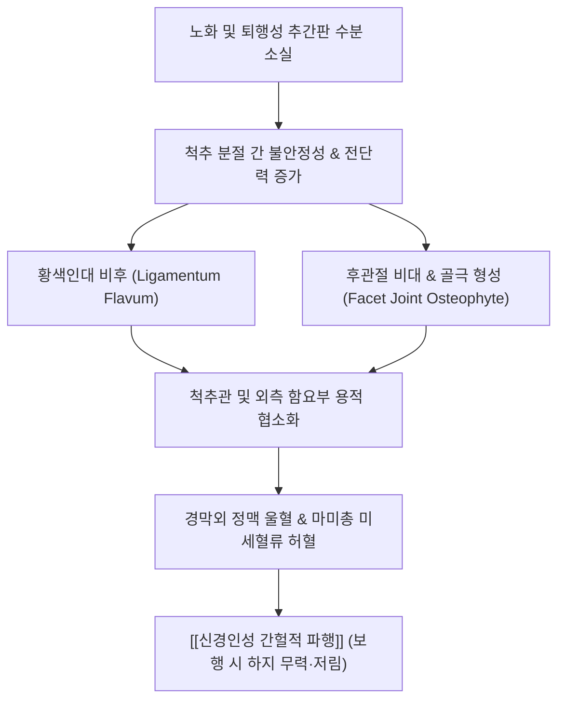

---
aliases:
  - 척추관 협착증
  - 요추관 협착증
  - 요추 협착증
  - 척추 협착증
  - Lumbar Spinal Stenosis
  - LSS
---
# 🩺 [[척추관 협착증]] (Lumbar Spinal Stenosis, LSS)

> **핵심 요약 (Key Summary)**:
> 🎯 정의: 척추 중앙의 척추관(Spinal Canal), 신경근관(Radicular Canal) 또는 추간공(Intervertebral Foramen)이 퇴행성 골극, 황색인대 비후, 후관절 비대로 좁아져 신경근과 마미신경을 압박하는 만성 질환.
> 🚩 핵심 기전: 노화에 따른 추간판 높이 감소와 척추 불안정성으로 인한 황색인대(Ligamentum Flavum)의 비후와 후관절 골극 형성 및 정맥 울혈에 의한 신경 허혈.
> 🔍 주소증: 일정 거리 보행 시 양측 둔부 및 하지 전체가 터질 듯 저리고 무거워 주저앉게 되는 [[신경인성 간헐적 파행]](NIC)과, 허리를 앞으로 숙이거나 쪼그려 앉으면 즉시 완화되는 쇼핑카트 징후(Shopping Cart Sign).
> ⚠️ 감별점: 허리를 숙일 때 악화되는 [[요추 추간판 탈출증]]과 정반대로 허리를 젖힐 때(신전) 악화되고, 혈관성 파행과 달리 자전거 타기나 언덕 오르기 시 통증이 덜함.

![[척추관협착증_삼엽형척추관_해부병태도.jpg|420]]
> [그림 1: 척추관 협착증 삼엽형(Trefoil) 척추관 해부병태도 - 중앙 척추관 협착(Central canal stenosis) 및 외측 함요부 협착(Lateral recess stenosis)]

---

## 📌 목차
1. [기본 정보 및 정의](#1-기본-정보-및-정의)
2. [원인 및 발병 기전](#2-원인-및-발병-기전)
3. [임상 증상 및 단계별 진행](#3-임상-증상-및-단계별-진행)
4. [진단 및 감별 진단](#4-진단-및-감별-진단)
5. [현대의학적 치료 및 약물 요법](#5-현대의학적-치료-및-약물-요법)
6. [한의학적 진단 및 복합 치료 전략](#6-한의학적-진단-및-복합-치료-전략)
7. [임상 다빈도 의안 및 치료 프로토콜](#7-임상-다빈도-의안-및-치료-프로토콜)
8. [출처 및 현대 학술 연구 요약 (References)](#8-출처-및-현대-학술-연구-요약-references)

---

## 1. 기본 정보 및 정의

### (1) 척추관의 해부학적 구획과 용적
* **중앙 척추관 (Central Spinal Canal)**: 전방은 추체 후면과 추간판, 후종인대로 둘러싸이고, 후방은 추궁판과 황색인대, 양측은 척추경으로 둘러싸인 척수/마미총의 주행 통로.
* **외측 함요부 (Lateral Recess, Lee's Entrance Zone)**: 상관절돌기 전내측과 추체 후외측 사이의 공간으로, 하위 분절 신경근이 척수 경막낭에서 갈라져 나와 추간공으로 진입하기 직전 지나가는 협착 호발 구역.
* **추간공 (Intervertebral Foramen)**: 신경근과 배근신경절(DRG), 분절 혈관이 통과하는 출구.

---

## 2. 원인 및 발병 기전

### (1) 척추 퇴행성 연쇄 반응 (Kirkaldy-Willis Cascade)
* **1단계: 추간판 퇴행 및 간격 협소화**:
  * 디스크의 충격 흡수 능력이 감소하면서 상하 척추체 사이 간격이 좁아지고, 이에 따라 후방 황색인대가 팽팽함을 잃고 주름지며(Buckling) 척추관 안쪽으로 불룩하게 밀려 들어옴.
* **2단계: 분절 불안정성 및 인대 섬유화 비후**:
  * 척추 전단력과 비정상적 가동성에 저항하기 위해 황색인대에 기계적 스트레스가 반복되어 Type II 콜라겐 및 탄성 섬유(Elastin)가 파괴되고 두꺼운 섬유성 반흔 조직으로 치환됨(정상 두께 2~4mm $\rightarrow$ 5~8mm 이상 비후).
* **3단계: 후관절 비대 및 안정화 단계(골극 형성)**:
  * 비정상적인 체중 부하를 떠안은 후관절 연골이 마모되고, 상관절돌기 주변에 거대한 골극(Osteophyte)이 자라나 삼엽형(Trefoil) 모양으로 외측 함요부를 좁힘.

### (2) 동적 가변성(Dynamic Variability)과 혈류역학적 기전
* **신전 시 협착 악화**: 요추를 뒤로 젖히면(신전) 황색인대가 접혀 척추관 내부로 돌출하고, 후관절이 겹치며 척추관 단면적이 10~15% 감소하여 신경 압박이 급격히 증가함.
* **굴곡 시 협착 완화**: 요추를 앞으로 숙이면(굴곡) 황색인대가 팽팽하게 펴지고 추간공이 15~25% 넓어지며 척추관 압력이 떨어짐.
* **혈류 정체와 신경 허혈**: 보행 시 대사 요구량이 증가하지만 좁아진 척추관 내 정맥압 상승과 동맥 관류 저하로 신경근에 저산소증이 발생하여 걸을수록 다리가 저리고 힘이 빠짐.

![[척추관협착증_황색인대비후_MRI_축상면.jpg|450]]
> [그림 2: 척추관 협착증 축상면 T2 강조 MRI - 양측 황색인대 비후 및 후관절 비대로 인한 척추관 중앙부의 심한 모래시계형 협착 소견]

---

## 3. 임상 증상 및 단계별 진행

### (1) 대표적 주소증: [[신경인성 간헐적 파행]](Neurogenic Intermittent Claudication, NIC)
* **보행 제한**: 평지를 걸을 때는 괜찮다가 50m~200m 정도 걸어가면 양측 엉덩이, 허벅지, 종아리 전체가 터질 것처럼 무겁고 저리며 쥐가 나 보행을 멈춤.
* **자세성 완화 (쇼핑카트 징후, Shopping Cart Sign)**:
  * 서서 쉴 때는 증상이 쉽게 가라앉지 않고, **허리를 구부리고 쪼그려 앉거나 쇼핑카트/유모차를 밀며 기댈 때** 척추관이 넓어져 즉각적인 통증 경감.
  * 보행 중 갑자기 다리에 힘이 빠져(Giving way) 털썩 주저앉게 됨.

### (2) 감각 저하 및 건반사 특징
* **광범위한 양측성 이상 감각**: 특정 신경근 분절에 국한되는 디스크와 달리, L4, L5, S1 분절이 복합적으로 눌려 양측 종아리, 발바닥 전체의 시림, 화끈거림, 모래를 밟는 듯한 먹먹한 이상 감각 호소.
* **심부건반사(DTR)의 정상 또는 저하**: 평소 안정 시 이학적 검사에서는 심부건반사나 근력이 정상으로 측정되는 경우가 많으며, 보행 직후 신경학적 결손이 뚜렷해짐.

![[Pasted image 20240131005448.png|420]]
> [그림 3: 하지 피부분절(Dermatome L1~S5) 감각 신경 주행도 - 척추관 협착증 시 다발성 신경근 압박으로 인한 L4, L5, S1 복합 감각 저하 영역]

---

## 4. 진단 및 감별 진단

### (1) 임상 이학적 검사
* **신전 유발 검사 (Kemp Test / Lumbar Extension Test)**: 환자에게 허리를 뒤로 젖히고 통증 쪽으로 회전시킬 때 30초 이내에 하지 방사통이나 둔부 통증이 재현되면 양성.
* **자전거 검사 (Bicycle Test of van Gelderen)**:
  * 허리를 꼿꼿이 세우고 탈 때는 파행이 발생하지만, 상체를 앞으로 구부리고 탈 때는 척추관이 열려 장시간 통증 없이 페달을 밟을 수 있음 (혈관성 파행과의 핵심 감별 검사).
* **하지직거상 검사 ([[하지직거상 검사]], SLR)**: 척추관 협착증 환자에서는 대부분 음성(Negative)으로 나타나 급성 디스크 탈출증과 감별됨.

### (2) 영상 의학적 진단
* **자기공명영상 (MRI)**:
  * T2 축상면에서 경막낭 단면적(Dural Sac Cross-Sectional Area, DSCA) 측정:
    * 정상: > 130 mm²
    * 상대적 협착 (Relative Stenosis): 100 ~ 130 mm²
    * 절대적 협착 (Absolute Stenosis): < 100 mm²
  * Schizas 분류 (Grade A: 경도 $\rightarrow$ Grade D: 뇌척수액 신호 완전 소실 및 심한 경막 압박).
* **단순 X-선 (X-ray)**:
  * 굴곡-신전 동적 측면 방사선 검사를 통해 [[척추 전방전위증]](Spondylolisthesis) 및 분절간 불안정성(Instability) 확인.

![[척추관협착증_척추전방전위증_Xray.png|380]]
> [그림 4: 척추관 협착증 환자의 요추 측면 X-선 - L4-L5 추체 전방 전위 및 추간판 간격 협소화 소견]

### (3) 핵심 감별 진단 표

| 감별 질환 | 호발 연령 및 특성 | 파행의 특징 | 허리 굴곡/신전 반응 | 박동 및 혈관 소견 |
| :--- | :--- | :--- | :--- | :--- |
| **[[척추관 협착증]]** | 60대 이상 고령층 | **신경인성 파행**: 서 있으면 지속, 쪼그려 앉아야 완화 | **굴곡 시 완화 / 신전 시 악화** | 족배동맥 맥박 정상, 피부온도 정상 |
| **[[혈관성 파행]]** (말초동맥질환) | 흡연자, 당뇨, 동맥경화 | **혈관성 파행**: 서서 가만히 쉬기만 해도 즉시 완화 | **허리 자세와 무관** | **족배동맥 맥박 소실/감소**, 족부 냉감, 창백 |
| **[[요추 추간판 탈출증]]** | 20~50대 활동기 | 편측성, 특정 분절 방사통 위주 | **허리 굴곡 시 악화 / 신전 시 완화** | 하지직거상 검사(SLR) 양성 |
| **[[척추 전방전위증]]** | 여성 호발, 척추 불안정 | 척추관 협착증과 동반 다빈도 | 굴곡-신전 X-선 상 전위 관찰 | 척추 극돌기 계단형 변형(Step-off) |

---

## 5. 현대의학적 치료 및 약물 요법

### (1) 보존적 치료 및 약물 요법
* **혈류 개선제 (Prostaglandin E1 유도체)**: 리마프로스트(Limaprost, 오팔몬) 투여로 척추관 내 미세 정맥 울혈을 개선하고 마미총 혈류량을 증대시켜 보행 거리 연장.
* **신경병증성 진통제**: [[프레가발린]](Lyrica), [[가바펜틴]], [[둘록세틴]] 투여로 이상 감각 완화.
* **경막외 차단술 (Epidural Block)**: 미추 또는 추간공 접근법을 통해 협착 부위의 신경 부종과 염증 반응 차단.

### (2) 수술적 요법
* **적응증**: 보존 치료 3~6개월 실패 후 보행 거리가 50m 미만으로 제한되거나, 족하수 등 진행성 운동 마비 및 마미증후군(배뇨장애) 발생 시.
* **수술 기법**: 내시경 또는 미세현미경하 후궁 절제술(Laminectomy) 및 황색인대 절제술(Flavectomy), 불안정성 동반 시 척추 유합술(TLIF/PLIF).

---

## 6. 한의학적 진단 및 복합 치료 전략

### (1) 한의학적 병인 및 변증
* **신허요통(腎虛腰痛)**: 고령으로 신정(腎精)이 마르고 골수가 비어 척추가 굽고 무릎과 다리가 시리며 조금만 걸어도 힘이 빠져 주저앉음.
* **어혈요통(瘀血腰痛)**: 척추관 내 기혈 순환 장애로 어혈이 정체되어 밤에 다리가 저리고 쥐가 나며 찌르는 통증.
* **풍한습비(風寒濕痺)**: 찬 바람과 습기가 척추와 하지 경락으로 스며들어 허리가 묵직하고 날씨가 궂으면 보행 장애가 심해짐.

### (2) 다각적 한의 임상 시술 전략
* **침도 요법 (Acupotomy, 미세침도 감압술)**:
  * 협착 분절의 척추 극간인대, 황색인대 외측연 및 후관절낭 유착 부위를 미세 절개·박리하여 척추관 후방의 장력을 감압하고 미세혈류 순환 촉진.
* **약침 요법 (Pharmacopuncture)**:
  * **신바로약침**: 요추 협척혈 및 후관절낭 부위에 주입하여 척추 신경근 주변 신경 염증 및 유착 억제.
  * **자하거(인태반) 약침**: 신정(腎精)을 크게 보하고 퇴행성 척추 연골과 인대를 영양.
* **추나 요법 (Chuna Manual Therapy)**:
  * **요추 굴곡 가동 기법 (Flexion Distraction)**: 콕스(Cox) 테이블을 활용하여 요추를 부드럽게 굴곡·견인함으로써 척추관과 추간공의 용적을 확장하고 후관절 압박 완화.
  * **요추신전 증후군 자세 교정**: 과도한 골반 전방경사를 유발하는 단축된 [[장요근]], [[대퇴직근]]을 이완하고, 약화된 복근과 둔근을 강화.
* **처방 배오**:
  * 만성 보행 장애 및 간신휴허: [[독활기생탕]], 보허탕, 양혈장근건보환.
  * 하지 냉증 및 한습 정체: [[오적산]], 우슬탕 가감.

---

## 7. 임상 다빈도 의안 및 치료 프로토콜

### (1) 진료실 핵심 문진 체크리스트 & 생활 지도
* [ ] **최대 연속 보행 거리 측정**: 쉬지 않고 몇 미터나 걸을 수 있습니까? (50m 미만 시 중증 협착).
* [ ] **자전거 vs 보행 비교**: 걷기는 힘든데 실내 자전거는 30분 이상 탈 수 있습니까? (양성 시 신경인성 파행 확진).
* [ ] **배뇨/배변 장애 유무**: 소변 줄기가 가늘어지거나 지리지는 않습니까? (마미증후군 응급 수술 감별).
* [ ] **허리 젖힘 금기 교육**: 어르신들이 흔히 하는 '허리 뒤로 젖히는 스트레칭'은 척추관을 더욱 좁혀 신경을 짓누르므로 절대 금지 지도.

### (2) 단계별 한의 치료 및 재활 프로토콜
* **1단계: 신경 허혈 및 급성 파행 완화기 (1~4주차)**
  * 장거리 보행 제한 및 지팡이/보행기 사용 권장(상체 약간 숙인 자세).
  * 요추 화타협척혈 전침 + 신바로약침/자하거약침 (주 2~3회).
  * [[독활기생탕]] 투약 (황핵인대 섬유화 억제 및 신경 영양 공급).
* **2단계: 척추관 감압 및 연조직 유착 박리 (5~8주차)**
  * 요추 후관절낭 및 극간인대 침도 치료 (주 1회).
  * 콕스 굴곡-견인 추나요법 병행.
  * 골반 후방경사 유도 윌리엄(Williams) 굴곡 운동 교육 (무릎 가슴으로 당기기).
* **3단계: 보행 지구력 증진 및 유지기 (9~12주차)**
  * 고정식 실내 자전거 타기(허리 약간 숙인 자세) 매일 20~30분 시행.
  * 보허탕 또는 가미대보탕으로 근골격계 지지력 보강.

---

## 8. 출처 및 현대 학술 연구 요약 (References)

* Katz JN, Harris MB. Clinical practice. Lumbar spinal stenosis. *N Engl J Med*. 2008;358(8):818-825.
  * [PMID: 18287604](https://pubmed.ncbi.nlm.nih.gov/18287604/)
  * [연구 요약] 척추관 협착증의 병태생리, 진단적 특징(신경인성 간헐적 파행과 자세 의존성 통증), 자연 경과를 집대성한 NEJM 리뷰로, 상당수 환자에서 증상이 급격히 악화되지 않고 안정 상태를 유지하므로 비수술적 보존 치료가 1차 표준 요법임을 강조.
* Kreiner DS, Shaffer WO, Baisden PR, et al. North American Spine Society. An evidence-based clinical guideline for the diagnosis and treatment of degenerative lumbar spinal stenosis (update). *Spine J*. 2013;13(7):734-743.
  * [PMID: 23830297](https://pubmed.ncbi.nlm.nih.gov/23830297/)
  * [연구 요약] 북미척추학회(NASS)의 퇴행성 요추 척추관 협착증 진료 지침으로, MRI 및 CT를 통한 척추관 단면적 평가의 진단적 정확도와 비스테로이드성 소염진통제, 물리치료 및 경막외 주사의 치료 효과 근거 수준을 체계적으로 제시.
* Li J, et al. Non-pharmaceutical Chinese medical therapies for degenerative lumbar spinal stenosis: A systematic review and meta-analysis of randomized controlled trials. *Complement Ther Med*. 2023;74:102949.
  * [PMID: 37062421](https://pubmed.ncbi.nlm.nih.gov/37062421/)
  * [연구 요약] 퇴행성 요추관 협착증 환자를 대상으로 침, 전침, 침도(Acupotomy) 및 추나 요법 등 한의 비약물 복합 요법의 유효성을 평가한 무작위 대조 시험(RCT) 메타분석으로, 양방 통상 치료 대비 요추 기능 점수(JOA Score), 통증 강도(VAS) 및 무통 보행 거리를 유의하게 향상시킴을 입증.