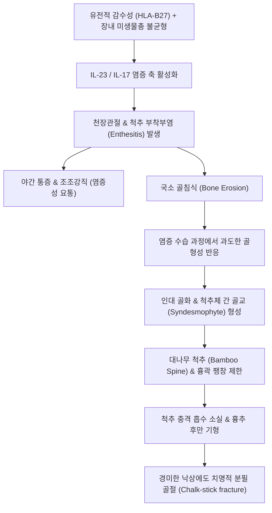

# 🩺 척추관절염 (Spondyloarthritis)

> **상위 분류**: [[근골격계 질환]] > [[척추 질환]] > [[류마티스 및 전신 질환]]
> **핵심 3줄 요약 (Key Summary)**:
> - 📍 병소 부위 & 해부·병태생리: 척추의 골-인대 접합부인 부착부(Enthesis)와 [[천장관절]](Sacroiliac joint), 척추골간 관절에 면역 매개성 만성 염증이 발생하는 질환군으로, HLA-B27 유전자와 연관되며 염증성 골흡수 후 골극/골교(Syndesmophyte)가 형성되어 척추가 대나무처럼 굳는 **대나무 척추(Bamboo Spine)**로 진행함.
> - 🚩 전형적 임상 양상: 45세 이전 발병, 3개월 이상 지속되는 만성 **염증성 요통(Inflammatory Back Pain: 조조강직 30분 이상, 휴식 시 악화, 활동 시 호전, 야간 둔부통)**, 비대칭적 하지 말초 관절염, 발꿈치 아킬레스건/족저근막 부착부염(Enthesitis), 재발성 전방 포도막염(Uveitis).
> - 🛠️ 핵심 검사 & 치료 전략: 쇼버 검사(Schober test) 및 패트릭 검사, 천장관절 MRI(활동성 골수부종), 한의 비신양허·풍한습비 변증 한약([[독활기생탕]]) 및 봉약침·소염약침, 관절 가동성 유지를 위한 척추 신전 운동, 양방 항-TNF/IL-17 억제제 생물학적 제제 병용.
> - ⚠️ 응급 의뢰 레드플래그: 척추 강직이 진행된 부위에 고속저진폭(HVLA) 스러스트 추나 기법 적용 시 분필 골절(Chalk-stick fracture) 및 치명적 척수 손상을 유발하므로 절대 금기! 급성 충혈·시력저하 동반 포도막염 발생 시 안과 응급 의뢰 필수.

---

## 📌 목차
1. [질환 개요 & 해부학적 병태생리](#1-질환-개요--해부학적-병태생리)
2. [병태생리 메커니즘 & 생체역학적 악순환 네트워크](#2-병태생리-메커니즘--생체역학적-악순환-네트워크)
3. [임상 증상 & 이학적 검사(Physical Exam) 알고리즘](#3-임상-증상--이학적-검사physical-exam-알고리즘)
4. [감별 진단 매트릭스 (Differential Diagnosis)](#4-감별-진단-매트릭스-differential-diagnosis)
5. [한의 통합 치료 프로토콜 (침·약침·추나·한약)](#5-한의-통합-치료-프로토콜-침약침추나한약)
6. [양방 치료 & 병용·의뢰 기준 (Conventional Treatment & Referral)](#6-양방-치료--병용의뢰-기준-conventional-treatment--referral)
7. [재활 운동 & 생활습관 티칭 가이드](#7-재활-운동--생활습관-티칭-가이드)
8. [💡 사용자 진료실 핵심 필기 & 임상 노하우 (Melt-In 잔여 심화 집약)](#8--사용자-진료실-핵심-필기--임상-노하우-melt-in-잔여-심화-집약)
9. [출처 및 학술 참고 문헌 (References)](#9-출처-및-학술-참고-문헌-references)

---

## 1. 질환 개요 & 해부학적 병태생리

### 1.1 개요 및 질환군 분류
**척추관절염(Spondyloarthritis, SpA)**은 류마티스 인자(RF) 음성을 특징으로 하는 만성 전신성 면역매개 염증성 관절 질환군이다. 크게 **축성 척추관절염(Axial SpA)**과 **말초성 척추관절염(Peripheral SpA)**으로 대별된다.
- **축성 척추관절염(axSpA)**:
  - **방사선학적 축성 SpA**: 고전적 [[강직성 척추염]](Ankylosing Spondylitis, AS). X-ray에서 명확한 양측성 천장관절염(Sacroiliitis) 및 척추 골교 형성이 확인됨.
  - **비방사선학적 축성 SpA(nr-axSpA)**: 단순 방사선상 정상이나 MRI에서 뚜렷한 활성 천장관절 골수부종이 확인되는 조기 단계.
- **연관 질환군**: 건선성 관절염(Psoriatic arthritis), 반응성 관절염(Reactive arthritis, 라이터 증후군), 염증성 장질환(크론병, 궤양성 대장염) 연관 관절염.

![[척추관절염_01_영상의학_대나무척추_BambooSpine_Xray.jpg|450]]
> [그림 1: ① 척추관절염(강직성 척추염) 말기의 특징적 대나무 척추(Bamboo Spine) 단순 방사선 소견 — 골교(Syndesmophyte) 형성과 척추체 간 완전 유합] — Wikimedia Commons

### 1.2 역학 및 유전적 소인
- 20~40대 젊은 남성에서 호발(남녀 비 약 2~3:1이나, 비방사선학적 군은 여성 비율이 높음).
- **HLA-B27 양성률**: 강직성 척추염 환자의 약 85~90%에서 양성. 일반 인구의 약 5~8%에서 양성을 보이나 이 중 소수에서만 질환이 발현되므로 진단적 단독 근거가 아닌 위험 인자로 해석함.

---

## 2. 병태생리 메커니즘 & 생체역학적 악순환 네트워크

### 2.1 일차 병변: 부착부염(Enthesitis)과 신생골 형성
류마티스 관절염이 관절 활막(Synovium)을 일차 타겟으로 하는 반면, 척추관절염은 인대, 건, 관절낭이 뼈에 부착하는 **골-건 부착부(Enthesis)**를 원발 병소로 삼는다.
1. **면역 염증 활성화**: 기계적 스트레스가 누적되는 천장관절 및 척추 섬유륜 부착부에 미세 손상이 발생하면, 선천면역 세포(IL-23/IL-17 축)가 활성화되어 TNF-α, IL-17, IL-22를 대량 분비한다.
2. **염증성 골미란(Bone Erosion)**: 부착부 주변 골수강에 염증 세포가 침윤하고 파골세포가 활성화되어 골피질이 미란된다.
3. **골재형성 및 인대골화(New Bone Formation)**: 염증이 가라앉는 과정에서 BMP(Bone Morphogenetic Protein) 및 Wnt 신호전달계가 자극되어 연골내 골화(Endochondral ossification)가 진행된다. 섬유륜을 따라 수직 방향의 골극인 **골교(Syndesmophyte)**가 자라나 인접 척추체와 융합되며, 결국 전 척추가 굳는 대나무 척추(Bamboo Spine)로 변형된다.

![[류마티스관절염_활막염_판누스_병태도해.jpg|400]]
> [그림 2: 자가면역성 만성 활막염 및 부착부염(Enthesitis)의 면역 염증 기전 — 병태생리도]

### 2.2 생체역학적 악순환 네트워크

---

## 3. 임상 증상 & 이학적 검사(Physical Exam) 알고리즘

### 3.1 4대 핵심 임상 징후
1. **염증성 요통(Inflammatory Back Pain, IBP)**:
   - 45세 이전 점진적 시작, 3개월 이상 지속.
   - 아침 기상 시 30분 이상 지속되는 뻣뻣함(조조강직).
   - 누워서 쉴 때 악화되고 **가벼운 운동이나 신체 활동을 하면 오히려 통증이 완화됨** (기계적 디스크/협착과 정반대).
   - 새벽에 허리나 엉치 통증으로 잠에서 깨어남(후반야 기상통).
2. **비대칭성 하지 올리고관절염(Oligoarthritis)**: 무릎, 발목 등 큰 관절 1~2개에 부종과 열감 발생.
3. **부착부염(Enthesitis)**: 아킬레스건 부착부, 족저근막 종골 부착부의 보행 시 극심한 발꿈치 통증.
4. **관절 외 증상**:
   - **급성 전방 포도막염(Anterior Uveitis)**: 20~30%에서 편측성 안구 충혈, 안통, 눈부심, 시력 저하 동반.
   - 대동맥판막 폐쇄부전, 심장 전도장애, 염증성 장질환, 건선 피부 병변.

![[척추타진검사_1단계_흉추극돌기_수근타진_실사.png|400]]
> [그림 3: 흉추 극돌기 수근 타진 및 척추 가동성 평가 — 자생한방병원 임상술기]

![[척추타진검사_2단계_요추극돌기_골성타진_실사.png|400]]
> [그림 4: 요추 극돌기 골성 타진 및 국소 압통·가동성 평가 — 자생한방병원 임상술기]

![[요만검사_2단계_대퇴거상_천장관절스트레스_실사.jpg|400]]
> [그림 5: 천장관절염(Sacroiliitis) 유발 및 천장관절 스트레스 평가를 위한 요만 검사 — 자생한방병원 임상술기]

### 3.2 이학적 특수 검사 프로토콜
1. **쇼버 검사 (Modified Schober Test — 요추 굴곡 가동성 평가)**:
   - 양측 후상장골극(PSIS) 연결선의 중심점(L5 극돌기)을 기준으로 상방 10cm, 하방 5cm 지점에 점을 찍는다(총 15cm).
   - 환자에게 무릎을 펴고 허리를 최대로 숙이게 한 후 두 점 사이의 거리를 측정한다.
   - 20cm 이상 늘어나야 정상이며, **5cm 미만 증가(총 길이 20cm 미만)** 시 요추 가동성 감소(양성).
2. **흉곽 확장도 검사 (Chest Expansion Test)**:
   - 제4 늑간 높이에서 최대 호기 시와 최대 흡기 시의 흉위 차이를 측정한다.
   - 2.5cm 미만으로 확장이 제한되면 늑척추 관절 및 흉늑관절의 강직을 의미함.
3. **패트릭 검사 (Patrick / FABER Test)** 및 **요만 검사 (Yeoman Test)**:
   - 천장관절에 회전 및 신전 스트레스를 가하여 엉치 뒤쪽의 깊은 통증을 유발함으로써 천장관절염을 평가함.
4. **후두골-벽 거리 (Occiput-to-Wall Distance)**:
   - 등을 벽에 붙이고 똑바로 섰을 때 뒤통수가 벽에 닿지 않는 경우 흉추 후만 및 경추 강직의 진행을 의미.

---

## 4. 감별 진단 매트릭스 (Differential Diagnosis)

| 감별 항목 | [[척추관절염]](강직성 척추염) | [[요추 추간판 탈출증]](디스크) | [[척추관 협착증]] | [[류마티스 관절염]](RA) |
| :--- | :--- | :--- | :--- | :--- |
| **호발 연령** | 20~40대 젊은 남성 | 20~50대 | 60대 이상 고령 | 30~50대 여성 |
| **통증 성격** | **염증성** (활동 시 완화, 휴식 시 악화) | **기계적** (허리 숙일 때 악화) | **기계적** (보행 시 악화, 쪼그리면 호전) | **염증성** (말초 소관절 중심) |
| **조조강직** | **30분~1시간 이상** | 10~15분 이내 경미 | 보행 시 발생 | 1시간 이상 극심 |
| **병소 부위** | [[천장관절]], 척추 부착부, 하지 대관절 | L4-L5, L5-S1 디스크 | 척추관, 황색인대 비후 | 수부/족부 PIP, MCP 대칭성 관절 |
| **영상 소견** | 천장관절염, Syndesmophyte, Bamboo spine | 추간판 탈출, 신경근 압박 | 척추관 단면적 협소 | 골미란, 관절강 협착, 골다공증 |
| **혈액 검사** | **HLA-B27 (+), ESR/CRP 상승, RF (-)** | 정상 | 정상 | **RF (+), Anti-CCP (+), ESR/CRP 상승** |

---

## 5. 한의 통합 치료 프로토콜 (침·약침·추나·한약)

![[요추추간판탈출증_05_침치료실사.jpg|400]]
> [그림 6: ⑤ 한의 술기 실사 — 척추 기립근 및 협척혈(EX-B2)·천장관절 인대 부착부 침구 치료 실사 — 한의 임상술기]

![[요추추간판탈출증_추나요법_신장기법.png|400]]
> [그림 7: 강직 분절 보호를 위한 척추 연부조직 신장 및 완만한 근막 이완 추나기법 — 척추신경추나의학회]

### 5.1 침구 및 온침 치료
- **혈위 선정**: 명문(GV4), 신수(BL23), 대장수(BL25), 방광경 협척혈(EX-B2), 관원(CV4), 곤륜(BL60), 태계(KI3), 차료(BL32), 환도(GB30).
- **자침 기법**:
  - 만성 염증으로 섬유화되고 굳어진 척추 주위근(다열근, 최장근)과 천장관절 후방 인대 부위에 심자하여 2~4Hz 저주파 전침을 통전한다.
  - 양기(陽氣) 부족과 한습(寒濕) 응결을 다스리기 위해 신수, 관원, 명문 혈위에 온침(溫鍼) 또는 뜸 요법을 병행하여 척추 주변 심부 온도를 높이고 강직감을 풀어준다.

### 5.2 약침 치료 (Pharmacopuncture)
- **봉약침(Sweet Bee Venom, BV)**:
  - 멜리틴(Melittin)과 아파민 성분이 강력한 항염증 작용을 발휘하고 전신 면역계를 조절하므로, 척추관절염의 조조강직과 야간통에 탁월하다.
  - 천장관절 열극 및 척추 협척혈, 아킬레스건 부착부에 1:30,000 희석액 0.5~1.0cc 주입 (사전 피부 알레르기 테스트 필수).
- **신바로약침 / 소염약침**:
  - 급성기 활성 염증과 관절 부종 완화를 위해 1.0~2.0cc를 분할 주입하여 염증성 사이토카인(IL-17, TNF-α) 분비를 억제한다.

### 5.3 추나치료 시의 절대 주의사항 및 완만 기법
- ⚠️ **고속저진폭(HVLA) 스러스트 기법 절대 금기**:
  - 척추 융합이 일어난 척추관절염 환자에게 소리를 내는 강한 비틀기나 회전 스러스트를 가하면, 골화된 척추가 마치 마른 나뭇가지처럼 부러지는 **분필 골절(Chalk-stick fracture)** 및 급성 대소변 실금, 사지마비를 초래한다.
- **안전한 추나 프로토콜**:
  - 복와위 또는 측와위에서 요배부 연부조직 근막 이완 기법(Myofascial Release).
  - 흉곽 호흡 운동과 연계한 완만한 척추 신장 기법(Distraction) 및 등척성 후 이완(Post-Isometric Relaxation, PIR)을 적용하여 안전하게 척추 가동성을 확보한다.

### 5.4 한약 처방 (변증 치료)
- **비신양허·풍한습비(脾腎陽虛·風寒濕痺)**:
  - 허리가 시리고 뻣뻣하며 추위를 타고 새벽에 통증이 극심한 전형적 아급성/만성 단계.
  - 처방: [[독활기생탕]], [[오적산]], [[삼기음]] 가감 (부자, 육계, 녹용, 우슬, 두충 배합). 신양을 북돋우고 한습을 몰아내어 척추 인대의 유연성을 회복시킨다.
- **습열저체(濕熱沮滯)**:
  - 관절이 붓고 화끈거리며 혈액검사상 ESR/CRP가 현저히 상승한 급성 악화 단계.
  - 처방: [[당귀점통탕]], [[청열서경탕]] 가감 (황백, 지모, 의이인, 창출 배합). 관절강 내 습열과 부종을 배출한다.

---

## 6. 양방 치료 & 병용·의뢰 기준 (Conventional Treatment & Referral)

### 6.1 일차 약물 치료
- **NSAIDs (비스테로이드 소염진통제)**: 질환 초기 및 활동기 1차 표준 치료제. 단순 진통 목적이 아니라 염증과 신생 골화 진행을 지연시키는 목적으로 지속 투여.

### 6.2 생물학적 제제 (Biologics) 및 표적 치료제 (PMID 41833337)
- 2가지 이상의 NSAIDs를 충분한 용량으로 4주 이상 투여해도 BASDAI 점수 4점 이상의 활동성 질환이 지속되는 경우:
  - **TNF-α 억제제**: Adalimumab, Infliximab, Etanercept, Golimumab.
  - **IL-17A 억제제**: Secukinumab, Ixekizumab (건선 동반 환자에게 탁월).
  - **JAK 억제제**: Tofacitinib, Upadacitinib.
  - 임상시험 메타분석상 생물학적 제제 투여 시 ASDAS 비활성 질환(Inactive disease status) 도달률이 위약군 대비 유의하게 높음이 확인됨(PMID 41833337).

### 6.3 류마티스내과 협진 및 의뢰 기준 (PMID 42689760)
- 45세 이전 발생한 3개월 이상의 염증성 요통 환자.
- 천장관절 영상(X-ray 또는 MRI)에서 천장관절염이 확인되거나 HLA-B27 양성이면서 IBP를 만족하는 경우 조기 진단과 생물학적 제제 도입을 위해 류마티스내과로 신속히 연계.
- **응급 의뢰**: 급성 포도막염(안통, 시력 저하), 가벼운 둔상 후 급격한 척추 통증(골절 의심).

---

## 7. 재활 운동 & 생활습관 티칭 가이드

### 7.1 매일 실천하는 척추 신전 운동 프로토콜 (PMID 42759302)
- 척추관절염은 척추가 앞으로 구부러지는 흉추 후만 기형(Kyphosis)으로 굳어지는 경향이 있으므로, 모든 운동의 핵심은 **신전(Extension)과 흉곽 팽창**이다.
- **멕켄지 신전 운동(McKenzie extension)**: 엎드려 팔꿈치로 상체 세우기, 손바닥으로 밀어 올려 상체 젖히기.
- **흉곽 호흡 운동**: 매일 아침저녁 갈비뼈를 최대로 벌리며 심호흡 20회 반복.
- **수영(자유형, 배영)**: 척추 관절에 체중 부하를 주지 않으면서 전신 관절의 가동 범위를 유지하는 최상의 유산소 운동.

### 7.2 일상생활 자세 티칭
- **수면 환경**: 푹신한 침대나 높은 베개는 척추를 굽은 상태로 굳게 하므로 절대 금기! **단단한 매트리스나 온돌 바닥에서 낮은 베개를 베고 똑바로 앙와위로 자는 습관**을 들여야 한다.
- **금연 필수**: 흡연은 척추 골교 형성을 가속화하고 폐기능 저하를 촉진하므로 강력히 금연 지도.

---

## 8. 💡 사용자 진료실 핵심 필기 & 임상 노하우 (Melt-In 잔여 심화 집약)

### 8.1 디스크 환자로 오진되어 내원하는 젊은 청년들
- 진료실에 20~30대 군인, 취업준비생, 직장인이 "허리가 아파서 동네 병원에 갔더니 디스크라고 해서 주사를 맞았는데 전혀 차도가 없다"며 내원하는 경우가 대단히 흔하다.
- 문진 시 **"아침에 일어날 때 제일 아프고 움직이면 좀 나아지는가?", "새벽에 엉치가 아파서 깨는가?", "발뒤꿈치나 무릎이 아픈 적이 있는가?"**를 물어보아야 한다.
- 여기에 "그렇다"고 답하고 쇼버 검사에서 요추 가동성이 떨어져 있다면, 즉시 골반 X-ray(AP view)를 확인하여 천장관절의 경화(Sclerosis)와 미란을 찾아내야 한다. 디스크 치료로 몇 년을 허비하기 전에 축성 척추관절염을 조기에 잡아내는 것이 한의사의 핵심 역량이다.

### 8.2 추나 테이블에서의 경각심: HVLA 뚝 소리의 유혹을 이겨라
- 일반 요통 환자에게 관절 교정 추나(HVLA)를 시행하면 관절음(Popping)과 함께 즉각적인 시원함을 주지만, 척추관절염 환자에게 이 기법을 시도하는 것은 의료 사고의 지름길이다.
- 인대가 이미 골화되어 척추체의 가동성이 상실된 상태에서 회전 외력을 가하면 척추궁판이나 추체가 으스러진다.
- 척추관절염 환자에게는 흉추와 요추의 **연부조직 신장, 늑골-척추 가동성 호흡 추나, 골반 경사 이완 기법**만을 온화하게 적용해야 한다.

---

## 9. 출처 및 학술 참고 문헌 (References)

1. **Dubreuil M et al. (2026)**. Spondyloarthritis Research and Treatment Network Recommendations for the Referral of Adults With Chronic Back Pain and Suspected Axial Spondyloarthritis to a Rheumatologist. *ACR Open Rheumatol*. 8(9):e90129. [PMID: 42689760](https://pubmed.ncbi.nlm.nih.gov/42689760/)
   - *[연구 요약]*: 만성 요통을 호소하는 성인 환자 중 축성 척추관절염 의심 환자를 조기에 선별하여 류마티스내과로 신속히 의뢰하기 위한 근거 기반 추천 지침 및 임상 선별 도구를 제시.

2. **Bittar M et al. (2026)**. What Defines an MRI Considered Indicative of Axial Spondyloarthritis in the Sacroiliac Joints: A Systematic Literature Review. *J Rheumatol*. 53(7):789-798. [PMID: 42744402](https://pubmed.ncbi.nlm.nih.gov/42744402/)
   - *[연구 요약]*: 천장관절 자기공명영상(MRI)에서 축성 척추관절염을 시사하는 활동성 천장관절염의 방사선학적 정의와 천장관절 연골하 골수부종(BME)의 판독 기준을 체계적으로 고찰.

3. **Huo R et al. (2026)**. Comparative effectiveness of exercise interventions for axial spondyloarthritis: a systematic review and network meta-analysis. *Ann Phys Rehabil Med*. 69(7):102169. [PMID: 42759302](https://pubmed.ncbi.nlm.nih.gov/42759302/)
   - *[연구 요약]*: 축성 척추관절염 환자를 대상으로 한 다양한 운동 중재법(필라테스, 수치료, 척추 신전 운동 등)의 통증 완화, 척추 가동성(BASMI), 기능 점수(BASFI) 개선 효과를 비교한 네트워크 메타분석.

4. **Doumeth SA et al. (2026)**. Achieving Axial Spondyloarthritis Disease Activity Score Inactive Disease Status in Axial Spondyloarthritis in Clinical Trials: A Systematic Review and Metaanalysis. *J Rheumatol*. 53(9):856-867. [PMID: 41833337](https://pubmed.ncbi.nlm.nih.gov/41833337/)
   - *[연구 요약]*: 축성 척추관절염 임상시험에서 생물학적 제제 및 표적 합성 DMARDs를 통한 ASDAS 비활성 질환 상태 도달률과 임상 관해 유지 지표를 종합 분석한 체계적 문헌고찰 및 메타분석.
