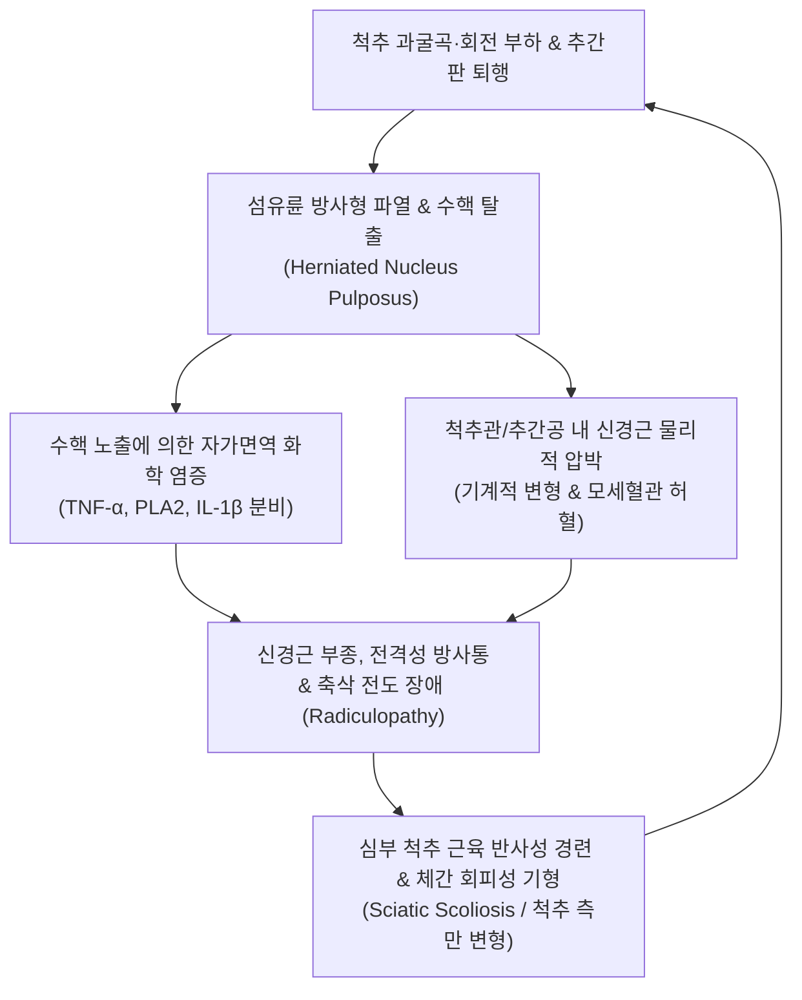

# 🩺 추간판 탈출 (Herniated Intervertebral Disc, HIVD)

> **핵심 3줄 요약 (Key Summary)**:
> - 📍 **병소 부위 & 해부·병태생리**: 척추체 사이의 섬유연골성 관절인 추간판의 외측 섬유륜(Annulus fibrosus)이 퇴행성 마모나 과부하로 파열되어 중심부 수핵(Nucleus pulposus)이 척추관 또는 추간공으로 밀려나와 척수(Spinal cord) 및 척추신경근(Nerve root)을 기계적·화학적으로 압박하는 척추 질환 총론이다.
> - 🚩 **전형적 임상 양상**: 이환 분절(경추, 흉추, 요추)에 따라 복압 상승 시 악화되는 척추 축성 통증과 지배 피부분절을 따라 뻗치는 전격성 방사통(Radiculopathy), 건반사 저하, 특정 근육의 위약(손아귀 힘 저하, 족배굴곡 위약)이 동반된다.
> - 🛠️ **핵심 검사 & 치료 전략**: 신경근 유발 검사(경추 스퍼링 검사, 요추 하지직거상 검사) 및 MRI로 탈출 형태를 확진하며, 급성기 신경근 화학 염증 차단을 위한 신바로·봉약침, 협척혈 심자 전침, 척추 감압 추나 및 매켄지 신전 운동을 단계별로 적용한다.
> - ⚠️ **응급 의뢰 레드플래그**: 척수증(Cervical/Thoracic myelopathy)으로 인한 하지 강직성 보행 장애, 마미증후군(Cauda Equina Syndrome: 회음부 안장 감각 소실, 대소변 실금/요폐), 급격히 진행하는 운동 마비(Foot drop 또는 수근하수) 발생 시 24~48시간 이내 응급 척추 감압 수술 의뢰.

---

## 📌 목차
1. [질환 개요 & 해부학적 병태생리](#1-질환-개요--해부학적-병태생리)
2. [병태생리 메커니즘 & 생체역학적 악순환 네트워크](#2-병태생리-메커니즘--생체역학적-악순환-네트워크)
3. [임상 증상 & 이학적 검사(Physical Exam) 알고리즘](#3-임상-증상--이학적-검사physical-exam-알고리즘)
4. [감별 진단 매트릭스 (Differential Diagnosis)](#4-감별-진단-매트릭스-differential-diagnosis)
5. [한의 통합 치료 프로토콜 (침·약침·추나·한약)](#5-한의-통합-치료-프로토콜-침약침추나한약)
6. [양방 치료 & 병용·의뢰 기준 (Conventional Treatment & Referral)](#6-양방-치료--병용의뢰-기준-conventional-treatment--referral)
7. [재활 운동 & 생활습관 티칭 가이드](#7-재활-운동--생활습관-티칭-가이드)
8. [💡 사용자 진료실 핵심 필기 & 임상 노하우 (Melt-In 잔여 심화 집약)](#8--사용자-진료실-핵심-필기--임상-노하우-melt-in-잔여-심화-집약)
9. [출처 및 학술 참고 문헌 (References)](#9-출처-및-학술-참고-문헌-references)

---

## 1. 질환 개요 & 해부학적 병태생리

**추간판 탈출(Herniated Intervertebral Disc, HIVD)**은 척추의 가동성과 완충 작용을 담당하는 추간판(Intervertebral disc)이 파열되어 내부의 수핵이 정상적인 해부학적 경계를 벗어나는 질환이다. 척추의 해부학적 부위에 따라 [[경추 추간판 탈출증]], [[흉추 추간판 탈출증]], [[요추 추간판 탈출증]]으로 분류되며, 가동성이 크고 역학적 부하가 집중되는 하부 요추(L4-L5, L5-S1)와 하부 경추(C5-C6, C6-C7)에 95% 이상이 집중된다.

추간판은 세 가지 해부학적 구조물로 구성된다:
1. **수핵(Nucleus Pulposus)**: 중앙부에 위치하며 제2형 콜라겐과 다량의 음전하를 띤 프로테오글리칸(아그레칸)으로 구성되어 높은 수분 함유량(유년기 88% $\rightarrow$ 노년기 70%)을 유지하여 정수압(Hydrostatic pressure)을 형성한다.
2. **섬유륜(Annulus Fibrosus)**: 수핵을 양파 껍질처럼 동심원상으로 감싸는 15~25층의 제1형 콜라겐 섬유 다발로, 척추 전단력과 회전력에 저항한다. 후외측 섬유륜은 후종인대(PLL)의 외측에 위치하여 구조적으로 가장 얇고 취약하다.
3. **연골 종판(Cartilaginous Endplate)**: 척추체와 추간판 사이의 투과성 연골판으로 모세혈관 확산을 통한 유일한 영양 공급 경로이다.

탈출 단계는 형태학적으로 4단계로 분류된다:
- **팽륜 (Bulging)**: 섬유륜의 연속성이 유지되며 디스크 전 둘레가 3mm 이상 대칭적으로 돌출.
- **돌출 (Protrusion)**: 섬유륜 내측 섬유가 파열되었으나 최외측 섬유륜은 온전함(기저부 폭이 돌출부 폭보다 넓음).
- **탈출 (Extrusion)**: 섬유륜 전층이 파열되어 수핵이 경막외강으로 삐져나옴(돌출부 폭이 기저부보다 넓음).
- **격리 (Sequestration)**: 탈출된 수핵 조각이 본체와 완전히 분리되어 척추관 내 상하로 유주함.

![[요추디스크_수핵탈출_MRI_및_탈출형태.png]]
> [그림 1: ① 병태생리·해부 — 추간판의 수핵 탈출 단계별 분류(팽륜, 돌출, 탈출, 격리) 및 신경근 압박 도해]

![[요추디스크_섬유륜형_병태해부도.png]]
> [그림 2: ① 병태생리 — 섬유륜 방사형 파열 및 화학적 염증 매개체(TNF-α, PLA2)에 의한 신경근 감작 도해]

---

## 2. 병태생리 메커니즘 & 생체역학적 악순환 네트워크

추간판 탈출에 의한 신경 증상은 **기계적 압박(Mechanical compression)**과 **자가면역성 화학 염증(Chemical radiculitis)**의 이중 기전으로 발생한다.

1. **화학적 신경근염 (Chemical Radiculitis)**:
   - 수핵은 태생기 이후 혈관과 차단되어 면역학적으로 격리된 조직(Immune-privileged organ)이다. 섬유륜이 파열되어 수핵이 혈관이 풍부한 경막외강으로 노출되면 체내 면역계가 이를 이물질로 인식하여 자가면역 반응을 개시한다.
   - 대식세포와 T림프구가 침윤하여 포스포리파아제 A2(PLA2), 종양괴사인자(TNF-α), 인터루킨-1β(IL-1β), 산화질소(NO)를 대량 분비한다. 이 화학 물질들이 신경근의 신경외막을 부식시키고 혈관 투과성을 증가시켜 극심한 부종과 통각 과민(Hyperalgesia)을 유발한다.
2. **기계적 허혈 및 척수/신경근 전도 장애**:
   - 돌출된 수핵이 신경근 슬리브(Nerve root sleeve)를 압박하면 신경근 내 정맥 울혈(Venous congestion)이 발생하고, 압력이 모세혈관 관류압(30mmHg)을 초과하면 신경내 허혈(Endoneurial ischemia)과 축삭 수송 장애가 초래되어 지배 피부분절을 따라 저림, 감각 둔마, 운동 마비가 발생한다.

![[경추_C6_C7_디스크탈출_MRI.jpg]]
> [그림 3: ① 병태 영상 — 경추 C6-C7 추간판 후방 탈출로 인한 척수 및 신경근 압박 시상면 MRI]

---

## 3. 임상 증상 & 이학적 검사(Physical Exam) 알고리즘

### 1) 척추 분절별 임상 증상
- **경추 추간판 탈출증**: 견갑골 내측연 및 상지 방사통, 손가락 저림. 고개를 아픈 쪽으로 젖힐 때 방사통 악화.
  - C5-C6: 엄지·검지 저림, 상완이두근 위약, 이두근 반사 저하.
  - C6-C7: 중지 저림, 상완삼두근 위약(팔꿈치 신전 곤란), 삼두근 반사 저하.
- **요추 추간판 탈출증**: 기침, 배변, 세수할 때 요통 및 하지 방사통 악화.
  - L4-L5: 둔부 $\rightarrow$ 대퇴 외측 $\rightarrow$ 하퇴 전외측 $\rightarrow$ 엄지발가락 저림, 족배굴곡(발목 젖힘) 위약, 발뒤꿈치 보행 곤란.
  - L5-S1: 둔부 $\rightarrow$ 대퇴 후면 $\rightarrow$ 하퇴 후면(종아리) $\rightarrow$ 발바닥·새끼발가락 저림, 족저굴곡 위약, 아킬레스건 반사 저하.

### 2) 이학적 검사 알고리즘
1. **발살바 검사(Valsalva Test)**: 숨을 들이마신 채 아랫배에 힘을 주게 하여 척추강 내압을 올릴 때 요통 및 방사통이 유발되면 양성.
2. **하지직거상 검사([[하지직거상 검사]], SLR)**: 앙와위에서 다리를 수동 거상할 때 30°~60° 사이에서 전격성 방사통 발생 시 양성.
3. **교차 하지직거상 검사(Crossed SLR)**: 건측 다리를 들어 올릴 때 반대쪽 환측 다리에 심한 방사통이 유발되면 중심성/거대 수핵 탈출을 의미(특이도 90% 이상).
4. **스퍼링 검사(Spurling Test)**: 경추 신전 및 환측 측굴 상태에서 두부를 하방 압박할 때 상지 방사통 재현 시 경추 신경근증 확진.

![[발살바검사_2단계_척추강내압_신경근자극_도해.jpg]]
> [그림 4: ② 이학적 검사 — 척추강 내압 상승을 유발하여 추간판 탈출에 의한 신경근 증상을 재현하는 발살바 검사 도해]

![[Crossed_SLR_하지직거상검사_동작도해.gif]]
> [그림 5: ② 이학적 검사 — 중심성 또는 거대 수핵 탈출 시 건측 거상으로 환측 방사통이 유발되는 교차 하지직거상 검사 도해]

---

## 4. 감별 진단 매트릭스 (Differential Diagnosis)

| 감별 질환 | 병소 부위 | 동통 특성 및 악화 자세 | 신경학적 결손 | 감별 이학적 검사 |
| :--- | :--- | :--- | :--- | :--- |
| **추간판 탈출증** | 추간판 후외측 파열 | 굴곡 시 악화, 기침 시 악화, **전격성 방사통** | 분절성 감각 저하, 건반사 저하, 근위약 | **SLR (+)**, Spurling (+), Bragard (+) |
| **[[디스크성 요통]]** | 섬유륜 내부 균열 | 중심성 심부 요통, 둔부 연관통 (방사통 없음) | 없음 (정상) | SLR 음성, 굴곡 시 요통, HIZ 병변 |
| **[[척추관 협착증]]** | 신경관 황색인대/골극 | 기립/보행 시 악화, **신경인성 파행**, 굴곡 완화 | 양측성 이상감각, 보행 불능 | 숄레 검사 (+), 자전거 검사 음성 |
| **이상근 증후군** | 좌골신경 포착 | 둔부 심부 압통, 이상근 부위 방사통 | 감각 둔마 드묾, 척추성 통증 없음 | FAIR test (+), Freiberg (+), 요추 SLR 음성 |
| **척추 압박골절** | 척추체 전방 붕괴 | 사소한 낙상 후 급성 극심한 뼈 통증 | 골편 척추관 침범 시 마비 가능 | 극돌기 타진통 극심, X-ray 쐐기형 붕괴 |

![[골다공증_척추압박골절_및_척추후만_병태도해.jpg]]
> [그림 6: ① 영상 감별 — 추간판 질환과 감별해야 할 척추체 전방 압박골절 병태 도해]

### ⚠️ 응급 의뢰 레드플래그
- **마미증후군(Cauda Equina Syndrome)**: 거대 중앙부 수핵 탈출로 마미 신경총이 압박되어 회음부 안장 감각 소실(Saddle anesthesia), 뇨폐 또는 요실금, 항문 괄약근 톤 소실 발생 시 **48시간 이내 응급 감압 수술 필수**.
- **진행성 운동 마비(Motor Deficit)**: 발목이 위로 들리지 않는 족하수(Foot drop, L5 마비) 또는 슬관절 신전 마비(L4)가 급격히 발생한 경우.
- **경추/흉추 척수증(Myelopathy)**: 단추 채우기 불능, 젓가락질 곤란, 술 취한 듯한 강직성 보행 장애(Hoffmann 징후 양성, Babinski 양성).

---

## 5. 한의 통합 치료 프로토콜 (침·약침·추나·한약)

### 1) 침구 치료 (Acupuncture)
- **주요 혈위**:
  - 요추부: [[협척혈]](EX-B2), [[대장수]](BL25), [[환도]](GB30), [[위중]](BL40), [[양릉천]](GB34), [[현종]](GB39), [[곤륜]](BL60).
  - 경추부: 경추 협척혈, [[대저]](BL11), [[견정(담경)]](GB21), [[천주]](BL10), [[곡지]](LI11), [[후계]](SI3).
- **시술 기법**:
  - **신경근 분절 전침 요법**: 이환된 디스크 분절의 협척혈 심자(추간공 외측 연부조직 타깃)와 하지 방사통 경로(환도, 위중)를 전침으로 연결하고 저주파(2Hz)를 20분간 적용하여 신경근 혈류량을 증가시키고 통증 전도를 차단한다.

### 2) 약침 치료 (Pharmacopuncture)
- **신바로약침**: 탈출된 수핵 주위 및 협척혈 부위에 1.5~2.0cc를 자입하여 신경막 부종을 가라앉히고 염증성 사이토카인(TNF-α)을 억제하며 신경 재생을 촉진한다.
- **봉약침(Sweet BV 1:10,000)**: 만성화된 신경근 주위 유착 박리 및 국소 혈액순환 활성화를 위해 사용한다.

### 3) 추나 요법 (Chuna Manual Therapy)
- **굴곡-변위 감압 추나 (Flexion-Distraction Chuna / Cox Technique)**: 추간판 탈출 분절에 축성 감압력을 가하여 추간판 내 음압(-100~-150mmHg)을 형성, 탈출된 수핵의 재흡수(Resorption)와 신경근 감압을 유도한다.
- **측와위 요천추 짝힘 추나**: 통증 회피성 측만(Sciatic scoliosis)을 교정하여 척추 분절의 비대칭적 하중을 해소한다.

![[요골반 추나-20240926095045472.png]]
> [그림 7: ③ 한의 추나 — 탈출된 추간판의 감압 및 척추 분절 가동성 회복을 위한 척추 신전·감압 추나 기법]

### 4) 한약 치료 (Herbal Medicine)
- **급성 신경근염기**: **청파전(淸波煎)** 또는 **[[당귀수산]](當歸鬚散)**에 강황, 우슬을 가미하여 어혈성 부종을 신속히 제거한다.
- **만성 회복기**: **[[독활기생탕]](獨活寄生湯)** 또는 **오적산(五積散)**을 투여하여 손상된 섬유륜 결합조직을 보강하고 재발을 방지한다.

---

## 6. 양방 치료 & 병용·의뢰 기준 (Conventional Treatment & Referral)

### 1) 약물 및 주사 요법
- **NSAIDs, 근이완제, 프레가발린(Pregabalin) / 가바펜틴(Gabapentin)**: 신경병증성 방사통 조절.
- **경막외 스테로이드 주사(Epidural Steroid Injection, ESI)**: C-arm 유도하 경추간공(Transforaminal) 주사를 통해 신경근 슬리브 부종을 억제.

### 2) 수술 적응증
- 마미증후군 및 진행성 운동 마비(응급 적응증).
- 6~12주간의 보존 치료(한의 치료, 약물, 주사)에도 불구하고 극심한 방사통으로 일상생활이 불가능한 경우 미세현미경하 또는 내시경하 수핵절제술(Discectomy) 시행.

---

## 7. 재활 운동 & 생활습관 티칭 가이드

### 1) 매켄지 신전 운동 (McKenzie Extension)
- 복와위에서 상체를 신전시켜 수핵을 전방으로 유도하는 신전 운동을 일상화한다. 단, 신전 시 다리 쪽으로 통증이 내려가면 즉시 중단해야 한다(말초화 현상).

### 2) 신경 가동술 (Neural Flossing / Gliding)
- 좌골신경 또는 상지 신경 다발을 부드럽게 활주시키는 신경 가동 운동을 교육하여 신경근 주위 섬유성 유착을 방지한다.

![[요추추간판탈출증_추나요법_신장기법.png]]
> [그림 8: ④ 재활 운동 — 추간판 수핵의 전방 이동을 유도하고 섬유륜 치유를 촉진하는 척추 신전 자가 신장 기법]

---

## 8. 💡 사용자 진료실 핵심 필기 & 임상 노하우 (Melt-In 잔여 심화 집약)

- **탈출된 수핵은 '절단'이 아니라 '면역 세포에 의해 녹아서 흡수'된다**:
  - MRI에서 수핵이 크게 삐져나온 Extrusion, Sequestration 환자일수록 오히려 6개월~1년 뒤 수핵이 흔적도 없이 자연 흡수될 확률(흡수율 70~90%)이 Protrusion보다 훨씬 높다.
  - 혈관이 없는 디스크 내부와 달리 척추관에 튀어나온 수핵은 대식세포의 혈관화 및 탐식 작용을 강하게 받기 때문이므로, 마비 징후가 없다면 환자를 안심시키고 신바로약침과 한약으로 화학 염증기를 버텨내도록 격려하는 것이 1차 진료의 핵심이다.
- **통증 회피성 측만(Sciatic Scoliosis)과 탈출 위치 판별법**:
  - 환자가 서 있을 때 허리가 아픈 쪽 반대편으로 기울어져 있으면 $\rightarrow$ **신경근 외측(Shoulder type) 탈출**.
  - 허리가 아픈 쪽으로 기울어져 있으면 $\rightarrow$ **신경근 내측(Axillary type) 탈출**.
  - Axillary type은 매켄지 신전 운동 시 신경을 더 짓누를 수 있으므로 매우 조심스럽게 적용해야 한다.

---

## 9. 출처 및 학술 참고 문헌 (References)

1. Kim HS, et al. (2026). Direct Endoscopic Visualization of Gas Release in a Lumbar Disc Herniation: A Case Report. *Am J Case Rep*, 27:e945890. [PMID 42713382](https://pubmed.ncbi.nlm.nih.gov/42713382/)

2. Deyo RA, Mirza SK. (2016). CLINICAL PRACTICE. Herniated Lumbar Intervertebral Disk. *N Engl J Med*, 374(18):1763-1772. [PMID 27144851](https://pubmed.ncbi.nlm.nih.gov/27144851/)

3. Wang X, et al. (2025). Efficacy of Governor Vessel-Based Acupuncture, Alone or in Combination with Other Therapies, for Acute Lumbar Disc Herniation: A Systematic Review and Meta-Analysis. *Complement Med Res*, 32(1):45-58. [PMID 41773272](https://pubmed.ncbi.nlm.nih.gov/41773272/)

---

## 관련 노트

- [[경추 추간판 탈출증]]
- [[요추 추간판 탈출증]]
- [[디스크성 요통]]
- [[척추관 협착증]]
- [[하지직거상 검사]]
- [[발살바 검사]]
