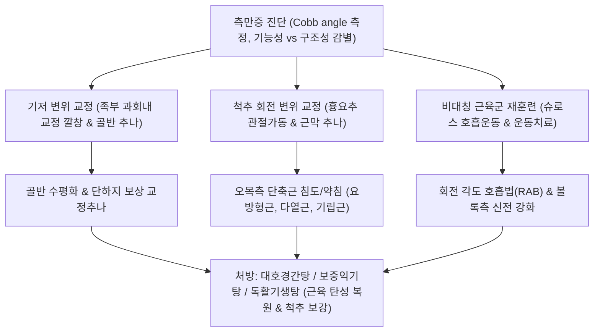

# 측만증 (Scoliosis)

> **핵심 3줄 요약 (Key Summary)**:
> - 🎯 척추가 관상면(Coronal plane) 상에서 10도 이상 외측으로 휘어짐과 동시에 시상면 만곡 소실 및 추체 회전(Vertebral rotation)이 동반되는 3차원적 척추 기형 질환
> - 🚩 원인 제거 시 회복 가능한 비구조성(기능성) 측만증과 원인 미상의 청소년기 특발성(구조성) 측만증으로 대별되며, 양측 어깨 높이 비대칭, 견갑골 돌출, 골반 비틀림 및 [[아담스 전방 굴곡 검사]] 상 늑골 융기(Rib hump)가 특징적
> - 🔍 한의학적으로 구루(傴僂), 척추편사(脊柱偏斜)로 접근하며, 흉추 회전 변위 및 골반 불균형을 바로잡는 골반-척추 교정 추나요법, 슈로스(Schroth) 3차원 호흡 운동, 단축된 [[요방형근]]·[[척추기립근]] 침도·약침 요법과 [[대호경간탕]]·[[보중익기탕]] 투여를 통해 만곡 진행 억제 및 만곡 각도 호전 도모
> - ⚠️ 급성장기 청소년의 콥 각도(Cobb angle) 진행 모니터링(Risser sign)이 필수적이며, 40~50도 이상의 중증 진행성 구조성 측만증은 수술적 고정술 적응증 감별 필요

---

## 목차 (Table of Contents)
- [[#1. 개요 및 분류 체계 (Overview & Classification)]]
  - [[#1.1 기능성 측만증 (Functional Scoliosis)]]
  - [[#1.2 구조성 측만증 (Structural Scoliosis)]]
- [[#2. 병태생리 및 3차원적 척추 변형 기전 (Pathophysiology & Biomechanics)]]
  - [[#2.1 근육 불균형과 편측 과다긴장성 (Hypertonicity)]]
  - [[#2.2 척추 회전과 흉곽 변형 기전 (Rib Hump)]]
- [[#3. 임상 증상 및 단계별 평가 (Clinical Features)]]
- [[#4. 이학적 검사 및 영상의학적 진단 (Physical Examination & Diagnosis)]]
  - [[#4.1 아담스 전방 굴곡 검사 및 시상/관상 밸런스]]
  - [[#4.2 콥 각도 (Cobb's Angle) 측정 및 리서 병기 (Risser Sign)]]
- [[#5. 감별 진단 (Differential Diagnosis)]]
- [[#6. 통합의학적 치료 전략 (Management Strategies)]]
  - [[#6.1 양방 의학적 치료 프로토콜 (보조기 & 수술)]]
  - [[#6.2 한의학적 복합 치료 프로토콜 (추나 & 슈로스 운동)]]
- [[#7. 진료실 핵심 임상 필기 (Clinical Pearls & Practice Tips)]]
- [[#8. 출처 및 학술 참고 문헌 (References)]]

---

## 1. 개요 및 분류 체계 (Overview & Classification)

### 1.1 정의 및 임상적 의의
[[측만증]](Scoliosis) 또는 척추옆굽음증은 척추가 정면(관상면)에서 볼 때 좌우 한쪽으로 C자형 또는 S자형으로 10도 이상 편위되면서, 시상면(Sagittal plane) 상의 정상 전만·후만 소실 및 축성 회전(Axial rotation)이 삼차원적으로 결합된 복합 척추 변형이다.
크게 원인 인자가 제거되면 측만이 교정되는 **기능성(비구조성) 측만증**과 척추체 자체의 회전과 해부학적 변형이 고착된 **구조성 측만증**으로 대별된다.

![[Pasted image 20240307101251.png|550]]
> [그림 1] 측만증의 다양한 임상 형태와 편측 근육 과다긴장성(Hypertonicity): 편측 능형근, 승모근, 척추기립근 및 요방형근의 단축에 의한 척추 회전 변형 패턴

### 1.2 기능성 측만증 (Functional / Non-structural Scoliosis)
- **정의**: 척추체 자체의 구조적 회전이나 뼈의 기형이 없으며, 신체 다른 부위의 불균형이나 외부 자극에 대한 보상 작용으로 일시적으로 발생한 측만 상태. 원인이 해결되거나 누운 자세(Supine)에서는 만곡이 완전히 소실된다.
- **주요 원인**:
  1. **동통 회피 자세(Antalgic posture)**: 급성 추간판 탈출증([[요추 추간판 탈출증]])이나 맹장염, 요로결석 등 내장기 급성 염증으로 인해 통증을 피하려는 반사성 척추 굴곡.
  2. **하지 길이 불일치(Leg Length Discrepancy, LLD)**: 한쪽 다리가 짧아 골반 경사(Pelvic tilt) 및 골반 변위가 발생하고 그 상부 척추가 보상적으로 기우는 현상.
  3. **자세 불량 및 보행 이상**: 족부 과회내(Pronated foot), 짝다리 짚기, 한쪽 어깨로만 가방 메기, 턱관절 장애(TMD)로 인한 경추 부정렬.

### 1.3 구조성 측만증 (Structural Scoliosis)
- **정의**: 척추 분절의 유연성이 소실되고 척추체의 회전 변형(Rotation)과 쐐기형 추체 변형이 동반되어, 누운 자세나 능동 굴곡 시에도 만곡이 지속되는 비가역적 성향의 측만증.
- **주요 분류**:
  1. **특발성 척추측만증(Idiopathic Scoliosis, 80~85%)**: 원인이 명확히 밝혀지지 않은 유형으로, 소아기·청소년기 급성장기에 호발하며 여아에서 5~8배 더 높은 만곡 진행률을 보인다. 유전적 요인, 멜라토닌 수용체 신호전달 이상, 신경계 고유수용감각 부전, 칼슘 및 미량 원소 대사 이상 등이 기전으로 제시된다.
  2. **선천성 측만증(Congenital)**: 반척추(Hemivertebrae), 분절 부전 등 태생기 척추 발생 결함.
  3. **신경근육성 측만증(Neuromuscular)**: 뇌성마비, 척수소아마비, 근이영양증 등에 수반.

---

## 2. 병태생리 및 3차원적 척추 변형 기전 (Pathophysiology & Biomechanics)

### 2.1 근육 불균형과 편측 과다긴장성 (Hypertonicity)
척추 측만은 척추를 둘러싼 근육군의 심각한 좌우 비대칭(Asymmetry)을 초래한다.
- **만곡의 오목한 쪽(Concave side)**:
  - 척추가 꺾여 들어가는 오목한 쪽의 근육군은 만성적으로 단축(Shortened)되고 과긴장(Hypertonicity) 상태에 놓인다.
  - 대표적으로 편측 [[요방형근]](Quadratus Lumborum), [[척추기립근]](Erector Spinae), [[다열근]](Multifidus), [[능형근]](Rhomboid), [[승모근]](Trapezius)이 섬유화되고 단축되어 척추를 지속적으로 해당 방향으로 끌어당긴다.
- **만곡의 볼록한 쪽(Convex side)**:
  - 반대편 볼록한 쪽의 근육군은 장기간 과신장(Lengthened)되어 근력 약화(Inhibition)와 만성 근막성 허혈 통증이 발생한다.

### 2.2 척추 회전과 흉곽 변형 기전 (Rib Hump)
- **추체 회전(Vertebral Rotation)**: 척추체는 만곡의 **볼록한 쪽(Convex side)**을 향해 회전하고, 극돌기(Spinous process)는 반대로 **오목한 쪽(Concave side)**을 향해 회전한다.
- **늑골 융기(Rib Hump) 형성**: 흉추체가 볼록한 쪽으로 회전함에 따라, 흉추 횡돌기에 연결된 갈비뼈(Rib)가 등 뒤쪽으로 융기되어 볼록 튀어나오는 특징적인 늑골 융기를 형성한다.
- **심폐 기능 저하**: 콥 각도가 60~80도 이상으로 진행되면 흉곽 용적이 감소하여 제한성 폐질환(Restrictive lung disease), 폐활량 감소, 폐성심(Cor pulmonale) 등 중대한 내과적 합병증이 초래된다.

---

## 3. 임상 증상 및 단계별 평가 (Clinical Features)

### 3.1 주요 외형적 비대칭 징후
- **양측 어깨 높이 불일치**: 한쪽 어깨가 비정상적으로 올라가 보임.
- **견갑골 돌출 비대칭**: 만곡 볼록 쪽의 견갑골 하각이 등 뒤로 불룩 튀어나옴.
- **체간 삼각(Waist Crease) 비대칭**: 팔을 자연스럽게 내렸을 때 몸통과 팔 사이의 공간(Flank crease)이 한쪽은 깊게 파이고 반대쪽은 완만함.
- **골반 높이 및 둔부 비대칭**: 한쪽 장골능(Iliac crest)이 올라가 바지선이나 치마가 한쪽으로 자꾸 돌아감.
- **성장기 청소년의 경우**: 대개 통증은 없으나 외형적 변형으로 인한 극심한 심리적 위축과 스트레스 호소.

---

## 4. 이학적 검사 및 영상의학적 진단 (Physical Examination & Diagnosis)

### 4.1 아담스 전방 굴곡 검사 (Adams Forward Bend Test)
- **검사 방법**: 환자에게 무릎을 완전히 펴고 발을 모은 상태에서 양손을 맞대고 상체를 앞으로 90도 천천히 숙이도록 지시한다.
- **판정**:
  - 검사자는 뒤쪽에서 척추 수평선을 시진 또는 스콜리오미터(Scoliometer)로 측정한다.
  - **기능성 측만증**: 숙였을 때 좌우 높낮이 차이가 소실되고 등이 편평해진다.
  - **구조성 측만증**: 척추체 회전으로 인해 흉추부의 늑골 융기(Rib hump) 또는 요추부의 요추 융기(Lumbar hump)가 뚜렷하게 솟아오른다. (스콜리오미터 5~7도 이상 회전각 측정 시 방사선 촬영 적응증).
- **관상면 균형(Coronal Balance / C7 Plumb Line)**:
  - C7 극돌기 또는 외후두융기(EOP)에서 추(Plumb line)를 바닥으로 늘어뜨렸을 때, 추선이 둔부 둔열(Gluteal cleft) 정중앙에 떨어지는지 평가하여 체간의 좌우 편향도를 측정한다.

![[Pasted image 20240307101301.png|500]]
> [그림 2] 측만증 각도 검사: 선 자세 전척추 방사선(Full-spine X-ray) 상에서 만곡의 상단 및 하단 변곡 척추체를 기준으로 측정하는 콥 각도(Cobb's Angle) 측정 원리

### 4.2 콥 각도 (Cobb's Angle) 측정 및 리서 병기 (Risser Sign)
- **콥 각도(Cobb's Angle) - 표준 진단 기준**:
  - 기립위 전척추 X-ray(Full-spine AP)에서 측정.
  - 만곡의 가장 위쪽으로 기울어진 척추체(Upper end vertebra)의 상단 피질골에 평행선을 긋고, 가장 아래쪽으로 기울어진 척추체(Lower end vertebra)의 하단 피질골에 평행선을 그은 후, 두 선의 수직선이 교차하는 사잇각을 측정한다.
  - **10도 이상일 때 측만증으로 공식 확진**.
- **리서 병기(Risser Sign - 골성숙도 평가)**:
  - 장골능(Iliac apophysis)의 골화 진행 정도를 0단계(골화 없음, 미성숙, 만곡 진행 위험 최고)부터 5단계(완전 골유합, 성장 종료, 진행 위험 감소)로 분류하여 치료 방향을 결정한다.

---

## 5. 감별 진단 (Differential Diagnosis)

| 분류 | 만곡의 가역성 | 회전 변형(Rib Hump) | 누운 자세/숙인 자세 | 주요 원인 및 감별 |
| :--- | :--- | :--- | :--- | :--- |
| **기능성 측만증** | 가역적 (완치 가능) | **늑골 융기 없음 (음성)** | **만곡 완전 소실 (정상 정렬)** | 하지부동(LLD), 요통 회피, 골반 경사, 자세 불량 |
| **청소년 특발성 측만증(AIS)** | 비가역적 구조성 | **늑골 융기 뚜렷 (양성)** | **만곡 및 회전 지속** | 원인 미상, 10~16세 급성장기 호발, 여아 다발 |
| **선천성 척추측만증** | 진행성 구조 기형 | 조기 발현, 유연성 없음 | 고착된 척추 만곡 | X-ray상 반척추(Hemivertebrae), 융합 척추 결함 |
| **자세성 후만측만증** | 자세 교정 시 일부 호전 | 후만 변형 동반 | 척추 유연성 유지 | 라운드 숄더, 거북목, 흉추 과후만증 동반 |
| **신경섬유종증/마르판** | 심각한 급격 진행 | 짧고 날카로운 만곡 | 피부 밀크커피반점, 관절 과이완 | 전신 결합조직/유전 질환 소견 동반 |

---

## 6. 통합의학적 치료 전략 (Management Strategies)

### 6.1 양방 의학적 치료 프로토콜 (단계별 기준)
- **1단계 (Cobb 각도 10~20도 미만)**:
  - 정기적 경과 관찰(3~6개월 간격 전척추 방사선 촬영).
  - 척추 교정 운동 및 코어 근력 강화.
- **2단계 (Cobb 각도 20~40도 & 성장 잠재력 남아있음, Risser 0~3)**:
  - **보조기 치료(Bracing)**: 보스턴 보조기(Boston brace) 또는 찰스턴 야간 보조기(Charleston bending brace)를 하루 18~23시간 착용하여 성장이 멈출 때까지 만곡 진행을 기계적으로 저지.
- **3단계 (Cobb 각도 40~50도 이상, 심폐 기능 저하 위험)**:
  - **수술적 척추 유합술(Spinal Fusion)**: 척추경 나사(Pedicle screw)와 금속 봉(Rod)을 이용해 척추를 교정하고 영구 유합.

### 6.2 한의학적 복합 치료 프로토콜
한의학적으로 측만증은 구루(傴僂), 척추편사(脊柱偏斜), 비증(痺證)의 범주에 속하며, 골반 및 족부 기저부 정렬 $\rightarrow$ 흉요추 분절 회전 교정 $\rightarrow$ 호흡 재훈련(슈로스) $\rightarrow$ 보골 양근(補骨養筋)의 통합 치법을 적용한다.

![[요골반 추나-20240913201018882.png|500]]
> [그림 3] 측만증의 골반-척추 정렬 평가 및 추나 교정 수기: 장골능 수평선 및 요추부 다열근·척추기립근 비대칭 경결 촉진과 골반 변위 교정

#### 1) 추나요법 (골반-척추 3차원 교정)
- **골반 변위 및 장골 교정**: 장골의 전방회전(AS) 또는 후방회전(PI) 변위를 교정하여 척추 지지 기저부의 수평(Pelvic horizontal line)을 회복.
- **흉추 회전 변위 교정**: 회전된 흉추 횡돌기에 접촉하여 관상면 측방 변위와 회전 변위를 동시에 감압하는 흉추 앙와위/복와위 가동 교정 기법 적용.
- **경추-턱관절(TMJ) 연계 교정**: 상부 경추(C1-C2) 아탈구 및 턱관절 편위 교정으로 하행성 체형 불균형 완화.

#### 2) 침구 치료
- **오목한 쪽(Concave side) 근육 이완**: 단축된 [[요방형근]], [[다열근]], [[척추기립근]], [[능형근]]의 협척혈(Jiaji) 및 방광경 혈위에 1.5~2.0촌 심자하여 만성 연축 상태의 근섬유를 이완.
- **볼록한 쪽(Convex side) 근육 강화**: 약화된 척추주위근에 2~100 Hz 전침(Electro-acupuncture)을 통전하여 근력과 고유수용성 감각 신경을 재활성화.

#### 3) 약침 요법
- **중성어혈약침**: 오목측 척추 기저부의 근막 유착 부위에 주입하여 혈류 장애 및 만성 무균성 염증 해소.
- **자하거 및 녹용 약침**: 성장기 척추 인대와 뼈의 결합력을 강화하고 척추 피로도를 완화하기 위해 척추 협척혈 및 관원(CV4), 신수(BL23)에 주 2회 시술.

#### 4) 슈로스(Schroth) 3차원 운동 요법
- **회전 각도 호흡법(Rotational Angular Breathing, RAB)**: 함몰된 흉곽 오목측 부위로 집중적으로 공기를 들이마셔 늑골을 내부에서부터 팽창시켜 척추 회전을 능동적으로 역교정.
- **체간 신장 운동(Elongation)**: 매달리기 및 월바(Wall bar)를 활용하여 척추 축을 수직으로 견인한 상태에서 비대칭 근육 강화 시행.

#### 5) 한약물 요법
- **성장기 체질 허약 및 측만 급진행**: [[보중익기탕]](補中益氣湯) 또는 귀비탕(歸脾湯)에 녹용, 골쇄보를 가미하여 척추 지지 인대의 인장력을 강화하고 피로 극복.
- **근육 경직 및 통증 동반**: [[대호경간탕]](大護經肝湯) 또는 작약감초탕(芍藥甘草湯)으로 근육의 과긴장 연축을 해소.
- **골성숙 지연 및 척추 피로**: [[독활기생탕]](獨活寄生湯) 가감방으로 간신을 보하고 척추 뼈의 골밀도와 인대 강도 보강.

---

## 7. 진료실 핵심 임상 필기 (Clinical Pearls & Practice Tips)

### 7.1 진료실 감별 3대 원칙
1. **서서 찍은 사진(Standing Full-Spine)만이 진짜 각도다**:
   - 일반 침대에 누워서 찍은 X-ray는 중력이 배제되어 측만 각도가 5~10도 이상 적게 측정된다. 반드시 **서서 촬영한 전척추 방사선(Full-spine PA/Lateral)**을 기준으로 콥 각도를 측정해야 오진을 방지한다.
2. **청소년기 급성장기(키가 1년에 6~8 cm 자랄 때) 집중 모니터링**:
   - 초경 전후 1~2년 및 급성장기에는 측만 각도가 1달에 2~3도씩 급격히 악화될 수 있다. 이 시기에는 최소 3개월 단위로 X-ray를 추적 관찰해야 한다.
3. **골반 깔창(Heel Lift)의 올바른 활용**:
   - 하지 길이 차이(LLD)가 1 cm 이상 확인되는 기능성 측만증의 경우, 짧은 쪽 신발에 5~7 mm의 힐 리프트(Heel lift)를 넣어주는 것만으로도 상부 척추 측만이 즉각 50% 이상 펴지는 드라마틱한 호전을 보인다.

---

## 8. 출처 및 학술 참고 문헌 (References)

1. Wang P, Xi Y, Wang X (2026). Comparative efficacy of different scoliosis-specific exercise protocols on cobb angle in adolescent idiopathic scoliosis: a network meta-analysis. *Front Sports Act Living*, 8:1367891. [PMID: 42427910](https://pubmed.ncbi.nlm.nih.gov/42427910/)
   - [연구 요약]: 청소년기 특발성 척추측만증(AIS)에서 슈로스(Schroth) 3차원 호흡 교정 운동 및 특이적 척추 운동 프로토콜이 콥 각도(Cobb angle) 감소와 삶의 질 개선에 미치는 임상적 유효성을 규명한 네트워크 메타분석.
2. Lee DY, Kim N (2026). Ground reaction force loading asymmetry and spinal alignment in adolescents with idiopathic scoliosis: A retrospective observational study. *J Back Musculoskelet Rehabil*, 39(5):1045-1053. [PMID: 42725988](https://pubmed.ncbi.nlm.nih.gov/42725988/)
   - [연구 요약]: 특발성 측만증 환자에서 지면반발력의 좌우 비대칭, 족저 압력 불균형 및 골반 회전 변위가 척추 측방 만곡의 진행에 미치는 생체역학적 상관관계를 규명함.
3. Chen G, Xiong H, Li Z et al. (2026). AI-based mid-term effectiveness prediction of bracing treatments for adolescent idiopathic scoliosis. *Artif Intell Med*, 168:103195. [PMID: 42715650](https://pubmed.ncbi.nlm.nih.gov/42715650/)
   - [연구 요약]: 보조기(Brace) 착용 환자의 콥 각도 변화, 척추 유연성 및 성장 잠재력(Risser sign)을 기반으로 중기 치료 반응과 만곡 진행 위험을 예측하는 모델 검증.

<!-- 보관 태그(1회용·링크오류, 필요시 복원): 측만증 -->
