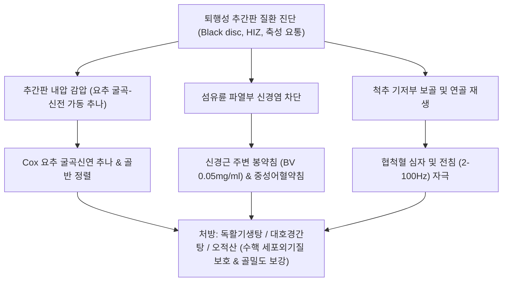

# 퇴행성 추간판 질환 (Degenerative Disc Disease)

> **핵심 3줄 요약 (Key Summary)**:
> - 🎯 노화, 만성 기계적 부하 및 유전적 소인으로 인해 추간판 수핵(Nucleus pulposus)의 수분과 프로테오글리칸이 소실되어 탄력성과 충격 흡수력을 상실하고, 섬유륜(Annulus fibrosus) 파열 및 골극이 형성되는 척추 퇴행성 질환
> - 🚩 오래 앉아 있거나 상체를 앞으로 숙일 때 악화되는 둔하고 묵직한 축성 요통(Axial low back pain), 디스크 높이 감소로 인한 척추 후관절(Facet joint) 과부하 및 후관절염 병발, MRI T2 강조영상 상 '검은 디스크(Black disc)' 및 HIZ 소견 발현
> - 🔍 한의학적으로 신허요통(腎虛腰痛), 골비(骨痺), 비증(痺證)으로 보며, 추간판 내압을 감압하는 요추 무중력 감압 추나요법, 손상된 섬유륜 염증을 제어하는 봉약침 및 신경근 약침, 추간판 재생 및 보골을 위한 [[독활기생탕]]·[[대호경간탕]] 투여로 기능 회복 도모
> - ⚠️ 단순 디스크 퇴행성 요통과 급성 신경근 압박성 수핵 탈출증([[요추 추간판 탈출증]]), 척추 불안정증, 척추관 협착증과의 단계별 감별 진단 필수

---

## 목차 (Table of Contents)
- [[#1. 개요 및 역학 (Overview & Epidemiology)]]
- [[#2. 병태생리 및 생체역학적 연쇄 반응 (Pathophysiology & Biomechanics)]]
  - [[#2.1 수핵 수분 소실과 충격 흡수 부전 (Black Disc)]]
  - [[#2.2 후관절 부하 폭증과 삼관절 복합체 붕괴]]
  - [[#2.3 연골 종판 손상과 쉬모를 결절 (Schmorl's Node)]]
- [[#3. 임상 증상 및 단계별 특징 (Clinical Features)]]
- [[#4. 이학적 검사 및 영상의학적 진단 (Physical Examination & Diagnosis)]]
  - [[#4.1 피르만 병기 (Pfirrmann Grading System)]]
  - [[#4.2 모딕 변성 (Modic Changes) 및 고신호 구역 (HIZ)]]
- [[#5. 감별 진단 (Differential Diagnosis)]]
- [[#6. 통합의학적 치료 전략 (Management Strategies)]]
  - [[#6.1 양방 의학적 치료 프로토콜]]
  - [[#6.2 한의학적 복합 치료 프로토콜]]
- [[#7. 진료실 핵심 임상 필기 (Clinical Pearls & Practice Tips)]]
- [[#8. 출처 및 학술 참고 문헌 (References)]]

---

## 1. 개요 및 역학 (Overview & Epidemiology)

### 1.1 정의 및 임상적 의의
[[퇴행성 추간판 질환]](Degenerative Disc Disease, DDD)은 척추 분절 사이에서 완충 작용을 하는 추간판(Intervertebral disc)이 노화, 미세 손상의 누적, 영양 공급 저하로 인해 점진적인 생화학적·구조적 퇴행을 겪는 질환이다.
정상 수핵의 수분 함량은 약 80~85%에 달하지만, 퇴행이 진행되면 수분과 친수성 프로테오글리칸(Proteoglycan)이 현저히 감소하여 딱딱한 섬유성 연골(Fibrocartilage)로 변성된다. 충격 흡수 능력이 상실된 디스크는 높이가 낮아지고, 그 결과 상하 척추체와 후방 [[후관절 증후군]](Facet joint)에 비정상적인 전단력과 과부하를 초래하여 척추 퇴행성 연쇄 반응(Degenerative cascade)을 촉발한다.

![[요추디스크_환상형_골극_퇴행성변화.png|500]]
> [그림 1] 추체의 퇴행성 변화 및 환상형 골극(Osteophyte) 형성: 추간판 높이 감소에 따른 상하 척추체 골막 견인 및 골극 비후 병태도해

### 1.2 역학적 특징
- **높은 유병률**: 30대 성인의 30% 이상, 50대 이상의 80~90%에서 방사선학적 디스크 퇴행이 관찰된다. (무증상인 경우도 흔함).
- **호발 분절**: 축성 체중 부하와 굴곡-신전 운동이 가장 집중되는 **요추 L4-L5 및 L5-S1** 분절에서 가장 빈발한다.
- **주요 위험 요인**: 유전적 소인(약 70% 기여), 장시간 앉아 있는 좌식 생활, 흡연(디스크 무혈관 영양 공급 차단), 진동 직업군(트럭/중장비 운전), 비만, 척추 외상 병력.

---

## 2. 병태생리 및 생체역학적 연쇄 반응 (Pathophysiology & Biomechanics)

### 2.1 수핵 수분 소실과 충격 흡수 부전 (Black Disc)
수핵 내의 아그레칸(Aggrecan) 소실 $\rightarrow$ 삼투압 저하 $\rightarrow$ 수분 탈수 $\rightarrow$ 정수압성 하중 분산 기전 상실.
디스크에 하중이 가해질 때 수핵이 사방으로 균일하게 압력을 분산시키지 못하고, 섬유륜(Annulus fibrosus)에 국소적 균열(Fissure)과 파열이 발생한다.
탈수된 수핵은 MRI T2 강조영상에서 정상적인 하얀 고신호 대신 검은색 저신호로 나타나므로 흔히 **'검은 디스크(Black disc)'**라 불린다.

![[요추디스크_수핵탈출_MRI_및_탈출형태.png|500]]
> [그림 2] 요추 추간판의 수핵 탈출 형태 및 MRI 소견: 팽륜(Bulging), 돌출(Protrusion), 탈출(Extrusion) 및 디스크 수분 소실에 따른 저신호 변화

### 2.2 후관절 부하 폭증과 삼관절 복합체 붕괴
정상 척추에서 전방 디스크가 체중의 약 80%를 지탱하고, 후방의 양측 후관절(Facet joints)은 20%를 분담한다.
- **디스크 높이 감소의 여파**: 디스크 높이가 1~3 mm만 감소해도 **후관절에 가해지는 압박 하중이 40~70% 이상으로 급격히 폭증**한다.
- **후관절염 및 협착증 유발**: 후관절 연골 마모, 골극 형성, 황색인대(Ligamentum flavum)의 비후 및 주름잡힘(Buckling)이 연쇄적으로 발생하여 척추관 협착증([[척추관 협착증]])과 [[후관절 증후군]]으로 이어진다.

### 2.3 연골 종판 손상과 쉬모를 결절 (Schmorl's Node)
- **종판 경화(Endplate sclerosis)**: 척추체와 추간판 사이의 모세혈관 확산을 통한 유일한 영양 공급 통로인 연골 종판이 칼슘화되고 경화되어 디스크 괴사가 가속화된다.
- **쉬모를 결절(Schmorl's node)**: 퇴행으로 약해진 연골 종판의 수직 파열 부위를 통해 수핵 조직이 척추체 해면골 내부로 수직 탈출하여 골수 내 염증 반응을 유발한다.

![[요추디스크_수직형_쉬모를결절_Schmorl_node.png|500]]
> [그림 3] 추간판 연골 종판(Endplate) 파열과 쉬모를 결절(Schmorl's node): 수핵의 척추체 골수 내 수직 함입 및 모딕 변성(Modic changes)

---

## 3. 임상 증상 및 단계별 특징 (Clinical Features)

### 3.1 주요 자각 증상 (추간판성 요통, Discogenic Pain)
- **자세 의존성 축성 요통**:
  - 허리 정중앙 부위의 묵직하고 뻐근한 심부 통증(Deep dull ache)이 지속된다.
  - **의자에 20~30분 이상 앉아 있을 때 디스크 내압 상승으로 통증 극심화**.
  - 서 있거나 걸으면 디스크 내압이 분산되어 오히려 편해지는 경향을 보인다.
- **상체 전방 굴곡 시 악화**:
  - 바닥의 물건을 줍거나 양말을 신으려 상체를 앞으로 숙일 때 허리가 끊어질 듯 아픔.
  - 아침에 잠자리에서 일어날 때 허리가 굳어 바로 펴지 못하고 엉거주춤한 자세를 취함.
- **둔부 및 대퇴부 방사통 (연관통)**:
  - 신경근 압박이 없더라도 손상된 섬유륜 외측의 동척추신경(Sinuvertebral nerve) 자극으로 인해 엉덩이(둔부) 및 대퇴부 후면으로 묵직하게 뻐근한 가성 방사통(Referred pain)이 나타남 (무릎 아래 발가락으로는 내려가지 않음).

---

## 4. 이학적 검사 및 영상의학적 진단 (Physical Examination & Diagnosis)

![[밀그램검사_병태생리_요추디스크_신경근압박_도해.jpg|500]]
> [그림 4] 밀그램 검사(Milgram's Test)의 병태생리: 양하지 거상 시 복압 및 추간판 내압 상승으로 인한 디스크성 통증 유발 메커니즘

### 4.1 특수 이학적 유발 검사
1. **[[밀그램 검사]](Milgram's Test)**:
   - 환자가 바로 누운 앙와위에서 양 발을 모아 바닥에서 약 5~10 cm 들어 올리고 30초간 버티도록 한다.
   - 복압과 척추 디스크 내압이 급상승하여 30초를 버티지 못하고 허리 통증으로 다리를 떨어뜨리면 양성 (디스크성 요통 선별).
2. **하지직거상 검사(SLR Test)**:
   - 신경근 탈출증이 아닌 단순 퇴행성 디스크 질환에서는 70도 이상 거상 시에도 하지 방사통이 나타나지 않음 (음성).
3. **요추 굴곡-신전 저항 검사**: 굴곡 시 추간판성 요통 악화, 신전 시 후관절 충돌 통증 유발 여부 감별.

### 4.2 영상의학적 평가 및 분류 체계
- **피르만 병기 (Pfirrmann Grading - MRI T2 시상면)**:
  - Grade I: 균일한 고신호(하얀색), 정상 높이.
  - Grade II: 불균일하나 명확한 고신호, 수핵-섬유륜 경계 유지.
  - Grade III: 중간 신호(회색), 수핵 경계 불명확.
  - **Grade IV: 저신호(검은색, Black disc), 수핵 경계 소실, 디스크 높이 정상 또는 경도 감소**.
  - **Grade V: 완전 무신호(검은색), 디스크 공간의 심각한 협착 및 붕괴**.
- **모딕 변성 (Modic Changes - 종판 및 인접 척추체 골수 신호 변화)**:
  - **Modic Type 1**: T1 저신호 / T2 고신호 $\rightarrow$ 혈관 증식 및 급성 염증성 부종 (통증이 가장 심한 시기).
  - **Modic Type 2**: T1 고신호 / T2 등신호 $\rightarrow$ 골수 지방 변성 (안정화 단계).
  - **Modic Type 3**: T1 저신호 / T2 저신호 $\rightarrow$ 광범위한 골경화 (진행된 퇴행).
- **고신호강도 구역 (High-Intensity Zone, HIZ)**: T2 시상면에서 섬유륜 후방에 하얗게 찍히는 점으로, 섬유륜 파열부 내로 신생 혈관과 신경이 자라 들어간 통증 유발 병소(Pain generator)를 의미.

---

## 5. 감별 진단 (Differential Diagnosis)

| 질환명 | 주 통증 부위 | 통증 악화/완화 자세 | 영상의학적 특징 |
| :--- | :--- | :--- | :--- |
| **[[퇴행성 추간판 질환]](DDD)** | 요추 중앙 심부 요통, 둔부 연관통 | **앉을 때 악화**, 서거나 걸으면 완화 | MRI Black disc, HIZ, Modic Type 1/2, 골극 |
| **[[요추 추간판 탈출증]](HIVD)** | 요통 + **무릎 아래 발가락 방사통** | 상체 숙일 때, 기침 시 방사통 악화 | SLR 양성, 신경근 압박, 감각/근력 저하 |
| [[후관절 증후군]] | 요추 외측, 서혜부/대퇴부 연관통 | **허리를 뒤로 젖힐 때(신전) 악화** | Kemp test 양성, 후관절 비후 및 골관절염 |
| [[척추관 협착증]] | 둔부 및 양측 하지 전반 뻐근함 | **걸을 때 하지 파행(보행 장애)**, 숙이면 완화 | 신경성 간헐적 파행, 중심 척추관 횡단면 협착 |
| **[[근막통증증후군]](요방형근/둔근)** | 허리 측면 및 골반 외측 통증 | 특정 자세 유지 시 통증 | 국소 근육 압통점(TrP), 영상검사상 뼈/디스크 정상 |

---

## 6. 통합의학적 치료 전략 (Management Strategies)

### 6.1 양방 의학적 치료 프로토콜
1. **보존적 단계**:
   - 디스크 부하 완화: 오래 앉아 있기 금지, 스탠딩 데스크 사용 권고.
   - 약물 치료: NSAIDs, 근이완제, 만성 신경성 통증 시 둘록세틴, 항우울제.
   - 코어 운동(Core Stabilization): 맥길(McGill) 빅3 운동, 플랭크, 버드독 운동.
2. **시술적 치료**:
   - 요추 경막외 신경차단술(Epidural Block): Modic 1형 염증 및 HIZ에 의한 화학적 신경염 완화.
   - 고주파 수핵감압술(L-DISQ) 및 추간판내 고주파 열치료술(IDET): 섬유륜 파열부 신생 신경 차단.
3. **수술적 치료 고려 (보존적 치료 6개월~1년 실패, 불능 요통 지속 시)**:
   - 요추 추체간 유합술(PLIF / TLIF / ALIF) 또는 인공 디스크 치환술(TDR).

### 6.2 한의학적 복합 치료 프로토콜
한의학적으로 퇴행성 추간판 질환은 신허요통(腎虛腰痛), 골비(骨痺), 비증(痺證)의 범주에 속하며, 간신부족(肝腎不足), 기체어혈(氣滯瘀血), 풍한습비(風寒濕痺)로 변증한다.

#### 1) 추나요법 (Cox 굴곡신연 기법 & 무중력 감압)
- **Cox 굴곡신연 기법(Flexion-Distraction Chuna)**:
  - 굴곡신연 전용 테이블을 이용하여 퇴행된 요추 분절에 간헐적인 축성 견인(Traction)과 미세 굴곡을 가함.
  - 추간판 내압을 -100 mmHg 이하의 음압(Negative pressure)으로 떨어뜨려 디스크 내부로 영양 물질(포도당, 산소, 수분)의 삼투 흡수를 극대화하고 후관절 충돌을 감압.

#### 2) 침구 치료
- **국소 협척혈(Jiaji) 심자**: 퇴행 분절의 L4-L5, L5-S1 양측 협척혈에 0.30×60 mm 호침을 40~50 mm 깊이로 직자하여 동척추신경(Sinuvertebral nerve)의 흥분을 억제하고 다열근의 위축을 방지.
- **방광경 혈위**: 신수(BL23), 대장수(BL25), 관원수(BL26), 위중(BL40), 곤륜(BL60).
- **전침 치료**: 2 Hz와 100 Hz 혼합파를 20분간 통전하여 내인성 오피오이드(Endorphin, Enkephalin) 분비를 유도하고 추간판 퇴행 유발 염증성 사이토카인(IL-1β, TNF-α)을 억제.

#### 3) 약침 요법
- **봉약침 요법 (Bee Venom)**: 섬유륜 파열 및 HIZ 소견을 보이는 분절의 후관절 및 황색인대 주변에 BV(0.05~0.1 mg/ml)를 0.5~1.0 cc 주입하여 강력한 멜리틴 항염증 작용으로 추간판성 요통을 근본 진통.
- **자하거 및 녹용 약침**: Modic 변성이 동반된 만성 척추체 골수 부종 및 연골 종판 경화 환자에게 주입하여 성장인자(IGF-1, TGF-β)를 공급하고 추간판 세포외기질 재생을 촉진.

#### 4) 한약물 요법
- **만성 디스크 퇴행 및 기혈휴손**: [[독활기생탕]](獨活寄生湯) 합 육미지황탕(六味地黃湯)에 보골지, 두충, 구척을 가미하여 간신을 보하고 척추 연골 기질을 재생.
- **디스크성 요통 및 근막 경직**: [[대호경간탕]](大護經肝湯) 또는 서경탕(舒經湯)으로 요배부 척추주위근막의 만성 구축을 이완.
- **비증 및 한습성 요통**: [[오적산]](五積散) 가미방으로 요배부의 냉증과 어혈을 몰아내고 미세 혈류 순환을 촉진.

---

## 7. 진료실 핵심 임상 필기 (Clinical Pearls & Practice Tips)

### 7.1 진료실 감별 3대 원칙
1. **"앉으면 아프고 서면 편하다" $\rightarrow$ 디스크(DDD)**:
   - 서 있을 때 요통이 심해지고 앉으면 편해지는 척추관 협착증이나 후관절 증후군과 정반대로, **"의자에 20분만 앉아 있으면 허리가 빠질 듯이 묵직하게 아파서 자꾸 일어나 서 있는다"**고 호소하면 십중팔구 퇴행성 추간판 질환(DDD)이다.
2. **발가락 저림이 없는 둔부 통증**:
   - 디스크 문제라고 해서 모두 다리로 전기가 통하지는 않는다. 섬유륜 파열에 의한 동척추신경 자극은 허리와 엉치, 허벅지 뒤쪽까지만 뻐근하게 아픈 연관통(Referred pain)을 유발하므로, 신경근 탈출증과 혼동하지 않아야 한다.
3. **허리 굽히는 스트레칭(상체 숙이기) 엄격 금기 지도**:
   - 디스크 환자가 허리가 뻣뻣하다고 앞으로 상체를 숙여 발끝을 닿게 하는 햄스트링 스트레칭을 하면 디스크 내압이 200 mmHg 이상으로 치솟아 섬유륜 파열이 악화된다. 반드시 **맥켄지(McKenzie) 신전 운동이나 중립 척추 코어 운동**만을 지도해야 한다.

---

## 8. 출처 및 학술 참고 문헌 (References)

1. Zhou Q, Cai J, Zhu W et al. (2026). The High-Intensity Zone: A Dynamic Inflammatory Hub in Lumbar Disc Degeneration. *Orthop Surg*, 18(9):1782-1793. [PMID: 42500814](https://pubmed.ncbi.nlm.nih.gov/42500814/)
   - [연구 요약]: 요추 디스크 퇴행에서 MRI상 고신호강도 구역(HIZ)이 섬유륜 파열부의 육아조직 증식, 신생 신경망(Nociceptive neoinnervation) 및 염증성 디스크성 요통의 핵심 기전임을 규명함.
2. Patel S, Mendonca A, Nischal SA et al. (2026). Total disc replacement versus lumbar interbody fusion for degenerative disc disease: a meta-analysis of randomized controlled trials. *Neurosurg Focus*, 61(1):E8. [PMID: 42385251](https://pubmed.ncbi.nlm.nih.gov/42385251/)
   - [연구 요약]: 보존적 치료에 반응하지 않는 만성 퇴행성 추간판 질환에서 인공 디스크 치환술과 요추 유합술의 통증 완화, 분절 운동성 보존 및 인접 분절 질환 발생률을 비교 분석함.
3. Zheng K, Zhang P, Wang S et al. (2026). The estrogen-ferroptosis axis in postmenopausal osteoporosis, osteoarthritis, and intervertebral disc degeneration: shared mechanisms and emerging evidence. *Front Immunol*, 17:1398254. [PMID: 42719629](https://pubmed.ncbi.nlm.nih.gov/42719629/)
   - [연구 요약]: 폐경 후 에스트로겐 결핍 및 산화 스트레스가 수핵 세포의 철사멸(Ferroptosis)과 세포외기질(콜라겐, 프로테오글리칸) 분해를 촉진하는 추간판 퇴행 분자 기전을 규명함.

<!-- 보관 태그(1회용·링크오류, 필요시 복원): 디스크 -->
