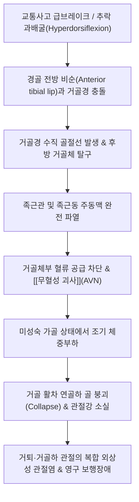

# 🩺 [[거골 경부 골절]] (Talar Neck Fracture / 距骨頸部骨折, S92.1)

> **핵심 3줄 요약 (Key Summary)**:
> - 📍 병소 부위 & 해부·병태생리: 족근골 중 체중을 하퇴에서 족부로 전달하는 핵심 중심축인 [[거골]](Talus)의 경부(Neck). 족근관 동맥(후경골동맥 분지) 및 족근동 동맥(비골·전경골동맥 분지)의 혈류 차단 시 거골체부의 [[무혈성 괴사]](AVN, 호킨스 3형 시 최대 80~100%) 및 거골하관절 관절염 위험이 극히 높음.
> - 🚩 전형적 임상 양상 & 3대 징후: 발목 과배굴 강타 후 전족부/족관절 급성 극통, 심한 족관절 종창과 피하 반상출혈, **완전한 체중부하 불능(Inability to bear weight)**, 6~8주경 방사선상 호킨스 징후(Hawkins sign) 발현 여부가 혈류 보존의 결정적 지표.
> - 🛠️ 핵심 감별 검사 & 한·양방 다각적 치료 전략: 족관절 AP/Lateral/Canale view 및 전위 의심 시 즉시 3D-CT 촬영. Type I 비전위는 단하지 석고 및 6~8주 엄격한 비체중부하(NWB), Type II~IV는 해부학적 압박 나사 내고정술(ORIF). 가골 형성 및 미세혈류 재개통을 위한 [[자연동]](산골)·[[당귀수산]] 투약, 관절 유합 및 Hawkins sign 확인 후 점진적 체중부하 및 족관절 가동 추나.
> - ⚠️ 응급 의뢰 레드플래그: 거골체부의 무혈성 골괴사(AVN), 거골하 및 거퇴관절의 복합 탈구(Hawkins Type III~IV, 피부 괴사 임박), 거골 골절 불유합/부정유합, 외상성 편평족 변형 및 난치성 족관절 관절증.

---

## 📌 목차
1. [질환 개요 & 해부학적 병태생리](#1-질환-개요--해부학적-병태생리)
2. [병태생리 메커니즘 & 생체역학적 악순환 네트워크](#2-병태생리-메커니즘--생체역학적-악순환-네트워크)
3. [임상 증상 & 이학적 검사(Physical Exam) 알고리즘](#3-임상-증상--이학적-검사physical-exam-알고리즘)
4. [감별 진단 매트릭스 (Differential Diagnosis)](#4-감별-진단-매트릭스-differential-diagnosis)
5. [한의 통합 치료 프로토콜 (침·약침·추나·한약)](#5-한의-통합-치료-프로토콜-침약침추나한약)
6. [양방 치료 & 병용·의뢰 기준 (Conventional Treatment & Referral)](#6-양방-치료--병용의뢰-기준-conventional-treatment--referral)
7. [재활 운동 & 생활습관 티칭 가이드](#7-재활-운동--생활습관-티칭-가이드)
8. [💡 사용자 진료실 핵심 필기 & 임상 노하우 (Melt-In 잔여 심화 집약)](#8--사용자-진료실-핵심-필기--임상-노하우-melt-in-잔여-심화-집약)
9. [출처 및 학술 참고 문헌 (References)](#9-출처-및-학술-참고-문헌-references)

---

## 1. 질환 개요 & 해부학적 병태생리

![[거골경부골절_01_병태도해_거골경부골절_호킨스분류.jpg|450]]
> [그림 1: ① 전위 및 동반 탈구 양상에 따른 거골 경부 골절의 호킨스(Hawkins) 분류 체계 도해 — Wikimedia Commons (CC BY-SA 4.0)]

![[거골경부골절_01_영상의학_거골체부전위골절_Xray.jpg|320]]
> [그림 2: ② 거골 경부의 심한 전위 및 거골하관절 아탈구가 관찰되는 Hawkins Type II 골절 측면 X-ray — Wikimedia Commons (CC BY-SA 4.0)]

![[거골경부골절_02_해부도해_거골_내측외측_해부도.jpg|420]]
> [그림 3: ③ 근육 부착이 전혀 없고 60% 이상 연골로 둘러싸인 거골(Talus)의 내외측 골성 구조 해부도 — Wikimedia Commons (CC BY-SA 4.0)]

* **질환 정의 및 역학**:
  * 거골 경부 골절(Talar neck fracture)은 종골(발뒤꿈치뼈)에 이어 두 번째로 흔한 족근골 골절(전체 족근골 골절의 약 50%)이지만, 골괴사 및 관절염 등 치명적인 합병증 빈도가 가장 높은 고위험 질환입니다.
  * 과거 전투기 조종사가 불시착할 때 방향타 페달에 발이 끼이며 족관절이 과도하게 배굴되어 다발하여 **"비행사 골절(Aviator's astragalus)"**이라 불렸으며, 현대에는 자동차 운전 중 급브레이크를 밟으며 충돌하는 교통사고나 높은 곳에서의 추락 사고로 다발합니다.
* **호킨스 분류법 (Hawkins Classification)**:
  * **Type I (비전위성, 약 15%)**: 전위가 없는 수직 골절선. AVN 위험도 0~10%.
  * **Type II (전위 + 거골하관절 탈구, 약 50%)**: 거골경 골절과 함께 거골하관절(Subtalar joint)이 아탈구 또는 탈구됨. AVN 위험도 30~50%.
  * **Type III (전위 + 거골하관절 및 거퇴관절 탈구, 약 25%)**: 거골체가 족관절 활차에서 후내측으로 완전히 이탈. AVN 위험도 80~100%.
  * **Type IV (Type III + 거주상관절 탈구 동반, 약 10%)**: 전족부까지 탈구된 가장 심각한 형태. AVN 위험도 100% 육박.
* **독특한 혈행 공급의 취약성**:
  * 거골은 골 표면의 60% 이상이 관절연골로 덮여 있고 **근육이나 힘줄이 단 하나도 부착되지 않는 유일한 골격**입니다.
  * 혈류는 오직 인대와 활액막을 통해 유입되며, 주 혈류인 **족근관 동맥(artery of tarsal canal, 후경골동맥 분지)**과 족근동 동맥(artery of tarsal sinus)이 거골경부 하방을 통해 진입하여 거골체부로 역행성 공급을 담당하므로, 경부 골절 시 혈관망이 파열되어 거골체부가 통째로 썩어 들어가는 무혈성 괴사에 빠지게 됩니다.

---

## 2. 병태생리 메커니즘 & 생체역학적 악순환 네트워크

### 1) 혈관 단절과 거골체 무혈성 괴사 (AVN)의 진행 기전
* 거골경이 골절되면서 족관절 후방으로 전위되면 거골체로 들어가는 후방 결절 분지마저 끊어져 거골체는 완전한 무혈관 상태(avascular island)가 됩니다.
* 골세포가 괴사하더라도 단순 방사선상에서는 즉시 나타나지 않으며, 골절 치유 과정에서 주변 정상 뼈들이 고정으로 인해 골감소증(osteopenia)을 겪을 때 죽은 뼈는 혈액 순환이 없어 골흡수가 일어나지 않아 상대적으로 **하얗게 경화(relative sclerosis)**되어 보이게 됩니다.

### 2) 호킨스 징후 (Hawkins Sign)의 생체역학적 의미
* 수상 후 6~8주경 족관절 AP 방사선 사진에서 **거골 활차 연골하 피질 바로 아래에 띠 모양의 방사선 투과성 골감소 띠(subchondral radiolucency)**가 나타나는 현상입니다.
* 이는 뼈가 재흡수되고 새로운 모세혈관이 자라 들어가 혈관 재형성(revascularization)이 성공적으로 이루어지고 있음을 의미하는 **매우 강력한 생존의 신호(Viability sign)**입니다. 호킨스 징후가 양성이면 AVN의 위험에서 95% 이상 벗어난 것으로 판단합니다.

---

## 3. 임상 증상 & 이학적 검사(Physical Exam) 알고리즘

### 1) 전형적 임상 증상
* **격심한 족관절 동통 및 완전 체중부하 불능**: 발을 바닥에 디딜 수조차 없으며, 발목 주위가 족관절 염좌와 비교할 수 없을 정도로 풍선처럼 심하게 부어오릅니다.
* **피부 긴장 및 괴사 위험 (Tenting of skin)**: 전위된 거골체 골편이 후내측 피부를 뚫을 듯이 팽팽하게 밀어내어(Tenting), 조기에 정복하지 않으면 수 시간 내에 피부 허혈성 괴사 및 개방성 골절로 전환됩니다.

### 2) 필수 신경혈관 검사
* **족배동맥(Dorsalis pedis) 및 후경골동맥(Posterior tibial artery) 맥박 촉지**: 족관절 골절 탈구 시 동맥 파열 위험을 반드시 배제해야 합니다.
* **내외측 족저신경 감각 평가**: 거골체 탈구 골편에 의한 족근관 증후군성 신경 압박 여부 확인.

---

## 4. 감별 진단 매트릭스 (Differential Diagnosis)

| 감별 질환 | 호발 손상 기전 | 핵심 압통 부위 | 방사선 감별 소견 |
| :--- | :--- | :--- | :--- |
| **[[거골 경부 골절]]** | 발목 과배굴 고에너지 외상 | 족관절 심부, 거골경 전방 압통 | Canale view상 거골경 골절선, 거골하 탈구 |
| **[[발목 염좌]]** (외측) | 발목 내반(Inversion) 족저굴곡 | 전거비인대(ATFL) 부위 국소 압통 | X-ray상 골절선 없음, 체중부하 부분 가능 |
| **종골 골절** | 높은 곳에서 발뒤꿈치로 착지 | 종골 외측벽 팽만, 발뒤꿈치 부종 | 측면 X-ray상 Bohler 각 감소(<20도) |
| **족관절 삼과 골절** | 발목 외회전·외반 염좌 | 내과, 외과, 후과 3대 복사뼈 압통 | 경골 및 비골 복사뼈 골절선 확인 |

---

## 5. 한의 통합 치료 프로토콜 (침·약침·추나·한약)

![[거골경부골절_05_술기실사_족부족관절_침치료.jpg|400]]
> [그림 4: ④ 족관절 및 족근골 주위 미세 순환 촉진과 혈종 흡수를 위한 경혈 침구 치료 실사 — Wikimedia Commons (CC BY-SA 2.0)]

* **치료 원칙**: 거골은 체중을 전담하는 뼈이므로, 골유합 및 Hawkins sign이 나타나기 전까지는 **엄격한 비체중부하(NWB)**를 유지하면서 한의학적 골유합 및 혈류 재생 치료를 적용합니다.
* **침구 및 전침 치료**:
  * 혈종 흡수 및 족관절 순환 개선: [[구허]](GB40), [[해계]](ST41), [[상구]](SP5), [[중봉]](LR4), [[태계]](KI3), [[곤륜]](BL60), [[조해]](KI6).
  * 족근동(Sinus tarsi) 주위 구허혈 자침을 통해 족근동 동맥망의 반사성 혈류 확장을 유도합니다.
* **약침 치료**: 황련해독탕 약침을 족관절 전방 활액막 주위에 미량 주입하여 급성 활액막염 부종을 억제하고, 아급성기에는 자하거 약침을 태계 및 곤륜 혈위에 투여하여 영양 혈관 신생을 촉진합니다.
* **단계별 한약 치료**:
  * **급성기 (1~2주)**: [[당귀수산]](當歸鬚散) 합 [[오령산]](五苓散) (족부 연부조직의 격심한 혈종과 긴장성 수포 부종 흡수).
  * **골형성기 (3~12주)**: 접골단(接骨丹) 가 [[자연동]](산골) 2.0g 합 [[보허탕]](補虛湯) (거골내 미세혈관 재형성, 파골-골아세포 리모델링 촉진, AVN 예방).
  * **재활 보행기 (12주 이후)**: [[독활기생탕]](獨活寄生湯) (장기 깁스로 인한 족관절 및 거골하관절 강직 해소).

---

## 6. 양방 치료 & 병용·의뢰 기준 (Conventional Treatment & Referral)

![[거골경부골절_06_보존치료_비체중부하_목발보행.png|300]]
> [그림 5: ⑤ 거골체 무혈성 괴사 방지를 위해 필수적인 6~8주간의 엄격한 비체중부하(Non-Weight Bearing) 목발 보행 — Wikimedia Commons (CC BY-SA 4.0)]

![[거골경부골절_06_양방수술_족관절_나사내고정술_Xray.jpg|320]]
> [그림 6: ⑥ 전위된 거골 골절에 대해 후방에서 전방으로 무두 압박 나사를 삽입하여 고정한 관혈적 정복 내고정술(ORIF) 술후 X-ray — Wikimedia Commons (CC BY-SA 3.0)]

* **양방 치료 원칙**:
  * **Hawkins Type I (비전위)**: 장하지 석고 후 단하지 석고 고정으로 총 8~12주간 치료하며, 초기 6~8주는 절대 발을 땅에 딛지 않는 **완전 비체중부하(NWB)**를 유지합니다.
  * **Hawkins Type II~IV (전위 골절)**: 응급 수술 적응증입니다. 거골하관절과 거골체를 1mm의 오차도 없이 해부학적으로 맞춘 뒤, 전방 또는 후방 접근법을 통해 **무두 캐뉼레이티드 압박 나사(Headless compression screw)**로 견고하게 내고정합니다.
* **응급 의뢰 레드플래그**:
  * 거골 전위로 피부가 하얗게 질리며 괴사 징후가 보일 때 (응급 도수정복 또는 응급 수술 필수).
  * 6~8주 X-ray에서 Hawkins 징후가 나타나지 않고 거골체가 비정상적으로 하얗게 경화되는 무혈성 괴사 의심 시 즉시 정형외과 전원.

---

## 7. 재활 운동 & 생활습관 티칭 가이드

* **비체중부하(NWB) 기간 엄수 티칭**:
  * 환자에게 "발을 디디면 아직 피가 안 통하는 거골이 스펀지처럼 주저앉아 평생 다리를 절게 됩니다"라고 경고하여 목발 보행 원칙을 100% 지키도록 교육합니다.
* **Hawkins sign 확인 후 부분 체중부하 (8~12주 이후)**:
  * 체중계에 다친 발을 올려 자기 체중의 20% → 50% → 100%로 4주에 걸쳐 서서히 부하를 늘려갑니다.
  * 족관절 배굴/저굴 및 거골하관절 내번/외번 능동 관절가동 운동 시작.

---

## 8. 💡 사용자 진료실 핵심 필기 & 임상 노하우 (Melt-In 잔여 심화 집약)

* **"발목을 심하게 접질렸는데 딛지를 못해요" — 거골 골절을 발목 염좌로 오인하지 말 것**:
  * 계단에서 발을 헛디뎠거나 교통사고 후 발목이 퉁퉁 부어 휠체어를 타고 내원한 환자 중, 복사뼈 아래 거골경 전방을 눌렀을 때 비명을 지르고 한 발로 전혀 서지 못한다면 단순 인대 파열이 아니라 거골 골절입니다. Canale view 방사선 촬영이나 발목 CT를 즉시 의뢰해야 하며, 섣불리 침 치료만 하며 걸어 다니게 방치하면 거골체가 으스러지는 비가역적 파국을 맞게 됩니다.
* **호킨스 징후(Hawkins Sign)의 임상적 확인 요령**:
  * 골절 후 2달쯤 지나 환자가 "이제 걸어도 되나요?"라고 물을 때, 반드시 족관절 전후면(AP) X-ray를 확인하십시오. 거골 윗면 연골 바로 밑에 마치 연필로 그은 듯이 검은 선(골감소 띠)이 선명하게 보여야 비로소 피가 다시 통한다는 증거(Hawkins sign 양성)입니다. 이 선이 보이지 않고 뼈가 주변보다 더 하얗게 빛난다면 무혈성 괴사가 진행 중이므로 절대 체중을 싣지 못하게 하고 수술적 감압이나 골이식을 받도록 해야 합니다.

---

## 9. 출처 및 학술 참고 문헌 (References)

1. **Gonzalez J, et al. (2026)**. Talar Neck Fractures. *StatPearls*. [PMID 31194455](https://pubmed.ncbi.nlm.nih.gov/31194455/)

   - [연구 요약]: 거골 경부 골절의 Hawkins 분류 체계, 취약한 역행성 혈류 공급 해부학, 무혈성 괴사 발생 기전 및 수술적 내고정술 치료 원칙.

2. **Russell TG, et al. (2023)**. Talus Fracture. *StatPearls*. [PMID 30969509](https://pubmed.ncbi.nlm.nih.gov/30969509/)

   - [연구 요약]: 거골의 골학적 특성(근육 부착 결여), Canale 방사선 투사법, 거골하 탈구 정복 및 장기 합병증 고찰.

3. **Jordan RK, et al. (2017)**. Complications of Talar Neck Fractures by Hawkins Classification: A Systematic Review. *J Foot Ankle Surg*, 56(4), 817-821. [PMID 28633784](https://pubmed.ncbi.nlm.nih.gov/28633784/)

   - [연구 요약]: 거골 경부 골절 환자에서 Hawkins 분류 단계에 따른 무혈성 괴사(AVN) 및 외상성 관절염 발생률 대규모 체계적 문헌고찰.

4. **Giordano V, et al. (2021)**. Surgical management of displaced talus neck fractures: single vs double approach, screw fixation alone vs screw and plating fixation-systematic review and meta-analysis. *Injury*, 52(4), 656-666. [PMID 34088463](https://pubmed.ncbi.nlm.nih.gov/34088463/)

   - [연구 요약]: 전위된 거골 경부 골절에서 단일 접근법 대비 이중 절개 접근법 및 압박 나사 고정술의 유합률 비교 메타분석.

5. **Dodd A, et al. (2015)**. Outcomes of Talar Neck Fractures: A Systematic Review and Meta-analysis. *J Orthop Trauma*, 29(5), 210-215. [PMID 25635362](https://pubmed.ncbi.nlm.nih.gov/25635362/)

   - [연구 요약]: 거골 골절의 기능적 예후, 불유합률, 거골하 관절 유합술 전환 빈도에 대한 통합 임상 분석.

6. **Nam EY, et al. (2023)**. Therapeutic Efficacy of Chinese Patent Medicine Containing Pyrite for Fractures: A Systematic Review and Meta-Analysis. *Medicina (Kaunas)*, 60(1), 64. [PMID 38256337](https://pubmed.ncbi.nlm.nih.gov/38256337/)

   - [연구 요약]: 골절 치유 및 가골 형성을 촉진하는 자연동(산골) 함유 한약 복합 제제의 임상 효능 메타분석.

---

## 관련 노트
- [[거골]]
- [[발목 골절]]
- [[발목 염좌]]
- [[무혈성 괴사]]
- [[당귀수산]]
- [[오령산]]
- [[자연동]]
- [[독활기생탕]]
