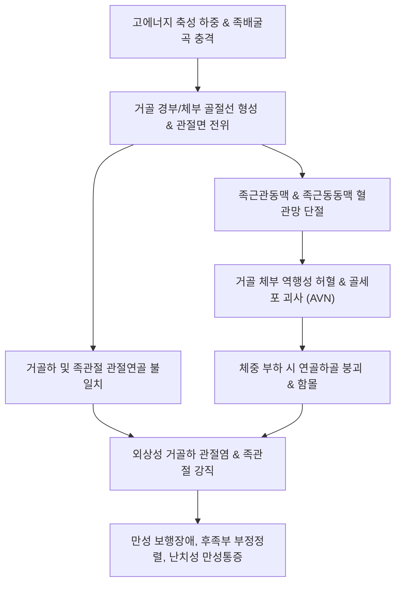

# 🩺 거골 골절 (Talar Fractures)

> **핵심 3줄 요약 (Key Summary)**:
> - 📍 **병소 부위 & 해부·병태생리**: [[거골]](Talus)은 체중을 종골과 주상골로 전달하는 핵심 족근골로, 표면의 60~70%가 관절연골로 덮여 골막과 근육 부착부가 거의 없으며 후경골동맥 족근관지·비골동맥·족배동맥의 역행성(retrograde) 혈류에 의존하여 골절 전위 시 [[무혈성 괴사]](AVN) 및 거골하 관절염 위험이 극히 높다.
> - 🚩 **전형적 임상 양상**: 고에너지 축성 압박 또는 족관절 과도 배굴 손상 후 후족부·족관절의 극심한 동통, 체중 부하 불가, 전족부-후족부 전반의 심한 종창 및 광범위한 피하 반상출혈.
> - 🛠️ **핵심 검사 & 치료 전략**: 족관절 AP/Lateral/Canale view 단순 방사선 및 3차원 CT 확진. 비전위 골절은 6~8주 엄격한 비체중부하(NWB) 단하지 석고 고정, 2mm 이상 전위 시 응급 해부학적 정복 및 내고정술(ORIF) 시행. 고정기 어혈 제거([[당귀수산]], [[자연동]]) 및 깁스 제거 후 관절 강직 예방 한의 통합 침구·약침 치료 병행.
> - ⚠️ **응급 의뢰 레드플래그**: 개방성 골절, 족배동맥(DPA) 또는 후경골동맥 맥박 소실, 족부 족저면 감각 소실(구획증후군 의심), 거골 탈구로 인한 피부 긴장성 괴사 징후 시 즉시 응급 정형외과 전원.

---

## 📌 목차
1. [질환 개요 & 해부학적 병태생리](#1-질환-개요--해부학적-병태생리)
2. [병태생리 메커니즘 & 생체역학적 악순환 네트워크](#2-병태생리-메커니즘--생체역학적-악순환-네트워크)
3. [임상 증상 & 이학적 검사(Physical Exam) 알고리즘](#3-임상-증상--이학적-검사physical-exam-알고리즘)
4. [감별 진단 매트릭스 (Differential Diagnosis)](#4-감별-진단-매트릭스-differential-diagnosis)
5. [한의 통합 치료 프로토콜 (침·약침·추나·한약)](#5-한의-통합-치료-프로토콜-침약침추나한약)
6. [양방 치료 & 병용·의뢰 기준 (Conventional Treatment & Referral)](#6-양방-치료--병용의뢰-기준-conventional-treatment--referral)
7. [재활 운동 & 생활습관 티칭 가이드](#7-재활-운동--생활습관-티칭-가이드)
8. [💡 사용자 진료실 핵심 필기 & 임상 노하우 (Melt-In 잔여 심화 집약)](#8--사용자-진료실-핵심-필기--임상-노하우-melt-in-잔여-심화-집약)
9. [출처 및 학술 참고 문헌 (References)](#9-출처-및-학술-참고-문헌-references)

---

## 1. 질환 개요 & 해부학적 병태생리

거골(Talus, 목말뼈)은 하지의 체중 전량을 족부로 매개하는 중심 골격 구조물이다. 근위부로는 경골 및 비골과 족관절(talocrural joint)을 형성하고, 원위부로는 주상골과 거주상관절(talonavicular joint), 저부로는 종골과 거골하 관절(subtalar joint)을 형성한다. 거골 표면의 60% 이상이 초자연골(hyaline cartilage)로 둘러싸여 있으며, 건(tendon)이나 근육이 전혀 부착하지 않는 독특한 해부학적 특성을 지닌다.

> [그림 1: ① 병태생리·도해 — 거골 경부, 체부, 두부 및 돌기별 골절 호발 부위 모식도 (Wikimedia Commons)]

거골 골절은 전체 족부 골절의 약 3~5%, 전신 골절의 0.5% 미만을 차지하는 비교적 드문 손상이지만, 불량한 골유합, 조기 외상성 관절염, 광범위한 골괴사 등 치명적인 후유증을 남길 수 있다. 골절 발생 위치에 따라 [[거골 경부 골절]](Talar neck fracture, 약 50%), [[거골 체부 골절]](Talar body fracture, 약 15~20%), [[거골 외측돌기 골절]](Lateral process fracture, 15~20%), [[거골 후방돌기 골절]](Posterior process fracture, 10%), 거골 두부 골절(Head fracture, 5~10%)로 세분된다.

> [그림 2: ① 병태생리·영상 — 거골 골절 측면 방사선(X-ray) 소견 (Wikimedia Commons)]

특히 거골 골절의 예후를 결정짓는 핵심 인자는 독특한 혈류 공급 체계이다. 거골의 혈액 순환은 주로 세 주요 동맥에서 기원한다:
1. 후경골동맥(Posterior tibial artery)의 족근관 동맥(Artery of tarsal canal): 거골 체부 하면 및 경부의 내측/중앙부 1/2~2/3에 혈류를 공급하는 가장 중요한 동맥.
2. 족배동맥(Dorsalis pedis artery)의 족근동 동맥(Artery of tarsal sinus): 거골 두부 및 외측 체부에 혈류 공급.
3. 비골동맥(Peroneal artery)의 천공지(Perforating branches): 후방 돌기 및 외측 결절 부위 공급.

> [그림 3: ① 병태생리·영상 — 단순 방사선에서 간과되기 쉬운 거골 잠재성 골절의 T1 강조 MRI 소견 (Wikimedia Commons)]

골절선이 전위되거나 거골하 관절 탈구가 동반될 경우 이들 혈관망이 파열되어 거골 체부로의 역행성 혈류가 완전히 차단되며, 결과적으로 [[골괴사]](Avascular Necrosis, AVN)가 초래된다.

---

## 2. 병태생리 메커니즘 & 생체역학적 악순환 네트워크

거골 골절의 가장 흔한 기전은 자동차 충돌 시 브레이크 페달 충격 또는 추락 시 발생하는 족관절의 강력한 **과도 배굴(Hyperdorsiflexion)과 축성 하중(Axial loading)**이다. 족배굴곡 상태에서 경골 전연(anterior tibial plafond)이 거골 경부를 쐐기처럼 가격하면서 지렛대 작용을 일으켜 경부 또는 체부의 골절선이 형성된다.

> [그림 4: ② 관련 해부 구조물 — 거골의 하면 관절면 및 족근관 혈류 유입부 해부도해 (Gerrish's Anatomy)]

골절이 전위되면 거골하 관절(subtalar joint)이 아탈구되고 족근관 동맥이 찢어지며, 거골 체부가 후방으로 전위될 경우 족관절(tibiotalar joint)과 후방 피막 혈관까지 단절된다. 손상 후 발생하는 병태생리학적 악순환은 다음과 같다:

골절 전위 정도에 따른 Hawkins 분류는 AVN 발생률과 직결된다:
- **Type I (비전위성 경부 골절)**: 혈류 보존 우수, AVN 발생률 0~13%.
- **Type II (경부 골절 + 거골하 관절 아탈구/탈구)**: 족근관동맥 손상, AVN 발생률 20~50%.
- **Type III (경부 골절 + 거골하 및 족관절 동시 탈구)**: 족근관 및 족근동 동맥 파열, AVN 발생률 70~100%.
- **Type IV (Type III + 거주상관절 탈구)**: 3개 관절 전위, AVN 발생률 90~100%.

골절 치유 후 6~8주경 단순 방사선 전후방 사진에서 거골 활차(talar dome) 연골하골의 방사선 투과성 띠(subchondral radiolucency)가 관찰되는 현상을 **호킨스 징후(Hawkins sign)**라 부른다. 이는 혈류가 유지되어 불용성 골다공증(disuse osteopenia)이 정상적으로 일어났음을 뜻하는 혈관 재형성의 결정적 생존 지표이다. 반대로 활차 피질골이 비정상적으로 치밀하고 하얗게 유지된다면 혈류 차단으로 인한 AVN의 강력한 징후이다.

---

## 3. 임상 증상 & 이학적 검사(Physical Exam) 알고리즘

### 임상 증상
- **동통 및 부하 불능**: 족관절 심부 및 후족부의 찢어지는 듯한 극심한 자발통. 수상 직후 완전 체중 부하 불능(NWB).
- **종창 및 피하 출혈**: 외과 전방, 족근동, 아킬레스건 주변, 족저면까지 번지는 광범위한 부종 및 혈종.
- **연부조직 긴장**: 전위된 골편이 족배부 피부 또는 내과/후과 연부조직을 밀어내어 피부 긴장성 수포(fracture blister)나 괴사 위험 노출.
- **신경혈관 압박**: 후경골신경 압박 시 발바닥 감각 저하(족근관 증후군 양상), 족배동맥 또는 후경골동맥 맥박 감약.

### 이학적 검사 및 진단 알고리즘
1. **신경혈관 검사(Neurovascular status)**:
   - 족배동맥(Dorsalis pedis) 및 후경골동맥(Posterior tibial) 촉지 및 모세혈관 재충혈 시간(CRT < 2초 확인).
   - 심비골신경(족배부 제1-2족지 간), 천비골신경(족배부), 경골신경(족저면)의 감각 및 족지 능동 굴곡/신전 검사.
2. **연부조직 포락 검사**: 피부 창백, 긴장도, 골편 돌출 여부 관찰.
3. **영상 검사**:
   - **X-ray**: 족관절 AP, Lateral, Mortise view 및 **Canale view**(발을 15도 내번, X선 튜브를 두미 방향 75도 기울여 거골 경부를 수직으로 투시하는 전용 뷰).
   - **CT (Computed Tomography)**: 거골 골절 진단의 **표준(Gold Standard)**. 관절면 일치도, 2mm 이상 미세 전위, 잠재성 골절편, 거골하 관절 함몰 여부를 3차원으로 평가.
   - **MRI**: 단순 방사선 정상이나 체중 부하 불가 시 잠재성 피로 골절 진단 및 추적 관찰 시 AVN 조기 선별.

---

## 4. 감별 진단 매트릭스 (Differential Diagnosis)

| 감별 질환 | 호발 기전 | 주 통증 부위 | 단순 방사선 / 영상 특징 | 치료 전략 차이점 |
| :--- | :--- | :--- | :--- | :--- |
| **거골 골절 (본 질환)** | 고에너지 축성 하중 + 과배굴 | 족관절 심부 전반, 거골하 관절, 전족부 | Canale view, CT 상 거골 경부/체부 골절선, AVN 위험 | 비전위 6~8주 NWB 고정, 전위 시 응급 ORIF |
| **[[종골 골절]](Calcaneus fx)** | 높은 곳에서 수직 추락 | 발꿈치, 족저면, 종골 외측벽 | Bohler 각 감소(<20°), Gissane 각 증가, 종골 체부 분쇄 | 종골 침범 정도에 따라 비수술 또는 금속판 ORIF |
| **족관절 삼과 골절** | 족관절 염전 회전력(Lauge-Hansen) | 내과, 외과, 후과 국소 압통 | 원위 경비인대 파열, 거골의 외측 전위, 비골/경골 골절선 | 족관절 Mortise 정복 및 양과/삼과 나사·금속판 고정 |
| **[[발목 염좌]](Ankle sprain)** | 보행 중 족관절 내번(Inversion) | 전거비인대(ATFL), 종비인대 | 골절선 없음, 인대 부착부 미세 종창 | RICE, 조기 관절가동, 외측 안정성 보강 테이핑 |
| **[[리스프랑 관절 손상]](Lisfranc)** | 전족부 축성 회전 및 과신전 | 중족부 족배부 및 제1-2중족간 | 제1-2중족골 기저부 간격 벌어짐(>2mm), Fleck sign | 관절 일치도 복원 나사 고정술 필수 |

---

## 5. 한의 통합 치료 프로토콜 (침·약침·추나·한약)

한의학에서 거골 골절은 跌打損傷(질타손상)의 범주에 속하며, 병리적으로는 初期 瘀血凝滯(어혈응체)와 氣滯血瘀, 中期 瘀去生新(어거생신) 및 接骨續筋, 後期 肝腎虧損(간신휴손) 및 筋骨萎弱으로 변증한다.

> [그림 5: ③ 치료·시술점 — 족관절 골절 후 유착 방지 및 족하수 예방을 위한 양교맥·족삼양경 혈위 주행 도해 (Wellcome Collection)]

### 1) 단계별 프로토콜

#### [1단계: 급성 고정기 (수상 후 1~6/8주)]
- **목표**: 깁스 또는 외고정 상태에서 연부조직 종창 완화, 혈액순환 촉진, 신생 골화 촉진.
- **침구 치료**:
  - 캐스트 노출 부위 활용: 환측 [[혈해]](SP10), [[족삼리]](ST36), [[음릉천]](SP9), [[양릉천]](GB34) 자침으로 하지 정맥 림프 환류 촉진.
  - 건측 취혈(대칭점 자침법): 환측 고정부 혈위(곤륜, 구허, 태계, 해계)의 반대측 건측 혈위에 0.25×40mm 호침 자침 후 염전보사.
- **한약 치료**:
  - 활혈화어·소종지통: [[당귀수산]](當歸鬚散) 가감(초목향, 홍화, 도인 증량).
  - 접골 촉진: **[[자연동]]**(自然銅, Pyrite) 초쉬(醋淬) 분말 1.5~2g/일 배합 처방(골모세포 분화 및 무기질 침착 촉진, PMID 38256337).

#### [2단계: 석고 제거 및 조기 재활기 (수상 후 6/8~12주)]
- **목표**: 거골하 관절 및 족관절 강직(Stiffness) 해소, 통증 및 잔여 부종 제거, 체중 부하 점진 적응.
- **침구 및 전침 치료**:
  - 국소 혈위: [[해계]](ST41), [[구허]](GB40), [[신맥]](BL62), [[곤륜]](BL60), [[태계]](KI3), [[조해]](KI6).
  - 전침(Electroacupuncture): 해계-구허(저주파 2Hz, 20분), 곤륜-태계(연속파 2Hz) 연결로 진통 신경펩티드 분비 유도 및 관절낭 연축 이완 (PMID 40391277).
- **약침 치료**:
  - [[신비약침]](소염진통) 또는 [[자하거 약침]](조직 재생) 0.5~1.0cc를 족근동(sinus tarsi) 및 곤륜 혈위 심부(거골 외측돌기/후방 관절낭 인접부)에 주입.
  - 봉약침(Sweet BV 0.1~0.2cc)을 활용하여 만성 염증성 활액막염 완화 (PMID 40423339).

#### [3단계: 기능 회복 및 합병증 예방기 (수상 후 12주 이후)]
- **목표**: 외상성 거골하 관절염 및 AVN 예방, 고유수용감각 회복, 정상 보행 패턴 복원.
- **추나 및 관절가동술**:
  - 골유합 완료(X-ray 확인) 후 시행.
  - 거골 관절 가동 기법: 전방 거골 밀기(Anterior talar glide), 거골하 관절 내외번 가동 기법, 족근골간 견인 관절가동기법 적용.
- **한약 치료**:
  - 보익간신·강근골: [[독활기생탕]](獨活寄生湯), 삼기음(三奇飮), 또는 가미보신탕(보골지, 구척, 골쇄보, 두충 증량)으로 연골하골 퇴행 억제.

---

## 6. 양방 치료 & 병용·의뢰 기준 (Conventional Treatment & Referral)

> [그림 6: ③ 치료·시술점 — 비전위 거골 골절의 단하지 석고 붕대(Short Leg Cast) 고정 및 체중부하 제한 (Wikimedia Commons)]

### 약물 치료
- 급성기 통증 조절: NSAIDs (Celecoxib 200mg qd 또는 Aceclofenac 100mg bid) 단기 투여. 장기 복용 시 골유합 지연 가능성에 유의.
- 아세트아미노펜(Acetaminophen 650mg tid) 및 트라마돌 복합제(Ultracet) 병용.

### 비약물 보존 치료
- **적응증**: 전위가 1~2mm 미만인 완전 비전위 골절(Hawkins Type I).
- **처치**: 단하지 석고 붕대(Short Leg Cast) 또는 고정용 워커 부츠 6~8주 착용.
- **체중 부하**: **완전 비체중부하(NWB)** 원칙. 목발 또는 휠체어 사용 필수.

### 수술적 적응증 (ORIF)
- **절대적 적응증**:
  - 2mm 이상 전위된 거골 경부/체부 골절 (Hawkins Type II~IV).
  - 관절내 골편 전위 및 관절면 단차.
  - 개방성 골절, 탈구 정복 실패, 신경혈관 손상 동반.
- **수술 방식**: 내측과 절골술(medial malleolar osteotomy)을 통한 시야 확보 후 소구경 무두 나사(headless cannulated screws)를 이용한 해부학적 매립 고정술.

### 한의원 1차 진료실 의뢰 기준
- **응급 의뢰**: 개방창, 발가락 감각 소실, 족배동맥 맥박 소실, 피부 괴사 임박 징후.
- **정형외과 재의뢰**: 수상 8주 이후에도 Hawkins sign 음성(방사선 투과 띠 없음), 거골 체부 압괴(collapse) 소견, 만성 불유합 의심 시 즉시 정형외과 족부 전문의 재의뢰.

---

## 7. 재활 운동 & 생활습관 티칭 가이드

### 1) 단계별 재활 운동
- **고정기 (0~6주)**:
  - 족지 굴신 운동(Toe curling & extension): 매시간 20회씩 반복하여 내재근 위축 방지 및 정맥 순환 촉진.
  - 고관절 및 대퇴사두근 등척성 운동(SLR, Quad setting).
- **부분 체중 부하 시작기 (6~10주)**:
  - 체중계 누르기 훈련: 체중계에 환측 발을 얹고 체중의 20% -> 50%로 점진적 하중 증량.
  - 비체중 상태 족관절 능동 가동(AROM): 알파벳 쓰기 운동(Ankle alphabet exercise).
- **전체 체중 부하 및 밸런스 회복기 (10~16주)**:
  - 탄성 밴드(Theraband)를 이용한 족배굴곡 및 비골근 강화 운동.
  - 밸런스 패드(Wobble board) 기립 훈련으로 거골하 관절의 고유수용성 감각(Proprioception) 재교육.

### 2) 생활습관 및 주의사항
- **금연 필수**: 니코틴은 미세혈관 수축을 유발하여 거골 무혈성 괴사 위험을 3배 이상 폭증시키므로 수상 직후부터 절대 금연 티칭.
- **체중 관리**: 거골은 보행 시 체중의 5배에 달하는 하중을 받으므로 체중 증가 방지.
- **단단한 신발 착용**: 충격을 흡수하고 족궁(Arch)을 받쳐주는 맞춤형 족부 보조기(Orthotics) 착용 권장.

---

## 8. 💡 사용자 진료실 핵심 필기 & 임상 노하우 (Melt-In 잔여 심화 집약)

- **Hawkins sign 판정의 타이밍**: 수상 후 6~8주 사이에 시행하는 AP 뷰에서 거골 돔의 subchondral osteopenia(호킨스 사인) 유무를 판정해야 한다. 8주가 지나 환자가 발을 디디기 시작하면 뼈가 다시 차오르므로 위음성/위양성 판독이 발생할 수 있다.
- **발목 염좌로 오인된 환자의 촉진 팁**: 단순 발목 염좌 환자 중 외과 전하방(전거비인대)뿐 아니라 족근동(sinus tarsi) 깊은 곳과 거골 경부 족배면을 강하게 눌렀을 때 극심한 동통을 호소하고 체중 부하가 전혀 불가능하다면 반드시 CT를 의뢰해야 한다.
- **자연동(自然銅) 복약 가이드**: 자연동은 반드시 초쉬(식초에 담갔다 가열하기를 반복)하여 독성을 줄이고 비산염 등 불순물을 제거한 법제 규격품을 써야 하며, 소화장애 방지를 위해 당귀수산이나 사물탕 계열 탕약에 합방 투여한다.

---

## 9. 출처 및 학술 참고 문헌 (References)

1. **Biz C et al. (2023)**. History of the management of talar fractures: from the fall of king Darius to Garibaldi's bullet and from the earliest to current operative strategies. *Int Orthop*, 47(5):1373-1382. [PMID 36928551](https://pubmed.ncbi.nlm.nih.gov/36928551/)
   - [연구 요약]: 거골 골절의 진단사, 해부학적 혈류망 손상 기전 및 호킨스 분류별 현대 수술적 정복 기법의 장기 임상 결과 고찰.

2. **Zhang J et al. (2025)**. Predicting the risk of postoperative avascular necrosis in patients with talar fractures based on an interpretable machine learning model. *Front Bioeng Biotechnol*, 13:1644261. [PMID 40821667](https://pubmed.ncbi.nlm.nih.gov/40821667/)
   - [연구 요약]: 거골 골절 환자에서 수술 후 발생하는 무혈성 괴사(AVN)의 조기 예측 인자로 골절 전위도, 수상 후 수술까지의 지연 시간, 혈관 손상 범위를 분석한 예측 모델 연구.

3. **Dallas-Orr D et al. (2026)**. Talus Fracture-Dislocations With Talar Body Extrusion Have High Complication Rates, With Uneventful Outcomes in a Minority of Patients After Open Reduction Internal Fixation. *Foot Ankle Orthop*, 11(2):24730114261452668. [PMID 42358522](https://pubmed.ncbi.nlm.nih.gov/42358522/)
   - [연구 요약]: 거골 골절-탈구 손상 환자에서 관혈적 정복술 후 장기 합병증(감염, AVN, 외상성 거골하 관절염) 발생률과 구제술(관절유합술)의 임상 경과 분석.

4. **Zhang G et al. (2026)**. Robot-assisted percutaneous cannulated screw treatment versus traditional surgical reduction fixation in the treatment of Hawkins type Ⅱ talus fracture: a retrospective study of an average two-year follow-up. *BMC Musculoskelet Disord*, 27(1):150. [PMID 42249405](https://pubmed.ncbi.nlm.nih.gov/42249405/)
   - [연구 요약]: Hawkins Type II 거골 골절에서 경피적 유도 나사 고정술과 전통적 절개 고정술의 2년 추적 결과, 연부조직 혈류 보존 및 조기 기능 회복 효과 비교.

5. **Chen L et al. (2025)**. The Clinical Effect of Electroacupuncture Combined with Surround Needling in the Treatment of Acute Lateral Ankle Sprain Based on Musculoskeletal Ultrasound Imaging Technology: A Protocol for a Single-Centre, Randomized, Controlled Trial. *J Pain Res*, 18:2467-2478. [PMID 40391277](https://pubmed.ncbi.nlm.nih.gov/40391277/)
   - [연구 요약]: 족관절 주위 혈위(해계, 구허, 곤륜, 신맥) 전침 및 포위침 병용이 족관절 연부조직 부종 제거 및 활액막 비후 감소, 기능 회복에 미치는 초음파 기반 무작위 대조 시험.

6. **Nam EY et al. (2023)**. Therapeutic Efficacy of Chinese Patent Medicine Containing Pyrite for Fractures: A Systematic Review and Meta-Analysis. *Medicina (Kaunas)*, 60(1):164. [PMID 38256337](https://pubmed.ncbi.nlm.nih.gov/38256337/)
   - [연구 요약]: 골절 치유에서 자연동(Pyrite) 함유 한약 제제의 유효성을 평가한 체계적 문헌고찰 및 메타분석으로 골유합 시간 단축 및 골밀도 회복 유의성 입증.

---

## 관련 노트

- [[거골]]
- [[거골 경부 골절]]
- [[거골 외측돌기 골절]]
- [[거골 체부 골절]]
- [[거골 후방돌기 골절]]
- [[종골 골절]]
- [[발목 염좌]]
- [[무혈성 괴사]]
- [[자연동]]
- [[당귀수산]]
- [[독활기생탕]]
