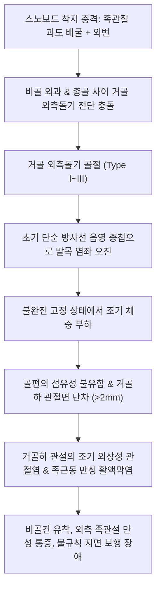

# 🩺 거골 외측돌기 골절 (Fracture of the Lateral Process of the Talus / Snowboarder's Fracture)

> **핵심 3줄 요약 (Key Summary)**:
> - 📍 **병소 부위 & 해부·병태생리**: 거골의 외측 돌기(lateral process of talus)는 후방 [[거골하 관절]](subtalar joint)의 전외측면과 비골 외과 관절면을 지지하는 쐐기형 돌기로, 스노보드 착지 시 전형적으로 발생하는 **족관절 급격한 배굴(Dorsiflexion) + 외번(Eversion) 토크** 하중으로 골절된다 ("스노보더 골절, Snowboarder's fracture").
> - 🚩 **전형적 임상 양상**: 외과 첨부(Tip of lateral malleolus) 바로 전하방 1cm 부위의 심한 국소 압통 및 종창, 체중 부하 시 외측 후족부 동통. **단순 X-ray에서 40% 이상 단순 [[발목 염좌]](전거비인대 파열)로 오진**되어 만성 불유합 및 거골하 관절염으로 악화되기 쉽다.
> - 🛠️ **핵심 검사 & 치료 전략**: 족관절 AP/Lateral 및 Broden view, **3차원 CT 확진(Gold standard)**. 2mm 미만 비전위(Type I)는 6주간 비체중부하(NWB) 단하지 석고 고정, 2mm 이상 전위·관절면 분쇄(Type II/III)는 나사 고정술(ORIF) 또는 골편 절제술. 고정 해제 후 외측 족관절 인대 유착 박리(침도, 봉약침) 및 거골하 관절가동술 적용.
> - ⚠️ **응급 의뢰 레드플래그**: 거골하 관절 탈구를 동반한 대형 골편 전위, 족외측 피부 긴장 및 창백, 비골 신경 포착으로 인한 제1-2족지 배부 감각 소실 시 즉시 정형외과 전원.

---

## 📌 목차
1. [질환 개요 & 해부학적 병태생리](#1-질환-개요--해부학적-병태생리)
2. [병태생리 메커니즘 & 생체역학적 악순환 네트워크](#2-병태생리-메커니즘--생체역학적-악순환-네트워크)
3. [임상 증상 & 이학적 검사(Physical Exam) 알고리즘](#3-임상-증상--이학적-검사physical-exam-알고리즘)
4. [감별 진단 매트릭스 (Differential Diagnosis)](#4-감별-진단-매트릭스-differential-diagnosis)
5. [한의 통합 치료 프로토콜 (침·약침·추나·한약)](#5-한의-통합-치료-프로토콜-침약침추나한약)
6. [양방 치료 & 병용·의뢰 기준 (Conventional Treatment & Referral)](#6-양방-치료--병용의뢰-기준-conventional-treatment--referral)
7. [재활 운동 & 생활습관 티칭 가이드](#7-재활-운동--생활습관-티칭-가이드)
8. [💡 사용자 진료실 핵심 필기 & 임상 노하우 (Melt-In 잔여 심화 집약)](#8--사용자-진료실-핵심-필기--임상-노하우-melt-in-잔여-심화-집약)
9. [출처 및 학술 참고 문헌 (References)](#9-출처-및-학술-참고-문헌-references)

---

## 1. 질환 개요 & 해부학적 병태생리

거골 외측돌기(Lateral process of the talus, LPT)는 거골 체부의 외측 하방으로 뻗어 나온 돌출부이다. 위쪽으로는 비골의 내측 관절면과 접하여 족관절 외측 와(fossa)를 구성하고, 아래쪽으로는 종골의 후방 거골하 관절면(posterior subtalar articular facet)의 전외측 부분을 형성한다.

> [그림 1: ① 병태생리·도해 — 스노보더 발목 골절의 손상 기전: 족관절 배굴 및 외번 토크와 거골 외측돌기 분쇄 양상 (McCrory-Bladin 분류, Wikimedia Commons)]

외측돌기의 전외측 연에는 전거비인대(ATFL)의 일부 섬유가 부착하고, 하연에는 외측 거종인대(lateral talocalcaneal ligament)가 부착하여 외측 족관절 및 거골하 관절의 안정성을 유지한다.

과거에는 전체 거골 골절의 1% 미만으로 알려진 매우 드문 손상이었으나, 1990년대 이후 스노보드 인구의 증가와 함께 급증하여 스노보드 발목 손상의 약 15%, 스노보드 족부 골절의 30% 이상을 차지하게 되었다. 이에 따라 정형외과 영역에서는 **"스노보더 발목(Snowboarder's ankle)"** 또는 **"스노보더 골절(Snowboarder's fracture)"**이라는 고유 병명으로 불린다.

> [그림 2: ① 병태생리·영상 — 전후방 단순 방사선(AP)에서 비골 외과 음영에 가려진 미세 거골 외측돌기 골절선 (Wikimedia Commons)]

가장 중요한 임상적 문제는 **높은 오진율(Misdiagnosis rate, 35~45%)**이다. 통증 부위와 붓기가 전형적인 외측 발목 염좌(전거비인대 손상)와 매우 흡사하고, 단순 발목 X-ray의 전후방(AP) 및 측면 사진에서 비골 외과의 두터운 피질골 음영에 가려져 골절선이 쉽게 은폐되기 때문이다. 진단이 지연되어 만성 불유합이나 부정유합으로 진행할 경우, 거골하 관절의 조기 외상성 관절염으로 이어져 20~30대 젊은 환자에서도 영구적인 보행 장애와 만성 통증을 남긴다.

> [그림 3: ① 병태생리·영상 — 거골 외측돌기 골절의 관상면(Coronal) CT: 거골하 관절면 전위 및 골편 확인 (Wikimedia Commons)]

> [그림 4: ① 병태생리·영상 — 거골 외측돌기 골절의 시상면(Sagittal) CT 소견 (Wikimedia Commons)]

---

## 2. 병태생리 메커니즘 & 생체역학적 악순환 네트워크

### 손상 생체역학 (Biomechanical Mechanism)
스노보더가 점프 후 착지하거나 고속 활강 중 엣지가 설면에 걸릴 때 발생한다. 부츠 안에서 발목이 강하게 **배굴(Dorsiflexion)된 상태에서 급격한 외번(Eversion)과 축성 압박력(Axial compression)**이 가해진다. 이때:
1. 배굴된 거골 활차가 족관절 장부(mortise) 내로 꽉 끼어들어가면서 외측돌기가 외과 전하방 마진과 충돌한다.
2. 동시에 종골의 후방 관절면이 거골 외측돌기 하면을 강력하게 상방으로 쐐기처럼 밀어올리는 전단력(shearing force)을 가한다.
3. 외측 거종인대 및 전거비인대의 강력한 인장력에 의한 견열(avulsion)이 복합 작용하여 외측돌기가 파쇄된다.

> [그림 5: ② 관련 해부 구조물 — 거골 외측면의 비골 관절면 및 외측돌기(Lateral process) 해부학적 위치 (Henry Gray, Anatomy of the Human Body)]

### Hawkins & McCrory-Bladin 분류
- **Type I (단순 비전위 골절)**: 거골 비골 관절면 및 거골하 관절면으로 연장되나 전위가 2mm 미만인 선상 골절.
- **Type II (분쇄 골절)**: 거골하 관절면을 침범하는 분쇄 골절로, 관절면 일치도가 파괴됨.
- **Type III (대형 단일 골편 전위 골절)**: 외측돌기 기저부에서 부러져 비골 관절면과 거골하 관절면 전체를 포함하는 대형 골편의 전위.

---

## 3. 임상 증상 & 이학적 검사(Physical Exam) 알고리즘

### 임상 증상
- **외과 하방 통증**: 비골 외과 첨부(Tip)에서 **전하방으로 1cm 떨어진 지점**(전거비인대 주행부보다 약간 후하방인 족근동 입구 직상부)에 극심한 압통.
- **외측 종창 및 반상출혈**: 수상 수 시간 내에 외측 복사뼈 주변과 발목 외측 전반에 부종 발생.
- **거골하 관절 운동 시 통증 악화**: 족관절의 단순 굴신(배굴/저측굴곡)보다 **발뒤꿈치의 내번(Inversion) 및 외번(Eversion)** 수동 검사 시 거골하 관절 심부 통증이 현저하게 유발됨.

### 이학적 검사 핵심 포인트
1. **외과 첨부 촉진 감별**:
   - 외과 첨부 바로 앞: 전거비인대(ATFL) 손상 의심.
   - 외과 첨부 자체: 비골 견열 골절 의심.
   - **외과 첨부에서 전하방 1cm 거골 표면**: 거골 외측돌기 골절 강력 의심!
2. **거골하 관절 스트레스 검사(Subtalar motion test)**: 종골을 단단히 쥐고 족관절 90도 상태에서 내외번 회전 시 외측 족근동 심부에서 삐걱거리는 염발음(crepitus) 또는 날카로운 통증 발생.
3. **영상 검사 알고리즘**:
   - **X-ray**: 족관절 AP/Lateral/Mortise 촬영. 의심 시 **Broden view**(다리를 45도 내회전하고 X선 빔을 두미 방향 10~40도 각도로 조준하여 거골하 관절을 투시) 추가.
   - **CT 검사**: **단순 X-ray에서 음성이더라도 스노보드 착지 손상 후 외측 족관절 압통이 지속되면 지체 없이 CT를 촬영해야 한다.** CT는 골편 크기, 전위 정도, 분쇄 양상을 100% 규명하는 표준 진단 도구이다.

---

## 4. 감별 진단 매트릭스 (Differential Diagnosis)

| 질환명 | 주 손상 기전 | 압통의 정확한 위치 | 단순 방사선 소견 | CT / 초음파 특징 |
| :--- | :--- | :--- | :--- | :--- |
| **거골 외측돌기 골절 (본 질환)** | 배굴 + 외번 (스노보드 착지) | 외과 첨부 전하방 1cm (거골하 관절 전외측) | AP에서 종종 정상, Broden view 상 골편 관찰 | CT 상 외측돌기 골절선 및 거골하 관절면 전위 |
| **[[발목 염좌]](전거비인대 파열)** | 저측굴곡 + 내번 (발목 접질림) | 외과 전연 및 거골 경부 외측 인대 부착부 | 골절선 없음, 연부조직 음영 부종 | 초음파 상 ATFL 저에코성 파열 및 혈종 |
| **비골 외과 견열 골절** | 과도 내번 견인력 | 비골 외과 말단 뼈 자체 | 비골 원위단 횡상 박리 골편 | 단순 X-ray로도 쉽게 확인 가능 |
| **족근동 증후군 (Sinus tarsi syn.)** | 만성 발목 불안정성 후유증 | 족근동(Sinus tarsi) 함요부 국소 | 골절선 없음, 관절 정렬 정상 | MRI 상 족근동 지방체 염증 및 인대 변성 |
| **[[종골 골절]](종골 전방돌기 골절)** | 내번 + 저측굴곡 분기인대 견열 | 외과 전하방 2cm (입방골 인접 종골 전방) | 측면/사위상에서 종골 전방돌기 골절선 확인 | 사위 방사선 및 CT로 종골 침범 규명 |

---

## 5. 한의 통합 치료 프로토콜 (침·약침·추나·한약)

거골 외측돌기 골절 환자는 급성기 고정 치료 후 잔여 족근동 활액막염, 비골근건 유착, 거골하 관절 강직으로 한의원에 내원하는 경우가 많다.

> [그림 6: ③ 치료·시술점 — 외측 거골하 관절 주변 활혈거어 및 연부조직 유착 해소를 위한 족소양담경·족태양방광경 혈위 자침 도해 (Wellcome Collection)]

### 1) 침구 및 전침 치료
- **주요 취혈점**: [[구허]](GB40, 족근동 외측 입구), [[신맥]](BL62, 외과 직하방), [[곤륜]](BL60, 외과와 아킬레스건 사이), [[해계]](ST41), [[현종]](GB39).
- **자침 기법**:
  - 구허혈 자침 시 침첨을 내측 하방(거골하 관절 방향)으로 0.8~1.2촌 심자하여 족근동 심부 관절낭에 침감을 유도.
  - 신맥-구허 간 전침(2Hz 저주파, 20분) 적용으로 외측 관절낭 섬유화 방지 및 부종 흡수 촉진.
- **부유침/피하자침(FSN)**: 비골근 복모혈 부위에 피하 자침 후 능동 외번 운동 병행으로 외측 구획 연축 해소 (PMID 41764543).

### 2) 약침 및 봉약침 치료
- **[[봉약침]](Bee Venom Acupuncture)**: 10% Sweet BV를 구허 및 곤륜 주변 인대 부착부에 0.05~0.1cc씩 소량 분할 주입하여 만성 거골하 관절염의 염증성 사이토카인(TNF-α, IL-1β) 발현 억제.
- **[[신비약침]](소염) / [[자하거 약침]](인대 강화)**: 비골 관절면 및 외측 거종인대 부착부에 0.5cc 주입하여 국소 미세혈관 신생 및 조직 재생 유도.

### 3) 침도요법 (Acupotomy)
- **적응증**: 석고 고정 6주 후에도 외과 전하방 족근동 부위의 지속적인 찝힘(impingement) 및 인대 섬유화 유착이 있는 경우.
- **시술 부위**: 구허혈 주변 전거비인대-외측거종인대 교차부 섬유성 비후점을 소침도로 1~2회 미세 절개·박리하여 거골하 관절 내외번 가동역 즉각적 확보.

### 4) 한약 치료
- **골유합 촉진기 (0~6주)**: [[당귀수산]](當歸鬚散)에 **[[자연동]]**(自然銅, 醋淬) 2g/일 배합 투여 (골절 부위 혈종 흡수 및 가골 형성 촉진, PMID 38256337).
- **관절 재활기 (6주 이후)**: [[독활기생탕]](獨活寄生湯) 가감(우슬, 속단, 골쇄보 증량)으로 거골하 관절의 퇴행성 변화 방지 및 인대 탄력 회복.

---

## 6. 양방 치료 & 병용·의뢰 기준 (Conventional Treatment & Referral)

### 비수술적 보존 치료
- **적응증**: 전위가 1~2mm 미만인 Hawkins Type I (단순 비전위 골절).
- **방법**: 단하지 무릎 아래 석고 고정(Short leg cast) 또는 고정용 워커 부츠 6주간 착용.
- **체중 부하**: **첫 4주간 완전 비체중부하(NWB)**, 이후 골유합 징후 확인 후 2주간 부분 체중 부하(PWB).

### 수술적 치료 (Surgical Treatment)
- **적응증**:
  - 골편 전위가 2mm 이상인 경우.
  - 거골하 관절면의 1/3 이상을 침범한 대형 골편 (Type III).
  - 분쇄 골절로 관절면 일치도가 소실된 경우 (Type II).
- **수술 기법**:
  - **관혈적 정복 및 내고정술(ORIF)**: 외측 도달법 또는 관절경 보조하에 2.0~2.7mm 소구경 흡수성/무두 티타늄 나사(Herbert screw)로 연골하골에 카운터싱크 매립 고정 (Funasaki et al., 2015).
  - **골편 절제술(Fragment Excision)**: 골편이 1cm 미만으로 너무 작고 분쇄되어 내고정이 불가능하거나, 만성 불유합으로 유리체화된 경우 관절경하 절제 시행.

### 1차 진료실 의뢰 기준
- **즉시 전원**: 발목 염좌로 내원했으나 4주 이상 보존 치료에도 체중 부하 시 외측 심부 동통이 지속되고, CT 상 2mm 이상 전위된 골편이나 관절면 함몰이 확인된 경우 즉시 족부 족관절 정형외과로 전원.

---

## 7. 재활 운동 & 생활습관 티칭 가이드

### 1) 재활 운동 프로토콜
- **고정 해제 직후 (6~8주)**:
  - 거골하 관절 수동 가동(Passive subtalar ROM): 손으로 발꿈치를 쥐고 부드럽게 내번 및 외번 유도.
  - 수건 당기기(Towel scrunches) 및 구슬 집기: 족부 족저 내재근 활성화.
- **근력 강화기 (8~12주)**:
  - 밴드 외번 운동(Theraband eversion): 단비골근 및 장비골근 구심성/원심성 근력 강화로 외측 안정성 재확립.
- **고유수용감각 훈련 (12주 이후)**:
  - 단하지 기립(Single leg stance) 및 밸런스 패드 훈련: 스노보드 복귀를 위해 불안정 지면에서의 자세 적응력 훈련.

### 2) 생활습관 티칭
- **스노보드 복귀 가이드**: 수상 후 최소 4~6개월간 스노보드 및 고강도 점프 운동 제한. 복귀 시 단단한 하드 부츠(Hard boots) 및 발목 지지 인솔 착용 권장.
- **신발 선택**: 뒤축이 견고하고 거골하 관절의 비정상적 회내/회외를 잡아주는 모션 컨트롤 운동화 착용.

---

## 8. 💡 사용자 진료실 핵심 필기 & 임상 노하우 (Melt-In 잔여 심화 집약)

- **'스노보드 타고 발목 삐었다'는 환자의 1원칙**: 겨울철 스노보드를 타다 넘어지면서 발목을 접질렸다고 내원한 환자는 X-ray가 정상이더라도 **기본 진단을 발목 염좌가 아닌 거골 외측돌기 골절 의심**으로 설정하고 진료해야 한다.
- **Broden 뷰의 실전적 의미**: 로컬 한의원이나 일반 의원에서 CT가 없을 때, 일반 발목 AP/Lat 외에 발을 45도 안으로 돌리고 X-ray 관을 위에서 아래로 10도, 20도 쏘는 Broden 뷰를 의뢰하면 비골에 가려진 거골 외측돌기 골절선을 방사선으로도 상당수 잡아낼 수 있다.
- **도침 치료 시 안전 구역**: 구허혈 부위 시술 시 천비골신경의 외측분지와 족배동맥 분지를 피하기 위해 비골 외과 전연을 지표로 뼈를 확인하며 골면 상에서 미세 박리해야 한다.

---

## 9. 출처 및 학술 참고 문헌 (References)

1. **Funasaki H et al. (2015)**. Arthroscopic reduction and internal fixation for fracture of the lateral process of the talus. *Arthrosc Tech*, 4(1):e81-6. [PMID 25973380](https://pubmed.ncbi.nlm.nih.gov/25973380/)
   - [연구 요약]: 거골 외측돌기 골절(LPT)에서 관절경 보조하 해부학적 정복 및 무두 나사 고정술의 수술 수기 및 거골하 관절면 연골 손상 최소화 기법 보고.

2. **Clanton TO et al. (2013)**. Magnetic resonance imaging findings of snowboarding osteochondral injuries to the middle talocalcaneal articulation. *Sports Health*, 5(5):470-5. [PMID 24427420](https://pubmed.ncbi.nlm.nih.gov/24427420/)
   - [연구 요약]: 스노보드 손상 환자에서 발생하는 거골 외측돌기 및 거골하 관절 골연골 병변의 MRI 영상학적 특성과 단순 염좌와의 감별점 분석.

3. **Subaşı İÖ et al. (2023)**. Recreational Skiing- and Snowboarding-Related Extremity Injuries: A Five-Year Tertiary Trauma Center Cohort. *Cureus*, 15(7):e42688. [PMID 37649954](https://pubmed.ncbi.nlm.nih.gov/37649954/)
   - [연구 요약]: 5년간의 동계 스포츠 손상 코호트 분석을 통해 스노보더에서 거골 외측돌기 골절의 높은 발생률 및 조기 진단의 중요성 규명.

4. **Vanhoenacker FM (2023)**. Top 15 musculoskeletal lesions in the aging recreational sporter: a pictorial review. *Quant Imaging Med Surg*, 13(11):7552-7571. [PMID 37969624](https://pubmed.ncbi.nlm.nih.gov/37969624/)
   - [연구 요약]: 생활 체육인에서 흔히 간과되는 근골격계 손상 상위 15종 중 스노보더 발목(거골 외측돌기 골절)의 영상의학적 감별 진단 리뷰.

5. **Chen L et al. (2026)**. Fu's subcutaneous needling versus bracing combined with exercise therapy in the treatment of postacute lateral ankle sprain and the prevention of chronic ankle instability: a randomized controlled trial protocol. *J Orthop Surg Res*, 21(1):50. [PMID 41764543](https://pubmed.ncbi.nlm.nih.gov/41764543/)
   - [연구 요약]: 아급성 외측 족관절 손상 및 관절 불안정증 환자에서 피하자침(FSN) 치료가 근막 유착 해소 및 통증 완화, 관절 가동성에 미치는 임상 효과 프로토콜.

6. **Nam EY et al. (2023)**. Therapeutic Efficacy of Chinese Patent Medicine Containing Pyrite for Fractures: A Systematic Review and Meta-Analysis. *Medicina (Kaunas)*, 60(1):164. [PMID 38256337](https://pubmed.ncbi.nlm.nih.gov/38256337/)
   - [연구 요약]: 자연동(Pyrite) 배합 한약 복합 제제가 족부 및 사지 골절의 골유합 촉진 및 혈종 흡수에 미치는 효과에 대한 메타분석.

---

## 관련 노트

- [[거골]]
- [[거골 골절]]
- [[거골 체부 골절]]
- [[거골 후방돌기 골절]]
- [[발목 염좌]]
- [[거골하 관절]]
- [[자연동]]
- [[당귀수산]]
- [[독활기생탕]]
- [[신맥]]
- [[구허]]
