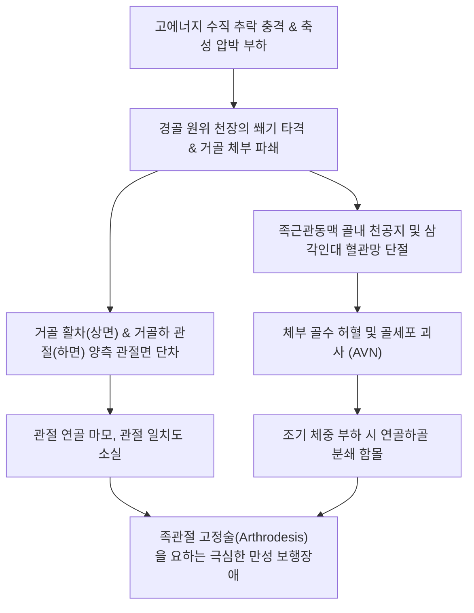

# 🩺 거골 체부 골절 (Talar Body Fractures)

> **핵심 3줄 요약 (Key Summary)**:
> - 📍 **병소 부위 & 해부·병태생리**: 거골 체부(Talar body)는 [[거골 활차]](Trochlea)와 후방 [[거골하 관절]](posterior subtalar facet)을 포함하여 직립 보행 시 체중의 대부분을 종골과 전족부로 분산하는 핵심 구조물로, 높은 곳에서의 추락이나 교통사고 등 고에너지 축성 압박력에 의해 골절된다 (Sneppen 분류 Type I~V).
> - 🚩 **전형적 임상 양상**: 족관절 전반의 극심한 자발통 및 운동 시 격통, 족관절과 후족부 전체의 급격하고 극심한 종창, 체중 부하 불가, 전위 골절 시 30~50% 이상의 높은 빈도로 발생하는 [[무혈성 괴사]](AVN) 및 50~80%에 달하는 외상성 거골하 관절염.
> - 🛠️ **핵심 검사 & 치료 전략**: 족관절 AP/Lateral/Mortise 방사선 및 3차원 CT를 통한 관절면 단차 및 골편 분쇄도 정밀 평가. 전위가 1mm 이상이거나 관절면 단차 존재 시 조기 관혈적 정복 및 내고정술(ORIF, 무두 압박 나사 매립) 필수. 고정기 동안 골유합 촉진([[자연동]], [[당귀수산]]) 및 고정 해제 후 관절 강직 완화 한의 침구·약침 치료 병행.
> - ⚠️ **응급 의뢰 레드플래그**: 개방성 골절, 족배동맥 또는 후경골동맥 맥박 소실, 족저면 감각 소실(구획증후군 동반), 전위된 거골 골편의 피부 압박으로 인한 피부 괴사 임박 징후 시 즉시 응급 수술 전원.

---

## 📌 목차
1. [질환 개요 & 해부학적 병태생리](#1-질환-개요--해부학적-병태생리)
2. [병태생리 메커니즘 & 생체역학적 악순환 네트워크](#2-병태생리-메커니즘--생체역학적-악순환-네트워크)
3. [임상 증상 & 이학적 검사(Physical Exam) 알고리즘](#3-임상-증상--이학적-검사physical-exam-알고리즘)
4. [감별 진단 매트릭스 (Differential Diagnosis)](#4-감별-진단-매트릭스-differential-diagnosis)
5. [한의 통합 치료 프로토콜 (침·약침·추나·한약)](#5-한의-통합-치료-프로토콜-침약침추나한약)
6. [양방 치료 & 병용·의뢰 기준 (Conventional Treatment & Referral)](#6-양방-치료--병용의뢰-기준-conventional-treatment--referral)
7. [재활 운동 & 생활습관 티칭 가이드](#7-재활-운동--생활습관-티칭-가이드)
8. [💡 사용자 진료실 핵심 필기 & 임상 노하우 (Melt-In 잔여 심화 집약)](#8--사용자-진료실-핵심-필기--임상-노하우-melt-in-잔여-심화-집약)
9. [출처 및 학술 참고 문헌 (References)](#9-출처-및-학술-참고-문헌-references)

---

## 1. 질환 개요 & 해부학적 병태생리

거골 체부(Talar body)는 거골 전체 체적의 약 2/3를 차지하는 대형 골 구조물이다. 상면은 전방이 후방보다 약 4~5mm 넓은 원추형 활차(trochlea tali)로 경골 원위 천장(tibial plafond)과 체중 부하 관절을 이루고, 양 외측면은 내과 및 외과와 족관절 장부(mortise)를 형성한다. 체부의 하면은 거대한 후방 종골 관절면(posterior calcaneal articular facet)을 이루어 종골과 함께 거골하 관절(subtalar joint)을 구성한다.

> [그림 1: ① 병태생리·영상 — 거골 체부 전위 골절의 CT 축상면: 활차 및 관절면 침범 골절편 (Wikimedia Commons)]

거골 체부 골절은 전체 거골 골절의 약 15~20%를 차지하며, 해부학적으로 거골 경부 후방의 관절면을 직접 침범하는 골절로 정의된다. 활차 연골 및 거골하 관절면 양측을 모두 침범하는 관절 내 골절(intra-articular fracture)의 양상을 띠므로, 경미한 전위나 부정유합으로도 경거관절 및 거골하 관절 양측 모두에 조기 퇴행성 관절염을 유발할 수 있다.

> [그림 2: ① 병태생리·영상 — 거골 체부 골절의 측면 방사선(X-ray): 활차 관절면 단차 및 골편 분쇄 (Wikimedia Commons)]

> [그림 3: ① 병태생리·영상 — 거골 활차(Trochlea) 상면 및 후방돌기 결절 해부도해 (Henry Gray, Anatomy of the Human Body)]

체부의 혈액 공급은 족근관 동맥(Artery of tarsal canal), 족근동 동맥(Artery of tarsal sinus), 그리고 거골 후방 피막을 통해 들어오는 후경골동맥의 삼각인대 분지(deltoid branches)에 의해 유지된다. 체부 골절선이 관상면(coronal)이나 시상면(sagittal)으로 주행하며 전위될 경우, 이들 골내 미세혈관망이 직접 파열되어 **무혈성 괴사(AVN)** 발생 위험이 30~50% 이상으로 치솟는다.

---

## 2. 병태생리 메커니즘 & 생체역학적 악순환 네트워크

### 손상 기전 및 Sneppen 분류
거골 체부 골절은 높은 곳에서 추락하여 발바닥으로 착지할 때 경골 원위부가 거골 체부를 수직으로 내리찍는 **고에너지 축성 부하(High-energy axial loading)**가 주원인이다. 이때 족관절의 배굴, 저측굴곡, 회전력의 조합에 따라 골절선 형태가 결정된다:

> [그림 4: ② 관련 해부 구조물 — 거골 활차의 전방 확장형 관절면 및 경골 천장 접촉부 (Gerrish's Anatomy)]

> [그림 5: ② 관련 해부 구조물 — 거골 체부 하면의 거골하 관절면 및 족근관 고랑(Sulcus tali) 해부도 (Henry Gray)]

- **Type I (압박 골절, Compression fx)**: 거골 활차 연골하골의 압박 골절(골연골 골절 포함).
- **Type II (전단 골절, Shear fx)**:
  - 관상면 전단(Coronal shear): 활차를 횡단하는 골절선.
  - 시상면 전단(Sagittal shear): 활차를 종단하는 골절선.
- **Type III (후방돌기 골절, Posterior process fx)**: 체부 후방 결절 골절.
- **Type IV (외측돌기 골절, Lateral process fx)**: 외측돌기 골절.
- **Type V (분쇄 압괴 골절, Crush / Comminuted fx)**: 고에너지 충격으로 체부 전체가 산산조각 난 최중증 골절.

---

## 3. 임상 증상 & 이학적 검사(Physical Exam) 알고리즘

### 임상 증상
- **심부 격통**: 족관절 중심부 깊은 곳의 으스러지는 듯한 통증. 발을 바닥에 디디는 것은 물론, 발가락을 움직이기만 해도 극심한 통증 발생.
- **조기 광범위 종창**: 손상 수 분~수 시간 내에 족관절 전후좌우가 모두 심하게 부어올라 복사뼈의 윤곽이 완전히 사라짐.
- **골편 전위로 인한 피부 긴장**: 분쇄된 체부 골편이 후방이나 외측으로 튀어나와 아킬레스건 주변 피부를 압박하여 피부 창백 및 수포 형성.
- **족근관 증후군 양상**: 후경골신경이 전위 골편이나 혈종에 압박받아 발바닥 전체의 저림, 감각 저하, 타는 듯한 작열통 호소.

### 이학적 검사 알고리즘
1. **신경혈관 및 연부조직 긴장도 평가**:
   - 족배동맥(DPA) 및 후경골동맥(PTA) 촉지. 맥박 약화 시 구획증후군 또는 동맥 손상 즉각 의심.
   - 족저면 감각(경골신경) 및 제1-2족지 배부 감각(심비골신경) 핀프릭 검사.
2. **영상 검사 프로토콜**:
   - **X-ray**: 족관절 AP, Lateral, Mortise 3종 기본 촬영. 관절면 단차와 후방 탈구 여부 확인.
   - **3차원 CT (필수)**: 거골 활차 관절면의 분쇄 정도, 골편 크기, 시상면/관상면 골절선 방향(Roddy et al., 2026), 거골하 관절 함몰 여부를 3차원으로 재구성하여 수술적 접근법(내과/외과 절골술 필요 여부) 결정.

---

## 4. 감별 진단 매트릭스 (Differential Diagnosis)

| 질환명 | 주 손상 부위 | 관절 침범 양상 | 단순 방사선 / CT 특징 | 주요 합병증 위험 |
| :--- | :--- | :--- | :--- | :--- |
| **거골 체부 골절 (본 질환)** | 거골 활차 및 체부 중심 | 경거관절 + 거골하관절 양측 침범 | CT 상 관상/시상면 전단 골절선, 활차 단차 | AVN 빈도 30~50%, 외상성 관절염 50~80% |
| **[[거골 경부 골절]]** | 활차 전방 거골 경부 | 거골하관절 탈구 흔함 (활차 자체는 보존) | Canale view 상 경부 골절선, 체부 탈구 | 호킨스 분류에 따른 체부 AVN 위험 |
| **경골 필론 골절 (Pilon fx)** | 경골 원위 천장(Plafond) | 경골 측 관절면 분쇄 함몰 | 경골 하단 관절면 파쇄 및 골간부 연장 | 광범위 연부조직 괴사, 감염 |
| **[[종골 골절]]** | 종골 체부 및 거골하 관절면 | 거골하 관절 침범 (종골 측) | Bohler 각 감소, 종골 체부 납작해짐 | 후족부 외번 변형, 비골건 포착 |
| **거골 박리성 골연골염 (OCD)** | 거골 활차 내외측 연골하골 | 연골하 국소 골편 분리 | 활차 상면 국소 투과성 병변, 괴사골편 | 만성 염좌 유사 찝힘 증상, 관절 내 유리체 |

---

## 5. 한의 통합 치료 프로토콜 (침·약침·추나·한약)

거골 체부 골절 환자는 급성기 관혈적 수술이나 장기간의 비체중부하(NWB) 고정 후 발생하는 심한 족관절 강직, 반사성 교감신경 위축, 만성 허혈성 골통증으로 내원하게 된다.

### 1) 단계별 침구 및 전침 치료
- **고정기 (수상 후 0~8주)**:
  - 석고 외부 노출 혈위: [[족삼리]](ST36), [[양릉천]](GB34), [[삼음교]](SP6), [[혈해]](SP10) 자침으로 하지 심부정맥 혈전증(DVT) 예방 및 정맥 환류 촉진.
- **고정 해제 및 체중부하 시작기 (수상 후 8~16주)**:
  - 족관절 핵심 혈위: [[해계]](ST41), [[구허]](GB40), [[곤륜]](BL60), [[태계]](KI3), [[조해]](KI6), [[신맥]](BL62).
  - 전침(EA): 해계-구허(전외측 관절낭) 및 태계-곤륜(후방 관절낭)에 2Hz 연속파 20분 적용. 관절낭 미세혈관 확장 유도 및 진통 신경전달물질 분비 촉진.

### 2) 약침 및 봉약침 치료
- **[[자하거 약침]](Hominis Placenta)**: 거골의 불량한 혈액 순환과 골괴사 위험을 고려하여, 태계 및 곤륜 심부(거골 후방 피막 혈관 유입부)에 주 2회 1.0cc씩 주입하여 골모세포 활성화 및 미세혈관 재생 촉진.
- **[[봉약침]](Bee Venom)**: Sweet BV 0.1cc를 족관절 전방 관절낭(해계 주변)에 자입하여 활액막 비후 및 관절 섬유화 억제.

### 3) 추나 및 관절가동술 (유합 완료 후 12주 이후)
- 거골 전후방 미세 글라이딩(Anterior/Posterior talar glide) 및 거골하 관절 내외번 견인 가동술.
- 비복근-가자미근 근막 이완(Myofascial Release)으로 아킬레스건 단축 방지.

### 4) 한약 치료
- **급성 고정기**: [[당귀수산]](當歸鬚散) 가미방(홍화, 도인, 몰약, 삼칠근) + **[[자연동]]**(自然銅, 醋淬) 2g/일 (골절부 혈종 흡수 및 신생 가골 형성 촉진, PMID 38256337).
- **아급성 회복기 (괴사 예방 및 연골 보호)**: 보신장골탕(補腎壯骨湯) 또는 [[독활기생탕]](獨活寄生湯) 가감(골쇄보, 속단, 우슬, 구척 각 8g 증량)으로 거골 체부 골밀도 보존 및 연골하골 붕괴 방지.

---

## 6. 양방 치료 & 병용·의뢰 기준 (Conventional Treatment & Referral)

> [그림 6: ③ 치료·시술점 — 거골 체부 골절 후 무혈성 괴사 및 활차 압괴 방지를 위한 비체중부하(NWB) 목발 보행 (Wikimedia Commons)]

### 비수술적 보존 치료
- **적응증**: 완전 비전위성 골절(Sneppen Type I 중 비전위 또는 Type II 중 전위가 1mm 미만이며 관절면 단차가 없는 경우).
- **처치**: 단하지 석고 고정(Short leg cast) **8~12주간 엄격한 완전 비체중부하(NWB)** 유지.
- 주기적인 단순 방사선 및 MRI 촬영으로 거골 체부 활차의 연골하골 압괴 여부 모니터링.

### 수술적 치료 (ORIF)
- **적응증**: 1mm 이상의 전위 또는 관절면 단차가 있는 모든 거골 체부 골절 (Sneppen Type II~V).
- **수술 기법**:
  - 활차 시야 확보를 위해 **내측과 절골술(medial malleolar osteotomy)** 또는 비골 외과 절골술 병행 (Zhang et al., 2026).
  - 2.7~3.5mm 소구경 무두 나사(headless cannulated screws) 또는 흡수성 핀을 관절 연골면 아래로 깊게 카운터싱크 매립 고정 (Wang et al., 2026).
  - 분쇄가 심한 경우 자가골 이식(autologous bone graft) 병행.

### 합병증 구제술 (Salvage Procedure)
- 광범위한 체부 AVN 및 거골하/경거 관절염 발생 시: **거골하 관절 유합술(Subtalar arthrodesis)** 또는 **경거종 관절 유합술(Tibiotalocalcaneal arthrodesis, TTC fusion)** 시행.

### 1차 진료실 의뢰 기준
- **수술 응급 의뢰**: 족관절 전위 골절, 개방성 상처, 족저부 감각 소실.
- **합병증 의뢰**: 수상 3~6개월 후 체중 부하를 시작했으나 체부 깊은 곳의 격통이 재발하고, 방사선 상 거골 활차 피질골 경화(Sclerosis) 및 압괴(Collapse)가 관찰되는 경우 즉시 정형외과 전원.

---

## 7. 재활 운동 & 생활습관 티칭 가이드

### 1) 재활 프로토콜
- **0~8/12주 (완전 비체중부하기)**:
  - 족지 굴신 및 대퇴사두근/둔근 등척성 운동.
  - 환측 발을 바닥에 일체 딛지 않는 목발 보행 티칭.
- **8/12~16주 (부분 체중부하 및 조기 가동기)**:
  - 수중 보행(Hydrotherapy): 부력을 활용하여 거골 활차에 가해지는 중력을 50% 이상 감쇄시킨 상태에서 정상 보행 패턴 재교육.
  - 고정식 자전거(Stationary bike): 저항 없이 페달 밟기로 족관절 가동성 증진.
- **16주 이후 (전체 체중부하 및 고유수용감각기)**:
  - 밸런스 패드 기립 및 양측/단하지 뒤꿈치 들기(Heel raise) 점진 진행.

### 2) 생활습관 수칙
- **체중 감량**: 거골 체부는 체중 1kg 증가 시 보행 중 3~5kg의 부하가 가중되므로 표준 체중 유지 필수.
- **보조기 착용**: 족관절 안정화 브레이스(Ankle gauntlet orthosis) 착용으로 거골하 관절의 비정상적 비틀림 억제.

---

## 8. 💡 사용자 진료실 핵심 필기 & 임상 노하우 (Melt-In 잔여 심화 집약)

- **거골 체부 골절과 경부 골절의 차이**: 경부 골절은 활차 연골 자체는 다치지 않는 경우가 많아 체부의 괴사 여부만 문제되지만, 체부 골절은 **활차 연골면이 직접 깨지는 것**이므로 AVN이 오지 않더라도 관절염이 거의 필연적으로 동반된다. 따라서 환자에게 예후 상담 시 관절 강직과 만성 통증 가능성을 사전에 충분히 고지해야 한다.
- **내과 절골술 병용 수술 기왕력 확인**: 거골 체부 수술을 받은 환자는 거의 대부분 수술 시야 확보를 위해 내측 복사뼈를 뗐다가 다시 나사로 붙인(내과 절골술) 흉터가 있다. 따라서 족관절 내측 통증 시 거골 체부뿐만 아니라 내과 절골 부위의 유합 상태도 함께 촉진해야 한다.

---

## 9. 출처 및 학술 참고 문헌 (References)

1. **Roddy E et al. (2026)**. Three-dimensional Computed Tomography Mapping of Talar Body Fractures. *JB JS Open Access*, 11(3):e26.00208. [PMID 42639242](https://pubmed.ncbi.nlm.nih.gov/42639242/)
   - [연구 요약]: 거골 체부 골절 120례의 3차원 CT 재구성 맵핑을 통해 관상면 및 시상면 골절선의 전형적 주행 패턴과 수술적 고정 나사 배치 가이드 제시.

2. **Zhang D et al. (2026)**. Outcome analysis of modified lateral malleolar osteotomy for the management of talar body fractures associated with tibial pilon fractures. *Front Surg*, 13:1843849. [PMID 42516494](https://pubmed.ncbi.nlm.nih.gov/42516494/)
   - [연구 요약]: 경골 천장 골절과 동반된 복합 거골 체부 골절에서 비골 외과 절골술 접근법을 통한 활차 관절면 정복 및 수술 후 기능 회복 분석.

3. **Tsioupros A et al. (2026)**. Rare Combination of Talar Body and Bimalleolar Fractures: A Case Report. *Reports (MDPI)*, 9(1):71. [PMID 41893432](https://pubmed.ncbi.nlm.nih.gov/41893432/)
   - [연구 요약]: 거골 체부 골절 및 양과 골절 복합 손상 환자에서 조기 정복 내고정술 후 발생한 조기 거골 무혈성 괴사의 MRI 소견 및 임상 경과 보고.

4. **Wang R et al. (2024)**. Three-dimensional Mapping Analysis of Talus Fractures and Demonstration of Different Surgical Approaches for Talus Fractures. *Orthop Surg*, 16(5):1196-1206. [PMID 38485459](https://pubmed.ncbi.nlm.nih.gov/38485459/)
   - [연구 요약]: 거골 체부 및 경부 골절의 3D 골절선 밀집 구역 분석과 관절면 노출을 위한 전내측 및 전외측 도달법 비교 연구.

5. **Hu Y et al. (2022)**. Effect of percutaneous and arthroscopically assisted osteosynthesis of talar body fractures. *BMC Musculoskelet Disord*, 23(1):1090. [PMID 36514088](https://pubmed.ncbi.nlm.nih.gov/36514088/)
   - [연구 요약]: 거골 체부 골절에서 관절경 보조하 최소침습 경피적 골합성술의 관절 연골 정복 일치도 향상 및 연부조직 혈류 보존 효과 입증.

6. **Nam EY et al. (2023)**. Therapeutic Efficacy of Chinese Patent Medicine Containing Pyrite for Fractures: A Systematic Review and Meta-Analysis. *Medicina (Kaunas)*, 60(1):164. [PMID 38256337](https://pubmed.ncbi.nlm.nih.gov/38256337/)
   - [연구 요약]: 자연동(Pyrite) 함유 한약 복합 제제가 난치성 골절의 골유합 촉진 및 신생 혈관 생성에 미치는 유효성 메타분석.

---

## 관련 노트

- [[거골]]
- [[거골 활차]]
- [[거골 골절]]
- [[거골 경부 골절]]
- [[거골 외측돌기 골절]]
- [[거골 후방돌기 골절]]
- [[무혈성 괴사]]
- [[거골하 관절]]
- [[자연동]]
- [[당귀수산]]
- [[독활기생탕]]
