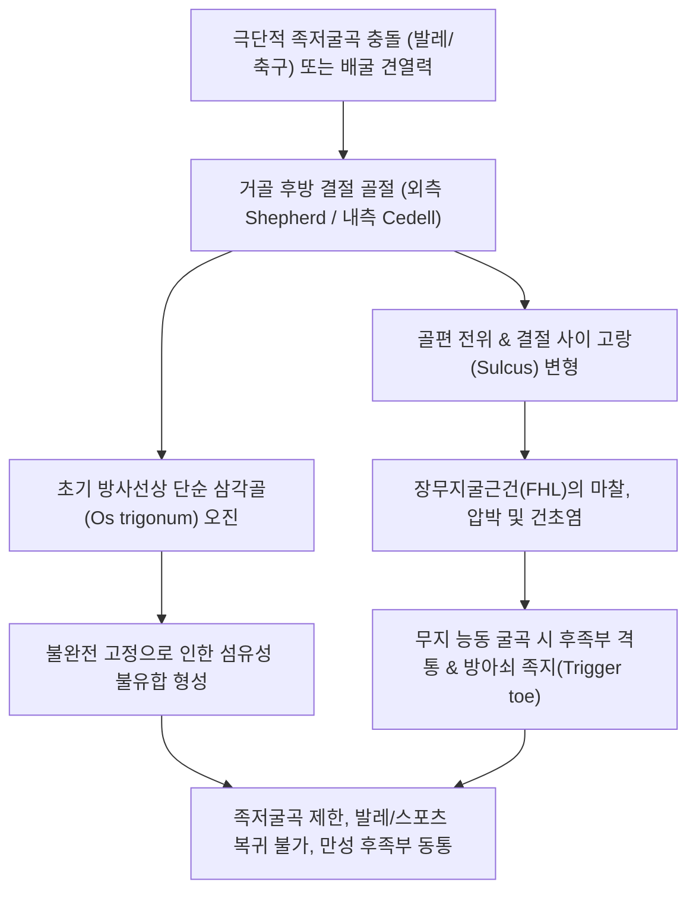

# 🩺 거골 후방돌기 골절 (Posterior Process Talus Fractures / Shepherd's & Cedell's Fractures)

> **핵심 3줄 요약 (Key Summary)**:
> - 📍 **병소 부위 & 해부·병태생리**: 거골 후방돌기(Posterior process of talus)는 외측 결절(Lateral tubercle)과 내측 결절(Medial tubercle), 그리고 그 사이로 주행하는 [[장무지굴근건]](FHL) 고랑(sulcus)으로 구성된다. 외측 결절 골절을 **[[셰퍼드 골절]](Shepherd's fracture)**, 내측 결절 골절을 **[[세델 골절]](Cedell's fracture)**이라 한다.
> - 🚩 **전형적 임상 양상**: 발목 후방 및 아킬레스건 심부의 지속적 둔통, 무지(엄지발가락) 수동 배굴 또는 능동 굴곡 시 후족부 격통(FHL 건초염 동반), 발레 무용수나 축구선수의 과도한 족저굴곡 시 후방 충돌(Posterior impingement). 정상 해부학적 부골인 **[[삼각골]](Os trigonum)**과의 감별 진단이 핵심이다.
> - 🛠️ **핵심 검사 & 치료 전략**: 족관절 측면(Lateral) 방사선 및 3차원 CT 확진. 비전위 골절은 4~6주 단하지 석고 고정, 2mm 이상 전위·불유합·FHL 건 포착 시 관절경하 나사 고정 또는 골편 절제술(Excision). 고정기 활혈화어([[당귀수산]], [[자연동]]) 및 만성 후방 충돌기 약침·도침을 통한 FHL 건초 유착 박리.
> - ⚠️ **응급 의뢰 레드플래그**: 거골 후방 탈구 동반, 족근관 내 후경골신경 급성 압박으로 인한 족저부 무감각증, 장무지굴근건의 완전 파열 또는 감돈 징후 시 정형외과 응급 전원.

---

## 📌 목차
1. [질환 개요 & 해부학적 병태생리](#1-질환-개요--해부학적-병태생리)
2. [병태생리 메커니즘 & 생체역학적 악순환 네트워크](#2-병태생리-메커니즘--생체역학적-악순환-네트워크)
3. [임상 증상 & 이학적 검사(Physical Exam) 알고리즘](#3-임상-증상--이학적-검사physical-exam-알고리즘)
4. [감별 진단 매트릭스 (Differential Diagnosis)](#4-감별-진단-매트릭스-differential-diagnosis)
5. [한의 통합 치료 프로토콜 (침·약침·추나·한약)](#5-한의-통합-치료-프로토콜-침약침추나한약)
6. [양방 치료 & 병용·의뢰 기준 (Conventional Treatment & Referral)](#6-양방-치료--병용의뢰-기준-conventional-treatment--referral)
7. [재활 운동 & 생활습관 티칭 가이드](#7-재활-운동--생활습관-티칭-가이드)
8. [💡 사용자 진료실 핵심 필기 & 임상 노하우 (Melt-In 잔여 심화 집약)](#8--사용자-진료실-핵심-필기--임상-노하우-melt-in-잔여-심화-집약)
9. [출처 및 학술 참고 문헌 (References)](#9-출처-및-학술-참고-문헌-references)

---

## 1. 질환 개요 & 해부학적 병태생리

거골 후방돌기(Posterior process of the talus)는 거골 활차 후방에서 후하방으로 돌출된 두 개의 뼈 결절로 이루어져 있다:
1. **외측 결절 (Lateral tubercle)**: 내측 결절보다 크며 후거비인대(PTFL)와 후거종인대(posterior talocalcaneal ligament)가 부착한다. 이 외측 결절의 골절을 1882년 Francis Shepherd가 처음 보고하여 **셰퍼드 골절(Shepherd's fracture)**이라 부른다.
2. **내측 결절 (Medial tubercle)**: 삼각인대(deltoid ligament)의 후경거 분지가 부착한다. 이 내측 결절의 골절을 1958년 Cedell이 기술하여 **세델 골절(Cedell's fracture)**이라 부른다.

> [그림 1: ① 병태생리·영상 — 거골 골절선 및 주변 인대 견열 손상 측면 방사선 (Wikimedia Commons)]

두 결절 사이에는 경사 진 고랑(Sulcus for flexor hallucis longus)이 형성되어 있으며, 이곳으로 엄지발가락을 굽히는 [[장무지굴근건]](Flexor hallucis longus tendon, FHL)이 활액초(tendon sheath)에 싸여 통과한다. 따라서 후방돌기가 골절되면 골편의 전위나 혈종, 가골 형성에 의해 FHL 건이 직접 자극받거나 감돈(entrapment)되어 협착성 건초염이 병발하기 쉽다.

> [그림 2: ① 병태생리·영상 — 족관절 측면 방사선에서 관찰되는 거골 후방돌기 및 삼각골 부위 해부학적 윤곽 (Wikimedia Commons)]

거골 후방돌기 골절은 전체 거골 골절의 약 10%를 차지하며, 단순 발목 염좌나 아킬레스건염, [[삼각골 증후군]](Os trigonum syndrome)으로 오진되어 수개월 이상 방치되는 사례가 매우 흔하다.

---

## 2. 병태생리 메커니즘 & 생체역학적 악순환 네트워크

### 손상 기전
거골 후방돌기 골절은 크게 두 가지 상반된 생체역학적 기전에 의해 발생한다:

> [그림 3: ② 관련 해부 구조물 — 거골 내측면 및 내측 결절(Medial tubercle) 해부도 (Henry Gray, Anatomy of the Human Body)]

> [그림 4: ② 관련 해부 구조물 — 거골 후방 결절 사이 고랑을 통과하는 장무지굴근(FHL) 근육 및 건의 주행 (Wikimedia Commons)]

1. **과도 족저굴곡에 의한 후방 충돌 압박 (Nutcracker effect)**:
   - 발레 무용수의 포앵트(en pointe) 자세, 축구 선수의 강력한 발등 슈팅 등 족관절이 극단적인 저측굴곡(Hyperplantarflexion) 상태에 도달할 때 발생한다.
   - 경골 후연(posterior malleolus)과 종골 상면 사이에서 거골 외측 결절이 호두까기 인형처럼 끼어 으스러지면서 파쇄된다 (Shepherd's fracture의 주 기전).
2. **과도 배굴-외번 또는 회번에 의한 인대 견열 (Avulsion mechanism)**:
   - 족관절의 급격한 배굴-외번(dorsiflexion-eversion) 손상 시 후거종인대 또는 삼각인대 후경거 분지가 팽팽하게 당겨지면서 내측 결절을 뜯어낸다 (Cedell's fracture의 주 기전).

---

## 3. 임상 증상 & 이학적 검사(Physical Exam) 알고리즘

### 임상 증상
- **후족부 심부 동통**: 아킬레스건 앞쪽, 족관절 후방 심부의 만성적인 뻐근함과 날카로운 찌름 통증.
- **발끝 서기 통증**: 까치발을 들거나 발목을 최대로 아래로 꺾을 때(족저굴곡) 뒤꿈치 깊은 곳에서 뼈가 부딪히는 통증 호소.
- **FHL 건초염 징후**: 엄지발가락을 바닥 쪽으로 힘껏 구부리거나, 검사자가 무지를 수동으로 강하게 위로 젖힐 때(dorsiflexion) 후과 후방에서 통증 유발. 간혹 엄지발가락이 걸렸다 풀리는 방아쇠 무지(Trigger toe) 증상 동반.

### 이학적 검사 알고리즘
1. **국소 촉진 검사**:
   - 아킬레스건 내측(내과 후방) 깊은 곳 압통: Cedell 골절 의심.
   - 아킬레스건 외측(외과 후방) 깊은 곳 압통: Shepherd 골절 의심.
2. **후방 충돌 검사 (Posterior impingement test)**:
   - 환자를 앙와위로 눕히고 무릎을 90도 굴곡시킨 상태에서 검사자가 족관절을 수동으로 급격하고 강하게 저측굴곡시킬 때 후방 통증 재현 (양성).
3. **무지 저항 굴곡 검사 (Resisted FHL test)**:
   - 발목을 중립위에 두고 엄지발가락의 저측굴곡을 저항할 때 후방 결절 부위에 통증이 발생하면 FHL 건초 자극 확진.
4. **영상 검사**:
   - **X-ray**: 족관절 Lateral 및 25도 외회전 사위상.
   - **CT 검사 (Gold standard)**: 골편의 유합 여부, 전위 정도, 그리고 **삼각골과의 감별**을 위해 필수적.

---

## 4. 감별 진단 매트릭스 (Differential Diagnosis)

거골 후방돌기 골절 진단의 핵심은 **정상 해부학적 변이인 [[삼각골]](Os trigonum)**과의 감별이다:

> [그림 5: ② 관련 해부 구조물 — 거골 후방 삼각골(Os trigonum)의 측면 방사선 해부학적 감별 위치 (Wikimedia Commons)]

> [그림 6: ② 관련 해부 구조물 — 족관절 주변 부골(Accessory bones) 중 거골 후방 삼각골의 모식도 (Wikimedia Commons)]

| 감별 포인트 | 셰퍼드/세델 골절 (Shepherd / Cedell) | 삼각골 (Os trigonum) | 삼각골 증후군 (Os trigonum syn.) |
| :--- | :--- | :--- | :--- |
| **정의** | 외상으로 인한 외측/내측 결절의 급성 골절 | 외측 결절의 이차 골화 중심 미융합 부골(7~14%) | 삼각골과 거골 체부 사이 섬유연골성 결합의 염증 |
| **병력** | 명확한 급성 외상력 (발목 꺾임, 강한 충격) | 외상력 없음 (우연히 발견) | 반복적인 족저굴곡 스포츠(발레, 축구) 미세손상 |
| **골편 변연 (Margin)** | **거칠고 불규칙(irregular), 피질골 결손** | **매끄럽고 둥글며 전 둘레가 피질골(cortex)로 둘러싸임** | 매끄러우나 접촉면 연골하 경화 및 낭종 가능 |
| **반대측 비교** | 대부분 편측성 손상 | 약 50%에서 양측성(Bilateral) 관찰 | 편측 증상이나 양측 방사선상 부골 존재 |
| **골 스캔 / MRI** | 급성기 골절선 주변 광범위 골수 부종(BME) | 골수 부종 없음, 정상 신호강도 | 삼각골 결합부 국소 신호 증강 및 FHL 건초 삼출 |

---

## 5. 한의 통합 치료 프로토콜 (침·약침·추나·한약)

후방돌기 골절 환자는 급성기 부목 고정 후에도 남아있는 FHL 건의 유착성 건초염과 족관절 후방 관절낭 연축으로 내원하는 경우가 많다.

### 1) 침구 및 전침 치료
- **주요 취혈점**: [[태계]](KI3, 내과와 아킬레스건 사이 - Cedell 골절 타깃), [[곤륜]](BL60, 외과와 아킬레스건 사이 - Shepherd 골절 타깃), [[수천]](KI5), [[복류]](KI7), [[부양]](BL59), [[태충]](LR3).
- **자침 기법**:
  - 태계혈 자침 시 침첨을 거골 후방돌기 고랑 방향으로 0.8~1.0촌 직자하여 FHL 건초 심부에 자극 전달.
  - 태계-곤륜 간 전침(2Hz, 저주파 연속파 20분) 적용으로 후방 족관절낭의 긴장 완화 및 미세 순환 개선.

### 2) 약침 및 봉약침 치료
- **[[신비약침]](소염진통) / [[중성어혈약침]]**: 곤륜 및 태계 부위 심부 결절면에 0.5cc씩 주입하여 골절 주변 어혈 및 활액막 부종 소퇴.
- **[[봉약침]](Sweet BV)**: 아킬레스건 전방 Kager 지방체 및 FHL 건 주행부를 따라 0.1cc 주입하여 만성 건초염의 염증 완화.

### 3) 침도요법 (Acupotomy)
- **적응증**: 골유합 완료 후에도 FHL 고랑 주변의 섬유성 유착으로 엄지발가락 굴신 시 걸림 및 뒤꿈치 심부 통증이 지속되는 만성 후방 충돌 환자.
- **시술 부위**: 태계혈 직하방 및 아킬레스건 내측 마진을 따라 소침도로 FHL 활액초 주변의 비후된 섬유대를 조심스럽게 박리(경골신경 및 후경골동맥 주행 경로를 피해 골면을 짚고 안전 시술).

### 4) 한약 치료
- **급성 고정기**: [[당귀수산]](當歸鬚散) 가미방 + **[[자연동]]**(自然銅, 醋淬) 2g/일 (골편 유합 촉진 및 혈종 흡수, PMID 38256337).
- **만성 충돌 및 건초염기**: 서경활혈탕(舒經活血湯) 또는 [[독활기생탕]](獨活寄生湯) 가감(목과, 오가피, 우슬 증량)으로 후족부 건-인대 유연성 회복.

---

## 6. 양방 치료 & 병용·의뢰 기준 (Conventional Treatment & Referral)

### 비수술적 보존 치료
- **적응증**: 전위가 없거나 2mm 미만인 급성 비전위 골절.
- **처치**: 단하지 석고 고정(Short leg cast) 또는 족관절 고정 부츠 착용.
- **자세 및 기간**: 발목을 약간의 배굴(중립위 0도) 상태로 유지하여 FHL 건의 긴장 완화, 4~6주간 고정(초기 2~3주 NWB).

### 수술적 치료 (Surgical Treatment)
- **적응증**:
  - 골편 전위가 2mm 이상으로 거골하 관절면 단차가 있는 경우.
  - 3~6개월 이상의 보존적 치료에도 불구하고 지속되는 섬유성 불유합.
  - 만성 후방 충돌 증후군(PAIS) 및 FHL 건 감돈으로 일상 복귀가 불가능한 경우.
- **수술 기법**:
  - **관절경하 내고정술(Arthroscopic ORIF)**: 대형 골편이며 거골하 관절면의 상당 부분을 포함하는 경우, 관절경 보조하에 2.0~2.5mm 소구경 나사로 고정 (Krivokapic et al., 2024; Zhang et al., 2025).
  - **골편 절제술(Excision of fragment)**: 골편이 작거나 분쇄된 경우, 또는 만성 불유합으로 유리체화된 경우 후방 관절경(posterior ankle arthroscopy)을 통해 골편을 완전히 절제하고 FHL 건초 감압술 병행 (Nikolopoulos et al., 2020).

### 1차 진료실 의뢰 기준
- **수술 의뢰**: 6주 보존 치료 후에도 FHL 건의 탄발음(Triggering)과 극심한 족저굴곡 장애가 지속되며, CT 상 전위된 골편이나 불유합이 관찰되는 경우 관절경 절제술을 위해 정형외과 족부 전문의 전원.

---

## 7. 재활 운동 & 생활습관 티칭 가이드

### 1) 단계별 재활 운동
- **1단계: FHL 건 글라이딩 운동 (고정 해제 직후)**:
  - 발목을 90도로 고정한 상태에서 엄지발가락만 천천히 굴곡 및 신전하여 고랑 내 FHL 건의 독립적 활주 유도.
- **2단계: 비복근 및 가자미근 스트레칭**:
  - 경사판(Slant board) 또는 수건을 이용한 족배굴곡 스트레칭으로 후방 관절낭 압박 감압.
- **3단계: 스포츠 맞춤 재활**:
  - 발레 무용수의 경우 포앵트 자세로의 복귀를 단계적으로 진행(Releve 훈련부터 점진 부하).

### 2) 생활습관 및 신발 티칭
- **하이힐 및 꽉 끼는 신발 금지**: 굽이 높은 신발은 발목을 지속적인 족저굴곡 상태로 유지시켜 후방돌기 충돌을 악화시키므로 중단.
- **축구화/무용화 인솔 패딩**: 뒤꿈치 힐 리프트(Heel lift)를 일시적으로 0.5cm 삽입하여 아킬레스건과 FHL 건의 과도한 신장 스트레스 경감.

---

## 8. 💡 사용자 진료실 핵심 필기 & 임상 노하우 (Melt-In 잔여 심화 집약)

- **Shepherd 골절 vs Os trigonum 임상 감별의 실전 팁**: 환자가 "과거에는 뒤꿈치가 아픈 적이 한 번도 없었는데, 이번에 운동하다 심하게 삔 이후로 발뒤꿈치 깊은 곳이 계속 아프다"고 호소하면, X-ray에 둥근 뼈 조각이 보여도 단순 삼각골로 치부하지 말고 급성 Shepherd 골절이나 삼각골 결합부 파열을 반드시 의심해야 한다.
- **엄지발가락 굴곡 시 후족부 통증의 가치**: 발목을 삐었는데 발가락을 움직일 때 발목 뒤쪽이 아프다고 하면 십중팔구 FHL 건 주행부의 거골 후방돌기 병변이다. 태계혈 심부를 만지며 엄지발가락을 구부려보게 하면 즉각적인 압통과 마찰음을 확인할 수 있다.

---

## 9. 출처 및 학술 참고 문헌 (References)

1. **Zhang S et al. (2025)**. Case Report: Arthroscopic treatment of cedell fracture, shepherd fracture, and avulsion fracture at the insertion of the calcaneofibular ligament. *Front Surg*, 12:1490126. [PMID 40200924](https://pubmed.ncbi.nlm.nih.gov/40200924/)
   - [연구 요약]: 복합 외측 인대 손상과 동반된 거골 후방돌기 내측 결절(Cedell) 및 외측 결절(Shepherd) 동시 골절의 후방 관절경하 해부학적 고정술 증례 보고.

2. **Krivokapic B et al. (2024)**. Arthroscopic reduction and internal fixation for fracture of the posterior process of the talus (Shepherd's fracture): a case report. *J Med Case Rep*, 18(1):347. [PMID 39075516](https://pubmed.ncbi.nlm.nih.gov/39075516/)
   - [연구 요약]: 거골 후방돌기 외측 결절 골절(Shepherd 골절)에서 최소침습 후방 관절경하 정복 및 나사 고정술의 조기 관절 기능 회복 효과 보고.

3. **Yang H et al. (2022)**. Anatomical observation, classification, fracture and finite element analysis of the posterior process of the Asian adult talus. *J Orthop Surg Res*, 17(1):444. [PMID 36209168](https://pubmed.ncbi.nlm.nih.gov/36209168/)
   - [연구 요약]: 아시아 성인 거골 후방돌기의 3D CT 형태학적 분류(돌출형, 원형, 둔각형) 및 유한요소 분석을 통한 후방 충돌 골절의 생체역학적 응력 집중 분석.

4. **Qin DA et al. (2020)**. Combined anterior and posterior ankle impingement syndrome with nonunion of Cedell fracture in a 58-year-old female: a case report. *BMC Musculoskelet Disord*, 21(1):556. [PMID 32811509](https://pubmed.ncbi.nlm.nih.gov/32811509/)
   - [연구 요약]: 거골 후방 내측 결절(Cedell) 골절의 불유합으로 인해 초래된 전후방 복합 발목 충돌 증후군의 임상 양상 및 불유합 골편 절제술의 결과 분석.

5. **Nikolopoulos D et al. (2020)**. Endoscopic Treatment of Posterior Ankle Impingement Secondary to Os Trigonum in Recreational Athletes. *Foot Ankle Orthop*, 5(3):2473011420945330. [PMID 35097403](https://pubmed.ncbi.nlm.nih.gov/35097403/)
   - [연구 요약]: 생활 체육인에서 삼각골 및 거골 후방돌기 병변으로 인한 만성 후방 발목 충돌 증후군에서 내시경적 절제술의 통증 완화 및 운동 복귀율 평가.

6. **Nam EY et al. (2023)**. Therapeutic Efficacy of Chinese Patent Medicine Containing Pyrite for Fractures: A Systematic Review and Meta-Analysis. *Medicina (Kaunas)*, 60(1):164. [PMID 38256337](https://pubmed.ncbi.nlm.nih.gov/38256337/)
   - [연구 요약]: 자연동(Pyrite) 함유 한약 복합 제제가 사지 및 족부 골절의 가골 형성 촉진 및 유합 지연 예방에 미치는 유효성 메타분석.

---

## 관련 노트

- [[거골]]
- [[거골 골절]]
- [[거골 경부 골절]]
- [[거골 외측돌기 골절]]
- [[거골 체부 골절]]
- [[삼각골]]
- [[장무지굴근건]]
- [[아킬레스건]]
- [[자연동]]
- [[당귀수산]]
- [[독활기생탕]]
- [[태계]]
- [[곤륜]]
